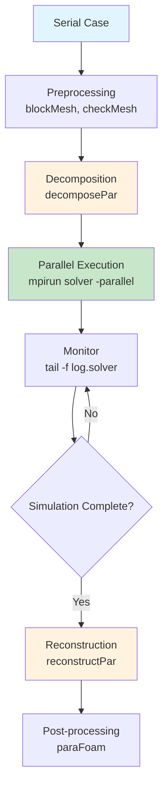

# High-Performance Computing in OpenFOAM

High-Performance Computing for OpenFOAM

---

**Estimated Reading Time:** 25 minutes

**Prerequisites:** 
- Basic OpenFOAM case structure ([Module 1](../../../MODULE_01_CFD_FUNDAMENTALS/CONTENT/04_FIRST_SIMULATION/04_Step-by-Step_Tutorial.md))
- Understanding of boundary conditions and initial conditions ([Module 1](../../../MODULE_01_CFD_FUNDAMENTALS/CONTENT/03_BOUNDARY_CONDITIONS/05_Common_Boundary_Conditions_in_OpenFOAM.md))

---

## Learning Objectives

By the end of this module, you will be able to:

- **Explain** what High-Performance Computing (HPC) is and why it matters for CFD simulations
- **Apply** domain decomposition techniques using `decomposePar` with appropriate methods
- **Execute** parallel runs efficiently on local machines and clusters
- **Optimize** linear solver settings for parallel performance
- **Diagnose** load balance issues and improve parallel efficiency
- **Calculate** optimal processor counts for different simulation types

---

## Overview

OpenFOAM simulations can be computationally demanding, especially for large-scale problems involving millions of cells. **High-Performance Computing (HPC)** enables faster simulations through parallel processing using **MPI** (Message Passing Interface).

The parallel workflow consists of three main steps:

1. **Decompose** — Divide the mesh into subdomains
2. **Run** — Execute solver in parallel with `mpirun`
3. **Reconstruct** — Merge results back for post-processing

---

## 1. What is High-Performance Computing?

### What (Definition)

**High-Performance Computing (HPC)** refers to the aggregation of computing power to deliver much higher performance than one could get out of a typical desktop computer or workstation. In OpenFOAM, this means:
- Using multiple CPU cores simultaneously
- Distributing computational workload across processors
- Solving larger problems in reasonable time

### Why (Benefits)

#### Speedup Example

Consider a 10 million cell simulation:

| Configuration | Time (hours) | Speedup |
|---------------|--------------|---------|
| Serial (1 core) | 120 | 1× |
| 4 cores | 35 | 3.4× |
| 16 cores | 12 | 10× |
| 64 cores | 5 | 24× |

**Key Insight:** Parallel computing enables:
- **Faster turnaround** — Run more design iterations
- **Larger problems** — Simulate geometries with 100M+ cells
- **Better resolution** — Use finer meshes without unreasonable wait times

#### When to Use Parallel Computing

- **Small cases** (< 500K cells): Serial is sufficient
- **Medium cases** (500K - 5M cells): 4-16 cores
- **Large cases** (5M - 50M cells): 16-64 cores
- **Very large cases** (> 50M cells): 64+ cores, cluster computing

---

## 2. Domain Decomposition

### How It Works

```
Serial Mesh → Decompose → Parallel Execution → Reconstruct

    Original Domain
    ┌─────────────────────────────────────┐
    │                                     │
    │         Single Large Mesh           │
    │         (10 million cells)          │
    │                                     │
    └─────────────────────────────────────┘
                   ↓ decomposePar
    ┌─────────┬─────────┬─────────┬─────────┐
    │ Proc 0  │ Proc 1  │ Proc 2  │ Proc 3  │
    │         │         │         │         │
    │  2.5M   │  2.5M   │  2.5M   │  2.5M   │
    │ cells   │ cells   │ cells   │ cells  │
    │         │         │         │         │
    │  Mesh   │  Mesh   │  Mesh   │  Mesh  │
    │  Zone 0 │  Zone 1 │  Zone 2 │  Zone 3 │
    └─────────┴─────────┴─────────┴─────────┘
                   ↓ mpirun -np 4
         [Parallel Solving on 4 Cores]
                   ↓ reconstructPar
    ┌─────────────────────────────────────┐
    │                                     │
    │         Reconstructed Results       │
    │                                     │
    └─────────────────────────────────────┘
```

### Processor Communication

```
    Proc 0        Proc 1        Proc 2        Proc 3
    ┌───────┐    ┌───────┐    ┌───────┐    ┌───────┐
    │       │    │       │    │       │    │       │
    │  ...  │◄──►│  ...  │◄──►│  ...  │◄──►│  ...  │
    │       │    │       │    │       │    │       │
    └───────┘    └───────┘    └───────┘    └───────┘
       │            │            │            │
       └────────────┴────────────┴────────────┘
                    MPI Communication
              (Data exchange at boundaries)
```

**Key Point:** Processors must communicate boundary data at each time step. Good decomposition minimizes communication.

### decomposeParDict Configuration

```cpp
// system/decomposeParDict
numberOfSubdomains  16;       // Number of processors

method              scotch;   // Recommended for best load balance
// Alternative methods: simple, metis, hierarchical, manual

// Optional: Preserve boundary patches
constraints
{
    preservePatches
    {
        type    preservePatches;
        patches (inlet outlet);
    }
}

// Optional: Coefficient for scotch method
scotchCoeffs
{
    processorWeights
    (
        1
        1
        1
        1
    );
}
```

### Decomposition Methods Comparison

| Method | Load Balance | Scalability | Best Use Case |
|--------|-------------|-------------|---------------|
| `simple` | Low | Poor | Uniform structured meshes (debugging) |
| `scotch` | Excellent | Excellent | General purpose (recommended) |
| `metis` | Excellent | Excellent | Alternative to scotch |
| `hierarchical` | Moderate | Moderate | Multi-level clusters |
| `manual` | User-defined | Variable | Special cases with known optimal split |

**Recommendation:** Use `scotch` for most cases. It uses graph-based partitioning that considers mesh connectivity for optimal load balancing.

### Practical Commands

```bash
# Decompose case
decomposePar

# Decompose with specific regions
decomposePar -regions '(fluid solid)'

# Check decomposition quality
decomposePar -debug

# Clean all processor directories
rm -rf processor*

# Check decomposition results
ls -la processor*/constant/polyMesh/
```

---

## 3. Parallel Execution

### Running Parallel Simulations

#### Local Machine (Multi-core)

```bash
# Basic parallel run
mpirun -np 16 simpleFoam -parallel > log.simpleFoam &

# With OpenMP threads mixed
mpirun -np 4 --map-by ppr:2:node simpleFoam -parallel -threads 4

# Run in background with nohup
nohup mpirun -np 16 simpleFoam -parallel > log.simpleFoam 2>&1 &

# Monitor progress
tail -f log.simpleFoam
```

#### Cluster/SLURM

```bash
#!/bin/bash
#SBATCH --job-name=openfoam_sim
#SBATCH --nodes=4
#SBATCH --ntasks-per-node=16
#SBATCH --time=24:00:00
#SBATCH --partition=compute

module load openmpi/4.1.1
source /opt/openfoam/etc/bashrc

# Run simulation
mpirun -np 64 simpleFoam -parallel
```

### Hostfile Format

```bash
# hosts file - specify available slots per node
node1 slots=16 max_slots=32
node2 slots=16 max_slots=32
node3 slots=16 max_slots=32
node4 slots=16 max_slots=32

# Use with:
mpirun -np 64 --hostfile hosts simpleFoam -parallel
```

### Monitoring Parallel Performance

```bash
# Monitor log file
tail -f log.simpleFoam

# Check CPU usage
htop

# Check memory usage
free -h

# Monitor with pyFoam (if installed)
pyFoamPlotRunner.py simpleFoam
```

---

## 4. Linear Solvers in Parallel

Linear solvers are critical for parallel performance. The choice depends on equation type and matrix properties.

### fvSolution Settings

```cpp
// system/fvSolution
solvers
{
    p
    {
        solver          GAMG;              // Geometric-Algebraic Multigrid
        preconditioner  GAMG;
        tolerance       1e-6;
        relTol          0.01;
        smoother        GaussSeidel;
        nPreSweeps      0;
        nPostSweeps     2;
        cacheAgglomeration on;
        nCellsInCoarsestLevel 50;
        
        // Parallel-specific settings
        mergeLevels     1;
    }
    
    U
    {
        solver          PBiCGStab;         // Stabilized Bi-Conjugate Gradient
        preconditioner  DILU;
        tolerance       1e-5;
        relTol          0.1;
        minIter         0;
        maxIter         1000;
    }
    
    "(k|epsilon|omega|nuTilda)"
    {
        solver          smoothSolver;
        smoother        symGaussSeidel;
        tolerance       1e-5;
        relTol          0.1;
        nSweeps         1;
    }
}
```

### Solver Selection Guide

| Variable | Equation Type | Recommended Solver | Preconditioner | Notes |
|----------|--------------|-------------------|----------------|-------|
| Pressure (p) | Elliptic, symmetric | **GAMG** | GAMG | Best scalability O(n) |
| Velocity (U) | Hyperbolic, non-symmetric | **PBiCGStab** | DILU | Good for convection-dominated |
| Turbulence (k, ε, ω) | Scalar transport | **smoothSolver** | symGaussSeidel | Efficient for scalar fields |
| Temperature (T) | Scalar | **smoothSolver** | DIC/DILU | Depends on coupling |
| Porosity zones | Transport | **PBiCGStab** | DILU | Handle non-symmetry |

### GAMG Solver Details

**What:** Geometric-Algebraic Multigrid solver  
**Why:** Optimal O(n) complexity, excellent for pressure equations  
**How:** Uses multiple grid levels to accelerate convergence

```cpp
GAMG
{
    // Agglomeration settings
    nCellsInCoarsestLevel 50;      // Target cells in coarsest grid
    nFineLevels       4;            // Number of refinement levels
    
    // Smoother settings
    smoother          GaussSeidel;  // Can use: GaussSeidel, symGaussSeidel
    nPreSweeps        0;            // Pre-smoothing sweeps
    nPostSweeps       2;            // Post-smoothing sweeps
    
    // Performance options
    cacheAgglomeration on;          // Cache agglomeration (reuse)
    mergeLevels       1;            // Merge nearby levels
    
    // Direct solver on coarsest grid
    directSolveCoarest    on;       // Use direct solver at bottom
}
```

### PBiCGStab Solver Details

**What:** Preconditioned Bi-Conjugate Gradient Stabilized  
**Why:** Handles non-symmetric matrices efficiently  
**How:** Krylov subspace method with stabilization

```cpp
PBiCGStab
{
    preconditioner  DILU;          // Diagonal Incomplete LU
    // Alternative preconditioners:
    // - DILU: Diagonal (default, good parallel)
    // - FDILU: Factorized DILU (better serial)
    
    tolerance       1e-5;
    relTol          0.1;
    minIter         0;
    maxIter         1000;
}
```

### Solver Performance Tips

1. **Pressure always uses GAMG** — Best parallel scalability
2. **Momentum uses PBiCGStab** — Handles non-symmetry from convection
3. **Check convergence** — High iteration counts suggest poor conditioning
4. **Cache agglomeration** — Saves time on subsequent solves
5. **Monitor solver residuals** — Look for stagnation

---

## 5. Load Balancing

### Understanding Load Balance

**Perfect load balance:** Each processor has equal work and finishes simultaneously  
**Poor load balance:** Some processors idle while others work

### Checking Load Balance

```bash
# Method 1: Count cells per processor
for proc in processor*; do
    cells=$(grep "nCells:"1$proc/constant/polyMesh/owner | head -1 | awk '{print1$2}')
    echo "$proc:1$cells cells"
done

# Method 2: Use decomposePar -debug
decomposePar -debug 2>&1 | grep "cells"

# Method 3: Check during runtime
grep "cells" log.simpleFoam
```

### Imbalance Metric

Calculate the load imbalance factor:

$$\mathcal{I} = \frac{W_{max} - W_{avg}}{W_{avg}}$$

Where:
-1$W_{max}1= Maximum cells per processor
-1$W_{avg}1= Average cells per processor

| Imbalance1$\mathcal{I}1| Quality | Action |
|------------------------|---------|--------|
| < 0.05 | Excellent | None needed |
| 0.05 - 0.10 | Very Good | None needed |
| 0.10 - 0.20 | Good | Acceptable |
| 0.20 - 0.30 | Fair | Consider re-decomposition |
| > 0.30 | Poor | Redecompose with better method |

### Improving Load Balance

```bash
# Use scotch instead of simple
# Edit decomposeParDict
method scotch;

# For complex geometries, try metis
method metis;

# For adaptive mesh refinement
method hierarchical;

hierarchicalCoeffs
{
    n (4 4);  // 2-level hierarchy: 4×4 = 16 processors
}
```

---

## 6. Memory and Performance Optimization

### Memory Estimation

Approximate memory requirement:

$$\text{RAM (GB)} \approx \frac{nCells \times nFields \times 50 \text{ bytes}}{10^9} \times 2$$

Where factor of 2 accounts for solver workspace.

| Mesh Size | Fields | RAM per Core (16 cores) | Total RAM |
|-----------|--------|------------------------|-----------|
| 1M cells | 10 | ~0.6 GB | 10 GB |
| 10M cells | 10 | ~6 GB | 100 GB |
| 50M cells | 10 | ~30 GB | 500 GB |
| 100M cells | 10 | ~60 GB | 1 TB |

**Note:** LES/DNS with more turbulence fields requires 2-3× more memory.

### Optimal Cells per Core

| Simulation Type | Min | Optimal | Max |
|----------------|-----|---------|-----|
| **RANS** | 50K | 100-200K | 500K |
| **LES** | 10K | 30-50K | 100K |
| **DNS** | 1K | 5-10K | 20K |

**Rule of thumb:** Fewer cells per core = more communication overhead

### Performance Monitoring

```bash
# Check MPI communication
mpirun -np 16 --mca btl_tcp_if_include eth0 simpleFoam -parallel

# Profile with MPI
mpirun -np 16 --mca ptl_tcp_if_include eth0 simpleFoam -parallel

# Monitor during run
watch -n 1 'grep "Time =" log.simpleFoam | tail -1'

# Check load balance dynamically
mpstat -P ALL 1
```

### Speedup Efficiency

Calculate parallel efficiency:

$$E_p = \frac{S_p}{p} = \frac{T_1 / T_p}{p}$$

Where:
-1$S_p1= Speedup on1$p1processors
-1$T_11= Serial runtime
-1$T_p1= Parallel runtime
-1$p1= Number of processors

| Efficiency | Interpretation |
|-----------|----------------|
| > 90% | Excellent scaling |
| 70-90% | Good scaling |
| 50-70% | Moderate scaling |
| < 50% | Poor scaling (too many cores) |

---

## 7. Complete Parallel Workflow

### Workflow Diagram



### Complete Example Script

```bash
#!/bin/bash
# parallel_run.sh - Complete OpenFOAM parallel workflow

# ============================================
# Configuration
# ============================================
NP=16                    # Number of processors
SOLVER=simpleFoam        # Solver name
CASE_DIR=$(pwd)          # Case directory

# Colors for output
RED='\033[0;31m'
GREEN='\033[0;32m'
YELLOW='\033[1;33m'
NC='\033[0m' # No Color

echo -e "${GREEN}=== OpenFOAM Parallel Run Script ===${NC}"
echo "Number of processors:1$NP"
echo "Solver:1$SOLVER"
echo ""

# ============================================
# Step 1: Pre-processing
# ============================================
echo -e "${YELLOW}[1/5] Running blockMesh...${NC}"
blockMesh > log.blockMesh 2>&1
if [1$? -ne 0 ]; then
    echo -e "${RED}blockMesh failed! Check log.blockMesh${NC}"
    exit 1
fi

echo -e "${YELLOW}[1/5] Checking mesh quality...${NC}"
checkMesh > log.checkMesh 2>&1

# ============================================
# Step 2: Decomposition
# ============================================
echo -e "${YELLOW}[2/5] Decomposing case for1$NP processors...${NC}"
decomposePar > log.decomposePar 2>&1
if [1$? -ne 0 ]; then
    echo -e "${RED}decomposePar failed! Check log.decomposePar${NC}"
    exit 1
fi

# Check load balance
echo "Load balance check:"
for proc in processor*; do
    cells=$(grep "nCells:"1$proc/constant/polyMesh/owner 2>/dev/null | head -1 | awk '{print1$2}')
    if [ ! -z "$cells" ]; then
        echo "1$proc:1$cells cells"
    fi
done

# ============================================
# Step 3: Parallel Execution
# ============================================
echo -e "${YELLOW}[3/5] Starting parallel solve...${NC}"
echo "Log file: log.$SOLVER"
echo "Monitor with: tail -f log.$SOLVER"
echo ""

mpirun -np1$NP1$SOLVER -parallel > log.$SOLVER 2>&1
SOLVER_EXIT=$?

if [1$SOLVER_EXIT -ne 0 ]; then
    echo -e "${RED}Solver failed! Check log.$SOLVER${NC}"
    exit 1
fi

# ============================================
# Step 4: Reconstruction
# ============================================
echo -e "${YELLOW}[4/5] Reconstructing results...${NC}"
reconstructPar -latestTime > log.reconstructPar 2>&1
if [1$? -ne 0 ]; then
    echo -e "${RED}reconstructPar failed! Check log.reconstructPar${NC}"
    exit 1
fi

# ============================================
# Step 5: Post-processing
# ============================================
echo -e "${YELLOW}[5/5] Opening paraFoam...${NC}"
paraFoam -builtin

echo -e "${GREEN}=== Simulation Complete! ===${NC}"
```

### Usage

```bash
# Make script executable
chmod +x parallel_run.sh

# Run
./parallel_run.sh

# Or with custom settings
NP=32 SOLVER=pimpleFoam ./parallel_run.sh
```

---

## 8. Practical Exercise

### Exercise: Parallel Cavity Simulation

**Objective:** Run the lid-driven cavity case in parallel and analyze performance.

**Prerequisites:** Completed Module 1 cavity tutorial

#### Steps

1. **Start from serial case**
   ```bash
   cd1$FOAM_RUN/cavity
   cp -r cavity cavity_parallel
   cd cavity_parallel
   ```

2. **Create decomposeParDict**
   ```bash
   mkdir -p system
   cat > system/decomposeParDict << 'EOF'
   numberOfSubdomains 4;
   
   method  scotch;
   
   constraints
   {
       preservePatches
       {
           type    preservePatches;
           patches (movingWall);
       }
   }
   EOF
   ```

3. **Run parallel**
   ```bash
   decomposePar
   mpirun -np 4 icoFoam -parallel > log.icoFoam 2>&1
   reconstructPar -latestTime
   ```

4. **Analyze results**
   - Compare serial vs parallel runtime
   - Check cells per processor
   - Calculate speedup:1$S_4 = T_{serial} / T_{parallel}$

#### Expected Results

| Configuration | Time (s) | Speedup | Efficiency |
|---------------|----------|---------|------------|
| Serial (1 core) | ~180 | 1.0× | 100% |
| 4 cores | ~55 | 3.3× | 82% |
| 8 cores | ~35 | 5.1× | 64% |

**Discussion Questions:**
1. Why is efficiency < 100%?
2. What happens with too many cores for this small case?
3. How does decomposePar method affect results?

---

## 9. Troubleshooting

### Common Issues

#### Issue: Decomposition Fails

**Symptoms:**
```
--> FOAM FATAL ERROR:
Cannot find file "processor0/constant/polyMesh/owner"
```

**Solutions:**
```bash
# Check mesh exists
ls constant/polyMesh/

# Re-run mesh generation
blockMesh

# Check decomposeParDict syntax
decomposePar -debug
```

#### Issue: Poor Speedup

**Symptoms:** Adding cores doesn't improve performance

**Diagnosis:**
```bash
# Check cells per core
# Should be > 50K for RANS

# Check communication
mpirun -np 16 --mca btl_tcp_if_include eth0 solver -parallel

# Check solver iteration counts
grep "solver iterations" log.solver
```

**Solutions:**
- Reduce core count (increase cells/core)
- Use better decomposition method (scotch)
- Optimize solver settings

#### Issue: Out of Memory

**Symptoms:** Simulation killed during execution

**Solutions:**
```bash
# Reduce cores (increases memory per core)
# Use fewer parallel fields

# Check memory usage
free -h

# Run with memory monitoring
/usr/bin/time -v mpirun -np 16 solver -parallel
```

---

## Key Takeaways

### Core Concepts

✓ **What:** HPC in OpenFOAM uses MPI to distribute computational workload across multiple processors

✓ **Why:** Parallel computing enables:
- Faster simulations (3-30× speedup typical)
- Larger problem sizes (100M+ cells)
- More design iterations in same time

✓ **How:** Three-step workflow:
1. `decomposePar` — Split domain into subdomains
2. `mpirun -np N solver -parallel` — Execute in parallel
3. `reconstructPar` — Merge results for post-processing

### Best Practices

**Domain Decomposition:**
- Use `scotch` method for best load balance
- Check cell distribution after decomposition
- Target 50K-200K cells/core for RANS

**Linear Solvers:**
- **Pressure:** GAMG (best parallel scalability)
- **Velocity:** PBiCGStab (handles non-symmetry)
- **Scalars:** smoothSolver (efficient for transport)

**Performance:**
- Monitor solver residuals and iteration counts
- Calculate parallel efficiency (>70% is good)
- Reduce cores if cells/core < 10,000

### Quick Reference

| Task | Command |
|------|---------|
| Decompose | `decomposePar` |
| Run parallel | `mpirun -np 16 solver -parallel` |
| Reconstruct | `reconstructPar -latestTime` |
| Check balance | Loop through `processor*/` directories |
| Monitor | `tail -f log.solver` |

### Next Steps

- **Advanced Topics:** GPU acceleration, hybrid MPI/OpenMP
- **Cluster Computing:** SLURM scripts, job scheduling
- **Solver Tuning:** Advanced preconditioners, coupling

---

## Related Documents

**Prerequisites:**
- [Basic Case Structure](../../../MODULE_01_CFD_FUNDAMENTALS/CONTENT/04_FIRST_SIMULATION/04_Step-by-Step_Tutorial.md) — Module 1
- [Boundary Conditions](../../../MODULE_01_CFD_FUNDAMENTALS/CONTENT/03_BOUNDARY_CONDITIONS/05_Common_Boundary_Conditions_in_OpenFOAM.md) — Module 1

**Current Module:**
- [00_Overview.md](00_Overview.md) — Module overview and roadmap
- [03_Numerical_Methods.md](03_Numerical_Methods.md) — AMR and discretization schemes (solver content removed to avoid redundancy)

**Advanced:**
- [02_Advanced_Turbulence.md](02_Advanced_Turbulence.md) — Advanced turbulence modeling for large-scale cases