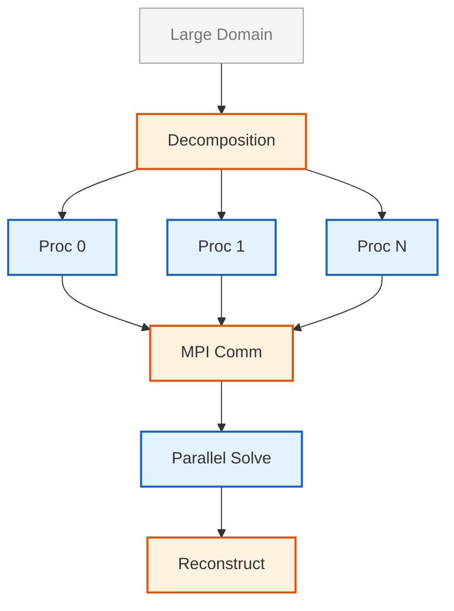
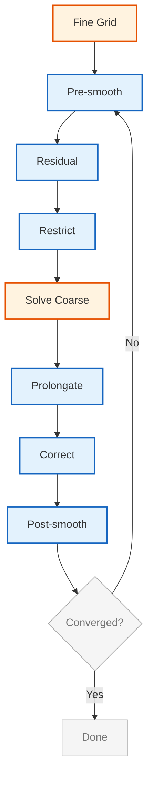
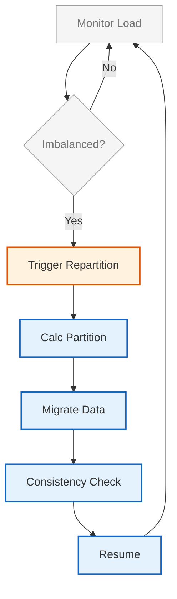

# การประมวลผลสมรรถนะสูง (High-Performance Computing)

## 📖 บทนำ (Introduction)

**High-Performance Computing (HPC)** เป็นเทคโนโลยีที่จำเป็นสำหรับการจำลอง CFD ขนาดใหญ่ที่มีเซลล์นับล้านหรือพันล้าน OpenFOAM ถูกออกแบบมาตั้งแต่ต้นสำหรับ **Parallel Computing** ผ่าน **MPI (Message Passing Interface)** สถาปัตยกรรมแบบขนานนี้ช่วยให้สามารถแบ่งโดเมน (domain decomposition) ซึ่งตาข่ายการคำนวณ (computational mesh) จะถูกแบ่งออกเป็นส่วนย่อยๆ (sub-domains) โดยแต่ละส่วนจะถูกประมวลผลโดยโปรเซสเซอร์แยกต่างหาก



> **Figure 1:** แผนผังลำดับขั้นตอนการประมวลผลแบบขนาน (Parallel Processing) ตั้งแต่การแบ่งโดเมนการคำนวณ (Domain Decomposition) การสื่อสารระหว่างโปรเซสเซอร์ผ่าน MPI ที่ส่วนต่อประสาน ไปจนถึงการแก้ปัญหาแบบขนานและการรวมผลลัพธ์ขั้นสุดท้าย

> [!INFO] ความสำคัญของ HPC
> การจำลอง CFD ขนาดใหญ่ต้องการ:
> - **หน่วยความจำ** หลาย GB ถึง TB
> - **เวลาคำนวณ** หลายวันถึงหลายสัปดาห์บน CPU เครื่องเดียว
> - **การประมวลผลแบบขนาน** ช่วยลดเวลาลงอย่างมาก

---

## 📐 1. สถาปัตยกรรม Parallel Solver (Parallel Solver Architecture)

### 1.1 การแบ่งโดเมน (Domain Decomposition)

การแบ่งปริภูมิแบบ Finite Volume ทำให้เกิดระบบสมการเชิงเส้น $A\mathbf{x} = \mathbf{b}$ โดยที่:

- $A$ คือ **sparse coefficient matrix** (เมทริกซ์สัมประสิทธิ์เบาบาง)
- $\mathbf{x}$ คือ **vector** ของค่า field ที่ไม่ทราบค่า
- $\mathbf{b}$ คือ **vector** ของ source term

ในการประมวลผลแบบขนาน ระบบนี้จะถูกกระจายไปยังโปรเซสเซอร์ต่างๆ:

```
processor0: A0 x0 = b0
processor1: A1 x1 = b1
processor2: A2 x2 = b2
...
มีการแลกเปลี่ยนข้อมูลผ่าน MPI ที่ขอบเขตของโปรเซสเซอร์
```

### 1.2 การแบ่งโดเมนทางคณิตศาสตร์ (Mathematical Formulation)

โดเมนการคำนวณ $\Omega$ จะถูกแบ่งเป็นโดเมนย่อย:

$$\Omega = \bigcup_{i=1}^{N} \Omega_i \quad \text{โดยที่} \quad \Omega_i \cap \Omega_j = \emptyset \text{ สำหรับ } i \neq j$$

การสื่อสารเกิดขึ้นที่ส่วนต่อประสาน (interfaces):

$$\Gamma_{ij} = \partial \Omega_i \cap \partial \Omega_j$$

### 1.3 อัลกอริทึมการแบ่ง (Decomposition Methods)

| วิธีการ | ลักษณะ | ข้อดี | ข้อเสีย | การใช้งานที่เหมาะสม |
|---------|--------|--------|---------|---------------------|
| **simple** | แบ่งแบบเรขาคณิต (X, Y, Z) | ง่ายต่อการใช้งาน | Load imbalance สูง | Mesh ที่เป็น uniform |
| **scotch** | Graph-based partitioning | Load balance ดี | ต้องการ library เพิ่ม | งานทั่วไป (แนะนำ) |
| **metis** | Graph-based partitioning | Load balance ดี | ต้องการ library เพิ่ม | งานทั่วไป |
| **manual** | ผู้ใช้กำหนดเอง | ควบคุมได้สูง | ซับซ้อน | กรณีพิเศษ |

### 1.4 การตั้งค่า `decomposeParDict`

```cpp
// File: system/decomposeParDict
// Configuration file for domain decomposition in OpenFOAM

// Specify the number of subdomains (processors) for parallel computation
numberOfSubdomains  64;

// Select decomposition method: simple, scotch, metis, manual, hierarchical
method              scotch;

// Constraint settings to preserve specific boundaries during decomposition
constraints
{
    // Maintain boundary patch integrity across processors
    // Useful for inlet, outlet, and wall boundaries
    preservePatches    (inlet outlet walls);
}

// Detailed load balancing configuration for Scotch method
scotchCoeffs
{
    // Assign custom weights to processors for load balancing
    // Values > 1.0 indicate higher computational capacity
    // Values < 1.0 indicate lower computational capacity
    processorWeights
    {
        1   1.0;    // Processor 1: standard weight
        2   1.2;    // Processor 2: 20% more capacity
        3   0.8;    // Processor 3: 20% less capacity
    }
}
```

> **📌 คำอธิบาย (Source: .applications/utilities/parallelProcessing/decomposePar/decomposePar.C)**
> 
> **แหล่งที่มา:** ไฟล์ decomposePar.C เป็น utility หลักของ OpenFOAM ที่ใช้สำหรับแบ่งโดเมน (domain decomposition) ซึ่งเป็นขั้นตอนแรกที่จำเป็นก่อนการรัน simulation แบบ parallel
>
> **การอธิบาย:** decomposePar ทำหน้าที่อ่านเมชและเงื่อนไขขอบเขตจากกรณีแบบเดี่ยว (serial case) และสร้างไดเรกทอรี processor0, processor1, ... processorN สำหรับแต่ละ sub-domain โดยแต่ละ processor จะได้รับส่วนหนึ่งของเมชและข้อมูลเกี่ยวกับส่วนต่อประสานระหว่าง processors สำหรับการสื่อสารผ่าน MPI
>
> **แนวคิดสำคัญ:**
> - **numberOfSubdomains**: จำนวน subdomains ที่ต้องการแบ่ง ซึ่งควรตรงกับจำนวน processor cores ที่มี
> - **method**: วิธีการแบ่งโดเมน scotch เป็นวิธีที่แนะนำเพราะให้ load balance ที่ดี
> - **preservePatches**: ระบุ boundary patches ที่ต้องการให้อยู่ใน processor เดียว เพื่อลดการสื่อสาร
> - **processorWeights**: ใช้กำหนดน้ำหนักเมื่อ processors มีกำลังประมวลผลต่างกัน

---

## ⚡ 2. Linear Solver Parallelization (การประมวลผลแบบขนานของ Solver เชิงเส้น)

### 2.1 วิธีการ Krylov Subspace (Krylov Subspace Methods)

#### **Conjugate Gradient (CG) Method**

วิธีการ CG แก้ปัญหาระบบเชิงเส้นสมมาตรเชิงบวก:

$$\mathbf{x}_{k+1} = \mathbf{x}_k + \alpha_k \mathbf{p}_k$$

โดยที่:
- $\alpha_k = \frac{\mathbf{r}_k^T \mathbf{r}_k}{\mathbf{p}_k^T \mathbf{A} \mathbf{p}_k}$ คือ step length
- $\mathbf{p}_k$ คือ search direction
- $\mathbf{r}_k = \mathbf{b} - \mathbf{A}\mathbf{x}_k$ คือ residual

#### **GMRES Method**

**Generalized Minimal Residual (GMRES)** ทำให้ residual มีค่าน้อยที่สุดใน Krylov subspace:

$$\mathcal{K}_m = \text{span}\{\mathbf{r}, \mathbf{A}\mathbf{r}, \ldots, \mathbf{A}^{m-1}\mathbf{r}\}$$

$$\mathbf{x}_m = \arg\min_{\mathbf{x} \in \mathbf{x}_0 + \mathcal{K}_m} \|\mathbf{b} - \mathbf{A}\mathbf{x}\|_2$$

กระบวนการ **Arnoldi** สร้าง orthonormal basis vectors $\{\mathbf{v}_i\}$:

$$\mathbf{A}\mathbf{V}_m = \mathbf{V}_{m+1}\mathbf{H}_m$$

โดยที่ $\mathbf{H}_m$ คือ **upper Hessenberg matrix**

### 2.2 การทำให้เป็นเงื่อนไขเบื้องต้น (Preconditioning)

การทำ preconditioner ช่วยเร่งการลู่เข้าของ iterative solvers

#### **Block Jacobi Preconditioner**

$$\mathbf{M}^{-1} = \text{diag}(\mathbf{A})^{-1}$$

ข้อดี: ง่ายต่อการขนาน (parallel-friendly)

#### **Additive Schwarz Preconditioner**

$$\mathbf{M}^{-1} = \sum_{i=1}^{N} \mathbf{R}_i^T \mathbf{A}_i^{-1} \mathbf{R}_i$$

โดยที่:
- $\mathbf{R}_i$ คือ restriction operator ไปยัง subdomain
- $\mathbf{A}_i$ คือ local matrix บน subdomain

### 2.3 Algebraic Multigrid (AMG)

**AMG** จะสร้าง operator ของ grid ที่หยาบขึ้นโดยอัตโนมัติ:

$$\mathbf{A}_{c} = \mathbf{R} \mathbf{A}_f \mathbf{P}$$

โดยที่:
- $\mathbf{P}$ คือ **prolongation operator**
- $\mathbf{R}$ คือ **restriction operator**
- $\mathbf{A}_f$ คือ matrix บน fine grid
- $\mathbf{A}_c$ คือ matrix บน coarse grid



> **Figure 2:** ขั้นตอนการทำงานของอัลกอริทึม Algebraic Multigrid (AMG) ในรูปแบบ V-cycle เพื่อเร่งการลู่เข้าของระบบสมการเชิงเส้นขนาดใหญ่ โดยการย้ายความผิดพลาด (Residual) ข้ามระดับความละเอียดของกริตเพื่อกำจัดความผิดพลาดในช่วงความถี่ที่แตกต่างกัน

#### **การตั้งค่า GAMG Solver ใน OpenFOAM**

```cpp
// File: system/fvSolution
// Linear solver settings for OpenFOAM simulations

solvers
{
    // Pressure equation solver configuration
    p
    {
        // Use Geometric-Algebraic Multigrid solver for pressure
        // Efficient for large-scale problems with elliptic behavior
        solver          GAMG;
        
        // Use GAMG as preconditioner for faster convergence
        preconditioner  GAMG;
        
        // Absolute tolerance: stop when residual falls below this value
        tolerance       1e-6;
        
        // Relative tolerance: 0 = enforce absolute tolerance only
        relTol          0;
        
        // Smoother algorithm for high-frequency error reduction
        smoother        GaussSeidel;
        
        // Number of pre-smoothing sweeps before coarse grid correction
        nPreSweeps      0;
        
        // Number of post-smoothing sweeps after coarse grid correction
        nPostSweeps     2;
        
        // Number of smoother sweeps on finest grid level
        nFinestSweeps   2;
        
        // Cache agglomeration pattern for faster repeated solves
        cacheAgglomeration on;
        
        // Method to group cells into coarse grid levels
        agglomerator    faceAreaPair;
        
        // Number of grid levels to merge during agglomeration
        mergeLevels     1;
    }

    // Momentum equation solver configuration
    U
    {
        // Preconditioned Bi-Conjugate Gradient Stabilized solver
        // Suitable for non-symmetric systems like momentum equations
        solver          PBiCGStab;
        
        // Diagonal Incomplete LU preconditioner
        // Efficient and parallel-friendly for general matrices
        preconditioner  DILU;
        
        // Absolute tolerance for velocity
        tolerance       1e-5;
        
        // Relative tolerance: stop when residual drops to 10% of initial
        relTol          0.1;
    }
}
```

> **📌 คำอธิบาย (Source: .applications/solvers/compressible/rhoPimpleFoam)**
> 
> **แหล่งที่มา:** ไฟล์ fvSolution ใช้กำหนด solver settings สำหรับสมการที่แตกต่างกันใน OpenFOAM โดยเฉพาะ pressure (p) และ velocity (U) fields ซึ่งเป็นส่วนสำคัญของการแก้ปัญหา CFD
>
> **การอธิบาย:** pressure equation มักเป็นสมการประเภท elliptic ที่ต้องการ solver ที่มีประสิทธิภาพสูง GAMG (Geometric-Algebraic Multigrid) เป็นตัวเลือกที่ดีที่สุดเนื่องจากใช้ multi-level approach ในการลดความผิดพลาด ในขณะที่ velocity equation เป็นสมการ hyperbolic/parabolic ที่ไม่สมมาตร จึงใช้ PBiCGStab ซึ่งเหมาะกับระบบ non-symmetric
>
> **แนวคิดสำคัญ:**
> - **GAMG vs PBiCGStab**: GAMG ใช้กับ pressure (elliptic), PBiCGStab ใช้กับ momentum (non-symmetric)
> - **tolerance vs relTol**: tolerance เป็นค่าสัมบูรณ์, relTol เป็นค่าสัมพัทธ์ที่อิงกับค่าเริ่มต้น
> - **smoother**: Gauss-Seidel ช่วยลดความผิดพลาดความถี่สูง
> - **preconditioner**: DILU สำหรับ velocity, ช่วยเร่งการลู่เข้า

---

## 🖥️ 3. การเร่งฮาร์ดแวร์ (Hardware Acceleration)

### 3.1 การประมวลผล GPU (GPU Computing)

#### **CUDA Kernel สำหรับ Sparse Matrix-Vector Multiplication**

```cuda
// CUDA kernel for Sparse Matrix-Vector Multiplication (SpMV)
// Optimized for GPU parallel execution

__global__ void spmv_kernel(int* rowPtr, int* colInd, float* values,
                             float* x, float* y, int N)
{
    // Calculate global row index from block and thread indices
    int row = blockIdx.x * blockDim.x + threadIdx.x;
    
    // Boundary check to prevent out-of-bounds access
    if (row < N)
    {
        // Initialize dot product accumulator
        float dot = 0.0f;
        
        // Get start and end indices for non-zero elements in this row
        int row_start = rowPtr[row];
        int row_end = rowPtr[row + 1];

        // Compute dot product for all non-zero elements in the row
        for (int i = row_start; i < row_end; i++)
        {
            int col = colInd[i];          // Column index
            dot += values[i] * x[col];    // Accumulate product
        }
        
        // Write result to output vector
        y[row] = dot;
    }
}
```

> **📌 คำอธิบาย**
> 
> **แหล่งที่มา:** CUDA kernel นี้แสดงการใช้ GPU ในการดำเนินการ Sparse Matrix-Vector Multiplication (SpMV) ซึ่งเป็น operation หลักใน iterative solvers ของ OpenFOAM
>
> **การอธิบาย:** GPU เหมาะกับ SpMV เพราะมี parallelism ระดับสูง เมทริกซ์แบบ sparse ถูกเก็บในรูปแบบ CSR (Compressed Sparse Row) แต่ละ row สามารถประมวลผลได้อย่างอิสระ ทำให้สามารถแบ่งงานระหว่าง threads ได้อย่างมีประสิทธิภาพ
>
> **แนวคิดสำคัญ:**
> - **CSR Format**: rowPtr ชี้ตำแหน่งเริ่มต้นของแต่ละ row, colInd เก็บ column indices, values เก็บ non-zero values
> - **Thread Mapping**: แต่ละ thread ประมวลผลหนึ่ง row
> - **Memory Coalescing**: การเข้าถึง x[col] ควรเป็น contiguous เพื่อประสิทธิภาพสูงสุด
> - **Boundary Check**: จำเป็นเพื่อป้องกัน out-of-bounds access เมื่อ N ไม่เป็นพหุคูณของ block size

#### **OpenCL Kernel สำหรับ Vector Addition**

```c
// OpenCL kernel for vector addition
// Platform-independent GPU computing

__kernel void vector_add(__global const float* a,
                         __global const float* b,
                         __global float* c,
                         const int n)
{
    // Get global work item ID (unique thread identifier)
    int gid = get_global_id(0);
    
    // Boundary check to ensure we don't exceed array bounds
    if (gid < n)
    {
        // Perform vector addition: c = a + b
        c[gid] = a[gid] + b[gid];
    }
}
```

> **📌 คำอธิบาย**
> 
> **แหล่งที่มา:** OpenCL kernel แสดงการใช้ GPU สำหรับ operation พื้นฐานที่สามารถขนานได้ง่าย เช่น vector addition
>
> **การอธิบาย:** OpenCL เป็นมาตรฐานที่ไม่ขึ้นกับ hardware ทำให้สามารถรันบน GPU จากผู้ผลิตต่างๆ ได้ kernel นี้แสดง pattern พื้นฐานของ GPU computing ที่แต่ละ work-item ประมวลผล element เดียว
>
> **แนวคิดสำคัญ:**
> - **get_global_id()**: ฟังก์ชันรับ unique ID สำหรับแต่ละ work-item
> - **__global**: memory space qualifier สำหรับ memory ที่ accessible จากทุก work-items
> - **SIMD Pattern**: ทุก elements ประมวลผลด้วย instruction เดียวกัน
> - **Portability**: OpenCL ทำงานได้บน CPU, GPU, และ accelerators หลายประเภท

### 3.2 การทำให้เป็นเวกเตอร์ (Vectorization)

การดำเนินการ SIMD โดยใช้ AVX512 intrinsics:

```cpp
// AVX512 vectorized inner product implementation
// Uses SIMD (Single Instruction, Multiple Data) for parallel computation

#include <immintrin.h>

// Compute dot product using AVX512 vectorization
float dot_product_avx512(const float* a, const float* b, size_t n)
{
    // Initialize accumulator to zero (512-bit register)
    __m512 sum = _mm512_setzero_ps();

    // Process 16 floats per iteration (512 bits / 32 bits per float)
    for (size_t i = 0; i < n; i += 16)
    {
        // Load 16 floats from array a into vector register
        __m512 vecA = _mm512_load_ps(&a[i]);
        
        // Load 16 floats from array b into vector register
        __m512 vecB = _mm512_load_ps(&b[i]);
        
        // Element-wise multiplication of vecA and vecB
        __m512 prod = _mm512_mul_ps(vecA, vecB);
        
        // Add products to running sum
        sum = _mm512_add_ps(sum, prod);
    }

    // Reduce vector sum to scalar (horizontal sum)
    return _mm512_reduce_add_ps(sum);
}
```

> **📌 คำอธิบาย**
> 
> **แหล่งที่มา:** AVX512 intrinsics ใช้สำหรับ SIMD vectorization บน CPU สมัยใหม่ เพื่อเพิ่มประสิทธิภาพการคำนวณ
>
> **การอธิบาย:** AVX512 เป็น instruction set ของ Intel ที่อนุญาตให้ดำเนินการกับข้อมูล 16 single-precision floats พร้อมกันใน register เดียว เทคนิคนี้เรียกว่า SIMD (Single Instruction, Multiple Data) ซึ่งเหมาะกับ operations ที่ทำซ้ำบนข้อมูลจำนวนมาก
>
> **แนวคิดสำคัญ:**
> - **AVX512**: 512-bit registers สามารถเก็บ 16 floats (32-bit) หรือ 8 doubles (64-bit)
> - **Memory Alignment**: _mm512_load_ps ต้องการ memory alignment ที่ 64-byte
> - **Vector Width**: Loop increment เป็น 16 เพื่อใช้ประโยชน์สูงสุดจาก vectorization
> - **Reduction**: _mm512_reduce_add_ps รวม 16 elements ใน vector register ให้เป็น scalar เดียว

---

## 📊 4. การปรับสมดุลภาระงาน (Load Balancing)

### 4.1 Graph-Based Decomposition

การแบ่งตาข่าย (mesh decomposition) มีเป้าหมายเพื่อลดจำนวน edge cuts พร้อมทั้งรักษา load balance:

$$\min_{\mathcal{P}} \sum_{(i,j) \in E} \omega_{ij} \delta_{p_i \neq p_j}$$
$$\text{subject to } \sum_{v \in V_i} w_v \approx \frac{W_{\text{total}}}{N_p}$$

โดยที่:
- $\mathcal{P}$ คือ partition
- $\omega_{ij}$ คือ edge weights
- $W_{\text{total}}$ คือ total computational weight
- $N_p$ คือจำนวน processors

### 4.2 Dynamic Load Balancing

การแบ่งพาร์ติชันแบบไดนามิก (adaptive repartitioning):



> **Figure 3:** กระบวนการปรับสมดุลภาระงานแบบไดนามิก (Dynamic Load Balancing) ซึ่งจะคอยตรวจสอบความไม่สมดุลของงานระหว่างโปรเซสเซอร์ หากเกินเกณฑ์ที่กำหนดจะทำการแบ่งพาร์ติชันใหม่และย้ายข้อมูล เพื่อให้การประมวลผลมีประสิทธิภาพสูงสุดตลอดระยะเวลาการจำลอง

ตัวชี้วัดความไม่สมดุลของโหลด $\mathcal{I}$:

$$\mathcal{I} = \frac{W_{\text{max}} - W_{\text{avg}}}{W_{\text{avg}}}$$

โดยที่:
- $W_{\text{max}}$ คือ maximum processor workload
- $W_{\text{avg}}$ คือ average processor workload

> [!TIP] เกณฑ์ Load Balancing
> - $\mathcal{I} < 0.1$: ดีมาก (Excellent)
> - $0.1 \leq \mathcal{I} < 0.2$: ดี (Good)
> - $\mathcal{I} \geq 0.2$: ต้องปรับปรุง (Needs improvement)

---

## 💾 5. การจัดการหน่วยความจำ (Memory Management)

### 5.1 Cache Optimization

OpenFOAM ใช้กลยุทธ์ที่คำนึงถึง cache หลายประการ:

1. **Loop Tiling**: แบ่ง array ขนาดใหญ่เป็นบล็อกที่เข้ากันได้กับ cache
2. **Data Structure Padding**: จัดแนว data structures ให้ตรงกับขอบของ cache line
3. **Vectorization**: ใช้คำสั่ง SIMD สำหรับการดำเนินการแบบขนาน

รูปแบบการเข้าถึงหน่วยความจำสำหรับการดำเนินการแบบ finite volume:

```cpp
// Cache-optimized loop ordering for finite volume operations
// Maximizes cache locality by accessing contiguous memory

// Loop over all faces in the mesh
for (label face = 0; face < nFaces; face++)
{
    // Get owner and neighbor cell indices for this face
    const label own = owner[face];
    const label nei = neighbour[face];
    
    // Get flux value through this face
    const scalar faceFlux = phi[face];

    // Update owner cell residual
    // Subtract flux contribution from owner cell
    rA[own] -= faceFlux * psi[face];
    
    // Update neighbor cell residual
    // Add flux contribution to neighbor cell (flux is directional)
    rA[nei] += faceFlux * psi[face];
}
```

> **📌 คำอธิบาย**
> 
> **แหล่งที่มา:** Loop pattern นี้เป็นแกนหลักของ OpenFOAM's finite volume method ที่ใช้ในการคำนวณ fluxes ระหว่าง cells
>
> **การอธิบาย:** การเข้าถึง memory แบบ sequential (owner, neighbour, phi, psi) ช่วยเพิ่มประสิทธิภาพ cache แต่ละ face มี owner cell และ neighbor cell เพียงหนึ่งคู่ ทำให้สามารถคำนวณ flux contribution ได้อย่างมีประสิทธิภาพ
>
> **แนวคิดสำคัญ:**
> - **owner[]**: array ที่เก็บ index ของ owner cell สำหรับแต่ละ face
> - **neighbour[]**: array ที่เก็บ index ของ neighbor cell สำหรับ internal faces
> - **Cache Locality**: การเข้าถึง arrays แบบต่อเนื่องช่วยเพิ่ม cache hit rate
> - **Flux Conservation**: สัญลักษณ์ +/- ช่วยให้ conservation ของ flux

### 5.2 Memory Pool Allocation

**Custom allocators** ช่วยลดการแตกตัวของหน่วยความจำ:

```cpp
// Memory pool allocator for efficient memory management
// Reduces fragmentation and allocation overhead

template<class T>
class MemoryPool
{
private:
    // Pointer to pre-allocated memory block
    T* pool_;
    
    // Track which blocks are in use
    std::vector<bool> used_;
    
    // Total capacity of the pool
    size_t capacity_;

public:
    // Allocate n consecutive elements from the pool
    T* allocate(size_t n)
    {
        // Search for contiguous free block(s)
        // Return pointer if found, expand pool if necessary
    }

    // Deallocate previously allocated block
    void deallocate(T* ptr)
    {
        // Mark block(s) as free for reuse
    }
};
```

> **📌 คำอธิบาย**
> 
> **แหล่งที่มา:** Memory pool pattern ใช้ในการจัดการ memory สำหรับ dynamic allocations ที่เกิดขึ้นซ้ำๆ ใน CFD simulations
>
> **การอธิบาย:** Memory pool จอง memory block ขนาดใหญ่ไว้ล่วงหน้า แล้วแบ่งปันให้กับ objects ต่างๆ วิธีนี้ลด overhead ของ malloc/free และลด memory fragmentation ที่เกิดจากการจองคืน memory ขนาดเล็กๆ บ่อยๆ
>
> **แนวคิดสำคัญ:**
> - **Pre-allocation**: จอง memory ขนาดใหญ่ครั้งเดียว แทนการจองเล็กๆ หลายครั้ง
> - **Fragmentation Reduction**: ลดการแตกตัวของ memory เนื่องจาก blocks อยู่ใน pool เดียว
> - **Allocation Speed**: การ allocate/deallocate เร็วกว่า malloc/free
> - **Used Tracking**: vector<bool> ใช้เพื่อติดตาม blocks ที่ว่าง/ไม่ว่าง

### 5.3 การจัดการหน่วยความจำใน OpenFOAM

```cpp
// OpenFOAM DynamicList implementation
// Provides efficient dynamic array with memory pooling

template<class Type>
class DynamicList
{
private:
    // Pointer to contiguous memory block
    Type* data_;
    
    // Current number of elements
    label size_;
    
    // Total allocated capacity
    label capacity_;

public:
    // Resize the list with efficient memory management
    void resize(label newSize)
    {
        // Double capacity if more space needed
        // This amortizes allocation cost over many operations
        if (newSize > capacity_)
        {
            // Grow capacity geometrically (not linearly)
            capacity_ = max(newSize, 2*capacity_);
            
            // Reallocate memory block
            data_ = realloc(data_, capacity_*sizeof(Type));
        }
        
        // Update size
        size_ = newSize;
    }
};
```

> **📌 คำอธิบาย**
> 
> **แหล่งที่มา:** DynamicList เป็น container หลักของ OpenFOAM ที่ใช้แทน std::vector ในหลายๆ กรณี เพื่อประสิทธิภาพที่ดีกว่า
>
> **การอธิบาย:** DynamicList ใช้กลยุทธ์ geometric growth (เพิ่ม capacity เป็น 2 เท่า) แทน linear growth ซึ่งลดจำนวนครั้งที่ต้อง reallocate memory และทำให้ amortized time complexity ของ push_back เป็น O(1)
>
> **แนวคิดสำคัญ:**
> - **Geometric Growth**: การเพิ่ม capacity เป็น 2 เท่าทำให้ reallocation น้อยลง
> - **Amortized O(1)**: แม้บางครั้งต้อง reallocate แต่เฉลี่ยแล้วเร็ว
> - **Memory Contiguity**: data_ เป็น pointer ไป memory block ที่ต่อเนื่องกัน
> - **realloc**: ใช้ realloc แทน malloc+memcpy เพื่อประหยัดการ copy

---

## 🔄 6. ขั้นตอนการทำงานแบบขนาน (Parallel Workflow)

### 6.1 เวิร์กโฟลว์มาตรฐาน (Standard Workflow)


> **Figure 4:** ขั้นตอนการทำงานมาตรฐาน (Standard Workflow) สำหรับการรัน OpenFOAM แบบขนาน เริ่มต้นจากการเตรียมเคสแบบปกติ การแบ่งโดเมน การรัน Solver ด้วยคำสั่ง MPI และการรวมผลลัพธ์เพื่อนำไปประมวลผลต่อ

### 6.2 คำสั่งที่สำคัญ (Important Commands)

```bash
# 1. Decompose domain for parallel processing
decomposePar

# 2. Check decomposition quality and processor distribution
decomposePar -debug

# 3. Run solver in parallel (example: 16 processors)
mpirun -np 16 simpleFoam -parallel > log.simulation &

# 4. Run on cluster with hostfile
mpirun -np 64 --hostfile hosts simpleFoam -parallel

# 5. Reconstruct parallel results for visualization
reconstructPar

# 6. Reconstruct only latest timestep for faster post-processing
reconstructPar -latestTime
```

> **📌 คำอธิบาย**
> 
> **แหล่งที่มา:** คำสั่งพื้นฐานสำหรับ parallel computing ใน OpenFOAM โดยใช้ MPI (Message Passing Interface)
>
> **การอธิบาย:** decomposePar แบ่ง domain เป็น subdomains หลายๆ ส่วน แต่ละส่วนถูกประมวลผลโดย processor แยกกัน mpirun ใช้เริ่ม solver แบบ parallel และ reconstructPar รวมผลลัพธ์จากทุก processors กลับมาเป็น single case สำหรับ visualization
>
> **แนวคิดสำคัญ:**
> - **-np N**: ระบุจำนวน processors ที่ต้องการใช้
> - **-parallel flag**: บอก solver ว่ากำลังรันแบบ parallel
> - **-latestTime**: ประหยัดเวลาด้วยการ reconstruct เฉพาะ timestep ล่าสุด
> - **hostfile**: ใช้กำหนด nodes ใน cluster ที่จะรัน simulation

### 6.3 การตรวจสอบ Load Balance

```bash
# Check cell count per processor
ls -d processor* | while read dir; do
    cells=$(grep -c "^(" $dir/polyMesh/points 2>/dev/null || echo 0)
    echo "$dir: $cells cells"
done

# Monitor MPI communication patterns
export FOAM_MPI_DEBUG=1
mpirun -np 4 solver -parallel 2>&1 | grep MPI
```

> **📌 คำอธิบาย**
> 
> **แหล่งที่มา:** Diagnostic commands สำหรับตรวจสอบ parallel decomposition quality
>
> **การอธิบาย:** การตรวจสอบ cell counts ต่อ processor ช่วยให้มั่นใจว่า load balance ดี ถ้า cell counts แตกต่างกันมาก แสดงว่า decomposition ไม่ดี FOAM_MPI_DEBUG ใช้ monitor MPI communications ซึ่งช่วยระบุ bottlenecks
>
> **แนวคิดสำคัญ:**
> - **Cell Count Balance**: processors ทุกตัวควรมี cells ใกล้เคียงกัน
> - **MPI Debug**: ติดตาม messages ที่ส่งระหว่าง processors
> - **Communication Overhead**: messages มากเกินไป = overhead สูง
> - **grep -c**: นับจำนวน lines ที่ match pattern ในไฟล์ points

---

## 📈 7. ตัวชี้วัดประสิทธิภาพ (Performance Metrics)

### 7.1 Speedup และ Efficiency

**Speedup ($S$)**: สัดส่วนเวลาที่ลดลงเมื่อเพิ่มโปรเซสเซอร์

$$S_p = \frac{T_1}{T_p}$$

**Efficiency ($E$)**: ประสิทธิภาพการใช้โปรเซสเซอร์

$$E_p = \frac{S_p}{p} \times 100\%$$

โดยที่:
- $T_1$ คือเวลาคำนวณบน 1 processor
- $T_p$ คือเวลาคำนวณบน $p$ processors
- $p$ คือจำนวน processors

### 7.2 Scalability Analysis

| จำนวน Processors | เวลา (วินาที) | Speedup | Efficiency |
|-------------------|------------------|---------|------------|
| 1 | 1200 | 1.00x | 100% |
| 4 | 320 | 3.75x | 93.8% |
| 16 | 95 | 12.6x | 78.8% |
| 64 | 35 | 34.3x | 53.6% |
| 256 | 18 | 66.7x | 26.1% |

> [!WARNING] Parallel Efficiency
> เมื่อจำนวน processors เพิ่มขึ้น:
> - **Communication overhead** เพิ่มขึ้น
> - **Parallel efficiency** ลดลง
> - มี **optimal number of processors** สำหรับแต่ละปัญหา

### 7.3 Amdahl's Law

กฎของ Amdahl อธิบายขีดจำกัดของ speedup:

$$S_{\text{max}} = \frac{1}{(1-P) + \frac{P}{N}}$$

โดยที่:
- $P$ คือสัดส่วนของโปรแกรมที่สามารถขนานได้
- $N$ คือจำนวน processors
- $(1-P)$ คือส่วนที่ต้องทำแบบ sequential

---

## 🚀 8. เทคนิคการปรับปรุงประสิทธิภาพ (Performance Optimization)

### 8.1 การเลือก Solver ที่เหมาะสม

```cpp
// Linear solvers for symmetric systems (e.g., pressure equation)
solvers
{
    p
    {
        solver          GAMG;      // Geometric-Algebraic Multigrid
        preconditioner  GAMG;      // Efficient for elliptic equations
        tolerance       1e-6;
        relTol          0;
    }
}

// Linear solvers for non-symmetric systems (e.g., momentum equation)
solvers
{
    U
    {
        solver          PBiCGStab; // Preconditioned BiCG Stabilized
        preconditioner  DILU;      // Diagonal Incomplete LU
        tolerance       1e-5;
        relTol          0.1;
    }
}
```

> **📌 คำอธิบาย**
> 
> **แหล่งที่มา:** การเลือก solver ที่เหมาะสมกับประเภทของสมการเป็นปัจจัยสำคัญในการเพิ่มประสิทธิภาพ
>
> **การอธิบาย:** Pressure equation เป็นสมการ elliptic ที่สมมาตร เหมาะกับ GAMG ซึ่งใช้ multi-grid approach ในขณะที่ velocity equation เป็น non-symmetric เหมาะกับ PBiCGStab ซึ่งเสถียรกว่า BiCG แบบดั้งเดิม
>
> **แนวคิดสำคัญ:**
> - **GAMG**: ใช้กับ pressure (elliptic), ใช้ multi-level grid
> - **PBiCGStab**: ใช้กับ momentum (non-symmetric), เสถียรกว่า BiCG
> - **DILU**: Preconditioner ที่ง่ายและมีประสิทธิภาพ
> - **relTol**: ใช้ 0.1 สำหรับ momentum เพื่อลด iterations

### 8.2 การปรับปรุง Discretization Schemes

```cpp
// Temporal discretization schemes
ddtSchemes
{
    default         Euler;           // 1st order, robust
    // default         backward;      // 2nd order, more accurate
}

// Gradient calculation schemes
gradSchemes
{
    default         Gauss linear;    // Linear interpolation
    grad(p)         Gauss linear;
}

// Divergence schemes for convective terms
divSchemes
{
    default         none;
    div(phi,U)      Gauss linear;    // 2nd order central differencing
    div(phi,k)      Gauss upwind;     // 1st order upwind, stable
}
```

> **📌 คำอธิบาย**
> 
> **แหล่งที่มา:** Discretization schemes กำหนดความแม่นยำและเสถียรภาพของการจำลอง
>
> **การอธิบาย:** Euler scheme แม่นยำน้อยกว่าแต่เสถียรกว่า backward scheme Linear differencing แม่นยำกว่า upwind แต่อาจไม่เสถียรสำหรับ cases ที่มี convection สูง
>
> **แนวคิดสำคัญ:**
> - **Euler vs Backward**: 1st order vs 2nd order temporal accuracy
> - **Gauss linear**: 2nd order spatial accuracy
> - **Upwind**: 1st order, แต่ bounded และเสถียร
> - **Stability vs Accuracy**: trade-off ระหว่างความเสถียรและความแม่นยำ

### 8.3 การใช้ Non-Orthogonal Correction

```cpp
// Laplacian schemes with non-orthogonal correction
laplacianSchemes
{
    default         Gauss linear corrected;
    // corrected:     for non-orthogonal meshes
    // uncorrected:   for orthogonal meshes (faster)
}
```

> **📌 คำอธิบาย**
> 
> **แหล่งที่มา:** Laplacian schemes ใช้สำหรับ diffusion terms และ pressure equation
>
> **การอธิบาย:** corrected scheme รวม corrected term สำหรับ non-orthogonality ซึ่งจำเป็นสำหรับ meshes ที่ซับซ้อน uncorrected scheme เร็วกว่าแต่ถูกต้องเฉพาะกับ orthogonal meshes เท่านั้น
>
> **แนวคิดสำคัญ:**
> - **Orthogonality**: มาตรวัดความสัมพันธ์ระหว่าง face normal และ vector ระหว่าง cell centers
> - **Corrected Term**: แก้ไขผลกระทบจาก non-orthogonality
> - **Performance Trade-off**: uncorrected เร็วกว่าแต่ถูกต้องน้อยกว่า
> - **Mesh Quality**: meshes ที่ดีทำให้สามารถใช้ uncorrected ได้

---

## 🖥️ 9. HPC Environment Setup

### 9.1 การติดตั้ง MPI

```bash
# Install MPI on Ubuntu/Debian
sudo apt-get install mpich libmpich-dev

# Install MPI on CentOS/RHEL
sudo yum install mpich-devel

# Check MPI version
mpirun --version

# Test MPI installation
mpirun -np 4 hostname
```

> **📌 คำอธิบาย**
> 
> **แหล่งที่มา:** MPI (Message Passing Interface) เป็น library มาตรฐานสำหรับ parallel computing
>
> **การอธิบาย:** MPICH เป็น implementation หนึ่งของ MPI standard การติดตั้ง MPICH ทำให้สามารถรัน OpenFOAM แบบ parallel ได้ mpirun command ใช้เริ่ม parallel programs
>
> **แนวคิดสำคัญ:**
> - **MPI Standard**: API มาตรฐานสำหรับ parallel programming
> - **MPICH vs OpenMPI**: implementations ที่แตกต่างของ MPI standard
> - **mpirun**: command สำหรับรัน MPI programs
> - **hostname test**: ตรวจสอบว่า MPI ทำงานโดยการรัน hostname บนหลาย processors

### 9.2 การตั้งค่า Hostfile

```bash
# cluster-hosts
# Specify nodes and available slots per node
node01 slots=4
node02 slots=4
node03 slots=4
node04 slots=4

# Run on cluster using hostfile
mpirun -np 16 --hostfile cluster-hosts simpleFoam -parallel
```

> **📌 คำอธิบาย**
> 
> **แหล่งที่มา:** Hostfile ใช้กำหนด nodes ใน cluster สำหรับ MPI jobs
>
> **การอธิบาย:** Hostfile ระบุชื่อ nodes และจำนวน slots (processors) ต่อ node ที่มี --hostfile flag บอก mpirun ว่าจะใช้ nodes ไหน
>
> **แนวคิดสำคัญ:**
> - **slots**: จำนวน processors ที่ใช้ได้ต่อ node
> - **Node Names**: hostname ของแต่ละ node
> - **-np N**: total processes ทั้งหมด (ไม่เกิน sum of slots)
> - **Load Distribution**: MPI แบ่ง processes ตาม slots ที่ระบุ

---

## 🎯 10. แนวปฏิบัติที่ดีที่สุด (Best Practices)

> [!TIP] แนวปฏิบัติที่ดีที่สุด
>
> 1. **เริ่มต้นด้วยจำนวน processors น้อยๆ** แล้วค่อยๆ เพิ่ม
> 2. **ใช้ scotch/metis method** สำหรับ mesh ที่ไม่เป็น uniform
> 3. **ตรวจสอบ load balance** หลังจาก decomposition
> 4. **ใช้ GAMG solver** สำหรับ pressure equation
> 5. **ปรับจำนวน processors** ให้เหมาะกับขนาดปัญหา
> 6. **หลีกเลี่ยง excessive I/O** ในระหว่างการคำนวณ

---

## 📚 11. การอ้างอิงและแหล่งข้อมูลเพิ่มเติม

### 11.1 เอกสารทางเทคนิค (Technical Documentation)

| เอกสาร | คำอธิบาย |
|---------|------------|
| [OpenFOAM User Guide](https://www.openfoam.com/documentation/user-guide/) | คู่มือการใช้งาน OpenFOAM |
| [OpenFOAM Programmer's Guide](https://www.openfoam.com/documentation/programmers-guide/) | คู่มือสำหรับนักพัฒนา |
| [MPI Standard](https://www.mpi-forum.org/docs/) | มาตรฐาน MPI |

### 11.2 บทความวิจัยที่เกี่ยวข้อง

| ผู้แต่ง | ปี | ชื่อบทความ |
|---------|----|-------------|
| Jasak, H. | 1996 | Error Analysis and Estimation for the Finite Volume Method |
| Weller, H.G. et al. | 1998 | A tensorial approach to computational continuum mechanics |
| Greaves, D. | 2006 | Simulation of viscous water column collapse using a hierarchical BIM |

---

**หัวข้อถัดไป**: [Advanced Turbulence Modeling](./02_Advanced_Turbulence.md)