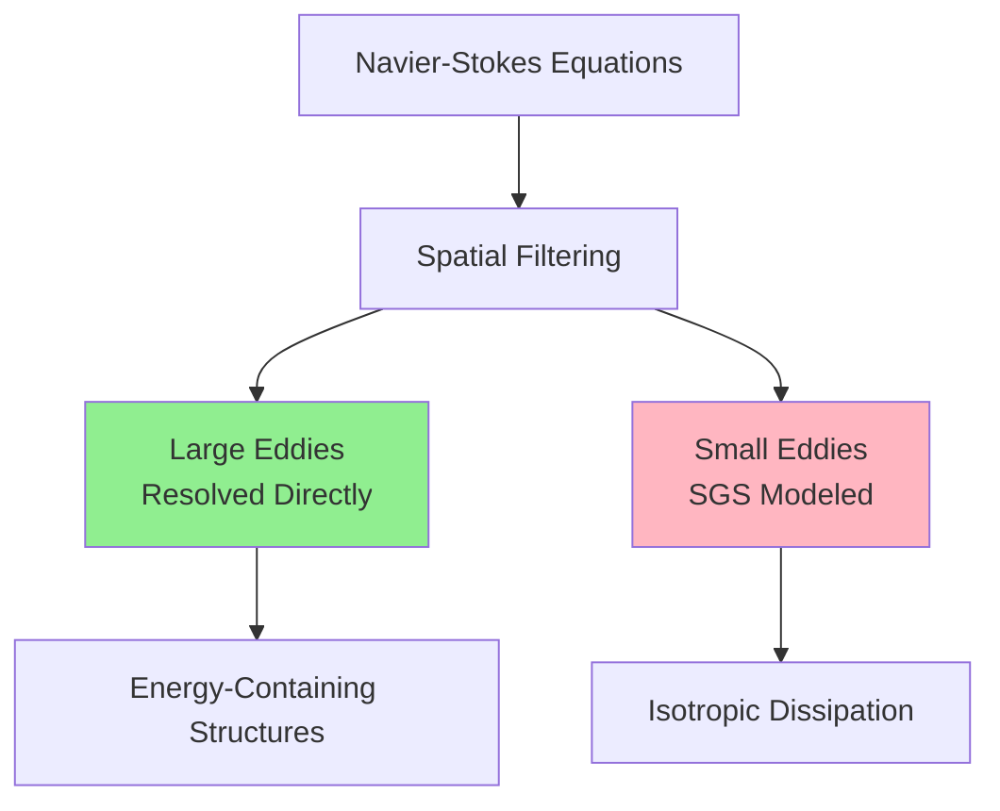
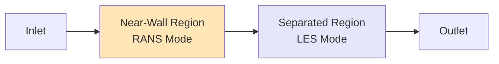
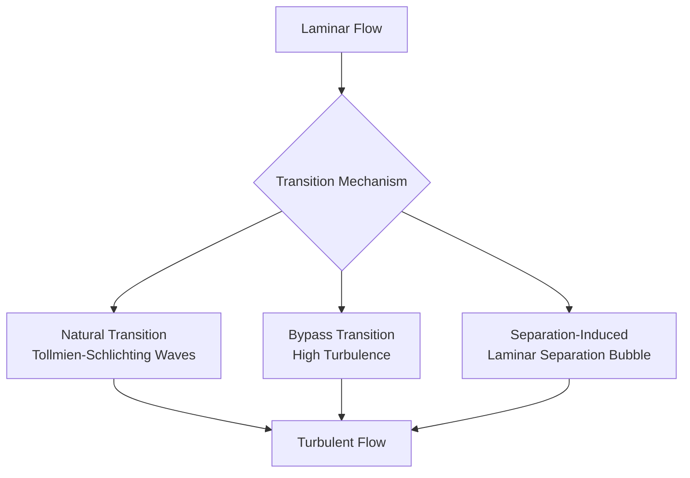
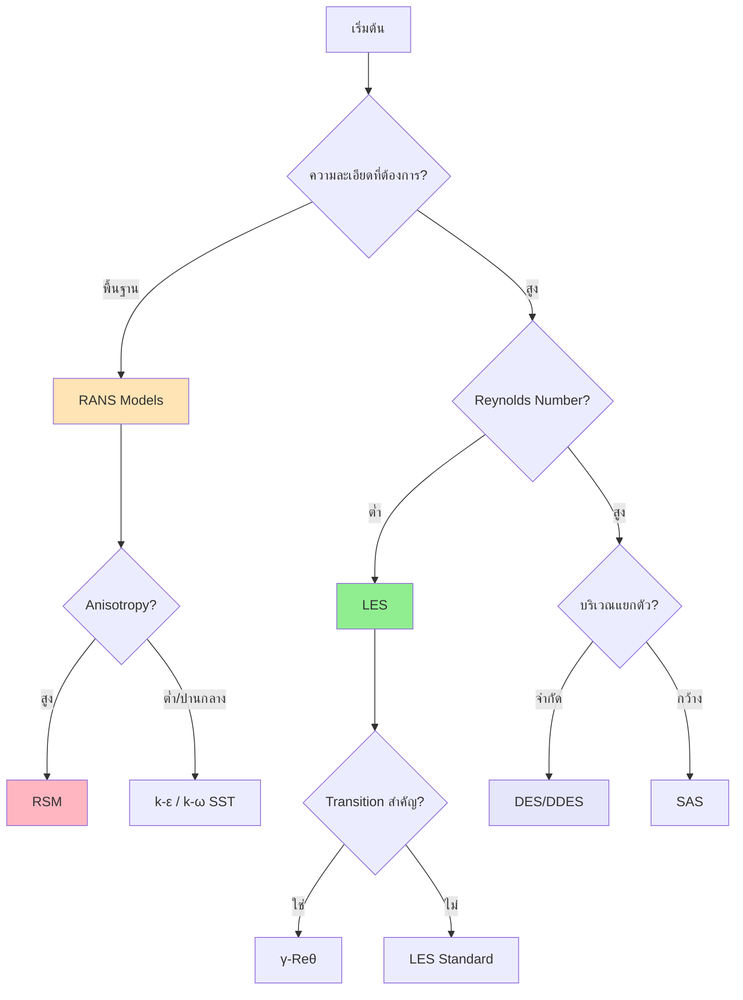

# ความปั่นป่วนขั้นสูง (Advanced Turbulence)

> [!INFO] ภาพรวมหัวข้อ
> เอกสารนี้ครอบคลุมแบบจำลองความปั่นป่วนขั้นสูงที่ออกจากเหนือกว่าแบบจำลอง RANS มาตรฐาน รวมถึง Large Eddy Simulation (LES), Detached Eddy Simulation (DES), การสร้างแบบจำลองการเปลี่ยนสภาพ (Transition Modeling), และแนวทาง Hybrid RANS-LES พร้อมการนำไปใช้ใน OpenFOAM

---

## 📋 1. Large Eddy Simulation (LES)

### 1.1 แนวคิดพื้นฐานของ LES

**Large Eddy Simulation (LES)** เป็นวิธีการคำนวณที่เชื่อมช่องว่างระหว่าง Direct Numerical Simulation (DNS) และ Reynolds-Averaged Navier-Stokes (RANS) แนวคิดพื้นฐานอาศัย **การกรองเชิงพื้นที่ (Spatial Filtering)** ของสมการ Navier-Stokes


> **Figure 1:** หลักการทำงานของ Large Eddy Simulation (LES) ซึ่งใช้กระบวนการกรองเชิงพื้นที่ (Spatial Filtering) เพื่อแยกการคำนวณระหว่างโครงสร้างกระแสวนขนาดใหญ่ (Large Eddies) ที่ถูกแก้โดยตรงจากสมการ และโครงสร้างขนาดเล็ก (Small Eddies) ที่ต้องใช้แบบจำลอง Subgrid-scale (SGS) ในการประมาณค่าการสลายตัวของพลังงาน

#### การกรองเชิงพื้นที่ (Spatial Filtering)

การดำเนินการกรองสามารถแสดงได้ดังนี้:

$$\bar{\phi}(\mathbf{x}) = \int_{\Omega} G(\mathbf{x} - \mathbf{x}^*)\phi(\mathbf{x}^*)\,\mathrm{d}\mathbf{x}^*$$

โดยที่:
- $G$ คือ Kernel ของตัวกรอง
- $\Omega$ คือโดเมนของการกรอง

ตัวกรองที่ใช้กันมากที่สุดคือ **Box filter** ซึ่งมีความสัมพันธ์โดยธรรมชาติกับขนาดของ Mesh การคำนวณ

#### สมการ LES ที่ถูกกรอง (Filtered LES Equations)

เมื่อนำการกรองไปใช้กับสมการ Navier-Stokes แบบ Incompressible:

$$\frac{\partial \bar{u}_i}{\partial t} + \bar{u}_j\frac{\partial \bar{u}_i}{\partial x_j} = -\frac{1}{\rho}\frac{\partial \bar{p}}{\partial x_i} + \nu\frac{\partial^2 \bar{u}_i}{\partial x_j^2} - \frac{\partial \tau_{ij}}{\partial x_j}$$

โดยที่ $\tau_{ij}$ คือ **SGS (Subgrid-scale) stress tensor**:

$$\tau_{ij} = \overline{u_i u_j} - \bar{u}_i \bar{u}_j$$

---

### 1.2 แบบจำลอง SGS ที่นิยม

แบบจำลอง SGS ที่ใช้กันอย่างแพร่หลายที่สุดคือ **Smagorinsky model**:

$$\tau_{ij} - \frac{1}{3}\tau_{kk}\delta_{ij} = -2\nu_t \bar{S}_{ij}$$

โดยที่ eddy viscosity $\nu_t$ กำหนดโดย:

$$\nu_t = (C_s \Delta)^2 |\bar{S}|$$

โดยที่:
- $C_s$ คือ Smagorinsky coefficient (โดยทั่วไปคือ 0.1-0.2)
- $\Delta$ คือความกว้างของตัวกรอง
- $|\bar{S}| = \sqrt{2\bar{S}_{ij}\bar{S}_{ij}}$ คือขนาดของ strain-rate tensor

> [!TIP] การเลือกแบบจำลอง SGS
> - **Smagorinsky**: ใช้ค่าสัมประสิทธิ์คงที่ เรียบง่ายและเสถียร
> - **Dynamic Smagorinsky**: คำนวณค่าสัมประสิทธิ์แบบไดนามิกตามสนามการไหล
> - **WALE**: เหมาะสมมากสำหรับการไหลติดผนัง เนื่องจากค่าความหนืด Eddy จะลดลงสู่ศูนย์ที่ผนังโดยธรรมชาติ

#### การเปรียบเทียบแบบจำลอง SGS

| แบบจำลอง | ข้อดี | ข้อเสีย | การประยุกต์ใช้ที่เหมาะสม |
|-----------|--------|---------|----------------------|
| **Smagorinsky** | เรียบง่าย เสถียร | ไม่ปรับตามสภาพการไหล | กรณีทั่วไป |
| **Dynamic Smagorinsky** | ปรับตามสภาพการไหล | ซับซ้อนกว่า | การไหลที่ซับซ้อน |
| **WALE** | พฤติกรรมติดผนังถูกต้อง | ต้องการคำนวณเพิ่ม | การไหลติดผนัง |
| **k-equation** | สามารถจำลองประวัติ | ต้องการสมการเพิ่ม | การไหลแบบไม่คงที่ |

---

### 1.3 การนำไปใช้ใน OpenFOAM

OpenFOAM มีแบบจำลอง LES หลายแบบผ่านลำดับชั้นของคลาส `LESModel`:

```cpp
// Main file structure for LES models
// Location: turbulenceModels/LES/LESModel
src/TurbulenceModels/turbulenceModels/LES/LESModel/LESModel.H
src/TurbulenceModels/turbulenceModels/LES/LESModel/LESModel.C

// Specific model implementations
src/TurbulenceModels/turbulenceModels/LES/Smagorinsky/
src/TurbulenceModels/turbulenceModels/LES/kEqn/
src/TurbulenceModels/turbulenceModels/LES/dynamicKEqn/
src/TurbulenceModels/turbulenceModels/LES/WALE/
```

> **📂 Source:** `src/TurbulenceModels/turbulenceModels/LES/`
> 
> **💡 Explanation:** โครงสร้างไฟล์และไดเรกทอรีของ LES models ใน OpenFOAM ซึ่งจัดเก็บใน `src/TurbulenceModels/turbulenceModels/LES/` โดยมีคลาสพื้นฐาน `LESModel` และคลาสของแบบจำลองเฉพาะเช่น Smagorinsky, kEqn, dynamicKEqn และ WALE แต่ละแบบจำลองมีไฟล์ .H และ .C สำหรับการประกาศและการนำไปใช้
> 
> **🔑 Key Concepts:**
> - **LESModel**: Base class สำหรับทุก LES models
> - **Smagorinsky**: Standard SGS model ด้วยสัมประสิทธิ์คงที่
> - **dynamicKEqn**: Dynamic SGS model ที่คำนวณค่าสัมประสิทธิ์แบบไดนามิก
> - **WALE**: Wall-Adapting Local Eddy-viscosity model สำหรับการไหลติดผนัง

#### การตั้งค่า LES ใน OpenFOAM

ในการใช้ LES แบบจำลองความปั่นป่วนจะถูกระบุใน dictionary `turbulenceProperties`:

```cpp
// Simulation type selection
simulationType LES;

// LES model configuration
LES
{
    // Smagorinsky model specification
    LESModel        Smagorinsky;

    turbulence      on;
    printCoeffs     on;

    // Model coefficient settings
    delta           cubeRootVol;  // or Prandtl, maxDeltaxyz, etc.

    SmagorinskyCoeffs
    {
        Cs          0.1;         // Smagorinsky coefficient
    }
}
```

> **📂 Source:** `case/constant/turbulenceProperties`
> 
> **💡 Explanation:** การตั้งค่า LES model ผ่านไฟล์ `turbulenceProperties` ซึ่งระบุประเภทการจำลอง (simulationType) เป็น LES และกำหนดแบบจำลองย่อย (LESModel) เป็น Smagorinsky พร้อมค่าสัมประสิทธิ์ Cs และวิธีการคำนวณความกว้างของตัวกรอง (delta)
> 
> **🔑 Key Concepts:**
> - **simulationType**: ระบุประเภทการจำลองความปั่นป่วน (LES, RAS, DES)
> - **LESModel**: เลือกแบบจำลอง SGS (Smagorinsky, kEqn, dynamicKEqn, WALE)
> - **delta**: วิธีการคำนวณความกว้างของตัวกรอง (cubeRootVol, Prandtl, maxDeltaxyz)
> - **Cs**: Smagorinsky coefficient ค่าสัมประสิทธิ์การปรับความหนืด

#### การนำแบบจำลอง Dynamic ไปใช้

```cpp
LES
{
    LESModel        dynamicKEqn;  // or dynamicSmagorinsky

    turbulence      on;
    printCoeffs     on;

    delta           cubeRootVol;

    dynamicKEqnCoeffs
    {
        filter       simple;      // or anisotropic, laplacian
    }
}
```

> **📂 Source:** `case/constant/turbulenceProperties`
> 
> **💡 Explanation:** การตั้งค่า Dynamic k-equation LES model ซึ่งคำนวณค่าสัมประสิทธิ์ SGS แบบไดนามิกตามสนามการไหล โดยใช้ฟิลเตอร์ (filter) เพื่อกรองสนามความเร็วในหลายระดับ
> 
> **🔑 Key Concepts:**
> - **dynamicKEqn**: Dynamic k-equation model ที่คำนวณค่าสัมประสิทธิ์แบบไดนามิก
> - **filter**: วิธีการกรอง (simple, anisotropic, laplacian)
> - **Dynamic procedure**: คำนวณค่าสัมประสิทธิ์ Cs แบบ local ตามตำแหน่งและเวลา

---

### 1.4 ข้อกำหนด Mesh และเวลา

LES ต้องการ Mesh และการตั้งค่าเวลาที่เหมาะสม:

#### ข้อกำนด Mesh

| พารามิเตอร์ | ข้อกำหนดสำหรับ LES |
|-------------|-------------------|
| การจำลองผนัง | $y^+ \approx 1$ (wall-resolved LES) |
| ระยะห่างตามทิศทางการไหล | $\Delta x^+ \approx 50-100$ |
| ระยะห่างตามแนวแกน | $\Delta z^+ \approx 15-30$ |
| ข้อจำกัดอัตราส่วนภาพ | $\Delta x^+/\Delta y^+ < 50$ |

> [!WARNING] ข้อควรระวังด้าน Mesh
> - LES ต้องการ Mesh ที่ละเอียดมากและมีความเป็น Isotropic สูง (Aspect ratio ใกล้ 1)
> - ความละเอียดต้องเพียงพอที่จะจำลองพลังงานจลน์ความปั่นป่วนได้อย่างน้อย 80%

#### ข้อกำหนด Time Step

เงื่อนไข **Courant-Friedrichs-Lewy (CFL)** สำหรับ LES:

$$\text{CFL} = \frac{|\mathbf{u}| \Delta t}{\Delta x} < 1$$

ค่า CFL ทั่วไปสำหรับ LES อยู่ในช่วง **0.3 ถึง 0.7**:

```cpp
// In controlDict - Time step control for LES
maxCo           0.5;      // Maximum CFL number
maxAlphaCo      0.5;      // For compressible flows
```

> **📂 Source:** `case/system/controlDict`
> 
> **💡 Explanation:** การควบคุม time step ผ่านค่า CFL number (Co) ในไฟล์ controlDict เพื่อให้แน่ใจว่าการจำลองมีเสถียรภาพและความแม่นยำสำหรับ LES
> 
> **🔑 Key Concepts:**
> - **maxCo**: ค่า Courant number สูงสุดที่อนุญาต
> - **CFL condition**: ข้อจำกัดความเสถียรสำหรับการแก้สมการเชิงอนุพันธ์
> - **Temporal resolution**: ความละเอียดของเวลาที่จำเป็นสำหรับ LES

---

## 🔀 2. Hybrid RANS-LES (DES)

### 2.1 แนวคิดของ DES

**Detached Eddy Simulation (DES)** เป็นแนวทางแบบผสมที่รวม:
- **แบบจำลอง RANS** ในบริเวณใกล้ผนัง (near-wall region)
- **LES** ในบริเวณที่เกิดการแยกตัว (separated regions)


> **Figure 2:** แนวคิดของแบบจำลองผสม Hybrid RANS-LES หรือ Detached Eddy Simulation (DES) ซึ่งแสดงการแบ่งโซนการทำงาน โดยใช้ RANS ในบริเวณใกล้ผนังเพื่อลดต้นทุนการคำนวณ และสลับไปใช้ LES ในบริเวณที่เกิดการแยกตัวของการไหล (Separated Region) เพื่อจับโครงสร้างความปั่นป่วนที่ซับซ้อน

แนวคิดพื้นฐานคือการใช้สเกลความยาวแบบ Hybrid:

$$l_{DES} = \min(l_{RANS}, C_{DES} \Delta)$$

โดยที่:
- $l_{RANS} = \kappa y$ (ระยะห่างถึงผนัง)
- $l_{LES} = C_{DES} \Delta$
- $C_{DES}$ คือค่าสัมประสิทธิ์ DES (ประมาณ 0.65)

#### ความแตกต่างระหว่าง DES, DDES และ IDDES

| ประเภท | ลักษณะ | การป้องกันปัญหา |
|---------|---------|-------------------|
| **DES** | การสลับแบบพื้นฐาน | อาจเกิด grid-induced separation |
| **DDES** | ฟังก์ชันหน่วงเวลา (delay function) | ป้องกันการสลับโหมดก่อนเวลา |
| **IDDES** | ฟังก์ชันการป้องกันและการผสมความเค้น | การเปลี่ยนผ่านที่ราบรื่นกว่า |

สำหรับ DDES:

$$\tilde{l} = l_{RANS} - f_d \max(0, l_{RANS} - C_{DES} \Delta)$$

โดยที่ $f_d$ คือฟังก์ชันการป้องกัน:

$$f_d = 1 - \tanh\left([8 r_d]^3\right)$$

---

### 2.2 การนำไปใช้ใน OpenFOAM

แบบจำลอง DES ถูกนำไปใช้ในลำดับชั้นของคลาส `DESModel`:

```cpp
// Main DES model structure
// Location: turbulenceModels/LES/DES
src/TurbulenceModels/turbulenceModels/LES/DES/DESModel/DESModel.H

// Specific DES model implementations
src/TurbulenceModels/turbulenceModels/LES/SpalartAllmarasDES/
src/TurbulenceModels/turbulenceModels/LES/kOmegaSSTDES/
src/TurbulenceModels/turbulenceModels/LES/SpalartAllmarasDDES/
src/TurbulenceModels/turbulenceModels/LES/SpalartAllmarasIDDES/
```

> **📂 Source:** `src/TurbulenceModels/turbulenceModels/LES/DES/`
> 
> **💡 Explanation:** โครงสร้างไฟล์ของ DES models ใน OpenFOAM ซึ่งสืบทอดจาก LES models และเพิ่มฟังก์ชันการทำงานแบบ Hybrid RANS-LES โดยมีคลาสพื้นฐาน DESModel และคลาสของแบบจำลองเฉพาะเช่น SpalartAllmarasDES, kOmegaSSTDES, SpalartAllmarasDDES และ SpalartAllmarasIDDES
> 
> **🔑 Key Concepts:**
> - **DESModel**: Base class สำหรับทุก DES models
> - **SpalartAllmarasDES**: DES ที่ใช้ Spalart-Allmaras RANS model
> - **kOmegaSSTDES**: DES ที่ใช้ k-ω SST RANS model
> - **DDES**: Delayed Detached Eddy Simulation ที่มีฟังก์ชันป้องกัน
> - **IDDES**: Improved DDES ที่มีการเปลี่ยนผ่านที่ราบรื่นกว่า

#### การตั้งค่า DES

```cpp
// Simulation type selection for DES
simulationType DES;

DES
{
    DESModel        SpalartAllmarasIDDES;

    turbulence      on;
    printCoeffs     on;

    // Model coefficient settings
    CDES            0.65;    // DES coefficient
}
```

> **📂 Source:** `case/constant/turbulenceProperties`
> 
> **💡 Explanation:** การตั้งค่า DES model ผ่านไฟล์ turbulenceProperties โดยระบุ simulationType เป็น DES และเลือกแบบจำลอง DESModel เป็น SpalartAllmarasIDDES พร้อมค่าสัมประสิทธิ์ CDES
> 
> **🔑 Key Concepts:**
> - **simulationType DES**: ระบุว่าใช้แบบจำลอง Hybrid RANS-LES
> - **SpalartAllmarasIDDES**: Improved Delayed Detached Eddy Simulation ที่ใช้ Spalart-Allmaras
> - **CDES**: ค่าสัมประสิทธิ์ DES ที่ควบคุมจุดเปลี่ยนระหว่าง RANS และ LES

#### การตั้งค่า k-ω SST DES

```cpp
DES
{
    DESModel        kOmegaSSTDES;

    turbulence      on;
    printCoeffs     on;

    kOmegaSSTDESCoeffs
    {
        CDES         0.65;
        // Additional k-ω SST coefficients
    }
}
```

> **📂 Source:** `case/constant/turbulenceProperties`
> 
> **💡 Explanation:** การตั้งค่า k-ω SST DES model ซึ่งรวม k-ω SST RANS model เข้ากับสเกลความยาวแบบ Hybrid เหมาะสำหรับการไหลที่มีการแยกตัวและความดันตามผลัง
> 
> **🔑 Key Concepts:**
> - **kOmegaSSTDES**: DES ที่ใช้ k-ω SST model ซึ่งแม่นยำสำหรับการไหลติดผนัง
> - **Hybrid length scale**: สเกลความยาวที่เปลี่ยนระหว่าง RANS และ LES
> - **CDES**: ค่าสัมประสิทธิ์ที่ควบคุมการเปลี่ยนโหมด

---

### 2.3 แนวปฏิบัติที่ดีที่สุดสำหรับ DES

#### การออกแบบ Mesh สำหรับ DES

| บริเวณ | ข้อกำหนด Mesh |
|----------|--------------|
| RANS Region | $y^+ \approx 30-100$ (RANS wall function) |
| LES Region | $\Delta x^+ \approx 50-100$, $\Delta z^+ \approx 15-30$ |
| Transition Zone | การเปลี่ยนผ่านที่ราบรื่นระหว่างความละเอียด |

> [!WARNING] การหลีกเลี่ยง Grid-Induced Separation
> - หลีกเลี่ยงการแยกตัวที่เกิดจากกริด (grid-induced separation) ผ่านการปรับความละเอียดของกริดอย่างระมัดระวัง
> - ตรวจสอบฟังก์ชันการสลับ DES ระหว่างการจำลอง

#### การเปรียบเทียบต้นทุนการคำนวณ

| วิธีการ | ต้นทุนคอมพิวเตอร์ | ความแม่นยำ |
|----------|-------------------|------------|
| RANS | 1x | พื้นฐาน |
| DES | 5-20x | ดี |
| LES | 100x | ยอดเยี่ยม |

DES เหมาะสมที่สุดสำหรับ:
- การไหลที่มีบริเวณที่แยกตัวจำกัด
- การไหลที่ Reynolds number สูงซึ่ง LES แบบ wall-resolved ไม่สามารถทำได้จริง
- การประยุกต์ใช้ที่ต้องการการทำนายแบบไม่คงที่ แต่ไม่ต้องการความแม่นยำระดับ LES เต็มรูปแบบ

---

## 🏔️ 3. การทำนายการเปลี่ยนสภาพ (Transition Modeling)

### 3.1 กลไกการเปลี่ยนสภาพ

การเปลี่ยนสภาพของการไหลจากสภาวะ Laminar ไปสู่ Turbulent เกิดขึ้นผ่านกลไกต่างๆ ขึ้นอยู่กับสภาวะการไหลและการรบกวน


> **Figure 3:** กลไกการเปลี่ยนสภาพของการไหล (Transition Mechanisms) จากสภาวะ Laminar ไปสู่ Turbulent ซึ่งสามารถเกิดขึ้นได้ผ่านหลายรูปแบบ เช่น การเปลี่ยนสภาพตามธรรมชาติ (Natural Transition) การเปลี่ยนสภาพแบบ Bypass หรือการเปลี่ยนสภาพที่เกิดจากการแยกตัวของการไหล (Separation-Induced)

#### ประเภทของการเปลี่ยนสภาพ

| ประเภท | ลักษณะ | เงื่อนไขการเกิด | การประยุกต์ใช้ |
|--------|--------|-------------------|-----------------|
| **Natural Transition** | เกิดคลื่น T-S | การรบกวนต่ำ | ชั้นขอบเขตแบบคลาสสิก |
| **Bypass Transition** | การแตกสลายโดยตรง | การรบกวนสูง (>1%) | Turbomachinery |
| **Separation-Induced** | เกิดใน laminar separation bubble | การแยกตัวของการไหล | แอร์ฟอยล์ Re ต่ำ |

---

### 3.2 แบบจำลอง γ-Reθ

แบบจำลอง $\gamma$-$Re_\theta$ พัฒนาโดย Langtry และ Menter ใช้:
- **Intermittency ($\gamma$)** เพื่อวัดความคืบหน้าของการเปลี่ยนสภาพ
- **Momentum thickness Reynolds number ($Re_\theta$)** สำหรับจุดเริ่มต้นของการเปลี่ยนสภาพ
- เชื่อมต่อกับ k-ω SST turbulence model

#### สมการความไม่ต่อเนื่อง (Intermittency Equation)

$$\frac{\partial (\rho \gamma)}{\partial t} + \frac{\partial (\rho U_j \gamma)}{\partial x_j} = P_\gamma - E_\gamma + \frac{\partial}{\partial x_j}\left[ (\mu + \frac{\mu_t}{\sigma_\gamma}) \frac{\partial \gamma}{\partial x_j} \right]$$

เทอมการผลิตและการทำลาย:

$$P_\gamma = F_{length} \rho S \gamma^{1/2} (1 - \gamma)$$
$$E_\gamma = c_{a2} \rho \Omega \gamma F_{turb}$$

#### ความหมายของค่า Intermittency

| ค่า $\gamma$ | สถานะการไหล |
|-------------|-------------|
| $\gamma = 0$ | การไหลแบบ Laminar |
| $\gamma = 1$ | การไหลแบบ Turbulent เต็มรูปแบบ |
| $0 < \gamma < 1$ | บริเวณที่กำลังเปลี่ยนสภาพ |

---

### 3.3 การนำไปใช้ใน OpenFOAM

มี Transition models ใน OpenFOAM ผ่าน:

```cpp
// Transition model location in OpenFOAM
src/TurbulenceModels/turbulenceModels/RAS/transitionModels/
```

> **📂 Source:** `src/TurbulenceModels/turbulenceModels/RAS/transitionModels/`
> 
> **💡 Explanation:** ตำแหน่งเก็บ Transition models ใน OpenFOAM ซึ่งใช้ร่วมกับ RAS models เพื่อจำลองการเปลี่ยนสภาพจาก Laminar ไปเป็น Turbulent
> 
> **🔑 Key Concepts:**
> - **transitionModels**: Directory ที่เก็บ transition modeling implementations
> - **gammaReTheta**: γ-Reθ transition model
> - **kklOmega**: k-kl-ω transition model

#### การตั้งค่า γ-Reθ Model

```cpp
simulationType RAS;

RAS
{
    RASModel        kOmegaSST;

    turbulence      on;
    transition      on;      // Enable transition modeling

    transitionModel   gammaReTheta;

    gammaReThetaCoeffs
    {
        maxTransitionLength    50;
        criticalReThet         200;

        // Additional coefficients
        ca1                     2.0;
        ca2                     0.06;
        ce1                     1.0;
        ce2                     50.0;
        sigmaTheta              2.0;
        sigmaPhi                2.0;
    }
}
```

> **📂 Source:** `case/constant/turbulenceProperties`
> 
> **💡 Explanation:** การตั้งค่า γ-Reθ transition model ร่วมกับ k-ω SST RANS model โดยเปิดใช้งาน transition modeling ผ่านพารามิเตอร์ `transition on` และระบุ `transitionModel` เป็น `gammaReTheta` พร้อมค่าสัมประสิทธิ์ต่างๆ
> 
> **🔑 Key Concepts:**
> - **transition on**: เปิดใช้งาน transition modeling
> - **gammaReTheta**: γ-Reθ transition model ที่ใช้ intermittency และ Reynolds number
> - **maxTransitionLength**: ความยาวสูงสุดของบริเวณ transition
> - **criticalReThet**: ค่า Reynolds number วิกฤตที่เริ่มเปลี่ยนสภาพ

#### การตั้งค่า k-kl-ω Model

```cpp
RAS
{
    RASModel        kklOmega;

    turbulence      on;
    transition      on;

    kklOmegaCoeffs
    {
        // Coefficients for k-kl-ω model
    }
}
```

> **📂 Source:** `case/constant/turbulenceProperties`
> 
> **💡 Explanation:** การตั้งค่า k-kl-ω transition model ซึ่งเป็นอีกแบบจำลองหนึ่งที่ใช้สำหรับจำลองการเปลี่ยนสภาพ
> 
> **🔑 Key Concepts:**
> - **kklOmega**: k-kl-ω transition model ที่ใช้สมการ 3 สมการ
> - **Laminar kinetic energy**: พลังงานจลน์ของการไหลแบบ laminar
> - **Turbulent kinetic energy**: พลังงานจลน์ของความปั่นป่วน

---

### 3.4 การประยุกต์ใช้ Transition Modeling

#### การใช้งานใน Turbomachinery

การสร้างแบบจำลองการเปลี่ยนสภาพมีความสำคัญอย่างยิ่งสำหรับ:
- การทำนายประสิทธิภาพของ Low-pressure turbine
- การรับภาระและประสิทธิภาพของใบพัดคอมเพรสเซอร์
- การทำนายการถ่ายเทความร้อนใน Turbine ที่มีการระบายความร้อน
- การปฏิสัมพันธ์ระหว่างแถวใบพัดแบบไม่คงที่

#### การใช้งานใน Low Reynolds Number Aerodynamics

- อากาศยานไร้คนขับขนาดเล็ก (UAVs)
- ใบพัดกังหันลมที่ความเร็วลมต่ำ
- อากาศยานขนาดเล็ก (Micro air vehicles)
- อากาศยานความเร็วต่ำในช่วงเข้าใกล้และลงจอด

#### การใช้งานด้าน Heat Transfer

- การออกแบบระบบระบายความร้อนใบพัด Turbine
- ประสิทธิภาพของเครื่องแลกเปลี่ยนความร้อน
- ระบบระบายความร้อนอุปกรณ์อิเล็กทรอนิกส์
- การทำนายความร้อนจาก Aerodynamics

---

## 📊 4. Reynolds Stress Models (RSM)

### 4.1 แนวคิดของ RSM

**Reynolds Stress Models (RSM)** แตกต่างจาก eddy viscosity models ที่สมมติว่าความปั่นป่วนเป็นแบบ Isotropic RSM จะแก้สมการขนส่งสำหรับทุกองค์ประกอบของ Reynolds stress tensor

$$\frac{\partial R_{ij}}{\partial t} + u_k\frac{\partial R_{ij}}{\partial x_k} = P_{ij} + \phi_{ij} - \varepsilon_{ij} + \frac{\partial}{\partial x_k}\left[\frac{\nu_t}{\sigma_k}\frac{\partial R_{ij}}{\partial x_k}\right]$$

โดยที่ $R_{ij} = \overline{u_i' u_j'}$ คือองค์ประกอบของ Reynolds stress

> [!INFO] ความแตกต่างระหว่าง EVM และ RSM
> - **Eddy Viscosity Models (EVM)**: สมมติว่าความปั่นป่วนเป็นแบบ Isotropic ใช้สมการ 2 สมการ (k-ε, k-ω)
> - **Reynolds Stress Models (RSM)**: จำลองความไม่เป็นแบบ Isotropic ของความปั่นป่วน ใช้ 6 สมการขนส่ง

---

### 4.2 การเปรียบเทียบแบบจำลอง

| ความท้าทาย | RSM | Eddy Viscacy Models |
|-------------|-----|-------------------|
| สมการขนส่ง | 6 สมการ | 2 สมการ |
| ความแข็งแกร่งเชิงตัวเลข | เพิ่มขึ้น | ต่ำกว่า |
| Boundary conditions | ยากกว่า | ง่ายกว่า |
| ต้นทุนการคำนวณ | 2-3 เท่า | ฐาน |
| ความแม่นยำสำหรับ Anisotropic flows | ดีกว่า | จำกัด |

---

### 4.3 การนำไปใช้ใน OpenFOAM

RSM models ถูกนำไปใช้ใน:

```cpp
// RSM model locations in OpenFOAM
src/TurbulenceModels/turbulenceModels/RAS/LaunderGibsonRSTM/
src/TurbulenceModels/turbulenceModels/RAS/LaunderSharmaKE/
```

> **📂 Source:** `src/TurbulenceModels/turbulenceModels/RAS/`
> 
> **💡 Explanation:** ตำแหน่งเก็บ Reynolds Stress Models (RSM) ใน OpenFOAM ซึ่งแก้ 6 สมการขนส่งสำหรับ Reynolds stress tensor
> 
> **🔑 Key Concepts:**
> - **LaunderGibsonRSTM**: Reynolds Stress Transport Model ที่พัฒนาโดย Launder และ Gibson
> - **Reynolds stress tensor**: 6 องค์ประกอบของความเค้นความปั่นป่วน
> - **Anisotropic turbulence**: ความปั่นป่วนที่ไม่เท่ากันในทุกทิศทาง

#### การตั้งค่า RSM

```cpp
simulationType RAS;

RAS
{
    RASModel        LaunderGibsonRSTM;

    turbulence      on;
    printCoeffs     on;

    RSTMCoeffs
    {
        Cmu         0.09;
        Clrr1       1.8;
        Clrr2       0.6;
    }
}
```

> **📂 Source:** `case/constant/turbulenceProperties`
> 
> **💡 Explanation:** การตั้งค่า Launder-Gibson Reynolds Stress Transport Model ซึ่งแก้ 6 สมการขนส่งสำหรับทุกองค์ประกอบของ Reynolds stress tensor
> 
> **🔑 Key Concepts:**
> - **LaunderGibsonRSTM**: RSM ที่ใช้กันอย่างแพร่หลาย
> - **Cmu**: ค่าสัมประสิทธิ์ความหนืดความปั่นป่วน
> - **Clrr1, Clrr2**: ค่าสัมประสิทธิ์สำหรับ pressure-strain correlation

---

### 4.4 การเลือกใช้ RSM

RSM มีประโยชน์มากที่สุดสำหรับ:

#### การประยุกต์ที่เหมาะสม

- การไหลที่มี Anisotropy สูง (swirling flows, rotating flows)
- การไหลแบบทุติยภูมิในท่อ (Secondary flows in ducts)
- อัตราการเปลี่ยนแปลง (strain rates) ที่ซับซ้อน
- การไหลที่มีผลกระทบจากความโค้ง (curvature effects)
- การไหลที่ขับเคลื่อนด้วยแรงลอยตัว (Buoyancy-driven flows)

#### ข้อจำกัดของ RSM

- การตั้งค่าเริ่มต้นที่ซับซ้อน
- ความยากลำบากในการลู่เข้า
- ความไวต่อคุณภาพของ Mesh
- ต้นทุนการคำนวณสูง

---

## 🛠️ 5. Scale-Adaptive Simulation (SAS)

### 5.1 แนวคิดของ SAS

**Scale-Adaptive Simulation (SAS)** เป็นแนวทาง URANS ที่สามารถปรับตัวเพื่อจำลองโครงสร้างความปั่นป่วนตามสภาวะการไหลเฉพาะที่

สำหรับ k-ω SST-SAS:

$$\frac{\partial \omega}{\partial t} + \ldots = P_\omega - D_\omega + \text{SAS source term}$$

SAS source term จะทำงานเมื่อมีโครงสร้างแบบไม่คงที่ที่ถูกจำลองปรากฏขึ้น:

$$Q_{SAS} = \max\left[\zeta_2 \kappa S^2 \left(\frac{L}{L_{vk}} - 1\right), 0\right]$$

โดยที่:
- $L$ คือความยาวลักษณะเฉพาะของความปั่นป่วน
- $L_{vk}$ คือ von Kármán length scale: $$L_{vk} = \frac{\kappa S^2}{|\nabla^2 U|}$$

---

### 5.2 ลักษณะการทำงานของ SAS

| บริเวณ | โหมดการทำงาน |
|---------|---------------|
| ในบริเวณที่คงที่ | ทำงานเหมือน URANS มาตรฐาน |
| ในบริเวณที่ไม่คงที่ | จำลองโครงสร้างความปั่นป่วนโดยอัตโนมัติ |

> [!TIP] ข้อดีของ SAS เหนือ DES
> - **ไม่ต้องพึ่งพา Mesh** อย่างชัดเจนเหมือน DES
> - **การเปลี่ยนผ่านที่ราบรื่น** ระหว่างโหมด
> - **ไม่เกิดปัญหา grid-induced separation**

---

### 5.3 การนำไปใช้ใน OpenFOAM

```cpp
simulationType RAS;

RAS
{
    RASModel        kOmegaSSTSAS;

    turbulence      on;
    printCoeffs     on;
}
```

> **📂 Source:** `case/constant/turbulenceProperties`
> 
> **💡 Explanation:** การตั้งค่า k-ω SST SAS model ซึ่งเป็น Scale-Adaptive Simulation ที่ปรับตัวตามสเกลของความปั่นป่วนในสนามการไหล
> 
> **🔑 Key Concepts:**
> - **kOmegaSSTSAS**: k-ω SST model ที่มี SAS source term
> - **von Kármán length scale**: สเกลความยาวที่ใช้ตรวจจับโครงสร้างความปั่นป่วน
> - **Automatic scale adaptation**: ปรับตัวอัตโนมัติตามสภาวะการไหล

---

### 5.4 การประยุกต์ใช้ SAS

SAS มีประสิทธิภาพสำหรับ:

- การไหลภายในที่มีการแยกตัว
- การไหลใน Turbomachinery
- การประยุกต์ใช้ในอุตสาหกรรมที่มีบริเวณที่คงที่และไม่คงที่ผสมกัน
- กรณีที่การสลับโหมด DES ก่อให้เกิดปัญหา

**ข้อจำกัด:**
- ความแม่นยำน้อยกว่า LES บริสุทธิ์สำหรับการไหลแบบ Turbulent เต็มรูปแบบ
- ยังคงขึ้นอยู่กับคุณภาพของ Mesh
- อาจไม่สามารถจำลองสเกลความปั่นป่วนที่เล็กที่สุดได้

---

## 📋 6. สรุปการเลือกแบบจำลอง

### 6.1 แผนการตัดสินใจ


> **Figure 4:** แผนผังการตัดสินใจเลือกแบบจำลองความปั่นป่วน (Turbulence Model Selection Logic) โดยพิจารณาจากความละเอียดที่ต้องการ เลข Reynolds ลักษณะของการแยกตัวของการไหล และความไม่สมมาตรของความเค้น (Anisotropy) เพื่อให้ได้ผลลัพธ์ที่แม่นยำและคุ้มค่าที่สุด

---

### 6.2 ตารางเปรียบเทียบสรุป

| แบบจำลอง | ความแม่นยำ | ต้นทุน | การประยุกต์ที่เหมาะสม | ข้อจำกัดหลัก |
|-----------|-----------|--------|---------------------|---------------|
| **RANS (k-ε, k-ω)** | ปานกลาง | 1x | การประยุกต์ทั่วไป | ไม่จับ unsteady phenomena |
| **RSM** | ดี (Anisotropic) | 2-3x | การไหลที่ซับซ้อน | ยากต่อการลู่เข้า |
| **LES** | ยอดเยี่ยม | 50-100x | การไหลแยกตัว, Aeroacoustics | ต้องการ mesh ละเอียดมาก |
| **DES** | ดี | 5-20x | การไหล Re สูง | เกิด GIS ได้ |
| **SAS** | ดี-ปานกลาง | 3-10x | การไหลผสม | ความแม่นยำน้อยกว่า LES |
| **γ-Reθ** | ดี (Transition) | 1.5-2x | การไหล Re ต่ำ | ต้องใช้กับ RANS model อื่น |

---

### 6.3 แนวทางการเลือกแบบจำลอง

#### สำหรับการใช้งานทั่วไป

```cpp
// Choose k-ω SST for most cases
RASModel        kOmegaSST;
```

> **📂 Source:** `case/constant/turbulenceProperties`
> 
> **💡 Explanation:** k-ω SST model เป็นตัวเลือกที่ดีสำหรับกรณีส่วนใหญ่ เนื่องจากให้ความแม่นยำที่ดีสำหรับการไหลติดผนังและการไหลที่มีการแยกตัว
> 
> **🔑 Key Concepts:**
> - **k-ω SST**: k-omega Shear Stress Transport model
> - **General purpose**: เหมาะสำหรับกรณีส่วนใหญ่
> - **Wall-bounded flows**: การไหลติดผนัง

#### สำหรับการไหลที่มี Anisotropy สูง

```cpp
// Choose RSM for swirling flows, rotating flows
RASModel        LaunderGibsonRSTM;
```

> **📂 Source:** `case/constant/turbulenceProperties`
> 
> **💡 Explanation:** Reynolds Stress Model เหมาะสำหรับการไหลที่มีความไม่เป็นแบบ Isotropic สูง เช่น การไหลวน (swirling flows) หรือการไหลที่มีการหมุน
> 
> **🔑 Key Concepts:**
> - **LaunderGibsonRSTM**: Reynolds Stress Transport Model
> - **Anisotropic turbulence**: ความปั่นป่วนที่ไม่สมมาตร
> - **Swirling/rotating flows**: การไหลวนหรือหมุน

#### สำหรับการไหลที่มีการแยกตัวชัดเจน

```cpp
// Choose DES for high Re separated flows
simulationType DES;
DESModel        SpalartAllmarasIDDES;
```

> **📂 Source:** `case/constant/turbulenceProperties`
> 
> **💡 Explanation:** DES เหมาะสำหรับการไหลที่มีการแยกตัวชัดเจนที่ Reynolds number สูง ซึ่งรวมประสิทธิภาพของ RANS ใกล้ผนังและ LES ในบริเวณแยกตัว
> 
> **🔑 Key Concepts:**
> - **DES**: Detached Eddy Simulation
> - **High Re flows**: การไหลที่ Reynolds number สูง
> - **Separated flows**: การไหลที่มีการแยกตัว

#### สำหรับการไหล Re ต่ำที่มีการเปลี่ยนสภาพ

```cpp
// Choose γ-Reθ with k-ω SST
RASModel        kOmegaSST;
transitionModel   gammaReTheta;
```

> **📂 Source:** `case/constant/turbulenceProperties`
> 
> **💡 Explanation:** γ-Reθ transition model ร่วมกับ k-ω SST เหมาะสำหรับการไหลที่ Reynolds number ต่ำที่มีการเปลี่ยนสภาพจาก Laminar ไป Turbulent
> 
> **🔑 Key Concepts:**
> - **gammaReTheta**: γ-Reθ transition model
> - **Low Re flows**: การไหลที่ Reynolds number ต่ำ
> - **Laminar-turbulent transition**: การเปลี่ยนสภาพ

---

## ⚠️ 7. ข้อควรระวังเชิงเทคนิค

### 7.1 ข้อควรพิจารณาด้าน Mesh

#### ข้อกำหนด Mesh สำหรับแต่ละแบบจำลอง

| แบบจำลอง | y+ Requirement | Mesh Quality |
|-----------|---------------|--------------|
| **RANS + Wall Function** | 30 < y+ < 100 | ปานกลาง |
| **RANS + Low-Re** | y+ ≈ 1 | ดีมาก |
| **LES** | y+ ≈ 1 | ดีมาก + Isotropic |
| **DES** | แปรผันตามโซน | ดีใน LES zone |

> [!WARNING] ข้อควรระวังด้าน Mesh
> - LES ต้องการ Mesh ที่ละเอียดมากและมีความเป็น Isotropic สูง (Aspect ratio ใกล้ 1)
> - DES ต้องการการเปลี่ยนผ่านที่ราบรื่นระหว่างความละเอียด Mesh
> - หลีกเลี่ยงการเปลี่ยนขนาด Mesh ที่กะทันหนซึ่งอาจก่อให้เกิดปัญหาเชิงตัวเลข

---

### 7.2 ข้อควรพิจารณาด้านเวลา

#### ข้อกำหนด Time Step

| แบบจำลอง | CFL Requirement | คำแนะนำ |
|-----------|----------------|----------|
| **RANS (Steady)** | ไม่มีข้อกำหนด | ใช้ local time stepping |
| **RANS (Unsteady)** | < 1 | ควบคุมความเสถียร |
| **LES** | 0.3 - 0.5 | ==ค่าที่เข้มงวดสำหรับความแม่นยำ== |
| **DES** | 0.3 - 0.7 | ขึ้นกับบริเวณ |
| **SAS** | 0.5 - 1.0 | ยืดหยุ่นกว่า LES |

> [!TIP] การเลือก Time Step
> - Time step ควรมีขนาดเล็กพอที่จะจับความถี่ของโครงสร้างความปั่นป่วนที่สำคัญ
> - สำหรับ LES ควรตรวจสอบ spectrum ของสัญญาณเพื่อยืนยันว่า time step เพียงพอ

---

### 7.3 ข้อควรพิจารณาด้าน Boundary Condition

#### การสร้าง Inlet Conditions สำหรับ LES/DES

| วิธีการ | ความซับซ้อน | ความแม่นยำ | การประยุกต์ใช้ |
|----------|--------------|------------|-----------------|
| **Fixed Velocity** | ต่ำ | ต่ำ | การทดสอบเบื้องต้น |
| **Synthetic Turbulence** | ปานกลาง | ปานกลาง | กรณีทั่วไป |
| **Recycling Method** | ปานกลาง-สูง | ดี | Boundary layers |
| **Precursor RANS/LES** | สูง | ดีมาก | กรณีวิจัย |

#### ตัวอย่างการตั้งค่า Synthetic Turbulence

```cpp
// In 0/U or boundary conditions
inlet
{
    type            turbulentDigitalFilterInlet;
    UInf            10.0;      // Freestream velocity
    lInf            0.1;       // Integral length scale
    nu              1e-5;      // Kinematic viscosity

    // Turbulence values
    k               0.1;       // Turbulent kinetic energy
    epsilon         0.01;      // Dissipation rate
}
```

> **📂 Source:** `case/0/U`
> 
> **💡 Explanation:** การตั้งค่า inlet boundary condition ด้วย turbulentDigitalFilterInlet ซึ่งสร้างความปั่นป่วนสังเคราะห์เพื่อใช้กับ LES/DES simulations
> 
> **🔑 Key Concepts:**
> - **turbulentDigitalFilterInlet**: Boundary condition ที่สร้างความปั่นป่วนสังเคราะห์
> - **UInf**: ความเร็วกระแสหลัก
> - **lInf**: สเกลความยาวอินทิกรัลของความปั่นป่วน
> - **k, epsilon**: พลังงานจลน์และอัตราการสลายตัว

---

### 7.4 การตรวจสอบความถูกต้อง

#### ขั้นตอนการตรวจสอบ

1. **Grid Convergence Study**
   - ทดสอบกับ mesh หลายขนาด
   - ตรวจสอบว่าผลลัพธ์ลู่เข้า

2. **Time Step Convergence**
   - ทดสอบกับ time step หลายขนาด
   - ตรวจสอบ spectral resolution

3. **Comparison with Experimental Data**
   - เปรียบเทียบกับข้อมูลจากการทดลอง
   - วิเคราะห์ความคลาดเคลื่อน

4. **Physical Realism Check**
   - ตรวจสอบว่าผลลัพธ์สอดคล้องกับฟิสิกส์
   - วิเคราะห์ coherent structures

---

## 📚 8. แหล่งอ้างอิงเพิ่มเติม

### บทความสำคัญ

| ผู้แต่ง | ปี | ชื่อบทความ | ความสำคัญ |
|---------|----|-------------|-------------|
| Smagorinsky | 1963 | General circulation experiments with the primitive equations | พื้นฐานของ Smagorinsky model |
| Germano et al. | 1991 | A dynamic subgrid-scale eddy viscosity model | พัฒนา Dynamic SGS model |
| Spalart et al. | 1997 | Comments on the feasibility of LES for wings | เสนอ DES ครั้งแรก |
| Menter & Langtry | 2006 | Transition modeling for general CFD applications | พัฒนา γ-Reθ model |

### เอกสาร OpenFOAM

- OpenFOAM User Guide: Chapter 8 - Turbulence modeling
- OpenFOAM Programmer's Guide: LES and RAS models
- OpenFOAM Wiki: Turbulence analysis

---

**หัวข้อถัดไป**: [[วิธีการเชิงตัวเลขขั้นสูง (AMR & Adjoint)|./03_Numerical_Methods.md]]