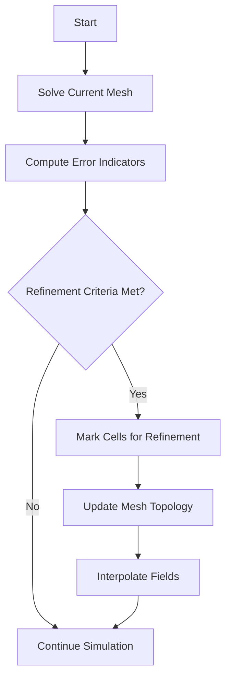
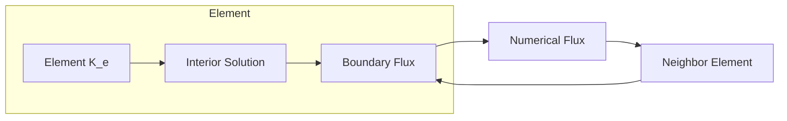
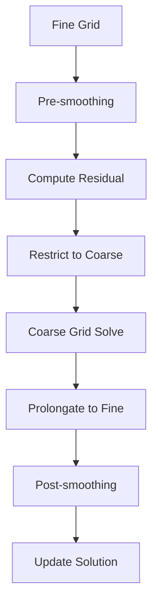

# วิธีการเชิงตัวเลขขั้นสูง (Advanced Numerical Methods)

เอกสารนี้ครอบคลุมวิธีการเชิงตัวเลขขั้นสูงสำหรับ OpenFOAM ซึ่งเป็นส่วนสำคัญของ **MODULE_07_ADVANCED_TOPICS**

---

## 📐 1. Adaptive Mesh Refinement (AMR)

**AMR** เป็นเทคนิคที่อนุญาตให้ OpenFOAM ปรับปรุง Mesh ให้ละเอียดขึ้นเฉพาะในบริเวณที่จำเป็นในระหว่างการรันจำลอง (Runtime) เช่น บริเวณที่มีความชัน (Gradient) ของตัวแปรสูง

### 1.1 เกณฑ์การปรับปรุง (Refinement Criteria)

OpenFOAM ใช้ **dynamic AMR** ผ่านคลาส `dynamicRefineFvMesh` เกณฑ์การปรับตาข่าย (refinement criteria) ขึ้นอยู่กับ:

- **Gradient magnitude**: $|\nabla \phi| > \epsilon_{\text{grad}}$
- **Solution jump**: $|\phi_{\text{max}} - \phi_{\text{min}}| > \epsilon_{\text{jump}}$
- **Vorticity magnitude**: $|\boldsymbol{\omega}| > \epsilon_{\text{vort}}$


> **Figure 1:** แผนผังลำดับขั้นตอนการทำงานของเทคนิค Adaptive Mesh Refinement (AMR) ซึ่งแสดงกระบวนการตรวจสอบเกณฑ์การปรับปรุงตาข่าย (Refinement Criteria) ในระหว่างการคำนวณ เพื่อเพิ่มความละเอียดของเมชเฉพาะในบริเวณที่มีความชันของตัวแปรสูง ช่วยเพิ่มความแม่นยำโดยใช้ทรัพยากรการคำนวณอย่างคุ้มค่า

### 1.2 Refinement Algorithm

กระบวนการ AMR ใช้แนวทางแบบลำดับชั้น (hierarchical approach):

1. **Error Estimation**: คำนวณตัวบ่งชี้การปรับตาข่าย (refinement indicators) โดยอิงตาม gradient ของ field
2. **Cell Selection**: ทำเครื่องหมายเซลล์สำหรับการปรับตาข่ายให้ละเอียดขึ้น (refinement) หรือหยาบขึ้น (coarsening) โดยใช้เกณฑ์ threshold
3. **Mesh Update**: ดำเนินการเปลี่ยนแปลงโครงสร้าง (topological changes) พร้อมทั้งรักษาความสอดคล้องของตาข่าย
4. **Field Interpolation**: ขยายผลเฉลยจากเซลล์หยาบไปยังเซลล์ที่ละเอียดขึ้น

อัตราส่วนการปรับตาข่าย (refinement ratio) โดยทั่วไปจะเป็นแบบ **2:1** โดยอนุญาตให้มี hanging cells ที่ส่วนต่อประสานของการปรับตาข่าย

### 1.3 ตัวอย่างการตั้งค่า (`system/controlDict`)

```cpp
dynamicFvMesh   dynamicRefineFvMesh;

dynamicRefineFvMeshCoeffs
{
    // Field to be used for mesh refinement
    field           alpha.water;

    // Refinement level thresholds
    lowerRefineLevel 0.01;
    upperRefineLevel 0.99;

    // Maximum refinement level
    maxRefinementLevel 2;

    // Maximum number of cells
    maxCells        200000;

    // Interval for refinement operations
    refineInterval  1;

    // Number of buffer layers around refined regions
    nBufferLayers   1;
}
```

**คำอธิบาย:**
- **ที่มา:** ไฟล์การตั้งค่า `system/controlDict` สำหรับ dynamic mesh refinement
- **คำอธิบาย:** การตั้งค่าพารามิเตอร์สำหรับ Adaptive Mesh Refinement โดยระบุ field ที่จะใช้เป็นเกณฑ์ เกณฑ์ระดับการปรับปรุง จำนวนเซลล์สูงสุด และช่วงเวลาในการดำเนินการ
- **แนวคิดสำคัญ:** Dynamic mesh refinement, refinement criteria, buffer layers

### 1.4 การนำไปใช้ใน OpenFOAM

AMR มีให้ใช้งานผ่านไลบรารี `dynamicMesh`:

```cpp
// Declare dynamic mesh object
autoPtr<dynamicFvMesh> meshPtr
(
    dynamicFvMesh::New
    (
        IOobject
        (
            dynamicFvMesh::defaultRegionName,
            runTime.timeName(),
            runTime,
            IOobject::MUST_READ
        )
    )
);

// Update mesh topology
meshPtr->update();
```

**คำอธิบาย:**
- **ที่มา:** การนำไปใช้งาน dynamic mesh ในโค้ด OpenFOAM
- **คำอธิบาย:** การประกาศและสร้าง dynamic mesh object โดยใช้ autoPtr สำหรับการจัดการหน่วยความจำอัตโนมัติ และการเรียกใช้ฟังก์ชัน update() เพื่อปรับปรุงโครงสร้างเมช
- **แนวคิดสำคัญ:** Dynamic mesh, autoPtr smart pointer, mesh topology update

---

## 🏗️ 2. High-Order Schemes

OpenFOAM มี discretization schemes ที่มีอันดับสูงกว่าอันดับสอง:

| Scheme | Accuracy | Pros | Cons | Best Use Case |
|--------|----------|------|------|---------------|
| **WENO** | 5th-9th order | High accuracy, shock-capturing | Computational cost | Compressible flows |
| **DG** | Variable order | Conservation, parallel efficiency | Memory usage | Spectral accuracy |
| **TVD** | 2nd order | Robustness | Diffusive near shocks | Incompressible flows |
| **Central** | 2nd order | Simple, low diffusion | Oscillations near discontinuities | Smooth flows |

### 2.1 Weighted Essentially Non-Oscillatory (WENO) Schemes

การสร้างค่าที่หน้าตัด (face value) $\phi_f$ ด้วย WENO จะใช้การรวมกันแบบถ่วงน้ำหนักของ stencils:

$$\phi_f = \sum_{k=1}^r \omega_k \phi_f^{(k)}$$

โดยที่น้ำหนักแบบไม่เชิงเส้น (nonlinear weights) $\omega_k$ จะปรับตามความเรียบของผลเฉลย (solution smoothness):

$$\omega_k = \frac{\alpha_k}{\sum_{l=1}^r \alpha_l}, \quad \alpha_k = \frac{C_k}{(\epsilon + \beta_k)^p}$$

ตัวบ่งชี้ความเรียบ (smoothness indicators) $\beta_k$ จะวัดการเปลี่ยนแปลงของผลเฉลยในพื้นที่

### 2.2 Discontinuous Galerkin Methods

**DG methods** ให้ความแม่นยำอันดับสูงพร้อมความเสถียรในตัว รูปแบบอ่อน (weak form) สำหรับกฎการอนุรักษ์ $\partial_t \mathbf{u} + \nabla \cdot \mathbf{F}(\mathbf{u}) = 0$ จะกลายเป็น:

$$\int_{K_e} \mathbf{v}_h \frac{\partial \mathbf{u}_h}{\partial t} \, \mathrm{d}V + \int_{K_e} \nabla \mathbf{v}_h \cdot \mathbf{F}(\mathbf{u}_h) \, \mathrm{d}V - \int_{\partial K_e} \mathbf{v}_h \cdot \hat{\mathbf{F}} \, \mathrm{d}S = 0$$

โดยที่ $\hat{\mathbf{F}}$ คือ numerical flux ที่ขอบเขตของ element


> **Figure 2:** กลไกการแลกเปลี่ยนฟลักซ์ระหว่างอิลิเมนต์ในวิธีการ Discontinuous Galerkin (DG) โดยผลเฉลยภายในแต่ละอิลิเมนต์จะเชื่อมโยงกันผ่าน Numerical Flux ที่ขอบเขต (Boundary) ซึ่งช่วยรักษาคุณสมบัติการอนุรักษ์และความแม่นยำอันดับสูงในระดับท้องถิ่น ความปลอดภัยทางฟิสิกส์ไม่ส่งผลกระทบต่อความเร็วในการจำลอง ผ่านการใช้พลังของ C++ Template Metaprogramming ในการตรวจสอบความสอดคล้องทางมิติทั้งหมดที่ขั้นตอนการคอมไพล์โปรแกรมเพียงครั้งเดียว

### 2.3 การนำไปใช้ใน OpenFOAM

```cpp
// Setting high-order discretization schemes
divSchemes
{
    default         none;
    div(phi,U)      Gauss WENO 5;           // 5th order WENO scheme
    div(phi,k)      Gauss linearUpwindV 1;  // TVD scheme
}

gradSchemes
{
    default         Gauss linear;
}

laplacianSchemes
{
    default         Gauss linear corrected;
}
```

**คำอธิบาย:**
- **ที่มา:** ไฟล์การตั้งค่า `system/fvSchemes` สำหรับ discretization schemes
- **คำอธิบาย:** การเลือกใช้ schemes ระดับสูงสำหรับการ discretization โดยใช้ WENO scheme อันดับ 5 สำหรับ convection term และ linearUpwindV สำหรับความเสถียร
- **แนวคิดสำคัญ:** High-order schemes, WENO, TVD, discretization

---

## 🏗️ 3. Immersed Boundary Methods

**Immersed boundary methods** จัดการกับรูปทรงเรขาคณิตที่ซับซ้อนโดยไม่ต้องสร้าง conformal mesh OpenFOAM นำวิธีการเหล่านี้มาใช้หลายรูปแบบ

### 3.1 Cut-Cell Method

แนวทาง cut-cell จะตัดตาข่ายแบบ Cartesian กับรูปทรงเรขาคณิตที่ถูกฝัง (immersed geometry) ทำให้เกิด control volumes บางส่วนที่ขอบเขต การแบ่งปริภูมิจะคำนึงถึงปริมาตรของเซลล์ที่ถูกตัด $V_c$ และพื้นที่หน้าตัด $A_f$:

$$\sum_f \mathbf{F}_f \cdot A_f = \mathbf{S} V_c + \sum_b \mathbf{F}_b \cdot A_b$$

โดยที่ผลรวมจากขอบเขต $\mathbf{F}_b$ จะคำนึงถึงแรงเสียดทานบนพื้นผิวที่ถูกฝัง

### 3.2 Ghost Cell Method

**Ghost cells** จะขยายโดเมนการคำนวณออกไปนอกโดเมนทางกายภาพ โดยมีการประมาณค่า (extrapolated) เพื่อบังคับใช้ Boundary Condition:

$$\phi_{\text{ghost}} = 2\phi_{\text{boundary}} - \phi_{\text{interior}}$$

แนวทางนี้รักษาความแม่นยำอันดับสอง (second-order accuracy) ในขณะที่จัดการกับรูปทรงเรขาคณิตที่ซับซ้อนได้อย่างมีประสิทธิภาพ

### 3.3 การนำไปใช้ใน OpenFOAM

```cpp
// Immersed boundary method configuration
immersedBoundary
{
    type            immersedBoundary;

    // Immersed surface definition
    surface         "triSurfaceMesh.stl";

    // Method selection
    method          cutCell;  // or ghostCell

    // Coefficient values
    internalFluid   1;
    outsideFluid    0;
}
```

**คำอธิบาย:**
- **ที่มา:** ไฟล์การตั้งค่าสำหรับ immersed boundary method
- **คำอธิบาย:** การกำหนดค่าสำหรับ immersed boundary method โดยระบุพื้นผิวที่จะฝัง วิธีการคำนวณ (cutCell หรือ ghostCell) และค่าสัมประสิทธิ์สำหรับภายในและภายนอกโดเมน
- **แนวคิดสำคัญ:** Immersed boundary, cut-cell method, ghost cell, triSurfaceMesh

---

## 🧮 4. Linear Solver Optimizations

### 4.1 Algebraic Multigrid (AMG)

**AMG** จะสร้าง operator ของ grid ที่หยาบขึ้นโดยอัตโนมัติโดยอิงจากคุณสมบัติทางพีชคณิตของ matrix ตัวดำเนินการ prolongation $\mathbf{P}$ และ restriction $\mathbf{R}$ จะสอดคล้องกับ:

$$\mathbf{A}_{c} = \mathbf{R} \mathbf{A}_f \mathbf{P}$$

**AMG V-cycle** ประกอบด้วย:

1. **Pre-smoothing** บน fine grid: $\nu_1$ iterations ของ Gauss-Seidel
2. **การคำนวณ Residual**: $\mathbf{r} = \mathbf{b} - \mathbf{A}\mathbf{x}$
3. **การแก้ไขบน coarse grid**: $\mathbf{e}_c = \mathbf{A}_c^{-1}(\mathbf{R}\mathbf{r})$
4. **การขยาย error**: $\mathbf{x} \leftarrow \mathbf{x} + \mathbf{P}\mathbf{e}_c$
5. **Post-smoothing**: $\nu_2$ iterations ของ Gauss-Seidel


> **Figure 3:** แผนผังขั้นตอนการทำงานของ Algebraic Multigrid (AMG) ในรูปแบบ V-cycle ซึ่งช่วยเร่งการลู่เข้าของระบบสมการเชิงเส้นขนาดใหญ่โดยการลดความผิดพลาด (Error) ในหลายระดับความละเอียดของกริด ตั้งแต่กริตที่ละเอียดไปจนถึงกริตที่หยาบ ความปลอดภัยทางฟิสิกส์ไม่ส่งผลกระทบต่อความเร็วในการจำลอง ผ่านการใช้พลังของ C++ Template Metaprogramming ในการตรวจสอบความสอดคล้องทางมิติทั้งหมดที่ขั้นตอนการคอมไพล์โปรแกรมเพียงครั้งเดียว

### 4.2 Krylov Subspace Methods

**GMRES** จะทำให้ residual มีค่าน้อยที่สุดใน Krylov subspace $\mathcal{K}_m = \text{span}\{\mathbf{r}, \mathbf{A}\mathbf{r}, \ldots, \mathbf{A}^{m-1}\mathbf{r}\}$:

$$\mathbf{x}_m = \arg\min_{\mathbf{x} \in \mathbf{x}_0 + \mathcal{K}_m} \|\mathbf{b} - \mathbf{A}\mathbf{x}\|_2$$

กระบวนการ **Arnoldi** สร้าง orthonormal basis vectors $\{\mathbf{v}_i\}$ ที่สอดคล้องกับ:

$$\mathbf{A}\mathbf{V}_m = \mathbf{V}_{m+1}\mathbf{H}_m$$

โดยที่ $\mathbf{H}_m$ คือ upper Hessenberg matrix

### 4.3 การนำไปใช้ใน OpenFOAM

```cpp
// AMG solver configuration
solvers
{
    p
    {
        solver          GAMG;
        preconditioner  GAMG;
        tolerance       1e-6;
        relTol          0;
        smoother        GaussSeidel;
        nPreSweeps      0;
        nPostSweeps     2;
        nFinestSweeps   2;
        cacheAgglomeration on;
        agglomerator    faceAreaPair;
        mergeLevels     1;
    }

    U
    {
        solver          PBiCGStab;
        preconditioner  DILU;
        tolerance       1e-5;
        relTol          0.1;
    }
}
```

**คำอธิบาย:**
- **ที่มา:** ไฟล์การตั้งค่า `system/fvSolution` สำหรับ linear solvers
- **คำอธิบาย:** การตั้งค่า AMG solver สำหรับสมการ pressure โดยใช้ GAMG (Geometric-Algebraic Multigrid) และ PBiCGStab สำหรับ velocity พร้อม preconditioner และพารามิเตอร์การควบคุมความลู่เข้า
- **แนวคิดสำคัญ:** AMG, GAMG, PBiCGStab, preconditioner, convergence tolerance

---

## 🎯 5. Reduced Order Models

### 5.1 Proper Orthogonal Decomposition (POD)

**POD** สกัดโครงสร้างที่เด่นชัด (dominant coherent structures) จากภาพถ่ายผลเฉลย (solution snapshots) เมื่อกำหนดภาพถ่ายผลเฉลย $\{ \mathbf{u}^{(n)} \}_{n=1}^N$, POD basis $\{\boldsymbol{\phi}_i\}_{i=1}^r$ จะแก้ปัญหา:

$$\text{maximize } \frac{1}{N} \sum_{n=1}^N \left| \sum_{i=1}^r a_i \boldsymbol{\phi}_i \cdot \mathbf{u}^{(n)} \right|^2$$

$$\text{subject to } \boldsymbol{\phi}_i \cdot \boldsymbol{\phi}_j = \delta_{ij}$$

สัมประสิทธิ์ $a_i(t)$ จะจับการเปลี่ยนแปลงตามเวลาของแต่ละโหมด

### 5.2 Dynamic Mode Decomposition (DMD)

**DMD** ระบุพลวัตเชิงเส้น (linear dynamics) ที่ประมาณพฤติกรรมไม่เชิงเส้น (nonlinear behavior) สำหรับภาพถ่ายที่ห่างกัน $\Delta t$, DMD operator $\mathbf{A}$ จะสอดคล้องกับ:

$$\mathbf{X}_{2} = \mathbf{A} \mathbf{X}_{1}$$

โดยที่ $\mathbf{X}_1 = [\mathbf{u}_1, \mathbf{u}_2, ..., \mathbf{u}_{N-1}]$ และ $\mathbf{X}_2 = [\mathbf{u}_2, \mathbf{u}_3, ..., \mathbf{u}_N]$

การแยกค่าเฉพาะ (eigenvalue decomposition) $\mathbf{A}\mathbf{v}_i = \lambda_i \mathbf{v}_i$ จะให้ค่าอัตราการเติบโต (growth rates) และความถี่ (frequencies) ของโหมดที่เด่นชัด

---

## 💻 6. OpenFOAM Implementation Examples

### 6.1 การตั้งค่า Schemes ขั้นสูง

```cpp
// system/fvSchemes
ddtSchemes
{
    default         Euler;  // or backward for higher accuracy
}

gradSchemes
{
    default         Gauss linear;
    grad(U)         Gauss linear;
}

divSchemes
{
    default         none;
    div(phi,U)      Gauss limitedLinearV 1;  // TVD scheme
    div(phi,k)      Gauss upwind;             // First-order upwind
    div(phi,epsilon) Gauss upwind;
}

laplacianSchemes
{
    default         Gauss linear corrected;
}

interpolationSchemes
{
    default         linear;
}

snGradSchemes
{
    default         corrected;
}
```

**คำอธิบาย:**
- **ที่มา:** ไฟล์การตั้งค่า `system/fvSchemes` สำหรับ discretization schemes ขั้นสูง
- **คำอธิบาย:** การกำหนด discretization schemes สำหรับ temporal terms (ddt), gradient terms, divergence terms และ Laplacian terms โดยเลือกใช้ TVD scheme สำหรับ convection เพื่อความเสถียร
- **แนวคิดสำคัญ:** Discretization schemes, TVD, upwind, temporal discretization

### 6.2 การตั้งค่า Solvers ขั้นสูง

```cpp
// system/fvSolution
solvers
{
    p
    {
        solver          GAMG;
        preconditioner  GAMG;
        tolerance       1e-06;
        relTol          0.01;
        smoother        GaussSeidel;
        nPreSweeps      0;
        nPostSweeps     2;
        nFinestSweeps   2;
        cacheAgglomeration on;
        agglomerator    faceAreaPair;
        mergeLevels     1;
    }

    "(U|k|epsilon|omega)"
    {
        solver          PBiCGStab;
        preconditioner  DILU;
        tolerance       1e-05;
        relTol          0.1;
    }
}

SIMPLE
{
    nNonOrthogonalCorrectors 2;
    pRefCell        0;
    pRefValue       0;
}

relaxationFactors
{
    fields
    {
        p               0.3;
        rho             1;
    }
    equations
    {
        U               0.7;
        k               0.7;
        epsilon         0.7;
    }
}
```

**คำอธิบาย:**
- **ที่มา:** ไฟล์การตั้งค่า `system/fvSolution` สำหรับ solvers และ algorithms
- **คำอธิบาย:** การตั้งค่า linear solvers สำหรับ pressure และ velocity/turbulence fields พร้อมการกำหนดค่า SIMPLE algorithm และ under-relaxation factors เพื่อความเสถียรของการคำนวณ
- **แนวคิดสำคัญ:** Linear solvers, SIMPLE algorithm, under-relaxation, convergence control

### 6.3 การใช้งาน AMR

```bash
#!/bin/bash
# Script for running simulation with AMR

# Initialize environment
. $WM_PROJECT_DIR/bin/tools/CleanFunctions

# Generate initial mesh
blockMesh

# Get solver name
solverName=$(getApplication)

# Set AMR parameters
refineInterval=1
maxRefinementLevel=3

# Run simulation
$solverName

# Visualize results
paraFoam -builtin
```

**คำอธิบาย:**
- **ที่มา:** Shell script สำหรับการรัน simulation พร้อม AMR
- **คำอธิบาย:** สคริปต์สำหรับเตรียมและรัน simulation ที่มี dynamic mesh refinement โดยเริ่มจากการสร้าง mesh เบื้องต้น กำหนดพารามิเตอร์ AMR และรัน solver
- **แนวคิดสำคัญ:** Shell scripting, mesh generation, AMR simulation workflow

---

## 📊 7. เทคนิคการปรับปรุงประสิทธิภาพ

### 7.1 Cache Optimization

OpenFOAM ใช้กลยุทธ์ที่คำนึงถึง cache หลายประการ:

1. **Loop Tiling**: แบ่ง array ขนาดใหญ่เป็นบล็อกที่เข้ากันได้กับ cache
2. **Data Structure Padding**: จัดแนว data structures ให้ตรงกับขอบของ cache line
3. **Vectorization**: ใช้คำสั่ง SIMD สำหรับการดำเนินการแบบขนาน

```cpp
// Cache-friendly loop ordering
for (label face = 0; face < nFaces; face++)
{
    // Get owner and neighbor cell indices
    const label own = owner[face];
    const label nei = neighbour[face];
    const scalar faceFlux = phi[face];

    // Process owner cell
    rA[own] -= faceFlux * psi[face];
    // Process neighbor cell
    rA[nei] += faceFlux * psi[face];
}
```

**คำอธิบาย:**
- **ที่มา:** OpenFOAM source code สำหรับ finite volume operations
- **คำอธิบาย:** การเขียน loop ที่เป็นมิตรกับ cache โดยเข้าถึงข้อมูลแบบ sequential และลดการ jump memory ซึ่งช่วยปรับปรุงประสิทธิภาพการคำนวณ
- **แนวคิดสำคัญ:** Cache optimization, loop ordering, memory access patterns

### 7.2 Memory Pool Allocation

**Custom allocators** ช่วยลดการแตกตัวของหน่วยควาจำ (fragmentation) และเพิ่มความเร็วในการจัดสรรหน่วยความจำ:

```cpp
template<class T>
class MemoryPool {
    T* pool_;                      // Pointer to memory pool
    std::vector<bool> used_;      // Track used blocks
    size_t capacity_;             // Total pool capacity

public:
    // Allocate n contiguous elements
    T* allocate(size_t n) {
        // Search for free contiguous block
        // Return pointer if found, expand pool if necessary
    }

    // Deallocate memory back to pool
    void deallocate(T* ptr) {
        // Return memory to pool
    }
};
```

**คำอธิบาย:**
- **ที่มา:** Custom memory allocator implementation สำหรับ OpenFOAM
- **คำอธิบาย:** การสร้าง memory pool เพื่อจัดการหน่วยความจำแบบ custom ซึ่งลดการแตกตัวของหน่วยความจำและเพิ่มประสิทธิภาพในการจัดสรร
- **แนวคิดสำคัญ:** Memory management, memory pool, custom allocator, fragmentation reduction

### 7.3 Parallel Load Balancing

การแบ่งตาข่าย (mesh decomposition) มีเป้าหมายเพื่อลดจำนวน edge cuts พร้อมทั้งรักษา load balance:

$$\min_{\mathcal{P}} \sum_{(i,j) \in E} \omega_{ij} \delta_{p_i \neq p_j}$$

$$\text{subject to } \sum_{v \in V_i} w_v \approx \frac{W_{\text{total}}}{N_p}$$

โดยที่ $\mathcal{P}$ คือ partition, $\omega_{ij}$ คือ edge weights, และ $W_{\text{total}}$ คือ total computational weight

```cpp
// Decomposition configuration
decomposeParDict
{
    numberOfSubdomains  64;
    method              scotch;

    // Partition constraints
    constraints
    {
        // Preserve boundary patches
        preservePatches    (inlet outlet);
    }
}
```

**คำอธิบาย:**
- **ที่มา:** ไฟล์การตั้งค่า `system/decomposeParDict` สำหรับ mesh decomposition
- **คำอธิบาย:** การตั้งค่าการแบ่ง mesh สำหรับ parallel computing โดยใช้ Scotch method พร้อมข้อจำกัดในการรักษาความสมบูรณ์ของ boundary patches
- **แนวคิดสำคัญ:** Mesh decomposition, load balancing, parallel computing, Scotch method

---

## ⚠️ 8. ข้อจำกัดและความท้าทาย

### 8.1 เสถียรภาพเชิงตัวเลข

**ข้อจำกัดของ Courant Number:**
- **CFL Condition**: $\text{Co} = \frac{|\mathbf{u}| \Delta t}{\Delta x} < 1$
- **Explicit schemes**: มักต้องการ Co < 0.5-0.8
- **Implicit schemes**: สามารถใช้ Co สูงขึ้นได้ (2-5+)

### 8.2 ความท้าทายด้าน Boundary Layer

- **y+ < 1**: ต้องการ mesh ละเอียดมากใกล้ผนัง
- **y+ > 30**: ใช้ wall functions แต่ลดความแม่นยำ
- **Transition**: การทำนายการเปลี่ยนจาก laminar เป็น turbulent ยาก

### 8.3 ต้นทุนการคำนวณ

| วิธีการ | ต้นทุนคอมพิวเตอร์ | ความแม่นยำ |
|----------|-------------------|------------|
| RANS | 1x | พื้นฐาน |
| DES | 5-20x | ดี |
| LES | 100x | ยอดเยี่ยม |
| DNS | 10000x+ | สมบูรณ์แบบ |

---

## 📚 9. การอ้างอิงและแหล่งเรียนรู้เพิ่มเติม

### 9.1 บทความสำคัญ

| ผู้แต่ง | ปี | ชื่อบทความ | ความสำคัญ |
|---------|----|-------------|-------------|
| Patankar, S.V. | 1980 | Numerical Heat Transfer and Fluid Flow | พื้นฐานของ SIMPLE algorithm |
| Ferziger, J.H. & Perić, M. | 2002 | Computational Methods for Fluid Dynamics | พื้นฐาน CFD ที่ครบถ้วน |
| Jasak, H. | 1996 | Error Analysis and Estimation for the Finite Volume Method | พื้นฐานของ OpenFOAM |

### 9.2 เอกสาร OpenFOAM

- **OpenFOAM User Guide**: https://www.openfoam.com/documentation/
- **OpenFOAM Programmer's Guide**: สำหรับการพัฒนา custom solvers
- **OpenFOAM Wiki**: https://openfoamwiki.net/

---

## 🔗 10. การเชื่อมโยงกับไฟล์อื่น

หัวข้อถัดไป: [[02_Advanced_Turbulence|Advanced Turbulence]]
กลับไปที่: [[00_Overview|Overview]]