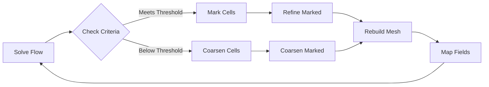
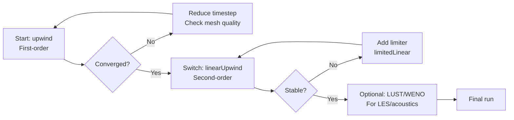

# Advanced Numerical Methods in OpenFOAM

เทคนิคเชิงตัวเลขขั้นสูงสำหรับการเพิ่มความแม่นยำและประสิทธิภาพการคำนวณ

---

**Prerequisites:** 
- Module 02: Meshing Fundamentals, BlockMesh Mastery
- Module 03: Incompressible Flow Solvers (discretization basics)
- Module 03: Turbulence Modeling (RANS/LES requirements)

**Estimated Reading Time:** 45-50 minutes

---

## Learning Objectives

After completing this module, you will be able to:

1. **Design and implement Adaptive Mesh Refinement (AMR)** strategies for dynamic flows with moving features
2. **Select appropriate discretization schemes** based on accuracy requirements and flow characteristics
3. **Configure high-order numerical schemes** for LES and aeroacoustics applications
4. **Evaluate and balance** computational cost vs. accuracy trade-offs in CFD simulations
5. **Apply AMR and scheme selection** to practical test cases with verification

---

## Overview

Advanced numerical methods enable **efficient resolution of complex flow features** without globally excessive computational cost. This module focuses on two critical techniques:

| Technique | Primary Benefit | When to Use |
|-----------|----------------|-------------|
| **AMR** | Dynamic mesh adaptation where needed | Moving interfaces, shocks, vortices |
| **High-Order Schemes** | Reduced numerical diffusion | LES, aeroacoustics, heat transfer |

**Why This Matters:** Standard uniform meshes and first-order schemes are often insufficient for capturing sharp gradients (shocks, interfaces) or turbulent structures. AMR provides **targeted resolution** where it matters, while high-order schemes reduce **artificial damping** of physical phenomena.

> **Note:** Linear solver optimization and parallel computing strategies are covered in **[01_High_Performance_Computing.md](01_High_Performance_Computing.md)**. This module focuses exclusively on discretization accuracy and adaptive meshing.

---

## 1. Adaptive Mesh Refinement (AMR)

### 1.1 What is AMR and Why Use It?

**Adaptive Mesh Refinement (AMR)** dynamically adjusts mesh resolution during simulation based on **refinement criteria** you specify. Unlike static refinement, AMR:

- **Tracks moving features** automatically (shocks, interfaces, vortices)
- **Reduces cell count** by 10-100x compared to uniformly refined meshes
- **Maintains accuracy** where needed while conserving computational resources

**Typical Applications:**
- **Multiphase flows:** VOF interfaces (free surface, bubble dynamics)
- **Compressible flows:** Shock waves, expansion fans
- **Turbulence:** Vortex cores, shear layers
- **Conjugate heat transfer:** Moving thermal fronts

### 1.2 How AMR Works in OpenFOAM

OpenFOAM provides two main AMR approaches:

| Method | Implementation | Best For |
|--------|----------------|----------|
| `dynamicRefineFvMesh` | Hex-based refinement | General purpose, VOF |
| `dynamicFvMesh` (subset) | Custom refinement | Specialized criteria |

**Refinement Process (Every N Steps):**



### 1.3 Configuring dynamicRefineFvMesh

**Basic Setup (`system/blockMeshDict` or created from `blockMesh`):**

```cpp
// constant/dynamicMeshDict
dynamicFvMesh   dynamicRefineFvMesh;

dynamicRefineFvMeshCoeffs
{
    // Field to monitor for refinement
    field           alpha.water;     // VOF: 0=air, 1=water
    
    // Refinement thresholds
    lowerRefineLevel 0.01;          // Coarsen below this
    upperRefineLevel 0.99;          // Refine above this
    
    // Refinement limits
    maxRefinementLevel 2;           // Max refinement levels (0=base)
    maxCells        200000;         // Global cell limit
    
    // Frequency
    refineInterval  1;              // Check every timestep
    unrefineInterval  5;            // Coarsening check frequency
    
    // Buffer zones
    nBufferLayers   1;              // Layers around refined cells
}
```

**Key Parameters Explained:**

| Parameter | Effect | Typical Range |
|-----------|--------|---------------|
| `maxRefinementLevel` | Max cell division (2 = 4x cells per level) | 2-4 for VOF, 1-2 for shocks |
| `nBufferLayers` | Prevents rapid refine/unrefine cycling | 1-2 |
| `refineInterval` | Controls computational overhead | 1 (fine) to 5 (coarse) |
| `maxCells` | Safety limit to prevent memory overflow | Estimate: 2-3x initial cells |

### 1.4 Selecting Refinement Criteria

The **most critical AMR decision** is choosing appropriate refinement criteria. Poor choices lead to:

- **Over-refinement:** Excessive cells, slow runs
- **Under-refinement:** Missed physics, inaccurate results

**Common Criteria by Application:**

| Application | Field | Formula | Threshold Guide |
|-------------|-------|---------|-----------------|
| **VOF Interface** | `alpha.water` | `0.01 < alpha < 0.99` | Captures sharp interface |
| **Shock Waves** | `|∇p|` | Gradient magnitude | Calibrate to expected shock strength |
| **Vortices** | `|ω|` | Vorticity magnitude | Based on circulation strength |
| **Temperature Fronts** | `|∇T|` | Thermal gradient | High in conjugate HT |
| **Shear Layers** | `|∇U|` | Velocity gradient | Turbulent mixing regions |

**Practical Threshold Selection:**

1. **Initial Estimate:** Use characteristic scales
   - VOF: `0.01-0.99` for interface
   - Shocks: `|∇p| > 0.1 × (p_max - p_min) / L`
   
2. **Refine in Stages:** Start conservative, tighten after initial run

3. **Monitor Refinement:**
   ```bash
   # Check refinement levels during simulation
   grep -i "refined" log.simpleFoam
   ```

### 1.5 AMR Best Practices

✅ **DO:**
- Start with **coarse base mesh** (AMR adds detail where needed)
- Use **buffer layers** (prevents rapid refinement cycling)
- Set **reasonable maxCells** limit (2-3x initial mesh)
- Test **refineInterval** impact (1 = accurate but expensive)

❌ **DON'T:**
- Refine **every field** simultaneously (choose 1-2 primary criteria)
- Set **maxRefinementLevel > 4** (diminishing returns, high cost)
- Forget to **check cell counts** during long runs
- Use AMR for **steady-state** problems (static mesh is better)

### 1.6 AMR Exercise: Dam Break VOF

**Objective:** Implement AMR for a 2D dam break case

**Steps:**

1. **Create Base Mesh:**
   ```bash
   cp -r1$FOAM_TUTORIALS/multiphase/interFoam/laminar/damBreak \
         myDamBreakAMR
   cd myDamBreakAMR
   ```

2. **Modify `constant/dynamicMeshDict`:**
   ```cpp
   dynamicFvMesh   dynamicRefineFvMesh;
   
   dynamicRefineFvMeshCoeffs
   {
       field           alpha.water;
       lowerRefineLevel 0.01;
       upperRefineLevel 0.99;
       maxRefinementLevel 2;
       maxCells        50000;
       refineInterval  1;
       nBufferLayers   1;
   }
   ```

3. **Run with AMR:**
   ```bash
   blockMesh
   interFoam
   ```

4. **Compare Results:**
   - Check `log.interFoam` for cell count evolution
   - Visualize refinement levels in ParaView (`cellLevel` field)
   - Compare runtime vs. uniformly refined mesh

**Expected Result:** 30-50% cell reduction in bulk regions, maintained resolution at interface

---

## 2. High-Order Discretization Schemes

### 2.1 What Are Discretization Schemes?

Discretization schemes determine **how gradients and divergences** are approximated on the mesh. The scheme choice directly impacts:

- **Numerical accuracy:** Order of truncation error
- **Stability:** Resistance to oscillations/divergence
- **Computational cost:** Iterations, convergence rate

**Trade-off Summary:**

| Scheme Order | Accuracy | Stability | Cost |
|--------------|----------|-----------|------|
| 1st (upwind) | Low | High | Low |
| 2nd (linear) | Medium | Medium | Medium |
| 3rd+ (QUICK, WENO) | High | Low | High |

### 2.2 Why High-Order Schemes Matter

First-order upwind schemes introduce **numerical diffusion** (false viscosity):

$$
\varepsilon_{numerical} \sim \frac{U \Delta x}{2} \left(1 - \frac{\Delta t}{\Delta x / U}\right)
$$

This artificial diffusion:
- **Smears sharp gradients** (shocks, interfaces)
- **Damps turbulent fluctuations** (underpredicts Reynolds stresses)
- **Reduces vortex strength** (excessive dissipation)

**When High-Order is Essential:**
- **LES:** Resolving turbulent spectra (requires < 5% numerical dissipation)
- **Aeroacoustics:** Sound wave propagation (phase errors corrupt acoustics)
- **Heat transfer:** Temperature gradients (accuracy affects Nusselt number)
- **Multiphase:** Interface sharpness (diffusion smears VOF)

### 2.3 Common OpenFOAM Schemes

**Divergence Schemes (`divSchemes` in `system/fvSchemes`):**

| Scheme | Order | Stability | Best For |
|--------|-------|-----------|----------|
| `Gauss upwind` | 1st | Very High | Initial runs, robustness |
| `Gauss linearUpwind` | 2nd | Good | General purpose (default) |
| `Gauss LUST` | 2nd blended | Good | LES (blends 80% linear) |
| `Gauss QUICK` | 3rd | Medium | Structured meshes |
| `Gauss WENO` | 5th | Low | Aeroacoustics, shocks |

**Gradient Schemes (`gradSchemes`):**

| Scheme | Properties | Use Case |
|--------|-----------|----------|
| `Gauss linear` | 2nd order, unlimited | Smooth flows |
| `cellLimited Gauss linear 1` | Bounded, prevents overshoots | Compressible, VOF |
| `leastSquares` | 2nd order, non-orthogonal | Poor quality meshes |

**Laplacian Schemes (`laplacianSchemes`):**

```cpp
// Default for most cases
default         Gauss linear corrected;

// For highly non-orthogonal meshes (> 70 deg)
laplacian(nu,U) Gauss linear limited 0.5;
```

### 2.4 Scheme Selection Guide

**By Application:**

| Application | Divergence | Gradient | Laplacian |
|-------------|-----------|----------|-----------|
| **RANS Steady** | `linearUpwind` | `limited linear 1` | `linear corrected` |
| **LES** | `LUST` or `linearUpwind` | `limited linear 1` | `linear corrected` |
| **Compressible** | `upwind` (initial) → `linearUpwind` | `limited linear 1` | `linear corrected` |
| **Multiphase** | `upwind` for VOF | `limited linear 1` | `linear corrected` |
| **Aeroacoustics** | `WENO` | `limited linear 1` | `linear corrected` |

### 2.5 Configuring fvSchemes

**Example 1: LES (Standard Setup):**

```cpp
// system/fvSchemes
ddtSchemes
{
    default         steadyState;  // or Euler for transient
}

gradSchemes
{
    default         Gauss linear;
}

divSchemes
{
    default         Gauss linearUpwind grad(U);  // 2nd order
    
    // LES-specific: blend schemes for turbulent transport
    div(phi,k)      Gauss LUST grad(k);          // 80% linear + 20% upwind
    div(phi,epsilon) Gauss LUST grad(epsilon);
    
    // Momentum: higher order for vortex resolution
    div(phi,U)      Gauss linearUpwindV grad(U); // Vector-based
}

laplacianSchemes
{
    default         Gauss linear corrected;       // Non-orthogonal correction
}

interpolationSchemes
{
    default         linear;
}

snGradSchemes
{
    default         corrected;                   // Non-orthogonal correction
}
```

**Example 2: Compressible Flow (Shock Capturing):**

```cpp
divSchemes
{
    // Start with upwind for stability
    div(phi,U)      Gauss upwind;
    
    // After initial convergence, switch to:
    div(phi,U)      Gauss linearUpwindV grad(U);
    
    // Energy: always use limited scheme
    div(phi,e)      Gauss limitedLinearV 1;
}

gradSchemes
{
    // Bounded gradients prevent overshoots near shocks
    default         cellLimited Gauss linear 1;
}
```

### 2.6 Scheme Stability and Convergence

**Common Issues and Solutions:**

| Symptom | Cause | Fix |
|---------|-------|-----|
| Divergence early in run | Too high-order scheme | Start with `upwind`, switch after convergence |
| Oscillations near shocks | Unlimited gradients | Use `limited` schemes |
| Slow convergence | Over-refined mesh for scheme order | Coarsen mesh or use higher-order scheme |
| Artificial damping | 1st order scheme on LES | Switch to `LUST` or `linearUpwind` |

**Progressive Scheme Refinement Strategy:**



### 2.7 Scheme Exercise: Impact on Vortex Shedding

**Objective:** Compare first vs. second-order schemes on 2D cylinder flow

**Setup:**

1. **Copy Tutorial:**
   ```bash
   cp -r1$FOAM_TUTORIALS/incompressible/pimpleFoam/TJunction \
         myCylinderSchemes
   cd myCylinderSchemes
   ```

2. **Run Baseline (First-Order):**
   ```cpp
   // system/fvSchemes (first-order)
   divSchemes
   {
       div(phi,U)      Gauss upwind;
   }
   ```
   ```bash
   pimpleFoam > log_upwind.log
   ```

3. **Run High-Order:**
   ```cpp
   // system/fvSchemes (second-order)
   divSchemes
   {
       div(phi,U)      Gauss linearUpwindV grad(U);
   }
   ```
   ```bash
   pimpleFoam > log_linearUpwind.log
   ```

4. **Compare Results:**
   - Plot Strouhal number (shedding frequency) from probe data
   - Visualize vorticity magnitude: `postProcess -func vorticity`
   - Check convergence rate: `grep "Initial residual" log_*.log`

**Expected Result:** Second-order scheme shows:
- Sharper vorticity gradients (less numerical diffusion)
- More accurate shedding frequency (closer to St ≈ 0.21 for cylinder)
- 10-20% longer convergence time

---

## 3. Practical Applications

### 3.1 LES with Dynamic AMR

**Challenge:** LES requires fine resolution for turbulent structures, but full-domain refinement is prohibitive.

**Solution:** Combine **AMR for vorticity** + **LUST schemes**:

```cpp
// constant/dynamicMeshDict
dynamicRefineFvMeshCoeffs
{
    field           vorticity.magnitude;  // Refine on |ω|
    lowerRefineLevel 10;                  // s⁻² (adjust to flow)
    upperRefineLevel 50;
    maxRefinementLevel 2;
    maxCells        5000000;
}

// system/fvSchemes
divSchemes
{
    div(phi,U)      Gauss LUST grad(U);   // 80% linear / 20% upwind
    div(phi,k)      Gauss LUST grad(k);
    div(phi,omega)  Gauss LUST grad(omega);
}
```

**Result:** Resolved eddies in shear layers, coarser mesh in quiescent regions

### 3.2 Compressible Shock Capturing

**Challenge:** Capturing sharp shocks without oscillations

**Solution:** **AMR on pressure gradient** + **limited schemes**:

```cpp
dynamicRefineFvMeshCoeffs
{
    field           mag(grad(p));         // Refine on ∇p
    upperRefineLevel 10000;               // Pa/m (calibrate)
    maxRefinementLevel 3;
}

gradSchemes
{
    default         cellLimited Gauss linear 1;  // Bounded gradients
}

divSchemes
{
    div(phi,U)      Gauss limitedLinearV 1;     // TVD limiter
}
```

### 3.3 VOF Interface Tracking

**Challenge:** Maintain sharp interface without excessive cells

**Solution:** **VOF-based AMR** + **MULES limiting**:

```cpp
dynamicRefineFvMeshCoeffs
{
    field           alpha.water;           // Interface zone
    lowerRefineLevel 0.01;
    upperRefineLevel 0.99;
    nBufferLayers   2;                     // Wider buffer
}

divSchemes
{
    div(phi,alpha.water)  Gauss vanLeer;   // TVD for VOF
    div(phi,U)      Gauss linearUpwindV grad(U);
}
```

---

## 4. Troubleshooting Guide

| Issue | Diagnosis | Solution |
|-------|-----------|----------|
| **AMR cell explosion** | `maxCells` exceeded rapidly | Reduce `upperRefineLevel`, increase `lowerRefineLevel` |
| **Rapid refine/unrefine cycling** | Buffer too narrow | Increase `nBufferLayers` to 2-3 |
| **Interface smearing with AMR** | Refinement not tracking interface | Check field name, tighten `upperRefineLevel` |
| **Divergence with high-order scheme** | Too aggressive for mesh | Start with `upwind`, progressively upgrade |
| **Unphysical oscillations** | Unlimited gradients | Switch to `limitedLinear` or `cellLimited` |
| **Slow convergence** | Scheme order too high for mesh quality | Use `linearUpwind` instead of WENO/QUICK |

---

## Key Takeaways

1. **AMR provides targeted resolution** where needed (10-100x efficiency vs. uniform refinement)
   - Choose refinement criteria based on **physics** (gradient, vorticity, field range)
   - Always set `maxCells` limit and use **buffer layers** for stability

2. **High-order schemes reduce numerical diffusion** but require careful implementation
   - **2nd order (`linearUpwind`)** is standard for most applications
   - **LES requires LUST or better** to resolve turbulent spectra
   - **Start stable (upwind), then upgrade** scheme order progressively

3. **Scheme selection is application-dependent:**
   - **RANS:** `linearUpwind` with limiters
   - **LES:** `LUST` for turbulent transport
   - **Compressible:** Limited schemes + AMR on ∇p
   - **Multiphase:** VOF-based AMR + TVD limiters

4. **AMR and schemes interact:** High-order schemes benefit most from refined meshes, but excessive refinement with low-order schemes wastes compute

5. **Always verify:** Compare results against known cases (experimental or DNS) to ensure numerical artifacts are minimized

---

## Practice Exercises

### Exercise 1: AMR Criteria Sensitivity

**Task:** Run a VOF dam break with 3 different refinement thresholds and compare:

1. Baseline: `lowerRefineLevel 0.01`, `upperRefineLevel 0.99`
2. Aggressive: `lowerRefineLevel 0.05`, `upperRefineLevel 0.95`
3. Conservative: `lowerRefineLevel 0.001`, `upperRefineLevel 0.999`

**Metrics:** Cell count, runtime, interface sharpness

### Exercise 2: Scheme Order Impact on LES

**Task:** Run channel flow LES (tutorial available) with:

1. `upwind` divergence scheme
2. `linearUpwind` scheme  
3. `LUST` scheme

**Compare:** Mean velocity profile, Reynolds stresses, spectral content

### Exercise 3: AMR + High-Order Combined

**Task:** Implement both AMR (vorticity-based) and LUST schemes for flow past a bluff body. Compare against:
- Uniform mesh + upwind
- Uniform mesh + LUST
- AMR + LUST

**Expected:** AMR + LUST provides best accuracy/cost ratio

---

## References and Further Reading

1. **OpenFOAM User Guide:** Chapter 4 (Finite Volume Method), Chapter 6 (Mesh Description)
2. **Jasak, H. (1996):** "Error Analysis and Estimation for the Finite Volume Method" (PhD thesis)
3. **Berger & Colella (1989):** "Local adaptive mesh refinement for shock hydrodynamics" (JCP)
4. **Ferziger & Perić (2002):** "Computational Methods for Fluid Dynamics" (Chapter 3: Discretization)

---

## Related Documents

### Prerequisites (Complete First)
- **[Module 02: BlockMesh Mastery](../../MODULE_02_MESHING_AND_CASE_SETUP/CONTENT/02_BLOCKMESH_MASTERY/00_Overview.md)** - Mesh structure and quality
- **[Module 03: Incompressible Flow Solvers](../01_INCOMPRESSIBLE_FLOW_SOLVERS/01_Introduction.md)** - Discretization basics

### Related Topics
- **[01_High_Performance_Computing.md](01_High_Performance_Computing.md)** - Linear solvers, parallelization (removed from this file to avoid duplication)
- **[04_Multiphysics.md](04_Multiphysics.md)** - Conjugate heat transfer, FSI applications

### Next in This Module
- **[01_High_Performance_Computing.md](01_High_Performance_Computing.md)** - Solver optimization and HPC techniques

---

**Last Updated:** 2024-12-30  
**Module:** 03_SINGLE_PHASE_FLOW / 07_Advanced_Topics  
**Revision:** 2.0 (Refactored for 3W Framework, removed duplicated HPC content)