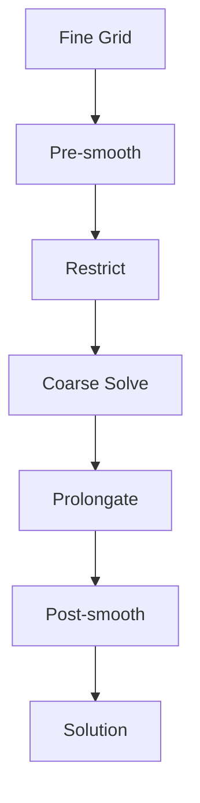

# Advanced Numerical Methods

เทคนิคเชิงตัวเลขขั้นสูงสำหรับ OpenFOAM

---

## Overview

| Topic | Purpose | Key Files |
|-------|---------|-----------|
| **AMR** | Runtime mesh refinement | `dynamicRefineFvMeshDict` |
| **High-Order Schemes** | Accuracy improvement | `fvSchemes` |
| **Linear Solver Optimization** | Fast convergence | `fvSolution` |
| **Parallel Optimization** | Large-scale runs | `decomposeParDict` |

---

## 1. Adaptive Mesh Refinement (AMR)

### dynamicRefineFvMeshDict

```cpp
dynamicFvMesh   dynamicRefineFvMesh;

dynamicRefineFvMeshCoeffs
{
    field           alpha.water;     // Refinement criterion field
    lowerRefineLevel 0.01;
    upperRefineLevel 0.99;
    maxRefinementLevel 2;            // Max refinement levels
    maxCells        200000;
    refineInterval  1;               // Check every N steps
    nBufferLayers   1;
}
```

### Refinement Criteria

| Criterion | Formula | Use Case |
|-----------|---------|----------|
| Gradient | $|\nabla \phi| > \epsilon$ | Shocks, interfaces |
| Vorticity | $|\omega| > \epsilon$ | Vortex tracking |
| Field range | $\phi_{min} < \phi < \phi_{max}$ | VOF interface |

---

## 2. High-Order Schemes

### Scheme Comparison

| Scheme | Order | Stability | Use Case |
|--------|-------|-----------|----------|
| `upwind` | 1st | High | Initial runs |
| `linearUpwind` | 2nd | Good | Standard |
| `LUST` | 2nd blend | Good | LES |
| `WENO` | 5th | Low | Aeroacoustics |

### fvSchemes Example

```cpp
divSchemes
{
    div(phi,U)   Gauss linearUpwindV grad(U);  // 2nd-order
    div(phi,k)   Gauss upwind;                  // 1st-order for stability
}

gradSchemes
{
    default      Gauss linear;
    grad(U)      cellLimited Gauss linear 1;   // Limited gradient
}

laplacianSchemes
{
    default      Gauss linear corrected;       // Non-orthogonal correction
}
```

---

## 3. Linear Solver Optimization

### Solver Selection

| Equation | Recommended Solver | Why |
|----------|-------------------|-----|
| Pressure | `GAMG` | Multigrid, fast for elliptic |
| Velocity | `smoothSolver` | Non-symmetric matrix |
| Turbulence | `PBiCGStab` | Robust for transport |

### GAMG Configuration

```cpp
p
{
    solver          GAMG;
    tolerance       1e-7;
    relTol          0.01;
    smoother        GaussSeidel;
    nPreSweeps      0;
    nPostSweeps     2;
    cacheAgglomeration on;
}
```

### AMG V-Cycle



---

## 4. Parallel Computing

### decomposeParDict

```cpp
numberOfSubdomains  8;
method              scotch;   // or metis, simple, hierarchical

constraints
{
    preservePatches { type preservePatches; patches (inlet outlet); }
}
```

### Parallel Workflow

```bash
# 1. Decompose
decomposePar

# 2. Run parallel
mpirun -np 8 simpleFoam -parallel

# 3. Reconstruct
reconstructPar
```

### Load Balancing

- `scotch`: Automatic, good for complex geometries
- `simple`: Fast, uniform meshes
- `hierarchical`: Structured domains

---

## 5. Performance Tips

| Issue | Solution |
|-------|----------|
| Slow pressure solve | Use GAMG, increase `nPreSweeps` |
| High memory | Reduce `maxCells` in AMR |
| Poor scaling | Check decomposition quality |
| Divergence | Lower-order schemes first |

### Cache Optimization

```cpp
// Face-based loop (cache-friendly)
forAll(mesh.faces(), faceI)
{
    const label own = owner[faceI];
    const label nei = neighbour[faceI];
    // Sequential memory access
}
```

---

## Concept Check

<details>
<summary><b>1. AMR เหมาะกับปัญหาประเภทไหน?</b></summary>

เหมาะกับปัญหาที่มี **features เคลื่อนที่** เช่น shock waves, VOF interfaces, หรือ vortices — ให้ความละเอียดสูงเฉพาะที่จำเป็นโดยไม่ต้องทำ mesh ละเอียดทั้งโดเมน
</details>

<details>
<summary><b>2. GAMG ทำไมเร็วกว่า PCG สำหรับ pressure?</b></summary>

GAMG ใช้ **multigrid** — แก้ low-frequency errors บน coarse grids ได้เร็วกว่า iterative methods เพราะ low-frequency errors ลู่เข้าช้ามากบน fine grid
</details>

<details>
<summary><b>3. `scotch` vs `simple` decomposition ต่างกันอย่างไร?</b></summary>

- **scotch**: Graph partitioning, minimize communication
- **simple**: Geometric cuts, faster but may cause load imbalance

ใช้ `scotch` สำหรับ complex geometries, `simple` สำหรับ structured meshes
</details>

---

## Related Documents

- **บทก่อนหน้า:** [02_Advanced_Turbulence.md](02_Advanced_Turbulence.md)
- **บทถัดไป:** [04_Multiphysics.md](04_Multiphysics.md)