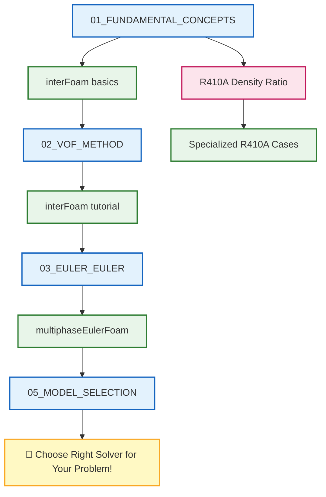

# 🗺️ Learning Navigator: Multiphase Fundamentals

> [!TIP]
> **ทำไมการเรียนรู้ Multiphase Flow สำคัญ?**
>
> การไหลแบบหลายเฟส (Multiphase Flow) เป็นหัวใจของการจำลองปรากฏการณ์จริงที่ซับซ้อน เช่น:
> - **การเคลื่อนที่ของคลื่นและ Dam break** → ต้องใช้ VOF method (`interFoam`)
> - **กระบอกฟองอากาศ (Bubble column)** → ต้องใช้ Euler-Euler (`multiphaseEulerFoam`)
> - **การผสมของเหลว 2 ชนิด** → ต้องเข้าใจ Interfacial forces
>
> การเลือก **โมเดลที่เหมาะสม** กับปัญหาของคุณเป็นกุญแจสำคัญที่จะทำให้ Simulation:
> - **มีความเสถียร (Stability)**: Interface ไม่แตกออกหรือกลายเป็น "sawtooth" pattern
> - **มีความแม่นยำ (Accuracy)**: ทำนายการเคลื่อนที่ของ Interface ได้ถูกต้อง
> - **ประหยัดเวลา (Efficiency)**: ไม่ใช้เวลาคำนวณนานเกินไป
>
> เอกสารฉบับนี้เป็น **แผนที่เดินเรือ** ที่จะพาคุณไปสู่การเลือก Solver ที่เหมาะสม!

---

## 📋 สารบัญ

1. [Fundamental Concepts](#1-fundamental-concepts-แนวคิดพื้นฐาน)
2. [VOF Method](#2-vof-method-วิธี-volume-of-fluid)
3. [Euler-Euler Method](#3-euler-euler-method)
4. [Model Selection](#4-model-selection-การเลือกโมเดล)
5. [Implementation](#5-implementation-การนำไปใช้งาน)
6. [Validation](#6-validation-การตรวจสอบความถูกต้อง)
7. [Equations Reference](#7-equations-reference-เอกสารอ้างอิงสมการ)

---

## 1. Fundamental Concepts (แนวคิดพื้นฐาน)

> [!NOTE] **📂 OpenFOAM Context**
> **Domain A: Physics & Fields** - ข้อมูลในหมวดนี้เกี่ยวข้องกับการกำหนดคุณสมบัติทางฟิสิกส์ของระบบหลายเฟส:
> - **File**: `constant/phaseProperties` (หรือ `constant/transportProperties` ในรุ่นเก่า)
> - **Keywords**: `phases`, `sigma` (surface tension), `phase1`, `phase2`
> - **Relevance**: การเข้าใจ Flow regimes และ Interfacial phenomena จะช่วยให้คุณเลือกชนิดของเฟสและคุณสมบัติที่เหมาะสม
>
> **Domain E: Coding/Customization** - สำหรับผู้ที่ต้องการแก้ไข solver:
> - **Source**: `applications/solvers/multiphase/interFoam/`
> - **Key Files**: `createFields.H` (สร้าง fields), `alphaEqn.H` (สมการ VOF)

| 📖 เนื้อหา | 📝 คำอธิบาย | 🔧 Source Code ที่เกี่ยวข้อง |
|-----------|------------|---------------------------|
| [[00_Overview]] | ภาพรวมของโมดูล | `solvers/multiphase/` |
| [[01_FUNDAMENTAL_CONCEPTS/00_Overview]] | ภาพรวมแนวคิดพื้นฐาน | `solvers/multiphase/interFoam/` |
| [[01_FUNDAMENTAL_CONCEPTS/01_Flow_Regimes]] | ระบอบการไหล | `solvers/multiphase/` |
| [[01_FUNDAMENTAL_CONCEPTS/02_Interfacial_Phenomena]] | ปรากฏการณ์ที่ผิวสัมผัส | `solvers/multiphase/interFoam/` |
| [[R410A/R410A_Density_Ratio]] | R410A ความหนาแน่นสูง | โมเดลเฉพาะ R410A |

### 🎯 Study Guide

| ขั้นตอน | กิจกรรม | เวลาโดยประมาณ |
|--------|---------|--------------|
| 1 | อ่าน `00_Overview` เข้าใจภาพรวม multiphase | 30 นาที |
| 2 | ศึกษา `01_Flow_Regimes` เข้าใจประเภทการไหล | 30 นาที |
| 3 | เปิด `interFoam/` ดูโครงสร้าง solver | 30 นาที |

---

## 2. VOF Method (วิธี Volume of Fluid)

> [!NOTE] **📂 OpenFOAM Context**
> **Domain A: Physics & Fields** - VOF method ใช้ field พิเศษเพื่อติดตาม interface:
> - **Field Files** (`0/` directory):
>   - `alpha.water` (หรือ `alpha.phase1`): Volume fraction field (ค่า 0-1)
>   - `U`: Velocity field
>   - `p_rgh`: Pressure field (hydrostatic pressure)
> - **Properties** (`constant/` directory):
>   - `phaseProperties`: กำหนดชื่อเฟส, ความหนาแน่น, ความหื้อ (`nu`)
>   - `transportProperties`: Surface tension coefficient (`sigma`)
>
> **Domain B: Numerics & Linear Algebra** - การจำลอง VOF ต้องการ discretization schemes เฉพาะ:
> - **File**: `system/fvSchemes`
> - **Critical Keywords**:
>   - `divSchemes`: ใช้ `Gauss vanLeer` หรือ `Gauss linearUpwindV` สำหรับ convection
>   - `laplacianSchemes`: ใช้ `Gauss linear corrected` สำหรับ diffusion
> - **File**: `system/fvSolution`
> - **Critical Keywords**:
>   - `PIMPLE`: ใช้ `nAlphaCorr` (number of alpha corrections) และ `nAlphaSubCycles` สำหรับความเสถียรของ interface
>
> **Domain C: Simulation Control** - การควบคุมเวลาและการเขียนผล:
> - **File**: `system/controlDict`
> - **Keywords**: `adjustTimeStep`, `maxCo` (Courant number), `maxAlphaCo`

| 📖 เนื้อหา | 📝 คำอธิบาย | 🔧 Source Code ที่เกี่ยวข้อง |
|-----------|------------|---------------------------|
| [[02_VOF_METHOD/00_Overview]] | ภาพรวมวิธี VOF | `solvers/multiphase/interFoam/` |
| [[02_VOF_METHOD/01_The_VOF_Concept]] | แนวคิด VOF | `solvers/multiphase/interFoam/interFoam.C` |
| [[02_VOF_METHOD/02_Interface_Compression]] | การบีบอัด Interface | `solvers/multiphase/interFoam/` |
| [[02_VOF_METHOD/03_Setting_Up_InterFoam]] | การตั้งค่า interFoam | `solvers/multiphase/interFoam/` |
| [[02_VOF_METHOD/04_Adaptive_Time_Stepping]] | Adaptive Time Stepping | `solvers/multiphase/interFoam/` |

---

## 3. Euler-Euler Method

> [!NOTE] **📂 OpenFOAM Context**
> **Domain A: Physics & Fields** - Euler-Euler มองทุกเฟสเป็น interpenetrating continua:
> - **Field Files** (`0/` directory):
>   - `alpha.<phaseName>`: Volume fraction สำหรับแต่ละเฟส
>   - `U.<phaseName>`: Velocity field สำหรับแต่ละเฟส
>   - `k`, `epsilon`, `omega`: Turbulence fields
> - **Properties** (`constant/` directory):
>   - `phaseProperties`: กำหนด phases, drag models, lift models, virtual mass
>   - `turbulenceProperties`: กำหนด turbulence model สำหรับ multiphase
>
> **Domain B: Numerics & Linear Algebra** - การแก้สมการหลายเฟสต้องการ solvers เฉพาะ:
> - **File**: `system/fvSchemes`
> - **Keywords**: ใช้ `Gauss upwind` สำหรับ stability ของ multiphase
> - **File**: `system/fvSolution`
> - **Critical Keywords**:
>   - `solvers`: ต้องใช้ `GAMG` สำหรับ pressure และ `smoothSolver` สำหรับ velocity/alpha
>   - `PIMPLE`: อาจต้องปรับ `nOuterCorrectors` สำหรับ coupling ระหว่างเฟส
>
> **Domain E: Coding/Customization** - สถาปัตยกรรมของ Euler-Euler solver:
> - **Source**: `applications/solvers/multiphase/multiphaseEulerFoam/`
> - **Key Files**:
>   - `multiphaseEulerFoam.C`: Main solver loop
>   - `phaseSystems/`: Implementation ของ interphase forces (drag, lift, virtual mass)
>   - `dragModels/`, `liftModels/`: Sub-models สำหรับแต่ละ force

| 📖 เนื้อหา | 📝 คำอธิบาย | 🔧 Source Code ที่เกี่ยวข้อง |
|-----------|------------|---------------------------|
| [[03_EULER_EULER_METHOD/00_Overview]] | ภาพรวม Euler-Euler | `solvers/multiphase/multiphaseEulerFoam/` |
| [[03_EULER_EULER_METHOD/01_Introduction]] | แนะนำวิธี Euler-Euler | `solvers/multiphase/multiphaseEulerFoam/multiphaseEulerFoam.C` |
| [[03_EULER_EULER_METHOD/02_Mathematical_Framework]] | กรอบทางคณิตศาสตร์ | `solvers/multiphase/multiphaseEulerFoam/` |
| [[03_EULER_EULER_METHOD/03_Implementation_Concepts]] | แนวคิดการ Implement | `solvers/multiphase/multiphaseEulerFoam/` |

---

## 4. Model Selection (การเลือกโมเดล)

> [!NOTE] **📂 OpenFOAM Context**
> **Domain A: Physics & Fields** - การเลือกโมเดลขึ้นอยู่กับลักษณะของปัญหา:
>
> **Flow Characteristics → Solver Mapping:**
> - **Dispersed bubbles/droplets** ( dispersed phase < 10-15%):
>   - ใช้ `multiphaseEulerFoam` (Euler-Euler)
>   - `phaseProperties`: กำหนด dispersed phase และ continuous phase
>   - Drag model: `SchillerNaumann`, `IshiiZuber`
>
> - **Separated flows** ด้วย clear interface:
>   - ใช้ `interFoam` (VOF)
>   - `phaseProperties`: กำหนด phase1 และ phase2
>   - Surface tension: สำคัญมาก (ใส่ `sigma`)
>
> - **Free surface flows** (wave, sloshing):
>   - ใช้ `interFoam` หรือ `potentialFreeSurfaceFoam`
>   - BC: `inletOutlet` สำหรับ velocity, `fixedFluxPressure` สำหรับ pressure
>
> **Phase Properties → Model Decision:**
> - **Gas-Liquid**: Surface tension สำคัญ → VOF หรือ Euler-Euler
> - **Liquid-Liquid**: Density difference น้อย → twoLiquidMixingFoam
> - **Gas-Solid**: ใช้ Euler-Euler พร้อม kinetic theory models
>
> **Key Files สำหรับ Model Configuration:**
> - `constant/phaseProperties`: เลือก drag/lift/virtual mass models
> - `constant/turbulenceProperties`: เลือก turbulence model (k-epsilon, k-omega SST)
> - `0/` boundary conditions: ต้อง match กับ flow regime

| 📖 เนื้อหา | 📝 คำอธิบาย | 🔧 Source Code ที่เกี่ยวข้อง |
|-----------|------------|---------------------------|
| [[05_MODEL_SELECTION/00_Overview]] | ภาพรวมการเลือกโมเดล | - |
| [[05_MODEL_SELECTION/01_Decision_Framework]] | กรอบการตัดสินใจ | - |
| [[05_MODEL_SELECTION/02_Gas_Liquid_Systems]] | ระบบ Gas-Liquid | `solvers/multiphase/multiphaseEulerFoam/` |
| [[05_MODEL_SELECTION/03_Liquid_Liquid_Systems]] | ระบบ Liquid-Liquid | `solvers/multiphase/twoLiquidMixingFoam/` |
| [[05_MODEL_SELECTION/04_Gas_Solid_Systems]] | ระบบ Gas-Solid | `solvers/multiphase/multiphaseEulerFoam/` |
| [[05_MODEL_SELECTION/05_Model_Selection_Flowchart]] | Flowchart การเลือกโมเดล | - |

---

## 5. Implementation (การนำไปใช้งาน)

> [!NOTE] **📂 OpenFOAM Context**
> **Domain E: Coding/Customization** - หมวดนี้เจาะจงไปที่ architecture ของ OpenFOAM solvers:
>
> **Source Code Structure:**
> - **Main Solver Directory**: `applications/solvers/multiphase/<solverName>/`
> - **Key Files**:
>   - `<solverName>.C`: Main entry point และ time loop
>   - `createFields.H`: สร้าง fields (U, p, alpha, etc.)
>   - `UEqn.H`, `pEqn.H`, `alphaEqn.H`: สมการแยกส่วน
>
> **Compilation & Customization:**
> - **Make/files**: ระบุ source files ที่ต้อง compile
> - **Make/options**: กำหนด include paths และ libraries
>
> **Runtime Architecture (เมื่อ run simulation):**
> - **`0/`**: Initial & boundary conditions
>   - `alpha.water`: ต้อง set ค่าเริ่มต้นให้ถูกต้อง (0 หรือ 1)
>   - `U`, `p_rgh`: BCs ต้องสอดคล้องกับ flow regime
> - **`constant/`**: Physical properties
>   - `phaseProperties`: หัวใจของ multiphase simulation
>   - `transportProperties`, `turbulenceProperties`
> - **`system/`**: Numerical schemes และ control
>   - `controlDict`: จัดการ time stepping, output intervals
>   - `fvSchemes`: Discretization schemes
>   - `fvSolution`: Linear solvers และ algorithm settings
>
> **Post-Processing Integration:**
> - `system/controlDict`: เพิ่ม `functions` สำหรับ runtime monitoring
> - Function objects: `forces`, `fields`, `probes`, `sets`

| 📖 เนื้อหา | 📝 คำอธิบาย | 🔧 Source Code ที่เกี่ยวข้อง |
|-----------|------------|---------------------------|
| [[06_IMPLEMENTATION/00_Overview]] | ภาพรวมการ Implement | `solvers/multiphase/` |
| [[06_IMPLEMENTATION/01_Solver_Overview]] | ภาพรวม Solvers | `solvers/multiphase/interFoam/` |
| [[06_IMPLEMENTATION/02_Code_Architecture]] | สถาปัตยกรรมโค้ด | `solvers/multiphase/multiphaseEulerFoam/` |
| [[06_IMPLEMENTATION/03_Model_Architecture]] | สถาปัตยกรรมโมเดล | `solvers/multiphase/multiphaseEulerFoam/` |
| [[06_IMPLEMENTATION/04_Algorithm_Flow]] | การไหลของ Algorithm | `solvers/multiphase/interFoam/` |
| [[06_IMPLEMENTATION/05_Parallel_Implementation]] | การ Implement แบบขนาน | `utilities/parallelProcessing/` |

---

## 6. Validation (การตรวจสอบความถูกต้อง)

> [!NOTE] **📂 OpenFOAM Context**
> **Domain C: Simulation Control + Post-Processing** - การ validation ต้องการการเก็บข้อมูลและวิเคราะห์:
>
> **Runtime Monitoring (system/controlDict):**
> - **Function Objects** สำหรับ validation:
>   - `probes`: บันทึกค่าที่ตำแหน่งจุดวัด (เทียบกับ experimental data)
>   - `sets`: บันทึกค่าตามเส้น (line sampling)
>   - `surfaceSampling`: สุ่มค่าบนพื้นผิว
>   - `forces`: คำนวณ drag/lift forces (เทียบกับ theory)
>
> **Output Control:**
> - `writeFormat`: `binary` สำหรับความแม่นยำสูง, `ascii` สำหรับง่ายต่อการอ่าน
> - `writePrecision`: จำนวนหลัก (default = 6)
> - `writeInterval`: ความถี่ในการบันทึกผล
>
> **Mesh Quality (constant/polyMesh/):**
> - ใช้ `checkMesh` ตรวจสอบ:
>   - `non-orthogonality`: ควร < 70
>   - `skewness`: ควร < 4
>   - `aspect ratio`: ควรไม่สูงเกินไป
>
> **Benchmark Problems (tutorials/):**
> - **Dam break**: `tutorials/multiphase/interFoam/laminar/damBreak/`
> - **Bubble column**: `tutorials/multiphase/multiphaseEulerFoam/RAS/bubbleColumn/`
> - **LockExchange**: `tutorials/multiphase/interFoam/laminar/lockExchange/`
>
> **Grid Convergence Study:**
> - สร้าง meshes หลายขนาด (refinement levels)
> - ใช้ `refineMesh` หรือ `blockMesh` พร้อม grading
> - เปรียบเทียบ results ระหว่าง meshes

| 📖 เนื้อหา | 📝 คำอธิบาย | 🔧 Source Code ที่เกี่ยวข้อง |
|-----------|------------|---------------------------|
| [[07_VALIDATION/00_Overview]] | ภาพรวม Validation | - |
| [[07_VALIDATION/01_Validation_Methodology]] | วิธีการ Validation | - |
| [[07_VALIDATION/02_Benchmark_Problems]] | ปัญหา Benchmark | - |
| [[07_VALIDATION/03_Grid_Convergence]] | Grid Convergence Study | `utilities/mesh/manipulation/checkMesh/` |
| [[07_VALIDATION/04_Uncertainty_Quantification]] | การวัดความไม่แน่นอน | - |

---

## 7. Equations Reference (เอกสารอ้างอิงสมการ)

> [!NOTE] **📂 OpenFOAM Context**
> **Domain B: Numerics & Linear Algebra + Domain E: Coding** - สมการที่ถูก Implement ใน OpenFOAM:
>
> **Mass Conservation → ใช้ใน:**
> - **`alphaEqn.H`** (VOF solvers): ∂α/∂t + ∇·(Uα) + ∇·(Ucα(1-α)) = 0
>   - อยู่ใน: `applications/solvers/multiphase/interFoam/alphaEqn.H`
>   - Keywords: `divSchemes`, `nAlphaCorr`, `nAlphaSubCycles`
>
> **Momentum Conservation → ใช้ใน:**
> - **`UEqn.H`**: ∂(ρU)/∂t + ∇·(ρUU) = -∇p + ∇·(μ∇U) + F<sub>surface</sub> + F<sub>drag</sub>
>   - อยู่ใน: `applications/solvers/multiphase/interFoam/UEqn.H`
>   - Keywords: `ddtSchemes`, `divSchemes`, `laplacianSchemes`
>
> **Interfacial Forces → ใช้ใน:**
> - **Drag Models**: `src/transportModels/phaseSystems/phaseSystem/dragModels/`
>   - Files: `SchillerNaumann.C`, `IshiiZuber.C`, `Ergun.C`
> - **Lift Models**: `src/transportModels/phaseSystems/phaseSystem/liftModels/`
> - **Virtual Mass**: `src/transportModels/phaseSystems/phaseSystem/virtualMassModels/`
>
> **Energy Equation (ถ้ามี):**
> - **`TEqn.H`** (compressibleInterFoam)
>   - Keywords: `divSchemes` (energy), `laplacianSchemes` (thermal conductivity)
>
> **Turbulence Equations → ใช้ใน:**
> - **`kEqn.H`**, **`epsilonEqn.H`**, **`omegaEqn.H`**
>   - อยู่ใน: `applications/solvers/multiphase/multiphaseEulerFoam/`
>   - หรือ library: `src/turbulenceModels/`
>
> **Implementation Notes:**
> - OpenFOAM ใช้ Finite Volume Method → Discretize สมการเป็นรูป matrix:
>   - `[A][x] = [b]` โดยที่ `A` = coefficient matrix, `x` = field (U, p, α), `b` = source term
> - ใช้ `fvScalarMatrix` และ `fvVectorMatrix` ในการสร้างสมการ discrete
> - ใช้ `fvm::ddt`, `fvm::div`, `fvm::laplacian` สำหรับ implicit terms
> - ใช้ `fvc::div`, `fvc::grad`, `fvc::curl` สำหรับ explicit terms

| 📖 เนื้อหา | 📝 คำอธิบาย | 🔧 Source Code ที่เกี่ยวข้อง |
|-----------|------------|---------------------------|
| [[99_EQUATIONS_REFERENCE/00_Overview]] | ภาพรวมสมการ | - |
| [[99_EQUATIONS_REFERENCE/01_Mass_Conservation]] | การอนุรักษ์มวล | `solvers/multiphase/multiphaseEulerFoam/` |
| [[99_EQUATIONS_REFERENCE/02_Momentum_Conservation]] | การอนุรักษ์โมเมนตัม | `solvers/multiphase/multiphaseEulerFoam/` |
| [[99_EQUATIONS_REFERENCE/03_Energy_Conservation]] | การอนุรักษ์พลังงาน | `solvers/multiphase/compressibleInterFoam/` |
| [[99_EQUATIONS_REFERENCE/04_Interfacial_Phenomena_Equations]] | สมการปรากฏการณ์ผิวสัมผัส | `solvers/multiphase/interFoam/` |

---

## 📁 OpenFOAM Multiphase Solver Structure

```
applications/solvers/multiphase/
├── interFoam/                     ← 🌟 VOF สำหรับ 2 เฟส (incompressible)
│   ├── interFoam.C
│   └── createFields.H
│
├── multiphaseInterFoam/           ← VOF สำหรับหลายเฟส
│
├── multiphaseEulerFoam/           ← 🌟 Euler-Euler method
│   ├── multiphaseEulerFoam.C
│   └── phaseSystems/              ← ระบบเฟส
│
├── compressibleInterFoam/         ← VOF + compressibility
│
├── twoLiquidMixingFoam/           ← การผสมของเหลว 2 ชนิด
│
├── driftFluxFoam/                 ← Drift-flux model
│
├── cavitatingFoam/                ← Cavitation modeling
│
└── potentialFreeSurfaceFoam/      ← Free surface flow
```

---

## 🎓 Learning Path



---

## 🔗 Quick Links

| ต้องการจำลอง | เลือกโมเดล | Source Code |
|-------------|-----------|-------------|
| **คลื่น, Dam break** | VOF | `interFoam/` |
| **Bubble column** | Euler-Euler | `multiphaseEulerFoam/` |
| **Mixing tanks** | Euler-Euler | `multiphaseEulerFoam/` |
| **Free surface** | VOF | `interFoam/` |
| **Cavitation** | VOF + Cavitation | `cavitatingFoam/` |
| **R410A Evaporator** | VOF + High density ratio | `R410A/` |

---

*Last Updated: 2025-12-26*
