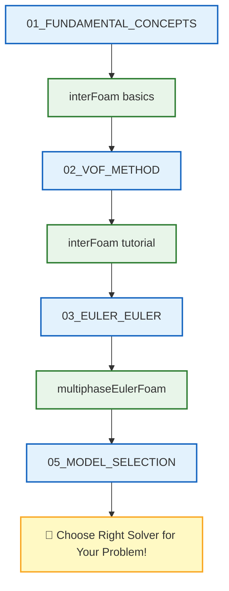

# 🗺️ Learning Navigator: Multiphase Fundamentals

> **วัตถุประสงค์**: เอกสารนี้เป็น **เส้นทางการเรียนรู้แบบคู่ขนาน** ที่เชื่อมโยงเนื้อหาทฤษฎีการไหลหลายเฟสกับ Solvers จริงใน OpenFOAM

---

## 📋 สารบัญ

1. [Fundamental Concepts](#1-fundamental-concepts-แนวคิดพื้นฐาน)
2. [VOF Method](#2-vof-method-วิธี-volume-of-fluid)
3. [Euler-Euler Method](#3-euler-euler-method)
4. [Model Selection](#4-model-selection-การเลือกโมเดล)
5. [Implementation](#5-implementation-การนำไปใช้งาน)
6. [Validation](#6-validation-การตรวจสอบความถูกต้อง)
7. [Equations Reference](#7-equations-reference-เอกสารอ้างอิงสมการ)

---

## 1. Fundamental Concepts (แนวคิดพื้นฐาน)

| 📖 เนื้อหา | 📝 คำอธิบาย | 🔧 Source Code ที่เกี่ยวข้อง |
|-----------|------------|---------------------------|
| [[00_Overview]] | ภาพรวมของโมดูล | `solvers/multiphase/` |
| [[01_FUNDAMENTAL_CONCEPTS/00_Overview]] | ภาพรวมแนวคิดพื้นฐาน | `solvers/multiphase/interFoam/` |
| [[01_FUNDAMENTAL_CONCEPTS/01_Flow_Regimes]] | ระบอบการไหล | `solvers/multiphase/` |
| [[01_FUNDAMENTAL_CONCEPTS/02_Interfacial_Phenomena]] | ปรากฏการณ์ที่ผิวสัมผัส | `solvers/multiphase/interFoam/` |

### 🎯 Study Guide

| ขั้นตอน | กิจกรรม | เวลาโดยประมาณ |
|--------|---------|--------------|
| 1 | อ่าน `00_Overview` เข้าใจภาพรวม multiphase | 30 นาที |
| 2 | ศึกษา `01_Flow_Regimes` เข้าใจประเภทการไหล | 30 นาที |
| 3 | เปิด `interFoam/` ดูโครงสร้าง solver | 30 นาที |

---

## 2. VOF Method (วิธี Volume of Fluid)

| 📖 เนื้อหา | 📝 คำอธิบาย | 🔧 Source Code ที่เกี่ยวข้อง |
|-----------|------------|---------------------------|
| [[02_VOF_METHOD/00_Overview]] | ภาพรวมวิธี VOF | `solvers/multiphase/interFoam/` |
| [[02_VOF_METHOD/01_The_VOF_Concept]] | แนวคิด VOF | `solvers/multiphase/interFoam/interFoam.C` |
| [[02_VOF_METHOD/02_Interface_Compression]] | การบีบอัด Interface | `solvers/multiphase/interFoam/` |
| [[02_VOF_METHOD/03_Setting_Up_InterFoam]] | การตั้งค่า interFoam | `solvers/multiphase/interFoam/` |
| [[02_VOF_METHOD/04_Adaptive_Time_Stepping]] | Adaptive Time Stepping | `solvers/multiphase/interFoam/` |

---

## 3. Euler-Euler Method

| 📖 เนื้อหา | 📝 คำอธิบาย | 🔧 Source Code ที่เกี่ยวข้อง |
|-----------|------------|---------------------------|
| [[03_EULER_EULER_METHOD/00_Overview]] | ภาพรวม Euler-Euler | `solvers/multiphase/multiphaseEulerFoam/` |
| [[03_EULER_EULER_METHOD/01_Introduction]] | แนะนำวิธี Euler-Euler | `solvers/multiphase/multiphaseEulerFoam/multiphaseEulerFoam.C` |
| [[03_EULER_EULER_METHOD/02_Mathematical_Framework]] | กรอบทางคณิตศาสตร์ | `solvers/multiphase/multiphaseEulerFoam/` |
| [[03_EULER_EULER_METHOD/03_Implementation_Concepts]] | แนวคิดการ Implement | `solvers/multiphase/multiphaseEulerFoam/` |

---

## 4. Model Selection (การเลือกโมเดล)

| 📖 เนื้อหา | 📝 คำอธิบาย | 🔧 Source Code ที่เกี่ยวข้อง |
|-----------|------------|---------------------------|
| [[05_MODEL_SELECTION/00_Overview]] | ภาพรวมการเลือกโมเดล | - |
| [[05_MODEL_SELECTION/01_Decision_Framework]] | กรอบการตัดสินใจ | - |
| [[05_MODEL_SELECTION/02_Gas_Liquid_Systems]] | ระบบ Gas-Liquid | `solvers/multiphase/multiphaseEulerFoam/` |
| [[05_MODEL_SELECTION/03_Liquid_Liquid_Systems]] | ระบบ Liquid-Liquid | `solvers/multiphase/twoLiquidMixingFoam/` |
| [[05_MODEL_SELECTION/04_Gas_Solid_Systems]] | ระบบ Gas-Solid | `solvers/multiphase/multiphaseEulerFoam/` |
| [[05_MODEL_SELECTION/05_Model_Selection_Flowchart]] | Flowchart การเลือกโมเดล | - |

---

## 5. Implementation (การนำไปใช้งาน)

| 📖 เนื้อหา | 📝 คำอธิบาย | 🔧 Source Code ที่เกี่ยวข้อง |
|-----------|------------|---------------------------|
| [[06_IMPLEMENTATION/00_Overview]] | ภาพรวมการ Implement | `solvers/multiphase/` |
| [[06_IMPLEMENTATION/01_Solver_Overview]] | ภาพรวม Solvers | `solvers/multiphase/interFoam/` |
| [[06_IMPLEMENTATION/02_Code_Architecture]] | สถาปัตยกรรมโค้ด | `solvers/multiphase/multiphaseEulerFoam/` |
| [[06_IMPLEMENTATION/03_Model_Architecture]] | สถาปัตยกรรมโมเดล | `solvers/multiphase/multiphaseEulerFoam/` |
| [[06_IMPLEMENTATION/04_Algorithm_Flow]] | การไหลของ Algorithm | `solvers/multiphase/interFoam/` |
| [[06_IMPLEMENTATION/05_Parallel_Implementation]] | การ Implement แบบขนาน | `utilities/parallelProcessing/` |

---

## 6. Validation (การตรวจสอบความถูกต้อง)

| 📖 เนื้อหา | 📝 คำอธิบาย | 🔧 Source Code ที่เกี่ยวข้อง |
|-----------|------------|---------------------------|
| [[07_VALIDATION/00_Overview]] | ภาพรวม Validation | - |
| [[07_VALIDATION/01_Validation_Methodology]] | วิธีการ Validation | - |
| [[07_VALIDATION/02_Benchmark_Problems]] | ปัญหา Benchmark | - |
| [[07_VALIDATION/03_Grid_Convergence]] | Grid Convergence Study | `utilities/mesh/manipulation/checkMesh/` |
| [[07_VALIDATION/04_Uncertainty_Quantification]] | การวัดความไม่แน่นอน | - |

---

## 7. Equations Reference (เอกสารอ้างอิงสมการ)

| 📖 เนื้อหา | 📝 คำอธิบาย | 🔧 Source Code ที่เกี่ยวข้อง |
|-----------|------------|---------------------------|
| [[99_EQUATIONS_REFERENCE/00_Overview]] | ภาพรวมสมการ | - |
| [[99_EQUATIONS_REFERENCE/01_Mass_Conservation]] | การอนุรักษ์มวล | `solvers/multiphase/multiphaseEulerFoam/` |
| [[99_EQUATIONS_REFERENCE/02_Momentum_Conservation]] | การอนุรักษ์โมเมนตัม | `solvers/multiphase/multiphaseEulerFoam/` |
| [[99_EQUATIONS_REFERENCE/03_Energy_Conservation]] | การอนุรักษ์พลังงาน | `solvers/multiphase/compressibleInterFoam/` |
| [[99_EQUATIONS_REFERENCE/04_Interfacial_Phenomena_Equations]] | สมการปรากฏการณ์ผิวสัมผัส | `solvers/multiphase/interFoam/` |

---

## 📁 OpenFOAM Multiphase Solver Structure

```
applications/solvers/multiphase/
├── interFoam/                     ← 🌟 VOF สำหรับ 2 เฟส (incompressible)
│   ├── interFoam.C
│   └── createFields.H
│
├── multiphaseInterFoam/           ← VOF สำหรับหลายเฟส
│
├── multiphaseEulerFoam/           ← 🌟 Euler-Euler method
│   ├── multiphaseEulerFoam.C
│   └── phaseSystems/              ← ระบบเฟส
│
├── compressibleInterFoam/         ← VOF + compressibility
│
├── twoLiquidMixingFoam/           ← การผสมของเหลว 2 ชนิด
│
├── driftFluxFoam/                 ← Drift-flux model
│
├── cavitatingFoam/                ← Cavitation modeling
│
└── potentialFreeSurfaceFoam/      ← Free surface flow
```

---

## 🎓 Learning Path



---

## 🔗 Quick Links

| ต้องการจำลอง | เลือกโมเดล | Source Code |
|-------------|-----------|-------------|
| **คลื่น, Dam break** | VOF | `interFoam/` |
| **Bubble column** | Euler-Euler | `multiphaseEulerFoam/` |
| **Mixing tanks** | Euler-Euler | `multiphaseEulerFoam/` |
| **Free surface** | VOF | `interFoam/` |
| **Cavitation** | VOF + Cavitation | `cavitatingFoam/` |

---

*Last Updated: 2025-12-26*
