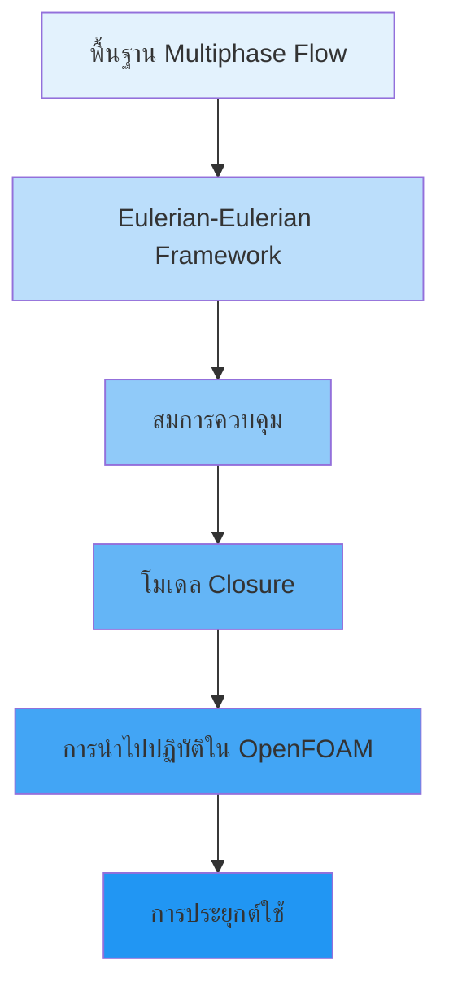
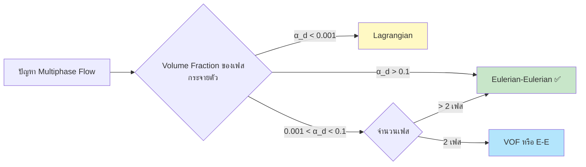

# Eulerian-Eulerian Multiphase Flow Fundamentals

## ภาพรวม (Overview)

เอกสารนี้เป็นภาพรวมแบบครบวงจรของกรอบการทำงาน **Eulerian-Eulerian** สำหรับการจำลองการไหลแบบหลายเฟส (multiphase flow) ใน OpenFOAM โดยครอบคลุมตั้งแต่แนวคิดพื้นฐาน ทฤษฎีทางคณิตศาสตร์ การนำไปปฏิบัติ ไปจนถึงการประยุกต์ใช้ในระดับอุตสาหกรรม



---

## 📚 เนื้อหาหลัก (Table of Contents)

1. **[[01_Learning_Path_Overview|เส้นทางการเรียนรู้]]** - แนวทางการศึกษาตามระดับความเชี่ยวชาญ
2. **[[02_Document_Structure_&_Progression|โครงสร้างเอกสาร]]** - การจัดระเบียบและลำดับการเรียนรู้
3. **[[03_Introduction|บทนำสู่ Eulerian-Eulerian]]** - แนวคิดเบื้องต้นและการเลือกใช้วิธี
4. **[[04_Key_Concepts|แนวคิดหลัก]]** - Volume Fraction, ตัวแปรเฉพาะเฟส, และสมการควบคุม
5. **[[05_Mathematical_Framework|กรอบแนวคิดทางคณิตศาสตร์]]** - การเฉลี่ยและกฎการอนุรักษ์
6. **[[06_Physical_Interpretation|การตีความทางกายภาพ]]** - ปรากฏการณ์ส่วนต่อประสาน
7. **[[07_Advantages_and_Limitations|ข้อดีและข้อจำกัด]]** - จุดแข็งและจุดอ่อนของกรอบการทำงาน
8. **[[08_📚_Complete_Document_Library|คลังเอกสารฉบับสมบูรณ์]]** - รายการเอกสารทั้งหมด
9. **[[09_🏭_Real-World_Applications|การประยุกต์ใช้ในโลกแห่งความเป็นจริง]]** - กรณีศึกษาทางอุตสาหกรรม
10. **[[10_🎯_Success_Metrics_&_Validation|ตัวชี้วัดความสำเร็จ]]** - การตรวจสอบความถูกต้อง
11. **[[11_🔗_Advanced_Connections|การเชื่อมต่อขั้นสูง]]** - ความสัมพันธ์กับหัวข้อ CFD อื่นๆ
12. **[[12_📖_Key_References|เอกสารอ้างอิง]]** - แหล่งข้อมูลเชิงลึก
13. **[[13_🚀_Quick_Start_Guide|คู่มือเริ่มต้นฉบับย่อ]]** - เริ่มต้นอย่างรวดเร็ว

---

## 🎯 แนวทาง Eulerian-Eulerian คืออะไร?

แนวทาง **Eulerian-Eulerian (E-E)** เป็นกรอบการทำงานสำหรับการจำลองการไหลแบบหลายเฟส โดยถือว่าแต่ละเฟสเป็น **continuum ที่แทรกซึมซึ่งกันและกัน** และมีชุดสมการอนุรักษ์ (conservation equations) เป็นของตัวเอง

> [!INFO] หลักการพื้นฐาน
> ในแนวทาง Eulerian-Eulerian แต่ละเฟสจะ:
> - ครอบครองสัดส่วนของปริมาตรควบคุม (control volume) ร่วมกัน
> - มีสนามความเร็วและคุณสมบัติทางกายภาพเป็นของตัวเอง
> - เชื่อมโยงกันผ่านเทอมการแลกเปลี่ยนระหว่างเฟส (interphase exchange terms)

### เมื่อใดควรใช้ Eulerian-Eulerian?



| เงื่อนไข | คำอธิบาย | ค่าที่เกี่ยวข้อง |
|-----------|------------|------------------|
| **สารแขวนลอยหนาแน่น** | ปฏิสัมพันธ์ระหว่างอนุภาคสำคัญ | α_d > 0.1 |
| **มากกว่า 2 เฟส** | ปรับขนาดได้อย่างมีประสิทธิภาพ | > 2 เฟส |
| **ระดับอุตสาหกรรม** | โดเมนขนาดใหญ่และรูปทรงเรขาคณิตซับซ้อน | เครื่องปฏิกรณ์, ตัวแยก |
| **ประสิทธิภาพการคำนวณ** | สมดุลระหว่างความแม่นยำและต้นทุน | หลีกเลี่ยงการติดตามอนุภาคแต่ละตัว |

---

## 📐 กรอบแนวคิดทางคณิตศาสตร์

### กระบวนการเฉลี่ย (Averaging Procedures)

แนวทางการคำนวณแบบ Eulerian-Eulerian อาศัยเทคนิคการเฉลี่ยเพื่ออนุมานสมการต่อเนื่อง (continuum equations) จากกฎการอนุรักษ์พื้นฐาน

#### 1. การเฉลี่ยเชิงปริมาตร (Volume Averaging)

สำหรับปริมาณใดๆ $\phi$ ที่เกี่ยวข้องกับเฟส $\alpha$:

$$\langle \phi \rangle_\alpha = \frac{1}{V_\alpha} \int_{V_\alpha} \phi \, \mathrm{d}V$$

**โดยที่:**
- $\langle \phi \rangle_\alpha$ คือปริมาณที่เฉลี่ยตามเฟส
- $V_\alpha$ คือปริมาตรชั่วขณะที่เฟส $\alpha$ ครอบครองภายในปริมาตรเฉลี่ย $V$
- $\phi$ แทนสนามสเกลาร์ เวกเตอร์ หรือเทนเซอร์ใดๆ

#### 2. การเฉลี่ยตามเฟส (Phase Averaging)

$$\bar{\phi}_\alpha = \frac{1}{V} \int_{V_\alpha} \phi \, \mathrm{d}V = \alpha_\alpha \langle \phi \rangle_\alpha$$

**โดยที่:**
- $\bar{\phi}_\alpha$ คือปริมาณที่เฉลี่ยตามเฟสในกรอบอ้างอิงของส่วนผสม
- $\alpha_\alpha = \frac{V_\alpha}{V}$ คือสัดส่วนปริมาตร (volume fraction) ของเฟส $\alpha$

#### 3. การเฉลี่ยตามเวลา (Temporal Averaging)

สำหรับการไหลแบบหลายเฟสที่มีความปั่นป่วน:

$$\tilde{\phi}_\alpha = \frac{1}{\Delta t} \int_{t}^{t+\Delta t} \phi_\alpha(\mathbf{x},\tau) \, \mathrm{d}\tau$$

---

## ⚖️ กฎการอนุรักษ์ในรูปแบบที่เฉลี่ยแล้ว

### 1. การอนุรักษ์มวล (Continuity) สำหรับเฟส k

$$\frac{\partial}{\partial t}(\alpha_k \rho_k) + \nabla \cdot (\alpha_k \rho_k \mathbf{u}_k) = \sum_{l \neq k} \dot{m}_{lk}$$

**นิยามตัวแปร:**
- $\alpha_k$ = **volume fraction** ของเฟส k (ข้อจำกัด: $\sum_k \alpha_k = 1$)
- $\rho_k$ = **density** ของเฟส k
- $\mathbf{u}_k$ = **velocity vector** ของเฟส k
- $\dot{m}_{lk}$ = **mass transfer rate** จากเฟส l ไปยังเฟส k

#### การวิเคราะห์ทีละเทอม

- **เทอมเวลา (Temporal term)**: $\frac{\partial (\alpha_k \rho_k)}{\partial t}$ - แสดงถึงการสะสมหรือการลดลงของมวลเฟสเฉพาะที่
- **เทอมคอนเวกทีฟ (Convective term)**: $\nabla \cdot (\alpha_k \rho_k \mathbf{u}_k)$ - แสดงถึงฟลักซ์มวลสุทธิเนื่องจากการเคลื่อนที่ของเฟส
- **เทอมแหล่งกำเนิด (Source term)**: $\sum_{l \neq k} \dot{m}_{lk}$ - แสดงถึงการถ่ายเทมวลระหว่างเฟส (การระเหย การควบแน่น การละลาย ปฏิกิริยาเคมี)

### 2. การอนุรักษ์โมเมนตัม (Momentum) สำหรับเฟส k

$$\frac{\partial}{\partial t}(\alpha_k \rho_k \mathbf{u}_k) + \nabla \cdot (\alpha_k \rho_k \mathbf{u}_k \mathbf{u}_k) = -\alpha_k \nabla p_k + \nabla \cdot \mathbf{\tau}_k + \alpha_k \rho_k \mathbf{g} + \mathbf{M}_k$$

**นิยามตัวแปร:**
- $p_k$ = **pressure** ของเฟส k (มักจะสมมติว่าเท่ากันทุกเฟส: $p_k = p$)
- $\mathbf{\tau}_k$ = **stress tensor** สำหรับเฟส k
- $\mathbf{g}$ = **gravitational acceleration**
- $\mathbf{M}_k$ = **interfacial momentum transfer term**

#### เทนเซอร์ความเค้นหนืด (Viscous Stress Tensor)

เทนเซอร์ความเค้น $\boldsymbol{\tau}_k$ สำหรับเฟสแบบนิวตัน:

$$\boldsymbol{\tau}_k = \mu_k \left(\nabla \mathbf{u}_k + (\nabla \mathbf{u}_k)^T\right) - \frac{2}{3} \mu_k (\nabla \cdot \mathbf{u}_k) \mathbf{I}$$

โดยที่:
- $\mu_k$ คือความหนืดจลน์
- $\mathbf{I}$ คือเทนเซอร์เอกลักษณ์ (identity tensor)

### การถ่ายโอนโมเมนตัมระหว่างเฟส

เทอมการถ่ายโอนโมเมนตัมระหว่างเฟส $\mathbf{M}_k$:

$$\mathbf{M}_k = \sum_{l \neq k} \mathbf{K}_{kl} (\mathbf{u}_l - \mathbf{u}_k) + \mathbf{F}^{\text{lift}}_k + \mathbf{F}^{\text{vm}}_k + \mathbf{F}^{\text{disp}}_k$$

**นิยามตัวแปร:**
- $\mathbf{K}_{kl}$ = **drag coefficient** ระหว่างเฟส k และ l
- $\mathbf{F}^{\text{lift}}_k$ = **lift force**
- $\mathbf{F}^{\text{vm}}_k$ = **virtual mass force**
- $\mathbf{F}^{\text{disp}}_k$ = **turbulent dispersion force**

### 3. การอนุรักษ์พลังงาน (Energy) สำหรับเฟส k

$$\frac{\partial}{\partial t}(\alpha_k \rho_k h_k) + \nabla \cdot (\alpha_k \rho_k \mathbf{u}_k h_k) = \alpha_k \frac{\mathrm{d}p_k}{\mathrm{d}t} + \nabla \cdot (\alpha_k k_k \nabla T_k) + Q_k$$

**นิยามตัวแปร:**
- $h_k$ = **enthalpy** ของเฟส k
- $T_k$ = **temperature** ของเฟส k
- $Q_k$ = **interphase heat transfer rate**

---

## 🔧 โมเดลปิด (Closure Models)

### โมเดล Drag

**Drag coefficient** มีความสำคัญอย่างยิ่งต่อการเชื่อมโยงโมเมนตัม (momentum coupling)

#### Schiller-Naumann Model

$$C_D = \begin{cases}
24 (1 + 0.15 Re_p^{0.687})/Re_p & \text{if } Re_p \leq 1000 \\
0.44 & \text{if } Re_p > 1000
\end{cases}$$

โดยที่ $Re_p = \frac{\rho_c |\mathbf{u}_p - \mathbf{u}_c| d_p}{\mu_c}$ คือ **particle Reynolds number**

#### การเปรียบเทียบ Drag Models ทั่วไป

| โมเดล | ช่วง Reynolds Number | การใช้งาน |
|--------|---------------------|-------------|
| **Schiller-Naumann** | $Re_p < 1000$ | กระบวนการทั่วไป |
| **Ishii-Zuber** | หลากหลาย | ของเหลว-ก๊าซ |
| **Tomiyama** | $Eo < 4$ | ฟองก๊าศ |
| **Grace** | หลากหลาย | อนุภาคของแข็ง |

### การสร้างแบบจำลองความปั่นป่วน

#### $k$-$\epsilon$ Model สำหรับ Multiphase Flow

สำหรับเฟส k:

$$\frac{\partial}{\partial t}(\alpha_k \rho_k k_k) + \nabla \cdot (\alpha_k \rho_k \mathbf{u}_k k_k) = \nabla \cdot \left(\alpha_k \frac{\mu_{t,k}}{\sigma_k} \nabla k_k\right) + \alpha_k P_k - \alpha_k \rho_k \epsilon_k + S_{k,\text{int}}$$

$$\frac{\partial}{\partial t}(\alpha_k \rho_k \epsilon_k) + \nabla \cdot (\alpha_k \rho_k \mathbf{u}_k \epsilon_k) = \nabla \cdot \left(\alpha_k \frac{\mu_{t,k}}{\sigma_\epsilon} \nabla \epsilon_k\right) + \alpha_k \frac{\epsilon_k}{k_k} (C_{\epsilon 1} P_k - C_{\epsilon 2} \rho_k \epsilon_k) + S_{\epsilon,\text{int}}$$

**นิยามตัวแปร:**
- $P_k$ = **production of turbulent kinetic energy** ในเฟส k
- $S_{k,\text{int}}$, $S_{\epsilon,\text{int}}$ = **interfacial source terms**
- $\mu_{t,k}$ = **turbulent viscosity** ของเฟส k

#### การเปรียบเทียบ Turbulence Models

| โมเดล | ข้อดี | ข้อเสีย | การใช้งาน |
|--------|-------|--------|-------------|
| **Standard $k$-$\epsilon$** | เสถียร คำนวณเร็ว | ต่ำกว่า shear flows | กรณีทั่วไป |
| **RNG $k$-$\epsilon$** | ดีกว่าสำหรับ strain rates สูง | ซับซ้อนขึ้น | การไหลที่มี strain สูง |
| **Realizable $k$-$\epsilon$** | รักษา positivity | ต้องการการปรับแต่ง | จำลองที่ซับซ้อน |
| **$k$-$\omega$ SST** | ดีกว่าใน near-wall | ต้องการ mesh ละเอียด | boundary layers |

---

## 💻 การใช้งานใน OpenFOAM

### Solver multiphaseEulerFoam

Solver หลักใช้กรอบการทำงานแบบ Eulerian-Eulerian

```cpp
// Phase system
phaseSystem phaseModels(mesh, g);

// Momentum equations
fvVectorMatrix UEqn
(
    fvm::ddt(alpha, rho, U) + fvm::div(alphaRhoPhi, U)
  - fvm::Sp(fvc::ddt(alpha, rho) + fvc::div(alphaRhoPhi), U)
  + turbulence->divDevReff(RhoEff)
 ==
    fvOptions(alpha, rho, U)
);

// Interfacial momentum transfer
phaseSystem.Kd()*(U.otherPhase() - U)
```

### คลาสที่สำคัญ

| คลาส | หน้าที่หลัก | การใช้งาน |
|------|-------------|-------------|
| **`phaseModel`** | คลาสพื้นฐานสำหรับ phase models | กำหนดคุณสมบัติแต่ละเฟส |
| **`phaseSystem`** | จัดการการโต้ตอบระหว่างเฟส | multiphase interactions |
| **`blendingMethod`** | ผสมคุณสมบัติของเฟส | blends phase properties |
| **`dragModel`** | คำนวณ interfacial drag coefficients | การถ่ายโอนโมเมนตัม |
| **`heatTransferPhaseSystem`** | จัดการการถ่ายเทความร้อนระหว่างเฟส | interfacial heat transfer |

---

## 🏭 การประยุกต์ใช้ทั่วไป

| การประยุกต์ใช้ | ตัวอย่างอุตสาหกรรม |
|---|---|
| **Bubble columns** | เครื่องปฏิกรณ์เคมี, เครื่องปฏิกรณ์ชีวภาพ |
| **Fluidized beds** | เครื่องปฏิกรณ์, เครื่องเผาไหม้, เครื่องอบแห้ง |
| **Oil-water separation** | การไหลของของเหลวที่เข้ากันไม่ได้ |
| **Sediment transport** | การไหลของของแข็ง-ของเหลว |
| **Boiling and condensation** | ปรากฏการณ์การเปลี่ยนเฟส |
| **Multiphase pipelines** | การขนส่งน้ำมัน-ก๊าซ-น้ำ |

### ข้อกำหนด Mesh

การจำลองแบบ Eulerian-Eulerian ต้องการ:
- **Fine mesh resolution** ใกล้กับ interface เพื่อการจับภาพที่แม่นยำ
- **High-quality mesh** เพื่อป้องกัน numerical diffusion
- **Appropriate time stepping** เพื่อรักษา Courant number ให้เสถียร

---

## ⚠️ ข้อจำกัดและความท้าทาย

### ความท้าทายทางตัวเลข

1. **Stability issues** เนื่องมาจากอัตราส่วนความหนาแน่นที่มาก
2. **Interfacial area** การคำนวณที่ซับซ้อน
3. **Phase fraction bounds** การบังคับให้เป็นไปตามขอบเขต
4. **Convergence difficulties** เมื่อมีการเชื่อมโยงที่รุนแรง (strong coupling)

### ข้อจำกัดทางการสร้างแบบจำลอง

| ข้อจำกัด | ผลกระทบ | วิธีแก้ไข |
|-----------|-----------|-------------|
| **Interfacial geometry** | ไม่ได้ถูกแยกออกมา | ต้องการ closure models |
| **Scale separation** | อาจถูกละเมิด | ใช้โมเดลที่เหมาะสม |
| **Computational cost** | เพิ่มขึ้นตามจำนวนเฟส | การปรับแต่งประสิทธิภาพ |
| **Validation requirements** | ต้องการข้อมูลทดลอง | การทดสอบทาง laboratory |

---

## ✅ ข้อดีหลัก

- **Multi-Phase Capability:** จัดการหลายเฟสได้ไม่จำกัดพร้อมกัน
- **Computational Efficiency:** ประสิทธิภาพสูงสำหรับการจำลองระดับอุตสาหกรรม
- **Dense Suspensions:** โดดเด่นในการจำลองสารแขวนลอยหนาแน่น

---

## 📖 เส้นทางการเรียนรู้ที่แนะนำ

### สำหรับผู้เริ่มต้น (Beginner)
1. เริ่มต้นที่ [[13_🚀_Quick_Start_Guide|คู่มือเริ่มต้นฉบับย่อ]]
2. ศึกษา [[03_Introduction|บทนำสู่ Eulerian-Eulerian]]
3. ทำความเข้าใจ [[04_Key_Concepts|แนวคิดหลัก]]

### สำหรับผู้ใช้ระดับกลาง (Intermediate)
1. เจาะลึก [[05_Mathematical_Framework|กรอบแนวคิดทางคณิตศาสตร์]]
2. เรียนรู้ [[06_Physical_Interpretation|การตีความทางกายภาพ]]
3. ศึกษา [[07_Advantages_and_Limitations|ข้อดีและข้อจำกัด]]

### สำหรับผู้ใช้ระดับสูง (Advanced)
1. วิเคราะห์ [[11_🔗_Advanced_Connections|การเชื่อมต่อขั้นสูง]]
2. ศึกษา [[10_🎯_Success_Metrics_&_Validation|ตัวชี้วัดความสำเร็จ]]
3. อ้างอิง [[12_📖_Key_References|เอกสารอ้างอิงหลัก]]

---

## 🎓 ผลลัพธ์การเรียนรู้ที่คาดหวัง

เมื่อสำเร็จการศึกษาภาพรวมนี้ ผู้เรียนจะสามารถ:

| ทักษะ | ความสามารถ |
|--------|--------------|
| **ความเข้าใจพื้นฐาน** | อธิบายฟิสิกส์และคณิตศาสตร์ของ Multiphase Flow |
| **การเลือกแบบจำลอง** | เลือกแบบจำลองที่เหมาะสมสำหรับการใช้งาน |
| **การนำไปใช้** | ตั้งค่าและดำเนินการจำลองใน OpenFOAM |
| **การวิเคราะห์** | ตีความผลและตรวจสอบความถูกต้อง |
| **การปรับปรุงประสิทธิภาพ** | แก้ไขปัญหาและเพิ่มประสิทธิภาพ |
| **การประยุกต์ใช้ขั้นสูง** | จัดการระบบที่ซับซ้อน (ความร้อน, ปฏิกิริยา, ความปั่นป่วน) |

---

> [!TIP] เคล็ดลับการเรียนรู้
> - เริ่มต้นด้วยความเข้าใจแนวคิดพื้นฐานก่อนดำนิ้นเข้าไปในรายละเอียดทางคณิตศาสตร์
> - ปฏิบัติตามตัวอย่างใน [[09_🏭_Real-World_Applications|การประยุกต์ใช้จริง]] เพื่อเสริมสร้างความเข้าใจ
> - ใช้ [[13_🚀_Quick_Start_Guide|คู่มือเริ่มต้นฉบับย่อ]] เป็นการอ้างอิงอย่างรวดเร็ว
> - อ้างอิง [[08_📚_Complete_Document_Library|คลังเอกสาร]] สำหรับข้อมูลเชิงลึกเพิ่มเติม

---

กรอบการทำงานแบบ Eulerian-Eulerian เป็นรากฐานสำคัญสำหรับการสร้างแบบจำลองระบบ multiphase ที่ซับซ้อนในทางวิศวกรรม โดยให้ความสมดุลระหว่างความแม่นยำและประสิทธิภาพในการคำนวณ
