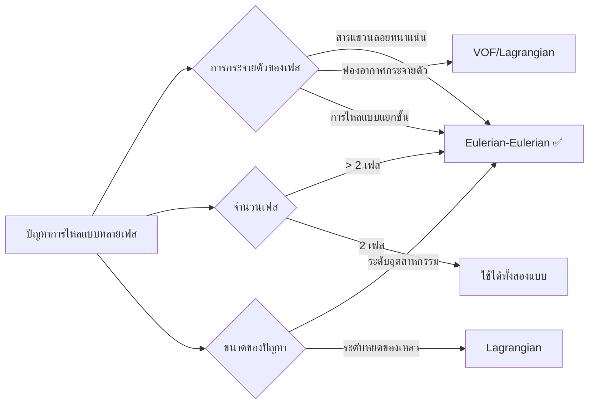

# Eulerian-Eulerian Fundamentals

## บทนำสู่การไหลแบบหลายเฟส

**Multiphase flow** คือ การไหลที่มีหลายเฟส (ของแข็ง ของเหลว ก๊าซ) อยู่พร้อมกันในระบบ ในแบบจำลอง **Eulerian-Eulerian** แต่ละเฟสจะถูกพิจารณาว่าเป็นเนื้อเดียวกันที่แทรกซึมซึ่งกันและกัน โดยมีชุดสมการควบคุมของตัวเอง คล้ายกับการไหลแบบเฟสเดียว แต่มีเทอมการเชื่อมโยง (coupling terms) เพิ่มเติม

แนวทางการสร้างแบบจำลองหลายเฟสแบบออยเลอร์-ออยเลอร์ (Eulerian-Eulerian หรือ E-E) เป็นการจำลองเฟสต่างๆ เสมือนเป็นสสารต่อเนื่องที่แทรกซึมซึ่งกันและกัน โดยแต่ละเฟสจะครอบครองสัดส่วนของปริมาตรควบคุม (control volume) และมีชุดสมการอนุรักษ์ (conservation equations) เป็นของตนเอง

แนวทางนี้เป็นพื้นฐานสำคัญของความสามารถในการจำลองการไหลแบบหลายเฟสของ OpenFOAM และเหมาะสมอย่างยิ่งสำหรับ:
- **ปัญหาการไหลแบบหลายเฟสในระดับอุตสาหกรรม**
- **ประสิทธิภาพในการคำนวณ (computational efficiency)**
- **ผลกระทบจากการแทรกซึมระหว่างเฟส (phase interpenetration effects)**

![[eulerian_foundations_overview.png]]
> `Scientific textbook diagram providing a high-level overview of the Eulerian-Eulerian framework. Central image shows a pipe with interpenetrating red and blue fluids. Callouts link to the key equations: Continuity (mass conservation), Momentum (balance of forces), and Turbulence (energy dissipation). Arrows indicate the coupling via interfacial forces. Clean vector line art, white background, high definition, flat design, educational infographic --ar 16:9`

### 🎯 เมื่อควรใช้แนวทาง Eulerian-Eulerian



#### ✅ **เลือกใช้ Eulerian-Eulerian เมื่อ:**

| เงื่อนไข | คำอธิบาย | ค่าที่เกี่ยวข้อง |
|-----------|------------|------------------|
| **สารแขวนลอยหนาแน่น** | ปฏิสัมพันธ์ระหว่างอนุภาคต่ออนุภาคมีความสำคัญ และสมมติฐานของสสารต่อเนื่องสมเหตุสมผล | $\alpha_d > 0.1$ |
| **มากกว่า 2 เฟส** | สามารถปรับขนาดได้อย่างมีประสิทธิภาพ เหมาะสำหรับระบบหลายเฟสที่ซับซ้อน | > 2 เฟส |
| **ระดับอุตสาหกรรมขนาดใหญ่** | เกี่ยวข้องกับความยาวโดเมนหลายเมตรและรูปทรงเรขาคณิตที่ซับซ้อน | เครื่องปฏิกรณ์, ตัวแยก, อุปกรณ์กระบวนการ |
| **ต้องการประสิทธิภาพในการคำนวณ** | ให้ความสมดุลระหว่างความแม่นยำและต้นทุนในการคำนวณ | หลีกเลี่ยงการติดตามอนุภาคแต่ละตัว |
| **การแทรกซึมระหว่างเฟสมีความสำคัญ** | เฟสต่างๆ ครอบครองปริมาตรควบคุมเดียวกันและมีปฏิสัมพันธ์กันอย่างต่อเนื่อง | การแลกเปลี่ยนโมเมนตัมระหว่างเฟส |

---

## กรอบแนวคิดทางคณิตศาสตร์

### การเฉลี่ยและการสร้างแบบจำลอง

**กรอบแนวคิดทางคณิตศาสตร์สำหรับการไหลแบบหลายเฟส (multiphase flows)** ใน OpenFOAM เป็นรากฐานสำหรับแนวทางการคำนวณแบบ Eulerian-Eulerian ผ่านกระบวนการเฉลี่ยที่เป็นระบบและความสัมพันธ์แบบปิด (closure relationships)

#### 📊 กระบวนการเฉลี่ย (Averaging Procedures)

**1. การเฉลี่ยเชิงปริมาตร (Volume Averaging)**
สำหรับปริมาณใดๆ $\phi$ ที่เกี่ยวข้องกับเฟส $\alpha$:
$$\langle \phi \rangle_\alpha = \frac{1}{V_\alpha} \int_{V_\alpha} \phi \, \mathrm{d}V$$

**2. การเฉลี่ยตามเฟส (Phase Averaging)**
$$\bar{\phi}_\alpha = \frac{1}{V} \int_{V_\alpha} \phi \, \mathrm{d}V = \alpha_\alpha \langle \phi \rangle_\alpha$$

**3. การเฉลี่ยตามเวลา (Temporal Averaging)**
สำหรับการไหลแบบหลายเฟสที่มีความปั่นป่วน (turbulent multiphase flows):
$$\tilde{\phi}_\alpha = \frac{1}{\Delta t} \int_{t}^{t+\Delta t} \phi_\alpha(\mathbf{x},\tau) \, \mathrm{d}\tau$$

โดยที่:
- $\alpha_\alpha = \frac{V_\alpha}{V}$ คือสัดส่วนปริมาตร (volume fraction) ของเฟส $\alpha$
- $V$ คือปริมาตรเฉลี่ยทั้งหมดที่ครอบคลุมทุกเฟส

---

## สมการควบคุมพื้นฐาน (Conservation Laws)

### 1. การอนุรักษ์มวล (Continuity) สำหรับเฟส $k$

$$\frac{\partial}{\partial t}(\alpha_k \rho_k) + \nabla \cdot (\alpha_k \rho_k \mathbf{u}_k) = \sum_{l \neq k} \dot{m}_{lk}$$

**นิยามตัวแปร:**
- $\alpha_k$ = **volume fraction** ของเฟส $k$ (ข้อจำกัด: $\sum_k \alpha_k = 1$)
- $\rho_k$ = **density** ของเฟส $k$
- $\mathbf{u}_k$ = **velocity vector** ของเฟส $k$
- $\dot{m}_{lk}$ = **mass transfer rate** จากเฟส $l$ ไปยังเฟส $k$

### 2. การอนุรักษ์โมเมนตัม (Momentum) สำหรับเฟส $k$

$$\frac{\partial}{\partial t}(\alpha_k \rho_k \mathbf{u}_k) + \nabla \cdot (\alpha_k \rho_k \mathbf{u}_k \mathbf{u}_k) = -\alpha_k \nabla p_k + \nabla \cdot \mathbf{\tau}_k + \alpha_k \rho_k \mathbf{g} + \mathbf{M}_k$$

**นิยามตัวแปร:**
- $p_k$ = **pressure** ของเฟส $k$ (มักจะสมมติว่าเท่ากันทุกเฟส: $p_k = p$)
- $\mathbf{\tau}_k$ = **stress tensor** สำหรับเฟส $k$
- $\mathbf{g}$ = **gravitational acceleration**
- $\mathbf{M}_k$ = **interfacial momentum transfer term**

**การถ่ายโอนโมเมนตัมระหว่างเฟส $\mathbf{M}_k$:**
$$\mathbf{M}_k = \sum_{l \neq k} \mathbf{K}_{kl} (\mathbf{u}_l - \mathbf{u}_k) + \mathbf{F}^{\text{lift}}_k + \mathbf{F}^{\text{vm}}_k + \mathbf{F}^{\text{disp}}_k$$

### 3. การอนุรักษ์พลังงาน (Energy) สำหรับเฟส $k$

$$\frac{\partial}{\partial t}(\alpha_k \rho_k h_k) + \nabla \cdot (\alpha_k \rho_k \mathbf{u}_k h_k) = \alpha_k \frac{\mathrm{d}p_k}{\mathrm{d}t} + \nabla \cdot (\alpha_k k_k \nabla T_k) + Q_k$$

**นิยามตัวแปร:**
- $h_k$ = **enthalpy** ของเฟส $k$
- $T_k$ = **temperature** ของเฟส $k$
- $Q_k$ = **interphase heat transfer rate**

---

## โมเดลปิด (Closure Models)

### โมเดล Drag

**Schiller-Naumann Model** (นิยมใช้มากที่สุด):
$$C_D = \begin{cases}
24 (1 + 0.15 Re_p^{0.687})/Re_p & \text{if } Re_p \leq 1000 \\
0.44 & \text{if } Re_p > 1000
\end{cases}$$

โดยที่ $Re_p = \frac{\rho_c |\mathbf{u}_p - \mathbf{u}_c| d_p}{\mu_c}$ คือ **particle Reynolds number**

### การสร้างแบบจำลองความปั่นป่วน ($k$-$\\epsilon$ Model)

สำหรับเฟส $k$:

$$\frac{\partial}{\partial t}(\alpha_k \rho_k k_k) + \nabla \cdot (\alpha_k \rho_k \mathbf{u}_k k_k) = \nabla \cdot \left(\alpha_k \frac{\mu_{t,k}}{\sigma_k} \nabla k_k\right) + \alpha_k P_k - \alpha_k \rho_k \epsilon_k + S_{k,\text{int}}$$

$$\frac{\partial}{\partial t}(\alpha_k \rho_k \epsilon_k) + \nabla \cdot (\alpha_k \rho_k \mathbf{u}_k \epsilon_k) = \nabla \cdot \left(\alpha_k \frac{\mu_{t,k}}{\sigma_\epsilon} \nabla \epsilon_k\right) + \alpha_k \frac{\epsilon_k}{k_k} (C_{\epsilon 1} P_k - C_{\epsilon 2} \rho_k \epsilon_k) + S_{\epsilon,\text{int}}$$

#### การเปรียบเทียบ Turbulence Models
| โมเดล | ข้อดี | ข้อเสีย | การใช้งาน |
|--------|-------|--------|-------------|
| **Standard $k$-$\\epsilon$** | เสถียร คำนวณเร็ว | ต่ำกว่า shear flows | กรณีทั่วไป |
| **RNG $k$-$\\epsilon$** | ดีกว่าสำหรับ strain rates สูง | ซับซ้อนขึ้น | การไหลที่มี strain สูง |
| **Realizable $k$-$\\epsilon$** | รักษา positivity | ต้องการการปรับแต่ง | จำลองที่ซับซ้อน |
| **$k$-$\\omega$ SST** | ดีกว่าใน near-wall | ต้องการ mesh ละเอียด | boundary layers |

---

## การใช้งานใน OpenFOAM

### Solver multiphaseEulerFoam

```cpp
// Phase system initialization
phaseSystem phaseModels(mesh, g);

// Momentum equations in OpenFOAM source code
fvVectorMatrix UEqn
(
    fvm::ddt(alpha, rho, U) + fvm::div(alphaRhoPhi, U)
  - fvm::Sp(fvc::ddt(alpha, rho) + fvc::div(alphaRhoPhi), U)
  + turbulence->divDevReff(RhoEff)
 ==
    fvOptions(alpha, rho, U)
);

// Interfacial momentum transfer implementation
phaseSystem.Kd()*(U.otherPhase() - U)
```

### คลาสที่สำคัญ

| คลาส | หน้าที่หลัก |
|------|-------------|
| **`phaseModel`** | กำหนดคุณสมบัติแต่ละเฟส (rho, mu, d, etc.) |
| **`phaseSystem`** | จัดการการโต้ตอบระหว่างเฟส (interfacial forces) |
| **`blendingMethod`** | ผสมคุณสมบัติของเฟส (blends phase properties) |
| **`dragModel`** | คำนวณ interfacial drag coefficients |

---

## ข้อพิจารณาเชิงตัวเลข (Numerical Considerations)

| คุณสมบัติ | ข้อกำหนด | ความสำคัญ |
|------------|------------|------------|
| **ความเป็นขอบเขต (Boundedness)** | $0 \leq \alpha_k \leq 1$ และ $\sum \alpha_k = 1$ | รักษาสัดส่วนเฟสให้อยู่ในช่วงที่ถูกต้อง |
| **เสถียรภาพ (Stability)** | Implicit treatment ของ interfacial terms | ช่วยให้การคำนวณบรรจบกัน (convergence) |
| **MULES** | Multidimensional Universal Limiter | รักษาความเสถียรของรอยต่อเฟส |

---

## ข้อดีและข้อจำกัด

### ✅ ข้อดี
- **Multi-Phase Capability:** จัดการหลายเฟสได้ไม่จำกัดพร้อมกัน
- **Computational Efficiency:** ประสิทธิภาพสูงสำหรับการจำลองระดับอุตสาหกรรม
- **Dense Suspensions:** โดดเด่นในการจำลองสารแขวนลอยหนาแน่น

### ⚠️ ข้อจำกัดและความท้าทาย

| ข้อจำกัด | ผลกระทบ | วิธีแก้ไข |
|-----------|-----------|-------------|
| **Closure Modeling** | ต้องการสมการปิดจำนวนมาก | ใช้ความสัมพันธ์เชิงประจักษ์ที่เหมาะสม |
| **Interface Resolution** | ไม่เห็นรูปร่างรอยต่อที่ชัดเจน (เฉลี่ยแล้ว) | ใช้ Mesh ที่ละเอียดหรือวิธี VOF |
| **Numerical Diffusion** | รอยต่อเฟสอาจดูฟุ้งกระจาย | ใช้สกีมแบบไฮเรโซลูชัน (MULES, HRIC) |
| **Computational Cost** | ต้นทุนเพิ่มตามจำนวนเฟส | การประมวลผลแบบขนาน (Parallel Computing) |

---

กรอบการทำงานแบบ Eulerian-Eulerian เป็นรากฐานสำคัญสำหรับการสร้างแบบจำลองระบบ multiphase ที่ซับซ้อนในทางวิศวกรรม โดยให้ความสมดุลระหว่างความแม่นยำและประสิทธิภาพในการคำนวณ
