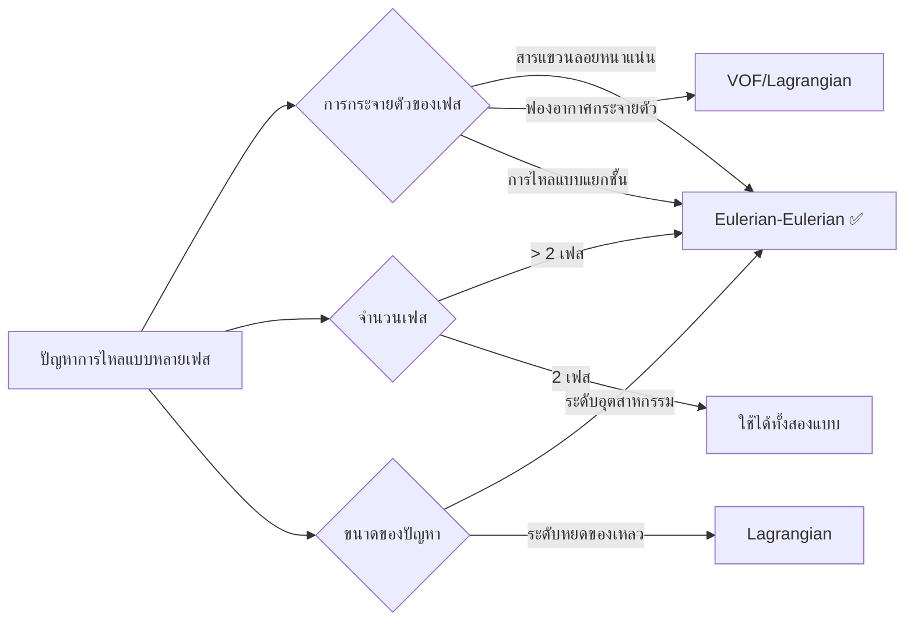

# Introduction to Eulerian-Eulerian Multiphase Flow

## บทนำสู่การไหลแบบหลายเฟส

**Multiphase flow** คือ การไหลที่มีหลายสถานะ (ของแข็ง ของเหลว ก๊าซ) อยู่พร้อมกันในระบบ ในแบบจำลอง **Eulerian-Eulerian (E-E)** แต่ละเฟสจะถูกพิจารณาว่าเป็น **สสารต่อเนื่องที่แทรกซึมซึ่งกันและกัน (Interpenetrating Continua)** โดยแต่ละเฟสจะมีชุดสมการควบคุมของตัวเองและครอบครองสัดส่วนปริมาตรที่แน่นอนในทุกๆ จุดของโดเมนการคำนวณ

![[interpenetrating_continua.png]]
> `Scientific textbook diagram showing the concept of interpenetrating continua in multiphase flow. A single control volume contains both a continuous liquid phase and dispersed gas bubbles. Zoomed-in callout shows the averaging process where a point represents a volume fraction alpha. Clean vector line art, white background, high definition, flat design, educational infographic --ar 16:9`

แนวทางนี้เป็นพื้นฐานสำคัญของความสามารถในการจำลองการไหลแบบหลายเฟสของ OpenFOAM (เช่น `multiphaseEulerFoam`) และเหมาะสมอย่างยิ่งสำหรับ:
- **ปัญหาการไหลแบบหลายเฟสในระดับอุตสาหกรรม**
- **ประสิทธิภาพในการคำนวณ (computational efficiency)**
- **ผลกระทบจากการแทรกซึมระหว่างเฟส (phase interpenetration effects)**

---

## ลักษณะสำคัญ (Key Characteristics)

### 1. สสารต่อเนื่องที่แทรกซึมกัน (Interpenetrating Continua)
ในกรอบงานแบบออยเลอร์-ออยเลอร์ เราไม่ติดตามรอยต่อเฟส (interface) ที่ชัดเจน แต่จะมองว่าทุกเฟสมีอยู่พร้อมกันในทุกๆ ปริมาตรควบคุม (Control Volume) โดยแต่ละเฟสจะถูกแทนด้วยสนามที่มีความต่อเนื่อง

### 2. สัดส่วนปริมาตร (Volume Fraction - $\alpha$)
สัดส่วนปริมาตร $\alpha_k$ แสดงถึงโอกาสหรือสัดส่วนของพื้นที่ที่เฟส $k$ ครอบครอง ณ ตำแหน่งและเวลาที่กำหนด

**ข้อจำกัดพื้นฐาน (Summation Constraint):**
$$\sum_{k=1}^{N} \alpha_k = 1$$

โดยที่ $0 \leq \alpha_k \leq 1$ สำหรับทุกเฟส $k$ หาก $\alpha_k = 1$ หมายถึงจุดนั้นมีเพียงเฟส $k$ เท่านั้น (Pure phase)

### 3. กระบวนการเฉลี่ย (Averaging Procedures)
สมการควบคุมถูกสร้างขึ้นผ่านกระบวนการเฉลี่ยคุณสมบัติระดับจุลภาคเหนือปริมาตรควบคุม เพื่อให้ได้สนามที่ต่อเนื่องสำหรับการคำนวณ CFD

**การเฉลี่ยตามเฟส (Phase Averaging):**
$$\bar{\phi}_k = \frac{1}{V} \int_{V_k} \phi \, \mathrm{d}V = \alpha_k \langle \phi \rangle_k$$

---

## 🎯 เมื่อใดควรใช้แนวทาง Eulerian-Eulerian?

### ✅ เลือกใช้ Eulerian-Eulerian เมื่อ:

| เงื่อนไข | คำอธิบาย | ค่าที่เกี่ยวข้อง |
|-----------|------------|------------------|
| **Dense Suspensions** | ปฏิสัมพันธ์ระหว่างอนุภาคมีความสำคัญ (Particle-Particle interaction) | $\alpha_d > 0.1$ |
| **Multi-Phase (> 2)** | ต้องการจำลองก๊าซ ของเหลว และของแข็งพร้อมกัน | $N > 2$ |
| **Industrial Scale** | โดเมนขนาดใหญ่ที่การติดตามอนุภาคแบบ Lagrangian ทำได้ยาก | หลายเมตร/กิโลเมตร |
| **Phase Interpenetration** | เมื่อเฟสต่างๆ มีการแลกเปลี่ยนโมเมนตัมและความร้อนอย่างเข้มข้น | Interfacial Transfer |

---

## กรอบแนวคิดทางสมการ (Equation Framework)

แต่ละเฟส $k$ จะมีชุดตัวแปรสนามของตนเอง (Velocity $\mathbf{u}_k$, Temperature $T_k$, etc.) และถูกควบคุมด้วยสมการอนุรักษ์:

### การอนุรักษ์มวล (Mass Conservation)
$$\frac{\partial (\alpha_k \rho_k)}{\partial t} + \nabla \cdot (\alpha_k \rho_k \mathbf{u}_k) = \sum_{l \neq k} \dot{m}_{lk}$$

### การอนุรักษ์โมเมนตัม (Momentum Conservation)
$$\frac{\partial (\alpha_k \rho_k \mathbf{u}_k)}{\partial t} + \nabla \cdot (\alpha_k \rho_k \mathbf{u}_k \mathbf{u}_k) = -\alpha_k \nabla p + \alpha_k \rho_k \mathbf{g} + \nabla \cdot (\alpha_k \boldsymbol{\tau}_k) + \mathbf{M}_k$$

**Interfacial Momentum Transfer ($\mathbf{M}_k$):**
เป็นเทอมที่สำคัญที่สุดใน E-E model ซึ่งรวมแรงต่างๆ เช่น:
- **Drag Force ($\mathbf{F}_D$):** แรงต้านเนื่องจากความเร็วสัมพัทธ์
- **Lift Force ($\mathbf{F}_L$):** แรงยกเนื่องจากความเฉือน (shear)
- **Virtual Mass Force ($\mathbf{F}_{VM}$):** แรงเนื่องจากการเร่งของเฟสรอบข้าง
- **Turbulent Dispersion Force ($\mathbf{F}_{TD}$):** การกระจายตัวเนื่องจากความปั่นป่วน

---

## การเปรียบเทียบกับวิธีการอื่น (Comparison)

| Method | เหมาะสำหรับ | ต้นทุนการคำนวณ |
|--------|----------|------|
| **Eulerian-Lagrangian** | การไหลเจือจาง ($\alpha < 1\% $), อนุภาคขนาดเล็ก | สูงตามจำนวนอนุภาค |
| **VOF (Volume of Fluid)** | รอยต่อเฟสชัดเจน (Free surface, Sloshing) | สูง (ต้องการ Mesh ละเอียดมาก) |
| **Eulerian-Eulerian** | การไหลหนาแน่น (Fluidized beds, Bubble columns) | ปานกลาง (คงที่ตามขนาด Mesh) |

![[multiphase_modeling_comparison.png]]
> `Scientific textbook diagram comparing three multiphase modeling methods: VOF (sharp interface), Eulerian-Lagrangian (discrete particles in fluid), and Eulerian-Eulerian (two interpenetrating fluids).`

---

ในบทเรียนถัดไป เราจะเจาะลึกถึง **Mathematical Foundation** และการนำไปใช้ใน OpenFOAM เพื่อสร้างแบบจำลองที่แม่นยำและเสถียร