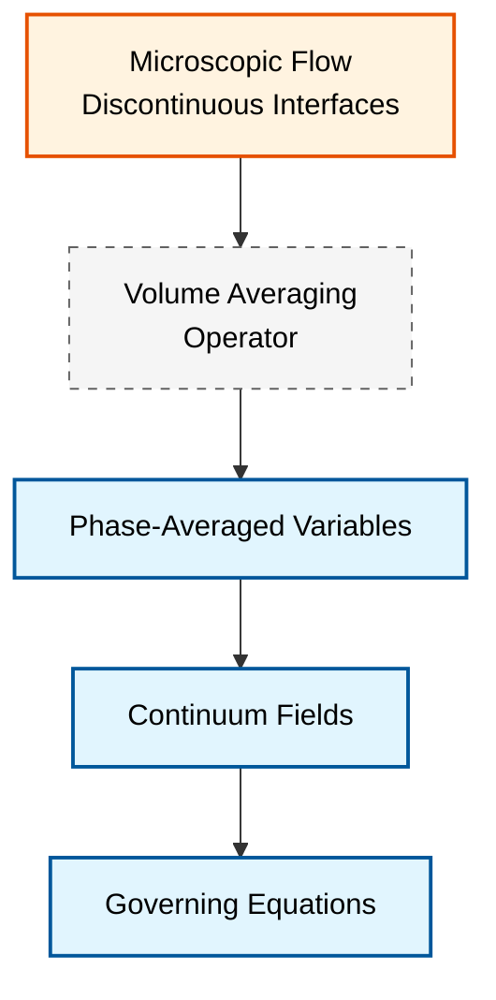

# Mathematical Framework for Eulerian-Eulerian Multiphase Flow

**กรอบแนวคิดทางคณิตศาสต์สำหรับการไหลแบบหลายเฟส (multiphase flows)** ใน OpenFOAM เป็นรากฐานสำหรับแนวทางการคำนวณแบบ Eulerian-Eulerian ผ่านกระบวนการเฉลี่ยที่เป็นระบบและความสัมพันธ์แบบปิด (closure relationships) เพื่อเปลี่ยนจากฟิสิกส์ระดับจุลภาคที่มีรอยต่อไม่ต่อเนื่อง ไปสู่สนามต่อเนื่องระดับมหภาคที่สามารถคำนวณได้

> [!INFO] แนวคิดหลัก
> แนวทางแบบ Eulerian-Eulerian ถือว่าแต่ละเฟสเป็น **continuum ที่แทรกซึมซึ่งกันและกัน** โดยแต่ละเฟสจะครอบครองปริมาตรควบคุม (control volume) เดียวกันและมีชุดสมการอนุรักษ์ของตัวเอง

---

## 📊 กระบวนการเฉลี่ย (Averaging Procedures)

เนื่องจากการไหลแบบหลายเฟสในระดับจุลภาคประกอบด้วยพื้นผิวที่ขาดตอน (discontinuous interfaces) CFD จึงต้องการเทคนิคการเฉลี่ยที่เข้มงวดเพื่อสร้างสนามที่ต่อเนื่อง (continuous fields) สำหรับการแก้ปัญหาเชิงคำนวณ



### 1. การเฉลี่ยเชิงปริมาตร (Volume Averaging)

สำหรับปริมาณใดๆ $\phi$ ในเฟส $k$ ตัวดำเนินการเฉลี่ยเชิงปริมาตรถูกนิยามดังนี้:

$$\langle \phi \rangle_k = \frac{1}{V_k} \int_{V_k} \phi \, \mathrm{d}V$$

**โดยที่:**
- $\langle \phi \rangle_k$ คือปริมาณที่เฉลี่ยตามเฟส
- $V_k$ คือปริมาตรชั่วขณะที่เฟส $k$ ครอบครองภายในปริมาตรเฉลี่ย $V$
- $\phi$ แทนสนามสเกลาร์ เวกเตอร์ หรือเทนเซอร์ใดๆ

กระบวนการนี้ช่วยลดทอนลักษณะที่ขาดตอนของพื้นผิวระหว่างเฟสได้อย่างมีประสิทธิภาพ ในขณะที่ยังคงรักษาฟิสิกส์ที่สำคัญของแต่ละเฟสไว้

### 2. การเฉลี่ยตามเฟส (Phase Averaging)

เชื่อมโยงปริมาณเฉลี่ยภายในเฟสเข้ากับกรอบอ้างอิงของส่วนผสม (mixture frame):

$$\bar{\phi}_k = \frac{1}{V} \int_{V_k} \phi \, \mathrm{d}V = \alpha_k \langle \phi \rangle_k$$

**โดยที่:**
- $\bar{\phi}_k$ คือปริมาณที่เฉลี่ยตามเฟสในกรอบอ้างอิงของส่วนผสม
- $\alpha_k = \frac{V_k}{V}$ คือสัดส่วนปริมาตร (volume fraction)
- $V$ คือปริมาตรเฉลี่ยทั้งหมด

> [!TIP] ความสำคัญ
> ความสัมพันธ์นี้เป็นการเชื่อมโยงค่าเฉลี่ยภายในเฟสเข้ากับโดเมนการคำนวณที่ใช้ในการจำลอง CFD

### 3. การเฉลี่ยตามเวลา (Temporal Averaging)

สำหรับการไหลที่มีความปั่นป่วน (Turbulent flows):

$$\tilde{\phi}_k = \frac{1}{\Delta t} \int_{t}^{t+\Delta t} \phi_k(\mathbf{x},\tau) \, \mathrm{d}\tau$$

การรวมกันของการเฉลี่ยเชิงพื้นที่และการเฉลี่ยตามเวลาจะให้ปริมาณของเฟสที่เฉลี่ยแบบ Reynolds (Reynolds-averaged phase quantities) ซึ่งใช้ในแบบจำลอง RANS

---

## ⚖️ กฎการอนุรักษ์ในรูปแบบที่เฉลี่ยแล้ว (Conservation Laws)

### 1. การอนุรักษ์มวล (Continuity Equation)

$$\frac{\partial}{\partial t}(\alpha_k \rho_k) + \nabla \cdot (\alpha_k \rho_k \mathbf{u}_k) = \sum_{l \neq k} \dot{m}_{lk}$$

**การวิเคราะห์ทีละเทอม:**

| เทอม | สัญลักษณ์ | ความหมาย |
|------|-----------|----------|
| **Temporal term** | $\frac{\partial}{\partial t}(\alpha_k \rho_k)$ | การสะสมหรือลดลงของมวลในจุดนั้นๆ |
| **Convective term** | $\nabla \cdot (\alpha_k \rho_k \mathbf{u}_k)$ | ฟลักซ์มวลสุทธิเนื่องจากการเคลื่อนที่ |
| **Source term** | $\dot{m}_{lk}$ | การถ่ายเทมวลระหว่างเฟส (เช่น การควบแน่น/ระเหย) |

**ข้อจำกัดการถ่ายเทมวล:**
$$\dot{m}_{lk} = -\dot{m}_{kl}$$

### 2. การอนุรักษ์โมเมนตัม (Momentum Equation)

$$\frac{\partial}{\partial t}(\alpha_k \rho_k \mathbf{u}_k) + \nabla \cdot (\alpha_k \rho_k \mathbf{u}_k \mathbf{u}_k) = -\alpha_k \nabla p + \nabla \cdot (\alpha_k \boldsymbol{\tau}_k) + \alpha_k \rho_k \mathbf{g} + \mathbf{M}_k$$

**การวิเคราะห์เทอมแรง (Force Terms):**

| เทอมแรง | สมการ | คำอธิบาย |
|-----------|---------|----------|
| **Pressure gradient** | $-\alpha_k \nabla p$ | แรงดันที่ถ่วงน้ำหนักด้วยสัดส่วนเฟส |
| **Viscous stress** | $\nabla \cdot (\alpha_k \boldsymbol{\tau}_k)$ | แรงเสียดทานของเฟส |
| **Gravity** | $\alpha_k \rho_k \mathbf{g}$ | แรงโน้มถ่วงที่กระทำต่อเฟส |
| **Interphase Transfer** | $\mathbf{M}_k$ | แรงที่เกิดจากการปฏิสัมพันธ์ระหว่างเฟส |

#### เทนเซอร์ความเค้นหนืด (Viscous Stress Tensor)

สำหรับของไหลนิวตัน (Newtonian fluids):

$$\boldsymbol{\tau}_k = \mu_k \left[\nabla \mathbf{u}_k + (\nabla \mathbf{u}_k)^T\right] - \frac{2}{3} \mu_k (\nabla \cdot \mathbf{u}_k) \mathbf{I}$$

**โดยที่:**
- $\mu_k$ คือความหนืดจลน์ (dynamic viscosity)
- $\mathbf{I}$ คือเทนเซอร์เอกลักษณ์ (identity tensor)

### 3. การอนุรักษ์พลังงาน (Energy Equation)

$$\frac{\partial}{\partial t}(\alpha_k \rho_k h_k) + \nabla \cdot (\alpha_k \rho_k \mathbf{u}_k h_k) = \alpha_k \frac{\mathrm{d}p_k}{\mathrm{d}t} + \nabla \cdot (\alpha_k \kappa_k \nabla T_k) + Q_k$$

**โดยที่:**
- $h_k$ คือเอนทัลปีเฉพาะ (specific enthalpy)
- $\kappa_k$ คือสัมประสิทธิ์การนำความร้อน (thermal conductivity)
- $T_k$ คืออุณหภูมิ
- $Q_k$ คือการถ่ายเทความร้อนระหว่างเฟส

---

## 🔧 แบบจำลองการปิด (Closure Models)

กระบวนการเฉลี่ยจะทำให้เกิดเทอมเพิ่มเติมที่ต้องการแบบจำลองปิด (closure models) เพื่อให้ระบบสามารถแก้ปัญหาได้

### 1. การถ่ายโอนโมเมนตัมระหว่างเฟส ($\mathbf{M}_k$)

$$\mathbf{M}_k = \sum_{l \neq k} \mathbf{K}_{kl} (\mathbf{u}_l - \mathbf{u}_k) + \mathbf{F}_k^{\text{lift}} + \mathbf{F}_k^{\text{vm}} + \mathbf{F}_k^{\text{disp}}$$

#### Drag Force (แรงฉุด)

$$\mathbf{F}_{D,k} = K_{kl} (\mathbf{u}_l - \mathbf{u}_k)$$

โดยสัมประสิทธิ์การแลกเปลี่ยนโมเมนตัม $K_{kl}$:

$$K_{kl} = \frac{3}{4} C_D \frac{\alpha_k \alpha_l \rho_{\text{avg}}}{d_l} |\mathbf{u}_k - \mathbf{u}_l|$$

| แบบจำลอง | สมการ | เงื่อนไขการใช้งาน |
|-----------|---------|------------------|
| **Schiller-Naumann** | $C_D = \frac{24}{Re_p}(1 + 0.15 Re_p^{0.687})$ | $Re_p < 1000$ |
| **Ishii-Zuber** | ความสัมพันธ์เชิงประจักษ์ | ฟองอากาศที่บิดเบี้ยว |
| **Tomiyama** | พิจารณาผลกระทบจากผนัง | ฟองอากาศขนาดเล็ก |

#### Lift Force (แรงยก)

$$\mathbf{F}_{L,k} = C_L \rho_c \alpha_k (\mathbf{u}_k - \mathbf{u}_c) \times (\nabla \times \mathbf{u}_c)$$

- แรงในแนวขวางเนื่องจากความเฉือน (shear)
- ขึ้นอยู่กับความเร็วสัมพัทธ์และ vorticity ของเฟสต่อเนื่อง

> [!WARNING] ข้อสังเกต
> การเปลี่ยนเครื่องหมายของสัมประสิทธิ์แรงยก ($C_L$) สามารถเกิดขึ้นได้ ขึ้นอยู่กับขนาดของฟองอากาศและสภาวะการไหล

#### Virtual Mass Force (แรงมวลเสมือน)

$$\mathbf{F}_{VM,k} = C_{VM} \rho_c \alpha_k \left(\frac{\mathrm{D}\mathbf{u}_c}{\mathrm{D}t} - \frac{\mathrm{D}\mathbf{u}_k}{\mathrm{D}t}\right)$$

- แรงเนื่องจากการเร่งความเร็วสัมพัทธ์
- $C_{VM} \approx 0.5$ สำหรับอนุภาคทรงกลม
- **สำคัญมาก**เมื่อ: อัตราส่วนความหนาแน่นต่ำ การเร่งสูง ความถี่การแกว่งสูง

#### Turbulent Dispersion Force (แรงกระจายความปั่นป่วน)

$$\mathbf{F}_{TD,k} = -C_{TD} \rho_c k_{t,c} \nabla \alpha_k$$

- การกระจายตัวเนื่องจากความปั่นป่วน
- จำลองการผสมของเฟสอันเนื่องมาจากการผันผวนจากความปั่นป่วน

### 2. ความเค้นความปั่นป่วน (Turbulent Stress)

ใช้แบบจำลอง **Eddy Viscosity**:

$$\boldsymbol{\tau}_k^{\text{turb}} = \mu_{t,k} \left[\nabla \mathbf{u}_k + (\nabla \mathbf{u}_k)^T\right] - \frac{2}{3}\rho_k k_k \mathbf{I}$$

#### k-ε Model สำหรับแต่ละเฟส

$$\frac{\partial}{\partial t}(\alpha_k \rho_k k_k) + \nabla \cdot (\alpha_k \rho_k \mathbf{u}_k k_k) = P_{k,k} - \alpha_k \rho_k \epsilon_k + \nabla \cdot \left[\alpha_k \frac{\mu_{t,k}}{\sigma_k} \nabla k_k\right] + S_{k,\text{int}}$$

$$\frac{\partial}{\partial t}(\alpha_k \rho_k \epsilon_k) + \nabla \cdot (\alpha_k \rho_k \mathbf{u}_k \epsilon_k) = \nabla \cdot \left[\alpha_k \frac{\mu_{t,k}}{\sigma_\epsilon} \nabla \epsilon_k\right] + \alpha_k \frac{\epsilon_k}{k_k} (C_{\epsilon 1} P_{k,k} - C_{\epsilon 2} \rho_k \epsilon_k) + S_{\epsilon,\text{int}}$$

**นิยามตัวแปร:**
- $k_k$ = พลังงานจลน์ความปั่นป่วนของเฟส $k$
- $\epsilon_k$ = อัตราการสลายตัวของความปั่นป่วน
- $P_{k,k}$ = เทอมการผลิตความปั่นป่วน
- $S_{k,\text{int}}$, $S_{\epsilon,\text{int}}$ = เทอมแหล่งกำเนิดจากการปฏิสัมพันธ์ระหว่างเฟส
- $\mu_{t,k}$ = ความหนืดของเทอร์บูลินส์

#### การเปรียบเทียบ Turbulence Models สำหรับ Multiphase Flow

| โมเดล | ข้อดี | ข้อเสีย | การใช้งาน |
|--------|-------|--------|-------------|
| **Standard k-ε** | เสถียร คำนวณเร็ว | ต่ำกว่า shear flows | กรณีทั่วไป |
| **RNG k-ε** | ดีกว่าสำหรับ strain rates สูง | ซับซ้อนขึ้น | การไหลที่มี strain สูง |
| **Realizable k-ε** | รักษา positivity | ต้องการการปรับแต่ง | จำลองที่ซับซ้อน |
| **k-ω SST** | ดีกว่าใน near-wall | ต้องการ mesh ละเอียด | boundary layers |

### 3. การถ่ายโอนความร้อน/มวลระหว่างเฟส

การถ่ายโอนความร้อนและมวลระหว่างเฟสจะถูกสร้างแบบจำลองโดยใช้ความสัมพันธ์เชิงประจักษ์ (empirical correlations):

$$Nu_k = 2 + 0.6 Re_k^{1/2} Pr_k^{1/3}$$

$$Q_k = h_{kl} A_{kl} (T_l - T_k)$$

**โดยที่:**
- $h_{kl}$ คือสัมประสิทธิ์การถ่ายโอนความร้อน
- $A_{kl}$ คือความหนาแน่นของพื้นที่ผิวสัมผัส (interfacial area density)
- $Nu_k$ คือเลข Nusselt ของเฟส $k$

---

## 🔢 ข้อพิจารณาเชิงตัวเลข (Numerical Considerations)

กรอบแนวคิดทางคณิตศาสตร์กำหนดข้อกำหนดเชิงตัวเลขที่เฉพาะเจาะจง:

| คุณสมบัติ | ข้อกำหนด | ความสำคัญ |
|------------|------------|------------|
| **Boundedness** | $0 \leq \alpha_k \leq 1$ | ป้องกันค่าติดลบหรือเกิน 1 ซึ่งไม่ถูกต้องทางฟิสิกส์ |
| **Continuity constraint** | $\sum \alpha_k = 1$ | รักษาสัดส่วนปริมาตรรวม |
| **Stiffness** | Implicit coupling | แรงระหว่างเฟสที่รุนแรงต้องการการจัดการแบบ implicit เพื่อความเสถียร |
| **MULES** | Explicit/Semi-implicit | สกีมพิเศษใน OpenFOAM สำหรับแก้สมการ $\alpha$ |
| **Stability** | การรักษาเทอมระหว่างเฟสแบบอิมพลิซิต | การบรรจบกันของการแก้ปัญหา |
| **Conservation** | สกีมเชิงการแยกรักษาการอนุรักษ์ | ความแม่นยำของผลลัพธ์ |

> [!WARNING] ความท้าทายเชิงตัวเลข
>
> เทอมแหล่งที่มาของสมการโมเมนตัมจะแข็งแกร่งมาก (extremely stiff) สำหรับการโหลดอนุภาคสูง ซึ่งต้องการการจัดการเชิงตัวเลขแบบพิเศษ:
> - การลดค่าซ้ำ (under-relaxation)
> - การปรับสภาพเบื้องต้น (preconditioning)
> - การเลือก linear solver ที่เหมาะสม

### เกณฑ์คุณภาพ Mesh

$$\text{Interface resolution number} = \frac{\Delta x}{\lambda_{int}} < 0.5$$

$$y^+ = \frac{\rho u_\tau y}{\mu} < 1$$

**โดยที่:**
- $\Delta x$ = ขนาด cell ของ mesh
- $\lambda_{int}$ = มาตราส่วนความยาวลักษณะของพื้นผิวระหว่างเฟส
- $y^+$ = พารามิเตอร์ไร้มิติของระยะห่างจากผนัง

---

## 💻 การนำไปใช้ใน OpenFOAM (C++ Implementation)

### Phase System Implementation

```cpp
// Phase system for multiphase flow
phaseSystem phaseModels(mesh, g);

// Phase continuity equation
fvScalarMatrix alphaEqn
(
    fvm::ddt(alpha, rho)
  + fvm::div(alphaPhi, rho)
 ==
    fvOptions(alpha, rho)
);

// Momentum equation for phase k
fvVectorMatrix UEqn
(
    fvm::ddt(alpha, rho, U)
  + fvm::div(alphaPhi, rho, U)
 ==
    -alpha*fvc::grad(p)
  + fvc::div(alpha*tau)
  + alpha*rho*g
  + interfacialMomentumTransfer // Kd*(U_other - U)
);
```

> **📂 Source:** `.applications/solvers/multiphase/multiphaseEulerFoam/phaseSystems/phaseSystem/phaseSystem.H`
>
> **คำอธิบาย:**
> - **การเริ่มต้น Phase System**: สร้างออบเจกต์ `phaseSystem` ที่จัดการข้อมูลของทุกเฟส รวมถึงสมบัติทางฟิสิกส์และเงื่อนไขขอบเขต
> - **สมการต่อเนื่องของเฟส (alphaEqn)**: อธิบายการเปลี่ยนแปลงของสัดส่วนปริมาตร `alpha` ตามเวลาและการพาความร้อน พร้อมเทอมต้นทางจากแหล่งภายนอก
> - **สมการโมเมนตัม (UEqn)**: ประกอบด้วยเทอมการเปลี่ยนแปลงตามเวลา การพา แรงดัน ความเค้นหนืด แรงโน้มถ่วง และการถ่ายโอนโมเมนตัมระหว่างเฟส
>
> **แนวคิดสำคัญ:**
> - `fvm::ddt`, `fvm::div` คือ Implicit discretization สำหรับความเสถียรเชิงตัวเลข
> - `fvc::grad`, `fvc::div` คือ Explicit calculation สำหรับเทอมที่ไม่ได้ถูกแก้โดยตรง
> - `interfacialMomentumTransfer` รวมแรงฉุด, แรงยก, แรงมวลเสมือน และแรงกระจายความปั่นป่วน

### Interfacial Momentum Transfer

```cpp
// Drag force calculation
tmp<volVectorField> dragForce
(
    KDrag * (UOtherPhase - UPhase)
);

// Lift force implementation
volVectorField F_lift
(
    CL * rhoContinuous * alphaDispersed
  * (UDispersed - UContinuous)
  * (fvc::curl(UContinuous))
);

// Virtual mass force
volVectorField F_vm
(
    Cvm * rhoContinuous * alphaDispersed
  * (fvc::ddt(UContinuous) - fvc::ddt(UDispersed))
);
```

> **📂 Source:** `.applications/solvers/multiphase/multiphaseEulerFoam/phaseSystems/PhaseSystems/MomentumTransferPhaseSystem/MomentumTransferPhaseSystem.C`
>
> **คำอธิบาย:**
> - **Drag Force**: คำนวณจากสัมประสิทธิ์การแลกเปลี่ยนโมเมนตัม `KDrag` คูณกับความเร็วสัมพัทธ์ระหว่างเฟส
> - **Lift Force**: ขึ้นอยู่กับสัมประสิทธิ์ `CL` ความหนาแน่นของเฟสต่อเนื่อง และ vorticity ของเฟสต่อเนื่อง (curl of velocity)
> - **Virtual Mass Force**: คำนวณจากความแตกต่างของการเร่งความเร็วระหว่างเฟส ถ่วงน้ำหนักด้วยสัมประสิทธิ์ `Cvm`
>
> **แนวคิดสำคัญ:**
> - ทุกแรงที่คำนวณได้จะถูกบวกเข้าไปในสมการโมเมนตัมของแต่ละเฟส
> - การใช้ `fvc::ddt` ชี้ให้เห็นว่าเป็นการคำนวณเชิง Explicit ของอนุพันธ์เวลา
> - `fvc::curl` ใช้คำนวณ vorticity ซึ่งเป็นหมุนเวกเตอร์ของความเร็ว

### Phase System Architecture

```cpp
template<class BasePhaseModel>
class MultiphasePhaseSystem
:
    public BasePhaseModel
{
    // Phase models storage
    PtrList<phaseModel> phases_;

    // Interfacial models
    HashTable<autoPtr<blendingMethod>, word, word::hash> blendingMethods_;

    // Interfacial area density
    volScalarField sigma_;

    // Drag coefficient calculation
    virtual tmp<surfaceScalarField> Kd() const = 0;
    virtual tmp<volScalarField> Kdf() const = 0;
};
```

> **📂 Source:** `.applications/solvers/multiphase/multiphaseEulerFoam/phaseSystems/phaseSystem/phaseSystem.H`
>
> **คำอธิบาย:**
> - **Template Class**: ใช้ Template pattern เพื่อรองรับประเภทฐาน (Base) ที่แตกต่างกันของระบบเฟส
> - **PtrList<phaseModel>**: เก็บรายการโมเดลเฟสทั้งหมดในรูปแบบ Pointer List เพื่อประสิทธิภาพหน่วยความจำ
> - **HashTable<blendingMethod>**: เก็บวิธีการผสมผสาน (blending) สำหรับแบบจำลองระหว่างเฟสโดยใช้ HashTable สำหรับการเข้าถึงแบบ O(1)
> - **sigma_**: คือ interfacial tension หรือความตึงผิวระหว่างเฟส
>
> **แนวคิดสำคัญ:**
> - **Virtual Functions**: `Kd()` และ `Kdf()` เป็นฟังก์ชันเสมือนที่ต้องถูก override โดย derived class
> - **surfaceScalarField vs volScalarField**: `Kd` สำหรับ surface (flux) และ `Kdf` สำหรับ volume (field)
> - **Polymorphism**: ระบบออกแบบให้รองรับหลายประเภทของ interfacial models ผ่าน inheritance

### การจัดการ Volume Fraction

```cpp
// MULES scheme for bounded alpha transport
#include "alphaEqnSubCycle.H"

for (int acorr = 0; acorr < nAlphaCorr; acorr++)
{
    volScalarField::Internal spiceregion
    (
        max(alpha1.internalField() - alpha1DiffusionLimit.internalField(), scalar(0))
    );

    fvScalarMatrix alpha1Eqn
    (
        fvm::ddt(alpha1)
      + fvm::div(alphaPhi10, alpha1)
      - fvm::Sp(fvc::ddt(alpha1) + fvc::div(alphaPhi10), alpha1)
    );

    alpha1Eqn.solve();
}
```

> **📂 Source:** `.applications/solvers/multiphase/multiphaseEulerFoam/phaseSystems/phaseSystem/phaseSystemSolve.C`
>
> **คำอธิบาย:**
> - **MULES (Multidimensional Universal Limiter with Explicit Solution)**: อัลกอริทึมพิเศษของ OpenFOAM สำหรับรักษา boundedness ของ `alpha` (0 ≤ α ≤ 1)
> - **Sub-cycling**: แก้สมการ alpha หลายครั้งต่อ time step เพื่อความเสถียร
> - **spiceregion**: กำหนดบริเวณที่มีการแพร่กระจาย (diffusion limit)
> - **Matrix Assembly**: สร้างเมทริกซ์สมการที่ประกอบด้วยเทอมเวลา การพา และเทอมแหล่งที่มา
>
> **แนวคิดสำคัญ:**
> - `fvm::Sp` ใช้สำหรับเทอมแหล่งที่มาแบบ Implicit ซึ่งช่วยเพิ่มความเสถียร
> - `internalField()` เข้าถึงค่าภายใน cell โดยไม่รวม boundary conditions
> - การทำ sub-cycling (nAlphaCorr) ช่วยป้องกันปัญหา CFL condition ที่เข้มงวด

### Time Loop Structure

```cpp
int main(int argc, char *argv[])
{
    #include "setRootCase.H"
    #include "createTime.H"
    #include "createMesh.H"
    #include "createFields.H"
    #include "initContinuityErrs.H"

    Info<< "\nStarting time loop\n" << endl;

    while (runTime.loop())
    {
        #include "readTimeControls.H"
        #include "CourantNo.H"
        #include "alphaEqnSubCycle.H"

        // Momentum coupling
        multiphaseSystem->momentumPredictor();

        // Pressure-velocity coupling
        #include "UEqn.H"
        #include "pEqn.H"

        runTime.write();
    }

    Info<< "End\n" << endl;

    return 0;
}
```

> **📂 Source:** `.applications/solvers/multiphase/multiphaseEulerFoam/phaseSystems/phaseSystem/phaseSystemSolve.C`
>
> **คำอธิบาย:**
> - **Header Inclusions (`#include`)**: ไฟล์ `.H` ที่รวมถูก preprocess ใน compile-time เพื่อตั้งค่าเริ่มต้น mesh, time, fields
> - **Time Loop**: `runTime.loop()` วนซ้ำจนกว่าจะถึงเวลาสิ้นสุดที่กำหนด
> - **alphaEqnSubCycle**: แก้สมการ volume fraction ด้วย MULES
> - **momentumPredictor()**: ทำนายค่าโมเมนตัมก่อนแก้ pressure equation
> - **UEqn & pEqn**: แก้สมการโมเมนตัมและความดันแบบ coupled (PISO/PIMPLE)
>
> **แนวคิดสำคัญ:**
> - **Run-time selection**: OpenFOAM ใช้ run-time selection table สำหรับการเลือก solver และ discretization schemes
> - **PIMPLE Algorithm**: ผสมผสาน PISO (Pressure-Implicit with Splitting of Operators) และ SIMPLE (Semi-Implicit Method for Pressure-Linked Equations)
> - **Implicit Coupling**: การแก้สมการ pressure-velocity แบบ coupled เพื่อความเสถียรในระบบหลายเฟส

---

## 📝 บทสรุป

กรอบแนวคิดนี้เป็นพื้นฐานสำหรับการนำ Solver การไหลแบบหลายเฟสมาใช้ใน OpenFOAM โดยมีการเลือกความสัมพันธ์แบบปิดและสกีมเชิงตัวเลขที่เฉพาะเจาะจงตามข้อกำหนดของแอปพลิเคชัน

### ขั้นตอนสำคัญในการจำลอง

1. **เลือกแบบจำลองการเฉลี่ย** ที่เหมาะสมกับปัญหา
2. **กำหนดความสัมพันธ์แบบปิด** สำหรับการถ่ายโอนระหว่างเฟส
3. **เลือกสกีมเชิงตัวเลข** ที่รักษาความเป็นขอบเขตและการอนุรักษ์
4. **ตรวจสอบความเสถียร** และการบรรจบกันของการคำนวณ
5. **ทำการตรวจสอบ** ผลลัพธ์กับข้อมูลทดลองหรือกรณีศึกษาอ้างอิง

> [!TIP] แหล่งข้อมูลเพิ่มเติม
>
> สำหรับรายละเอียดเพิ่มเติมเกี่ยวกับ:
> - การประยุกต์ใช้งานจริง → [[09_🏭_Real-World_Applications]]
> - การตรวจสอบความถูกต้อง → [[10_🎯_Success_Metrics_&_Validation]]
> - การแก้ไขปัญหา → [[13_🚀_Quick_Start_Guide]]
> - เอกสารอ้างอิง → [[12_📖_Key_References]]

กรอบแนวคิดนี้ช่วยให้เราสามารถจำลองพฤติกรรมการไหลแบบหลายเฟสที่ซับซ้อนได้โดยไม่ต้องติดตามพื้นผิวของทุกฟองอากาศหรือทุกหยดของเหลว ทำให้สามารถประยุกต์ใช้ในงานวิศวกรรมระดับอุตสาหกรรมได้อย่างมีประสิทธิภาพ