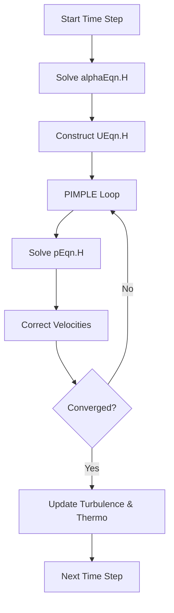

# แนวคิดการนำไปปฏิบัติ (Implementation Concepts)

## 🛠 การกำหนดค่าเฟสใน OpenFOAM

เนื้อหานี้อธิบายการนำกรอบแนวคิด Eulerian-Eulerian ไปใช้งานจริงใน OpenFOAM โดยเน้นที่ Solver `multiphaseEulerFoam` และคลาสที่เกี่ยวข้อง

---

## โครงสร้างไฟล์ `phaseProperties`

ใน OpenFOAM ไฟล์หลักที่ใช้ควบคุมคุณสมบัติและพฤติกรรมของระบบหลายเฟสคือ `constant/phaseProperties`

### การกำหนดเฟสพื้นฐาน

```openfoam
/*--------------------------------*- C++ -*----------------------------------*\
  =========                 |
  \\      /  F ield         | OpenFOAM: The Open Source CFD Toolbox
   \\    /   O peration     |
    \\  /    A nd           | Website:  www.openfoam.com
     \\/     M anipulation  |
\*---------------------------------------------------------------------------*/
phases (air water);

air
{
    type            purePhaseModel;
    diameterModel   isothermal;
    constantCoeffs
    {
        d               0.003; // bubble diameter [m]
    }
    residualAlpha   1e-6;

    // Thermophysical properties (defined in thermophysicalProperties.air)
}

water
{
    type            purePhaseModel;
    diameterModel   constant;
    constantCoeffs
    {
        d               1e-6;
    }
    residualAlpha   1e-6;
}

// การปฏิสัมพันธ์ระหว่างเฟส (Interfacial interactions)
interfacialComposition ();
drag ((air in water) SchillerNaumann);
lift ((air in water) Tomiyama);
virtualMass ((air in water) constantCoefficient);
```

### คำอธิบายคีย์เวิร์ดสำคัญ

| คำอธิบาย | ความหมาย |
|---------|-----------|
| `phases` | รายชื่อเฟสทั้งหมดในระบบ |
| `type` | ประเภทของโมเดลเฟส (purePhaseModel, phaseModel) |
| `diameterModel` | โมเดลขนาดอนุภาค/ฟองอากาศ |
| `residualAlpha` | ค่าต่ำสุดของสัดส่วนเฟสเพื่อความเสถียรเชิงตัวเลข |
| `drag` | โมเดลแรงฉุดระหว่างเฟส |
| `lift` | โมเดลแรงยก |
| `virtualMass` | โมเดลแรงมวลเสมือน |

---

## 💾 ตัวแปรสนามและคลาส C++

OpenFOAM ใช้การออกแบบเชิงวัตถุ (Object-Oriented) เพื่อจัดการเฟสต่างๆ อย่างเป็นระบบ

### คลาสหลักใน OpenFOAM

| คลาส | หน้าที่หลัก | การใช้งาน |
|------|-------------|-------------|
| **`phaseModel`** | คลาสพื้นฐานสำหรับ phase models | กำหนดคุณสมบัติแต่ละเฟส |
| **`phaseSystem`** | จัดการการโต้ตอบระหว่างเฟส | multiphase interactions |
| **`blendingMethod`** | ผสมคุณสมบัติของเฟส | blends phase properties |
| **`dragModel`** | คำนวณ interfacial drag coefficients | การถ่ายโอนโมเมนตัม |
| **`heatTransferPhaseSystem`** | จัดการการถ่ายเทความร้อนระหว่างเฟส | interfacial heat transfer |

### การสร้างสนามใน Source Code

```cpp
// สนามสัดส่วนเฟส (Phase fraction field)
volScalarField alpha_k
(
    IOobject("alpha." + phase.name(), runTime.timeName(), mesh, ...),
    mesh
);

// สนามความเร็ว (Phase velocity field)
volVectorField U_k
(
    IOobject("U." + phase.name(), runTime.timeName(), mesh, ...),
    mesh
);

// ความหนาแน่นเฟสเป็นฟังก์ชันของอุณหภูมิและความดัน
volScalarField rho_alpha = phase.rho();

// ความหนืดเฟสเป็นฟังก์ชันของสภาวะเฉพาะที่
volScalarField mu_alpha = phase.mu();

// การนำความร้อนของเฟส
volScalarField k_alpha = phase.k();
```

---

## 🔄 ลำดับการคำนวณ (Solver Workflow)

`multiphaseEulerFoam` ใช้ลูป **PIMPLE** เพื่อจัดการความเชื่อมโยงที่ซับซ้อนระหว่างเฟส

### แผนภูมิการไหลของ Solver



### ขั้นตอนการแก้สมการ

#### 1. สมการสัดส่วนเฟส (`alphaEqn.H`)

ใช้สกีม **MULES** (Multidimensional Universal Limiter with Explicit Solution) เพื่อรักษาขอบเขต $0 \leq \alpha_k \leq 1$

```cpp
// สมการความต่อเนื่องสำหรับแต่ละเฟส
fvScalarMatrix alphaEqn
(
    fvm::ddt(alpha, rho)
  + fvm::div(alphaPhi, rho)
 ==
    fvOptions(alpha, rho)
);
```

#### 2. สมการโมเมนตัม (`UEqn.H`)

มีการนำเทอมแรงระหว่างเฟสมาใช้อย่างเข้มงวด:

```cpp
// สมการโมเมนตัมสำหรับแต่ละเฟส
fvVectorMatrix UEqn
(
    fvm::ddt(alpha, rho, U)
  + fvm::div(alphaRhoPhi, U)
  - fvm::Sp(fvc::ddt(alpha, rho) + fvc::div(alphaRhoPhi), U)
  + turbulence->divDevReff(RhoEff)
 ==
    fvOptions(alpha, rho, U)
  + phase.Kd()*U.otherPhase() // Drag coupling
);

// การจัดการการถ่ายโอนโมเมนตัมระหว่างเฟส
tmp<volVectorField> UMean = fluid.phases()[0].U();
forAll(fluid.phases(), phasei)
{
    UMean =
        (UMean*fluid.phases()[phasei].d()
       + fluid.phases()[phasei].U()*fluid.phases()[phasei].d())
      /fluid.phases()[phasei].d();
}
```

---

## 🔬 แบบจำลองแรงระหว่างเฟส

### Drag Models

แรงฉุดเป็นปัจจัยสำคัญที่สุดในการถ่ายโอนโมเมนตัมระหว่างเฟส

| โมเดล | ช่วง Reynolds Number | การใช้งาน |
|--------|---------------------|-------------|
| **Schiller-Naumann** | $Re_p < 1000$ | กระบวนการทั่วไป |
| **Ishii-Zuber** | หลากหลาย | ของเหลว-ก๊าซ |
| **Tomiyama** | $Eo < 4$ | ฟองก๊าซ |
| **Grace** | หลากหลาย | อนุภาคของแข็ง |

#### สมการ Drag Coefficient

**Schiller-Naumann Model:**
$$C_D = \begin{cases}
24 (1 + 0.15 Re_p^{0.687})/Re_p & \text{if } Re_p \leq 1000 \\
0.44 & \text{if } Re_p > 1000
\end{cases}$$

โดยที่ $Re_p = \frac{\rho_c |\mathbf{u}_p - \mathbf{u}_c| d_p}{\mu_c}$ คือ **particle Reynolds number**

### Non-Drag Forces

| แรง | สมการ | ความสำคัญ |
|-----|---------|------------|
| **Lift Force** | $\mathbf{F}_{L,\alpha} = C_L \rho_c \alpha_\alpha (\mathbf{u}_\alpha - \mathbf{u}_c) \times (\nabla \times \mathbf{u}_c)$ | สำคัญในท่อแนวตั้งเพื่อทำนายการกระจายตัวของฟองอากาศ |
| **Virtual Mass** | $\mathbf{F}_{VM,\alpha} = C_{VM} \rho_c \alpha_\alpha \left(\frac{\mathrm{D}\mathbf{u}_c}{\mathrm{D}t} - \frac{\mathrm{D}\mathbf{u}_\alpha}{\mathrm{D}t}\right)$ | สำคัญเมื่อเฟสมีการเร่ง/ลดความเร็วอย่างรวดเร็ว (Unsteady flows) |
| **Turbulent Dispersion** | $\mathbf{F}_{TD,\alpha} = -C_{TD} \rho_c k_{t,c} \nabla \alpha_\alpha$ | ช่วยจำลองการฟุ้งกระจายของเฟสเนื่องจากความปั่นป่วน |

---

## 🚀 แนวทางปฏิบัติที่ดี (Best Practices)

### 1. Mesh Quality

การไหลแบบหลายเฟสไวต่อคุณภาพ Mesh มาก ควรหลีกเลี่ยงเซลล์ที่มี Aspect Ratio สูง

```cpp
// การตั้งค่า checkMesh
checkMesh -allRegions -allGeometry

// ข้อกำหนดคุณภาพ Mesh
// - Non-orthogonality < 70°
// - Aspect ratio < 5
// - Skewness < 2
```

### 2. Time Stepping

แนะนำให้ใช้ `adjustTimeStep` โดยกำหนด `maxCo` (Courant Number) ไม่เกิน 0.5 - 1.0 เพื่อความเสถียร

```openfoam
application     multiphaseEulerFoam;

startFrom       startTime;

startTime       0;

stopAt          endTime;

endTime         10;

deltaT          0.001;

adjustTimeStep  yes;

maxCo           0.5;

maxAlphaCo      0.5;
```

### 3. Relaxation Factors

สำหรับเคสที่ลู่เข้ายาก (Stiff systems) ควรเริ่มด้วยค่า Under-relaxation ที่ต่ำ

| ตัวแปร | ค่าเริ่มต้นที่แนะนำ | ค่าที่ใช้เมื่อลู่เข้าแล้ว |
|---------|---------------------|---------------------------|
| **p (ความดัน)** | 0.3 | 0.7 - 0.9 |
| **U (ความเร็ว)** | 0.5 | 0.7 - 0.9 |
| **alpha (สัดส่วนเฟส)** | 0.3 | 0.7 - 0.9 |

```openfoam
PIMPLE
{
    nCorrectors      2;
    nNonOrthogonalCorrectors 0;
    nAlphaCorr       1;
    nAlphaSubCycles  2;

    pRefCell         0;
    pRefValue        0;

    // Under-relaxation factors
    relaxationFactors
    {
        fields
        {
            p               0.3;
            rho             0.05;
        }
        equations
        {
            U               0.5;
            "(U|k|epsilon)" 0.5;
        }
    }
}
```

### 4. Boundary Conditions

การตั้งค่า Boundary Condition ที่เหมาะสมมีความสำคัญอย่างยิ่ง

#### Inlet Boundary

```openfoam
inlet
{
    type            fixedValue;
    value           uniform 1;  // สำหรับ alpha
}

// หรือใช้ flowRateInletVelocity
inlet
{
    type            flowRateInletVelocity;
    volumetricFlowRate  0.01;
    value           uniform (0 0 0);
}
```

#### Outlet Boundary

```openfoam
outlet
{
    type            inletOutlet;
    inletValue      uniform 0;
    value           uniform 0;
}

// สำหรับความดัน
outlet
{
    type            fixedMean;
    meanValue       0;
}
```

---

## การประยุกต์ใช้ในอุตสาหกรรม

### ตัวอย่างการตั้งค่า Bubble Column

```cpp
// ตัวอย่างการตั้งค่า bubble column ใน OpenFOAM
phases
(
    { type            water; }
    { type            air; }
);

bubbleColumn
{
    sigma             0.07;      // แรงตึงผิว
    g                 (0 0 -9.81); // ความโน้มถ่วง
}
```

### ตัวอย่างการตั้งค่า Multiphase Pipeline

```cpp
// การตั้งค่า multiphase pipeline
multiphaseEulerFoam

// รูปแบบการไหลแบบหลายเฟส
phases
(
    { type            oil; }
    { type            water; }
    { type            gas; }
);
```

### ตัวอย่างการตั้งค่า Reactor Safety

```cpp
// การตั้งค่า reactor safety
heatTransfer
{
    type            twoPhaseHeatTransfer;
    CHFCorrelation  biasi;        // ความสัมพันธ์ CHF
    boilingModel    RPI;          // แบบจำลองการเดือด
}

driftFlux
{
    C0              1.2;          // พารามิเตอร์การกระจายตัว
    Vgj             0.1;          // ความเร็วการดริฟท์
}
```

---

## 🔢 ข้อพิจารณาเชิงตัวเลข

กรอบแนวคิดทางคณิตศาสตร์กำหนดข้อกำหนดเชิงตัวเลขที่เฉพาะเจาะจง:

| คุณสมบัติ | ข้อกำหนด | ความสำคัญ |
|------------|------------|------------|
| **ความเป็นขอบเขต (Boundedness)** | $0 \leq \alpha_k \leq 1$ และ $\sum \alpha_k = 1$ | รักษาสัดส่วนเฟสให้อยู่ในช่วงที่ถูกต้อง |
| **ความเป็นไฮเพอร์โบลิก (Hyperbolicity)** | ความเร็วลักษณะเฉพาะกำหนดขีดจำกัดขั้นเวลา | ความเสถียรของการคำนวณ |
| **เสถียรภาพ (Stability)** | การรักษาเทอมระหว่างเฟสแบบอิมพลิซิต | การบรรจบกันของการแก้ปัญหา |
| **การอนุรักษ์ (Conservation)** | สกีมเชิงการแยกรักษาการอนุรักษ์ | ความแม่นยำของผลลัพธ์ |

---

## 📝 บทสรุป

การทำความเข้าใจสถาปัตยกรรมของ OpenFOAM จะช่วยให้ผู้ใช้งานสามารถ:

1. ✅ ปรับแต่งแบบจำลองหรือพัฒนา Solver ใหม่ๆ เพื่อตอบโจทย์ปัญหาทางวิศวกรรมที่ซับซ้อนขึ้นได้
2. ✅ ตั้งค่า Boundary Condition และ Numerical Schemes ที่เหมาะสมกับแต่ละปัญหา
3. ✅ วิเคราะห์และแก้ไขปัญหาเมื่อเกิดความไม่เสถียรในการคำนวณ
4. ✅ ทำนายพฤติกรรมการไหลแบบหลายเฟสได้อย่างแม่นยำ

**ขั้นตอนสำคัญในการจำลอง:**

1. **เลือกแบบจำลองการเฉลี่ย** ที่เหมาะสมกับปัญหา
2. **กำหนดความสัมพันธ์แบบปิด** สำหรับการถ่ายโอนระหว่างเฟส
3. **เลือกสกีมเชิงตัวเลข** ที่รักษาความเป็นขอบเขตและการอนุรักษ์
4. **ตรวจสอบความเสถียร** และการบรรจบกันของการคำนวณ
5. **ทำการตรวจสอบ** ผลลัพธ์กับข้อมูลทดลองหรือกรณีศึกษาอ้างอิง
