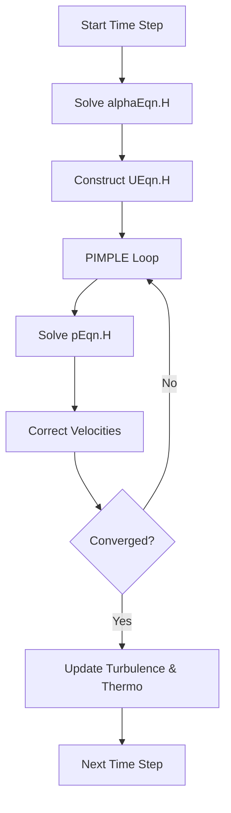

# OpenFOAM Implementation of Eulerian-Eulerian Multiphase Flow

เนื้อหานี้อธิบายการนำกรอบแนวคิด Eulerian-Eulerian ไปใช้งานจริงใน OpenFOAM โดยเน้นที่ Solver `multiphaseEulerFoam` และคลาสที่เกี่ยวข้อง

---

## 🛠 การกำหนดค่าเฟส (Phase Definition)

ใน OpenFOAM ไฟล์หลักที่ใช้ควบคุมคุณสมบัติและพฤติกรรมของระบบหลายเฟสคือ `constant/phaseProperties`

### 1. โครงสร้างไฟล์ `phaseProperties`

```openfoam
/*--------------------------------*- C++ -*----------------------------------*\
  =========                 |
  \\      /  F ield         | OpenFOAM: The Open Source CFD Toolbox
   \\    /   O peration     | 
    \\  /    A nd           | Website:  www.openfoam.com
     \\/     M anipulation  | 
\*---------------------------------------------------------------------------*/
phases (air water);

air
{
    type            purePhaseModel;
    diameterModel   isothermal;
    constantCoeffs
    {
        d               0.003; // bubble diameter [m]
    }
    residualAlpha   1e-6;
    
    // Thermophysical properties (defined in thermophysicalProperties.air)
}

water
{
    type            purePhaseModel;
    diameterModel   constant;
    constantCoeffs
    {
        d               1e-6;
    }
    residualAlpha   1e-6;
}

// การปฏิสัมพันธ์ระหว่างเฟส (Interfacial interactions)
interfacialComposition ();
drag ((air in water) SchillerNaumann);
lift ((air in water) Tomiyama);
virtualMass ((air in water) constantCoefficient);
```

---

## 💾 ตัวแปรสนามและคลาส C++ (Field Variables & Classes)

OpenFOAM ใช้การออกแบบเชิงวัตถุ (Object-Oriented) เพื่อจัดการเฟสต่างๆ อย่างเป็นระบบ

### 1. คลาส `phaseModel` และ `phaseSystem`
- **`phaseModel`**: เก็บข้อมูลสถานะของเฟสเดียว (U, alpha, rho, mu)
- **`phaseSystem`**: จัดการการโต้ตอบระหว่างทุกเฟสในระบบ

### 2. การสร้างสนามใน Source Code
```cpp
// สนามสัดส่วนเฟส (Phase fraction field)
volScalarField alpha_k
(
    IOobject("alpha." + phase.name(), runTime.timeName(), mesh, ...),
    mesh
);

// สนามความเร็ว (Phase velocity field)
volVectorField U_k
(
    IOobject("U." + phase.name(), runTime.timeName(), mesh, ...),
    mesh
);
```

---

## 🔄 ลำดับการคำนวณ (Solver Workflow)

`multiphaseEulerFoam` ใช้ลูป **PIMPLE** เพื่อจัดการความเชื่อมโยงที่ซับซ้อนระหว่างเฟส



### 1. สมการสัดส่วนเฟส (`alphaEqn.H`)
ใช้สกีม **MULES** (Multidimensional Universal Limiter with Explicit Solution) เพื่อรักษาขอบเขต $0 \leq \alpha_k \leq 1$

### 2. สมการโมเมนตัม (`UEqn.H`)
มีการนำเทอมแรงระหว่างเฟสมาใช้อย่างเข้มงวด:
```cpp
fvVectorMatrix UEqn
(
    fvm::ddt(alpha, rho, U)
  + fvm::div(alphaRhoPhi, U)
  - fvm::Sp(fvc::ddt(alpha, rho) + fvc::div(alphaRhoPhi), U)
  + turbulence->divDevReff(RhoEff)
 ==
    fvOptions(alpha, rho, U)
  + phase.Kd()*U.otherPhase() // Drag coupling
);
```

---

## 🔬 แบบจำลองแรงระหว่างเฟส (Interfacial Force Models)

### 1. Drag Models
- **Schiller-Naumann**: มาตรฐานสำหรับอนุภาคทรงกลม ($Re < 1000$)
- **Ishii-Zuber**: สำหรับฟองอากาศ/หยดน้ำที่เสียรูปได้
- **Gidaspow**: นิยมใช้ในระบบแก๊ส-ของแข็ง (Fluidized beds)

### 2. Non-Drag Forces
- **Lift Force**: สำคัญในท่อแนวตั้งเพื่อทำนายการกระจายตัวของฟองอากาศ
- **Virtual Mass**: สำคัญเมื่อเฟสมีการเร่ง/ลดความเร็วอย่างรวดเร็ว (Unsteady flows)
- **Turbulent Dispersion**: ช่วยจำลองการฟุ้งกระจายของเฟสเนื่องจากความปั่นป่วน

---

## 🚀 แนวทางปฏิบัติที่ดี (Best Practices)

1. **Mesh Quality**: การไหลแบบหลายเฟสไวต่อคุณภาพ Mesh มาก ควรหลีกเลี่ยงเซลล์ที่มี Aspect Ratio สูง
2. **Time Stepping**: แนะนำให้ใช้ `adjustTimeStep` โดยกำหนด `maxCo` (Courant Number) ไม่เกิน 0.5 - 1.0 เพื่อความเสถียร
3. **Relaxation Factors**: สำหรับเคสที่ลู่เข้ายาก (Stiff systems) ควรเริ่มด้วยค่า Under-relaxation ที่ต่ำ (เช่น 0.3 สำหรับ p และ 0.5 สำหรับ U)
4. **Boundary Conditions**: 
   - `inlet`: กำหนด `alpha` และ `U` ของทุกเฟสให้ชัดเจน
   - `outlet`: มักใช้ `inletOutlet` เพื่อป้องกันการไหลย้อนกลับที่ไม่เสถียร

การทำความเข้าใจสถาปัตยกรรมของ OpenFOAM จะช่วยให้ผู้ใช้งานสามารถปรับแต่งแบบจำลองหรือพัฒนา Solver ใหม่ๆ เพื่อตอบโจทย์ปัญหาทางวิศวกรรมที่ซับซ้อนขึ้นได้