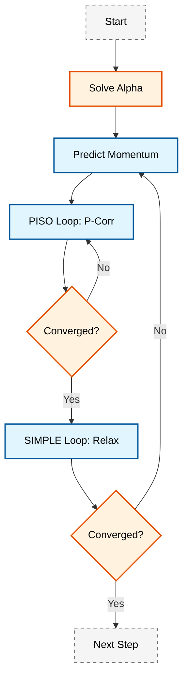

# ภาพรวมการจำลองการไหลแบบหลายเฟสแบบ Eulerian (Eulerian Multiphase Flow Modeling Overview)

การจำลองการไหลแบบหลายเฟสแบบ Eulerian (Eulerian multiphase flow modeling) เป็นเทคนิคขั้นสูงใน **Computational Fluid Dynamics (CFD)** ที่ใช้สำหรับวิเคราะห์ระบบที่มี **สองเฟสขึ้นไป** (ของเหลว, ก๊าซ, ของแข็ง) อยู่ร่วมกันและมีปฏิสัมพันธ์ซับซ้อนผ่านปรากฏการณ์ที่รอยต่อ (interfacial phenomena)

---

## ทำไมต้องเรียนรู้ Multiphase Flow?

> [!INFO] ความสำคัญในโลกแห่งความเป็นจริง
> การไหลแบบหลายเฟสพบได้ทั่วไปในธรรมชาติและอุตสาหกรรม:
> - **การไหลของเลือด** ในหลอดเลือด
> - **การขนส่งน้ำมัน** ในท่อข้างทวีป
> - **เครื่องปฏิกรณ์นิวเคลียร์** ที่มีการเดือดของน้ำหรม
> - **การผลิตทางเคมี** ที่มีปฏิกิริยาระหว่างเฟส
> - **ระบบระบายความร้อน** ในอาคาร

---

## 1. แนวคิดพื้นฐาน (Fundamental Concepts)

### 1.1 แนวทาง Eulerian vs. Lagrangian

| แนวทาง | หลักการ | ความเหมาะสม | ต้นทุนการคำนวณ |
|---------|---------|-------------|------------------|
| **Eulerian-Eulerian** | ทุกเฟสเป็นสารต่อเนื่องที่แทรกซึมกัน (Interpenetrating Continua) | เฟสผสมสูง, รูปทรงเรขาคณิตซับซ้อน | ปานกลาง |
| **Eulerian-Lagrangian** | เฟสต่อเนื่อง = Eulerian, อนุภาค = Lagrangian | อนุภาคกระจาย, ติดตามแต่ละอนุภาค | สูง (ตามจำนวนอนุภาค) |

### 1.2 สัดส่วนเฟส (Volume Fraction)

ในวิธี Eulerian แต่ละเฟส $k$ ถูกนิยามด้วย **สัดส่วนเฟส** $\alpha_k$:

$$\sum_{k=1}^{N} \alpha_k = 1$$

**ข้อจำกัด:**
- $0 \leq \alpha_k \leq 1$
- $\alpha_k = 0$ → เฟส $k$ ไม่มีอยู่
- $\alpha_k = 1$ → เฟส $k$ ครอบครองปริมาตรทั้งหมด

### 1.3 การหาค่าเฉลี่ยเชิงปริมาตร (Volume Averaging)

คุณสมบัติเฉลี่ยของเฟสจะถูกคำนวณด้วย **การหาค่าเฉลี่ยเชิงปริมาตร**:

$$\bar{\phi}_k = \frac{1}{V} \int_V \alpha_k \phi_k \, \mathrm{d}V$$

โดยที่:
- $\bar{\phi}_k$ = ค่าเฉลี่ยของคุณสมบัติ $\phi$ ของเฟส $k$
- $V$ = ปริมาตรควบคุมที่ใช้ในการหาค่าเฉลี่ย

---

## 2. สมการควบคุม (Governing Equations)

### 2.1 สมการอนุรักษ์มวล (Mass Conservation)

สำหรับแต่ละเฟส $k$:

$$\frac{\partial (\alpha_k \rho_k)}{\partial t} + \nabla \cdot (\alpha_k \rho_k \mathbf{U}_k) = \sum_{l=1}^{N} \dot{m}_{lk} \tag{2.1}$$

**คำนิยามตัวแปร:**
- $\rho_k$ = ความหนาแน่นของเฟส $k$ [kg/m³]
- $\mathbf{U}_k$ = ความเร็วของเฟส $k$ [m/s]
- $\dot{m}_{lk}$ = อัตราการถ่ายเทมวลจากเฟส $l$ ไปยัง $k$ [kg/(m³·s)]

> [!TIP] กรณีพิเศษ
> สำหรับเฟสที่ไม่อัดตัวได้ (incompressible):
> $$\frac{\partial \alpha_k}{\partial t} + \nabla \cdot (\alpha_k \mathbf{U}_k) = \frac{\dot{m}_{lk}}{\rho_k}$$

### 2.2 สมการอนุรักษ์โมเมนตัม (Momentum Conservation)

$$\frac{\partial (\alpha_k \rho_k \mathbf{U}_k)}{\partial t} + \nabla \cdot (\alpha_k \rho_k \mathbf{U}_k \mathbf{U}_k) = -\alpha_k \nabla p + \nabla \cdot (\alpha_k \boldsymbol{\tau}_k) + \alpha_k \rho_k \mathbf{g} + \sum_{l \neq k} \mathbf{M}_{lk} \tag{2.2}$$

**ประกอบด้วย:**

| เทอม | ความหมายทางฟิสิกส์ |
|------|-------------------|
| $-\alpha_k \nabla p$ | แรงจากความชันความดัน |
| $\nabla \cdot (\alpha_k \boldsymbol{\tau}_k)$ | แรงความเค้นหนืด |
| $\alpha_k \rho_k \mathbf{g}$ | แรงโน้มถ่วง |
| $\mathbf{M}_{lk}$ | การถ่ายเทโมเมนตัมระหว่างเฟส |

**เทนเซอร์ความเค้น (Stress Tensor):**
$$\boldsymbol{\tau}_k = \mu_k \left( \nabla \mathbf{U}_k + \nabla \mathbf{U}_k^T \right) - \frac{2}{3}\mu_k (\nabla \cdot \mathbf{U}_k)\mathbf{I}$$

### 2.3 สมการอนุรักษ์พลังงาน (Energy Conservation)

$$\frac{\partial (\alpha_k \rho_k h_k)}{\partial t} + \nabla \cdot (\alpha_k \rho_k \mathbf{U}_k h_k) = \alpha_k \frac{\partial p}{\partial t} + \nabla \cdot (\alpha_k \lambda_k \nabla T_k) + Q_{lk} \tag{2.3}$$

**คำนิยามตัวแปร:**
- $h_k$ = เอนทาลปีจำเพาะ [J/kg]
- $\lambda_k$ = ความนำความร้อน [W/(m·K)]
- $T_k$ = อุณหภูมิ [K]
- $Q_{lk}$ = การถ่ายเทความร้อนระหว่างเฟส [W/m³]

---

## 3. ปรากฏการณ์ระหว่างเฟส (Interfacial Phenomena)

### 3.1 แรงฉุด (Drag Force)

แรงฉุดเป็นกลไกหลักในการถ่ายเทโมเมนตัมระหว่างเฟส:

$$\mathbf{F}_{d,kl} = K_{kl}(\mathbf{U}_l - \mathbf{U}_k) \tag{3.1}$$

**แบบจำลอง Schiller-Naumann** (สำหรับอนุภาคทรงกลม):

$$K_{kl} = \frac{3}{4} C_D \frac{\alpha_k \rho_c |\mathbf{U}_d - \mathbf{U}_c|}{d_p}$$

โดยที่สัมประสิทธิ์แรงฉุด $C_D$:

$$C_D = \begin{cases}
\frac{24}{Re_p}(1 + 0.15Re_p^{0.687}) & \text{if } Re_p < 1000 \\
0.44 & \text{if } Re_p \geq 1000
\end{cases}$$

**Particle Reynolds Number:**
$$Re_p = \frac{\rho_c |\mathbf{U}_d - \mathbf{U}_c| d_p}{\mu_c}$$

### 3.2 แรงยก (Lift Force)

เกิดจากความเฉือนในของไหล:

$$\mathbf{F}_{lift} = C_L \rho_c \alpha_d (\mathbf{U}_d - \mathbf{U}_c) \times (\nabla \times \mathbf{U}_c) \tag{3.2}$$

### 3.3 แรงมวลเสมือน (Virtual Mass Force)

พิจารณาผลของการเร่งความเร็วของของไหลรอบข้าง:

$$\mathbf{F}_{vm} = C_{vm} \rho_c \alpha_d (\mathbf{a}_d - \mathbf{a}_c) \tag{3.3}$$

โดยที่ $C_{vm} \approx 0.5$ สำหรับอนุภาคทรงกลม

### 3.4 แรงกระจายตัวจากความปั่นป่วน (Turbulent Dispersion)

$$\mathbf{F}_{td} = -C_{td} \rho_c k \nabla \alpha_d \tag{3.4}$$

---

## 4. การนำไปใช้ใน OpenFOAM

### 4.1 สถาปัตยกรรม Solver หลัก

**Solver หลัก:** `multiphaseEulerFoam`

```
multiphaseEulerFoam/
├── createFields.H          # การสร้างฟิลด์
├── alphaEqn.H              # สมการสัดส่วนเฟส
├── UEqn.H                  # สมการโมเมนตัม
├── pEqn.H                  # สมการความดัน
└── EEqn.H                  # สมการพลังงาน
```

### 4.2 โครงสร้างคลาสพื้นฐาน

#### Phase Model

```cpp
class phaseModel
{
    // Main fields for the phase
    volScalarField alpha_;      // Volume fraction
    volScalarField rho_;        // Density
    volVectorField U_;          // Velocity

    // Virtual function for correction
    virtual void correct() = 0;
};
```

**คำอธิบาย:**
- **Source:** โครงสร้างคลาส phaseModel ถูกนิยามในไฟล์ฐานของ OpenFOAM
- **คำอธิบาย:** คลาส phaseModel เป็นคลาสพื้นฐานสำหรับเฟสแต่ละประเภท โดยเก็บฟิลด์หลัก (alpha, rho, U) และฟังก์ชัน correct() สำหรับอัปเดตค่า
- **แนวคิดสำคัญ:** การใช้ virtual function ช่วยให้สามารถสร้าง derived class สำหรับเฟสประเภทต่างๆ ได้อย่างยืดหยุ่น

#### Drag Model

```cpp
class dragModel
{
public:
    // Calculate drag coefficient
    virtual tmp<volScalarField> K() const = 0;

    // Runtime selection mechanism
    declareRunTimeSelectionTable(...);
};
```

**คำอธิบาย:**
- **Source:** ไฟล์ dragModel.H ในไดเรกทอรี phaseSystems
- **คำอธิบาย:** คลาส dragModel ให้ interface สำหรับคำนวณสัมประสิทธิ์แรงฉุด K โดยใช้ runtime selection เพื่อเลือกแบบจำลองที่เหมาะสม (เช่น SchillerNaumann, IshiiZuber)
- **แนวคิดสำคัญ:** Runtime selection table ช่วยให้ผู้ใช้สามารถระบุประเภทของแบบจำลองในไฟล์ dictionary ได้โดยตรง

### 4.3 อัลกอริทึมการแก้ปัญหา

#### PIMPLE Algorithm (PISO + SIMPLE)



**ขั้นตอนหลัก:**

1. **การแก้สมการสัดส่วนเฟส (Alpha Equations):**
   $$\frac{\partial \alpha_k}{\partial t} + \nabla \cdot (\alpha_k \mathbf{U}_k) = \frac{\dot{m}_{lk}}{\rho_k}$$

2. **การพยากรณ์โมเมนตัม (Momentum Prediction):**
   $$\frac{\partial (\alpha_k \rho_k \mathbf{U}_k)}{\partial t} + \nabla \cdot (\alpha_k \rho_k \mathbf{U}_k \mathbf{U}_k) = -\alpha_k \nabla p^* + \mathbf{S}_U$$

3. **การแก้ไขความดัน (Pressure Correction):**
   $$\nabla \cdot \left( \sum_{k=1}^{N} \frac{\alpha_k}{\rho_k} \nabla p' \right) = \sum_{k=1}^{N} \nabla \cdot (\alpha_k \mathbf{U}_k^*)$$

4. **การแก้ไขความเร็ว (Velocity Correction):**
   $$\mathbf{U}_k^{n+1} = \mathbf{U}_k^* - \frac{\Delta t}{\rho_k} \nabla p'$$

### 4.4 การตั้งค่าใน OpenFOAM

**constant/phaseProperties:**

```cpp
phases (water air);

water
{
    transportModel  Newtonian;
    nu              [0 2 -1 0 0 0 0] 1e-06;
    rho             [1 -3 0 0 0 0 0] 1000;
}

air
{
    transportModel  Newtonian;
    nu              [0 2 -1 0 0 0 0] 1.48e-05;
    rho             [1 -3 0 0 0 0 0] 1;
}

// Drag model configuration
dragModel
{
    type        SchillerNaumann;
    d           [0 1 0 0 0 0 0] 0.001; // Particle diameter [m]
}
```

**คำอธิบาย:**
- **Source:** ไฟล์ phaseProperties ในไดเรกทอรี constant/
- **คำอธิบาย:** ไฟล์นี้ระบุคุณสมบัติของแต่ละเฟส (viscosity, density) และแบบจำลองแรงฉุดที่ใช้ รวมถึงพารามิเตอร์ที่จำเป็น (เช่น เส้นผ่านศูนย์กลางอนุภาค)
- **แนวคิดสำคัญ:** การใช้ dimension specification ใน OpenFOAM ช่วยตรวจสอบความถูกต้องของหน่วยในแต่ละพารามิเตอร์

**system/fvSolution:**

```cpp
solvers
{
    p
    {
        solver          GAMG;
        tolerance       1e-06;
        relTol          0.01;
    }

    pFinal
    {
        $p;
        relTol          0;
    }
}

PIMPLE
{
    nCorrectors      2;
    nNonOrthogonalCorrectors 0;
    nAlphaCorr       1;

    residualControl
    {
        p               1e-5;
        U               1e-5;
        alpha.*         1e-5;
    }
}
```

**คำอธิบาย:**
- **Source:** ไฟล์ fvSolution ในไดเรกทอรี system/
- **คำอธิบาย:** ตั้งค่า numerical solvers และพารามิเตอร์ของอัลกอริทึม PIMPLE รวมถึงเกณฑ์การหยุดซ้ำ (residual control)
- **แนวคิดสำคัญ:** nCorrectors คือจำนวนรอบ PISO loop, residualControl ใช้ตรวจสอบความเข้าใกล้สภาวะคงตัวของการแก้ปัญหา

---

## 5. รูปแบบการไหล (Flow Regimes)

### 5.1 การจำแนกประเภท

| รูปแบบการไหล | ลักษณะเฉพาะ | เงื่อนไขเฟส |
|----------------|-------------|--------------|
| **Bubbly Flow** | ฟองกระจายในของเหลว | สัดส่วนก๊าซต่ำ |
| **Slug Flow** | ฟองขนาดใหญ่สลับกับปลั๊กของเหลว | ท่อแนวตั้ง |
| **Stratified Flow** | เฟสแยกชั้นกัน | ท่อแนวนอน |
| **Annular Flow** | ชั้นฟิล์มบนผนัง + แกนกลางก๊าซ | ความเร็วก๊าซสูง |
| **Churn Flow** | การไหลสับสน | ความเร็วก๊าซสูงมาก |

> [!TIP] **Physical Analogy: The Salad Dressing (น้ำสลัด)**
>
> ลองนึกภาพขวดน้ำสลัด Vinaigrette (น้ำมัน + น้ำส้มสายชู):
>
> 1.  **Separated Flow (Stratified):** เมื่อวางทิ้งไว้นิ่งๆ น้ำมันจะลอยอยู่บนน้ำส้มสายชู แยกเป็นชั้นชัดเจน (เหมือนน้ำมันในท่อขนส่ง)
> 2.  **Dispersed Flow (Emulsion):** เมื่อคุณเขย่าขวดแรงๆ น้ำมันจะแตกเป็นเม็ดเล็กๆ กระจายตัวอยู่ในน้ำส้มสายชู (เหมือน Bubbly flow)
> 3.  **Transitional Flow:** ช่วงที่คุณเริ่มเขย่าเบาๆ หรือเริ่มหยุดเขย่า จะมีก้อนน้ำมันขนาดใหญ่และขนาดเล็กปนกัน ไม่เป็นระเบียบ (เหมือน Churn/Slug flow)
>
> **หัวใจสำคัญ:** แรงที่คุณเขย่า (Turbulence/Shear) แข่งกับแรงตึงผิว (Surface Tension) เพื่อกำหนด "รูปแบบการไหล" (Regime)

### 5.2 ตัวเลขไร้มิติสำคัญ

| ตัวเลข | สมการ | ความหมาย |
|---------|---------|----------|
| **Reynolds** | $Re = \frac{\rho U L}{\mu}$ | อัตราส่วนแรงเฉื่อย/แรงหนืด |
| **Eötvös** | $Eo = \frac{g(\rho_c - \rho_d)L^2}{\sigma}$ | อัตราส่วนแรงลอยตัว/แรงตึงผิว |
| **Weber** | $We = \frac{\rho U^2 L}{\sigma}$ | อัตราส่วนแรงเฉื่อย/แรงตึงผิว |

---

## 6. การตรวจสอบความถูกต้อง (Validation)

### 6.1 การตรวจสอบการอนุรักษ์

**การอนุรักษ์มวล:**
$$\text{Total Mass} = \sum_k \int_{\text{domain}} \alpha_k \rho_k \, \mathrm{d}V = \text{constant}$$

**การอนุรักษ์โมเมนตัม:**
$$\text{Total Momentum} = \sum_k \int_{\text{domain}} \alpha_k \rho_k \mathbf{U}_k \, \mathrm{d}V$$

### 6.2 กรณีทดสอบมาตรฐาน

| กรณีทดสอบ | วัตถุประสงค์ | ตัวชี้วัด |
|-------------|-------------|-----------|
| **Dam Break** | ทดสอบการติดตามรอยต่อ | ความเร็ว wave front |
| **Rising Bubble** | ทดสอบแรงฉุดและแรงยก | ความเร็วสุดท้าย |
| **Fluidized Bed** | ทดสองทฤษฎีจลน์ | ความเร็วขั้นต่ำ |
| **Sedimentation** | ทดสอบแรงต้าน | เวลาตกตะกอน |

---

## 7. โครงสร้างหลักสูตร (Course Structure)


### เนื้อหาที่ครอบคลุมในบทนี้:

1.  **[[01_EULERIAN_FOUNDATIONS/]]** - พื้นฐานทางคณิตศาสตร์
2.  **[[03_EQUATIONS_REFERENCE/]]** - อ้างอิงสมการควบคุม
3.  **[[05_LIFT_FORCES/]]** - แรงยกและแรงระหว่างเฟส
4.  **[[06_VIRTUAL_MASS/]]** - แรงมวลเสมือน
5.  **[[08_MODEL_SELECTION/]]** - การเลือกโมเดลที่เหมาะสม
6.  **[[09_IMPLEMENTATION_ARCHITECTURE/]]** - สถาปัตยกรรมการนำไปใช้
7.  **[[10_VALIDATION_CASES/]]** - กรณีทดสอบการตรวจสอบความถูกต้อง

---

## 🧠 8. Concept Check (ทดสอบความเข้าใจ)

1.  **อะไรคือความแตกต่างหลักระหว่าง "Separated Flow" และ "Dispersed Flow"?**
    <details>
    <summary>เฉลย</summary>
    **Separated Flow** (เช่น Stratified, Annular) มี interface ขนาดใหญ่ที่แบ่งแยกระหว่างเฟสอย่างชัดเจนและต่อเนื่องตลอด domain ส่วน **Dispersed Flow** (เช่น Bubbly, Droplet) เฟสหนึ่งจะแตกตัวเป็นชิ้นส่วนเล็กๆ กระจายอยู่ในอีกเฟสซึ่งถือเป็นเฟสต่อเนื่อง
    </details>

2.  **ทำไมผลรวมของ Volume Fraction ($\sum \alpha_k$) ต้องเท่ากับ 1 เสมอ?**
    <details>
    <summary>เฉลย</summary>
    เพราะ Volume Fraction คือสัดส่วนของปริมาตรที่แต่ละเฟสครอบครองในหนึ่งหน่วยปริมาตร ถ้าผลรวมไม่เท่ากับ 1 แสดงว่ามี "ที่ว่าง" (Vacuum) หายไปหรือมีสสารเกินมา ซึ่งขัดแย้งกับกฎการอนุรักษ์มวลและนิยามของ Continuum mechanics
    </details>

3.  **ส่วนที่ยากที่สุดของการทำ Multiphase CFD คืออะไร?**
    <details>
    <summary>เฉลย</summary>
    การหาและเลือก **Closure Models** (เช่น Drag, Lift, Virtual Mass, Turbulence interaction) ที่ถูกต้อง เพราะเราไม่สามารถคำนวณ Interface ที่แท้จริงทุกจุดได้ (ในแบบจำลอง Eulerian) เราจึงต้องพึ่งพาสูตร Empirical ที่มาจากการทดลองซึ่งอาจใช้ได้ดีแค่บางเงื่อนไขเท่านั้น
    </details>

---

## 9. แหล่งอ้างอิงและการเรียนรู้เพิ่มเติม

### เอกสาร OpenFOAM:

- **OpenFOAM User Guide** - คู่มือผู้ใช้อย่างเป็นทางการ
- **OpenFOAM Programmer's Guide** - คู่มือสำหรับนักพัฒนา
- **$FOAM_TUTORIALS/multiphase/** - ตัวอย่างการใช้งาน

### วรรณกรรมแนะนำ:

1. Ishii, M., & Hibiki, T. (2011). *Thermo-Fluid Dynamics of Two-Phase Flow* (2nd ed.). Springer.
2. Crowe, C. T., Schwarzkopf, J. D., Sommerfeld, M., & Tsuji, Y. (2011). *Multiphase Flows with Droplets and Particles* (2nd ed.). CRC Press.
3. Prosperetti, A., & Tryggvason, G. (2007). *Computational Methods for Multiphase Flow*. Cambridge University Press.

---

> [!TIP] ข้อแนะนำในการเรียนรู้
> 1. เริ่มต้นจาก **กรณีทดสอบง่ายๆ** (เช่น Dam Break)
> 2. ทำความเข้าใจ **สมการควบคุม** อย่างลึกซึ้ง
> 3. ศึกษา **OpenFOAM Code** ควบคู่กับทฤษฎี
> 4. ทดลอง **ปรับเปลี่ยนพารามิเตอร์** และสังเกตผล
> 5. ตรวจสอบความถูกต้องกับ **ข้อมูลทดลอง** เสมอ