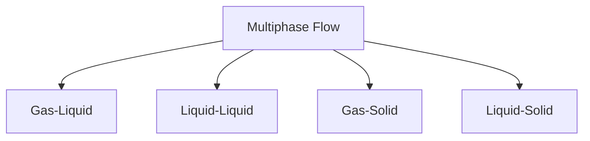

# Multiphase Fundamentals Overview

ภาพรวมพื้นฐาน Multiphase Flow

> **ทำไมต้องเข้าใจพื้นฐาน Multiphase?**
> - **ก่อนใช้ solver ต้องเข้าใจ physics** — dispersed vs separated flow เลือก solver ต่างกัน
> - **Volume fraction (α)** เป็นหัวใจ — ถ้าไม่เข้าใจ α คุณตั้งค่า case ไม่ได้
> - **Dimensionless numbers** บอกว่าใช้ model ไหน — Re, Eo, We

---

## Overview

> **💡 Multiphase Flow = เมื่อของไหลชนิดเดียวไม่เพียงพอ**
>
> น้ำกับอากาศ, น้ำมันกับน้ำ, ฟองอากาศในน้ำ — ทุกอย่างต้องใช้วิธีที่ต่างจาก single-phase

> **Multiphase flow** = การไหลที่มีมากกว่าหนึ่งเฟส (gas, liquid, solid) ไหลพร้อมกัน

---

## 1. Classification

### By Phase Combination

| System | Example |
|--------|---------|
| Gas-Liquid | Bubble columns, boiling |
| Liquid-Liquid | Oil-water separation |
| Gas-Solid | Fluidized beds |
| Liquid-Solid | Slurry transport |

### By Flow Pattern

| Pattern | Characteristics |
|---------|-----------------|
| Separated | Sharp interface |
| Dispersed | Bubbles/drops/particles |
| Mixed | Transition regimes |

---

## 2. Key Concepts

### Volume Fraction

$$\alpha_k = \frac{V_k}{V_{total}}, \quad \sum_k \alpha_k = 1$$

### Slip Velocity

$$\mathbf{u}_{slip} = \mathbf{u}_d - \mathbf{u}_c$$

### Interfacial Area

$$a = \frac{A_{interface}}{V} = \frac{6\alpha_d}{d}$$ (for spheres)

---

## 3. Dimensionless Numbers

| Number | Formula | Meaning |
|--------|---------|---------|
| Reynolds | $\frac{\rho U d}{\mu}$ | Inertia/viscosity |
| Eötvös | $\frac{\Delta\rho g d^2}{\sigma}$ | Buoyancy/surface tension |
| Weber | $\frac{\rho U^2 d}{\sigma}$ | Inertia/surface tension |
| Stokes | $\frac{\rho_d d^2 U}{18\mu_c L}$ | Particle response |

---

## 4. Modeling Approaches

| Method | Use Case |
|--------|----------|
| **VOF** | Sharp interfaces |
| **Euler-Euler** | Dispersed systems |
| **Lagrangian** | Dilute particles |

---

## 5. OpenFOAM Solvers

| Solver | Application |
|--------|-------------|
| `interFoam` | Free surface (VOF) |
| `multiphaseEulerFoam` | Bubbly/dispersed |
| `DPMFoam` | Particle tracking |

---

## Quick Reference

| Concept | Definition |
|---------|------------|
| α (volume fraction) | Fraction of volume occupied |
| Interphase forces | Drag, lift, virtual mass |
| Closure models | Required for averaging |

---

## Concept Check

<b>1. ทำไมต้อง Σα = 1?</b>

เพราะทุกจุดต้องมีเฟสใดเฟสหนึ่ง — ผลรวมของทุกเฟสต้องเติมเต็มพื้นที่ทั้งหมด

<b>2. VOF กับ Euler-Euler ต่างกันอย่างไร?</b>

- **VOF**: Track interface (sharp, resolved)
- **Euler-Euler**: Track volume fraction (averaged)

<b>3. ทำไมต้องใช้ closure models?</b>

เพราะ averaging ทำให้สูญเสียข้อมูล local → ต้องใช้ models แทน

---

## Related Documents

- **Flow Regimes:** [01_Flow_Regimes.md](01_Flow_Regimes.md)
- **Interfacial Phenomena:** [02_Interfacial_Phenomena.md](02_Interfacial_Phenomena.md)
- **Volume Fraction:** [03_Volume_Fraction_Concept.md](03_Volume_Fraction_Concept.md)