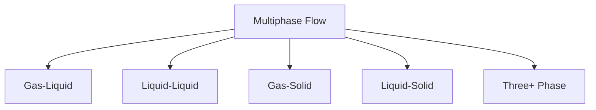

# Multiphase Fundamentals Overview

## Why This Matters for OpenFOAM

> **Multiphase flow is not just "adding another fluid" — it requires fundamentally different modeling approaches**

Understanding multiphase fundamentals is critical for OpenFOAM users because:

- **Solver selection depends on physics** — dispersed flows (bubbles) vs separated flows (free surfaces) require completely different solvers
- **Volume fraction (α) is the core variable** — without understanding α, you cannot set up boundary conditions or initial fields
- **Dimensionless numbers dictate model choice** — Re, Eo, and We determine whether VOF, Euler-Euler, or Lagrangian methods are appropriate

**The key shift**: Move from thinking "one fluid continuum" to "multiple interacting phases" — each phase may need its own momentum equation, properties, and closure models.

---

## Learning Objectives

After completing this module, you will be able to:

- **Classify multiphase systems** by phase combination (gas-liquid, liquid-liquid, etc.) and flow pattern (separated, dispersed, mixed)
- **Understand volume fraction (α)** as the fundamental variable that tracks phase distribution
- **Apply dimensionless numbers** (Reynolds, Eötvös, Weber) to predict flow regime and select appropriate models
- **Distinguish between modeling approaches** — VOF for sharp interfaces vs Euler-Euler for dispersed systems vs Lagrangian for particles
- **Match OpenFOAM solvers** to physical problems (interFoam, multiphaseEulerFoam, DPMFoam, etc.)

---

## Overview

**Multiphase flow** = simultaneous flow of two or more phases (gas, liquid, solid) with interactions between them through interfaces.

### Real-World Examples

| Application | Phases | Challenge |
|-------------|--------|-----------|
| Bubble column | Gas + Liquid | Tracking bubble swarms |
| Oil spill | Oil + Water | Sharp interface dynamics |
| Fluidized bed | Gas + Solid | Particle collisions |
| Blood flow | Plasma + Cells | Cell deformation |

---

## 1. Classification of Multiphase Flows

### 1.1 By Phase Combination



| System | OpenFOAM Solver | Typical Applications |
|--------|-----------------|---------------------|
| Gas-Liquid | interFoam, multiphaseInterFoam | Bubble columns, boiling, free surface |
| Liquid-Liquid | interFoam, multiphaseEulerFoam | Oil-water separation, emulsions |
| Gas-Solid | DPMFoam, MPPICFoam | Fluidized beds, pneumatic transport |
| Liquid-Solid | DPMFoam, twoPhaseEulerFoam | Slurry transport, sedimentation |

### 1.2 By Flow Pattern

| Pattern | Characteristics | OpenFOAM Approach |
|---------|-----------------|-------------------|
| **Separated** | Sharp, continuous interface | VOF (`interFoam`) |
| **Dispersed** | Bubbles/drops/particles distributed | Euler-Euler (`twoPhaseEulerFoam`) or Lagrangian (`DPMFoam`) |
| **Mixed/Transition** | Combination of regimes | Hybrid models |

---

## 2. Fundamental Concepts

### 2.1 Volume Fraction (α)

**The most important variable in multiphase CFD**

$$\alpha_k = \frac{V_k}{V_{total}}, \quad \sum_{k=1}^{n} \alpha_k = 1$$

- **α = 1**: Cell entirely filled with phase k
- **α = 0**: Cell contains no phase k
- **0 < α < 1**: Cell contains interface (in VOF) or mixture (in Euler-Euler)

> **OpenFOAM Implementation**:
> - Volume fraction fields: `alpha.water`, `alpha.air`, `alpha.particles`
> - Located in `0/` directory as boundary and initial conditions
> - Updated via MULES solver in VOF methods
> - Solved via transport equation in Euler-Euler methods

### 2.2 Slip Velocity

Relative velocity between dispersed and continuous phases:

$$\mathbf{u}_{slip} = \mathbf{u}_d - \mathbf{u}_c$$

- **Zero slip**: Phases move together (homogeneous flow)
- **High slip**: Significant phase separation (critical for Euler-Euler closure)

### 2.3 Interfacial Area Density

$$a_i = \frac{A_{interface}}{V_{cell}}$$

For spherical particles/drops of diameter d:

$$a_i = \frac{6\alpha_d}{d}$$

> **OpenFOAM Implementation**:
> - Computed field in Euler-Euler solvers
> - Used in mass/heat transfer correlations
> - Appears in `phaseProperties` dictionary

---

## 3. Dimensionless Numbers for Solver Selection

These numbers determine which modeling approach is appropriate.

| Number | Formula | Physical Meaning | Solver Implication |
|--------|---------|------------------|-------------------|
| **Reynolds** | $\frac{\rho U d}{\mu}$ | Inertia / Viscosity | High Re → Turbulence modeling needed |
| **Eötvös** | $\frac{\Delta\rho g d^2}{\sigma}$ | Buoyancy / Surface Tension | Low Eo → spherical drops (VOF suitable) |
| **Weber** | $\frac{\rho U^2 d}{\sigma}$ | Inertia / Surface Tension | High We → interface breakup (Euler-Euler better) |
| **Stokes** | $\frac{\rho_d d^2 U}{18\mu_c L}$ | Particle response time | Low St → particles follow flow (Lagrangian efficient) |

> **OpenFOAM Implementation Context**:
> - **Low Weber, distinct interface**: Use `interFoam` (VOF method)
> - **High Weber, dispersed**: Use `multiphaseEulerFoam` (Euler-Euler)
> - **Low Stokes, dilute**: Use `DPMFoam` (Lagrangian particle tracking)

---

## 4. Modeling Approaches

### 4.1 Eulerian Specification

All phases treated as interpenetrating continua. Each phase occupies fraction α of each cell.

**Key features**:
- Separate momentum equation for each phase
- Requires closure models for interphase forces
- Suitable for dense dispersions

### 4.2 Lagrangian Specification

Dispersed phase tracked as discrete particles. Continuous phase is Eulerian.

**Key features**:
- Particles have position, velocity, mass
- No grid for dispersed phase
- Suitable for dilute systems (< 10% volume fraction)

### 4.3 Volume of Fluid (VOF)

Single-fluid formulation with interface captured by α field.

**Key features**:
- Sharp interface representation
- One set of momentum equations
- Surface tension via continuum surface force (CSF)

---

## 5. OpenFOAM Solver Selection Guide

| Solver | Method | Phases | Typical Use Cases |
|--------|--------|--------|-------------------|
| `interFoam` | VOF | 2 incompressible | Free surface, dam break, sloshing |
| `multiphaseInterFoam` | VOF | N incompressible | Multiple immiscible liquids |
| `interIsoFoam` | VOF | 2 | Compressive VOF, sharper interface |
| `twoPhaseEulerFoam` | Euler-Euler | 2 | Bubbly flows, boiling |
| `multiphaseEulerFoam` | Euler-Euler | N | Multiple dispersed phases |
| `compressibleInterFoam` | VOF | 2 compressible | High-speed gas-liquid |
| `DPMFoam` | Lagrangian-Euler | Gas + particles | Dilute particle transport |
| `MPPICFoam` | Lagrangian-Euler | Gas + particles | Dense particle flows |

> **OpenFOAM Implementation**:
> ```cpp
> // Property files differ by method:
> // VOF: constant/transportProperties (sigma, rho, mu for each phase)
> // Eulerian: constant/phaseProperties (dispersedPhase, continuousPhase)
> // Lagrangian: constant/kinematicCloudProperties (particle model)
> ```

---

## Quick Reference: Core Concepts

| Concept | Definition | OpenFOAM Relevance |
|---------|------------|-------------------|
| **α (volume fraction)** | Fraction of cell volume occupied by phase | Primary field in `0/` directory |
| **Interphase forces** | Drag, lift, virtual mass, wall lubrication | Defined in `phaseProperties` or via coded models |
| **Closure models** | Turbulence, mass/heat transfer correlations | Required for Reynolds-averaged Euler-Euler |
| **Surface tension** | Force at interface due to molecular cohesion | `sigma` in transportProperties; CSF model |
| **Phase properties** | Density, viscosity, thermal conductivity | Per-phase dictionaries in property files |

---

## Concept Check

<details>
<summary><b>1. Why must Σα = 1?</b></summary>

Every cell must be completely filled by phases — the sum of all phase fractions equals the total volume. In OpenFOAM, this constraint is enforced during the α solution (MULES for VOF, bounded solvers for Euler-Euler).
</details>

<details>
<summary><b>2. How does VOF differ from Euler-Euler?</b></summary>

- **VOF**: Tracks sharp interface (resolved geometrically), uses one-fluid formulation, best for separated flows
- **Euler-Euler**: Tracks volume fraction (statistically averaged), solves separate momentum for each phase, best for dispersed flows where interface topology is too complex to resolve
</details>

<details>
<summary><b>3. Why are closure models required in Euler-Euler but not VOF?</b></summary>

Averaging in Euler-Euler loses information about local phase distribution → must use models to represent interphase forces (drag, lift, virtual mass). VOF resolves the interface directly (though it still needs surface tension model).
</details>

<details>
<summary><b>4. When should you use Lagrangian instead of Euler-Euler?</b></summary>

Use Lagrangian (`DPMFoam`) when:
- Dispersed phase is dilute (α < 0.1)
- Particle history/trajectory matters
- Particle size distribution is wide
- Computational cost is a concern (fewer particles than cells)

Use Euler-Euler when volume fraction is high and two-way coupling is strong.
</details>

---

## Key Takeaways

✅ **Multiphase flow = interacting phases**, not just multiple fluids

✅ **Volume fraction (α)** is the fundamental variable — understanding it is essential for setting up any multiphase case

✅ **Flow regime dictates solver choice**:
   - Separated flows → VOF (`interFoam`)
   - Dispersed flows → Euler-Euler (`multiphaseEulerFoam`) or Lagrangian (`DPMFoam`)

✅ **Dimensionless numbers (Re, Eo, We)** predict which modeling approach is physically appropriate

✅ **Closure models are unavoidable** — averaging requires modeling interphase forces, turbulence, and transfer phenomena

✅ **OpenFOAM provides specialized solvers** for each approach — proper selection starts with physics, not convenience

---

## Related Documents

- **Flow Regimes**: [01_Flow_Regimes.md](01_Flow_Regimes.md)
- **Interfacial Phenomena**: [02_Interfacial_Phenomena.md](02_Interfacial_Phenomena.md)
- **Volume Fraction**: [03_Volume_Fraction_Concept.md](03_Volume_Fraction_Concept.md)
- **VOF Method**: [02_VOF_METHOD/00_Overview.md](02_VOF_METHOD/00_Overview.md)
- **Euler-Euler Method**: [03_EULER_EULER_METHOD/00_Overview.md](03_EULER_EULER_METHOD/00_Overview.md)