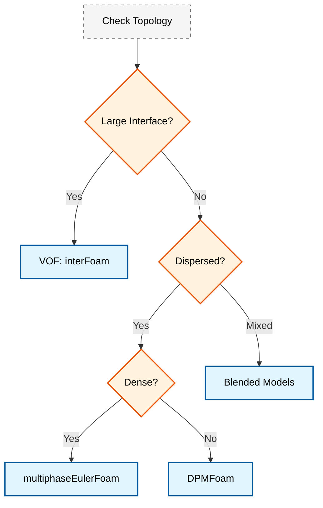

# รูปแบบการไหลหลายเฟส (Multiphase Flow Regimes)

> [!TIP] ทำไม Flow Regimes จึงมีความสำคัญใน OpenFOAM?
> การระบุ Flow Regime ที่ถูกต้องเป็นพื้นฐานที่สำคัญที่สุดก่อนเริ่ม Simulation ทุกครั้ง ถ้าเลือก Solver ผิด เช่น ใช้ VOF กับ Bubbly flow ที่มีฟองนับพันฟอง คอมพิวเตอร์อาจทำงานไม่ได้เลย (คอมพิวเตอร์แฮงก์) หรือใช้ Eulerian-Eulerian กับ Stratified flow ที่ควรใช้ VOF ก็จะได้ผลลัพธ์ที่ไม่แม่นยำ การเข้าใจ Flow Regime จึงเป็นเหมือน "แผนที่เส้นทาง" ที่บอกว่าควรใช้เครื่องมืออะไรในการแก้ปัญหา เพื่อให้การจำลองเสถียร รวดเร็ว และแม่นยำ

## ภาพรวม (Overview)

**Flow regimes** ในการไหลหลายเฟส คือรูปแบบการกระจายตัวของเฟส (phase distribution) และลักษณะทางโทโพโลยีของรอยต่อ (interface topology) ที่เกิดขึ้นตามสภาวะการไหล คุณสมบัติทางกายภาพ และข้อจำกัดทางเรขาคณิต การทำความเข้าใจรูปแบบเหล่านี้เป็นสิ่งสำคัญอย่างยิ่ง (fundamental) ในการเลือกวิธีการจำลอง (modeling approach) และสมการปิด (closure relations) ที่เหมาะสมใน OpenFOAM

> [!INFO] ความสำคัญของ Flow Regimes
> การระบุ Flow regime ที่ถูกต้องกำหนดสิ่งต่อไปนี้:
> - การเลือก Solver (Eulerian-Eulerian vs. VOF vs. Hybrid)
> - การเลือกโมเดลแรงระหว่างเฟส (Drag, Lift, Virtual mass)
> - กลยุทธ์การจำลองความปั่นป่วน (Turbulence modeling)
> - ข้อกำหนดความเสถียรเชิงตัวเลข (Numerical stability)

---

## การแบ่งประเภทตามโทโพโลยีของรอยต่อ (Classification by Interface Topology)

> [!NOTE] **📂 OpenFOAM Context**
> การแบ่งประเภท Flow Regime ตาม Interface Topology นี้เป็นพื้นฐานในการ **เลือก Solver** และ **กำหนดค่าในไฟล์ `constant/phaseProperties`** หรือ **`constant/multiphaseInterFoamProperties`**
> - **Separated Flow:** ใช้ VOF-based solvers เช่น `interFoam`, `multiphaseInterFoam` → ตั้งค่าใน `constant/transportProperties` และ `0/alpha.water`
> - **Dispersed Flow:** ใช้ Eulerian-Eulerian solvers เช่น `multiphaseEulerFoam` → ตั้งค่าใน `constant/phaseProperties` พร้อม Drag/Lift models
> - **โครงสร้างไฟล์:** แต่ละ Solver มีไฟล์ตั้งค่าเฉพาะที่ `constant/` สำหรับนิยามเฟสและคุณสมบัติระหว่างเฟส

การไหลหลายเฟสสามารถแบ่งประเภทพื้นฐานตามลักษณะทางกายภาพของรอยต่อได้ดังนี้:

### 1. การไหลแบบกระจายตัว (Dispersed Flow)

เฟสหนึ่งจะมีลักษณะต่อเนื่อง (Continuous) ในขณะที่อีกเฟสหนึ่งจะกระจายตัวเป็นองค์ประกอบย่อยๆ (Dispersed elements) เช่น ฟองอากาศ (bubbles), หยดของเหลว (droplets) หรืออนุภาค (particles)

**ลักษณะเฉพาะ (Characteristics):**
- มีความแตกต่างชัดเจนระหว่างเฟสต่อเนื่องและเฟสที่กระจายตัว
- องค์ประกอบของเฟสที่กระจายตัวมีสเกลความยาว (length scales) ที่เฉพาะตัว
- ความหนาแน่นของพื้นที่รอยต่อ (Interfacial area density) สามารถนิยามได้ชัดเจน

**ตัวอย่าง:**
- **Bubbly flow:** ฟองก๊าซในของเหลว
- **Droplet flow:** หยดของเหลวในก๊าซ
- **Fluidized beds:** อนุภาคของแข็งในก๊าซ

**แนวทางการจำลอง:**
- **Eulerian-Eulerian** (สำหรับความเข้มข้นหนาแน่น)
- **Eulerian-Lagrangian** (สำหรับความเข้มข้นเจือจาง)

### 2. การไหลแบบแยกชั้น (Separated Flow)

แต่ละเฟสจะถูกแยกออกจากกันด้วยรอยต่อที่มีขนาดใหญ่และต่อเนื่องชัดเจน

**ลักษณะเฉพาะ (Characteristics):**
- มีรอยต่อ (Interface) เดียวที่นิยามได้ชัดเจน
- รูปร่างของรอยต่อถูกกำหนดโดยความสมดุลของแรงต่างๆ
- สามารถเกิดการเสียรูปของรอยต่อขนาดใหญ่ได้

**ตัวอย่าง:**
- **Stratified flow:** การไหลแบบแยกชั้นในท่อแนวนอน
- **Annular flow:** การไหลแบบวงแหวนในท่อแนวตั้ง
- **Free surface flows:** การไหลที่มีผิวอิสระ

**แนวทางการจำลอง:**
- **Volume of Fluid (VOF):** เช่น `interFoam`, `multiphaseInterFoam`

### 3. การไหลแบบเปลี่ยนผ่าน (Transitional Flow)

เป็นสภาวะที่มีทั้งการไหลแบบกระจายตัวและแบบแยกชั้นเกิดขึ้นพร้อมกัน ซึ่งเป็นรูปแบบที่จำลองได้ยากที่สุด

**ตัวอย่าง:**
- **Slug flow:** ฟองก๊าซขนาดใหญ่ (Taylor bubbles) คั่นด้วยช่วงของเหลว
- **Churn flow:** การไหลที่มีความปั่นป่วนและสับสนสูง

---

## รูปแบบการไหลในท่อ (Flow Regimes in Pipe Flow)

> [!NOTE] **📂 OpenFOAM Context**
> การจำลอง Flow Regimes ในท่อต้อง **กำหนด Boundary Conditions** ในไฟล์ `0/` ที่เหมาะสมกับรูปแบบการไหล:
> - **Inlet Conditions:** ใช้ `fixedValue` สำหรับ `U` (velocity) และ `alpha` (phase fraction) เพื่อสร้าง Flow regime ที่ต้องการ ใน `0/U` และ `0/alpha.water`
> - **Gravity:** กำหนดใน `constant/g` เพื่อให้แรงโน้มถ่วงทำงานตามท่อแนวตั้งหรือแนวนอน
> - **Mesh Resolution:** ใช้ `blockMeshDict` หรือ `snappyHexMeshDict` เพื่อสร้าง mesh ที่ละเอียดพอที่จะจับฟองหรือรอยต่อได้
> - **Time Step:** ใช้ `adjustTimeStep` ใน `system/controlDict` เพื่อควบคุม Courant Number สำหรับความเสถียร

### 1. การไหลในท่อแนวตั้ง (Vertical Pipe Flow)

| รูปแบบ (Regime) | ลักษณะเฉพาะ | สภาวะการเกิด | โครงสร้าง |
|----------------|-------------|--------------|------------|
| **Bubbly Flow** | ฟองก๊าซขนาดเล็กกระจายตัวในของเหลว | สัดส่วนก๊าซต่ำ, ความเร็วของเหลวปานกลาง | ฟองก๊าซทรงกลมหรือเสียรูป |
| **Slug Flow** | ฟองก๊าซขนาดใหญ่รูปกระสุน (Taylor bubbles) | ท่อแนวตั้งหรือท่อเอียง, ความเร็วปานกลางถึงสูง | ฟองก๊าซสามมิติที่ซับซ้อน |
| **Churn Flow** | การไหลที่สับสนและสั่นไหว | ความเร็วก๊าซสูง, เป็นช่วงเปลี่ยนผ่าน | โครงสร้างที่ไม่สม่ำเสมอ |
| **Annular Flow** | ก๊าซอยู่ตรงกลาง ของเหลวเป็นฟิล์มเกาะผนัง | ความเร็วก๊าซสูงมาก, สัดส่วนของเหลวต่ำ | แกนก๊าซ + ชั้นฟิล์มของเหลว |

### 2. การไหลในท่อแนวนอน (Horizontal Pipe Flow)

| รูปแบบ (Regime) | ลักษณะเฉพาะ | สภาวะการเกิด | โครงสร้าง |
|----------------|-------------|--------------|------------|
| **Stratified Flow** | แยกชั้นตามแรงโน้มถ่วง (ของเหลวอยู่ล่าง) | ท่อแนวนอนหรือท่อเอียงเล็กน้อย | รอยต่อชัดเจนแยกเฟส |
| **Wavy Flow** | เกิดคลื่นที่รอยต่อระหว่างเฟส | ความเร็วก๊าซปานกลาง | รอยต่อที่มีคลื่น |
| **Slug Flow** | ช่วงก๊าซขนาดใหญ่สลับกับช่วงของเหลว | ความเร็วปานกลาง | โครงสร้างที่ซับซ้อน |
| **Annular Flow** | ของเหลวเกาะผนังท่อเป็นวงแหวน | ความเร็วก๊าซสูงมาก | แกนก๊าซ + ชั้นฟิล์มของเหลว |

<!-- IMAGE: IMG_04_005 -->
<!-- 
Purpose: เพื่อแสดงวิวัฒนาการของ Flow Regimes ในท่อตั้งเมื่อความเร็วแก๊สเพิ่มขึ้น. ภาพนี้ต้องสื่อให้เห็นการเปลี่ยนแปลง "Topology" ของ Interface อย่างชัดเจน: จากฟองเล็กๆ (Dispersed) -> รวมตัวเป็นก้อนใหญ่ (Slug) -> แตกตัวจนปั่นป่วน (Churn) -> แยกชั้นสมบูรณ์ (Annular)
Prompt: "Technical Illustration of Vertical Gas-Liquid Flow Regimes. **Composition:** Four vertical pipe sections arranged side-by-side. **1. Bubbly Flow:** Small, spherical air bubbles (white) uniformly distributed in liquid (blue). **2. Slug Flow:** Large bullet-shaped 'Taylor Bubbles' occupying most of the pipe cross-section. **3. Churn Flow:** Chaotic, distorted large bubbles, highly turbulent interface (neither slug nor annular). **4. Annular Flow:** A continuous gas core in the center, with a thin liquid film clinging to the walls. **Labels:** Arrow at the bottom indicating 'Increasing Gas Velocity $\rightarrow$'. STYLE: Realistic engineering conceptual art, cut-away view inside the pipes, deep blue liquid vs bright white gas, high contrast."
-->
![[IMG_04_005.jpg]]

[Diagram: การแสดงภาพรูปแบบการไหลทั้งสี่ในท่อแนวตั้ง]

---

## ปัจจัยที่ส่งผลต่อรูปแบบการไหล (Factors Affecting Flow Regimes)

> [!NOTE] **📂 OpenFOAM Context**
> ปัจจัยที่ส่งผลต่อ Flow Regimes ต้อง **กำหนดในไฟล์คุณสมบัติ (Property Files)** และ **Transport Models**:
> - **Physical Properties:** กำหนดความหนาแน่น (`rho`), ความหนืด (`nu`), และแรงตึงผิว (`sigma`) ใน `constant/transportProperties` หรือ `constant/phaseProperties`
> - **Interfacial Forces:** ใช้ Drag/Lift/Virtual Mass models ใน `constant/phaseProperties` สำหรับ Eulerian-Eulerian solvers
> - **Turbulence Modeling:** เลือก turbulence model ใน `constant/turbulenceProperties` ซึ่งส่งผลต่อ flow regime transitions
> - **Surface Tension:** กำหนดใน VOF solvers ผ่านคำสั่ง `sigma` ใน `constant/transportProperties`

การเปลี่ยนแปลงระหว่างรูปแบบการไหลขึ้นอยู่กับปัจจัยหลักหลายประการ:

### 1. ความเร็วสัมพัทธ์ระหว่างเฟส (Relative Phase Velocities)

ความเร็วที่แตกต่างกันของเฟสต่างๆ ส่งผลต่อแรงฉุดลากและโครงสร้างรอยต่อ

### 2. คุณสมบัติทางกายภาพ (Physical Properties)

- **ความหนาแน่น (Density):** ความแตกต่างของความหนาแน่นส่งผลต่อแรงลอยตัว
- **ความหนืด (Viscosity):** ความหนืดสัมพัทธ์ของเฟสต่างๆ
- **แรงตึงผิว (Surface Tension):** กำหนดรูปร่างของฟองและหยด

### 3. การวางแนวของท่อ (Pipe Orientation)

แรงโน้มถ่วงส่งผลต่างกันในท่อแนวตั้งเทียบกับท่อแนวนอน

### 4. ขนาดและรูปร่างของท่อ (Pipe Size and Geometry)

อัตราส่วนขนาดส่งผลต่อการพัฒนารูปแบบการไหล

### 5. สภาพที่ขอบเขต (Boundary Conditions)

เงื่อนไขบนผนังท่อและจุดเริ่มต้นของการไหล

---

## เกณฑ์การเปลี่ยนรูปแบบ (Regime Transition Criteria)

> [!NOTE] **📂 OpenFOAM Context**
> ตัวเลขไร้มิติและเกณฑ์การเปลี่ยนรูปแบบสามารถ **คำนวณและตรวจสอบได้ผ่าน functionObjects** ใน `system/controlDict`:
> - **Void Fraction Monitoring:** ใช้ `probes` หรือ `sampledSurface` functionObjects เพื่อติดตามค่า `alpha` และตรวจสอบ regime transition ใน `system/controlDict`
> - **Reynolds/Froude Numbers:** คำนวณผ่าน `coded` หรือ `expressionField` functionObjects เพื่อ monitor ค่าจำนวนไร้มิติ
> - **Field Averaging:** ใช้ `fieldAverage` functionObject เพื่อคำนวณค่าเฉลี่ยของ phase fraction และ velocity fields
> - **Custom Regime Detection:** เขียน `coded` functionObject เพื่อตรวจจับ regime transitions อัตโนมัติ

การเปลี่ยนรูปแบบถูกกำหนดด้วยตัวเลขไร้มิติและพารามิเตอร์ต่างๆ:

### 1. Superficial Velocities (ความเร็วเชิงเทียบ)

$$U_{sg} = \frac{Q_g}{A}, \quad U_{sl} = \frac{Q_l}{A}$$

โดยที่:
- $U_{sg}$ = ความเร็วเชิงเทียบของก๊าซ (superficial gas velocity)
- $U_{sl}$ = ความเร็วเชิงเทียบของของเหลว (superficial liquid velocity)
- $Q_g$, $Q_l$ = อัตราการไหลของก๊าซและของเหลว
- $A$ = พื้นที่หน้าตัดท่อ

### 2. Void Fraction ($\alpha$)

เศษส่วนปริมาตรของก๊าซ:
- $\alpha < 0.25$: มักเป็น Bubbly flow
- $0.25 < \alpha < 0.75$: สามารถเป็น Slug หรือ Churn flow
- $\alpha > 0.75$: มักเป็น Annular flow

### 3. Froude Number (Fr)

$$Fr = \frac{U}{\sqrt{gD}}$$

ความสำคัญของแรงเฉื่อยต่อแรงโน้มถ่วง:
- $Fr < 1$: การไหลแบบ Subcritical (มีอิทธิพลจากแรงโน้มถ่วงมาก)
- $Fr > 1$: การไหลแบบ Supercritical (แรงเฉื่อยมีอิทธิพลมากกว่า)

### 4. Reynolds Number (Re)

$$Re = \frac{\rho U D}{\mu}$$

ใช้ในการพิจารณาลักษณะของการไหล (laminar vs turbulent)

---

## แผนที่รูปแบบการไหล (Flow Regime Maps)

> [!NOTE] **📂 OpenFOAM Context**
> แผนที่รูปแบบการไหลใช้เป็น **เกณฑ์ในการเลือก Solver และตั้งค่าเริ่มต้น** ก่อนเริ่ม Simulation:
> - **Solver Selection:** ใช้ regime map เพื่อเลือก solver ที่เหมาะสม (VOF vs. Eulerian-Eulerian) ก่อนสร้าง case
> - **Parameter Initialization:** ใช้ค่าจาก regime map เพื่อประเมินค่าเริ่มต้นของ velocity inlet และ phase fraction ใน `0/` directory
> - **Validation Framework:** เปรียบเทียบผลลัพธ์ Simulation กับ regime maps ที่เป็นที่รู้จักเพื่อ validation
> - **Case Setup Planning:** ใช้ regime map เพื่อวางแผนขนาด mesh, time step และระยะเวลา simulation ที่เหมาะสม

แผนที่รูปแบบการไหลเป็นเครื่องมือสำคัญในการทำนายรูปแบบการไหลตามเงื่อนไขการทำงาน

### แผนที่รูปแบบการไหลสำหรับท่อแนวตั้ง

| รูปแบบ (Regime) | ลักษณะ | เงื่อนไขความเร็ว |
|----------------|-------------|--------------|
| **Stratified Flow** | การไหลแบบแยกชั้น | ความเร็วต่ำ |
| **Slug Flow** | คลื่นขนาดใหญ่ | ความเร็วปานกลาง |
| **Annular Flow** | ชั้นของเหลวบางๆ บนผนัง | ความเร็วก๊าซสูง |

### แผนที่รูปแบบการไหลสำหรับท่อแนวนอน

| รูปแบบ (Regime) | ลักษณะ | เงื่อนไขความเร็วก๊าซ |
|----------------|-------------|--------------|
| **Bubbly Flow** | ฟองขนาดเล็ก | ความเร็วก๊าซต่ำ |
| **Slug Flow** | ฟองขนาดใหญ่ | ความเร็วก๊าซปานกลาง |
| **Annular Flow** | ฟิล์มของเหลวบนผนัง | ความเร็วก๊าซสูง |

---

## การนำไปใช้ใน OpenFOAM

> [!NOTE] **📂 OpenFOAM Context**
> การนำแนวคิด Flow Regime ไปใช้ใน OpenFOAM เกี่ยวข้องกับ **การเลือกและตั้งค่า Solver** ตามหมวดหมู่:
> - **Solver Selection:** เลือกระหว่าง `interFoam`, `multiphaseInterFoam` (VOF), `multiphaseEulerFoam` (Eulerian-Eulerian), หรือ `DPMFoam` (Lagrangian) ตาม regime ที่วินิจฉัย
> - **Property Files:** ตั้งค่า `constant/phaseProperties` สำหรับ Eulerian solvers หรือ `constant/transportProperties` สำหรับ VOF solvers
> - **Numerical Schemes:** กำหนด `divSchemes` และ `laplacianSchemes` ใน `system/fvSchemes` ให้เหมาะกับ interface capturing (เช่น `Gauss vanLeer` สำหรับ VOF)
> - **Solution Control:** ปรับ `PIMPLE` settings ใน `system/fvSolution` สำหรับความเสถียรของ multiphase flow

### กลยุทธ์การเลือก Solver



### การใช้โมเดลแบบผสม (Blended Interfacial Models)

ในกรณีที่รูปแบบการไหลมีการเปลี่ยนแปลง OpenFOAM ใช้ `BlendedInterfacialModel` เพื่อเปลี่ยนผ่านระหว่างโมเดลอย่างราบรื่น

```cpp
// Structure of Blended Interfacial Model
// Smoothly transition from bubbly to separated model based on phase fraction
tmp<volScalarField> K() const
{
    // Calculate blended drag coefficient using weighted combination
    // blendingFactor() varies between 0 (separated) and 1 (bubbly)
    return blendingFactor()*modelBubbly->K()
         + (1 - blendingFactor())*modelSeparated->K();
}
```

**📂 Source:** `.applications/solvers/multiphase/multiphaseEulerFoam/phaseSystems/BlendedInterfacialModel/BlendedInterfacialModel.C`

**คำอธิบาย (Explanation):**
โค้ดนี้แสดงการทำงานของ Blended Interfacial Model ใน OpenFOAM ซึ่งเป็นกลไกสำคัญในการจำลองรูปแบบการไหลที่เปลี่ยนผ่านระหว่างสภาวะต่างๆ เช่น จาก Bubbly flow ไปเป็น Separated flow โดยใช้ฟังก์ชันการผสม (blending function) เพื่อคำนวณสัมประสิทธิ์แรงระหว่างเฟส (เช่น drag coefficient) ที่เปลี่ยนไปตามเศษส่วนของเฟส (phase fraction)

**แนวคิดสำคัญ (Key Concepts):**
- **Blending Factor:** ตัวเลขระหว่าง 0-1 ที่กำหนดสัดส่วนของแต่ละโมเดล โดย 1 หมายถึงใช้โมเดล Bubbly flow เต็มที่ และ 0 หมายถึงใช้โมเดล Separated flow เต็มที่
- **Model Bubbly vs. Model Separated:** โมเดลสำหรับรูปแบบการไหลที่แตกต่างกัน โดย Bubbly model ใช้สำหรับฟองกระจายตัว ส่วน Separated model ใช้สำหรับรอยต่อขนาดใหญ่
- **Smooth Transition:** การเปลี่ยนผ่านแบบต่อเนื่องช่วยหลีกเลี่ยงปัญหาความไม่เสถียรเชิงตัวเลขที่อาจเกิดจากการเปลี่ยนโมเดลแบบกระทันหัน

### การตรวจจับรูปแบบการไหล (Flow Regime Detection)

OpenFOAM มีกลไกในการตรวจจับรูปแบบการไหลเฉพาะที่:

```cpp
// Detect interface through void fraction gradient
volVectorField voidFractionGrad = fvc::grad(alpha1);

// Calculate curvature for surface tension forces
surfaceScalarField curvature = fvc::div(nHat);

// Phase topology indicator for flow regime classification
volScalarField regimeIndicator = calculateRegime(alpha1, U1, U2);
```

**📂 Source:** `.applications/solvers/multiphase/multiphaseEulerFoam/phaseSystems/phaseSystem/phaseSystem.C`

**คำอธิบาย (Explanation):**
โค้ดนี้แสดงเทคนิคการตรวจจับและจำแนกรูปแบบการไหลใน OpenFOAM โดยใช้ค่าความชันของเศษส่วนของช่องว่าง (void fraction gradient) เพื่อระบุตำแหน่งของรอยต่อ และคำนวณความโค้ง (curvature) สำหรับแรงตึงผิว ส่วน `regimeIndicator` เป็นตัวแปรที่คำนวณจากหลายพารามิเตอร์เพื่อจำแนกประเภทของรูปแบบการไหล

**แนวคิดสำคัญ (Key Concepts):**
- **Void Fraction Gradient:** ความชันของเศษส่วนปริมาตรของเฟสบอกตำแหน่งและความหนาของรอยต่อ ซึ่งช่วยแยกแยะระหว่าง dispersed flow (มี gradient สูงหลายจุด) กับ separated flow (มี gradient สูงเพียงชั้นเดียว)
- **Curvature Calculation:** ความโค้งของรอยต่อใช้ในการคำนวณแรงตึงผิว (surface tension force) ซึ่งมีความสำคัญในรูปแบบการไหลที่มีฟองหรือหยด
- **Regime Indicator:** ตัวบ่งชี้ที่คำนวณจาก phase fraction, velocity และคุณสมบัติอื่นๆ เพื่อจำแนกประเภทของรูปแบบการไหลโดยอัตโนมัติ

### การเลือก Solver ตามรูปแบบการไหล

| รูปแบบการไหล | Solver ที่เหมาะสม | เหตุผล |
|--------------|------------------|---------|
| **Separated (Stratified/Annular)** | `interFoam`, `multiphaseInterFoam` | VOF methods เหมาะสำหรับรอยต่อขนาดใหญ่ที่ชัดเจน |
| **Dispersed Dense (Bubbly/Particle)** | `multiphaseEulerFoam` | Eulerian-Eulerian สำหรับความเข้มข้นสูง |
| **Dispersed Dilute** | `DPMFoam`, `reactingParcelFoam` | Eulerian-Lagrangian สำหรับอนุภาคเจือจาง |
| **Transitional (Slug/Churn)** | `multiphaseEulerFoam` พร้อม Blended Models | ต้องการโมเดลแบบผสม |

### ตัวอย่างการตั้งค่าใน OpenFOAM

```cpp
// Example: Define multiphase model in OpenFOAM
phases (water air);

// Define blending function for regime-dependent models
blending
{
    type    table;
    values  (0 0.1 0.5 0.9 1);
}
```

**📂 Source:** `.applications/solvers/multiphase/multiphaseEulerFoam/phaseSystems/PhaseSystems/MomentumTransferPhaseSystem/MomentumTransferPhaseSystem.C`

**คำอธิบาย (Explanation):**
โค้ดนี้แสดงตัวอย่างการตั้งค่าระบบหลายเฟสใน OpenFOAM โดยระบุเฟสที่เกี่ยวข้อง (water และ air) และกำหนดฟังก์ชันการผสม (blending function) สำหรับโมเดลที่ขึ้นกับรูปแบบการไหล (regime-dependent models) ค่าในตาราง `values` กำหนดจุดข้อมูลสำหรับการปรับเปลี่ยนสัดส่วนของโมเดลต่างๆ ตามสภาวะการไหล

**แนวคิดสำคัญ (Key Concepts):**
- **Phase Definition:** การระบุเฟสที่เข้าร่วมในระบบเป็นขั้นตอนแรกในการตั้งค่าปัญหาหลายเฟส
- **Blending Function:** ฟังก์ชันที่กำหนดวิธีการผสมโมเดลต่างๆ โดยปกติใช้ค่า phase fraction หรือตัวแปรอื่นเป็นพารามิเตอร์
- **Table Interpolation:** ค่าในตารางใช้สำหรับการประเมินค่า blending factor ผ่านการ interpolation ซึ่งช่วยให้สามารถปรับแต่งการเปลี่ยนผ่านระหว่างโมเดลได้อย่างละเอียด

---

## ความท้าทายและข้อควรพิจารณา (Challenges and Considerations)

> [!NOTE] **📂 OpenFOAM Context**
> ความท้าทายในการจำลอง Flow Regimes สามารถ **จัดการผ่านการตั้งค่าและเทคนิคต่างๆ**:
> - **Numerical Stability:** ใช้ `maxCo` (Courant number) ใน `system/controlDict` และเลือก `divSchemes` ที่เหมาะสม (เช่น `Gauss MUSCL` หรือ `Gauss vanLeerV`) เพื่อลบปัญหา instability
> - **Mesh Refinement:** ใช้ `refinementRegions` ใน `snappyHexMeshDict` เพื่อเพิ่มความละเอียดบริเวณ interface หรือใช้ `dynamicRefineFvMesh` สำหรับ adaptive mesh refinement
> - **Computational Cost:** ปรับ `writeInterval` และ `purgeWrite` ใน `system/controlDict` เพื่อจัดการ disk space, ใช้ `decomposePar` สำหรับ parallel processing
> - **Blended Models:** ตั้งค่า `blending` ใน `constant/phaseProperties` เพื่อให้ model ปรับตาม regime โดยอัตโนมัติ

### ความท้าทายในการจำลองรูปแบบการไหล

> [!WARNING] ความท้าทายที่สำคัญ
> - **การเปลี่ยนผ่านรูปแบบ (Regime Transition):** การเปลี่ยนจากรูปแบบหนึ่งไปอีกรูปแบบหนึ่งเป็นไปอย่างต่อเนื่อง ทำให้ยากต่อการระบุขอบเขตที่ชัดเจน
> - **ความไม่เสถียรเชิงตัวเลข (Numerical Instability):** รูปแบบการไหลบางประเภท (เช่น Slug flow) มีความผันผวนสูง ต้องการ mesh ละเอียดและ time step เล็ก
> - **ความต้องการทรัพยากร (Computational Cost):** การจำลองแบบ 3D แบบชั่วขณะของรูปแบบการไหลที่ซับซ้อนใช้ทรัพยากรสูง

### แนวทางการแก้ปัญหา

1. **การใช้โมเดลแบบผสม (Blended Models):** เปลี่ยนผ่านอย่างราบรื่นระหว่างโมเดลต่างๆ ตามสภาวะการไหล
2. **การปรับค่าพารามิเตอร์ (Parameter Tuning):** ปรับสัมประสิทธิ์ drag, lift และ virtual mass ให้เหมาะสมกับรูปแบบการไหล
3. **การตรวจสอบความถูกต้อง (Validation):** เปรียบเทียบผลลัพธ์กับข้อมูลการทดลองหรือแผนที่รูปแบบการไหลที่เป็นที่รู้จัก

---

## สรุป (Summary)

การระบุและเข้าใจรูปแบบการไหลหลายเฟสเป็นกุญแจสำคัญในการจำลองที่ประสบความสำเร็จ:

1. **การแบ่งประเภท:** แบ่งเป็น Dispersed, Separated, และ Transitional ตามโทโพโลยีของรอยต่อ
2. **รูปแบบในท่อ:** Bubbly, Slug, Churn, Annular, Stratified ขึ้นอยู่กับการวางแนวและความเร็ว
3. **ตัวเลขไร้มิติ:** Froude, Reynolds, Void fraction ช่วยทำนายการเปลี่ยนรูปแบบ
4. **การเลือก Solver:** VOF สำหรับ separated, Eulerian-Eulerian สำหรับ dispersed dense, Lagrangian สำหรับ dispersed dilute
5. **Blended Models:** สำคัญสำหรับรูปแบบการไหลที่เปลี่ยนผ่าน

การระบุรูปแบบการไหลที่ถูกต้องและการเลือก Solver ที่เหมาะสมเป็นกุญแจสำคัญสู่ความสำเร็จในการจำลองการไหลหลายเฟสด้วย OpenFOAM

---

## 🧠 Concept Check: ทดสอบความเข้าใจ

1.  **Slug Flow มีลักษณะอย่างไรและทำไมถึงจำลองยาก?**
    <details>
    <summary>เฉลย</summary>
    Slug Flow มีลักษณะเป็นฟองก๊าซขนาดใหญ่ (Taylor bubbles) สลับกับปลั๊กของเหลว เป็นการไหลแบบกึ่งแยกตัวกึ่งผสม (Transitional/Intermittent) ความยากอยู่ที่ความไม่เสถียร (Unsteadiness) และการเปลี่ยนไปมาระหว่างเฟสต่อเนื่องและเฟสแยกตัวที่รวดเร็ว
    </details>

2.  **Blended Interfacial Model ใน OpenFOAM มีความสำคัญอย่างไร?**
    <details>
    <summary>เฉลย</summary>
    ช่วยให้ Solver สามารถเปลี่ยนสูตรการคำนวณแรง (เช่น Drag model) ได้อย่างราบรื่นตามสัดส่วนเฟส ($\alpha$) เช่น ใช้สูตรสำหรับฟองเมื่อ $\alpha$ ต่ำ และเปลี่ยนเป็นสูตรสำหรับผิวอิสระเมื่อ $\alpha$ สูง ทำให้จำลองเคสที่มีหลาย Flow regime ปนกันได้โดยไม่เกิด Numerical instability
    </details>

3.  **ถ้าต้องการจำลอง "น้ำไหลในท่อระบายน้ำทิ้ง" (Stratified Flow) ควรใช้ Solver ตัวไหน?**
    <details>
    <summary>เฉลย</summary>
    ควรใช้ **`interFoam`** หรือ **`multiphaseInterFoam`** (VOF method) เพราะมีผิวรอยต่อระหว่างน้ำและอากาศที่ชัดเจนและแยกออกจากกัน (Separated flow) ไม่ได้ปะปนกันเป็นเนื้อเดียวเหมือน Bubbly flow
    </details>

---

## 📖 เอกสารที่เกี่ยวข้อง

*   **บทก่อนหน้า**: [00_Overview.md](00_Overview.md)
*   **บทถัดไป**: [02_Interfacial_Phenomena.md](02_Interfacial_Phenomena.md)