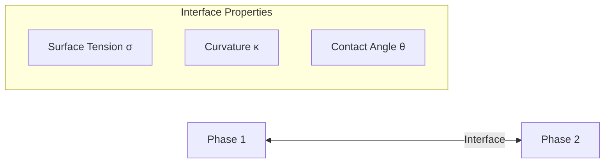

# Interfacial Phenomena

ปรากฏการณ์ที่ผิวสัมผัสระหว่างเฟส

---

## Overview

> **Interface** = บริเวณที่เฟสสองเฟสมาพบกัน — ควบคุม mass, momentum, และ energy transfer



---

## 1. Surface Tension

### Definition

$$\sigma = \frac{F}{L} = \frac{\text{Force}}{\text{Length}}$$

| Quantity | Unit |
|----------|------|
| σ (surface tension) | N/m หรือ J/m² |

### Physical Origin

- โมเลกุลที่ผิวมี **net inward force** เพราะไม่มีโมเลกุลด้านบน
- ผิวพยายาม **minimize area** → ฟองเป็นทรงกลม

### Typical Values

| System | σ (N/m) |
|--------|---------|
| Water-Air (20°C) | 0.073 |
| Mercury-Air | 0.486 |
| Oil-Water | 0.02-0.05 |

### OpenFOAM Setting

```cpp
// constant/transportProperties
sigma   [1 0 -2 0 0 0 0] 0.072;
```

---

## 2. Young-Laplace Equation

$$\Delta p = \sigma \left(\frac{1}{R_1} + \frac{1}{R_2}\right) = \sigma \kappa$$

| Variable | Meaning |
|----------|---------|
| Δp | Pressure jump across interface |
| R₁, R₂ | Principal radii of curvature |
| κ | Mean curvature |

### Special Cases

| Shape | Curvature |
|-------|-----------|
| Sphere (radius R) | κ = 2/R |
| Cylinder (radius R) | κ = 1/R |
| Flat surface | κ = 0 |

---

## 3. Capillary Number

$$Ca = \frac{\mu U}{\sigma}$$

| Ca Range | Behavior |
|----------|----------|
| Ca << 1 | Surface tension dominates |
| Ca >> 1 | Viscous forces dominate |

---

## 4. Contact Angle

### Young's Equation

$$\cos\theta = \frac{\sigma_{SG} - \sigma_{SL}}{\sigma_{LG}}$$

| θ Range | Wettability |
|---------|-------------|
| θ < 90° | Hydrophilic |
| θ > 90° | Hydrophobic |
| θ ≈ 0° | Complete wetting |

### OpenFOAM Boundary Condition

```cpp
// 0/alpha.water
wall
{
    type            constantAlphaContactAngle;
    theta0          70;        // Contact angle in degrees
    limit           gradient;
    value           uniform 0;
}
```

---

## 5. Marangoni Effect

$$\tau_M = \frac{\partial \sigma}{\partial T} \nabla_s T$$

- **Temperature gradient** บนผิว → **surface tension gradient** → **flow**
- สำคัญใน: welding, crystal growth, microfluidics

---

## 6. Dimensionless Numbers

| Number | Formula | Meaning |
|--------|---------|---------|
| Weber | $We = \frac{\rho U^2 L}{\sigma}$ | Inertia vs surface tension |
| Eötvös | $Eo = \frac{\Delta\rho g L^2}{\sigma}$ | Buoyancy vs surface tension |
| Capillary | $Ca = \frac{\mu U}{\sigma}$ | Viscous vs surface tension |
| Bond | $Bo = Eo$ | Same as Eötvös |

### Bubble Shape Regimes

| Eo | Shape |
|----|-------|
| < 1 | Spherical |
| 1-10 | Ellipsoidal |
| > 10 | Cap/Wobbling |

---

## 7. Surface Tension in OpenFOAM

### CSF Model (Continuum Surface Force)

$$\mathbf{F}_\sigma = \sigma \kappa \nabla \alpha$$

```cpp
// constant/transportProperties
phases (water air);

sigma
(
    (water air) 0.072
);
```

### interFoam Implementation

```cpp
// Surface tension force
surfaceForce = fvc::interpolate(sigmaK)*fvc::snGrad(alpha);
```

---

## 8. Interface Tracking Methods

| Method | Approach | Pros | Cons |
|--------|----------|------|------|
| VOF | Track α field | Mass conservative | Interface smearing |
| Level Set | Track φ = 0 | Sharp interface | Mass loss |
| Front Tracking | Track markers | Very accurate | Complex, expensive |

---

## Quick Reference

| Phenomenon | Key Parameter | OpenFOAM |
|------------|---------------|----------|
| Surface tension | σ | `sigma` in transportProperties |
| Contact angle | θ | `constantAlphaContactAngle` BC |
| Pressure jump | Δp = σκ | Automatic via CSF |

---

## Concept Check

<details>
<summary><b>1. ทำไมฟองน้ำถึงเป็นทรงกลม?</b></summary>

เพราะ **sphere** มี minimum surface area สำหรับ given volume → minimize surface energy
</details>

<details>
<summary><b>2. Capillary number บอกอะไร?</b></summary>

บอกว่า **viscous forces** หรือ **surface tension** จะ dominate — ถ้า Ca >> 1 droplet จะ deform ง่าย
</details>

<details>
<summary><b>3. ทำไม VOF ถึงมีปัญหา interface smearing?</b></summary>

เพราะ **numerical diffusion** ทำให้ α กระจายออก — แก้โดยใช้ **interface compression** หรือ **MULES**
</details>

---

## Related Documents

- **ภาพรวม:** [00_Overview.md](00_Overview.md)
- **Classification:** [01_Classification_of_Multiphase_Flows.md](01_Classification_of_Multiphase_Flows.md)
- **Volume Fraction:** [03_Volume_Fraction_Concept.md](03_Volume_Fraction_Concept.md)