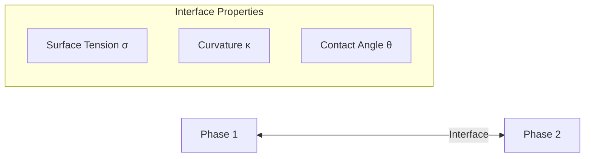

# Interfacial Phenomena

ปรากฏการณ์ที่ผิวสัมผัสระหว่างเฟส

---

## Why This Matters for OpenFOAM

> **Interface physics make or break multiphase simulations**

Understanding interfacial phenomena is critical because:

- **Surface tension determines stability** — without proper σ and κ settings, your simulation will either produce parasitic currents or fail to capture interface dynamics
- **Contact angle modeling requires care** — wrong boundary conditions produce unphysical wetting behavior
- **Marangoni effects are often overlooked** — temperature gradients can drive flow in welding, crystal growth, and microfluidics
- **Dimensionless numbers dictate model choice** — Weber, Capillary, and Eötvös numbers tell you whether surface tension matters for your problem

---

## Learning Objectives

After completing this section, you will be able to:

- **Calculate surface tension forces** using the Young-Laplace equation and implement them in OpenFOAM via the CSF model
- **Predict droplet/bubble shapes** using dimensionless numbers (We, Ca, Eo)
- **Model contact angles** with appropriate boundary conditions for wetting problems
- **Identify when Marangoni effects** are significant and how to include them
- **Select appropriate interface tracking methods** (VOF vs Level Set vs Front Tracking) for your application

---

## Overview

**Interface** = บริเวณที่เฟสสองเฟสมาพบกัน — ควบคุม mass, momentum, และ energy transfer



---

## 1. Surface Tension

### Definition

$$\sigma = \frac{F}{L} = \frac{\text{Force}}{\text{Length}} = \frac{\text{Energy}}{\text{Area}}$$

| Quantity | Unit |
|----------|------|
| σ (surface tension) | N/m หรือ J/m² |

### Physical Origin

- โมเลกุลที่ผิวมี **net inward force** เพราะไม่มีโมเลกุลด้านบน
- ผิวพยายาม **minimize area** → ฟองเป็นทรงกลม
- Surface tension is a manifestation of **cohesive forces** between molecules

### Temperature Dependence

Surface tension decreases with temperature:

$$\sigma(T) = \sigma_0 \left(1 - \frac{T}{T_c}\right)^n$$

where T_c is critical temperature and n ≈ 1.2 for many liquids.

### Typical Values

| System | Temperature | σ (N/m) |
|--------|-------------|---------|
| Water-Air | 20°C | 0.073 |
| Water-Air | 100°C | 0.059 |
| Mercury-Air | 20°C | 0.486 |
| Oil-Water | 20°C | 0.02-0.05 |
| Ethanol-Air | 20°C | 0.022 |

> **See also:** Dimensionless numbers table in [00_Overview.md](00_Overview.md) for consolidated reference

---

## 2. Young-Laplace Equation

The pressure jump across a curved interface:

$$\Delta p = \sigma \left(\frac{1}{R_1} + \frac{1}{R_2}\right) = \sigma \kappa$$

| Variable | Meaning |
|----------|---------|
| Δp | Pressure jump across interface |
| R₁, R₂ | Principal radii of curvature |
| κ | Mean curvature (sum of principal curvatures) |

### Special Cases

| Shape | Curvature | Pressure Jump |
|-------|-----------|---------------|
| Sphere (radius R) | κ = 2/R | Δp = 2σ/R |
| Cylinder (radius R) | κ = 1/R | Δp = σ/R |
| Flat surface | κ = 0 | Δp = 0 |

### Applications

- **Bubble pressure:** Δp inside soap bubble = 4σ/R (two interfaces)
- **Capillary rise:** h = (2σ cosθ)/(ρ g r) for tube of radius r
- **Droplet formation:** Determines breakup size in dripping faucets

---

## 3. Contact Angle & Wetting

### Young's Equation

Balance of surface tensions at three-phase contact line:

$$\cos\theta = \frac{\sigma_{SG} - \sigma_{SL}}{\sigma_{LG}}$$

| θ Range | Wettability | Typical Behavior |
|---------|-------------|------------------|
| θ < 90° | Hydrophilic | Liquid spreads on surface |
| θ > 90° | Hydrophobic | Liquid beads up |
| θ ≈ 0° | Complete wetting | Thin film formation |
| θ ≈ 180° | Complete non-wetting | Perfect beading (theoretical) |

### Hysteresis

**Advancing angle (θ_a)** vs **Receding angle (θ_r)**:
- θ_a > θ_r due to surface roughness and chemical heterogeneity
- Contact angle hysteresis Δθ = θ_a - θ_r affects droplet pinning

### Dynamic Contact Angle

For moving contact lines, the angle depends on contact line velocity:

$$\theta_d = f(\text{Ca}, \theta_{static})$$

where Ca is the Capillary number.

---

## 4. Capillary Number

Ratio of viscous to surface tension forces:

$$Ca = \frac{\mu U}{\sigma}$$

| Ca Range | Behavior | Implications |
|----------|----------|--------------|
| Ca << 1 | Surface tension dominates | Droplets remain spherical, interface shape controlled by σ |
| Ca ~ 1 | Comparable forces | Transition regime |
| Ca >> 1 | Viscous forces dominate | Droplets deform significantly, can break up |

### Applications

- **Microfluidics:** Ca determines droplet formation in T-junctions
- **Coating processes:** High Ca needed for uniform films
- **Enhanced oil recovery:** Low Ca leads to capillary trapping

---

## 5. Marangoni Effect

Flow driven by surface tension gradients:

$$\tau_M = \frac{\partial \sigma}{\partial T} \nabla_s T = \frac{\partial \sigma}{\partial C} \nabla_s C$$

### Mechanism

1. **Temperature gradient** on surface → **surface tension gradient**
2. Fluid flows from **low σ (high T)** to **high σ (low T)**
3. Creates circulation patterns (thermocapillary convection)

### Applications & Importance

| Application | Why Marangoni Matters |
|-------------|----------------------|
| **Welding** | Temperature gradients cause fluid flow affecting pool shape |
| **Crystal growth** | Affects dopant distribution and crystal quality |
| **Microfluidics** | Used for droplet manipulation without moving parts |
| **Space applications** | Dominant in microgravity where buoyancy is negligible |

### Marangoni Number

$$Ma = \frac{|\partial\sigma/\partial T| \Delta T L}{\mu \alpha}$$

where α is thermal diffusivity. Ma > critical value triggers Marangoni convection.

> **OpenFOAM Implementation**: Marangoni effects require special treatment — typically implemented via coded boundary conditions or custom source terms in the momentum equation.

---

## 6. Dimensionless Numbers (Consolidated Reference)

> **See [00_Overview.md](00_Overview.md)** for complete table. Key numbers for interfacial phenomena:

| Number | Formula | Physical Meaning | When It Matters |
|--------|---------|------------------|-----------------|
| **Weber** | $We = \frac{\rho U^2 L}{\sigma}$ | Inertia / Surface Tension | We > 1: droplet deformation/breakup |
| **Capillary** | $Ca = \frac{\mu U}{\sigma}$ | Viscous / Surface Tension | Ca > 1: viscous deformation dominates |
| **Eötvös** | $Eo = \frac{\Delta\rho g L^2}{\sigma}$ | Buoyancy / Surface Tension | Eo > 1: gravity deforms bubbles |
| **Bond** | $Bo = Eo$ | Same as Eötvös | Used interchangeably |
| **Ohnesorge** | $Oh = \frac{\mu}{\sqrt{\rho \sigma L}}$ | Viscous / Inertial-Surface | Oh < 0.01: inertial breakup regime |

### Bubble/Droplet Shape Regimes

| Eo Range | Shape | Example |
|----------|-------|---------|
| < 1 | Spherical | Small bubbles in water |
| 1-10 | Ellipsoidal | Medium bubbles, oblate shape |
| 10-100 | Spherical cap / Wobbling | Large bubbles, cap-shaped |
| > 100 | Flat / Highly deformed | Very large bubbles, Taylor bubbles |

---

## 7. When to Use What: Decision Guide

### Surface Tension Importance

| Condition | Include σ? | Reason |
|-----------|------------|--------|
| We < 1 or Ca < 1 | **Yes** | Surface tension dominates |
| Small length scales (< 1 mm) | **Yes** | Capillary effects important |
| Sharp interfaces required | **Yes** | Need accurate interface shape |
| Large scale flows (meters) | **Maybe** | Often negligible unless high precision needed |
| High viscosity flows | **No** | Viscous forces dominate |

### Method Selection Guide

| Problem Type | Recommended Method | OpenFOAM Solver |
|--------------|-------------------|-----------------|
| Free surface flows (dam break, sloshing) | VOF | `interFoam` |
| Immiscible liquids with sharp interface | VOF | `multiphaseInterFoam` |
| Bubble columns (many small bubbles) | Euler-Euler | `multiphaseEulerFoam` |
| Droplet impacts/splashing | VOF + refinement | `interIsoFoam` + AMR |
| Welding/pool dynamics | VOF + Marangoni | `interFoam` + coded BC |
| Microfluidics (low Re, low Ca) | VOF + contact angle | `interFoam` |

---

## 8. Surface Tension in OpenFOAM

### CSF Model (Continuum Surface Force)

Brackbill et al. (1992) formulation — surface tension converted to volumetric force:

$$\mathbf{F}_\sigma = \sigma \kappa \nabla \alpha$$

**Key aspects:**
- Force acts only in interface region (where ∇α ≠ 0)
- Curvature κ = -∇·n̂ where n̂ = ∇α/|∇α|
- Implemented as source term in momentum equation

### OpenFOAM Implementation

```cpp
// constant/transportProperties
phases (water air);

sigma
(
    (water air) 0.072
);

// Alternative: temperature-dependent surface tension
sigmaTable
(
    (0 0.0759)      // T=0°C,  σ=0.0759 N/m
    (20 0.0728)     // T=20°C, σ=0.0728 N/m
    (100 0.0589)    // T=100°C, σ=0.0589 N/m
);
```

### interFoam Implementation Details

```cpp
// Surface tension force calculation (simplified)
surfaceScalarField sigmaK =
    fvc::interpolate(sigma) * fvc::snGrad(alpha);

// Added to momentum equation as source term
// In UEqn.H: fvm::Supt(-sigmaK*fvc::snGrad(alpha), U)
```

### Parameter Tuning Guidance

| Parameter | Effect | Typical Range |
|-----------|--------|---------------|
| `cAlpha` (compression) | Interface sharpness | 0-1, typical 0.5-1 |
| `maxAlpha` | Boundedness of α | 0-1, set to 1 |
| `maxCo` | Time step control | < 0.5 for surface tension |
| `refinementLevel` | Interface resolution | 2-4 additional levels |

---

## 9. Contact Angle Boundary Conditions

### Static Contact Angle

```cpp
// 0/alpha.water
wall
{
    type            constantAlphaContactAngle;
    theta0          70;        // Static contact angle [degrees]
    limit           gradient;  // or: none, gradient, zeroGradient
    value           uniform 0;
}
```

### Dynamic Contact Angle

```cpp
// 0/alpha.water
wall
{
    type            dynamicAlphaContactAngle;
    theta0          70;        // Static angle
    thetaA          110;       // Advancing angle
    thetaR          50;        // Receding angle
    uTheta          0.5;       // Characteristic velocity [m/s]
    limit           gradient;
    value           uniform 0;
}
```

### Limit Options

| Limit Type | Behavior | Use When |
|------------|----------|----------|
| `none` | No limiting, may produce unphysical values | Rarely used |
| `gradient` | Limits gradient to maintain boundedness | **Recommended for most cases** |
| `zeroGradient` | Zero gradient at wall | Non-wetting surfaces |

---

## 10. Interface Tracking Methods Comparison

| Method | Approach | Pros | Cons | OpenFOAM Solvers |
|--------|----------|------|------|------------------|
| **VOF** | Track α field (0 to 1) | Mass conservative, handles topology changes | Interface smearing, needs compression | `interFoam`, `multiphaseInterFoam`, `interIsoFoam` |
| **Level Set** | Track φ = 0 level set | Sharp interface, easy curvature calculation | Mass loss, requires re-distancing | Not in standard distro (research codes) |
| **Front Tracking** | Track markers on interface | Very accurate, sharp interface | Complex, expensive, topology changes hard | Not in standard distro |
| **Phase Field** | Track order parameter | Handles topology naturally | Thin interface limit requires fine mesh | `interPhaseChangeFoam` (boiling) |

### VOF-Specific Considerations

**Advantages for OpenFOAM users:**
- Built-in MULES algorithm ensures bounded α
- Interface compression schemes reduce smearing
- Well-validated across many applications

**Challenges:**
- Parasitic currents (spurious velocities) near interface
- Requires careful `cAlpha` tuning
- Interface thickness spans 2-3 cells

---

## 11. Common Issues & Solutions

### Parasitic Currents

**Symptom:** Unphysical velocities near stationary interface

**Solutions:**
1. Use `interIsoFoam` with geometric interface compression
2. Reduce `maxCo` below 0.3
3. Improve mesh quality (orthogonality > 0.5)
4. Try balanced force formulation

### Interface Smearing

**Symptom:** α field spreads over many cells

**Solutions:**
1. Increase `cAlpha` (but not > 1)
2. Use `vanLeer` or `MUSCL` divergence schemes
3. Add adaptive mesh refinement at interface
4. Reduce time step

### Contact Line Instability

**Symptom:** Moving contact line stick-slip behavior

**Solutions:**
1. Use dynamic contact angle model
2. Implement slip boundary condition for velocity
3. Refine mesh near contact line
4. Consider interface reconstruction (PLIC)

---

## Quick Reference

| Phenomenon | Key Parameter | OpenFOAM Implementation |
|------------|---------------|-------------------------|
| Surface tension | σ | `sigma` in `transportProperties` |
| Contact angle | θ | `constantAlphaContactAngle` BC |
| Pressure jump | Δp = σκ | Automatic via CSF model |
| Interface sharpness | cAlpha | In `fvSolution` under `solver` |
| Marangoni | ∂σ/∂T | Coded BC or source term |
| Curvature calculation | κ | `fvc::div(nHat)` where n̂ = ∇α/|∇α| |

---

## Concept Check

<details>
<summary><b>1. ทำไมฟองน้ำถึงเป็นทรงกลม?</b></summary>

เพราะ **sphere** มี minimum surface area สำหรับ given volume → minimize surface energy (E = σA). Surface tension acts to minimize total surface area, and a sphere has the smallest surface-area-to-volume ratio of any shape.
</details>

<details>
<summary><b>2. Capillary number บอกอะไรและใช้อย่างไรใน OpenFOAM?</b></summary>

Capillary number (Ca = μU/σ) บอกสัดส่วนระหว่าง viscous forces กับ surface tension:
- **Ca << 1**: Surface tension dominates — droplets remain spherical, use fine mesh at interface
- **Ca >> 1**: Viscous forces dominate — droplets deform easily, may need larger domain to capture breakup

ใน OpenFOAM: ใช้ Ca พิจารณาว่าควรใช้ interface compression scheme เพิ่มเติมหรือไม่ และเลือกเหมาะสมกับ mesh resolution
</details>

<details>
<summary><b>3. เมื่อไหร่ควรรวมผลกระทบจาก Marangoni effect ใน simulation?</b></summary>

Marangoni effect สำคัญเมื่อ:
1. **Temperature gradients** อยู่บน interface (เช่น welding, crystal growth)
2. **Concentration gradients** บน interface (เช่น surfactant-laden flows)
3. **Microgravity environments** ที่ buoyancy เล็กน้อย
4. **Small length scales** ที่ surface tension gradients มีผลมาก

ใน OpenFOAM: ต้อง implement ผ่าน coded boundary conditions หรือเพิ่ม source term ใน momentum equation เพราะไม่มี built-in support โดยตรง
</details>

<details>
<summary><b>4. VOF vs Level Set: เลือกอะไรเมื่อไหร่?</b></summary>

| Criterion | Choose VOF | Choose Level Set |
|-----------|------------|------------------|
| **Mass conservation** | Critical (e.g., volume tracking) | Less critical |
| **Interface sharpness** | Acceptable smearing OK | Need very sharp interface |
| **Topology changes** | Frequent breakup/coalescence | Minimal topology changes |
| **OpenFOAM availability** | Standard solvers available | Requires custom implementation |
| **Computational cost** | Moderate | Higher (re-distancing step) |

**Recommendation:** สำหรับ OpenFOAM users — เริ่มต้นด้วย VOF (`interFoam`) เสมอ เว้นแต่มีเหตุผลเฉพาะอย่างที่ต้องการ Level Set
</details>

<details>
<summary><b>5. ทำไม VOF ถึงมีปัญหา interface smearing และแก้ไขอย่างไร?</b></summary>

**สาเหตุ:** Numerical diffusion ทำให้ α กระจายออกจากค่า 0 หรือ 1 เมื่อ transport α field

**วิธีแก้:**
1. **Interface compression** — MULES algorithm in OpenFOAM adds compression term
2. **High-resolution schemes** — Use `Gauss vanLeer` or `Gauss MUSCL` for `div(phi,alpha)`
3. **Mesh refinement** — AMR near interface reduces numerical diffusion
4. **Geometric reconstruction** — PLIC method (research codes only)

**ใน OpenFOAM:** ปรับค่า `cAlpha` ใน `fvSolution`:
```
solvers
{
    alpha.water
    {
        nAlphaCorr      2;
        nAlphaSubCycles 1;
        cAlpha          0.5;  // Compression factor (0-1)
    }
}
```
</details>

---

## Key Takeaways

✅ **Surface tension** is controlled by σ and calculated via CSF model in OpenFOAM

✅ **Young-Laplace equation** explains pressure jumps across curved interfaces

✅ **Dimensionless numbers (We, Ca, Eo)** predict droplet/bubble shape and breakup — always calculate them first

✅ **Contact angle boundary conditions** require care — use `constantAlphaContactAngle` or `dynamicAlphaContactAngle`

✅ **Marangoni effects** matter in problems with temperature/concentration gradients at interface

✅ **VOF is the standard** for OpenFOAM interface tracking — use `interFoam` for most free surface problems

✅ **Parameter tuning** (cAlpha, maxCo) is essential for stable surface tension simulations

---

## Related Documents

- **Overview:** [00_Overview.md](00_Overview.md) — dimensionless numbers reference table
- **Flow Regimes:** [01_Flow_Regimes.md](01_Flow_Regimes.md) — when interface topology matters
- **Volume Fraction:** [03_Volume_Fraction_Concept.md](03_Volume_Fraction_Concept.md) — understanding α field
- **VOF Method:** [../../MODULE_04_MULTIPHASE_FUNDAMENTALS/CONTENT/02_VOF_METHOD/00_Overview.md](../02_VOF_METHOD/00_Overview.md) — detailed VOF implementation