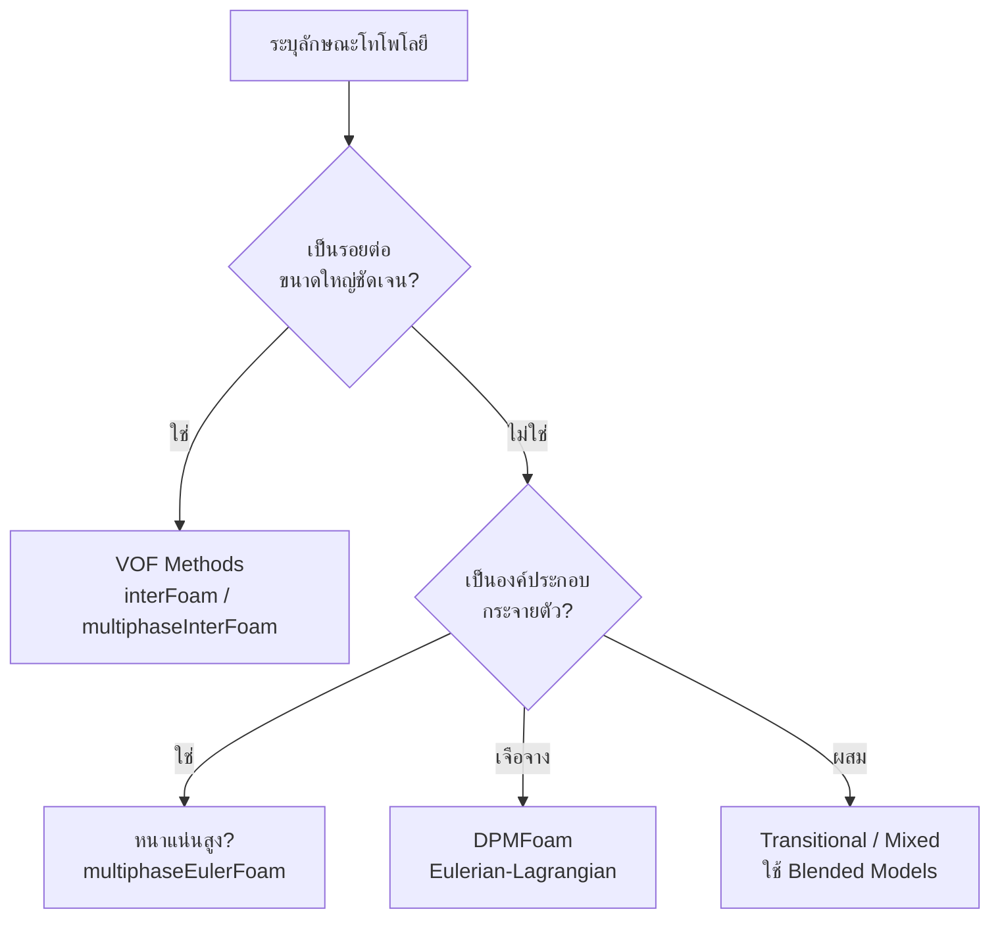

# รูปแบบการไหลหลายเฟส (Multiphase Flow Regimes)

## ภาพรวม (Overview)

**Flow regimes** ในการไหลหลายเฟส คือรูปแบบการกระจายตัวของเฟส (phase distribution) และลักษณะทางโทโพโลยีของรอยต่อ (interface topology) ที่เกิดขึ้นตามสภาวะการไหล คุณสมบัติทางกายภาพ และข้อจำกัดทางเรขาคณิต การทำความเข้าใจรูปแบบเหล่านี้เป็นสิ่งสำคัญอย่างยิ่ง (fundamental) ในการเลือกวิธีการจำลอง (modeling approach) และสมการปิด (closure relations) ที่เหมาะสมใน OpenFOAM

> [!INFO] ความสำคัญของ Flow Regimes
> การระบุ Flow regime ที่ถูกต้องกำหนดสิ่งต่อไปนี้:
> - การเลือก Solver (Eulerian-Eulerian vs. VOF vs. Hybrid)
> - การเลือกโมเดลแรงระหว่างเฟส (Drag, Lift, Virtual mass)
> - กลยุทธ์การจำลองความปั่นป่วน (Turbulence modeling)
> - ข้อกำหนดความเสถียรเชิงตัวเลข (Numerical stability)

---

## การแบ่งประเภทตามโทโพโลยีของรอยต่อ (Classification by Interface Topology)

การไหลหลายเฟสสามารถแบ่งประเภทพื้นฐานตามลักษณะทางกายภาพของรอยต่อได้ดังนี้:

### 1. การไหลแบบกระจายตัว (Dispersed Flow)

เฟสหนึ่งจะมีลักษณะต่อเนื่อง (Continuous) ในขณะที่อีกเฟสหนึ่งจะกระจายตัวเป็นองค์ประกอบย่อยๆ (Dispersed elements) เช่น ฟองอากาศ (bubbles), หยดของเหลว (droplets) หรืออนุภาค (particles)

**ลักษณะเฉพาะ (Characteristics):**
- มีความแตกต่างชัดเจนระหว่างเฟสต่อเนื่องและเฟสที่กระจายตัว
- องค์ประกอบของเฟสที่กระจายตัวมีสเกลความยาว (length scales) ที่เฉพาะตัว
- ความหนาแน่นของพื้นที่รอยต่อ (Interfacial area density) สามารถนิยามได้ชัดเจน

**ตัวอย่าง:**
- **Bubbly flow:** ฟองก๊าซในของเหลว
- **Droplet flow:** หยดของเหลวในก๊าซ
- **Fluidized beds:** อนุภาคของแข็งในก๊าซ

**แนวทางการจำลอง:**
- **Eulerian-Eulerian** (สำหรับความเข้มข้นหนาแน่น)
- **Eulerian-Lagrangian** (สำหรับความเข้มข้นเจือจาง)

### 2. การไหลแบบแยกชั้น (Separated Flow)

แต่ละเฟสจะถูกแยกออกจากกันด้วยรอยต่อที่มีขนาดใหญ่และต่อเนื่องชัดเจน

**ลักษณะเฉพาะ (Characteristics):**
- มีรอยต่อ (Interface) เดียวที่นิยามได้ชัดเจน
- รูปร่างของรอยต่อถูกกำหนดโดยความสมดุลของแรงต่างๆ
- สามารถเกิดการเสียรูปของรอยต่อขนาดใหญ่ได้

**ตัวอย่าง:**
- **Stratified flow:** การไหลแบบแยกชั้นในท่อแนวนอน
- **Annular flow:** การไหลแบบวงแหวนในท่อแนวตั้ง
- **Free surface flows:** การไหลที่มีผิวอิสระ

**แนวทางการจำลอง:**
- **Volume of Fluid (VOF):** เช่น `interFoam`, `multiphaseInterFoam`

### 3. การไหลแบบเปลี่ยนผ่าน (Transitional Flow)

เป็นสภาวะที่มีทั้งการไหลแบบกระจายตัวและแบบแยกชั้นเกิดขึ้นพร้อมกัน ซึ่งเป็นรูปแบบที่จำลองได้ยากที่สุด

**ตัวอย่าง:**
- **Slug flow:** ฟองก๊าซขนาดใหญ่ (Taylor bubbles) คั่นด้วยช่วงของเหลว
- **Churn flow:** การไหลที่มีความปั่นป่วนและสับสนสูง

---

## รูปแบบการไหลในท่อ (Flow Regimes in Pipe Flow)

### 1. การไหลในท่อแนวตั้ง (Vertical Pipe Flow)

| รูปแบบ (Regime) | ลักษณะเฉพาะ | สภาวะการเกิด | โครงสร้าง |
|----------------|-------------|--------------|------------|
| **Bubbly Flow** | ฟองก๊าซขนาดเล็กกระจายตัวในของเหลว | สัดส่วนก๊าซต่ำ, ความเร็วของเหลวปานกลาง | ฟองก๊าซทรงกลมหรือเสียรูป |
| **Slug Flow** | ฟองก๊าซขนาดใหญ่รูปกระสุน (Taylor bubbles) | ท่อแนวตั้งหรือท่อเอียง, ความเร็วปานกลางถึงสูง | ฟองก๊าซสามมิติที่ซับซ้อน |
| **Churn Flow** | การไหลที่สับสนและสั่นไหว | ความเร็วก๊าซสูง, เป็นช่วงเปลี่ยนผ่าน | โครงสร้างที่ไม่สม่ำเสมอ |
| **Annular Flow** | ก๊าซอยู่ตรงกลาง ของเหลวเป็นฟิล์มเกาะผนัง | ความเร็วก๊าซสูงมาก, สัดส่วนของเหลวต่ำ | แกนก๊าซ + ชั้นฟิล์มของเหลว |

### 2. การไหลในท่อแนวนอน (Horizontal Pipe Flow)

| รูปแบบ (Regime) | ลักษณะเฉพาะ | สภาวะการเกิด | โครงสร้าง |
|----------------|-------------|--------------|------------|
| **Stratified Flow** | แยกชั้นตามแรงโน้มถ่วง (ของเหลวอยู่ล่าง) | ท่อแนวนอนหรือท่อเอียงเล็กน้อย | รอยต่อชัดเจนแยกเฟส |
| **Wavy Flow** | เกิดคลื่นที่รอยต่อระหว่างเฟส | ความเร็วก๊าซปานกลาง | รอยต่อที่มีคลื่น |
| **Slug Flow** | ช่วงก๊าซขนาดใหญ่สลับกับช่วงของเหลว | ความเร็วปานกลาง | โครงสร้างที่ซับซ้อน |
| **Annular Flow** | ของเหลวเกาะผนังท่อเป็นวงแหวน | ความเร็วก๊าซสูงมาก | แกนก๊าซ + ชั้นฟิล์มของเหลว |

[Diagram: การแสดงภาพรูปแบบการไหลทั้งสี่ในท่อแนวตั้ง]

---

## ปัจจัยที่ส่งผลต่อรูปแบบการไหล (Factors Affecting Flow Regimes)

การเปลี่ยนแปลงระหว่างรูปแบบการไหลขึ้นอยู่กับปัจจัยหลักหลายประการ:

### 1. ความเร็วสัมพัทธ์ระหว่างเฟส (Relative Phase Velocities)

ความเร็วที่แตกต่างกันของเฟสต่างๆ ส่งผลต่อแรงฉุดลากและโครงสร้างรอยต่อ

### 2. คุณสมบัติทางกายภาพ (Physical Properties)

- **ความหนาแน่น (Density):** ความแตกต่างของความหนาแน่นส่งผลต่อแรงลอยตัว
- **ความหนืด (Viscosity):** ความหนืดสัมพัทธ์ของเฟสต่างๆ
- **แรงตึงผิว (Surface Tension):** กำหนดรูปร่างของฟองและหยด

### 3. การวางแนวของท่อ (Pipe Orientation)

แรงโน้มถ่วงส่งผลต่างกันในท่อแนวตั้งเทียบกับท่อแนวนอน

### 4. ขนาดและรูปร่างของท่อ (Pipe Size and Geometry)

อัตราส่วนขนาดส่งผลต่อการพัฒนารูปแบบการไหล

### 5. สภาพที่ขอบเขต (Boundary Conditions)

เงื่อนไขบนผนังท่อและจุดเริ่มต้นของการไหล

---

## เกณฑ์การเปลี่ยนรูปแบบ (Regime Transition Criteria)

การเปลี่ยนรูปแบบถูกกำหนดด้วยตัวเลขไร้มิติและพารามิเตอร์ต่างๆ:

### 1. Superficial Velocities (ความเร็วเชิงเทียบ)

$$U_{sg} = \frac{Q_g}{A}, \quad U_{sl} = \frac{Q_l}{A}$$

โดยที่:
- $U_{sg}$ = ความเร็วเชิงเทียบของก๊าซ (superficial gas velocity)
- $U_{sl}$ = ความเร็วเชิงเทียบของของเหลว (superficial liquid velocity)
- $Q_g$, $Q_l$ = อัตราการไหลของก๊าซและของเหลว
- $A$ = พื้นที่หน้าตัดท่อ

### 2. Void Fraction ($\alpha$)

เศษส่วนปริมาตรของก๊าซ:
- $\alpha < 0.25$: มักเป็น Bubbly flow
- $0.25 < \alpha < 0.75$: สามารถเป็น Slug หรือ Churn flow
- $\alpha > 0.75$: มักเป็น Annular flow

### 3. Froude Number (Fr)

$$Fr = \frac{U}{\sqrt{gD}}$$

ความสำคัญของแรงเฉื่อยต่อแรงโน้มถ่วง:
- $Fr < 1$: การไหลแบบ Subcritical (มีอิทธิพลจากแรงโน้มถ่วงมาก)
- $Fr > 1$: การไหลแบบ Supercritical (แรงเฉื่อยมีอิทธิพลมากกว่า)

### 4. Reynolds Number (Re)

$$Re = \frac{\rho U D}{\mu}$$

ใช้ในการพิจารณาลักษณะของการไหล (laminar vs turbulent)

---

## แผนที่รูปแบบการไหล (Flow Regime Maps)

แผนที่รูปแบบการไหลเป็นเครื่องมือสำคัญในการทำนายรูปแบบการไหลตามเงื่อนไขการทำงาน

### แผนที่รูปแบบการไหลสำหรับท่อแนวตั้ง

| รูปแบบ (Regime) | ลักษณะ | เงื่อนไขความเร็ว |
|----------------|-------------|--------------|
| **Stratified Flow** | การไหลแบบแยกชั้น | ความเร็วต่ำ |
| **Slug Flow** | คลื่นขนาดใหญ่ | ความเร็วปานกลาง |
| **Annular Flow** | ชั้นของเหลวบางๆ บนผนัง | ความเร็วก๊าซสูง |

### แผนที่รูปแบบการไหลสำหรับท่อแนวนอน

| รูปแบบ (Regime) | ลักษณะ | เงื่อนไขความเร็วก๊าซ |
|----------------|-------------|--------------|
| **Bubbly Flow** | ฟองขนาดเล็ก | ความเร็วก๊าซต่ำ |
| **Slug Flow** | ฟองขนาดใหญ่ | ความเร็วก๊าซปานกลาง |
| **Annular Flow** | ฟิล์มของเหลวบนผนัง | ความเร็วก๊าซสูง |

---

## การนำไปใช้ใน OpenFOAM

### กลยุทธ์การเลือก Solver



### การใช้โมเดลแบบผสม (Blended Interfacial Models)

ในกรณีที่รูปแบบการไหลมีการเปลี่ยนแปลง OpenFOAM ใช้ `BlendedInterfacialModel` เพื่อเปลี่ยนผ่านระหว่างโมเดลอย่างราบรื่น

```cpp
// โครงสร้างของ Blended Interfacial Model
// เปลี่ยนจากโมเดลสำหรับ Bubbly ไปเป็น Separated ตามสัดส่วนเฟส
tmp<volScalarField> K() const
{
    return blendingFactor()*modelBubbly->K()
         + (1 - blendingFactor())*modelSeparated->K();
}
```

### การตรวจจับรูปแบบการไหล (Flow Regime Detection)

OpenFOAM มีกลไกในการตรวจจับรูปแบบการไหลเฉพาะที่:

```cpp
// การตรวจจับรอยต่อผ่านความชันของเศษส่วนของช่องว่าง
volVectorField voidFractionGrad = fvc::grad(alpha1);

// การคำนวณความโค้งสำหรับแรงตึงผิว
surfaceScalarField curvature = fvc::div(nHat);

// ตัวบ่งชี้โทโพโลยีเฟสสำหรับการจำแนกรูปแบบการไหล
volScalarField regimeIndicator = calculateRegime(alpha1, U1, U2);
```

### การเลือก Solver ตามรูปแบบการไหล

| รูปแบบการไหล | Solver ที่เหมาะสม | เหตุผล |
|--------------|------------------|---------|
| **Separated (Stratified/Annular)** | `interFoam`, `multiphaseInterFoam` | VOF methods เหมาะสำหรับรอยต่อขนาดใหญ่ที่ชัดเจน |
| **Dispersed Dense (Bubbly/Particle)** | `multiphaseEulerFoam` | Eulerian-Eulerian สำหรับความเข้มข้นสูง |
| **Dispersed Dilute** | `DPMFoam`, `reactingParcelFoam` | Eulerian-Lagrangian สำหรับอนุภาคเจือจาง |
| **Transitional (Slug/Churn)** | `multiphaseEulerFoam` พร้อม Blended Models | ต้องการโมเดลแบบผสม |

### ตัวอย่างการตั้งค่าใน OpenFOAM

```cpp
// ตัวอย่างการกำหนด multiphase model ใน OpenFOAM
phases (water air);

// การกำหนด blending function สำหรับ regime-dependent models
blending
{
    type    table;
    values  (0 0.1 0.5 0.9 1);
}
```

---

## ความท้าทายและข้อควรพิจารณา (Challenges and Considerations)

### ความท้าทายในการจำลองรูปแบบการไหล

> [!WARNING] ความท้าทายที่สำคัญ
> - **การเปลี่ยนผ่านรูปแบบ (Regime Transition):** การเปลี่ยนจากรูปแบบหนึ่งไปอีกรูปแบบหนึ่งเป็นไปอย่างต่อเนื่อง ทำให้ยากต่อการระบุขอบเขตที่ชัดเจน
> - **ความไม่เสถียรเชิงตัวเลข (Numerical Instability):** รูปแบบการไหลบางประเภท (เช่น Slug flow) มีความผันผวนสูง ต้องการ mesh ละเอียดและ time step เล็ก
> - **ความต้องการทรัพยากร (Computational Cost):** การจำลองแบบ 3D แบบชั่วขณะของรูปแบบการไหลที่ซับซ้อนใช้ทรัพยากรสูง

### แนวทางการแก้ปัญหา

1. **การใช้โมเดลแบบผสม (Blended Models):** เปลี่ยนผ่านอย่างราบรื่นระหว่างโมเดลต่างๆ ตามสภาวะการไหล
2. **การปรับค่าพารามิเตอร์ (Parameter Tuning):** ปรับสัมประสิทธิ์ drag, lift และ virtual mass ให้เหมาะสมกับรูปแบบการไหล
3. **การตรวจสอบความถูกต้อง (Validation):** เปรียบเทียบผลลัพธ์กับข้อมูลการทดลองหรือแผนที่รูปแบบการไหลที่เป็นที่รู้จัก

---

## สรุป (Summary)

การระบุและเข้าใจรูปแบบการไหลหลายเฟสเป็นกุญแจสำคัญในการจำลองที่ประสบความสำเร็จ:

1. **การแบ่งประเภท:** แบ่งเป็น Dispersed, Separated, และ Transitional ตามโทโพโลยีของรอยต่อ
2. **รูปแบบในท่อ:** Bubbly, Slug, Churn, Annular, Stratified ขึ้นอยู่กับการวางแนวและความเร็ว
3. **ตัวเลขไร้มิติ:** Froude, Reynolds, Void fraction ช่วยทำนายการเปลี่ยนรูปแบบ
4. **การเลือก Solver:** VOF สำหรับ separated, Eulerian-Eulerian สำหรับ dispersed dense, Lagrangian สำหรับ dispersed dilute
5. **Blended Models:** สำคัญสำหรับรูปแบบการไหลที่เปลี่ยนผ่าน

การระบุรูปแบบการไหลที่ถูกต้องและการเลือก Solver ที่เหมาะสมเป็นกุญแจสำคัญสู่ความสำเร็จในการจำลองการไหลหลายเฟสด้วย OpenFOAM
