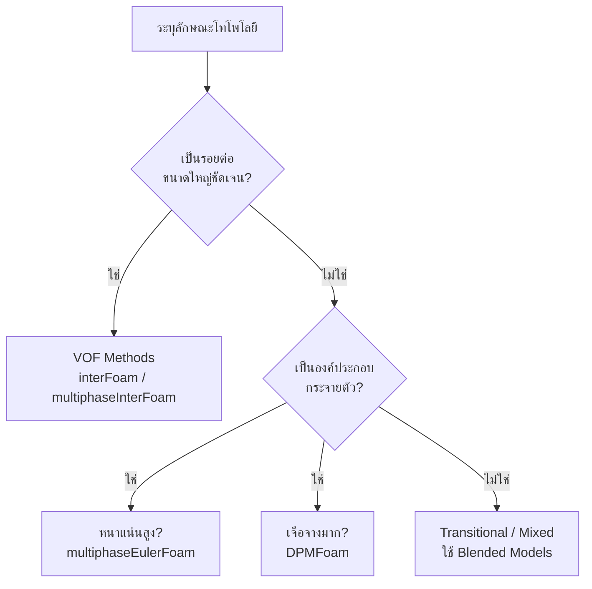

# รูปแบบการไหลหลายเฟส (Multiphase Flow Regimes)

## ภาพรวม (Overview)

**Flow regimes** ในการไหลหลายเฟส คือรูปแบบการกระจายตัวของเฟส (phase distribution) และลักษณะทางโทโพโลยีของรอยต่อ (interface topology) ที่เกิดขึ้นตามสภาวะการไหล คุณสมบัติทางกายภาพ และข้อจำกัดทางเรขาคณิต การทำความเข้าใจรูปแบบเหล่านี้เป็นสิ่งสำคัญอย่างยิ่ง (fundamental) ในการเลือกวิธีการจำลอง (modeling approach) และสมการปิด (closure relations) ที่เหมาะสมใน OpenFOAM

> [!INFO] ความสำคัญของ Flow Regimes
> การระบุ Flow regime ที่ถูกต้องกำหนดสิ่งต่อไปนี้:
> - การเลือก Solver (Eulerian-Eulerian vs. VOF vs. Hybrid)
> - การเลือกโมเดลแรงระหว่างเฟส (Drag, Lift, Virtual mass)
> - กลยุทธ์การจำลองความปั่นป่วน (Turbulence modeling)
> - ข้อกำหนดความเสถียรเชิงตัวเลข (Numerical stability)

---

## การแบ่งประเภทตามโทโพโลยีของรอยต่อ (Classification by Interface Topology)

การไหลหลายเฟสสามารถแบ่งประเภทพื้นฐานตามลักษณะทางกายภาพของรอยต่อได้ดังนี้:

### 1. การไหลแบบกระจายตัว (Dispersed Flow)

เฟสหนึ่งจะมีลักษณะต่อเนื่อง (Continuous) ในขณะที่อีกเฟสหนึ่งจะกระจายตัวเป็นองค์ประกอบย่อยๆ (Dispersed elements) เช่น ฟองอากาศ (bubbles), หยดของเหลว (droplets) หรืออนุภาค (particles)

**ลักษณะเฉพาะ (Characteristics):**
- มีความแตกต่างชัดเจนระหว่างเฟสต่อเนื่องและเฟสที่กระจายตัว
- องค์ประกอบของเฟสที่กระจายตัวมีสเกลความยาว (length scales) ที่เฉพาะตัว
- ความหนาแน่นของพื้นที่รอยต่อ (Interfacial area density) สามารถนิยามได้ชัดเจน

**ตัวอย่าง:**
- **Bubbly flow:** ฟองก๊าซในของเหลว
- **Droplet flow:** หยดของเหลวในก๊าซ
- **Fluidized beds:** อนุภาคของแข็งในก๊าซ

**แนวทางการจำลอง:**
- **Eulerian-Eulerian** (สำหรับความเข้มข้นหนาแน่น)
- **Eulerian-Lagrangian** (สำหรับความเข้มข้นเจือจาง)

### 2. การไหลแบบแยกชั้น (Separated Flow)

แต่ละเฟสจะถูกแยกออกจากกันด้วยรอยต่อที่มีขนาดใหญ่และต่อเนื่องชัดเจน

**ลักษณะเฉพาะ (Characteristics):**
- มีรอยต่อ (Interface) เดียวที่นิยามได้ชัดเจน
- รูปร่างของรอยต่อถูกกำหนดโดยความสมดุลของแรงต่างๆ
- สามารถเกิดการเสียรูปของรอยต่อขนาดใหญ่ได้

**ตัวอย่าง:**
- **Stratified flow:** การไหลแบบแยกชั้นในท่อแนวนอน
- **Annular flow:** การไหลแบบวงแหวนในท่อแนวตั้ง
- **Free surface flows:** การไหลที่มีผิวอิสระ

**แนวทางการจำลอง:**
- **Volume of Fluid (VOF):** เช่น `interFoam`, `multiphaseInterFoam`

### 3. การไหลแบบเปลี่ยนผ่าน (Transitional Flow)

เป็นสภาวะที่มีทั้งการไหลแบบกระจายตัวและแบบแยกชั้นเกิดขึ้นพร้อมกัน ซึ่งเป็นรูปแบบที่จำลองได้ยากที่สุด

**ตัวอย่าง:**
- **Slug flow:** ฟองก๊าซขนาดใหญ่ (Taylor bubbles) คั่นด้วยช่วงของเหลว
- **Churn flow:** การไหลที่มีความปั่นป่วนและสับสนสูง

---

## รูปแบบการไหลในท่อ (Flow Regimes in Pipe Flow)

### 1. การไหลในท่อแนวตั้ง (Vertical Pipe Flow)

| รูปแบบ (Regime) | ลักษณะเฉพาะ | สภาวะการเกิด |
|----------------|-------------|--------------|
| **Bubbly Flow** | ฟองก๊าซขนาดเล็กกระจายตัวในของเหลว | สัดส่วนก๊าซต่ำ, ความเร็วของเหลวปานกลาง |
| **Slug Flow** | ฟองก๊าซขนาดใหญ่รูปกระสุน (Taylor bubbles) | ความเร็วก๊าซปานกลาง |
| **Churn Flow** | การไหลที่สับสนและสั่นไหว | ความเร็วก๊าซสูง, เป็นช่วงเปลี่ยนผ่าน |
| **Annular Flow** | ก๊าซอยู่ตรงกลาง ของเหลวเป็นฟิล์มเกาะผนัง | ความเร็วก๊าซสูงมาก, สัดส่วนของเหลวต่ำ |

### 2. การไหลในท่อแนวนอน (Horizontal Pipe Flow)

| รูปแบบ (Regime) | ลักษณะเฉพาะ | สภาวะการเกิด |
|----------------|-------------|--------------|
| **Stratified Flow** | แยกชั้นตามแรงโน้มถ่วง (ของเหลวอยู่ล่าง) | ความเร็วต่ำทั้งสองเฟส |
| **Wavy Flow** | เกิดคลื่นที่รอยต่อระหว่างเฟส | ความเร็วก๊าซปานกลาง |
| **Slug Flow** | ช่วงก๊าซขนาดใหญ่สลับกับช่วงของเหลว | ความเร็วปานกลาง |
| **Annular Flow** | ของเหลวเกาะผนังท่อเป็นวงแหวน | ความเร็วก๊าซสูงมาก |

---

## เกณฑ์การเปลี่ยนรูปแบบ (Regime Transition Criteria)

การเปลี่ยนรูปแบบถูกกำหนดด้วยตัวเลขไร้มิติและพารามิเตอร์ต่างๆ:

1. **Superficial Velocities:** $U_{sg} = Q_g/A, U_{sl} = Q_l/A$
2. **Void Fraction ($\alpha$):** 
   - $\alpha < 0.25$: มักเป็น Bubbly flow
   - $\alpha > 0.75$: มักเป็น Annular flow
3. **Froude Number (Fr):** $Fr = U/\sqrt{gD}$ (ความสำคัญของแรงเฉื่อยต่อแรงโน้มถ่วง)

---

## การนำไปใช้ใน OpenFOAM

### กลยุทธ์การเลือก Solver



### การใช้โมเดลแบบผสม (Blended Interfacial Models)

ในกรณีที่รูปแบบการไหลมีการเปลี่ยนแปลง OpenFOAM ใช้ `BlendedInterfacialModel` เพื่อเปลี่ยนผ่านระหว่างโมเดลอย่างราบรื่น:

```cpp
// โครงสร้างของ Blended Interfacial Model
// เปลี่ยนจากโมเดลสำหรับ Bubbly ไปเป็น Separated ตามสัดส่วนเฟส
tmp<volScalarField> K() const
{
    return blendingFactor()*modelBubbly->K()
         + (1 - blendingFactor())*modelSeparated->K();
}
```

การระบุรูปแบบการไหลที่ถูกต้องและการเลือก Solver ที่เหมาะสมเป็นกุญแจสำคัญสู่ความสำเร็จในการจำลองการไหลหลายเฟสด้วย OpenFOAM