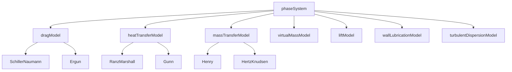

# ปรากฏการณ์ระหว่างเฟส (Interfacial Phenomena)

## ภาพรวม

==ปรากฏการณ์ระหว่างเฟส== เป็นฟิสิกส์พื้นฐานที่ควบคุมการปฏิสัมพันธ์ระหว่างเฟสต่างๆ ในระบบหลายเฟส ซึ่งมีความสำคัญอย่างยิ่งต่อการทำนายพฤติกรรมของของไหลหลายเฟสได้อย่างแม่นยำ

ปรากฏการณ์เหล่านี้รวมถึง:
- **แรงตึงผิว** (Surface Tension)
- **แรงฉุดระหว่างเฟส** (Interphase Drag Forces)
- **การถ่ายเทความร้อนระหว่างเฟส** (Interphase Heat Transfer)
- **การถ่ายเทมวลและการเปลี่ยนแปลงเฟส** (Mass Transfer and Phase Change)
- **แรงระหว่างเฟสเพิ่มเติม** (Additional Interfacial Forces)

---

## 1. แรงตึงผิว (Surface Tension, $\sigma$)

แรงตึงผิวเป็นแรงที่กระทำที่รอยต่อระหว่างสองเฟส ซึ่งมีแนวโน้มที่จะลดพื้นที่ผิวให้น้อยที่สุด

![[surface_tension_and_contact_angle.png]]

### 1.1 สมการ Young-Laplace

ความแตกต่างของความดันข้ามพื้นผิวสัมผัสที่มีความโค้ง:

$$\Delta p = \sigma \kappa = \sigma \left(\frac{1}{R_1} + \frac{1}{R_2}\right) \tag{1.1}$$

**นิยามตัวแปร:**
- $\Delta p$: ความแตกต่างของความดันข้ามพื้นผิว [Pa]
- $\sigma$: แรงตึงผิว [N/m]
- $\kappa$: ความโค้งเฉลี่ย [1/m]
- $R_1, R_2$: รัศมีความโค้งหลัก [m]

### 1.2 มุมสัมผัส (Contact Angle, $\theta$)

มุมที่รอยต่อระหว่างเฟสพบกับผนังของแข็ง

![[wetting_behavior_comparison.png]]

#### กฎของ Young (Young's Law)

$$\gamma_{sv} = \gamma_{sl} + \gamma_{lv} \cos(\theta_c) \tag{1.2}$$

**นิยามตัวแปร:**
- $\gamma_{sv}$: พลังงานพื้นผิวระหว่างผงกับระยะไกล
- $\gamma_{sl}$: พลังงานพื้นผิวระหว่างผงกับของเหลว
- $\gamma_{lv}$: พลังงานพื้นผิวระหว่างของเหลวกับระยะไกล

#### การจำแนกประเภทตามมุมสัมผัส

| ประเภท | ช่วงมุม | ลักษณะ |
|---------|---------|---------|
| **Hydrophilic** | $\theta < 90^°$ | การเปียก (Wetting) |
| **Hydrophobic** | $\theta > 90^°$ | ไม่เปียก (Non-wetting) |
| **Superhydrophilic** | $\theta < 10^°$ | เปียกอย่างยิ่ง |
| **Superhydrophobic** | $\theta > 150^°$ | ไม่เปียกอย่างยิ่ง |

### 1.3 ความหนาแน่นพื้นที่รอยต่อ (Interfacial Area Density, $\mathcal{A}_i$)

ปริมาณพื้นที่รอยต่อต่อหน่วยปริมาตร ($m^2/m^3$) ซึ่งมีความสำคัญต่อการคำนวณอัตราการถ่ายเทระหว่างเฟส

#### สำหรับฟอง/หยดทรงกลมที่มีเส้นผ่านศูนย์กลาง $d$:

$$\mathcal{A}_i = \frac{6 \alpha_d}{d} \tag{1.3}$$

**นิยามตัวแปร:**
- $\mathcal{A}_i$: ความหนาแน่นพื้นที่รอยต่อ [m²/m³]
- $\alpha_d$: เศษส่วนปริมาตรของเฟสที่กระจายตัว [-]
- $d$: เส้นผ่านศูนย์กลางของฟอง/หยด [m]

### 1.4 ตัวเลขไร้มิติที่สำคัญสำหรับแรงตึงผิว

![[bubble_shapes_weber_number.png]]

#### ตารางตัวเลขไร้มิติ

| ตัวเลขไร้มิติ | สมการ | ความหมายทางกายภาพ |
|----------------|----------|---------------------|
| **Weber Number (We)** | $\text{We} = \frac{\rho U^2 L}{\sigma}$ | อัตราส่วนของแรงเฉื่อยต่อแรงตึงผิว |
| **Eötvös Number (Eo)** | $\text{Eo} = \frac{g(\rho_c - \rho_d)L^2}{\sigma}$ | อัตราส่วนของแรงลอยตัวต่อแรงตึงผิว |
| **Morton Number (Mo)** | $\text{Mo} = \frac{g \mu_c^4 (\rho_c - \rho_d)}{\rho_c^2 \sigma^3}$ | คุณสมบัติของของไหลสำหรับพลศาสตร์ของฟอง |

#### ผลกระทบทางกายภาพของแรงตึงผิว

##### ความดันส่วนโค้ง (Curvature Pressure)
ความแตกต่างของความดันข้ามพื้นผิวสัมผัสที่มีความโค้งตามสมการ Young-Laplace

##### มุมสัมผัส (Contact Angles)
พฤติกรรมการเปียก (wetting) ที่ผนังซึ่งกำหนดโดยกฎของ Young

##### ความยาวคาปิลลารี (Capillary Length)
ความสำคัญสัมพัทธ์ของแรงตึงผิวเทียบกับแรงโน้มถ่วง:

$$L_c = \sqrt{\frac{\sigma}{\rho g}} \tag{1.4}$$

---

## 2. แรงฉุดระหว่างเฟส (Drag Forces Between Phases)

### 2.1 ทฤษฎีพื้นฐาน

==แรงฉุดระหว่างเฟส== เป็นกลไกพื้นฐานของการถ่ายเทพลังงานโมเมนตัมที่ควบคุมการมีปฏิสัมพันธ์ระหว่างเฟส

#### สมการแรงฉุด

แรงฉุดต่อหน่วยปริมาตาระหว่างเฟส $i$ และเฟส $j$:

$$\mathbf{F}_{d,ij} = K_{ij}(\mathbf{U}_j - \mathbf{U}_i) \tag{2.1}$$

**นิยามตัวแปร:**
- $\mathbf{F}_{d,ij}$: เวกเตอร์แรงฉุด [N/m³]
- $K_{ij}$: สัมประสิทธิ์การถ่ายเทพลังงานโมเมนตัมระหว่างเฟส [kg/(m³·s)]
- $\mathbf{U}_i, \mathbf{U}_j$: เวกเตอร์ความเร็วของเฟส [m/s]

> [!INFO] หมายเหตุ
> สูตรนี้ทำให้มั่นใจได้ว่าแรงฉุดจะต้านทานการเคลื่อนที่สัมพัทธ์ระหว่างเฟส ซึ่งสอดคล้องกับธรรมชาติทางกายภาพของแรงต้านหนืด

### 2.2 แบบจำลองแรงฉุด Schiller-Naumann

==แบบจำลอง Schiller-Naumann== เป็นหนึ่งในสมการสหสัมพันธ์แรงฉุดที่ใช้กันอย่างแพร่หลายที่สุดสำหรับอนุภาคทรงกลม

$$K = \frac{3}{4} C_D \frac{\alpha_d \rho_c |\mathbf{U}_d - \mathbf{U}_c|}{d_p} \tag{2.2}$$

**นิยามตัวแปร:**
- $C_D$: สัมประสิทธิ์แรงฉุด (drag coefficient)
- $\alpha_d$: เศษส่วนปริมาตรของเฟสที่กระจายตัว [-]
- $\rho_c$: ความหนาแน่นของเฟสต่อเนื่อง [kg/m³]
- $|\mathbf{U}_d - \mathbf{U}_c|$: ความเร็วสัมพัทธ์ [m/s]
- $d_p$: เส้นผ่านศูนย์กลางของอนุภาค [m]

#### ความสัมพันธ์ของสัมประสิทธิ์แรงฉุด

| เงื่อนไข | สมการสหสัมพันธ์ $C_D$ |
|-------------|-------------------------|
| $Re_p < 1000$ | $C_D = \frac{24}{Re_p}(1 + 0.15Re_p^{0.687})$ |
| $Re_p \geq 1000$ | $C_D = 0.44$ |

โดยที่ $Re_p = \frac{\rho_c |\mathbf{U}_d - \mathbf{U}_c| d_p}{\mu_c}$ คือ Particle Reynolds number

### 2.3 แบบจำลองแรงฉุด Ergun

==แบบจำลอง Ergun== ขยายการจำลองแรงฉุดไปยังสภาวะการบรรจุหนาแน่น (dense packing conditions)

$$K = 150 \frac{\alpha_d^2 \mu_c (1 - \alpha_c)}{d_p^2 \alpha_c^3} + 1.75 \frac{\alpha_d \rho_c |\mathbf{U}_d - \mathbf{U}_c|}{\alpha_c^3} \tag{2.3}$$

สมการสหสัมพันธ์นี้รวมเอาส่วนประกอบจาก:
- **แรงหนืด** (พจน์แรก): แรงต้านจากความหนืดของของไหล
- **แรงเฉื่อย** (พจน์ที่สอง): แรงต้านจากความเร็วสัมพัทธ์

เหมาะสำหรับ:
- ชั้นบรรจุ (packed beds)
- ฟลูอิดไดซ์เบด (fluidized beds)
- ใกล้กับความเร็วขั้นต่ำของการฟลูอิดไดซ์

---

## 3. การถ่ายเทความร้อนระหว่างเฟส (Interphase Heat Transfer)

### 3.1 พื้นฐานการถ่ายเทความร้อนระหว่างเฟส

การถ่ายเทความร้อนระหว่างเฟสในของไหลหลายเฟสถูกควบคุมโดยสมการพื้นฐาน:

$$Q_{ij} = h_{ij} A_{ij} (T_j - T_i) \tag{3.1}$$

**นิยามตัวแปร:**
- $Q_{ij}$: อัตราการถ่ายเทความร้อนเชิงปริมาตร [W/m³]
- $h_{ij}$: สัมประสิทธิ์การถ่ายเทความร้อนระหว่างเฟส [W/(m²·K)]
- $A_{ij}$: ความหนาแน่นของพื้นที่ผิวสัมผัส [m²/m³]
- $(T_j - T_i)$: แรงขับเคลื่อนอุณหภูมิ [K]

สัมประสิทธิ์การถ่ายเทความร้อนขึ้นอยู่กับ:

$$h_{ij} = f(\text{Re}, \text{Pr}, \text{geometry})$$

โดยที่:
- $\text{Re}$: Reynolds number
- $\text{Pr}$: Prandtl number
- ปัจจัยทางเรขาคณิต: พิจารณาถึงรูปร่างของอนุภาคและการจัดเรียงตัว

### 3.2 แบบจำลองการถ่ายเทความร้อนแบบสองแรงต้าน (Two-Resistance Model)

==แบบจำลองสองแรงต้าน== พิจารณาแรงต้านความร้อนในทั้งสองเฟส ให้การทำนายที่แม่นยำยิ่งขึ้น

$$\frac{1}{U_{\text{total}}} = \frac{1}{h_i} + \frac{1}{h_j} \tag{3.2}$$

**นิยามตัวแปร:**
- $U_{\text{total}}$: สัมประสิทธิ์การถ่ายเทความร้อนโดยรวม

สัมประสิทธิ์การถ่ายเทความร้อนแต่ละตัวมักคำนวณโดยใช้สมการสหสัมพันธ์ Nusselt number:

$$\text{Nu} = \frac{h d_p}{k} \tag{3.3}$$

#### สมการสหสัมพันธ์ Nusselt ที่พบบ่อย

| สมการ | สูตร | เงื่อนไขการใช้งาน |
|---------|-------|-----------------|
| **Ranz-Marshall** | $\text{Nu} = 2 + 0.6\text{Re}^{1/2}\text{Pr}^{1/3}$ | อนุภาคเดี่ยวในของไหล |
| **Gunn** | $\text{Nu} = (7 - 10\alpha_c + 5\alpha_c^2)(1 + 0.7\text{Re}^{0.2}\text{Pr}^{1/3})$ | อนุภาคในระบบหนาแน่น |

---

## 4. การถ่ายเทมวลและการเปลี่ยนแปลงเฟส (Mass Transfer and Phase Change)

### 4.1 พื้นฐานการถ่ายเทมวล

การถ่ายเทมวลระหว่างเฟสเกิดขึ้นเนื่องจากความแตกต่างของความเข้มข้น อุณหภูมิ หรือศักย์เคมี

#### สมการพื้นฐานของอัตราการถ่ายเทมวล

$$\dot{m}_{ij} = k_{ij} A_{ij} (C_j - C_i) \tag{4.1}$$

**นิยามตัวแปร:**
- $\dot{m}_{ij}$: อัตราการถ่ายเทมวล [kg/(m³·s)]
- $k_{ij}$: สัมประสิทธิ์การถ่ายเทมวล [m/s]
- $A_{ij}$: ความหนาแน่นของพื้นที่ผิวสัมผัส [m²/m³]
- $(C_j - C_i)$: แรงขับเคลื่อนความเข้มข้น [kg/m³]

### 4.2 กฎของเฮนรีและสมดุลแก๊ส-ของเหลว

==กฎของเฮนรี (Henry's Law)== กำหนดความสัมพันธ์สมดุลสำหรับระบบแก๊ส-ของเหลว:

$$C_{\text{gas}} = H \cdot p_{\text{gas}} \tag{4.2}$$

**นิยามตัวแปร:**
- $C_{\text{gas}}$: ความเข้มข้นของแก๊สในเฟสของเหลว [mol/m³]
- $p_{\text{gas}}$: ความดันย่อยของแก๊ส [Pa]
- $H$: ค่าคงที่ของเฮนรี [mol/(m³·Pa)]

ค่าคงที่ของเฮนรีแบบไร้มิติ:

$$K_{\text{GC}} = \frac{C_{\text{gas}}}{C_{\text{liquid}}} = HRT \tag{4.3}$$

### 4.3 กลไกการเปลี่ยนแปลงเฟส

#### การระเหยและการควบแน่น (Evaporation and Condensation)

ถูกควบคุมโดยสมการ Hertz-Knudsen:

$$\dot{m}_{evap} = \alpha \sqrt{\frac{M}{2\pi RT_{sat}}}(p_{sat} - p_{int}) \tag{4.4}$$

**นิยามตัวแปร:**
- $\alpha$: สัมประสิทธิ์การปรับตัว (accommodation coefficient)
- $M$: มวลโมเลกุล [kg/mol]
- $T_{sat}$: อุณหภูมิอิ่มตัว [K]
- $p_{sat}$: ความดันอิ่มตัว [Pa]
- $p_{int}$: ความดันที่พื้นผิวสัมผัส [Pa]

#### พลวัตการขยายตัวของฟอง (Bubble Growth Dynamics)

สำหรับการขยายตัวของฟองในของเหลวที่มีความร้อนยิ่งยวด สมการ Rayleigh-Plesset จะควบคุมพลวัต:

$$R\ddot{R} + \frac{3}{2}\dot{R}^2 = \frac{p_b - p_\infty}{\rho_l} - \frac{2\sigma}{\rho_l R} - \frac{4\mu_l \dot{R}}{\rho_l R} \tag{4.5}$$

**นิยามตัวแปร:**
- $R$: รัศมีของฟอง [m]
- $p_b$: ความดันในฟอง [Pa]
- $p_\infty$: ความดันที่ระยะไกล [Pa]
- $\sigma$: แรงตึงผิว [N/m]
- $\mu_l$: ความหนืดของของเหลว [Pa·s]

---

## 5. แรงระหว่างเฟสเพิ่มเติม (Additional Interfacial Forces)

### 5.1 แรงมวลเสมือน (Virtual Mass Force)

==แรงมวลเสมือน== พิจารณาถึงการเร่งความเร็วของของไหลโดยรอบเมื่ออนุภาคเร่งความเร็ว

$$\mathbf{F}_{vm} = C_{vm} \rho_c \alpha_d (\mathbf{a}_d - \mathbf{a}_c) \tag{5.1}$$

**นิยามตัวแปร:**
- $C_{vm}$: สัมประสิทธิ์มวลเสมือน (โดยทั่วไปคือ 0.5 สำหรับอนุภาคทรงกลม)
- $\rho_c$: ความหนาแน่นของเฟสต่อเนื่อง [kg/m³]
- $\alpha_d$: เศษส่วนปริมาตรของเฟสที่กระจายตัว [-]
- $(\mathbf{a}_d - \mathbf{a}_c)$: การเร่งความเร็วสัมพัทธ์ [m/s²]

แรงนี้จะมีความสำคัญในระบบที่มี:
- การเร่งความเร็วความถี่สูง
- การไหลที่ไม่คงที่ (unsteady flows)

### 5.2 แรงยก (Lift Force)

==แรงยก== เกิดขึ้นจากความแตกต่างของความเร็วที่ตั้งฉากกับการเคลื่อนที่สัมพัทธ์ระหว่างเฟส:

$$\mathbf{F}_{lift} = C_L \rho_c \alpha_d (\mathbf{U}_d - \mathbf{U}_c) \times (\nabla \times \mathbf{U}_c) \tag{5.2}$$

**นิยามตัวแปร:**
- $C_L$: สัมประสิทธิ์แรงยก ซึ่งขึ้นอยู่กับ particle Reynolds number และอัตราการเฉือน

สัมประสิทธิ์แรงยก Saffman-Mei สำหรับอนุภาคขนาดเล็ก:

$$C_L = \frac{2.255}{\sqrt{\text{Re}_p \text{Sr}}} \quad \text{สำหรับ} \quad \text{Re}_p \ll \text{Sr} \tag{5.3}$$

### 5.3 แรงหล่อลื่นผนัง (Wall Lubrication Force)

==แรงหล่อลื่นผนัง== ป้องกันการสะสมตัวของอนุภาคใกล้ผนัง

$$\mathbf{F}_{wl} = C_{wl} \rho_c \alpha_d |\mathbf{U}_d - \mathbf{U}_c|^2 n_w f(y) \tag{5.4}$$

**นิยามตัวแปร:**
- $C_{wl}$: สัมประสิทธิ์แรงหล่อลื่นผนัง
- $n_w$: เวกเตอร์แนวฉากของผนัง
- $f(y)$: ฟังก์ชันของระยะห่างจากผนัง

#### ฟังก์ชันระยะห่างจากผนัง

$$f(y) = \frac{1}{y^2} - \frac{1}{(y + \epsilon)^2} \tag{5.5}$$

โดยที่:
- $y$: ระยะห่างจากผนัง [m]
- $\epsilon$: พารามิเตอร์ขนาดเล็กเพื่อป้องกันค่าอนันต์

### 5.4 แรงกระจายตัวจากความปั่นป่วน (Turbulent Dispersion Force)

==แรงกระจายตัวจากความปั่นป่วน== พิจารณาถึงการเคลื่อนที่แบบสุ่มของอนุภาคอันเนื่องมาจากการผันผวนของความปั่นป่วน

$$\mathbf{F}_{td} = -C_{td} \rho_c k \nabla \alpha_d \tag{5.6}$$

**นิยามตัวแปร:**
- $C_{td}$: สัมประสิทธิ์แรงกระจายตัวจากความปั่นป่วน
- $k$: พลังงานจลน์จากความปั่นป่วน [m²/s²]

แรงนี้ช่วย:
- ส่งเสริมการผสม
- ป้องกันการแยกเฟสที่มากเกินไป

---

## 6. การนำไปใช้ใน OpenFOAM

### 6.1 สถาปัตยกรรมโมเดลรอยต่อ

OpenFOAM มีเฟรมเวิร์กที่ครอบคลุมสำหรับการจำลองปรากฏการณ์ระหว่างเฟส

#### สถาปัตยกรรมหลัก



### 6.2 การตรวจจับและการติดตามรอยต่อ

#### OpenFOAM Code Implementation

การตรวจจับรอยต่อและการคำนวณความโค้ง:

```cpp
// การตรวจจับรอยต่อผ่านความชันของเศษส่วนของช่องว่าง
volVectorField voidFractionGrad = fvc::grad(alpha1);

// การคำนวณความโค้งสำหรับแรงตึงผิว
surfaceScalarField curvature = fvc::div(nHat);

// ตัวบ่งชี้โทโพโลยีเฟสสำหรับการจำแนกรูปแบบการไหล
volScalarField regimeIndicator = calculateRegime(alpha1, U1, U2);
```

### 6.3 โครงสร้างคลาสแรงฉุด

#### คลาสพื้นฐานของแบบจำลองแรงฉุด

```cpp
class dragModel
{
    // คำนวณและคืนค่าสัมประสิทธิ์แรงฉุด
    virtual tmp<volScalarField> K(const UDictionary&) = 0;

    // กลไกการเลือกขณะรัน
    declareRunTimeSelectionTable
    (
        autoPtr,
        dragModel,
        dictionary,
        (
            const dictionary& dict,
            const phaseModel& phase1,
            const phaseModel& phase2
        ),
        (dict, phase1, phase2)
    );
};
```

#### การนำ Schiller-Naumann ไปใช้

```cpp
class SchillerNaumann : public dragModel
{
private:
    // เส้นผ่านศูนย์กลางขององค์ประกอบเฟสที่กระจายตัว
    dimensionedScalar d_;

    // คำนวณ Reynolds number
    tmp<volScalarField> Re() const
    {
        return mag(this->U2_ - this->U1_) * d_ / this->nu1_;
    }

    // คำนวณสัมประสิทธิ์แรงฉุด
    tmp<volScalarField> Cd(const volScalarField& Re) const
    {
        return pos(Re - 1000)*0.44 + neg(Re - 1000)*
               24*(1 + 0.15*pow(Re, 0.687))/Re;
    }
};
```

### 6.4 ระบบเฟสการถ่ายเทความร้อน

```cpp
template<class BasePhaseSystem>
class HeatTransferPhaseSystem : public BasePhaseSystem
{
private:
    // แบบจำลองการถ่ายเทความร้อนระหว่างคู่เฟส
    HashTable<autoPtr<heatTransferModel>, phasePairKey> heatTransferModels_;

    // สนามอุณหภูมิพื้นผิวสัมผัส
    HashTable<volScalarField, phasePairKey> Tinterfaces_;

    // พจน์แหล่งความร้อน/อ่างความร้อน
    volScalarField Q_;

    // คำนวณการถ่ายเทความร้อนระหว่างคู่เฟสทั้งหมด
    void calculateHeatTransfer();

    // ปรับปรุงอุณหภูมิพื้นผิวสัมผัส
    void updateTinterfaces();
};
```

### 6.5 ระบบเฟสการถ่ายเทมวลและการเปลี่ยนแปลงเฟส

```cpp
template<class BasePhaseSystem>
class InterfaceCompositionPhaseChangePhaseSystem
:
    public HeatTransferPhaseSystem<BasePhaseSystem>
{
private:
    // แบบจำลองการเปลี่ยนแปลงเฟส
    HashTable<autoPtr<phaseChangeModel>, phasePairKey> phaseChangeModels_;

    // องค์ประกอบพื้นผิวสัมผัส
    interfaceCompositionModel interfaceComposition_;

    // อัตราการถ่ายเทมวล
    HashTable<volScalarField, phasePairKey> dmdt_;

    // ผลกระทบจากความร้อนแฝง
    volScalarField HLatent_;
};
```

---

## 7. ปัญหาทางกายภาพทั่วไปและวิธีแก้ไข

### 7.1 การแพร่กระจายเชิงตัวเลขของพื้นผิวสัมผัส

> [!WARNING] ปัญหาทางกายภาพ
> พื้นผิวสัมผัสที่คมชัดจะค่อยๆ พร่ามัวอย่างผิดธรรมชาติเมื่อเวลาผ่านไป

**อาการ:**
- การทำให้พื้นผิวสัมผัสที่คมชัดค่อยๆ เรียบเนียน
- การผสมกันอย่างผิดธรรมชาติระหว่างเฟส
- การสูญเสียรายละเอียดขนาดเล็ก

**วิธีแก้ไข:**
- ใช้ Scheme การประมาณค่าอันดับสูง (higher-order discretization schemes)
- ใช้เทคนิคการบีบอัดพื้นผิวสัมผัส (interface compression methods)
- ปรับปรุง Mesh บริเวณพื้นผิวสัมผัสให้ละเอียดขึ้น
- ใช้ Scheme พิเศษสำหรับการติดตามพื้นผิวสัมผัส

### 7.2 ค่าเฟสแฟรกชันที่ผิดธรรมชาติ

> [!WARNING] ปัญหาทางกายภาพ
> เฟสแฟรกชันมีค่าติดลบหรือเกิน 1

**สาเหตุ:**
- Time step มีค่ามากเกินไป
- การลดค่าความผ่อนคลาย (under-relaxation) ไม่เพียงพอ
- คุณภาพ Mesh ไม่ดี
- Source terms มีค่าสูง

**วิธีแก้ไข:**
- ลดขนาด Time step
- เพิ่มค่าตัวคูณการลดค่าความผ่อนคลาย (under-relaxation factors)
- ปรับปรุงคุณภาพ Mesh (orthogonality, aspect ratio)
- ใช้ Scheme เชิงตัวเลขที่มีขอบเขต (bounded numerical schemes)

### 7.3 ความไม่เสถียรของการควบคู่โมเมนตัม

**อาการ:**
- ความเร็วแกว่งไปมา
- สนามความดันลู่ออก
- การระเบิดเชิงตัวเลข (Numerical blow-up)

**วิธีแก้ไข:**
- ใช้การจัดการแรงฉุดแบบ Implicit (implicit drag treatment)
- ใช้ Algorithm การกำจัดบางส่วน (partial elimination algorithm)
- เพิ่มการลดค่าความผ่อนคลาย (under-relaxation)
- ใช้ Linear solvers ที่มีความเสถียร (robust linear solvers)

---

## สรุป

ปรากฏการณ์ระหว่างเฟสเป็นฟิสิกส์พื้นฐานที่ควบคุมการปฏิสัมพันธ์ระหว่างเฟสต่างๆ ในระบบหลายเฟส การเข้าใจและจำลองปรากฏการณ์เหล่านี้อย่างถูกต้องเป็นสิ่งจำเป็นสำหรับการทำนายพฤติกรรมของของไหลหลายเฟสได้อย่างแม่นยำ

==ประเด็นสำคัญ:==
1. **แรงตึงผิว** ควบคุมรูปร่างของพื้นผิวสัมผัสและพฤติกรรมการเปียก
2. **แรงฉุด** เป็นกลไกหลักของการถ่ายเทโมเมนตัมระหว่างเฟส
3. **การถ่ายเทความร้อนและมวล** สำคัญสำหรับการทำนายอุณหภูมิและความเข้มข้น
4. **แรงเพิ่มเติม** (มวลเสมือน, แรงยก, แรงหล่อลื่นผนัง) จำเป็นสำหรับระบบที่ซับซ้อน
5. **การนำไปใช้ใน OpenFOAM** มีเฟรมเวิร์กที่ครอบคลุมสำหรับการจำลองปรากฏการณ์เหล่านี้

การตรวจสอบความถูกต้องและการแก้ไขปัญหาทางกายภาพเป็นสิ่งสำคัญเพื่อให้แน่ใจว่าการจำลองแสดงถึงฟิสิกส์จริง ไม่ใช่เพียงสิ่งประดิษฐ์เชิงตัวเลข
