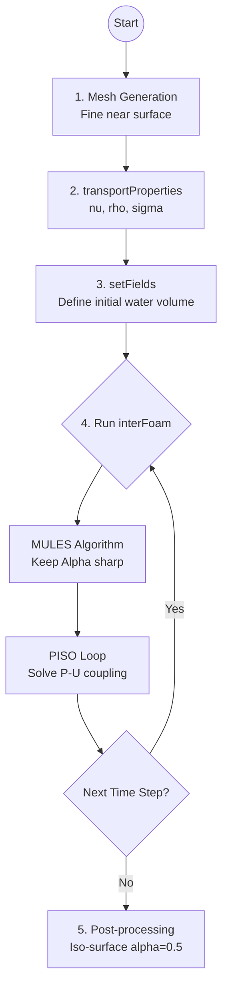

# วิธี VOF และ interFoam (The VOF Method & interFoam)

"Volume of Fluid (VOF)" คือเทคนิคมาตรฐานระดับอุตสาหกรรมสำหรับการจำลองการไหลแบบหลายเฟสที่มีพื้นผิวอิสระ (Free Surface) ชัดเจน เช่น การแตกของเขื่อน (Dam break), คลื่นในทะเล, การฉีดฉีดพ่นละออง (Atomization), หรือฟองอากาศที่ลอยขึ้นผิวน้ำ

OpenFOAM ใช้ VOF ผ่าน Solver ตระกูล `interFoam` ซึ่งเป็นหนึ่งใน Solver ที่ทรงพลังและเสถียรที่สุด

## 🎯 วัตถุประสงค์การเรียนรู้ (Learning Objectives)

เมื่อเรียนจบหัวข้อนี้ ผู้เรียนจะสามารถ:
1.  **เข้าใจหลักการ VOF**: กลไกของตัวแปร $\alpha$ (Phase Fraction) ในแต่ละเซลล์
2.  **Interface Capturing**: วิธีที่คอมพิวเตอร์ติดตามรอยต่อระหว่างน้ำและอากาศ
3.  **Interface Compression**: การแก้ปัญหาหน้าสัมผัสเบลอ (Numerical Diffusion) ด้วยเทคนิค MULES
4.  **การใช้งานจริง**: เชี่ยวชาญการใช้ `setFields`, การตั้งค่า `transportProperties` และการปรับแต่งค่า `cAlpha`
5.  **เสถียรภาพ**: จัดการ Courant Number และ Adaptive Time Stepping สำหรับ VOF

## 🛠️ ขั้นตอนการทำงาน (VOF Workflow)

## 📚 โครงสร้างเนื้อหา (Module Structure)

*   **[01_The_VOF_Concept.md](./01_The_VOF_Concept.md)**: ทฤษฎีพื้นฐานของ Phase Fraction และแนวคิด Pixel-based interface
*   **[02_Interface_Compression.md](./02_Interface_Compression.md)**: เจาะลึกเทอมลับ `div(phirb, alpha)` และอัลกอริทึม MULES
*   **[03_Setting_Up_InterFoam.md](./03_Setting_Up_InterFoam.md)**: คู่มือตั้งค่าเคสปฏิบัติจริง พร้อมการจัดการแรงดันหัวน้ำ ($p_{rgh}$)
*   **[04_Adaptive_Time_Stepping.md](./04_Adaptive_Time_Stepping.md)**: กลยุทธ์การควบคุมเวลาเพื่อให้ Interface ไม่พัง (Courant Number Management)

---
> [!NOTE]
> หัวใจของ VOF ใน OpenFOAM ไม่ใช่แค่การแก้สมการ แต่คือการ **"รักษาความคม (Sharpness)"** ของรอยต่อให้ได้ภายใต้การไหลที่รุนแรง