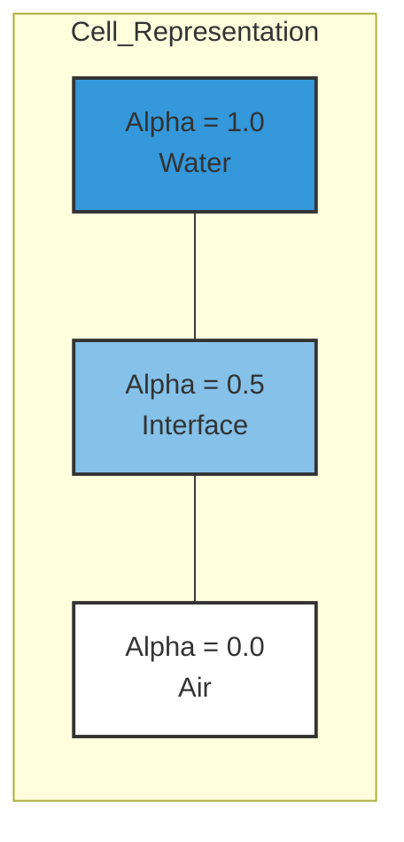
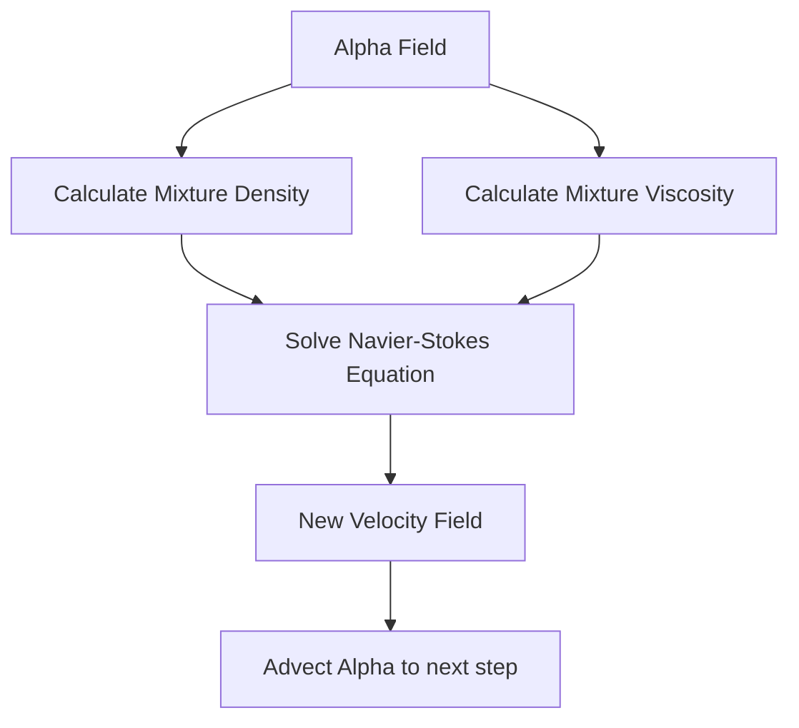
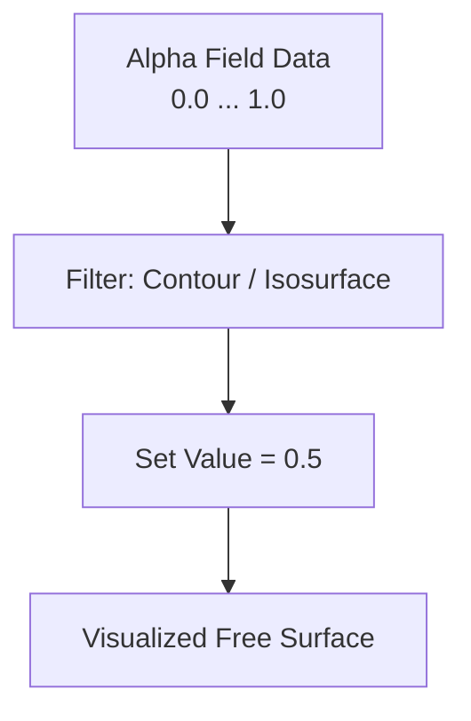

# แนวคิดพื้นฐาน VOF (The Volume of Fluid Concept)

**Volume of Fluid (VOF)** คือเทคนิคการจำลองการไหลแบบหลายเฟส (Multiphase Flow) ที่เป็น "มาตรฐานทองคำ" สำหรับการแก้ปัญหา **Free Surface Flows** (การไหลที่มีรอยต่อชัดเจน)

---

## 💡 แนวคิดเปรียบเทียบ (Analogy): ภาพแบบ Pixel vs Vector

ในการระบุตำแหน่งรอยต่อ (Interface) มี 2 แนวคิดหลัก:
1.  **Explicit Tracking (Vector)**: ลากเส้นตามผิว (เหมือนเอาหนังยางไปวางบนผิวน้ำ) ข้อดีคือคมชัด แต่ข้อเสียคือถ้าผิวขาดหรือรวมกัน (เช่น หยดน้ำรวมตัว) จะคำนวณยากมาก
2.  **VOF (Raster/Pixel)**: ไม่ได้เก็บเส้นผิว แต่เก็บ "ค่าสี" ในแต่ละ Cell ว่ามีน้ำอยู่กี่เปอร์เซ็นต์

## 1. ตัวแปร Phase Fraction (\alpha$)

ใน OpenFOAM เราใช้ตัวแปร `alpha.water` (\alpha$) เป็นตัวบ่งชี้สถานะ:

| ค่า \alpha$ | ความหมาย | สภาพใน Cell |
| :---: | :--- | :--- |
| **1.0** | Full Phase 1 | มีแต่น้ำเต็มเซลล์ |
| **0.0** | Full Phase 2 | มีแต่อากาศเต็มเซลล์ |
| **0 < \alpha$ < 1** | Interface | มีทั้งสองเฟสผสมกัน (รอยต่อ) |

## 2. คุณสมบัติ Mixture (Mixture Properties)

OpenFOAM มองว่าทั้งโดเมนคือของไหลชนิดเดียว (Single Fluid) ที่มีความหนาแน่นและความหนืด "เฉลี่ย" ตามสัดส่วนปริมาตร:

$$ \rho = \alpha \rho_1 + (1 - \alpha) \rho_2 $$
$$ \mu = \alpha \mu_1 + (1 - \alpha) \mu_2 $$

## 3. สมการการขนส่งผิว (The Interface Transport Equation)

รอยต่อเคลื่อนที่ไปตามความเร็วของไหล (\mathbf{U}$) โดยใช้สมการ Advection:

$$ \frac{\partial \alpha}{\partial t} + \nabla \cdot (\mathbf{U} \alpha) = 0 $$

### ปัญหา Numerical Diffusion (ผิวเบลอ)
ในการคำนวณจริง สมการนี้มักทำให้หน้าสัมผัส "เบลอ" ออกไป (Diffusion) จากที่ควรจะเป็นขั้นบันได (Step function) กลายเป็นทางลาด (Slope) ซึ่งจะทำให้แรงตึงผิวและฟิสิกส์ผิดเพี้ยน

> [!WARNING]
> หากผิวเบลอเกิน 3-4 เซลล์ แรงตึงผิว (Surface Tension) จะคำนวณผิดพลาดอย่างรุนแรง เพราะรัศมีความโค้ง (\kappa$) จะเพี้ยนไป

## 4. การแสดงผลใน ParaView (Visualization)

เนื่องจากเราไม่มี "เส้นผิว" จริงๆ เราจึงใช้เทคนิค **Isosurface** เพื่อสร้างผิวจำลองขึ้นมา

**ขั้นตอนใน ParaView:**
1.  Apply ข้อมูล และเลือกตัวแปร `alpha.water`
2.  ใช้ Filter **Contour**
3.  ใน Isosurfaces set ค่าเป็น `0.5`
4.  คุณจะได้พื้นผิวสีขาวที่ตัดแบ่งระหว่างน้ำและอากาศพอดี

## 🔑 สรุปหัวใจ VOF
*   **Mass Conservation:** VOF มีจุดเด่นคือรักษามวลได้ดีเยี่ยม (ของเหลวไม่ค่อยหาย)
*   **Topology Change:** จัดการการแตกตัว/รวมตัวของหยดน้ำและฟองอากาศได้อัตโนมัติ
*   **Computational Cost:** ประหยัดกว่าวิธีติดตามผิวแบบอื่นๆ แต่ต้องการ Mesh ที่ละเอียดบริเวณผิวสัมผัส