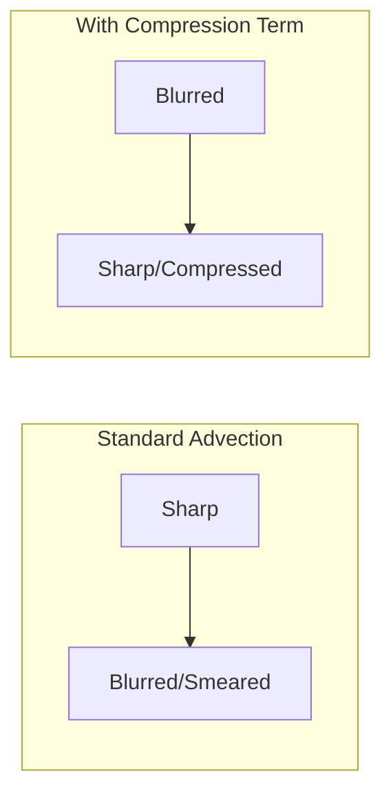

# การบีบอัดผิวหน้าและ MULES (Interface Compression & MULES)

ใน OpenFOAM การที่จะทำให้ VOF มีผิวที่ "คมกริบ" (Sharp) ไม่เบลอเหมือนหมอก เราต้องพึ่งพาเทคนิคพิเศษ 2 อย่างคือ **Artificial Compression** และ **MULES Algorithm**

## 1. เทอมการบีบอัด (The Compression Term)

OpenFOAM เพิ่มเทอมพิเศษเข้าไปในสมการ Advection ของ $\alpha$ เพื่อ "ต้านทาน" การเบลอของรอยต่อ:

$$ \frac{\partial \alpha}{\partial t} + \nabla \cdot (\mathbf{U} \alpha) + \underbrace{\nabla \cdot (\mathbf{U}_r \alpha (1-\alpha))}_{\text{Compression Term}} = 0 $$

### กลไกของ $\alpha(1-\alpha)$
*   เมื่อ $\alpha=1$ (ในน้ำ): $\alpha(1-\alpha) = 0$ (ไม่ทำงาน)
*   เมื่อ $\alpha=0$ (ในอากาศ): $\alpha(1-\alpha) = 0$ (ไม่ทำงาน)
*   **เมื่อ $0 < \alpha < 1$ (ที่รอยต่อ):** เทอมนี้จะทำงาน และสร้างความเร็วสัมพันธ์ $\mathbf{U}_r$ เพื่อบีบให้เฟสทั้งสองวิ่งเข้าหากัน



## 2. การควบคุมความคมด้วย `cAlpha`

ในไฟล์ `system/fvSolution` คุณจะพบค่าพารามิเตอร์ `cAlpha`:
*   `cAlpha 0`: ไม่บีบเลย (ผิวจะเบลอเร็วมาก)
*   `cAlpha 1`: **(Recommended)** บีบพอดีๆ รักษาความคมไว้ที่ประมาณ 2-3 เซลล์
*   `cAlpha > 1`: บีบแรงมาก (ผิวคมมาก แต่อาจเกิดความไม่เสถียรและหน้าตา Mesh แปลกๆ ตรงรอยต่อ)

## 3. MULES Algorithm

**MULES** (Multidimensional Universal Limiter for Explicit Solution) คือพระเอกตัวจริงที่ทำให้ `interFoam` โด่งดัง

### ปัญหาที่ MULES แก้
ตามฟิสิกส์ $\alpha$ ต้องมีค่าระหว่าง $0$ ถึง $1$ เท่านั้น แต่ในทางคณิตศาสตร์ สมการ Advection มักจะ "แกว่ง" (Oscillate) ทำให้ค่าหลุดเป็น $-0.1$ หรือ $1.1$ (ซึ่งไม่มีความหมายทางฟิสิกส์และทำให้ Solver พัง)

**MULES ทำหน้าที่เป็น "ตำรวจ"** ที่คอยคุมให้ $\alpha$ อยู่ในระเบียบ $[0, 1]$ เสมอโดยไม่เสียมวล (Mass Conservative)

```mermaid
flowchart TD
    Update[Calculate Alpha Update] --> Check{Is Alpha in [0,1]?}
    Check -- Yes --> Final[Apply Update]
    Check -- No --> Limit[MULES Limiter: Adjust Fluxes]
    Limit --> Update
```

## 4. การตั้งค่าใน `fvSolution`

ตัวอย่างการตั้งค่าที่เป็นมาตรฐานสำหรับงาน VOF:

```cpp
solvers
{
    "alpha.water.*"
    {
        nAlphaCorr      1;      // จำนวนรอบการแก้สมการ Alpha (Corrector)
        nAlphaSubCycles 2;      // ซอยย่อย Time Step เฉพาะของ Alpha เพื่อความนิ่ง
        cAlpha          1;      // ระดับการบีบอัดผิว
        
        MULESCorr       yes;    // เปิดใช้ MULES Corrector
        nLimiterIter    3;      // จำนวนรอบการคำนวณ Limiter
        
        solver          smoothSolver;
        smoother        symGaussSeidel;
        tolerance       1e-8;
        relTol          0;
    }
}
```

> [!TIP]
> **Sub-cycling คือทางรอด!**
> การตั้ง `nAlphaSubCycles 2` หรือมากกว่า ช่วยให้เราสามารถใช้ Time Step ของการไหลที่ใหญ่ขึ้นได้ โดยที่ Interface ยังคงเสถียร เพราะสมการ $\alpha$ ถูกซอยย่อยคำนวณถี่กว่าเพื่อน

## 5. MULES รุ่นต่างๆ
*   **Explicit MULES:** มาตรฐาน ดั้งเดิม เสถียรที่สุดสำหรับ Co < 1
*   **Semi-Implicit MULES:** ช่วยให้รันได้ที่ Co > 1 ได้เล็กน้อย (แต่ไม่แนะนำสำหรับผิวที่ต้องการความละเอียดสูง)
*   **ISO-MULES / interIsoFoam:** เทคนิคใหม่ที่ใช้ Geometric Reconstruction (คล้าย PLIC) ให้ผิวคมกว่า MULES แบบปกติ