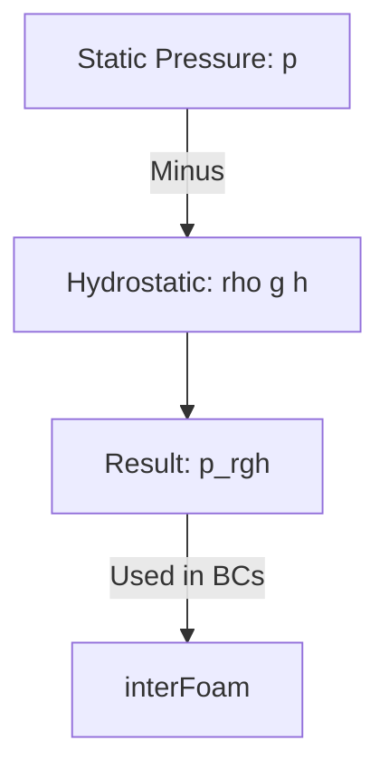

# การตั้งค่าเคส interFoam (Setting Up interFoam)

การรัน `interFoam` มีความแตกต่างจากการรันน้ำชั้นเดียว (Single phase) ตรงที่ต้องมีการระบุเฟสเริ่มต้นและสมบัติของทั้งสองของไหล

## 1. การเทน้ำลงในโดเมนด้วย `setFields`

ที่เวลา $t=0$ เราต้องบอก OpenFOAM ว่าตรงไหนคือน้ำ ตรงไหนคืออากาศ ผ่านไฟล์ `system/setFieldsDict`

```cpp
defaultFieldValues
(
    volScalarFieldValue alpha.water 0 // เริ่มต้นคืออากาศทั้งหมด
);

regions
(
    // กำหนดกล่องน้ำ (Dam)
    boxToCell
    {
        box (0 0 0) (0.146 0.292 1); // พิกัด x_min y_min z_min -> x_max y_max z_max
        fieldValues
        (
            volScalarFieldValue alpha.water 1 // เปลี่ยนค่าในกล่องนี้ให้เป็นน้ำ
        )
    }
);
```
**คำสั่งรัน:** `setFields` (หลัง `blockMesh`)

## 2. สมบัติของของไหล (`constant/transportProperties`)

เราต้องกำหนดคุณสมบัติแยกตามเฟส และระบุแรงตึงผิว (Surface Tension)

```cpp
phases (water air);

water
{
    transportModel  Newtonian;
    nu              1e-06;    // ความหนืดจลน์ (m2/s)
    rho             1000;     // ความหนาแน่น (kg/m3)
}

air
{
    transportModel  Newtonian;
    nu              1.48e-05;
    rho             1.2;
}

sigma           0.07;         // แรงตึงผิวระหว่างน้ำ-อากาศ (N/m)
```

## 3. เงื่อนไขขอบเขต (`0/alpha.water`)

เงื่อนไขที่สำคัญที่สุดคือทางระบายอากาศ (Atmosphere)

```cpp
boundaryField
{
    walls
    {
        type            zeroGradient; // ผนังปกติ
    }
    
    atmosphere
    {
        type            inletOutlet;   // ยอมให้ไหลออก แต่ถ้าไหลเข้าให้เป็นค่าที่กำหนด
        inletValue      uniform 0;     // ถ้าไหลย้อนกลับ ให้ถือว่าเป็นอากาศ (0)
        value           uniform 0;
    }
}
```

## 4. ปริศนาของแรงดัน $p_rgh$

ใน Solver หลายเฟส OpenFOAM จะแก้สมการของ **"แรงดันหัวน้ำ" ($p_rgh$)** แทนแรงดันปกติ ($p$)

$$ p_{rgh} = p - \rho \mathbf{g} \cdot \mathbf{h} $$



**ทำไมต้องใช้ $p_rgh$?**
เพื่อให้ตั้งค่า Boundary Condition ได้ง่ายขึ้น โดยเฉพาะขอบเขตที่เปิดสู่ชั้นบรรยากาศ (`totalPressure` หรือ `fixedValue 0`) โดยที่ระบบจะคำนวณแรงดัน Hydrostatic ตามความสูง ($h$) ให้เราอัตโนมัติ

> [!WARNING]
> ในโฟลเดอร์ `0/` คุณต้องเตรียมไฟล์ชื่อ `p_rgh` ไม่ใช่ `p` (ถ้าใส่ `p` มาอย่างเดียว Solver จะแจ้ง Error ทันที)

## 5. การระบุกระแสไฟฟ้าและแรงโน้มถ่วง
อย่าลืมตรวจสอบไฟล์ `constant/g` ว่าระบุทิศทางแรงโน้มถ่วงถูกแกนหรือไม่:
```cpp
dimensions      [0 1 -2 0 0 0 0];
value           (0 -9.81 0); // ในที่นี้แรงโน้มถ่วงลงตามแกน Y
```