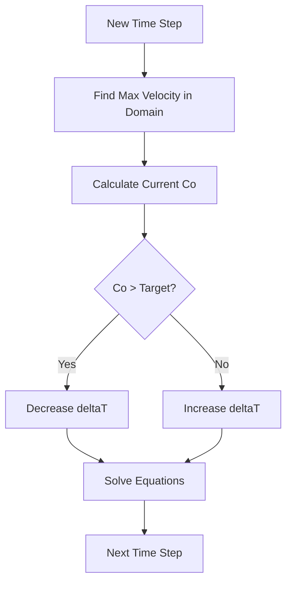

# การปรับ Time Step แบบอัตโนมัติ (Adaptive Time Stepping)

ปัญหาที่น่าปวดหัวที่สุดของ VOF คือ **"รันไปซักพักแล้วระเบิด"** หรือ **"ผิวเบลอจนมองไม่ออกว่าเป็นน้ำ"** สาเหตุส่วนใหญ่มาจาก Time Step ที่ใหญ่เกินไป

## 1. ข้อจำกัดของ Courant Number ($Co$)

ในการจำลองรอยต่อ (Interface) เราต้องการความแม่นยำสูงมาก อัลกอริทึม MULES ถูกออกแบบมาให้เสถียรที่สุดเมื่อ $Co < 1$

$$ Co = \frac{|\mathbf{U}| \Delta t}{\Delta x} $$

*   **$Co < 0.5$:** (อุดมคติ) ผิวคมชัดมาก เสถียรสูง
*   **$0.5 < Co < 1.0$:** ยอมรับได้สำหรับงานส่วนใหญ่
*   **$Co > 1.0$:** Interface จะเริ่ม "แตก" หรือเบลอ (Numerical Diffusion) และมักจะพังในที่สุด

## 2. กลยุทธ์การปรับ $\Delta t$ อัตโนมัติ

แทนที่เราจะกำหนด `deltaT` เป็นค่าคงที่ เราจะให้ OpenFOAM คำนวณหาค่าที่เหมาะสมที่สุดในทุกๆ รอบการคำนวณ



## 3. การตั้งค่าใน `system/controlDict`

```cpp
adjustTimeStep  yes;    // เปิดระบบปรับอัตโนมัติ

maxCo           0.5;    // เป้าหมาย Courant Number ของความเร็ว
maxAlphaCo      0.5;    // เป้าหมาย Courant Number เฉพาะที่รอยต่อ (สำคัญที่สุด!)

maxDeltaT       1.0;    // ลิมิตห้ามเกิน 1 วินาที (กันระบบเหวี่ยง)
```

### ทำไมต้องมี `maxAlphaCo`?
เพราะในบางครั้ง ความเร็วลมในที่ว่างอาจจะสูงมาก (ทำให้ `maxCo` สูง) แต่ที่รอยต่อของน้ำความเร็วอาจจะต่ำกว่ามาก เราจึงแยกการคุม $Co$ เฉพาะที่ผิวสัมผัสออกมา เพื่อไม่ให้ Time Step เล็กเกินความจำเป็น

## 4. กลไก Sub-cycling

หากเราต้องการให้รันเร็วขึ้น แต่ยังรักษาความคมของผิวไว้ได้ `interFoam` มีระบบ **Sub-cycling**:
1.  แก้สมการ Momentum 1 ครั้ง (ด้วย Time Step $\Delta t$)
2.  แก้สมการ $\alpha$ จำนวน $N$ รอบ (ด้วย Time Step ย่อย $\Delta t / N$)

วิธีนี้ช่วยให้เราใช้ค่า `maxCo` ที่สูงขึ้นได้ (เช่น 1.0) ในขณะที่ $Co$ จริงๆ ของ $\alpha$ จะถูกซอยย่อยจนเหลือ $0.5$ อัตโนมัติ

> [!TIP]
> **การตัดสินใจใช้ Adaptive Time Step:**
> *   หากงานเป็น **Steady State** (เช่น น้ำไหลผ่านท่อนิ่งๆ): อาจใช้ Fixed Time Step ได้
> *   หากงานเป็น **Transient** (เช่น คลื่นซัด, ของหก): **"ต้อง"** ใช้ Adaptive Time Step เสมอเพื่อความเสถียร

## 5. อาการเมื่อ Time Step ใหญ่เกินไป
*   ค่า `alpha` เริ่มหลุดต่ำกว่า 0 หรือสูงกว่า 1 (ดูได้จาก Log)
*   รอยต่อ (Contour 0.5) เริ่มหยัก หรือขาดเป็นท่อนๆ
*   Solver แจ้งว่า `Continuity error` มีค่าสูงขึ้นเรื่อยๆ
*   สุดท้าย... `Floating point exception` (Simulation ระเบิด)