# ภาพรวมสมการอ้างอิงการไหลแบบหลายเฟส (Multiphase Flow Equations Reference Overview)

เอกสารนี้เป็นศูนย์รวมของสมการทางคณิตศาสตร์ที่สำคัญสำหรับการจำลองการไหลแบบหลายเฟสใน OpenFOAM ครอบคลุมตั้งแต่ทฤษฎีพื้นฐาน การอนุรักษ์ ปรากฏการณ์ระหว่างเฟส และการนำไปใช้ในการคำนวณ

> [!INFO] **ขอบเขตและความครอบคลุม**
> เอกสารอ้างอิงนี้ทำหน้าที่เป็นคู่มือทางเทคนิคที่ครบถ้วนสำหรับการจำลองการไหลแบบหลายเฟส โดยเชื่อมโยงระหว่างพื้นฐานทางทฤษฎีกับการนำไปปฏิบัติใน OpenFOAM เนื้อหาครอบคลุมตั้งแต่กฎการอนุรักษ์พื้นฐานไปจนถึงหัวข้อขัั้นสูง เช่น การไหลแบบแกรนูลาร์และระบบหลายเฟสแบบอัดตัวได้

---

## สารบัญ (Table of Contents)

เอกสารนี้ประกอบด้วยหัวข้อหลักต่อไปนี้:

```mermaid
flowchart TD
classDef implicit fill:#e1f5fe,stroke:#01579b,stroke-width:2px,color:#000
classDef explicit fill:#fff3e0,stroke:#e65100,stroke-width:2px,color:#000
classDef context fill:#f5f5f5,stroke:#616161,stroke-width:1px,color:#000,stroke-dasharray: 5 5
A["Reference Equations"]:::context --> B["Fundamentals"]:::implicit
A --> C["Conservation Laws"]:::implicit
A --> D["Interfacial Phenomena"]:::explicit
A --> E["Closure Relations"]:::explicit
A --> F["Special Cases"]:::context

B --> B1["Phase Averaging"]:::implicit
B --> B2["Conservation Framework"]:::implicit

C --> C1["Mass"]:::implicit
C --> C2["Momentum"]:::implicit
C --> C3["Energy"]:::implicit

D --> D1["Surface Tension"]:::explicit
D --> D2["Interphase Forces"]:::explicit
D --> D3["Heat Transfer"]:::explicit

E --> E1["Viscosity Models"]:::explicit
E --> E2["Drag Models"]:::explicit
E --> E3["Turbulence Models"]:::explicit

F --> F1["Incompressible"]:::context
F --> F2["Granular"]:::context
F --> F3["Compressible"]:::context
```



---

## สูตรสมการหลัก (Key Governing Equations)

### สมการอนุรักษ์มวล (Mass Conservation Equation)

สำหรับแต่ละเฟส $k$ ในระบบหลายเฟส:

$$\frac{\partial}{\partial t}(\alpha_k \rho_k) + \nabla \cdot (\alpha_k \rho_k \mathbf{u}_k) = \dot{m}_k \tag{1}$$

**นิยามตัวแปร:**
- $\alpha_k$ = สัดส่วนปริมาตรของเฟส $k$ ($\sum_k \alpha_k = 1$)
- $\rho_k$ = ความหนาแน่นของเฟส $k$ ($\text{kg/m}^3$)
- $\mathbf{u}_k$ = เวกเตอร์ความเร็วของเฟส $k$ ($\text{m/s}$)
- $\dot{m}_k$ = อัตราการถ่ายเทมวลเชิงปริมาตร ($\text{kg/(m}^3\cdot\text{s)}$)

> [!INFO] ข้อจำกัดสัดส่วนปริมาตร
> ผลรวมของสัดส่วนปริมาตรทุกเฟสต้องเท่ากับ 1: $\sum_{k=1}^{N} \alpha_k = 1$

สำหรับเฟสที่อัดตัวไม่ได้ ($\rho_k = \text{คงที่}$):

$$\frac{\partial \alpha_k}{\partial t} + \nabla \cdot (\alpha_k \mathbf{u}_k) = \frac{\dot{m}_k}{\rho_k} \tag{2}$$

### สมการอนุรักษ์โมเมนตัม (Momentum Conservation Equation)

สำหรับเฟส $k$:

$$\frac{\partial}{\partial t}(\alpha_k \rho_k \mathbf{u}_k) + \nabla \cdot (\alpha_k \rho_k \mathbf{u}_k \mathbf{u}_k) = -\alpha_k \nabla p + \nabla \cdot (\alpha_k \boldsymbol{\tau}_k) + \alpha_k \rho_k \mathbf{g} + \mathbf{M}_k \tag{3}$$

**นิยามตัวแปร:**
- $p$ = ความดัน ($\text{Pa}$)
- $\boldsymbol{\tau}_k$ = เทนเซอร์ความเค้นหนืดของเฟส $k$
- $\mathbf{g}$ = เวกเตอร์ความเร่งโน้มถ่วง ($\text{m/s}^2$)
- $\mathbf{M}_k$ = การถ่ายเทโมเมนตัมระหว่างเฟส ($\text{N/m}^3$)

**เทนเซอร์ความเค้นสำหรับของไหลนิวตัน (Newtonian Fluids):**
$$\boldsymbol{\tau}_k = \mu_k \left( \nabla \mathbf{u}_k + (\nabla \mathbf{u}_k)^T \right) - \frac{2}{3}\mu_k (\nabla \cdot \mathbf{u}_k)\mathbf{I} \tag{4}$$

### สมการอนุรักษ์พลังงาน (Energy Conservation Equation)

สำหรับเฟส $k$ ในรูปแบบเอนทัลปีจำเพาะ:

$$\frac{\partial}{\partial t}(\alpha_k \rho_k h_k) + \nabla \cdot (\alpha_k \rho_k \mathbf{u}_k h_k) = \alpha_k \frac{\partial p}{\partial t} + \nabla \cdot (\alpha_k k_k \nabla T_k) + \dot{q}_k + \dot{m}_k h_{k,int} + \mathbf{M}_k \cdot \mathbf{u}_k \tag{5}$$

**นิยามตัวแปร:**
- $h_k$ = เอนทัลปีจำเพาะของเฟส $k$ ($\text{J/kg}$)
- $k_k$ = สภาพนำความร้อนของเฟส $k$ ($\text{W/(m·K)}$)
- $T_k$ = อุณหภูมิของเฟส $k$ ($\text{K}$)
- $\dot{q}_k$ = อัตราการถ่ายเทความร้อนระหว่างเฟส ($\text{W/m}^3$)
- $h_{k,int}$ = เอนทัลปีที่พื้นผิวสัมผัส ($\text{J/kg}$)

---

## กรอบการทำงานทางคณิตศาสตร์ (Mathematical Framework)

### ทฤษฎีการหาค่าเฉลี่ยเฟส (Phase Averaging Theory)

การจำลองการไหลแบบหลายเฟสแบบ Eulerian พิจารณาแต่ละเฟสเป็นเนื้อเดียวกันที่แทรกซึมอยู่ในโดเมนเดียวกัน โดยมีสัดส่วนปริมาตร (volume fraction) $\alpha_k$ ที่เป็นไปตามเงื่อนไข:

$$\sum_{k=1}^{N} \alpha_k = 1 \tag{6}$$

### ทฤษฎีบทการหาค่าเฉลี่ยเชิงปริภูมิ (Spatial Averaging Theorem)

$$\langle \nabla \phi_k \rangle_V = \nabla \langle \phi_k \rangle_V + \frac{1}{V_k} \int_{A_k} \phi_k \mathbf{n}_k \, \mathrm{d}A \tag{7}$$

เทอมที่สองแสดงถึงส่วนที่เกิดจากพื้นผิวรอยต่อเนื่องจากการไม่ต่อเนื่องของฟิลด์

### ทฤษฎีบทการหาค่าเฉลี่ยเชิงเวลา (Temporal Averaging Theorem)

$$\left\langle \frac{\partial \phi_k}{\partial t} \right\rangle_V = \frac{\partial}{\partial t} \langle \phi_k \rangle_V - \frac{1}{V_k} \int_{A_k} \phi_k \mathbf{u}_i \cdot \mathbf{n}_k \, \mathrm{d}A \tag{8}$$

เทอมที่สองแสดงถึงฟลักซ์ที่พื้นผิวรอยต่อเนื่องจากการเคลื่อนที่ของส่วนต่อประสาน

---

## การถ่ายเทโมเมนตัมระหว่างเฟส (Interfacial Momentum Transfer)

### แรงฉุด (Drag Force)

$$\mathbf{M}_{kj}^{drag} = K_{kj}(\mathbf{u}_j - \mathbf{u}_k) \tag{9}$$

โดยที่สัมประสิทธิ์แรงฉุด $K_{kj}$ สำหรับเฟสที่กระจายตัว:

$$K_{kj} = \frac{3}{4} C_D \frac{\alpha_k \alpha_l \rho_m}{d_p} |\mathbf{u}_k - \mathbf{u}_l| \tag{10}$$

| แบบจำลอง | สมการค่าสัมประสิทธิ์แรงฉุด | เลขเรย์โนลด์ส |
|-----------|-----------------------------------|---------------------|
| **Schiller-Naumann** | $C_D = \begin{cases}24(1 + 0.15 Re^{0.687})/Re & Re \leq 1000 \\ 0.44 & Re > 1000\end{cases}$ | $Re = \frac{\rho_l \|\mathbf{u}_l - \mathbf{u}_k\| d_{kl}}{\mu_l}$ |
| **Morsi-Alexander** | $C_D = \sum_{i=1}^4 \frac{a_i}{Re^i}$ | เหมือนกัน |

### แรงยก (Lift Force)

$$\mathbf{M}_{kj}^{lift} = C_L \rho_k \alpha_k \alpha_j (\mathbf{u}_j - \mathbf{u}_k) \times (\nabla \times \mathbf{u}_k) \tag{11}$$

### แรงมวลเสมือน (Virtual Mass Force)

$$\mathbf{M}_{kj}^{vm} = C_{vm} \rho_k \alpha_k \alpha_j \left(\frac{\mathrm{D}\mathbf{u}_j}{\mathrm{D}t} - \frac{\mathrm{D}\mathbf{u}_k}{\mathrm{D}t}\right) \tag{12}$$

โดยที่ $C_{vm} = \frac{1}{2}$ สำหรับอนุภาคทรงกลม

### แรงกระจายจากความปั่นป่วน (Turbulent Dispersion Force)

$$\mathbf{M}_{kj}^{td} = -C_{TD} K_{kj} \nabla \alpha_l \tag{13}$$

---

## ปรากฏการณ์ระหว่างเฟส (Interfacial Phenomena)

### แรงตึงผิว (Surface Tension Effects)

#### สมการ Young-Laplace

$$\Delta p = \sigma \kappa \tag{14}$$

**นิยามตัวแปร:**
- $\sigma$ = สัมประสิทธิ์แรงตึงผิว ($\text{N/m}$)
- $\kappa$ = ความโค้งเฉลี่ย ($\text{m}^{-1}$)

สำหรับพื้นผิวทรงกลม: $\Delta p = \frac{2\sigma}{R}$

#### แบบจำลองแรงต่อเนื่องที่พื้นผิว (CSF Model)

$$\mathbf{F}_{st} = \sigma \kappa \nabla \alpha \tag{15}$$

#### ความโค้ง (Curvature Calculation)

$$\kappa = \nabla \cdot \mathbf{n} = \nabla \cdot \left( \frac{\nabla \alpha}{|\nabla \alpha|} \right) \tag{16}$$

### ผลของ Marangoni (Marangoni Effects)

เกิดจากการเปลี่ยนแปลงของแรงตึงผิวตามตำแหน่งอันเนื่องมาจากความแตกต่างของอุณหภูมิ:

$$\boldsymbol{\tau}_{Marangoni} = \nabla_s \sigma = \frac{\partial \sigma}{\partial T} \nabla_s T \tag{17}$$

โดยที่ $\nabla_s$ คือตัวดำเนินการเกรเดียนต์บนพื้นผิว:

$$\nabla_s = (\mathbf{I} - \mathbf{n}\mathbf{n}) \cdot \nabla \tag{18}$$

### มุมสัมผัส (Contact Angle)

กำหนดโดยสมการ Young:

$$\cos \theta = \frac{\sigma_{sg} - \sigma_{sl}}{\sigma_{lg}} \tag{19}$$

**ระบอบการเปียก (Wetting Regimes):**

| ชนิดการเปียก | ช่วงมุมสัมผัส | เงื่อนไขพลังงาน | ลักษณะการเปียก |
|---------------|-----------------|-------------------|----------------|
| **เปียกสมบูรณ์** | $\theta = 0°$ | $\sigma_{sg} - \sigma_{sl} = \sigma_{lg}$ | แผ่กระจายเต็มที่ |
| **เปียกบางส่วน** | $0° < \theta < 90°$ | $\sigma_{sg} > \sigma_{sl}$ | เปียกบางส่วน |
| **ไม่เปียก** | $90° < \theta < 180°$ | $\sigma_{sg} < \sigma_{sl}$ | เกาะเป็นหยด |
| **ไม่เปียกสมบูรณ์** | $\theta = 180°$ | $\sigma_{sg} - \sigma_{sl} = -\sigma_{lg}$ | หยดทรงกลม |

---

## การสร้างแบบจำลองความปั่นป่วน (Turbulence Modeling)

### แบบจำลอง $k$-$\epsilon$ สำหรับเฟส $k$

**สมการพลังงานจลน์ความปั่นป่วน (Turbulent Kinetic Energy):**

$$\frac{\partial}{\partial t}(\alpha_k \rho_k k_k) + \nabla \cdot (\alpha_k \rho_k \bar{\mathbf{u}}_k k_k) = \nabla \cdot \left( \alpha_k \frac{\mu_{k,t}}{\sigma_k} \nabla k_k \right) + \alpha_k P_k - \alpha_k \rho_k \epsilon_k \tag{20}$$

**สมการอัตราการสลาย (Dissipation Rate):**

$$\frac{\partial}{\partial t}(\alpha_k \rho_k \epsilon_k) + \nabla \cdot (\alpha_k \rho_k \bar{\mathbf{u}}_k \epsilon_k) = \nabla \cdot \left( \alpha_k \frac{\mu_{k,t}}{\sigma_\epsilon} \nabla \epsilon_k \right) + \alpha_k C_{\epsilon 1} \frac{\epsilon_k}{k_k} P_k - \alpha_k C_{\epsilon 2} \rho_k \frac{\epsilon_k^2}{k_k} \tag{21}$$

### ความหนืดแบบปั่นป่วน (Turbulent Viscosity)

$$\mu_{k,t} = \rho_k C_\mu \frac{k_k^2}{\epsilon_k} \tag{22}$$

### ความปั่นป่วนที่เกิดจากฟองอากาศ (Bubble-Induced Turbulence)

แบบจำลองของ Sato:

$$\mu_{t,BIT} = \rho_l C_\mu^{BIT} \alpha_b d_b \|\mathbf{u}_b - \mathbf{u}_l\| \tag{23}$$

### การปรับเปลี่ยนความปั่นป่วน (Turbulence Modulation)

$$\mu_{t,eff} = \mu_t (1 - \alpha_p)^n \tag{24}$$

---

## กรณีพิเศษ (Special Cases)

### การไหลแบบอัดตัวไม่ได้ (Incompressible Flow)

สำหรับ $\rho_k = \text{คงที่}$:

$$\frac{\partial \alpha_k}{\partial t} + \nabla \cdot (\alpha_k \mathbf{u}_k) = \frac{\dot{m}_k}{\rho_k} \tag{25}$$

### การไหลแบบแกรนูลาร์ (Granular Flow)

#### อุณหภูมิแกรนูลาร์ (Granular Temperature)

$$\Theta_s = \frac{1}{3} \langle \mathbf{c} \cdot \mathbf{c} \rangle \tag{26}$$

โดยที่ $\mathbf{c}$ คือความเร็วที่เปลี่ยนแปลงไปของอนุภาค

#### ความดันแกรนูลาร์ (Granular Pressure)

$$p_s = \rho_s \Theta_s \left[ 1 + 2g_0 \alpha_s (1 + e) \right] \tag{27}$$

**นิยามตัวแปร:**
- $g_0$ = ฟังก์ชันการกระจายตัวในแนวรัศมี
- $e$ = สัมประสิทธิ์การคืนตัว

#### การสูญเสียจากการชนกัน (Collisional Dissipation)

$$\gamma_\Theta = 3(1 - e^2) g_0 \alpha_s^2 \rho_s d_p \Theta_s^{3/2} \tag{28}$$

#### ความหนืดแกรนูลาร์ (Granular Viscosity)

$$\mu_s = \frac{\rho_s d_p \sqrt{\Theta_s}}{6} \left[ \frac{1}{g_0(1+e)} + \frac{8}{5} \alpha_s (1+e) \right] \tag{29}$$

### การไหลแบบอัดตัวได้ (Compressible Flow)

#### ความเร็วเสียงในสารผสม (Speed of Sound in Mixtures)

สมการของ Wood:

$$\frac{1}{c_{mix}^2} = \sum_k \frac{\alpha_k}{\rho_k c_k^2} \tag{30}$$

สำหรับระบบสองเฟส:

$$\frac{1}{c_{mix}^2} = \frac{\alpha_l}{\rho_l c_l^2} + \frac{\alpha_g}{\rho_g c_g^2} \tag{31}$$

#### สภาวะการไหลวิกฤต (Critical Flow Conditions)

$$G_{cr}^{HEM} = \sqrt{ \left[ \frac{x}{v_g} + \frac{(1-x)}{v_l} \right] \left[ \frac{x}{\rho_g c_g^2} + \frac{(1-x)}{\rho_l c_l^2} \right] } \tag{32}$$

---

## ความสัมพันธ์ปิด (Closure Relations)

### สมการสถานะ (Equations of State)

#### กฎของแก๊สอุดมคติ (Ideal Gas Law)

$$p = \rho R T \tag{33}$$

#### สมการแวนเดอร์วาลส์ (van der Waals Equation)

$$\left(p + \frac{a\rho^2}{M^2}\right)\left(\frac{1}{\rho} - \frac{b}{M}\right) = R T \tag{34}$$

### คุณสมบัติการขนส่ง (Transport Properties)

#### แบบจำลองความหนืดเชิงอุณหภูมิ (Temperature-Dependent Viscosity)

$$\mu = \mu_0 \exp\left(\frac{E}{RT}\right) \tag{35}$$

#### ทฤษฎี Chapman-Enskog สำหรับแก๊ส (Chapman-Enskog Theory for Gases)

$$k = \frac{5}{4} \mu c_p \tag{36}$$

### คุณสมบัติของสารผสม (Mixture Properties)

#### ความหนาแน่นเฉลี่ย (Effective Density)

$$\rho_{mix} = \sum_k \alpha_k \rho_k \tag{37}$$

#### ความหนืดเฉลี่ย (Effective Viscosity)

$$\mu_{mix} = \sum_k \alpha_k \mu_k \tag{38}$$

#### การนำความร้อนเฉลี่ย (Effective Thermal Conductivity)

$$k_{mix} = \sum_k \alpha_k k_k \tag{39}$$

---

## การนำไปใช้ใน OpenFOAM (Implementation in OpenFOAM)

### โครงสร้าง Solver หลัก (Main Solver Structure)

```cpp
// Main time loop for multiphase flow simulation
while (runTime.loop())
{
    // Update time step based on Courant number
    #include "CourantNo.H"

    // Momentum prediction step
    #include "UEqn.H"

    // Pressure-velocity coupling loop
    for (int corr = 0; corr < nCorr; corr++)
    {
        #include "pEqn.H"
    }

    // Volume fraction correction
    #include "alphaEqns.H"

    // Turbulence model correction
    turbulence->correct();

    // Write results
    runTime.write();
}
```

> **📚 Source:** `.applications/solvers/multiphase/multiphaseEulerFoam`

> **คำอธิบาย (Explanation):**
> - โครงสร้างหลักของ solver การไหลแบบ Eulerian หลายเฟสใน OpenFOAM
> - ลูปเวลาหลักควบคุมการวิวัฒนาการของการคำนวณ
> - การคาดคะเนโมเมนตัมแยกจากการแก้สมการความดัน
> - การจับคู่ความดัน-ความเร็วทำซ้ำจนกว่าจะลู่เข้า
> - สัดส่วนปริมาตรถูกแก้ไขหลังจากการแก้สมการโมเมนตัม

> **แนวคิดสำคัญ (Key Concepts):**
> - **Fractional Step Method**: การแยกการแก้สมการโมเมนตัมและความดัน
> - **Pressure-Velocity Coupling**: การจับคู่ความดันและความเร็วเพื่อรักษาความสอดคล้อง
> - **Phase Fraction Transport**: การขนส่งสัดส่วนปริมาตรแต่ละเฟส
> - **Turbulence Modeling**: การแก้ไขแบบจำลองความปั่นป่วนในแต่ละขั้นเวลา

### การเลือกแบบจำลอง (Model Selection)

#### การเลือกแบบจำลองแรงฉุด (Drag Model Selection)

```cpp
dragModels
{
    phase1Phase2
    {
        type        SchillerNaumann;
        residuals   1e-4;
        maxIter     1000;
    }
}
```

> **📂 Source:** `.applications/solvers/multiphase/multiphaseEulerFoam/interfacialModels/dragModels/SchillerNaumann`

> **คำอธิบาย (Explanation):**
> - การตั้งค่าแบบจำลองแรงฉุดสำหรับคู่เฟส phase1-phase2
> - แบบจำลอง Schiller-Naumann เหมาะสำหรับฟองแก๊สและหยดของเหลว
> - ค่า residuals และ maxIter ควบคุมความแม่นยำของการแก้ไข
> - แบบจำลองแรงฉุดต่างๆ มีให้เลือกในไลบรารี `libeulerianInterfacialModels`

> **แนวคิดสำคัญ (Key Concepts):**
> - **Drag Coefficient**: สัมประสิทธิ์แรงต้านขึ้นกับเลขเรย์โนลด์ส
> - **Schiller-Naumann Model**: เหมาะสำหรับฟองทรงกลมในช่วงเลขเรย์โนลด์สกว้าง
> - **Interfacial Area**: พื้นที่ผิวสัมผัสระหว่างเฟสสำคัญต่อการคำนวณแรง
> - **Convergence Criteria**: การกำหนดค่าความคลาดเคลื่อนที่ยอมรับได้

#### การเลือกแบบจำลองความปั่นป่วน (Turbulence Model Selection)

```cpp
simulationType RAS;
RAS
{
    RASModel        kEpsilon;
    turbulence      on;
    printCoeffs     on;
}
```

> **📂 Source:** `.applications/solvers/multiphase/multiphaseEulerFoam`

> **คำอธิบาย (Explanation):**
> - การเลือกแบบจำลองความปั่นป่วนแบบ RANS (Reynolds-Averaged Navier-Stokes)
> - แบบจำลอง k-ε เป็นแบบมาตรฐานสำหรับการไหลแบบปั่นป่วน
> - การเปิดใช้งาน turbulence จะเพิ่มสมการ k และ ε
> - ค่าสัมประสิทธิ์ของแบบจำลองจะถูกพิมพ์ออกมาเมื่อ printCoeffs เปิด

> **แนวคิดสำคัญ (Key Concepts):**
> - **RANS Modeling**: การหาค่าเฉลี่ยสมการตามเวลาของ Reynolds
> - **k-ε Model**: แบบจำลองสองสมการสำหรับพลังงานจลน์และอัตราการสลาย
> - **Turbulence Modulation**: การปรับเปลี่ยนความปั่นป่วนโดยอนุภาคกระจาย
> - **Model Coefficients**: ค่าคงที่ในแบบจำลองที่สามารถปรับเปลี่ยนได้

### Solver ที่เกี่ยวข้อง (Related Solvers)

| Solver | การใช้งาน | คุณสมบัติ |
|--------|--------------|-------------|
| **multiphaseEulerFoam** | การไหลหลายเฟสแบบ Eulerian | แรงฉุด, แรงยก, แรงมวลเสมือน |
| **interFoam** | การไหล 2 เฟสด้วย VOF | แรงตึงผิว, การติดตามรอยต่อ |
| **compressibleInterFoam** | การไหล 2 เฟสแบบอัดตัวได้ | การอัดตัว, การเปลี่ยนเฟส |

---

## หลักการเชิงตัวเลข (Numerical Considerations)

### เงื่อนไขความเสถียร (Stability Criteria)

#### เงื่อนไข CFL (CFL Condition)

$$\mathrm{CFL} = \frac{|\mathbf{u}|\Delta t}{\Delta x} < \mathrm{CFL}_{max} \tag{40}$$

ค่าทั่วไป: $\mathrm{CFL}_{max} \approx 0.5$ สำหรับรูปแบบการคำนวณแบบชัดเจน

#### เงื่อนไขความเสถียรของสัดส่วนเฟส (Phase Fraction Stability)

$$\Delta t < \frac{\alpha_k \Delta x^2}{D_k} \tag{41}$$

### วิธีการจับการไหลที่รอยต่อ (Interface Capturing Methods)

#### วิธี VOF (Volume of Fluid Method)

$$\frac{\partial \alpha}{\partial t} + \nabla \cdot (\alpha \mathbf{u}) + \nabla \cdot (\alpha (1-\alpha) \mathbf{u}_r) = 0 \tag{42}$$

#### วิธี Level Set

$$\frac{\partial \phi}{\partial t} + \mathbf{u} \cdot \nabla \phi = 0 \tag{43}$$

---

## การวิเคราะห์แบบไร้มิติ (Dimensionless Analysis)

### เลขมิติสำคัญ (Key Dimensionless Numbers)

| ชื่อ | สมการ | ความหมาย |
|------|---------|------------|
| **เลขเรย์โนลด์ส** | $Re_k = \frac{\rho_k \|\mathbf{u}_k\| L}{\mu_k}$ | อัตราส่วนระหว่างแรงเฉื่อยและแรงหนืด |
| **เลขฟรูด** | $Fr_k = \frac{|\mathbf{u}_k\|^2}{gL}$ | อัตราส่วนระหว่างแรงเฉื่อยและแรงโน้มถ่วง |
| **เลขวีเบอร์** | $We_k = \frac{\rho_k \|\mathbf{u}_k\|^2 L}{\sigma}$ | อัตราส่วนระหว่างแรงเฉื่อยและแรงตึงผิว |
| **เลขเออเวอส** | $Eo = \frac{(\rho_k - \rho_l) g d_p^2}{\sigma}$ | อัตราส่วนระหว่างแรงโน้มถ่วงและแรงตึงผิว |
| **เลขมารันโกนี** | $Ma = \frac{|\partial \sigma/\partial T| \Delta T L}{\mu \alpha}$ | อัตราส่วนระหว่างแรงเทอร์โมคาปิลลารีและแรงหนืด |

### แผนที่ระบอบการไหล (Flow Regime Maps)

**ระบอบการไหลแบบฟอง (Bubble Flow Regimes):**

| ระบอบการไหล | เงื่อนไข | ลักษณะ |
|---------------|-----------|---------|
| **การไหลแบบฟอง** | $Eo \gg 1$, $Re < 1$ | ฟองแก๊สทรงกลม |
| **การไหลแบบปลั๊ก** | $Eo$ และ $Re$ ปานกลาง | ปลั๊กแก๊สขนาดใหญ่ |
| **การไหลแบบเชิร์น** | $Re \gg 1$, $Eo$ ปานกลาง | การไหลที่ไม่สม่ำเสมอ |
| **การไหลแบบวงแหวน** | $Re \gg 1$, $\alpha_l \ll 1$ | ฟิล์มของเหลวติดผนัง |

---

## การตรวจสอบความถูกต้อง (Validation)

### เกณฑ์การลู่เข้า (Convergence Criteria)

#### การลู่เข้าตามค่าคงเหลือ (Residual-Based Convergence)

$$R_\phi = \frac{\sum_i |a_P \phi_P - \sum_N a_N \phi_N - S_P|}{\sum_i |a_P \phi_P|} < \epsilon_{tol} \tag{44}$$

ค่าความคลาดเคลื่อนที่ยอมรับได้ทั่วไป: $\epsilon_{tol} = 10^{-6}$

### การตรวจสอบการอนุรักษ์ (Conservation Checks)

- **การสมดุลมวล**: $\sum_{in} \dot{m} - \sum_{out} \dot{m} < \epsilon_m$
- **การสมดุลโมเมนตัม**: ตรวจสอบการสมดุลของแรง
- **การสมดุลพลังงาน**: ตรวจสอบการอนุรักษ์พลังงาน

### กรณีทดสอบ (Test Cases)

| กรณีทดสอบ | วัตถุประสงค์ | ฟิสิกส์หลัก |
|-------------|--------------|---------------|
| **Dam Break** | ตรวจสอบ VOF | แรงโน้มถ่วง, พลวัตของรอยต่อ |
| **Bubble Column** | ตรวจสอบแบบจำลองเฟสกระจาย | แรงฉุด, แรงยก |
| **Boiling** | ตรวจสอบการถ่ายเทความร้อน | การควบแน่น, การเดือด |

---

## แหล่งอ้างอิงเพิ่มเติม (Additional References)

สำหรับรายละเอียดเพิ่มเติมของแต่ละหัวข้อ โปรดดูที่:

- [[02_Foundation_and_Mathematical_Framework]] - ทฤษฎีพื้นฐานและกรอบการทำงาน
- [[03_Mass_Conservation_Equations]] - สมการการอนุรักษ์มวลอย่างละเอียด
- [[04_Momentum_Conservation_Equations]] - สมการการอนุรักษ์โมเมนตัมอย่างละเอียด
- [[05_Energy_Conservation_Equations]] - สมการการอนุรักษ์พลังงานอย่างละเอียด
- [[06_Interfacial_Phenomena_Equations]] - ปรากฏการณ์ระหว่างเฟส
- [[07_Turbulence_Modeling_Equations]] - การสร้างแบบจำลองความปั่นป่วน
- [[08_Closure_Relations]] - ความสัมพันธ์ปิด
- [[09_Dimensionless_Analysis]] - การวิเคราะห์แบบไร้มิติ
- [[10_Special_Cases]] - กรณีพิเศษและการประยุกต์ใช้

---

## สรุป (Summary)

เอกสารฉบับนี้ครอบคลุมสมการทางคณิตศาสตร์ที่จำเป็นสำหรับการจำลองการไหลแบบหลายเฟสใน OpenFOAM ตั้งแต่พื้นฐานทางทฤษฎีไปจนถึงการนำไปปฏิบัติใช้งานจริง การทำความเข้าใจสมการเหล่านี้อย่างถูกต้องเป็นสิ่งจำเป็นสำหรับการสร้างแบบจำลองที่แม่นยำและเชื่อถือได้

> [!TIP] **คำแนะนำในการใช้งาน**
> 1. เริ่มต้นจากกรณีทดสอบง่ายๆ ก่อน (เช่น Dam Break)
> 2. ตรวจสอบความละเอียดของเมชออย่างสม่ำเสมอ
> 3. ตรวจสอบการอนุรักษ์มวลและพลังงาน
> 4. ใช้เงื่อนไขขอบเขตที่เหมาะสมกับแต่ละปัญหา
> 5. พิจารณาประสิทธิภาพการคำนวณเทียบกับความแม่นยำของแบบจำลอง