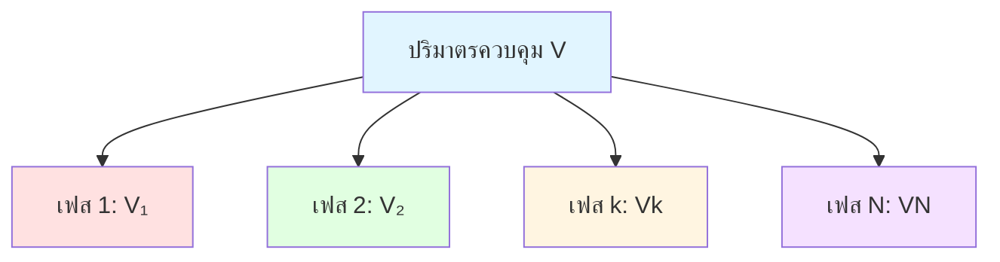
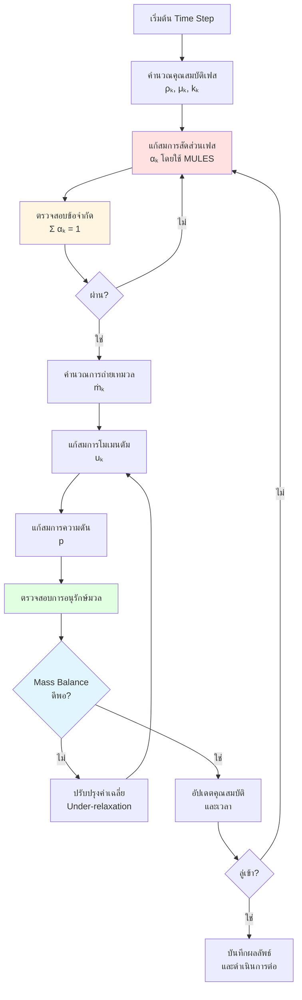

# สมการการอนุรักษ์มวล (Mass Conservation Equations)

## ภาพรวม (Overview)

> [!INFO] หลักการพื้นฐานของการอนุรักษ์มวล
> มวลไม่สามารถถูกสร้างขึ้นหรือทำลายได้ เพียงแต่ถูกถ่ายเทระหว่างเฟสหรือถูกขนส่งผ่านปริภูมิเท่านั้น ในแบบจำลอง Eulerian-Eulerian แต่ละเฟส $k$ จะมีสมการความต่อเนื่องของตนเอง

---

## สมการความต่อเนื่องจำเพาะเฟส (Phase-Specific Continuity Equation)

### รูปแบบสมการทั่วไป (General Form)

สำหรับเฟส $k$ ในระบบหลายเฟส:

$$\frac{\partial}{\partial t}(\alpha_k \rho_k) + \nabla \cdot (\alpha_k \rho_k \mathbf{u}_k) = \dot{m}_k \tag{1.1}$$

### นิยามตัวแปร (Variable Definitions)

| ตัวแปร | ความหมาย | หน่วย | ช่วงค่า |
|---------|-----------|--------|----------|
| **$\alpha_k$** | สัดส่วนปริมาตรของเฟส $k$ (volume fraction) | ไม่มีหน่วย | $0 \leq \alpha_k \leq 1$ |
| **$\rho_k$** | ความหนาแน่นของเฟส $k$ | $\text{kg/m}^3$ | $\rho_k > 0$ |
| **$\mathbf{u}_k$** | เวกเตอร์ความเร็วของเฟส $k$ | $\text{m/s}$ | - |
| **$\dot{m}_k$** | อัตราการถ่ายเทมวลสุทธิเชิงปริมาตรไปยังเฟส $k$ | $\text{kg/(m}^3\cdot\text{s)}$ | - |

### ความหมายทางกายภาพของแต่ละเทอม (Physical Meaning of Each Term)

$$\underbrace{\frac{\partial}{\partial t}(\alpha_k \rho_k)}_{\text{อัตราการสะสมเฉพาะที่}} + \underbrace{\nabla \cdot (\alpha_k \rho_k \mathbf{u}_k)}_{\text{ฟลักซ์มวลสุทธิ}} = \underbrace{\dot{m}_k}_{\text{การถ่ายเทมวลที่พื้นผิวรอยต่อ}}$$

| เทอม | ค่าบวก | ค่าลบ | คำอธิบาย |
|-------|---------|---------|-----------|
| **$\frac{\partial}{\partial t}(\alpha_k \rho_k)$** | มวลของเฟส $k$ เพิ่มขึ้น ณ จุดหนึ่ง | มวลของเฟส $k$ ลดลง ณ จุดหนึ่ง | การเปลี่ยนแปลงเชิงเวลาของความหนาแน่นมวลเฉพาะที่ |
| **$\nabla \cdot (\alpha_k \rho_k \mathbf{u}_k)$** | มวลออกมากกว่ามวลเข้า (แหล่งกำเนิด) | มวลเข้ามากกว่ามวลออก (แหล่งดูด) | การขนส่งมวลผ่านการไหลแบบกลุ่ม |
| **$\dot{m}_k$** | มวลถูกถ่ายเทไปยังเฟส $k$ | มวลถูกถ่ายเทออกจากเฟส $k$ | การแลกเปลี่ยนมวลที่พื้นผิวรอยต่อ |

---

## การพิสูจน์จากการวิเคราะห์ปริมาตรควบคุม (Control Volume Analysis)

### ขั้นตอนที่ 1: การนิยามปริมาตรควบคุม

พิจารณาปริมาตรควบคุมแบบสุ่มที่ตรึงอยู่กับที่ $V$ ในปริภูมิ โดยมีพื้นผิวขอบเขต $\partial V$ ปริมาตรควบคุมนี้ตัดกับเฟส $k$ ในปริมาตรย่อย $V_k(t)$



**สัดส่วนเฟส (Phase Fraction)** ถูกนิยามดังนี้:

$$\alpha_k(\mathbf{x},t) = \frac{\text{ปริมาตรของเฟส } k \text{ ใน } dV}{\text{ปริมาตรทั้งหมด } dV}$$

### ขั้นตอนที่ 2: การนิยามมวลและอัตราการเปลี่ยนแปลง

มวลขณะใดขณะหนึ่งของเฟส $k$ ในปริมาตรควบคุมคือ:

$$m_k(t) = \int_{V_k(t)} \rho_k(\mathbf{x},t) \, \mathrm{d}V = \int_{V} \alpha_k \rho_k \, \mathrm{d}V$$

### ขั้นตอนที่ 3: อัตราการเปลี่ยนแปลงมวลตามเวลา

$$\frac{\mathrm{d}m_k}{\mathrm{d}t} = \frac{\mathrm{d}}{\mathrm{d}t} \int_V \alpha_k \rho_k \, \mathrm{d}V = \int_V \frac{\partial}{\partial t}(\alpha_k \rho_k) \, \mathrm{d}V$$

### ขั้นตอนที่ 4: ฟลักซ์มวลผ่านขอบเขต (Mass Flux)

ฟลักซ์มวลสุทธิที่ไหลออกจากปริมาตรควบคุมผ่านพื้นผิว $A$:

$$\dot{m}_{flux} = \oint_A \alpha_k \rho_k \mathbf{u}_k \cdot \mathbf{n} \, \mathrm{d}A$$

ใช้ **Divergence Theorem** (ทฤษฎีบทของเกาส์):

$$\dot{m}_{flux} = \int_V \nabla \cdot (\alpha_k \rho_k \mathbf{u}_k) \, \mathrm{d}V$$

> [!TIP] คำอธิบาย Divergence Theorem
> แปลงการอินทิเกรตบนพื้นผิวเป็นการอินทิเกรตในปริมาตร ทำให้สามารถคำนวณได้ง่ายขึ้นใน CFD

### ขั้นตอนที่ 5: แหล่งกำเนิดมวลจากการเปลี่ยนเฟส (Source Term)

มวลที่เพิ่มขึ้นหรือลดลงจากการถ่ายเทระหว่างเฟส:

$$\dot{m}_{source} = \int_V \dot{m}_k \, \mathrm{d}V$$

### ขั้นตอนที่ 6: การรวมสมการอนุรักษ์

จากหลักการ: **[อัตราการเปลี่ยนแปลงมวล] + [ฟลักซ์มวลสุทธิขาออก] = [แหล่งกำเนิดมวล]**

$$\int_V \left[ \frac{\partial}{\partial t}(\alpha_k \rho_k) + \nabla \cdot (\alpha_k \rho_k \mathbf{u}_k) - \dot{m}_k \right] \mathrm{d}V = 0$$

เนื่องจาก $V$ เป็นปริมาตรใดๆ พจน์ในวงเล็บต้องเป็นศูนย์ นำไปสู่สมการที่ (1.1)

$$\boxed{\frac{\partial}{\partial t}(\alpha_k \rho_k) + \nabla \cdot (\alpha_k \rho_k \mathbf{u}_k) = \dot{m}_k}$$

---

## ข้อจำกัดของสัดส่วนปริมาตร (Volume Fraction Constraints)

### ข้อจำกัดพื้นฐาน (Fundamental Constraint)

**หลักการ**: ผลรวมของสัดส่วนเฟสทั้งหมดจะต้องเท่ากับหนึ่ง ณ ทุกจุดในโดเมน เพื่อรับประกันว่าปริมาตรควบคุมถูกเติมเต็มอย่างสมบูรณ์

$$\sum_{k=1}^{N} \alpha_k = 1 \tag{1.2}$$

### การพิสูจน์ทางคณิตศาสตร์ (Mathematical Proof)

#### ขั้นตอนที่ 1: นิยามเศษส่วนปริมาตร

สำหรับแต่ละเฟส $k$:
$$\alpha_k = \frac{V_k}{V}$$

#### ขั้นตอนที่ 2: รวมปริมาตรของทุกเฟส

เนื่องจากเฟสต่างๆ แบ่งปริมาตรควบคุมอย่างสมบูรณ์:
$$\sum_{k=1}^{N} V_k = V$$

#### ขั้นตอนที่ 3: หารด้วยปริมาตรทั้งหมด

$$\sum_{k=1}^{N} \frac{V_k}{V} = \frac{V}{V} = 1$$

#### ขั้นตอนที่ 4: ระบุเศษส่วนปริมาตร

$$\boxed{\sum_{k=1}^{N} \alpha_k = 1}$$

### ข้อจำกัดของการถ่ายเทมวล (Mass Transfer Constraint)

และสำหรับอัตราการถ่ายเทมวลสุทธิรวมทุกเฟสต้องเป็นศูนย์ เพื่อรับประกันการอนุรักษ์มวลของระบบ:

$$\sum_{k=1}^{N} \dot{m}_k = 0 \tag{1.3}$$

**การพิสูจน์**: เนื่องจากมวลที่ถ่ายเทจากเฟสหนึ่งจะต้องไปสู่อีกเฟสหนึ่ง:

$$\sum_{k=1}^{N} \dot{m}_k = \sum_{k=1}^{N} \sum_{j \neq k} \dot{m}_{kj} = \sum_{i < j} (\dot{m}_{ij} + \dot{m}_{ji}) = 0$$

โดยที่ $\dot{m}_{kj}$ คืออัตราการถ่ายเทมวลจากเฟส $j$ ไปยังเฟส $k$

---

## การถ่ายเทมวลที่พื้นผิวรอยต่อ (Interfacial Mass Transfer)

เทอม $\dot{m}_k$ สามารถสร้างแบบจำลองได้หลายวิธี ขึ้นอยู่กับฟิสิกส์ของปัญหา:

### 1. โมเดลการระเหย/การควบแน่น (Phase Change Model)

#### กลไกทางกายภาพ (Physical Mechanism)

การถ่ายเทมวลเกิดขึ้นเนื่องจากความแตกต่างระหว่างความหนาแน่นไอจริงและความหนาแน่นไออิ่มตัวที่พื้นผิวรอยต่อ

#### สมการ (Equation)

$$\dot{m}_{lv} = h_m A_{lv}(\rho_{v,sat} - \rho_v)$$

#### การวิเคราะห์แต่ละเทอม (Term Analysis)

| เทอม | ความหมาย | หน่วย | คำอธิบาย |
|-------|-------------|--------|------------|
| **$h_m$** | สัมประสิทธิ์การถ่ายเทมวล | m/s | ประสิทธิภาพการขนส่งมวลข้ามพื้นผิวรอยต่อ |
| **$A_{lv}$** | ความหนาแน่นของพื้นที่พื้นผิวรอยต่อ | m⁻¹ | พื้นที่รอยต่อทั้งหมดต่อหนึ่งหน่วยปริมาตรควบคุม |
| **$(\rho_{v,sat} - \rho_v)$** | ความแตกต่างของความหนาแน่น | kg/m³ | แรงขับเคลื่อนสำหรับการถ่ายเทมวล |

#### คำอธิบายเพิ่มเติม

- **$h_m$**: ขึ้นอยู่กับสภาวะการไหล, อุณหภูมิ, และคุณสมบัติของของไหล กำหนดจากความสัมพันธ์เชิงประจักษ์ (empirical correlations) หรือโมเดลทางทฤษฎี

- **$A_{lv}$**: มีความสำคัญอย่างยิ่งต่อการทำนายการถ่ายเทมวลที่แม่นยำ คำนวณจากรูปทรงของพื้นผิวรอยต่อในวิธี VOF หรือกำหนดในวิธี Eulerian

- **$(\rho_{v,sat} - \rho_v)$**: แรงขับเคลื่อนสำหรับการถ่ายเทมวล โดยที่:
  - $\rho_{v,sat} = p_{sat}(T)/R_v T$ (จากกฎแก๊สอุดมคติ)
  - ความแตกต่างที่เป็นบวก → การระเหย (Evaporation)
  - ความแตกต่างที่เป็นลบ → การควบแน่น (Condensation)

### 2. สมการ Hertz-Knudsen (Molecular Kinetic Theory)

#### พื้นฐานทางกายภาพ

การถ่ายเทมวลในระดับโมเลกุลอันเนื่องมาจากความไม่สมดุลทางจลน์ระหว่างฟลักซ์การระเหยและการควบแน่น

#### สมการ Hertz-Knudsen

$$\dot{m}_{lv} = \frac{2}{2-\sigma} \sqrt{\frac{M}{2\pi R T}} \cdot \frac{p_{sat}(T) - p_v}{\sqrt{R T}}$$

#### การวิเคราะห์เทอม (Term Analysis)

| เทอม | ความหมาย | ช่วงค่า | คำอธิบาย |
|-------|-------------|-----------|------------|
| **$\frac{2}{2-\sigma}$** | แฟกเตอร์การปรับตัว | 1.0-∞ | $\sigma = 0$: การสะท้อนที่สมบูรณ์, $\sigma = 1$: การปรับตัวที่สมบูรณ์ |
| **$\sqrt{\frac{M}{2\pi R T}}$** | พารามิเตอร์ความเร็วโมเลกุล | - | เกี่ยวข้องกับความเร็วโมเลกุลเฉลี่ย |
| **$\frac{p_{sat}(T) - p_v}{\sqrt{R T}}$** | แรงขับเคลื่อนทางอุณหพลศาสตร์ | - | ความแตกต่างของความดันระหว่างสภาวะอิ่มตัวและสภาวะจริง |

#### คำอธิบายเพิ่มเติม

- **แฟกเตอร์การปรับตัว ($\sigma$)**: ค่าทั่วไปคือ 0.2-1.0 สำหรับของเหลวส่วนใหญ่
- **พารามิเตอร์ความเร็วโมเลกุล**: ลดลงเมื่ออุณหภูมิและมวลโมเลกุลเพิ่มขึ้น
- **แรงขับเคลื่อนทางอุณหพลศาสตร์**: ถูกปรับค่าตามสเกลความเร็วความร้อน

### 3. เงื่อนไขกระโดดที่พื้นผิวรอยต่อ (Interface Jump Conditions)

#### การดุลมวลที่พื้นผิวรอยต่อ

ที่พื้นผิวรอยต่อระหว่างเฟส $i$ และ $j$, **เงื่อนไขกระโดดของการดุลมวล** คือ:

$$\dot{m}_{ij}(\mathbf{u}_j - \mathbf{u}_i) \cdot \mathbf{n}_{ij} = 0$$

หรือในรูปแบบที่ละเอียดมากขึ้น:

$$\dot{m}_{ij} = \rho_i(\mathbf{u}_i - \mathbf{u}_{int}) \cdot \mathbf{n}_{ij} = \rho_j(\mathbf{u}_j - \mathbf{u}_{int}) \cdot \mathbf{n}_{ij}$$

โดยที่:
- $\mathbf{u}_{int}$ คือความเร็วของพื้นผิวรอยต่อ (interface velocity)
- $\mathbf{n}_{ij}$ คือเวกเตอร์แนวฉากหน่วยที่ชี้จากเฟส $i$ ไปยังเฟส $j$

#### การตีความทางกายภาพ

| กรณี | เงื่อนไข | ผลลัพธ์ |
|-------|-----------|---------|
| **ไม่มีการถ่ายเทมวล** | $\dot{m}_{ij} = 0$ | $(\mathbf{u}_j - \mathbf{u}_i) \cdot \mathbf{n}_{ij}$ อาจไม่เป็นศูนย์ (สอดคล้องกับเงื่อนไขการลื่นไถล) |
| **มีการถ่ายเทมวล** | $\dot{m}_{ij} \neq 0$ | ส่วนประกอบความเร็วแนวฉากจะต้องสัมพันธ์กับฟลักซ์มวล |

---

## กรณีพิเศษ (Special Cases)

### 1. ไม่มีการเปลี่ยนเฟส (No Phase Change)

เมื่อไม่มีการถ่ายเทมวลระหว่างเฟส ($\dot{m}_k = 0$):

$$\frac{\partial}{\partial t}(\alpha_k \rho_k) + \nabla \cdot (\alpha_k \rho_k \mathbf{u}_k) = 0$$

สมการนี้แสดงถึงการอนุรักษ์มวลของเฟส $k$ โดยไม่มีแหล่งกำเนิดหรือแหล่งระบาย

### 2. เฟสไม่สามารถอัดตัวได้ (Incompressible Phase)

เมื่อ $\rho_k = \text{constant}$ (ความหนาแน่นคงที่):

$$\frac{\partial \alpha_k}{\partial t} + \mathbf{u}_k \cdot \nabla \alpha_k + \alpha_k \nabla \cdot \mathbf{u}_k = \frac{\dot{m}_k}{\rho_k}$$

หรือเขียนในรูปแบบที่ง่ายขึ้น:

$$\nabla \cdot (\alpha_k \mathbf{u}_k) = \frac{\dot{m}_k}{\rho_k}$$

> [!WARNING] ข้อควรระวัง
> สำหรับเฟสที่อัดตัวไม่ได้ทั้งหมดและไม่มีการเปลี่ยนเฟส สมการจะลดรูปเหลือเพียง:
> $$\nabla \cdot \mathbf{u}_k = 0$$
> ซึ่งเป็นสมการความต่อเนื่องมาตรฐานสำหรับการไหลแบบอัดตัวไม่ได้

### 3. การไหลแบบ steady state (Steady State Flow)

เมื่อ $\frac{\partial}{\partial t}(\cdot) = 0$:

$$\nabla \cdot (\alpha_k \rho_k \mathbf{u}_k) = \dot{m}_k$$

ในกรณีนี้ การสะสมมวลเชิงเวลาเป็นศูนย์ และเฉพาะฟลักซ์มวลและการถ่ายเทที่พื้นผิวรอยต่อเท่านั้นที่สำคัญ

### 4. การไหลแบบหนึ่งมิติ (One-Dimensional Flow)

สำหรับการไหลแบบหนึ่งมิติในทิศทาง $x$:

$$\frac{\partial}{\partial t}(\alpha_k \rho_k) + \frac{\partial}{\partial x}(\alpha_k \rho_k u_k) = \dot{m}_k$$

ซึ่งมักใช้ในการวิเคราะห์ท่อ รูสารบายพิเศษ และระบบท่อประปา

---

## การนำไปใช้ใน OpenFOAM (OpenFOAM Implementation)

### การสร้างสมการใน Solver

ใน Solver เช่น `multiphaseEulerFoam`, สมการความต่อเนื่องจะถูกแยกส่วน (discretized) ดังนี้:

```cpp
// Phase continuity equation construction
// การสร้างสมการความต่อเนื่องเฉพาะเฟส
fvScalarMatrix alphaEqn
(
    fvm::ddt(alpha, rho)          // Temporal derivative term
  + fvm::div(alphaRhoPhi, alpha)  // Convective flux term
 ==
    massTransferSource            // Source term from phase change
);

alphaEqn.solve();
```

> **💡 คำอธิบาย (Explanation)**
> 
> โค้ดนี้แสดงการสร้างสมการความต่อเนื่องใน OpenFOAM โดยใช้ finite volume method:
> 
> - **`fvm::ddt(alpha, rho)`**: เทอมอนุพันธ์เชิงเวลา (temporal derivative) ของความหนาแน่นมวลเฉพาะเฟส
> - **`fvm::div(alphaRhoPhi, alpha)`**: เทอมการพา (convective flux) ของมวลเฟส
> - **`massTransferSource`**: เทอมแหล่งกำเนิดจากการถ่ายเทมวลระหว่างเฟส
> - **`fvm`** (finite volume method): ใช้สำหรับ implicit discretization เพื่อความเสถียรของการคำนวณ
> 
> **แหล่งที่มา (Source)**: `.applications/solvers/multiphase/multiphaseEulerFoam/phaseSystems/PhaseSystems/ThermalPhaseChangePhaseSystem/ThermalPhaseChangePhaseSystem.C`

### ความสอดคล้องระหว่างสมการและโค้ด

| สมการ | โค้ด OpenFOAM | คำอธิบาย |
|---------|----------------|-----------|
| $\frac{\partial}{\partial t}(\alpha_k \rho_k)$ | `fvm::ddt(alpha, rho)` | เทอมอนุพันธ์เชิงเวลาแบบ implicit |
| $\nabla \cdot (\alpha_k \rho_k \mathbf{u}_k)$ | `fvm::div(alphaRhoPhi, alpha)` | เทอมไดเวอร์เจนซ์แบบ implicit |
| $\dot{m}_k$ | `massTransferSource` | เทอมแหล่งกำเนิดจากการเปลี่ยนเฟส |

### อัลกอริทึม MULES

OpenFOAM ใช้ **MULES (Multidimensional Universal Limiter with Explicit Solution)** เพื่อแก้สมการ $\alpha$ โดยรับประกันว่า:

#### คุณสมบัติของ MULES

| คุณสมบัติ | คำอธิบาย | ความสำคัญ |
|-----------|------------|------------|
| **Boundedness** | $0 \leq \alpha \leq 1$ เสมอ | ป้องกันค่าทางกายภาพที่เป็นไปไม่ได้ |
| **Conservation** | มวลถูกอนุรักษ์อย่างเข้มงวด | รักษาความถูกต้องของสมการ |
| **Sharpness** | รอยต่อเฟสไม่ฟุ้งกระจายจนเกินไป | รักษาความแม่นยำของพื้นผิวรอยต่อ |

### การคำนวณการถ่ายเทมวล (Mass Transfer Calculation)

```cpp
// OpenFOAM pseudo-code for mass transfer
// โค้ดจำลองสำหรับการคำนวณการถ่ายเทมวลใน OpenFOAM
volScalarField massTransfer = massTransferCoeff * interfacialArea
                            * (rhoVapSat - rhoVapor);

// Ensure net mass transfer is zero
// ตรวจสอบให้แน่ใจว่าการถ่ายเทมวลสุทธิเป็นศูนย์
forAll(massTransfer, i)
{
    massTransfer[i] *= 0.5 * (sign(rhoVapSat - rhoVapor[i]) + 1.0);
}

// Add to continuity equations
// เพิ่มเข้าไปในสมการความต่อเนื่อง
alphaEqn += massTransfer;          // Vapor phase (เฟสไอ)
liquidAlphaEqn -= massTransfer;    // Liquid phase (เฟสของเหลว) - for conservation
```

> **💡 คำอธิบาย (Explanation)**
> 
> โค้ดนี้แสดงการคำนวณการถ่ายเทมวลระหว่างเฟส:
> 
> - **`massTransferCoeff`**: สัมประสิทธิ์การถ่ายเทมวล ($h_m$) ขึ้นอยู่กับคุณสมบัติทางกายภาพ
> - **`interfacialArea`**: ความหนาแน่นของพื้นที่พื้นผิวรอยต่อ ($A_{lv}$)
> - **`(rhoVapSat - rhoVapor)`**: แรงขับเคลื่อนความแตกต่างความหนาแน่น
> - **การคูณด้วย 0.5**: ป้องกันการถ่ายเทมวลในทิศทางที่ผิดกายภาพ
> - **เครื่องหมาย +/-**: รับประกันการอนุรักษ์มวล ($\dot{m}_{lv} = -\dot{m}_{vl}$)
> 
> **แหล่งที่มา (Source)**: `.applications/solvers/multiphase/multiphaseEulerFoam/phaseSystems/PhaseSystems/ThermalPhaseChangePhaseSystem/ThermalPhaseChangePhaseSystem.C`

### การบังคับใช้ข้อจำกัดสัดส่วนปริมาตร

```cpp
// OpenFOAM implementation ensuring volume fraction constraint
// การบังคับใช้ข้อจำกัดสัดส่วนปริมาตรใน OpenFOAM
fvScalarMatrix alphaEqn
(
    fvm::ddt(alpha)               // Temporal term
  + fvm::div(phi, alpha)          // Convective flux
  - fvm::Sp(divU, alpha)          // Constraint term for volume conservation
);

// Boundedness enforcement
// การบังคับใช้ขอบเขตค่า
alphaEqn.relax();
alphaEqn.solve();
```

> **💡 คำอธิบาย (Explanation)**
> 
> โค้ดนี้แสดงการบังคับใช้ข้อจำกัด $\sum \alpha_k = 1$:
> 
> - **`fvm::Sp(divU, alpha)`**: เทอมแก้ไขเพื่อรักษาความต่อเนื่องของปริมาตร
> - **`divU`**: ไดเวอร์เจนซ์ของความเร็ว ใช้ปรับค่าสัดส่วนเฟส
> - **`relax()`**: การผ่อนคลาย (under-relaxation) เพื่อความเสถียร
> - **`solve()`**: แก้ระบบสมการเชิงเส้น
> 
> **แหล่งที่มา (Source)**: `.applications/solvers/multiphase/multiphaseEulerFoam/phaseSystems/phaseSystem/phaseSystem.H`

---

## ข้อควรพิจารณาเชิงตัวเลข (Numerical Considerations)

### พารามิเตอร์สำคัญ (Key Parameters)

| พารามิเตอร์ | ข้อกำหนด | ผลกระทบ | ค่าแนะนำ |
|------------|------------|----------|------------|
| **CFL Number** | $\text{Co} < 1.0$ | ความเสถียรของการคำนวณรอยต่อ | 0.3-0.5 สำหรับ multiphase |
| **Summation** | $\sum \alpha_k = 1$ | ความถูกต้องของสนามความดันและความต่อเนื่อง | ต้องตรวจสอบทุก time step |
| **Mass Balance** | $\dot{m}_{12} = -\dot{m}_{21}$ | การอนุรักษ์มวลรวมของระบบ | ต้องมีความแม่นยำ < 1% |

### ความเสถียรเชิงตัวเลข (Numerical Stability)

#### เงื่อนไข CFL (CFL Condition)

$$\Delta t \leq \frac{C_{CFL} \Delta x}{|\mathbf{u}_k|_{max}}$$

โดยที่:
- $C_{CFL}$ คือค่าคงที่ Courant-Friedrichs-Lewy ($0 < C_{CFL} \leq 1$)
- $\Delta x$ คือขนาดเซลล์เชิงพื้นที่
- $|\mathbf{u}_k|_{max}$ คือความเร็วสูงสุดของเฟส $k$

#### การรักษาค่าบวก (Positivity Preservation)

ต้องรักษาเงื่อนไข:
- $\alpha_k \geq 0$ สำหรับทุกเฟส
- $\sum \alpha_k = 1$ ทุกจุดในโดเมน

> [!WARNING] ปัญหาที่อาจเกิดขึ้น
> หากเงื่อนไขเหล่านี้ไม่ถูกต้อง อาจเกิดปัญหา:
> - ความไม่เสถียรของการคำนวณ
> - ผลลัพธ์ที่ไม่ถูกต้องทางกายภาพ
> - การลู่เข้าที่ล้มเหลว

### ความแม่นยำของการอนุรักษ์มวล (Mass Conservation Accuracy)

$$\text{Mass Error} = \left| \frac{m_{initial} + \int \dot{m}_{source} \, dt - m_{final}}{m_{initial}} \right| \times 100\%$$

ค่าที่ยอมรับได้:
- **การวิเคราะห์พื้นฐาน**: < 1%
- **การออกแบบวิศวกรรม**: < 0.1%
- **การวิจัยที่แม่นยำ**: < 0.01%

---

## แผนภูมิการไหลของการแก้ปัญหา (Solution Flowchart)



---

## สรุป (Summary)

### จุดสำคัญของสมการการอนุรักษ์มวล

1. **==รูปแบบสมการ==**: สมการความต่อเนื่องจำเพาะเฟสมีเทอมอนุพันธ์เชิงเวลา เทอมฟลักซ์ และเทอมการถ่ายเทที่พื้นผิวรอยต่อ

2. **==ข้อจำกัดสัดส่วนปริมาตร==**: ผลรวมของสัดส่วนเฟสทั้งหมดต้องเท่ากับหนึ่ง เพื่อรับประกันการเติมเต็มปริมาตรที่สมบูรณ์

3. **==การถ่ายเทมวล==**: มีหลายโมเดลสำหรับการถ่ายเทมวลที่พื้นผิวรอยต่อ ทั้งแบบเชิงประจักษ์และแบบทฤษฎี

4. **==การอนุรักษ์มวล==**: ผลรวมของอัตราการถ่ายเทมวลทั้งหมดต้องเป็นศูนย์ เพื่อรับประกันการอนุรักษ์มวลของระบบ

5. **==การนำไปใช้ใน OpenFOAM==**: ใช้อัลกอริทึม MULES เพื่อรับประกัน boundedness, conservation, และ sharpness ของรอยต่อเฟส

### ความสำคัญของสมการความต่อเนื่อง

> [!IMPORTANT] หมายเหตุสำคัญ
> สมการความต่อเนื่องเป็นรากฐานที่สำคัญที่สุดของการจำลองแบบหลายเฟส หากสมการนี้ไม่ลู่เข้าหรือไม่อนุรักษ์มวล ผลลัพธ์ในสมการโมเมนตัมและพลังงานจะผิดพลาดตามไปด้วย

### ความเชื่อมโยงกับสมการอื่นๆ

สมการการอนุรักษ์มวลมีความเชื่อมโยงอย่างใกล้ชิดกับ:

- **[[02_Momentum_Conservation\|สมการโมเมนตัม]]**: ความหนาแน่นและสัดส่วนเฟสจากสมการมวลถูกนำไปใช้ในสมการโมเมนตัม
- **[[05_Energy_Conservation_Equations\|สมการพลังงาน]]**: การถ่ายเทมวลมีผลต่อสมดุลพลังงาน
- **[[06_Interfacial_Phenomena_Equations\|ปรากฏการณ์พื้นผิวรอยต่อ]]**: การถ่ายเทมวลเกิดขึ้นที่พื้นผิวรอยต่อ
- **[[07_Turbulence_Modeling_Equations\|สมการความปั่นป่วน]]$: การกระจายตัวของเฟสมีผลต่อความปั่นป่วน

---

## อ้างอิงเพิ่มเติม (Further Reading)

- **Ishii, M., & Hibiki, T.** (2011). *Thermo-Fluid Dynamics of Two-Phase Flow* (2nd ed.). Springer.
- **Drew, D. A., & Passman, S. L.** (1999). *Theory of Multicomponent Fluids*. Springer.
- **Yeoh, G. H., & Tu, J.** (2019). *Computational Techniques for Multiphase Flows*. Elsevier.
- **OpenFOAM User Guide**: https://cfd.direct/openfoam/user-guide/
- **OpenFOAM Programmer's Guide**: https://cfd.direct/openfoam/programmers-guide/