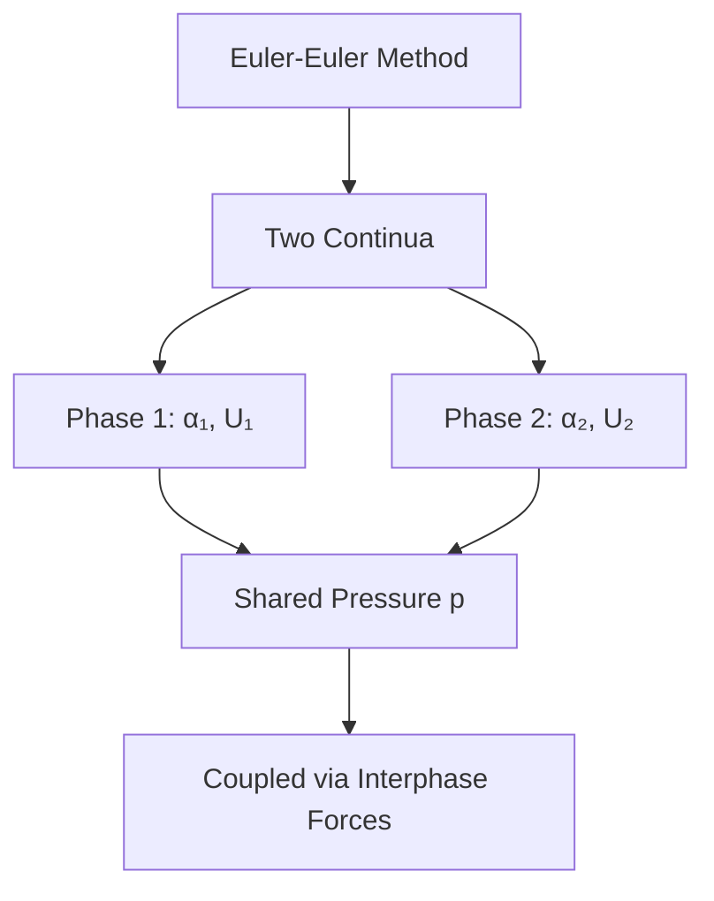
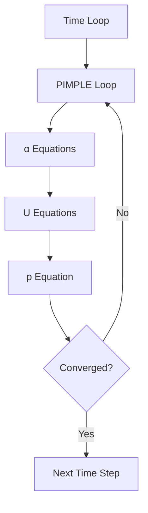

# Euler-Euler Method Overview

ภาพรวม Euler-Euler Method สำหรับ Multiphase Flow

> **ทำไมต้องเข้าใจ Euler-Euler?**
> - **สำหรับ dispersed flows** — ฟองอากาศ, fluidized beds, bubble columns
> - **ต้องใช้ closure models** — drag, lift, virtual mass ต้องเลือกให้ถูก
> - **Solver: twoPhaseEulerFoam, multiphaseEulerFoam** — ตั้งค่าซับซ้อนกว่า VOF

---

## Overview

> **💡 Euler-Euler = สองเฟสซ้อนทับกันได้**
>
> ต่างจาก VOF (interface ชัด) — Euler-Euler มองทุกเฟสเป็น continua ที่อยู่ร่วมกัน



---

## 1. Core Concept

> ทั้งสองเฟสถูกพิจารณาเป็น **interpenetrating continua** — coexist ในพื้นที่เดียวกัน

### Key Features

| Feature | Description |
|---------|-------------|
| Volume fraction | α บอกสัดส่วนของแต่ละเฟส |
| Separate velocities | แต่ละเฟสมี U ของตัวเอง |
| Shared pressure | p เดียวกันสำหรับทุกเฟส |
| Interphase coupling | Forces เชื่อม momentum equations |

---

## 2. Governing Equations

### Continuity

$$\frac{\partial(\alpha_k \rho_k)}{\partial t} + \nabla \cdot (\alpha_k \rho_k \mathbf{u}_k) = \dot{m}_k$$

### Momentum

$$\frac{\partial(\alpha_k \rho_k \mathbf{u}_k)}{\partial t} + \nabla \cdot (\alpha_k \rho_k \mathbf{u}_k \mathbf{u}_k) = -\alpha_k \nabla p + \nabla \cdot \boldsymbol{\tau}_k + \mathbf{M}_k$$

### Constraint

$$\sum_k \alpha_k = 1$$

---

## 3. Closure Models

| Force | Model |
|-------|-------|
| Drag | SchillerNaumann, IshiiZuber, ... |
| Lift | Tomiyama, LegendreMagnaudet, ... |
| Virtual Mass | constantCoefficient |
| Turbulent Dispersion | Burns, Gosman, ... |

---

## 4. When to Use

| Ideal For | Not Ideal For |
|-----------|---------------|
| Bubbly flow | Sharp interfaces |
| Fluidized beds | Few large bubbles |
| Bubble columns | Dilute particle tracking |

---

## 5. OpenFOAM Solvers

| Solver | Phases |
|--------|--------|
| `twoPhaseEulerFoam` | 2 |
| `multiphaseEulerFoam` | N |

### Basic Configuration

```cpp
// constant/phaseProperties
phases (air water);

air
{
    diameterModel   constant;
    d               0.003;
}

drag { (air in water) { type SchillerNaumann; } }
```

---

## 6. Solution Algorithm



---

## Quick Reference

| Aspect | Euler-Euler |
|--------|-------------|
| Phases | Continua (averaged) |
| Tracking | Volume fraction α |
| Coupling | Interphase forces |
| Solver | multiphaseEulerFoam |

---

## Concept Check

<details>
<summary><b>1. Euler-Euler ต่างจาก VOF อย่างไร?</b></summary>

- **VOF**: Track **interface position** (resolved)
- **Euler-Euler**: Track **volume fraction** (averaged, many particles per cell)
</details>

<details>
<summary><b>2. ทำไมต้องใช้ closure models?</b></summary>

เพราะ **volume averaging** ทำให้หายรายละเอียด local → ต้องใช้ models แทน drag, lift, etc.
</details>

<details>
<summary><b>3. α constraint บังคับอย่างไร?</b></summary>

โดย **normalize** หลัง solve: แต่ละ α หารด้วยผลรวมของทุก α
</details>

---

## Related Documents

- **บทนำ:** [01_Introduction.md](01_Introduction.md)
- **Mathematical Framework:** [02_Mathematical_Framework.md](02_Mathematical_Framework.md)
- **Implementation:** [03_Implementation_Concepts.md](03_Implementation_Concepts.md)