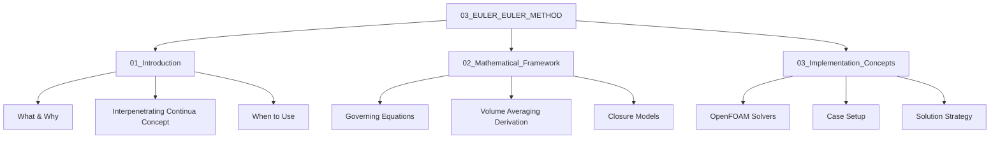
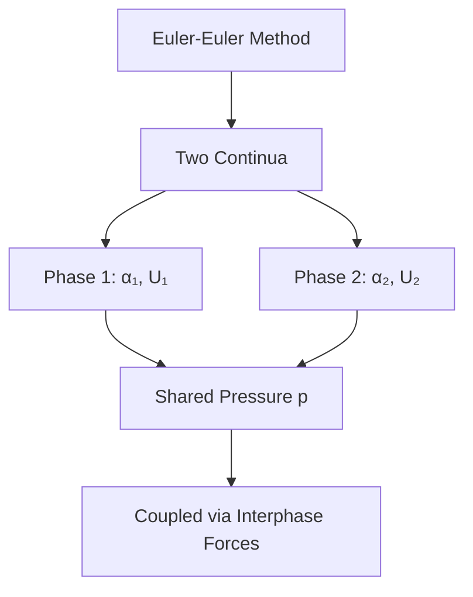
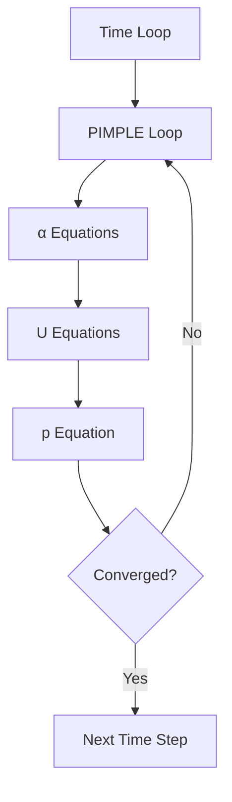

# 03_EULER_EULER_METHOD Overview

ภาพรวม Euler-Euler Method สำหรับ Multiphase Flow

> **ทำไมต้องเข้าใจ Euler-Euler?**
> - **สำหรับ dispersed flows** — ฟองอากาศ, fluidized beds, bubble columns
> - **ต้องใช้ closure models** — drag, lift, virtual mass ต้องเลือกให้ถูก
> - **Solver: twoPhaseEulerFoam, multiphaseEulerFoam** — ตั้งค่าซับซ้อนกว่า VOF

---

## Learning Objectives

หลังจากศึกษา Module นี้ คุณควรจะสามารถ:

1. **อธิบาย** ปรัชญาของ Euler-Euler two-fluid model ว่าแตกต่างจาก VOF อย่างไร
2. **เข้าใจ** แนวคิด interpenetrating continua และ volume averaging
3. **ระบุ** ประเภท flow ที่เหมาะกับ Euler-Euler method
4. **แยกแยะ** ส่วนประกอบของ governing equations โดยไม่ต้องจำสมการทั้งหมด
5. **เลือก** closure models ที่เหมาะสมกับปัญหาที่ต้องการแก้
6. **ตั้งค่า** case พื้นฐานด้วย twoPhaseEulerFoam หรือ multiphaseEulerFoam

---

## Key Terms

| คำศัพท์ (TH) | คำศัพท์ (EN) | ความหมาย |
|--------------|--------------|---------|
| สองความต่อเนื่องซ้อนทับ | Interpenetrating continua | ทั้งสองเฟสถูกมองเป็น continuum ที่แทรกตัวกันในปริภูมิเดียวกัน |
| เศษส่วนปริมาตร | Volume fraction (α) | สัดส่วนปริมาตรของแต่ละเฟสใน cell หนึ่ง |
| ความเร็วสัมพัทธ์ | Slip velocity | ความแตกต่างของความเร็วระหว่างเฟส |
| แรงระหว่างเฟส | Interphase forces | แรงที่ถ่ายทอด momentum ระหว่างเฟส (drag, lift, etc.) |
| โมเดลปิด | Closure models | สมการเสริมเพื่อปิดระบบสมการที่ไม่สมบูรณ์ |
| การหาค่าเฉลี่ยปริมาตร | Volume averaging | เทคนิคทางคณิตศาสต์ที่แปลงจากระดับ micro → macro |
| Dispersed flow | Dispersed flow | flow ที่เฟสหนึ่งกระจายเป็นฟอง/อนุภาคในเฟสหลัก |
| Fluidized bed | Fluidized bed | ระบบที่ของแข็งถูกทำให้ลอยตัวด้วยการไหลของ fluid |

---

## Module Structure



### 01_Introduction — What & Why
- ปรัชญาการจำลอง: Interface capturing vs. Two-fluid approach
- แนวคิด Interpenetrating continua (พร้อมภาพประกอบ)
- Flow regimes ที่เหมาะสม
- ข้อดี-ข้อเจาะจง

### 02_Mathematical_Framework — How (Math)
- Volume averaging technique
- Governing equations (continuity, momentum)
- Closure problem และโมเดลที่ต้องใช้
- Drag/lift/virtual mass formulations

### 03_Implementation_Concepts — How (OpenFOAM)
- twoPhaseEulerFoam vs. multiphaseEulerFoam
- phaseProperties dictionary
- Interphase coupling ใน code
- Solution algorithm

---

## What is Euler-Euler Method?

> **💡 Euler-Euler = สองเฟสซ้อนทับกันได้**
>
> ต่างจาก VOF (interface ชัด) — Euler-Euler มองทุกเฟสเป็น continua ที่อยู่ร่วมกัน



<!-- IMAGE: IMG_04_004 -->
<!-- 
Purpose: เพื่อเปรียบเทียบปรัชญาการจำลอง (Modeling Philosophy) ระหว่าง VOF และ Eulerian. ภาพนี้ต้องโชว์จุดเด่นที่ต่างกันสุดขั้ว: VOF เห็นผิวคมชัดแต่น่านน้ำเดียว (One U field), Eulerian เห็นเป็นหมอกผสมกัน (Interpenetrating) แต่แยกความเร็วได้ (Two U fields).
Prompt: "Conceptual Comparison: Interface Capturing vs Interpenetrating Continua. **Left (VOF):** A cup of water with a sharp, free surface. Inside, single velocity vectors ($\mathbf{U}_{mix}$), indicating fluids move together. Label: 'VOF / Interface Capturing'. **Right (Eulerian):** A bubble column where gas and liquid mix like a fog. Inside, TWO sets of overlapping velocity vectors in different colors (Blue $\mathbf{U}_{liq}$, White $\mathbf{U}_{gas}$), indicating slip velocity. Label: 'Two-Fluid / Interpenetrating'. STYLE: Scientific diagram, cross-section view, clear vector fields."
-->

![[IMG_04_004.jpg]]

> ทั้งสองเฟสถูกพิจารณาเป็น **interpenetrating continua** — coexist ในพื้นที่เดียวกัน

### Key Features (Conceptual Overview)

| Feature | ความหมาย | Where to Learn |
|---------|-----------|----------------|
| Volume fraction | α บอกสัดส่วนของแต่ละเฟส | 01, 02 |
| Separate velocities | แต่ละเฟสมี U ของตัวเอง (slip velocity) | 01, 02 |
| Shared pressure | p เดียวกันสำหรับทุกเฟส | 02 |
| Interphase coupling | Forces เชื่อม momentum equations | 02, 03 |

---

## When to Use Euler-Euler?

| Ideal For | Not Ideal For |
|-----------|---------------|
| Bubbly flow (many bubbles) | Sharp interfaces |
| Fluidized beds | Few large bubbles |
| Bubble columns | Dilute particle tracking (use Lagrangian) |
| Particle-laden flows | Free surface flows (use VOF) |

---

## Mathematical Framework (Preview)

> **📘 ดูสมการและการ derived อย่างละเอียดใน:** [02_Mathematical_Framework.md](02_Mathematical_Framework.md)

Euler-Euler method ใช้ **volume averaging** เพื่อแปลง description จากระดับ micro → macro:

| Component | Description | Details |
|-----------|-------------|---------|
| Continuity | Conservation of mass สำหรับแต่ละเฟส | See 02_Mathematical_Framework.md#continuity |
| Momentum | Newton's 2nd law สำหรับแต่ละเฟส | See 02_Mathematical_Framework.md#momentum |
| Constraint | Sum of α = 1 | See 02_Mathematical_Framework.md#constraint |
| Closure | Interphase force models | See 02_Mathematical_Framework.md#closure-models |

---

## OpenFOAM Implementation (Preview)

> **📘 ดูการตั้งค่าและ case setup อย่างละเอียดใน:** [03_Implementation_Concepts.md](03_Implementation_Concepts.md)

| Solver | Phases | Use Case |
|--------|--------|----------|
| `twoPhaseEulerFoam` | 2 | Gas-liquid bubbly flow |
| `multiphaseEulerFoam` | N | Multiphase (≥3) systems |

### Basic Configuration Overview

```cpp
// constant/phaseProperties
phases (air water);

air
{
    diameterModel   constant;
    d               0.003;
}

drag { (air in water) { type SchillerNaumann; } }
```

→ ดู options และ closure models ทั้งหมดใน 03_Implementation_Concepts.md

---

## Solution Strategy (Preview)



→ ดูรายละเอียด algorithm ใน 03_Implementation_Concepts.md#solution-algorithm

---

## Quick Reference

| Aspect | Euler-Euler | Reference |
|--------|-------------|-----------|
| Phases | Continua (averaged) | 01_Introduction.md |
| Tracking | Volume fraction α | 02_Mathematical_Framework.md |
| Coupling | Interphase forces | 02_Mathematical_Framework.md |
| Solver | multiphaseEulerFoam | 03_Implementation_Concepts.md |
| Closure | Drag, lift, virtual mass | 02_Mathematical_Framework.md |

---

## Concept Check

<details>
<summary><b>1. Euler-Euler ต่างจาก VOF อย่างไร?</b></summary>

- **VOF**: Track **interface position** (resolved)
- **Euler-Euler**: Track **volume fraction** (averaged, many particles per cell)

→ ดูเพิ่มเติมใน 01_Introduction.md#vof-vs-euler-euler
</details>

<details>
<summary><b>2. ทำไมต้องใช้ closure models?</b></summary>

เพราะ **volume averaging** ทำให้หายรายละเอียด local → ต้องใช้ models แทน drag, lift, etc.

→ ดูรายละเอียดใน 02_Mathematical_Framework.md#closure-problem
</details>

<details>
<summary><b>3. α constraint บังคับอย่างไร?</b></summary>

โดย **normalize** หลัง solve: แต่ละ α หารด้วยผลรวมของทุก α

→ ดู implementation ใน 03_Implementation_Concepts.md#alpha-constraint
</details>

---

## Navigation

### Prerequisites
- **Module 01:** Governing Equations (มูลฐาน CFD)
- **Module 03:** Single-Phase Flow (pressure-velocity coupling)
- **Module 04 (VOF):** Interface Capturing — เปรียบเทียบกับ Euler-Euler

### This Module
- **Current file:** 00_Overview.md (Roadmap)
- **Next:** [01_Introduction.md](01_Introduction.md) — What & Why
- **Then:** [02_Mathematical_Framework.md](02_Mathematical_Framework.md) — How (Math)
- **Finally:** [03_Implementation_Concepts.md](03_Implementation_Concepts.md) — How (OpenFOAM)

### Related Topics
- **Turbulence Modeling:** Module 03.03
- **Boundary Conditions:** Module 01.03
- **Post-Processing:** Module 02.06