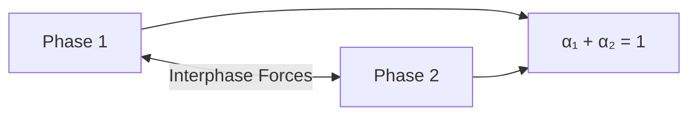

# Euler-Euler Introduction

บทนำ Euler-Euler Method สำหรับ Multiphase Flow

---

## Overview

> **Euler-Euler** = ทั้งสองเฟสถูกพิจารณาเป็น continuum ที่ซ้อนทับกัน แต่ละเฟสมีสมการอนุรักษ์ของตัวเอง



---

## 1. Core Concept

### Interpenetrating Continua

- ทั้งสองเฟส **coexist** ในปริมาตรเดียวกัน
- ใช้ **volume fraction** ($\alpha$) บอกสัดส่วน
- แต่ละเฟสมี velocity field ของตัวเอง

### Volume Averaging

$$\alpha_k = \lim_{V \to V_0} \frac{V_k}{V}$$

$$\sum_k \alpha_k = 1$$

---

## 2. Governing Equations

### For Each Phase k

**Continuity:**
$$\frac{\partial(\alpha_k \rho_k)}{\partial t} + \nabla \cdot (\alpha_k \rho_k \mathbf{u}_k) = \dot{m}_k$$

**Momentum:**
$$\frac{\partial(\alpha_k \rho_k \mathbf{u}_k)}{\partial t} + \nabla \cdot (\alpha_k \rho_k \mathbf{u}_k \mathbf{u}_k) = -\alpha_k \nabla p + \nabla \cdot \boldsymbol{\tau}_k + \mathbf{M}_k$$

---

## 3. Closure Models

| Term | Model Required |
|------|----------------|
| $\mathbf{M}_k$ (interphase forces) | Drag, lift, VM, TD |
| $\dot{m}_k$ (mass transfer) | Evaporation, condensation |
| $\boldsymbol{\tau}_k$ (stress) | Turbulence, granular |

---

## 4. Comparison with Other Methods

| Method | Phases | Scale | Cost |
|--------|--------|-------|------|
| **Euler-Euler** | Both continuum | Averaged | Moderate |
| **Euler-Lagrange** | Continuous + particles | Individual | Higher |
| **VOF** | Interface tracking | Resolved | Mesh dependent |

---

## 5. When to Use

### Ideal For

- **Bubbly flow**: Many bubbles per cell
- **Fluidized beds**: Dense particle systems
- **Bubble columns**: Industrial applications

### Not Ideal For

- Sharp interfaces (use VOF)
- Dilute with few particles (use Lagrangian)

---

## 6. OpenFOAM Solvers

| Solver | Phases | Use |
|--------|--------|-----|
| `twoPhaseEulerFoam` | 2 | Basic bubbly/dispersed |
| `multiphaseEulerFoam` | N | Complex systems |

### Basic Setup

```cpp
// constant/phaseProperties
phases (air water);

air
{
    diameterModel   constant;
    d               0.003;
}
```

---

## 7. Key Features

### Shared Pressure

- ทุกเฟสใช้ **same pressure field**
- Pressure equation จาก mixture continuity

### Interphase Coupling

- Forces couple momentum equations
- Solved iteratively (PIMPLE)

---

## Quick Reference

| Aspect | Euler-Euler |
|--------|-------------|
| Phase treatment | Both as continuum |
| Tracking | Volume fraction α |
| Pressure | Shared |
| Coupling | Interphase forces |
| Solver | twoPhaseEulerFoam, multiphaseEulerFoam |

---

## Concept Check

<details>
<summary><b>1. "Interpenetrating continua" หมายความว่าอะไร?</b></summary>

หมายความว่า **ทั้งสองเฟสอยู่ในพื้นที่เดียวกันได้** — α บอกว่าแต่ละจุดมีเฟสไหนเท่าไหร่ (ไม่ใช่ either/or)
</details>

<details>
<summary><b>2. ทำไมต้องใช้ interphase force models?</b></summary>

เพราะ **averaging** ทำให้ข้อมูล local (wake, boundary layer) หายไป — ต้องใช้ models แทน
</details>

<details>
<summary><b>3. Euler-Euler vs VOF ต่างกันอย่างไร?</b></summary>

- **VOF**: Interface **resolved** ด้วย mesh (sharp)
- **Euler-Euler**: Interface **modeled** (averaged, smeared)
</details>

---

## Related Documents

- **ภาพรวม:** [00_Overview.md](00_Overview.md)
- **Governing Equations:** [02_Governing_Equations.md](02_Governing_Equations.md)
- **Implementation:** [03_Implementation_Concepts.md](03_Implementation_Concepts.md)