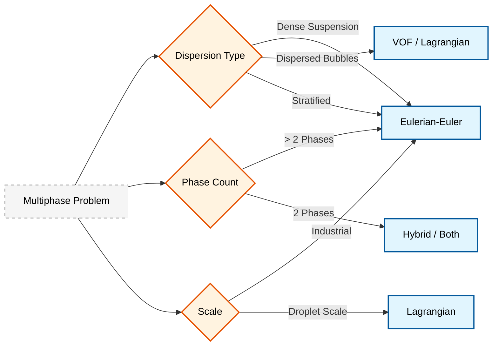

# Introduction to Eulerian-Eulerian Multiphase Flow

## บทนำสู่การไหลแบบหลายเฟส

**Multiphase flow** คือ การไหลที่มีหลายสถานะ (ของแข็ง ของเหลว ก๊าซ) อยู่พร้อมกันในระบบ ในแบบจำลอง **Eulerian-Eulerian (E-E)** แต่ละเฟสจะถูกพิจารณาว่าเป็น **สสารต่อเนื่องที่แทรกซึมซึ่งกันและกัน (Interpenetrating Continua)** โดยแต่ละเฟสจะมีชุดสมการควบคุมของตัวเองและครอบครองสัดส่วนปริมาตรที่แน่นอนในทุกๆ จุดของโดเมนการคำนวณ

แนวทางนี้เป็นพื้นฐานสำคัญของความสามารถในการจำลองการไหลแบบหลายเฟสของ OpenFOAM (เช่น `multiphaseEulerFoam`) และเหมาะสมอย่างยิ่งสำหรับ:
- **ปัญหาการไหลแบบหลายเฟสในระดับอุตสาหกรรม**
- **ประสิทธิภาพในการคำนวณ (computational efficiency)**
- **ผลกระทบจากการแทรกซึมระหว่างเฟส (phase interpenetration effects)**

![[interpenetrating_continua.png]]

---

## ลักษณะสำคัญ (Key Characteristics)

### 1. สสารต่อเนื่องที่แทรกซึมกัน (Interpenetrating Continua)

ในกรอบงานแบบออยเลอร์-ออยเลอร์ เราไม่ติดตามรอยต่อเฟส (interface) ที่ชัดเจน แต่จะมองว่าทุกเฟสมีอยู่พร้อมกันในทุกๆ ปริมาตรควบคุม (Control Volume) โดยแต่ละเฟสจะถูกแทนด้วยสนามที่มีความต่อเนื่อง

> [!TIP] **Physical Analogy: The "Ghost Crowds" (ฝูงชนวิญญาณที่เดินทะลุกัน)**
>
> คำว่า "Interpenetrating Continua" (สสารต่อเนื่องที่แทรกซึมกัน) อาจฟังดูขัดแย้งความจริง (เพราะน้ำกับน้ำมันอยู่ซ้อนทับกันในจุดเดียวกันไม่ได้) ลองนึกภาพแบบนี้:
>
> -   **ความเป็นจริง (Microscale):** เหมือน **"เม็ดทรายในน้ำ"** เม็ดทรายอยู่ที่หนึ่ง น้ำอยู่อีกที่หนึ่ง ไม่ทับกัน
> -   **Eulerian-Eulerian Model (Macroscale):** เหมือน **"ฝูงวิญญาณสีแดง (ทราย)"** เดินสวนกับ **"ฝูงวิญญาณสีฟ้า (น้ำ)"**
>     -   วิญญาณทั้งสองสีเดิน **"ทะลุผ่านกันได้"** ในพื้นที่เดียวกัน
>     -   ณ จุดหนึ่งในห้อง อาจมีความเข้มข้นของวิญญาณแดง 30% และวิญญาณฟ้า 70% ($\alpha_{sand}=0.3, \alpha_{water}=0.7$)
>     -   แม้จะเดินทะลุกันได้ แต่ก็ยังมี **"แรงเสียดทาน"** ระหว่างกัน (Drag Force) ถ้าฝูงหนึ่งวิ่งเร็ว ก็จะฉุดอีกฝูงให้เร็วตามไปด้วย

สนามสัดส่วนเฟส $\alpha_\alpha(\mathbf{x}, t)$ แสดงถึงสัดส่วนของปริมาตรควบคุมที่ถูกครอบครองโดยเฟส $\alpha$ ณ ตำแหน่งเชิงพื้นที่ $\mathbf{x}$ และเวลา $t$

### 2. สัดส่วนปริมาตร (Volume Fraction - $\alpha$)

สัดส่วนปริมาตร $\alpha_k$ แสดงถึงโอกาสหรือสัดส่วนของพื้นที่ที่เฟส $k$ ครอบครอง ณ ตำแหน่งและเวลาที่กำหนด

**ข้อจำกัดพื้นฐาน (Summation Constraint):**
$$\sum_{k=1}^{N} \alpha_k = 1$$

โดยที่ $0 \leq \alpha_k \leq 1$ สำหรับทุกเฟส $k$:
- $\alpha_k = 0$ หมายถึงจุดนั้นไม่มีเฟส $k$
- $\alpha_k = 1$ หมายถึงจุดนั้นมีเพียงเฟส $k$ เท่านั้น (Pure phase)
- ค่าระหว่างกลางแสดงถึงความน่าจะเป็นทางสถิติของการมีอยู่ของเฟส

### 3. กระบวนการเฉลี่ย (Averaging Procedures)

สมการควบคุมถูกสร้างขึ้นผ่านกระบวนการเฉลี่ยคุณสมบัติระดับจุลภาคเหนือปริมาตรควบคุม เพื่อให้ได้สนามที่ต่อเนื่องสำหรับการคำนวณ CFD

**การเฉลี่ยเชิงปริมาตร (Volume Averaging):**
$$\langle \phi \rangle_\alpha = \frac{1}{V_\alpha} \int_{V_\alpha} \phi \, \mathrm{d}V$$

**การเฉลี่ยตามเฟส (Phase Averaging):**
$$\bar{\phi}_\alpha = \frac{1}{V} \int_{V_\alpha} \phi \, \mathrm{d}V = \alpha_\alpha \langle \phi \rangle_\alpha$$

---

## กรอบแนวคิดทางสมการ (Equation Framework)

แต่ละเฟส $k$ จะมีชุดตัวแปรสนามของตนเอง (Velocity $\mathbf{u}_k$, Temperature $T_k$, etc.) และถูกควบคุมด้วยสมการอนุรักษ์

### การอนุรักษ์มวล (Mass Conservation)

สมการความต่อเนื่องสำหรับเฟส $k$:

$$\frac{\partial (\alpha_k \rho_k)}{\partial t} + \nabla \cdot (\alpha_k \rho_k \mathbf{u}_k) = \sum_{l \neq k} \dot{m}_{lk}$$

**นิยามตัวแปร:**
- $\alpha_k$ = **volume fraction** ของเฟส $k$ (ข้อจำกัด: $\sum_k \alpha_k = 1$)
- $\rho_k$ = **density** ของเฟส $k$
- $\mathbf{u}_k$ = **velocity vector** ของเฟส $k$
- $\dot{m}_{lk}$ = **mass transfer rate** จากเฟส $l$ ไปยังเฟส $k$

**การวิเคราะห์ทีละเทอม:**
- **เทอมเวลา**: $\frac{\partial (\alpha_k \rho_k)}{\partial t}$ - การสะสมหรือการลดลงของมวลเฟสเฉพาะที่
- **เทอมคอนเวกทีฟ**: $\nabla \cdot (\alpha_k \rho_k \mathbf{u}_k)$ - ฟลักซ์มวลสุทธิเนื่องจากการเคลื่อนที่
- **เทอมแหล่งกำเนิด**: $\sum_{l \neq k} \dot{m}_{lk}$ - การถ่ายเทมวลระหว่างเฟส (การระเหย การควบแน่น การละลาย)

### การอนุรักษ์โมเมนตัม (Momentum Conservation)

สมการโมเมนตัมสำหรับเฟส $k$:

$$\frac{\partial (\alpha_k \rho_k \mathbf{u}_k)}{\partial t} + \nabla \cdot (\alpha_k \rho_k \mathbf{u}_k \mathbf{u}_k) = -\alpha_k \nabla p + \alpha_k \rho_k \mathbf{g} + \nabla \cdot (\alpha_k \boldsymbol{\tau}_k) + \mathbf{M}_k$$

**นิยามตัวแปร:**
- $p_k$ = **pressure** ของเฟส $k$ (มักจะสมมติว่าเท่ากันทุกเฟส: $p_k = p$)
- $\boldsymbol{\tau}_k$ = **stress tensor** สำหรับเฟส $k$
- $\mathbf{g}$ = **gravitational acceleration**
- $\mathbf{M}_k$ = **interfacial momentum transfer term** (drag, lift, virtual mass, etc.)

**การวิเคราะห์ทีละเทอม:**

**1. เทอมความเฉื่อย (Inertial terms):**
- **ความเร่งตามเวลา**: $\frac{\partial (\alpha_k \rho_k \mathbf{u}_k)}{\partial t}$
- **ความเร่งแบบคอนเวกทีฟ**: $\nabla \cdot (\alpha_k \rho_k \mathbf{u}_k \mathbf{u}_k)$

**2. เทอมแรง (Force terms):**
- **ความชันความดัน**: $-\alpha_k \nabla p$ - แรงดันที่ถ่วงน้ำหนักด้วยสัดส่วนเฟส
- **แรงโน้มถ่วง**: $\alpha_k \rho_k \mathbf{g}$ - แรงกระทำต่อเฟสเฉพาะ
- **ความเค้นหนืด**: $\nabla \cdot (\alpha_k \boldsymbol{\tau}_k)$ - แรงเสียดทานของเฟส
- **การถ่ายเทโมเมนตัมระหว่างเฟส**: $\mathbf{M}_k$ - แรงฉุดและแรงอื่นๆ

### เทนเซอร์ความเค้นหนืด (Viscous Stress Tensor)

สำหรับเฟสแบบนิวตัน (Newtonian phases):

$$\boldsymbol{\tau}_k = \mu_k \left(\nabla \mathbf{u}_k + (\nabla \mathbf{u}_k)^T\right) - \frac{2}{3} \mu_k (\nabla \cdot \mathbf{u}_k) \mathbf{I}$$

โดยที่:
- $\mu_k$ คือความหนืดจลน์ของเฟส $k$
- $\mathbf{I}$ คือเทนเซอร์เอกลักษณ์ (identity tensor)

### Interfacial Momentum Transfer ($\mathbf{M}_k$)

เป็นเทอมที่สำคัญที่สุดใน E-E model ซึ่งรวมแรงทั้งหมดที่กระทำโดยเฟสอื่นต่อเฟส $k$:

$$\mathbf{M}_k = \sum_{l \neq k} \mathbf{K}_{kl} (\mathbf{u}_l - \mathbf{u}_k) + \mathbf{F}^{\text{non-drag}}_k$$

**องค์ประกอบของการถ่ายเทโมเมนตัม:**

| องค์ประกอบ | สัญลักษณ์ | คำอธิบาย |
|-------------|-----------|----------|
| **Drag Force** | $\mathbf{F}_D$ | แรงต้านเนื่องจากความเร็วสัมพัทธ์ |
| **Lift Force** | $\mathbf{F}_L$ | แรงยกเนื่องจากความเฉือน (shear) |
| **Virtual Mass Force** | $\mathbf{F}_{VM}$ | แรงเนื่องจากการเร่งของเฟสรอบข้าง |
| **Turbulent Dispersion Force** | $\mathbf{F}_{TD}$ | การกระจายตัวเนื่องจากความปั่นป่วน |

---

## ปรากฏการณ์ส่วนต่อประสาน (Interfacial Phenomena)

### แรงฉุด (Drag Forces)

แรงฉุดแสดงถึงการแลกเปลี่ยนโมเมนตัมเนื่องจาก**การเคลื่อนที่สัมพัทธ์**ระหว่างเฟส:

$$\mathbf{F}_{D,\alpha} = K_{\alpha\beta} (\mathbf{u}_\beta - \mathbf{u}_\alpha)$$

สัมประสิทธิ์แรงฉุด $K_{\alpha\beta}$ ขึ้นอยู่กับ:
- สภาวะการไหล (บับเบิ้ล, สลัก, เชิร์น, แอนนูลาร์)
- คุณสมบัติของเฟส (ความหนาแน่น, ความหนืด, แรงตึงผิว)
- ความหนาแน่นของพื้นที่ส่วนต่อประสาน
- ขนาดและรูปร่างของอนุภาค/ฟองอากาศ

#### แบบจำลองแรงฉุดทั่วไป (Common Drag Models)

| โมเดล | สมการ | เงื่อนไขการใช้งาน |
|--------|---------|------------------|
| **Schiller-Naumann** | $C_D = \frac{24}{Re_p}(1 + 0.15 Re_p^{0.687})$ | $Re_p < 1000$, อนุภาค/ฟองทรงกลม |
| **Ishii-Zuber** | ความสัมพันธ์เชิงประจักษ์ | ฟองที่บิดเบี้ยว, Re สูง |
| **Tomiyama** | พิจารณาผลกระทบจากผนัง | ฟองที่มีผลกระทบจากผนัง |
| **Grace** | ฟองที่เปลี่ยนรูปได้ | ความซับซ้อนสูง |

โดยที่ $Re_p = \frac{\rho_c |\mathbf{u}_p - \mathbf{u}_c| d_p}{\mu_c}$ คือ **particle Reynolds number**

### แรงยก (Lift Forces)

แรงยกเป็นแรงในแนวขวางที่กระทำต่อเฟสที่กระจายตัวเนื่องจาก**การไล่ระดับความเร็ว**ในเฟสต่อเนื่อง:

$$\mathbf{F}_{L,\alpha} = C_L \rho_c \alpha_\alpha (\mathbf{u}_\alpha - \mathbf{u}_c) \times (\nabla \times \mathbf{u}_c)$$

โดยที่:
- $C_L$ = สัมประสิทธิ์แรงยก (lift coefficient)
- $\rho_c$ = ความหนาแน่นของเฟสต่อเนื่อง
- $\mathbf{u}_c$ = ความเร็วของเฟสต่อเนื่อง

> [!WARNING] ข้อสังเกต
> การเปลี่ยนเครื่องหมายของสัมประสิทธิ์แรงยกสามารถเกิดขึ้นได้ ขึ้นอยู่กับขนาดของฟองอากาศและสภาวะการไหล

### แรงมวลเสมือน (Virtual Mass Forces)

แรงมวลเสมือนเกิดขึ้นเมื่อมี**การเร่งเฟสที่กระจายตัว**ผ่านเฟสต่อเนื่อง:

$$\mathbf{F}_{VM,\alpha} = C_{VM} \rho_c \alpha_\alpha \left(\frac{\mathrm{D}\mathbf{u}_c}{\mathrm{D}t} - \frac{\mathrm{D}\mathbf{u}_\alpha}{\mathrm{D}t}\right)$$

โดยที่:
- $C_{VM}$ = สัมประสิทธิ์มวลเสมือน (โดยทั่วไปคือ 0.5 สำหรับอนุภาคทรงกลม)
- $\frac{\mathrm{D}}{\mathrm{D}t}$ = อนุพันธ์ของวัสดุ (material derivative)

**ผลของมวลเสมือนมีความสำคัญเมื่อ:**
- ✅ อัตราส่วนความหนาแน่นระหว่างเฟสมีค่าน้อย
- ✅ การเร่งมีค่ามาก (การไหลที่ไม่คงที่)
- ✅ สัดส่วนปริมาตรของเฟสที่กระจายตัวมีค่าปานกลางถึงสูง
- ✅ ความถี่ของการแกว่งกวัดมีค่าสูง

> [!WARNING] คำเตือน
> การละเลยแรงมวลเสมือนอาจนำไปสู่การทำนายความดันตกที่ต่ำกว่าความเป็นจริง

### การกระจายตัวเนื่องจากความปั่นป่วน (Turbulent Dispersion)

แรงการกระจายตัวเนื่องจากความปั่นป่วนคำนึงถึง**การผสมของเฟส**อันเนื่องมาจากการผันผวนจากความปั่นป่วน:

$$\mathbf{F}_{TD,\alpha} = -C_{TD} \rho_c k_{t,c} \nabla \alpha_\alpha$$

โดยที่:
- $C_{TD}$ = สัมประสิทธิ์การกระจายตัวเนื่องจากความปั่นป่วน
- $k_{t,c}$ = พลังงานจลน์จากความปั่นป่วนในเฟสต่อเนื่อง

**ความสำคัญของการกระจายตัวเนื่องจากความปั่นป่วน:**
- ทำนายโปรไฟล์ความเข้มข้นของเฟสที่สมจริง
- รักษาเสถียรภาพเชิงตัวเลขในบริเวณที่มีความชันของสัดส่วนปริมาตรสูง
- จำลองการผสมในการไหลแบบเฉือนที่มีความปั่นป่วน
- จับปรากฏการณ์การพาเข้าและการตกสะสม

---

## การเปรียบเทียบกับวิธีการอื่น (Comparison)

| Method | เหมาะสำหรับ | ต้นทุนการคำนวณ |
|--------|----------|------|
| **Eulerian-Lagrangian** | การไหลเจือจาง ($\alpha < 1\% $), อนุภาคขนาดเล็ก | สูงตามจำนวนอนุภาค |
| **VOF (Volume of Fluid)** | รอยต่อเฟสชัดเจน (Free surface, Sloshing) | สูง (ต้องการ Mesh ละเอียดมาก) |
| **Eulerian-Eulerian** | การไหลหนาแน่น (Fluidized beds, Bubble columns) | ปานกลาง (คงที่ตามขนาด Mesh) |

![[multiphase_modeling_comparison.png]]

---

## 🎯 เมื่อใดควรใช้แนวทาง Eulerian-Eulerian?



### ✅ เลือกใช้ Eulerian-Eulerian เมื่อ:

| เงื่อนไข | คำอธิบาย | ค่าที่เกี่ยวข้อง |
|-----------|------------|------------------|
| **Dense Suspensions** | ปฏิสัมพันธ์ระหว่างอนุภาคมีความสำคัญ | $\alpha_d > 0.1$ |
| **Multi-Phase (> 2)** | ต้องการจำลองก๊าซ ของเหลว และของแข็งพร้อมกัน | $N > 2$ |
| **Industrial Scale** | โดเมนขนาดใหญ่ที่การติดตามอนุภาคแบบ Lagrangian ทำได้ยาก | หลายเมตร/กิโลเมตร |
| **Phase Interpenetration** | เมื่อเฟสต่างๆ มีการแลกเปลี่ยนโมเมนตัมและความร้อนอย่างเข้มข้น | Interfacial Transfer |

**ประโยชน์หลัก:**
- จับการแลกเปลี่ยนโมเมนตัมระหว่างเฟสได้โดยธรรมชาติผ่าน **แบบจำลองแรงฉุก (drag models)**
- รองรับ **เทอมการปรับความปั่นป่วน (turbulence modulation terms)**
- เหมาะสำหรับ **เครื่องปฏิกรณ์แก๊ส-ของเหลว-ของแข็ง (gas-liquid-solid reactors)**
- รองรับ **การไหลแบบมีฟองหลายองค์ประกอบ (multi-component bubbly flows)**

### ❌ พิจารณาทางเลือกอื่นเมื่อ:

| เงื่อนไข | ทางเลือกที่เหมาะสม | เหตุผล |
|-----------|-------------------|---------|
| **ต้องการติดตามอนุภาคแต่ละตัว** | Lagrangian | ให้รายละเอียดวิถีของอนุภาค ประวัติการชน |
| **ความละเอียดของส่วนต่อประสานสำคัญ** | VOF/Level Set | จับโทโพโลยีของส่วนต่อประสาน แรงตึงผิว |
| **สารแขวนลอยเจือจางมาก** | Lagrangian (one-way coupling) | ต้นทุนการคำนวณต่ำกว่า | $\alpha_d < 0.001$ |

**ข้อจำกัดของ Eulerian-Eulerian:**
- กรองรายละเอียดในระดับอนุภาคโดยธรรมชาติ (averaging effects)
- ไม่สามารถจับโทโพโลยีของส่วนต่อประสานได้แม่นยำเมื่อเทียบกับ VOF
- ต้นทุนการคำนวณสูงขึ้นเมื่อสัดส่วนปริมาตรของเฟสกระจายตัวต่ำมาก

---

## การใช้งานใน OpenFOAM

### Solver multiphaseEulerFoam

Solver หลักใช้กรอบการทำงานแบบ Eulerian-Eulerian:

```cpp
// Phase system initialization
phaseSystem phaseModels(mesh, g);

// Momentum equations for each phase
fvVectorMatrix UEqn
(
    // Time derivative term: d/dt(alpha*rho*U)
    fvm::ddt(alpha, rho, U)
    // Convective term: div(alpha*rho*phi*U)
  + fvm::div(alphaRhoPhi, U)
    // Source term correction for mass conservation
  - fvm::Sp(fvc::ddt(alpha, rho) + fvc::div(alphaRhoPhi), U)
    // Viscous stress term: div(devreff)
  + turbulence->divDevReff(RhoEff)
    // Equality with source terms (fvOptions)
 ==
    fvOptions(alpha, rho, U)
);

// Interfacial momentum transfer (drag force)
phaseSystem.Kd()*(U.otherPhase() - U)
```

<details>
<summary>📖 คำอธิบายโค้ด (Thai Explanation)</summary>

**แหล่งที่มา (Source):** `.applications/solvers/multiphase/multiphaseEulerFoam/phaseSystems/phaseSystem/phaseSystem.C`

**คำอธิบาย:**
โค้ดด้านบนแสดงโครงสร้างหลักของการแก้สมการโมเมนตัมใน `multiphaseEulerFoam`:

1. **Phase System Initialization**: สร้างออบเจกต์ `phaseSystem` เพื่อจัดการข้อมูลของทุกเฟสในระบบ รวมถึสมบัติทางกายภาพและการโต้ตอบระหว่างเฟส

2. **Momentum Equation Assembly**: ประกอบสมการโมเมนตัมสำหรับแต่ละเฟส โดย:
   - `fvm::ddt()`: เทอมอนุพันธ์เชิงเวลา (Temporal derivative)
   - `fvm::div()`: เทอมคอนเวกชัน (Convection term)
   - `fvm::Sp()`: เทอมแหล่งกำเนิดเชิงเส้น (Linear source term)
   - `turbulence->divDevReff()`: เทอมความเค้นหนืดจากโมเดลความปั่นป่วน

3. **Interfacial Momentum Transfer**: คำนวณการถ่ายโอนโมเมนตัมระหว่างเฟสผ่านสัมประสิทธิ์แรงฉุด `Kd()` และความเร็วสัมพัทธ์

**แนวคิดสำคัญ (Key Concepts):**
- **Finite Volume Method (FVM)**: ใช้การแทนค่า implicit (`fvm`) สำหรับเทอมในสมการเชิงเส้นเพื่อเสถียรภาพเชิงตัวเลข
- **Phase-Coupled Solution**: สมการโมเมนตัมของทุกเฟสถูกแก้พร้อมกัน (coupled) เนื่องจากเทอมการถ่ายโอนโมเมนตัมระหว่างเฟส
- **Turbulence Modeling**: ใช้ความเค้นหนืดที่มีประสิทธิภาพ (`devReff`) จากโมเดลความปั่นป่วนเฉพาะเฟส

</details>

---

### ตัวแปรสนามเฉพาะเฟส (Phase-Specific Field Variables)

```cpp
// Phase fraction field (สนามสัดส่วนเฟส)
volScalarField alpha_k
(
    IOobject
    (
        "alpha." + phase.name(),  // Field name: alpha.phaseName
        runTime.timeName(),        // Time directory
        mesh,                      // Mesh reference
        IOobject::MUST_READ,       // Must read from file
        IOobject::AUTO_WRITE       // Auto-write to file
    ),
    mesh
);

// Phase velocity field (สนามความเร็วเฟส)
volVectorField U_k
(
    IOobject
    (
        "U." + phase.name(),       // Field name: U.phaseName
        runTime.timeName(),
        mesh,
        IOobject::MUST_READ,
        IOobject::AUTO_WRITE
    ),
    mesh
);

// Phase density (ความหนาแน่นเฟส)
volScalarField rho_k = phase.rho();

// Phase viscosity (ความหนืดเฟส)
volScalarField mu_k = phase.mu();

// Phase thermal conductivity (การนำความร้อนของเฟส)
volScalarField k_k = phase.k();
```

<details>
<summary>📖 คำอธิบายโค้ด (Thai Explanation)</summary>

**แหล่งที่มา (Source):** `.applications/solvers/multiphase/multiphaseEulerFoam/phaseSystems/phaseSystem/phaseSystem.C`

**คำอธิบาย:**
โค้ดนี้แสดงวิธีการประกาศและเริ่มต้นตัวแปรสนามเฉพาะเฟสใน OpenFOAM:

1. **Volume Fraction Field (`alpha_k`)**: สนามสเกลาร์ที่เก็บค่าสัดส่วนปริมาตรของเฟส ตั้งชื่อว่า `alpha.phaseName` เช่น `alpha.water`, `alpha.air`

2. **Velocity Field (`U_k`)**: สนามเวกเตอร์ความเร็วของเฟส ตั้งชื่อว่า `U.phaseName` เช่น `U.water`, `U.air`

3. **Transport Properties**: คุณสมบัติทางกายภาพของเฟส (ความหนาแน่น ความหนืด การนำความร้อน) ถูกเข้าถึงผ่านเมธอดของคลาส `phaseModel`

**แนวคิดสำคัญ (Key Concepts):**
- **IOobject**: คลาสสำหรับจัดการการอ่าน/เขียนข้อมูลจากไฟล์ ระบุชื่อไฟล์ เวลา และโหมดการเข้าถึง
- **Geometric Fields**: OpenFOAM ใช้คลาส `volScalarField` (สเกลาร์) และ `volVectorField` (เวกเตอร์) สำหรับค่าที่ศูนย์กลางเซลล์ (cell-centered values)
- **Phase Properties**: คุณสมบัติของเฟสถูกเก็บในคลาส `phaseModel` และสามารถเข้าถึงได้ผ่านเมธอด `rho()`, `mu()`, `k()`

</details>

---

### คลาสที่สำคัญใน OpenFOAM

| คลาส | หน้าที่หลัก | การใช้งาน |
|------|-------------|-------------|
| **`phaseModel`** | คลาสพื้นฐานสำหรับ phase models | กำหนดคุณสมบัติแต่ละเฟส |
| **`phaseSystem`** | จัดการการโต้ตอบระหว่างเฟส | multiphase interactions |
| **`blendingMethod`** | ผสมคุณสมบัติของเฟส | blends phase properties |
| **`dragModel`** | คำนวณ interfacial drag coefficients | การถ่ายโอนโมเมนตัม |
| **`heatTransferPhaseSystem`** | จัดการการถ่ายเทความร้อนระหว่างเฟส | interfacial heat transfer |

<details>
<summary>📖 คำอธิบายคลาส (Thai Explanation)</summary>

**แหล่งที่มา (Source):** `.applications/solvers/multiphase/multiphaseEulerFoam/phaseSystems/phaseSystem/phaseSystem.C`

**คำอธิบาย:**
ตารางนี้สรุปคลาสหลักที่ใช้ในระบบ Eulerian-Eulerian ของ OpenFOAM:

1. **phaseModel**: เป็นคลาสพื้นฐาน (base class) ที่แทนเฟสเดียว มีหน้าที่:
   - เก็บข้อมูลคุณสมบัติทางกายภาพ (ความหนาแน่น ความหนืด)
   - เก็บสนามความเร็วและสัดส่วนปริมาตร
   - ให้เมธอดสำหรับเข้าถึงคุณสมบัติต่างๆ

2. **phaseSystem**: เป็นคลาสที่จัดการเฟสทั้งหมดในระบบ มีหน้าที่:
   - เก็บรายชื่อของทุกเฟส (phaseList)
   - คำนวณคุณสมบัติของส่วนผสม (mixture properties)
   - จัดการการถ่ายโอนโมเมนตัมระหว่างเฟส

3. **blendingMethod**: ใช้สำหรับ:
   - คำนวณคุณสมบัติผสม (blended properties) เช่น ความหนืดผสม
   - ใช้ฟังก์ชัน blending (เช่น linear) ขึ้นอยู่กับสัดส่วนเฟส

4. **dragModel**: คำนวณ:
   - สัมประสิทธิ์แรงฉุด $K_{kl}$ ระหว่างเฟส
   - รองรับโมเดลต่างๆ เช่น Schiller-Naumann, Ishii-Zuber

5. **heatTransferPhaseSystem**: จัดการ:
   - การถ่ายเทความร้อนระหว่างเฟส
   - สมการพลังงานสำหรับแต่ละเฟส

**แนวคิดสำคัญ (Key Concepts):**
- **Object-Oriented Design**: ใช้การสืบทอดคลาส (inheritance) และ polymorphism เพื่อรองรับโมเดลต่างๆ
- **Runtime Selection**: สามารถเลือกโมเดล (drag, heat transfer) ผ่านไฟล์ dictionary โดยไม่ต้องคอมไพล์ใหม่
- **Modular Architecture**: แต่ละคลาสมีหน้าที่ชัดเจนและแยกจากกัน ทำให้ขยายระบบได้ง่าย

</details>

---

## การใช้งานและกรณีศึกษา

### การใช้งานทั่วไป

1. **Bubble columns**: การไหลของก๊าซ-ของเหลวในเครื่องปฏิกรณ์
2. **Fluidized beds**: การผสมของแข็ง-ก๊าซ
3. **Oil-water separation**: การไหลของของเหลวที่เข้ากันไม่ได้ (immiscible liquid flows)
4. **Sediment transport**: การไหลของของแข็ง-ของเหลว
5. **Boiling and condensation**: ปรากฏการณ์การเปลี่ยนเฟส

### ข้อกำหนด Mesh

การจำลองแบบ Eulerian-Eulerian ต้องการ:
- **Fine mesh resolution** ใกล้กับ interface เพื่อการจับภาพที่แม่นยำ
- **High-quality mesh** เพื่อป้องกัน numerical diffusion
- **Appropriate time stepping** เพื่อรักษา Courant number ให้เสถียร

---

## ข้อดีและข้อจำกัด

### ✅ ข้อดี

1. **ความสามารถในการจัดการหลายเฟส (Multi-Phase Capability)**
   - สามารถจัดการจำนวนเฟสได้ไม่จำกัดพร้อมกัน
   - แต่ละเฟสมีชุดสมการอนุรักษ์ของตัวเอง

2. **การจัดการสารแขวนลอยหนาแน่น (Dense Suspension Handling)**
   - เหมาะสำหรับการปฏิสัมพันธ์ระหว่างอนุภาคต่ออนุภาค
   - คำนึงถึงผลกระทบจากความหนาแน่นโดยธรรมชาติ

3. **ความเหมาะสมกับการประยุกต์ใช้ในอุตสาหกรรม**
   - เตียงฟลูอิไดซ์ (Fluidized beds)
   - คอลัมน์ฟองอากาศ (Bubble columns)
   - การไหลของสารละลายข้น (Slurry flows)

4. **ประสิทธิภาพในการคำนวณ**
   - ต้นทุนการคำนวณเพิ่มขึ้นตามความละเอียดของกริด
   - สามารถจำลองในระดับอุตสาหกรรมได้อย่างมีประสิทธิภาพ

### ⚠️ ข้อจำกัด

1. **ข้อกำหนดในการสร้างแบบจำลองการปิด (Closure Modeling Requirements)**
   - ต้องการความสัมพันธ์ในการปิดสำหรับ drag, lift, virtual mass forces
   - การสร้างแบบจำลองความปั่นป่วนเฉพาะเฟส

2. **ข้อจำกัดในการจำลองความละเอียดของพื้นผิว**
   - การแพร่กระจายเชิงตัวเลข (Numerical diffusion)
   - ข้อจำกัดในการจำลองความโค้ง

3. **ความไวต่อพารามิเตอร์ของแบบจำลอง**
   - การทำนายผลลัพธ์อาจมีความไวสูงต่อการเลือกพารามิเตอร์

4. **ความท้าทายเชิงตัวเลข**
   - การแพร่กระจายของสัดส่วนเฟส
   - ความท้าทายในการจับคู่ความดัน-ความเร็ว
   - ปัญหาการลู่เข้าสำหรับการแลกเปลี่ยนโมเมนตัมระหว่างเฟสที่แข็งแกร่ง

---

ในบทเรียนถัดไป เราจะเจาะลึกถึง **Mathematical Foundation** และการนำไปใช้ใน OpenFOAM เพื่อสร้างแบบจำลองที่แม่นยำและเสถียร

---

## 🧠 9. Concept Check (ทดสอบความเข้าใจ)

1. **"One-way coupled" vs "Two-way coupled" ใน Multiphase flow ต่างกันอย่างไร?**
   <details>
   <summary>เฉลย</summary>
   - **One-way:** Fluid ผลัก Particle แต่ Particle ไม่ส่งผลกลับต่อ Fluid (เหมาะกับ Dilute flow มากๆ)
   - **Two-way:** Fluid ผลัก Particle และ Particle ก็ต้าน/ลาก Fluid กลับด้วย (จำเป็นสำหรับ Eulerian-Eulerian หรือ Dense flow)
   </details>

2. **ถ้าแรง Drag ($F_D$) มีค่าเป็นอนันต์ (Infinite) สภาพการไหลจะเป็นอย่างไร?**
   <details>
   <summary>เฉลย</summary>
   เฟสทั้งสองจะเคลื่อนที่ไปพร้อมกันด้วยความเร็วเท่ากันเป๊ะ (No slip velocity) เหมือนกับว่ามันถูกล็อกติดกันเป็นเนื้อเดียว (Homogeneous mixture)
   </details>

3. **ทำไมเราถึงต้องมีสมการ Continuity แยกสำหรับแต่ละเฟส?**
   <details>
   <summary>เฉลย</summary>
   เพราะแต่ละเฟสมีกฎการทรงมวลของตัวเอง มวลของน้ำต้องคงที่ มวลของอากาศต้องคงที่ (เว้นแต่มีการเปลี่ยนเฟส) การแยกสม ทำให้เราสามารถติดตามการไหลของแต่ละเฟสที่มีความเร็วและทิศทางต่างกันได้
   </details>