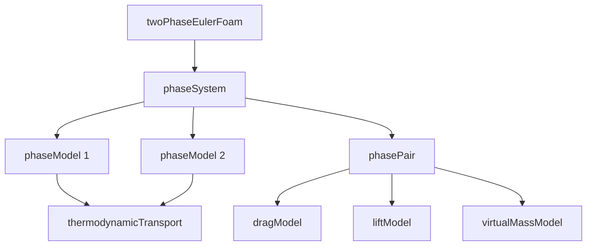
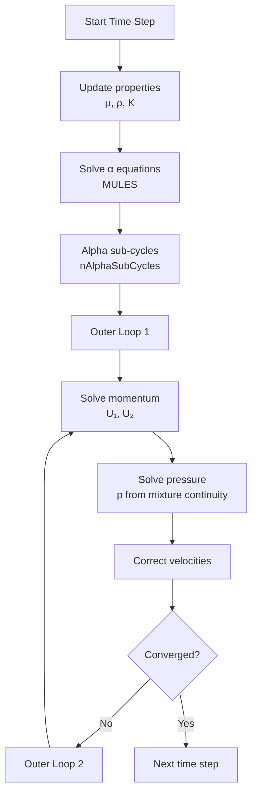

# 03_Implementation_Concepts.md

การนำ Euler-Euler ไปประยุกต์ใช้ใน OpenFOAM

---

## Learning Objectives

หลังจากศึกษาส่วนนี้ คุณควรจะสามารถ:

- **LO1:** อธิบาย **class hierarchy** ของ multiphase solvers ใน OpenFOAM ได้
- **LO2:** ตั้งค่า **phaseProperties** dictionary สำหรับ Euler-Euler simulation ได้
- **LO3:** เลือก **numerical schemes** และ **solution algorithms** ที่เหมาะสมกับ flow regimes ต่างๆ
- **LO4:** ปรับ **PIMPLE parameters** สำหรับ converged two-phase flow ได้
- **LO5:** ตั้งค่า **boundary conditions** และ **turbulence models** สำหรับ multiphase flow ได้

## Key Terms

| ศัพท์ (Term) | ความหมาย |
|--------------|-----------|
| **phaseSystem** | Base class จัดการ multiphase system |
| **phaseModel** | Class เก็บ properties ของแต่ละ phase |
| **phasePair** | Class กำหนด interaction ระหว่าง phases |
| **dragModel** | Model คำนวณ interphase drag coefficient |
| **partial elimination** | เทคนิคเร่ง convergence สำหรับ high density ratio |
| **alpha sub-cycling** | Sub-iterations สำหรับ volume fraction equation |
| **MULES** | Multidimensional Universal Limiter with Explicit Solution |
| **blending method** | วิธีกำหนด continuous phase switching |
| **interphase coupling** | กลไกการเชื่อมโยง momentum ระหว่าง phases |
| **PIMPLE** | Combined PISO-SIMPLE algorithm สำหรับ transient |

---

## Overview

OpenFOAM implementation ของ Euler-Euler ใช้ **modular class structure** ที่แยก phase definitions, interphase models, และ solution algorithms ออกจากกัน ทำให้ flexible แต่ต้องเข้าใจ hierarchy อย่างละเอียด

**Scope ของเอกสารนี้:**
- เน้น **implementation details** ใน OpenFOAM เท่านั้น
- Class hierarchy, data structures, และ configuration dictionaries
- Numerical schemes, solution algorithms, และ boundary conditions
- ไม่ซ้ำซ้อนกับสมการหรือทฤษฎีที่อยู่ใน 01-02

**การอ้างอิงเนื้อหาที่เกี่ยวข้อง:**
- Volume averaging และ governing equations → `02_Mathematical_Framework.md`
- Flow regimes และ physical concepts → `01_Introduction.md`
- ภาพรวม Euler-Euler approach → `00_Overview.md`



---

## 1. OpenFOAM Class Architecture

### 1.1 phaseSystem Class

หัวใจหลักของ multiphase framework:

```cpp
// src/phaseSystemModels/phaseSystem/phaseSystem.H
template<class BasePhaseSystem>
class phaseSystem
:
    public BasePhaseSystem
{
    // ... 
    //- Phase models
    PtrDictionary<phaseModel> phases_;
    
    //- Phase pairs
    PtrDictionary<phasePair> phasePairs_;
    
    //- Interphase transfer models
    autoPtr<dragModel> drag_;
    autoPtr<liftModel> lift_;
    autoPtr<virtualMassModel> virtualMass_;
};
```

**Components:**

| Component | Description | Use Case |
|-----------|-------------|----------|
| `phases_` | Dictionary ของทุก phase (air, water, particles) | Access individual phase fields |
| `phasePairs_` | คู่ของ phases ที่ interact กัน | Define interphase models |
| `drag_`, `lift_`, etc. | Interphase force models | Calculate momentum exchange |

### 1.2 phaseModel Class

แต่ละ phase เก็บ fields ของตัวเอง:

```cpp
// src/phaseSystemModels/phaseModel/phaseModel.H
class phaseModel
{
    //- Name of phase
    word name_;
    
    //- Volume fraction
    volScalarField alpha_;
    
    //- Velocity
    volVectorField U_;
    
    //- Density
    volScalarField rho_;
    
    //- Turbulence model
    autoPtr<compressible::turbulenceModel> turbulence_;
};
```

**Key fields per phase:**

| Field | Type | Purpose |
|-------|------|---------|
| `alpha_` | volScalarField | Volume fraction (0-1) |
| `U_` | volVectorField | Phase velocity |
| `rho_` | volScalarField | Phase density |
| `turbulence_` | turbulenceModel | Per-phase k-ε, k-ω, etc. |

### 1.3 phasePair Class

กำหนด interaction ระหว่าง phases:

```cpp
class phasePair
{
    //- Dispersed phase
    const phaseModel& dispersed_;
    
    //- Continuous phase
    const phaseModel& continuous_;
    
    //- Drag model
    autoPtr<dragModel> drag_;
};
```

**หมายเหตุ:** การกำหนด dispersed/continuous สำคัญต่อ drag model selection

---

## 2. phaseProperties Dictionary Structure

### 2.1 Basic Phase Definition

```cpp
// constant/phaseProperties
phases
(
    water
    {
        diameterModel   constant;
        d               0.001;      // 1 mm bubbles
        
        transportModel  Newtonian;
        nu              1e-06;      // Water viscosity [m²/s]
        
        // Optional: phase pressure
        pressure
        {
            type    constant;
            p       1e05;          // [Pa]
        }
    }
    
    air
    {
        diameterModel   constant;
        d               0.003;      // 3 mm droplets
        
        transportModel  Newtonian;
        nu              1.48e-05;   // Air viscosity [m²/s]
    }
);
```

**Required parameters:**

| Parameter | Description | Unit |
|-----------|-------------|------|
| `diameterModel` | Model สำหรับ particle/droplet size | - |
| `d` | Characteristic diameter | m |
| `transportModel` | Viscosity model | - |
| `nu` | Kinematic viscosity | m²/s |

**Diameter models:**

| Model | Description | Use Case |
|-------|-------------|----------|
| `constant` | Fixed diameter | Monodisperse particles |
| `SauterMean` | Sauter mean diameter | Polydisperse sprays |
| `Ishii` | Size distribution | Bubbles/slugs |

### 2.2 Blending Methods

กำหนด **continuous phase switching** ตาม volume fraction:

```cpp
blending
{
    default
    {
        type    linear;
        
        // Phase fully continuous above this
        minFullyContinuousAlpha.air     0.7;
        minFullyContinuousAlpha.water   0.7;
        
        // Phase partly continuous below this
        minPartlyContinuousAlpha.air    0.3;
        minPartlyContinuousAlpha.water  0.3;
    }
}
```

**Blending behavior:**

| α Range | State | Effect |
|---------|-------|--------|
| α > 0.7 | Fully continuous | Acts as continuous phase (100%) |
| 0.3 < α < 0.7 | Partly continuous | Linear blending (0-100%) |
| α < 0.3 | Fully dispersed | Acts as dispersed phase (0%) |

**Available methods:**

| Method | Description | Use Case |
|--------|-------------|----------|
| `linear` | Linear blending | General purpose |
| `table` | User-defined table | Complex switching |
| `none` | No blending | Fixed continuous phase |

### 2.3 Drag Models

```cpp
drag
{
    // Drag when air dispersed in water
    (air in water)
    {
        type    SchillerNaumann;  // Standard bubbles
    }
    
    // Drag when water dispersed in air
    (water in air)
    {
        type    IshiiZuber;        // Large droplets
    }
}
```

**Available drag models:**

| Model | Suitable For | Flow Regime |
|-------|--------------|-------------|
| `SchillerNaumann` | Solid spheres, isolated bubbles | Re < 800 |
| `IshiiZuber` | Droplets, distorted particles | Wide Re range |
| `Tomiyama` | Deformed bubbles in contaminated liquid | Eötvös number dependent |
| `SyamlalOBrien` | Fluidized beds (granular) | Gas-solid |

### 2.4 Additional Interphase Forces

```cpp
// Lift force
lift
{
    (air in water)
    {
        type    LegendreMagnaudet;
    }
}

// Virtual mass
virtualMass
{
    (air in water)
    {
        type    constantCoefficient;
        Cvm     0.5;
    }
}

// Turbulent dispersion
turbulentDispersion
{
    (air in water)
    {
        type    Burns;
    }
}

// Wall lubrication
wallLubrication
{
    (air in water)
    {
        type    Antal;
    }
}
```

**Force summary:**

| Force | When to Include | Effect |
|-------|-----------------|--------|
| **Drag** | Always | Dominant interphase coupling |
| **Lift** | Shear flows, bubbles | Lateral migration |
| **Virtual mass** | Accelerating flows, ρ ratio moderate | Added mass effect |
| **Turbulent dispersion** | Gas-liquid with high turbulence | Spreads bubbles |
| **Wall lubrication** | Near-wall regions | Prevents wall contact |

---

## 3. Numerical Implementation

### 3.1 Interphase Coupling Strategies

#### Explicit vs Implicit Treatment

```cpp
// EXPLICIT drag (unstable for high K)
tmp<volVectorField> F_drag = K * (U_continuous - U_dispersed);
// Added to RHS only

// IMPLICIT drag (stable)
tmp<fvVectorMatrix> U_dispersed_eqn =
    fvm::ddt(alpha_dispersed, U_dispersed)
  + fvm::div(phi, U_dispersed)
  + fvm::Sp(K, U_dispersed)  // Implicit drag → diagonal
  ==
    K * U_continuous          // Explicit source → RHS
  + ...
```

**Comparison:**

| Treatment | Matrix Form | Stability | Cost | Use Case |
|-----------|-------------|-----------|------|----------|
| Implicit | Adds to diagonal | Excellent | Higher | High K, high ρ ratio |
| Explicit | RHS only | Poor | Lower | Low K, weak coupling |

#### Partial Elimination Algorithm

สำหรับ **high density ratio** (gas-solid, > 1:1000):

```cpp
// system/fvSolution
PIMPLE
{
    partialElimination yes;
}
```

**Algorithm steps:**

1. Solve dispersed phase momentum **first** (with implicit drag)
2. Substitute dispersed velocity into continuous phase equation
3. Eliminates drag term from continuous phase matrix
4. Reduces coupling stiffness

**When to use:**

| Density Ratio | Recommendation |
|---------------|----------------|
| < 10 (liquid-liquid) | Not needed |
| 10-100 (gas-liquid) | Optional |
| > 100 (gas-solid) | **Recommended** |

### 3.2 Phase Fraction Bounding

ป้องกัน α ออกนอก [0, 1]:

```cpp
// constant/fvSchemes
// MULES scheme สำหรับ boundedness
schemes
{
    div(phi,alpha)  Gauss MULES 0.5;
}
```

```cpp
// constant/fvSolution
solvers
{
    alpha
    {
        solver          smoothSolver;
        smoother        symGaussSeidel;
        tolerance       1e-08;
        relTol          0;
        
        // Bounding
        maxAlpha        0.99;
        minAlpha        0.01;
    }
}
```

**MULES features:**

| Feature | Benefit |
|---------|---------|
| Boundedness | Guarantees 0 ≤ α ≤ 1 |
| Multidimensional | Handles unstructured meshes |
| Automatic | No manual clipping needed |

### 3.3 Under-Relaxation

```cpp
relaxationFactors
{
    fields
    {
        p               0.3;
        rho             0.05;
    }
    
    equations
    {
        U               0.7;
        "(k|epsilon|omega)"  0.7;
    }
}
```

**Guidelines:**

| Variable | Typical Rel. | Reason |
|----------|--------------|--------|
| `p` | 0.2-0.5 | Pressure highly coupled |
| `U` | 0.5-0.8 | Moderate coupling |
| `alpha` | 0.8-1.0 | Usually bounded by MULES |
| `rho` | 0.0-0.1 | Strong coupling, needs low rel. |

---

## 4. PIMPLE Algorithm Configuration

### 4.1 Standard Settings

```cpp
// system/fvSolution
PIMPLE
{
    // Outer loops (couple all equations)
    nOuterCorrectors    3;
    
    // Pressure corrections
    nCorrectors         2;
    
    // Non-orthogonal corrections
    nNonOrthogonalCorrectors 0;
    
    // Alpha sub-cycling
    nAlphaSubCycles     2;
    
    // Momentum predictor
    momentumPredictor   yes;
}
```

### 4.2 Parameter Guidelines

| Situation | nOuterCorrectors | nAlphaSubCycles | Reason |
|-----------|------------------|-----------------|--------|
| **Weak coupling** (low K) | 1-2 | 1 | Drag weak |
| **Moderate** (gas-liquid) | 2-3 | 1-2 | Standard |
| **Strong** (gas-solid) | 3-5 | 2-3 | Stiff coupling |
| **Transient accuracy** | 3-5 | 3-5 | Tight coupling |

**เคล็ดลับ:** เริ่มต้นด้วย nOuterCorrectors=3 แล้วปรับตาม convergence behavior

### 4.3 Residual Control

```cpp
PIMPLE
{
    residualControl
    {
        p               1e-05;
        U               1e-05;
        alpha.air       1e-05;
        
        // Stop outer loop if all below threshold
    }
    
    nOuterCorrectors 50;  // Max loops (usually stops earlier)
}
```

**Monitoring:**

```cpp
// system/controlDict
functions
{
    residuals
    {
        type            residuals;
        functionObjectLibs ("libsolvationFunctionObjects.so");
        fields
        (
            p
            U
            alpha.air
        );
    }
}
```

---

## 5. Boundary Conditions

### 5.1 Inlet BCs

```cpp
// 0/alpha.air
inlet
{
    type            fixedValue;
    value           uniform 0.1;  // 10% gas fraction
}

// 0/U.air
inlet
{
    type            fixedValue;
    value           uniform (0 0 1);  // m/s
}

// 0/k.air
inlet
{
    type            fixedValue;
    value           uniform 0.01;  // m²/s²
    
    // Alternative: turbulentIntensityKineticEnergy
    // intensity 0.05;  // 5%
}

// 0/epsilon.air
inlet
{
    type            fixedValue;
    value           uniform 0.001;  // m²/s³
    
    // Alternative: mixingLengthDissipationRateInlet
    // mixingLength 0.001;  // [m]
}
```

### 5.2 Outlet BCs

```cpp
// 0/p
outlet
{
    type            fixedValue;
    value           uniform 0;
}

// 0/U.air
outlet
{
    type            inletOutlet;
    inletValue      uniform (0 0 0);
    value           $internalField;
}

// 0/alpha.air
outlet
{
    type            zeroGradient;  // Allow transport out
}
```

### 5.3 Wall BCs

```cpp
// 0/U.air
wall
{
    type            noSlip;
}

// 0/alpha.air
wall
{
    type            zeroGradient;  // No flux
}

// 0/k.air
wall
{
    type            kqRWallFunction;
    value           $internalField;
}

// 0/epsilon.air
wall
{
    type            epsilonWallFunction;
    value           $internalField;
}
```

### 5.4 Symmetry BCs

```cpp
// 0/U.air
symmetry
{
    type            symmetry;
}

// 0/alpha.air
symmetry
{
    type            symmetryPlane;  // Zero gradient
}
```

### 5.5 Initial Conditions

```cpp
// 0/alpha.air
internalField   uniform 0;  // Start with no gas

// 0/U.air
internalField   uniform (0 0 0);

// 0/p
internalField   uniform 0;
```

---

## 6. Turbulence Modeling

### 6.1 Per-Phase Turbulence

แต่ละ phase มี turbulence model ของตัวเอง:

```cpp
// constant/turbulenceProperties.air
simulationType  RAS;
RAS
{
    RASModel        kEpsilon;
    
    turbulence      on;
    
    printCoeffs     on;
    
    // Wall treatment
    wallFunction    kqRWallFunction;
}

// constant/turbulenceProperties.water
simulationType  RAS;
RAS
{
    RASModel        kEpsilon;
    
    turbulence      on;
}
```

**Files structure:**
```
constant/
├── turbulenceProperties.air
├── turbulenceProperties.water
└── turbulenceProperties.particles  (if needed)
```

### 6.2 Mixture Turbulence

ใช้ **single mixture field** สำหรับ homogeneous flow:

```cpp
// constant/turbulenceProperties
simulationType  RAS;

mixture
{
    RASModel        kEpsilon;
    
    // Use mixture velocity
    Umix            alpha.water*U.water + alpha.air*U.air;
}
```

**Selection guide:**

| Flow Type | Turbulence Strategy | Rationale |
|-----------|---------------------|-----------|
| **Homogeneous** | Mixture model | Faster, sufficient accuracy |
| **Heterogeneous** | Per-phase model | Captures phase-specific effects |
| **Gas-solid** | Per-phase + dispersed models | Particle-laden effects |
| **Free surface** | Single phase in liquid region | Gas region negligible |

### 6.3 Sato Model (Bubble-Induced Turbulence)

สำหรับ gas-liquid flows:

```cpp
// constant/phaseProperties
phases
(
    water
    {
        // ... other properties ...
        
        // Bubble-induced turbulence
        Sato
        {
            Cmu     0.09;
            Cepsilon 0.6;
        }
    }
)
```

---

## 7. Solution Algorithms

### 7.1 Segregated Algorithm Flow



**Algorithm pseudocode:**

```cpp
for (timeStep; time < endTime; ++timeStep)
{
    // Update interphase properties
    calculateInterphaseModels();
    
    // Solve volume fractions
    for (int i=0; i<nAlphaSubCycles; i++)
    {
        solve(alpha1_eqn);
        solve(alpha2_eqn);
    }
    
    // PIMPLE outer loop
    for (int outer=0; outer<nOuterCorrectors; outer++)
    {
        // Momentum predictor
        if (momentumPredictor)
        {
            solve(UEqn1);
            solve(UEqn2);
        }
        
        // Pressure correction (PISO)
        for (int corr=0; corr<nCorrectors; corr++)
        {
            solve(p_eqn);
            U1 -= fvc::grad(p);
            U2 -= fvc::grad(p);
        }
        
        // Check convergence
        if (converged()) break;
    }
}
```

### 7.2 Coupled Algorithm (Advanced)

บาง solvers (สำหรับ **strong coupling**) solve U₁, U₂, p **simultaneously**:

```cpp
// Uses coupled matrix solver
// | A₁₁  0   G₁ | | U₁ |   | b₁ |
// | 0    A₂₂ G₂ | | U₂ | = | b₂ |
// | C₁  C₂   0  | | p  |   | b₃ |
```

**ข้อดี:** Better convergence, faster per time step  
**เสีย:** High memory, complex setup, requires coupled solver library

**When to consider:**

| Aspect | Segregated | Coupled |
|--------|------------|---------|
| Memory | Low | High (3x) |
| Convergence | slower (more outer loops) | faster |
| Setup | Simple | Complex |
| Use case | Standard | Very stiff coupling |

---

## 8. Common Configurations

### 8.1 Bubble Column (Gas-Liquid)

```cpp
// constant/phaseProperties
phases (water air);

drag
{
    (air in water)
    {
        type    Tomiyama;  // Deformed bubbles
    }
}

// system/fvSolution
PIMPLE
{
    nOuterCorrectors    2;
    nAlphaSubCycles     2;
    partialElimination  no;  // Not needed for gas-liquid
}

relaxationFactors
{
    fields
    {
        p       0.3;
    }
    equations
    {
        U       0.7;
    }
}
```

**Key considerations:**
- Tomiyama drag for deformed bubbles
- Moderate outer correctors
- No partial elimination (ρ ratio ~ 1:1000)

### 8.2 Fluidized Bed (Gas-Solid)

```cpp
// constant/phaseProperties
phases (air particles);

particles
{
    diameterModel   constant;
    d               0.0005;  // 500 μm
    rho             constant 2500;  // Sand kg/m³
}

drag
{
    (particles in air)
    {
        type    SyamlalOBrien;  // Granular drag
    }
}

// system/fvSolution
PIMPLE
{
    nOuterCorrectors    5;      // Strong coupling
    nAlphaSubCycles     3;
    partialElimination  yes;    // Critical for high ρ ratio
}

relaxationFactors
{
    fields
    {
        p       0.2;
        rho     0.01;  // Very low for stability
    }
}
```

**Key considerations:**
- SyamlalOBrien drag for granular flows
- High outer correctors (5+)
- **Partial elimination required**
- Very low rho relaxation

### 8.3 Spray Droplets (Liquid-Gas)

```cpp
// constant/phaseProperties
phases (air fuel);

drag
{
    (fuel in air)
    {
        type    IshiiZuber;  // Droplets
    }
}

lift
{
    (fuel in air)
    {
        type    LegendreMagnaudet;
    }
}

// system/fvSolution
PIMPLE
{
    nOuterCorrectors    3;
    nAlphaSubCycles     2;
}
```

**Key considerations:**
- IshiiZuber drag for droplets
- Include lift force (shear-driven)
- Moderate coupling parameters

---

## Quick Reference: Implementation Checklist

### Phase Properties Setup

- [ ] Define all phases with transport properties (nu, rho)
- [ ] Set diameter model (constant, SauterMean, Ishii)
- [ ] Select drag model for each phase pair
- [ ] Add lift/virtual mass if needed
- [ ] Configure blending for phase switching
- [ ] Add additional forces (turbulentDispersion, wallLubrication)

### Numerical Schemes

- [ ] Use MULES for alpha transport: `div(phi,alpha) Gauss MULES 0.5`
- [ ] Select appropriate divergence schemes for U, p
- [ ] Set under-relaxation factors (p: 0.2-0.5, U: 0.5-0.8)
- [ ] Configure alpha solver with bounds (maxAlpha, minAlpha)

### Solution Control

- [ ] Set nOuterCorrectors (2-5 depending on coupling)
- [ ] Enable nAlphaSubCycles if needed (1-3)
- [ ] Consider partialElimination for ρ ratio > 100
- [ ] Configure residual control for convergence monitoring

### Boundary Conditions

- [ ] Inlet: α, U, k, ε for all phases
- [ ] Outlet: p fixed, U inletOutlet, α zeroGradient
- [ ] Wall: noSlip for U, zeroGradient for α
- [ ] Symmetry: symmetryPlane for all fields
- [ ] Initialize fields consistently

### Turbulence

- [ ] Choose per-phase or mixture turbulence model
- [ ] Configure wall functions (kqRWallFunction, epsilonWallFunction)
- [ ] Consider Sato model for bubble-induced turbulence

---

## Concept Check

<details>
<summary><b>1. ทำไม phaseModel ต้องเก็บ turbulence model ของตัวเอง?</b></summary>

เพราะใน Euler-Euler แต่ละ phase **มี velocity field ต่างกัน** → turbulence characteristics (k, ε) ต่างกัน จึงต้องมี k-ε model แยกสำหรับแต่ละ phase โดยเฉพาะใน heterogeneous flows

</details>

<details>
<summary><b>2. partialElimination ใช้ตอนไหน?</b></summary>

เมื่อ **density ratio สูงมาก** (เช่น gas-solid > 1:1000) ที่ explicit drag ไม่ converge โดย algorithm จะ solve dispersed phase ก่อน แล้ว substitute เข้า continuous phase → reduces coupling stiffness

</details>

<details>
<summary><b>3. MULES scheme ทำอะไร?</b></summary>

**Multidimensional Universal Limiter with Explicit Solution** — boundedness scheme สำหรับ volume fraction transport ที่รับประกัน **0 ≤ α ≤ 1** โดย automatic ไม่ต้อง clamp manually

</details>

<details>
<summary><b>4. blending method คืออะไร?</b></summary>

กำหนด **continuous phase switching** เมื่อ volume fraction เปลี่ยน เช่น air bubbles ใน water (water continuous) vs water droplets ใน air (air continuous) — model ต้องรู้ว่าใครเป็น continuous เพื่อคำนวณ drag ถูกต้อง โดย blending จะ smooth การเปลี่ยนนี้ตาม α

</details>

<details>
<summary><b>5. ทำไมต้องใช้ nAlphaSubCycles?</b></summary>

เพื่อ **tighten coupling** ระหว่าง volume fraction และ momentum equations โดย solve α หลายครั้งต่อ time step → improves stability สำหรับ flows ที่มี strong interphase coupling

</details>

<details>
<summary><b>6. implicit drag ดีกว่า explicit ตรงไหน?</b></summary>

Implicit drag เพิ่ม **stability** โดย putting K on matrix diagonal → สามารถใช้ time step ที่ใหญ่ขึ้น แต่ **computational cost สูงกว่า** เพราะ matrix reconstruction แต่ละ iteration

</details>

---

## Related Documents

### Within this sub-module

- **ภาพรวม:** [00_Overview.md](00_Overview.md) — การเปรียบเทียบ Euler-Euler vs Euler-Lagrange
- **แนะนำ:** [01_Introduction.md](01_Introduction.md) — Flow regimes และ physical concepts
- **สมการ:** [02_Mathematical_Framework.md](02_Mathematical_Framework.md) — Volume averaging, governing equations, closure models

### Cross-references

- **Pressure-velocity coupling:** `../../../03_SINGLE_PHASE_FLOW/CONTENT/02_PRESSURE_VELOCITY_COUPLING/03_PISO_and_PIMPLE_Algorithms.md` — PIMPLE algorithm details
- **Turbulence modeling:** `../../../03_SINGLE_PHASE_FLOW/CONTENT/03_TURBULENCE_MODELING/02_RANS_Models.md` — k-ε, k-ω models
- **Boundary conditions:** `../../../03_SINGLE_PHASE_FLOW/CONTENT/01_INCOMPRESSIBLE_FLOW_SOLVERS/03_Simulation_Control.md` — BC types and setup
- **Numerical schemes:** `../../../03_SINGLE_PHASE_FLOW/CONTENT/07_ADVANCED_TOPICS/03_Numerical_Methods.md` — Discretization schemes

### Parent modules

- **Multiphase overview:** `../00_Overview.md` — ภาพรวมทุก multiphase method
- **VOF method:** `../02_VOF_METHOD/` — Interface-tracking approach
- **Interphase forces:** `../04_INTERPHASE_FORCES/01_DRAG/` — Drag model deep dive