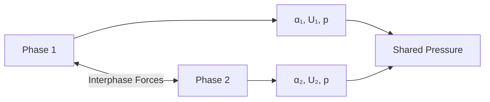
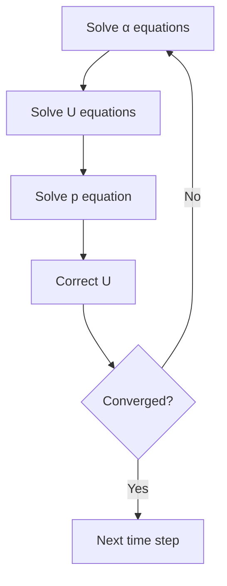

# Euler-Euler Implementation Concepts

แนวคิดการนำ Euler-Euler ไปใช้งานใน OpenFOAM

---

## Overview

> **Euler-Euler** = ทั้งสองเฟสเป็น continuum ที่ซ้อนทับกัน แต่ละเฟสมีสมการอนุรักษ์ของตัวเอง



---

## 1. Volume Averaging

### Concept

$$\alpha_k(\mathbf{x}, t) = \lim_{V \to V_0} \frac{V_k}{V}$$

| Constraint |
|------------|
| $\sum_k \alpha_k = 1$ |

### Averaged Equations

Phase-averaged Navier-Stokes for each phase:

$$\frac{\partial(\alpha_k \rho_k)}{\partial t} + \nabla \cdot (\alpha_k \rho_k \mathbf{u}_k) = \dot{m}_k$$

$$\frac{\partial(\alpha_k \rho_k \mathbf{u}_k)}{\partial t} + \nabla \cdot (\alpha_k \rho_k \mathbf{u}_k \mathbf{u}_k) = -\alpha_k \nabla p + \nabla \cdot \boldsymbol{\tau}_k + \mathbf{M}_k$$

---

## 2. Pressure Coupling

### Shared Pressure

- ทุกเฟสใช้ **same pressure field** $p$
- Pressure equation มาจาก **mixture continuity**

$$\sum_k \nabla \cdot (\alpha_k \rho_k \mathbf{u}_k) = 0$$

### Phase Pressure

- บาง models เพิ่ม **phase pressure** สำหรับ granular systems

$$p_k = p + p_{granular}$$

---

## 3. Interphase Coupling

### Momentum Exchange

$$\mathbf{M}_k = \sum_{l \neq k} (\mathbf{F}^D_{kl} + \mathbf{F}^L_{kl} + \mathbf{F}^{VM}_{kl})$$

### Implicit Treatment

```cpp
// Drag term ใส่เป็น implicit
fvm::Sp(K, U)  // Adds to diagonal

// vs explicit
fvc::Sp(K, U)  // RHS only
```

| Treatment | Stability | Use Case |
|-----------|-----------|----------|
| Implicit | Better | Strong coupling |
| Explicit | Faster | Weak coupling |

---

## 4. Solution Strategy

### Segregated Approach



### PIMPLE Settings

```cpp
PIMPLE
{
    nOuterCorrectors    3;    // Outer iterations
    nCorrectors         2;    // Pressure corrections
    nAlphaSubCycles     2;    // Alpha sub-cycling
}
```

---

## 5. OpenFOAM Classes

### Core Classes

| Class | Purpose |
|-------|---------|
| `phaseSystem` | Manage phases |
| `phaseModel` | Store phase fields |
| `phasePair` | Define phase interactions |
| `dragModel` | Interphase drag |

### phaseProperties Structure

```cpp
phases (air water);

air
{
    diameterModel   constant;
    d               0.003;
}

blending
{
    default
    {
        type            linear;
        minFullyContinuousAlpha.air 0.7;
        minPartlyContinuousAlpha.air 0.3;
    }
}

drag { (air in water) { type SchillerNaumann; } }
```

---

## 6. Numerical Challenges

### High Density Ratio

| ρ₁/ρ₂ | Challenge | Solution |
|-------|-----------|----------|
| > 100 | Stiff coupling | Partial elimination |
| > 1000 | Convergence | More outer iterations |

```cpp
// system/fvSolution
PIMPLE
{
    partialElimination yes;  // For gas-solid
}
```

### Phase Fraction Bounding

```cpp
// Ensure 0 ≤ α ≤ 1
alpha.max(0);
alpha.min(1);
```

---

## 7. Turbulence Modeling

### Per-Phase Turbulence

```cpp
// constant/turbulenceProperties.air
simulationType  RAS;
RAS
{
    RASModel    kEpsilon;
    turbulence  on;
}
```

### Mixture Turbulence

- ใช้ **mixture k-ε** สำหรับ homogeneous flow
- แต่ละ phase inherit จาก mixture

---

## 8. Boundary Conditions

### Inlet

```cpp
// 0/alpha.air
inlet
{
    type    fixedValue;
    value   uniform 0.1;  // 10% gas
}

// 0/U.air
inlet
{
    type    fixedValue;
    value   uniform (0 0 1);
}
```

### Wall

```cpp
// 0/U.water
wall
{
    type    noSlip;
}

// 0/alpha.air (no flux)
wall
{
    type    zeroGradient;
}
```

---

## Quick Reference

| Concept | Implementation |
|---------|----------------|
| Volume fraction | `alpha.*` fields |
| Shared pressure | Single `p` field |
| Interphase forces | `phaseProperties` → drag, lift, etc. |
| Phase coupling | PIMPLE outer iterations |

---

## Concept Check

<details>
<summary><b>1. ทำไมใช้ shared pressure?</b></summary>

เพราะใน Euler-Euler ทุกเฟส occupy **same space** → ความดันต้องเท่ากันที่ทุกจุดเพื่อ satisfy continuity
</details>

<details>
<summary><b>2. Implicit drag treatment ดีกว่าอย่างไร?</b></summary>

เพิ่ม **diagonal dominance** ของ matrix → **better convergence** โดยเฉพาะเมื่อ drag coefficient สูง
</details>

<details>
<summary><b>3. nOuterCorrectors ทำอะไร?</b></summary>

**จำนวน loops** ที่ทุกสมการถูก solve ซ้ำใน 1 time step — ค่ามากทำให้ coupling ดีขึ้นแต่ช้าลง
</details>

---

## Related Documents

- **ภาพรวม:** [00_Overview.md](00_Overview.md)
- **Introduction:** [01_Introduction.md](01_Introduction.md)
- **Governing Equations:** [02_Governing_Equations.md](02_Governing_Equations.md)