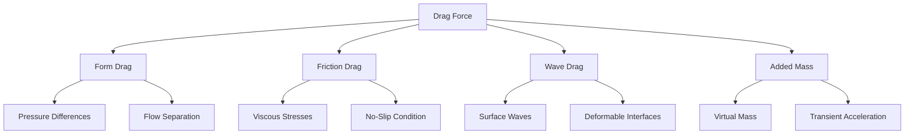

# Drag Forces in Multiphase Flow

> [!INFO] Overview Note
> This comprehensive overview covers **drag forces** - the primary mechanism for interfacial momentum exchange in Eulerian-Eulerian multiphase flows. It bridges fundamental physics with OpenFOAM implementation.

---

## 📋 Table of Contents

- [[01_Introduction|Introduction to Drag Forces]]
- [[02_Fundamental_Drag_Concept|Fundamental Drag Concepts]]
- [[03_Single_Particle_Drag_-_Fundamental_Derivation|Single Particle Drag Derivation]]
- [[04_Multiphase_Extension_-_Volume_Averaged_Drag|Volume-Averaged Multiphase Extension]]
- [[05_Specific_Drag_Models|Specific Drag Models]]
- [[06_Non-Spherical_Particles|Non-Spherical Particles]]
- [[07_Dense_Suspension_Effects|Dense Suspension Effects]]
- [[08_Deformable_Interfaces|Deformable Interfaces]]
- [[09_OpenFOAM_Implementation_Details|OpenFOAM Implementation]]
- [[10_Turbulent_Effects|Turbulent Effects]]
- [[11_Stability_Considerations|Stability Considerations]]
- [[12_Validation_and_Applications|Validation and Applications]]
- [[13_Summary|Summary]]

---

## 🎯 Core Concepts

### What is Drag?

**Drag forces** represent the resistance experienced by objects moving through fluids, or the resistance between two interpenetrating fluids. In multiphase flow, drag is the ==dominant mechanism for interfacial momentum transfer== between phases.

### Mathematical Framework

For phase $k$ experiencing drag due to phase $l$:

$$\mathbf{F}_{D,kl} = \mathbf{K}_{kl}(\mathbf{u}_l - \mathbf{u}_k)$$

Where:
- $\mathbf{K}_{kl}$ = **Interfacial momentum exchange coefficient**
- $\mathbf{u}_l - \mathbf{u}_k$ = Relative velocity between phases

---

## 🔬 Physical Mechanisms

Drag in multiphase flow arises from four fundamental mechanisms:

| Mechanism | Description | Governing Physics |
|-----------|-------------|-------------------|
| **Form Drag** | Pressure differences around inclusions | Flow separation, wake formation |
| **Friction Drag** | Viscous stresses on interfaces | No-slip boundary conditions |
| **Wave Drag** | Surface wave propagation | Deformable interfaces |
| **Added Mass** | Fluid acceleration around objects | Virtual mass effects |



---

## 📊 From Single Particle to Multiphase

### Single Particle Foundation

For a single sphere in a flow:

$$\mathbf{F}_D = \frac{1}{2} C_D \rho_f A |\mathbf{u}_f - \mathbf{u}_p| (\mathbf{u}_f - \mathbf{u}_p)$$

**Key Parameter: Particle Reynolds Number**
$$Re_p = \frac{\rho_f |\mathbf{u}_p - \mathbf{u}_f| d}{\mu_f}$$

### Flow Regimes

| Regime | Reynolds Range | Drag Coefficient | Flow Character |
|--------|---------------|------------------|----------------|
| **Stokes** | $Re_p < 1$ | $C_D = \frac{24}{Re_p}$ | Creeping flow |
| **Transitional** | $1 < Re_p < 1000$ | Schiller-Naumann | Flow separation begins |
| **Newton** | $Re_p > 1000$ | $C_D \approx 0.44$ | Fully turbulent |

### Volume-Averaged Extension

For multiphase systems, we extend to volume-averaged drag:

$$\mathbf{F}_{D,kl} = \frac{3}{4} C_D \frac{\alpha_k \alpha_l \rho_l}{d_k} |\mathbf{u}_l - \mathbf{u}_k| (\mathbf{u}_l - \mathbf{u}_k)$$

**Momentum Exchange Coefficient:**
$$\mathbf{K}_{kl} = \frac{3}{4} C_D \frac{\alpha_k \alpha_l \rho_l}{d_k} |\mathbf{u}_l - \mathbf{u}_k|$$

---

## 🧩 Major Drag Models in OpenFOAM

### 1. Schiller-Naumann Model

**Most widely used** for spherical particles:

$$C_D = \begin{cases}
\frac{24}{Re_p}(1 + 0.15 Re_p^{0.687}) & Re_p < 1000 \\
0.44 & Re_p \geq 1000
\end{cases}$$

**Use when:**
- Particles are approximately spherical
- Moderate Reynolds numbers
- General multiphase flows

### 2. Ishii-Zuber Model

**For deformable bubbles/droplets:**

$$C_D = \begin{cases}
\frac{24}{Re_p}(1 + 0.1 Re_p^{0.75}) & Re_p < 1000 \\
\frac{8}{3}\frac{Eo}{Eo + 4} & \text{Distorted regime}
\end{cases}$$

**Eötvös Number:** $Eo = \frac{g(\rho_c - \rho_d)d^2}{\sigma}$

**Use when:**
- Gas-liquid systems
- Deformable interfaces
- High Eötvös numbers

### 3. Syamlal-O'Brien Model

**For fluidized beds and dense suspensions:**

$$C_D = \frac{v_r^2}{v_s^2}$$

**Use when:**
- Fluidized bed applications
- Dense particle suspensions
- Significant particle concentration effects

### Model Comparison

| Model | Best For | Advantages | Limitations |
|-------|----------|------------|-------------|
| **Schiller-Naumann** | General spherical particles | Simple, robust, stable | Not for deformed particles |
| **Ishii-Zuber** | Bubbly flows, distorted interfaces | Accounts for deformation | More complex |
| **Morsi-Alexander** | Wide $Re_p$ range | High accuracy | Complex, many parameters |
| **Syamlal-O'Brien** | Fluidized beds, dense suspensions | Handles crowding effects | Limited to other flow types |

---

## ⚙️ OpenFOAM Implementation Architecture

### Class Hierarchy

```cpp
// Base drag model class
class dragModel
{
public:
    // Calculate drag coefficient
    virtual tmp<volScalarField> Cd() const = 0;

    // Calculate momentum exchange coefficient
    virtual tmp<volScalarField> K() const;

    // Calculate drag force
    virtual tmp<volVectorField> F() const;
};
```

### Schiller-Naumann Implementation

```cpp
template<class PhasePair>
class SchillerNaumann
:
    public dragModel
{
    virtual tmp<volScalarField> Cd() const
    {
        const volScalarField& Re = pair_.Re();

        return volScalarField::New
        (
            "Cd",
            max
            (
                24.0/Re*(1.0 + 0.15*pow(Re, 0.687)),
                0.44
            )
        );
    }
};
```

### Momentum Exchange Calculation

```cpp
tmp<volScalarField> dragModel::K() const
{
    const volScalarField& alpha1 = pair_.phase1().alpha();
    const volScalarField& alpha2 = pair_.phase2().alpha();
    const volScalarField& rho2 = pair_.phase2().rho();
    const volScalarField& d = pair_.dispersed().d();
    const volScalarField& Ur = pair_.Ur();

    return (3.0/4.0)*Cd()*alpha1*alpha2*rho2/(d)*Ur;
}
```

### Relative Velocity Handling

```cpp
tmp<volScalarField> PhasePair::Ur() const
{
    return mag(phase2().U() - phase1().U());
}

tmp<volScalarField> PhasePair::Re() const
{
    return phase1().rho()*Ur()*dispersed().d()/phase1().mu();
}
```

---

## 🌊 Advanced Considerations

### Non-Spherical Particles

**Shape Factor:** $\phi = \frac{\text{Surface area of equivalent sphere}}{\text{Actual surface area}}$

**Effective Diameter:** $d_{eff} = d_v \phi^{0.5}$

**Haider-Levenspiel Correlation:**
$$C_D = \frac{24}{Re_p}(1 + a Re_p^b) + \frac{c}{1 + d/Re_p}$$

### Dense Suspension Effects

**Hindered settling** becomes significant at $\alpha_d > 0.1$:

**Richardson-Zaki Equation:**
$$v_t = v_{t,0} (1 - \alpha_d)^n$$

**Modified Momentum Exchange:**
$$\mathbf{K}_{kl}^{modified} = \mathbf{K}_{kl} f(\alpha_l)$$

| Correction | Formula | Application |
|------------|---------|-------------|
| **Einstein** | $f(\alpha_l) = (1 - \alpha_d)^{2.5}$ | Low concentrations |
| **Barnea-Mizrahi** | $f(\alpha_l) = (1 - \alpha_d)^{2.0} \exp\left(\frac{2.5\alpha_d}{1 - \alpha_d}\right)$ | High concentrations |

### Deformable Interfaces

**For bubbles/drops with deformation:**

1. **Shape deformation** - Aspect ratio changes
2. **Internal circulation** - Internal flow patterns
3. **Surfactant effects** - Interface contamination

**Grace Correlation:**
$$C_D = \max\left[\frac{2}{\sqrt{Re_p}}, \min\left(\frac{8}{3}\frac{Eo}{Eo + 4}, 0.44\right)\right]$$

**Tomiyama Correlation:**
$$C_D = \max\left[0.44, \min\left(\frac{24}{Re_p}(1 + 0.15 Re_p^{0.687}), \frac{72}{Re_p}\right)\right]$$

### Turbulent Dispersion

**Turbulent dispersion force:**
$$\mathbf{F}_{TD} = -C_{TD} \rho_c k_c \nabla \alpha_d$$

**Effective relative velocity:**
$$|\mathbf{u}_{rel}|_{eff} = \sqrt{|\mathbf{u}_l - \mathbf{u}_k|^2 + 2k_c}$$

---

## 🔒 Stability Considerations

### Explicit vs. Implicit Treatment

| Aspect | Explicit | Implicit |
|--------|----------|----------|
| **Stability** | Conditional (CFL) | Unconditional |
| **Time step** | Limited | Larger possible |
| **Cost per step** | Low | Higher |
| **Complexity** | Simple | Complex |

**Explicit Drag:**
$$\mathbf{M}_k^{n+1} = \mathbf{K}_{kl}^n (\mathbf{u}_l^n - \mathbf{u}_k^n)$$

**Implicit Drag:**
$$\mathbf{M}_k^{n+1} = \mathbf{K}_{kl}^{n+1} (\mathbf{u}_l^{n+1} - \mathbf{u}_k^{n+1})$$

### Under-Relaxation Strategies

$$\mathbf{K}_{kl}^{new} = (1-\lambda)\mathbf{K}_{kl}^{old} + \lambda \mathbf{K}_{kl}^{calculated}$$

**Typical relaxation factors:** $\lambda = 0.3 - 0.7$

**OpenFOAM configuration:**
```cpp
relaxationFactors
{
    equations
    {
        U           0.7;
        p           0.3;
        k           0.6;
        epsilon     0.5;
    }

    fields
    {
        "alpha.*"   0.4;
    }
}
```

---

## ✅ Validation and Applications

### Benchmark Cases

| Case | Validation Target | Key Metrics |
|------|------------------|-------------|
| **Single particle settling** | Terminal velocity | Analytical solutions |
| **Fluidized bed** | Minimum fluidization velocity | Pressure drop, bed expansion |
| **Bubble column** | Rise velocity correlations | Gas holdup, flow regimes |
| **Pipeline flow** | Pressure drop predictions | Flow pattern transitions |

### Model Selection Guidelines

#### Dimensionless Parameter Analysis

**1. Particle Reynolds Number ($Re_p$):**

| Value | Recommendation | Suitable Model |
|-------|----------------|-----------------|
| $Re_p < 1$ | Creeping flow | Schiller-Naumann or Stokes |
| $1 < Re_p < 100$ | Intermediate | Schiller-Naumann with corrections |
| $Re_p > 1000$ | High speed | Ishii-Zuber for deformable interfaces |

**2. Eötvös Number ($Eo$):**

| Value | Surface tension effect | Suitable Model |
|-------|----------------------|-----------------|
| $Eo < 1$ | Surface tension dominates | Schiller-Naumann |
| $1 < Eo < 40$ | Moderate deformation | Ishii-Zuber |
| $Eo > 40$ | Significant deformation | Ishii-Zuber |

**3. Void Fraction ($\alpha_d$):**

| Value | Particle concentration | Suitable Model |
|-------|----------------------|-----------------|
| $\alpha_d < 0.1$ | Dilute suspension | Schiller-Naumann |
| $0.1 < \alpha_d < 0.4$ | Moderate concentration | Ishii-Zuber |
| $\alpha_d > 0.4$ | Dense suspension | Syamlal-O'Brien |

---

## 📈 Key Takeaways

### Fundamental Principles

1. **Physics Foundation** - Based on single-particle drag fundamentals
2. **Volume Averaging** - Extends to multiphase systems
3. **Multiple Correlations** - For different flow regimes
4. **Dense Suspension Effects** - Important at high volume fractions
5. **Deformable Interface Considerations** - For bubbles/drops
6. **OpenFOAM Implementation** - Modular drag model architecture
7. **Stability Considerations** - Critical for numerical solutions

### Implementation Best Practices

> [!TIP] Practical Recommendations
> - **Start simple** with Schiller-Naumann for spherical particles
> - **Consider deformation** for gas-liquid systems (Ishii-Zuber)
> - **Account for crowding** in dense suspensions (Syamlal-O'Brien)
> - **Use implicit treatment** for strongly coupled flows
> - **Apply under-relaxation** for improved convergence
> - **Validate against** experimental or analytical data when possible

### Industrial Applications

- **Fluidized beds** - Combustion, chemical processing
- **Bubble columns** - Reactors, separations
- **Spray systems** - Fuel injection, coating
- **Sediment transport** - Environmental, geological flows
- **Pipeline flows** - Oil & gas, slurry transport

---

## 🔗 Related Topics

Understanding drag forces is essential for:
- [[Lift Forces|Interfacial lift forces]]
- [[Virtual Mass|Virtual mass effects]]
- [[Turbulent Dispersion|Turbulent dispersion modeling]]
- [[Heat Mass Transfer|Interfacial heat and mass transfer]]

---

## 📚 Further Reading

**Primary References:**
- Ishii, M., & Hibiki, T. (2011). *Thermo-Fluid Dynamics of Two-Phase Flow*. Springer.
- Crowe, C. T., et al. (2011). *Multiphase Flows with Droplets and Particles*. CRC Press.
- Clift, R., Grace, J. R., & Weber, M. E. (2005). *Bubbles, Drops, and Particles*. Dover.

**OpenFOAM Implementation:**
- Source: `src/transportModels/interfaceProperties/dragModel/`
- Tutorial: `multiphase/multiphaseEulerFoam/`

---

> [!QUOTE] Final Note
> **Drag forces are the cornerstone of multiphase flow modeling** - they govern how phases interact, exchange momentum, and ultimately determine flow behavior. Master these fundamentals, and you'll have the foundation for accurate multiphase CFD simulations.
