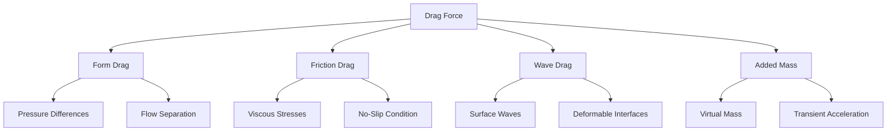

# แรงลากในกระแสของไหลแบบหลายเฟส (Drag Forces in Multiphase Flow)

> [!INFO] ภาพรวมโน้ต (Overview Note)
> โน้ตภาพรวมนี้ครอบคลุม **แรงลาก (drag forces)** ซึ่งเป็นกลไกหลักในการแลกเปลี่ยนโมเมนตัมระหว่างเฟสใน Eulerian-Eulerian multiphase flows โดยเชื่อมโยงหลักการทางฟิสิกส์กับการนำไปใช้ใน OpenFOAM

---

## 📋 สารบัญ (Table of Contents)

- [[01_Introduction|บทนำสู่แรงลาก (Introduction to Drag Forces)]]
- [[02_Fundamental_Drag_Concept|แนวคิดพื้นฐานของแรงลาก (Fundamental Drag Concepts)]]
- [[03_Single_Particle_Drag_-_Fundamental_Derivation|การอนุพันธ์แรงลากอนุภาคเดี่ยว (Single Particle Drag Derivation)]]
- [[04_Multiphase_Extension_-_Volume_Averaged_Drag|การขยายผลแบบหลายเฟส - แรงลากเฉลี่ยเชิงปริมาตร (Volume-Averaged Multiphase Extension)]]
- [[05_Specific_Drag_Models|แบบจำลองแรงลากเฉพาะ (Specific Drag Models)]]
- [[06_Non-Spherical_Particles|อนุภาคที่ไม่ใช่ทรงกลม (Non-Spherical Particles)]]
- [[07_Dense_Suspension_Effects|ผลกระทบของสารแขวนลอยหนาแน่น (Dense Suspension Effects)]]
- [[08_Deformable_Interfaces|พื้นผิวที่เปลี่ยนรูปได้ (Deformable Interfaces)]]
- [[09_OpenFOAM_Implementation_Details|รายละเอียดการนำไปใช้ใน OpenFOAM (OpenFOAM Implementation)]]
- [[10_Turbulent_Effects|ผลกระทบจากความปั่นป่วน (Turbulent Effects)]]
- [[11_Stability_Considerations|ข้อควรพิจารณาด้านเสถียรภาพ (Stability Considerations)]]
- [[12_Validation_and_Applications|การตรวจสอบความถูกต้องและการประยุกต์ใช้ (Validation and Applications)]]
- [[13_Summary|สรุป (Summary)]]

---

## 🎯 แนวคิดพื้นฐาน (Core Concepts)

### แรงลากคืออะไร? (What is Drag?)

**แรงลาก (Drag forces)** หมายถึงแรงต้านที่วัตถุประสบเมื่อเคลื่อนที่ผ่านของไหล หรือแรงต้านระหว่างของไหลสองชนิดที่แทรกซึมซึ่งกันและกัน ใน multiphase flow แรงลากเป็น ==กลไกหลักในการแลกเปลี่ยนโมเมนตัมระหว่างเฟส==

### กรอบคณิตศาสตร์ (Mathematical Framework)

สำหรับเฟส $k$ ที่ได้รับแรงลากจากเฟส $l$:

$$\mathbf{F}_{D,kl} = \mathbf{K}_{kl}(\mathbf{u}_l - \mathbf{u}_k)$$

โดยที่:
- $\mathbf{K}_{kl}$ = **สัมประสิทธิ์การแลกเปลี่ยนโมเมนตัมระหว่างเฟส** (interfacial momentum exchange coefficient)
- $\mathbf{u}_l - \mathbf{u}_k$ = ความเร็วสัมพัทธ์ระหว่างเฟส

---

## 🔬 กลไกทางฟิสิกส์ (Physical Mechanisms)

แรงลากใน multiphase flow เกิดจากกลไกพื้นฐาน 4 ประการ:

| กลไก | คำอธิบาย | ฟิสิกส์ที่ควบคุม |
|--------|-------------|-------------------|
| **Form Drag** | ความแตกต่างของความดันรอบๆ สิ่งแปลกปลอม | Flow separation, wake formation |
| **Friction Drag** | แรงเค้นจากความหนืดบนพื้นผิว | No-slip boundary conditions |
| **Wave Drag** | การแพร่กระจายของคลื่นพื้นผิว | Deformable interfaces |
| **Added Mass** | การเร่งความเร็วของของไหลรอบๆ วัตถุ | Virtual mass effects |



---

## 📊 จากอนุภาคเดี่ยวสู่ Multiphase (From Single Particle to Multiphase)

### รากฐานอนุภาคเดี่ยว (Single Particle Foundation)

สำหรับทรงกลมเดี่ยวในกระแสของไหล:

$$\mathbf{F}_D = \frac{1}{2} C_D \rho_f A |\mathbf{u}_f - \mathbf{u}_p| (\mathbf{u}_f - \mathbf{u}_p)$$

**พารามิเตอร์สำคัญ: จำนวนเรย์โนลด์ของอนุภาค**
$$Re_p = \frac{\rho_f |\mathbf{u}_p - \mathbf{u}_f| d}{\mu_f}$$

### ระบอบการไหล (Flow Regimes)

| ระบอบ | ช่วง Reynolds | สัมประสิทธิ์แรงลาก | ลักษณะการไหล |
|--------|---------------|------------------|----------------|
| **Stokes** | $Re_p < 1$ | $C_D = \frac{24}{Re_p}$ | Creeping flow |
| **Transitional** | $1 < Re_p < 1000$ | Schiller-Naumann | Flow separation begins |
| **Newton** | $Re_p > 1000$ | $C_D \approx 0.44$ | Fully turbulent |

### การขยายผลแบบเฉลี่ยเชิงปริมาตร (Volume-Averaged Extension)

สำหรับระบบ multiphase เราขยายผลไปสู่แรงลากเฉลี่ยเชิงปริมาตร:

$$\mathbf{F}_{D,kl} = \frac{3}{4} C_D \frac{\alpha_k \alpha_l \rho_l}{d_k} |\mathbf{u}_l - \mathbf{u}_k| (\mathbf{u}_l - \mathbf{u}_k)$$

**สัมประสิทธิ์การแลกเปลี่ยนโมเมนตัม (Momentum Exchange Coefficient):**
$$\mathbf{K}_{kl} = \frac{3}{4} C_D \frac{\alpha_k \alpha_l \rho_l}{d_k} |\mathbf{u}_l - \mathbf{u}_k|$$

---

## 🧩 แบบจำลองแรงลากหลักใน OpenFOAM (Major Drag Models in OpenFOAM)

### 1. แบบจำลอง Schiller-Naumann (Schiller-Naumann Model)

**แบบจำลองแรงลากที่ใช้กันอย่างแพร่หลายที่สุด** สำหรับอนุภาคทรงกลม:

$$C_D = \begin{cases}
\frac{24}{Re_p}(1 + 0.15 Re_p^{0.687}) & Re_p < 1000 \\
0.44 & Re_p \geq 1000
\end{cases}$$

**ใช้เมื่อ:**
- อนุภาคมีรูปร่างเกือบทรงกลม
- จำนวนเรย์โนลด์ปานกลาง
- กระแสของไหลแบบ multiphase ทั่วไป

### 2. แบบจำลอง Ishii-Zuber (Ishii-Zuber Model)

**สำหรับฟอง/หยดที่เปลี่ยนรูปได้ (deformable bubbles/droplets):**

$$C_D = \begin{cases}
\frac{24}{Re_p}(1 + 0.1 Re_p^{0.75}) & Re_p < 1000 \\
\frac{8}{3}\frac{Eo}{Eo + 4} & \text{Distorted regime}
\end{cases}$$

**เลข Eötvös:** $Eo = \frac{g(\rho_c - \rho_d)d^2}{\sigma}$

**ใช้เมื่อ:**
- ระบบแก๊ส-ของเหลว (gas-liquid systems)
- พื้นผิวที่เปลี่ยนรูปได้
- เลข Eötvös สูง

### 3. แบบจำลอง Syamlal-O'Brien (Syamlal-O'Brien Model)

**สำหรับเตาอบฟลูอิดไดซ์และสารแขวนลอยหนาแน่น:**

$$C_D = \frac{v_r^2}{v_s^2}$$

**ใช้เมื่อ:**
- แอปพลิเคชันเตาอบฟลูอิดไดซ์ (fluidized bed applications)
- สารแขวนลอยอนุภาคหนาแน่น (dense particle suspensions)
- ผลกระทบของความเข้มข้นอนุภาคมีนัยสำคัญ

### การเปรียบเทียบแบบจำลอง (Model Comparison)

| แบบจำลอง | เหมาะสำหรับ | ข้อดี | ข้อจำกัด |
|-------|----------|------------|-------------|
| **Schiller-Naumann** | อนุภาคทรงกลมทั่วไป | ใช้ง่าย, เสถียร, แข็งแรง | ไม่เหมาะกับอนุภาคที่เปลี่ยนรูป |
| **Ishii-Zuber** | กระแสฟอง, พื้นผิวที่บิดเบี้ยว | รองรับการเปลี่ยนรูป | ซับซ้อนกว่า |
| **Morsi-Alexander** | ช่วง $Re_p$ กว้าง | ความแม่นยำสูง | ซับซ้อน, ต้องการพารามิเตอร์มาก |
| **Syamlal-O'Brien** | เตาอบฟลูอิดไดซ์, สารแขวนลอยหนาแน่น | จัดการผลกระทบแบบแน่นได้ | จำกัดสำหรับประเภทการไหลอื่น |

---

## ⚙️ สถาปัตยกรรมการนำไปใช้ใน OpenFOAM (OpenFOAM Implementation Architecture)

### ลำดับชั้นของคลาส (Class Hierarchy)

```cpp
// Base drag model class
class dragModel
{
public:
    // Calculate drag coefficient
    virtual tmp<volScalarField> Cd() const = 0;

    // Calculate momentum exchange coefficient
    virtual tmp<volScalarField> K() const;

    // Calculate drag force
    virtual tmp<volVectorField> F() const;
};
```

### การนำไปใช้ Schiller-Naumann (Schiller-Naumann Implementation)

```cpp
template<class PhasePair>
class SchillerNaumann
:
    public dragModel
{
    virtual tmp<volScalarField> Cd() const
    {
        const volScalarField& Re = pair_.Re();

        return volScalarField::New
        (
            "Cd",
            max
            (
                24.0/Re*(1.0 + 0.15*pow(Re, 0.687)),
                0.44
            )
        );
    }
};
```

### การคำนวณสัมประสิทธิ์การแลกเปลี่ยนโมเมนตัม (Momentum Exchange Calculation)

```cpp
tmp<volScalarField> dragModel::K() const
{
    const volScalarField& alpha1 = pair_.phase1().alpha();
    const volScalarField& alpha2 = pair_.phase2().alpha();
    const volScalarField& rho2 = pair_.phase2().rho();
    const volScalarField& d = pair_.dispersed().d();
    const volScalarField& Ur = pair_.Ur();

    return (3.0/4.0)*Cd()*alpha1*alpha2*rho2/(d)*Ur;
}
```

### การจัดการความเร็วสัมพัทธ์ (Relative Velocity Handling)

```cpp
tmp<volScalarField> PhasePair::Ur() const
{
    return mag(phase2().U() - phase1().U());
}

tmp<volScalarField> PhasePair::Re() const
{
    return phase1().rho()*Ur()*dispersed().d()/phase1().mu();
}
```

---

## 🌊 ข้อควรพิจารณาขั้นสูง (Advanced Considerations)

### อนุภาคที่ไม่ใช่ทรงกลม (Non-Spherical Particles)

**ตัวประกอบรูปร่าง (Shape Factor):** $\phi = \frac{\text{พื้นที่ผิวของทรงกลมเทียบเท่า}}{\text{พื้นที่ผิวจริง}}$

**เส้นผ่านศูนย์กลางประสิทธิผล (Effective Diameter):** $d_{eff} = d_v \phi^{0.5}$

**สหสัมพันธ์ Haider-Levenspiel:**
$$C_D = \frac{24}{Re_p}(1 + a Re_p^b) + \frac{c}{1 + d/Re_p}$$

### ผลกระทบของสารแขวนลอยหนาแน่น (Dense Suspension Effects)

**การตกตะกอนแบบถูกขัดขวาง (Hindered settling)** มีนัยสำคัญที่ $\alpha_d > 0.1$:

**สมการ Richardson-Zaki:**
$$v_t = v_{t,0} (1 - \alpha_d)^n$$

**การแลกเปลี่ยนโมเมนตัมที่ปรับเปลี่ยนแล้ว (Modified Momentum Exchange):**
$$\mathbf{K}_{kl}^{modified} = \mathbf{K}_{kl} f(\alpha_l)$$

| การแก้ไข | สูตร | แอปพลิเคชัน |
|------------|---------|-------------|
| **Einstein** | $f(\alpha_l) = (1 - \alpha_d)^{2.5}$ | ความเข้มข้นต่ำ |
| **Barnea-Mizrahi** | $f(\alpha_l) = (1 - \alpha_d)^{2.0} \exp\left(\frac{2.5\alpha_d}{1 - \alpha_d}\right)$ | ความเข้มข้นสูง |

### พื้นผิวที่เปลี่ยนรูปได้ (Deformable Interfaces)

**สำหรับฟอง/หยดที่เปลี่ยนรูป:**

1. **การเปลี่ยนรูปร่าง** - การเปลี่ยนแปลงอัตราส่วนรูปร่าง
2. **การไหลเวียนภายใน** - รูปแบบการไหลภายใน
3. **ผลกระทบของสารลดแรงตึงผิว** - การปนเปื้อนของพื้นผิว

**สหสัมพันธ์ Grace:**
$$C_D = \max\left[\frac{2}{\sqrt{Re_p}}, \min\left(\frac{8}{3}\frac{Eo}{Eo + 4}, 0.44\right)\right]$$

**สหสัมพันธ์ Tomiyama:**
$$C_D = \max\left[0.44, \min\left(\frac{24}{Re_p}(1 + 0.15 Re_p^{0.687}), \frac{72}{Re_p}\right)\right]$$

### การกระจายตัวเนื่องจากความปั่นป่วน (Turbulent Dispersion)

**แรงกระจายตัวเนื่องจากความปั่นป่วน:**
$$\mathbf{F}_{TD} = -C_{TD} \rho_c k_c \nabla \alpha_d$$

**ความเร็วสัมพัทธ์ประสิทธิผล:**
$$|\mathbf{u}_{rel}|_{eff} = \sqrt{|\mathbf{u}_l - \mathbf{u}_k|^2 + 2k_c}$$

---

## 🔒 ข้อควรพิจารณาด้านเสถียรภาพ (Stability Considerations)

### การจัดการแบบชัดเจนเทียบกับแบบปริยาย (Explicit vs. Implicit Treatment)

| ด้าน | Explicit | Implicit |
|--------|----------|----------|
| **เสถียรภาพ** | มีเงื่อนไข (CFL) | ไม่มีเงื่อนไข |
| **ขั้นเวลา** | จำกัด | ใหญ่ขึ้นได้ |
| **ต้นทุนต่อขั้น** | ต่ำ | สูงกว่า |
| **ความซับซ้อน** | ง่าย | ซับซ้อน |

**แรงลากแบบชัดเจน (Explicit Drag):**
$$\mathbf{M}_k^{n+1} = \mathbf{K}_{kl}^n (\mathbf{u}_l^n - \mathbf{u}_k^n)$$

**แรงลากแบบปริยาย (Implicit Drag):**
$$\mathbf{M}_k^{n+1} = \mathbf{K}_{kl}^{n+1} (\mathbf{u}_l^{n+1} - \mathbf{u}_k^{n+1})$$

### กลยุทธ์การลดทอน (Under-Relaxation Strategies)

$$\mathbf{K}_{kl}^{new} = (1-\lambda)\mathbf{K}_{kl}^{old} + \lambda \mathbf{K}_{kl}^{calculated}$$

**ตัวประกอบการลดทอนทั่วไป:** $\lambda = 0.3 - 0.7$

**การกำหนดค่า OpenFOAM:**
```cpp
relaxationFactors
{
    equations
    {
        U           0.7;
        p           0.3;
        k           0.6;
        epsilon     0.5;
    }

    fields
    {
        "alpha.*"   0.4;
    }
}
```

---

## ✅ การตรวจสอบความถูกต้องและการประยุกต์ใช้ (Validation and Applications)

### กรณี Benchmark (Benchmark Cases)

| กรณี | เป้าหมายการตรวจสอบ | เมตริกสำคัญ |
|------|------------------|-------------|
| **การตกตะกอนอนุภาคเดี่ยว** | ความเร็วสุดท้าย | ผลเฉลยเชิงวิเคราะห์ |
| **เตาอบฟลูอิดไดซ์** | ความเร็วฟลูอิดไดซ์ขั้นต่ำ | ความดันตก, การขยายตัวของชั้น |
| **คอลัมน์ฟอง** | สหสัมพันธ์ความเร็วในการลอย | กักเก็บก๊าซ, ระบอบการไหล |
| **การไหลในท่อ** | การทำนายความดันตก | การเปลี่ยนรูปแบบการไหล |

### แนวทางการเลือกแบบจำลอง (Model Selection Guidelines)

#### การวิเคราะห์พารามิเตอร์ไร้มิติ (Dimensionless Parameter Analysis)

**1. จำนวนเรย์โนลด์ของอนุภาค ($Re_p$):**

| ค่า | คำแนะนำ | แบบจำลองที่เหมาะสม |
|-------|----------------|-----------------|
| $Re_p < 1$ | Creeping flow | Schiller-Naumann หรือ Stokes |
| $1 < Re_p < 100$ | Intermediate | Schiller-Naumann พร้อมการแก้ไข |
| $Re_p > 1000$ | ความเร็วสูง | Ishii-Zuber สำหรับพื้นผิวที่เปลี่ยนรูป |

**2. เลข Eötvös ($Eo$):**

| ค่า | ผลกระทบแรงตึงผิว | แบบจำลองที่เหมาะสม |
|-------|----------------------|-----------------|
| $Eo < 1$ | แรงตึงผิวเด่น | Schiller-Naumann |
| $1 < Eo < 40$ | การเปลี่ยนรูปปานกลาง | Ishii-Zuber |
| $Eo > 40$ | การเปลี่ยนรูปอย่างมีนัยสำคัญ | Ishii-Zuber |

**3. สัดส่วนช่องว่าง ($\alpha_d$):**

| ค่า | ความเข้มข้นอนุภาค | แบบจำลองที่เหมาะสม |
|-------|----------------------|-----------------|
| $\alpha_d < 0.1$ | สารแขวนลอยเจือจาง | Schiller-Naumann |
| $0.1 < \alpha_d < 0.4$ | ความเข้มข้นปานกลาง | Ishii-Zuber |
| $\alpha_d > 0.4$ | สารแขวนลอยหนาแน่น | Syamlal-O'Brien |

---

## 📈 จุดสำคัญ (Key Takeaways)

### หลักการพื้นฐาน (Fundamental Principles)

1. **ฐานฟิสิกส์** - อิงตามหลักการแรงลากอนุภาคเดี่ยว
2. **การเฉลี่ยเชิงปริมาตร** - ขยายผลไปยังระบบ multiphase
3. **สหสัมพันธ์หลายรูปแบบ** - สำหรับระบอบการไหลที่แตกต่างกัน
4. **ผลกระทบสารแขวนลอยหนาแน่น** - สำคัญที่สัดส่วนปริมาตรสูง
5. **ข้อควรพิจารณาพื้นผิวที่เปลี่ยนรูป** - สำหรับฟอง/หยด
6. **การนำไปใช้ OpenFOAM** - สถาปัตยกรรมแบบจำลองแรงลากแบบแยกส่วน
7. **ข้อควรพิจารณาด้านเสถียรภาพ** - สำคัญสำหรับการแก้ปัญหาเชิงตัวเลข

### แนวปฏิบัติที่ดีที่สุดในการนำไปใช้ (Implementation Best Practices)

> [!TIP] คำแนะนำเชิงปฏิบัติ
> - **เริ่มต้นง่ายๆ** ด้วย Schiller-Naumann สำหรับอนุภาคทรงกลม
> - **พิจารณาการเปลี่ยนรูป** สำหรับระบบแก๊ส-ของเหลว (Ishii-Zuber)
> - **คำนึงถึงความแน่น** ในสารแขวนลอยหนาแน่น (Syamlal-O'Brien)
> - **ใช้การจัดการแบบปริยาย** สำหรับการไหลที่เชื่อมโยงกันอย่างรุนแรง
> - **ใช้การลดทอน** เพื่อปรับปรุงการลู่เข้า
> - **ตรวจสอบความถูกต้อง** เทียบกับข้อมูลการทดลองหรือเชิงวิเคราะห์เมื่อเป็นไปได้

### แอปพลิเคชันอุตสาหกรรม (Industrial Applications)

- **เตาอบฟลูอิดไดซ์** - การเผาไหม้, การประมวลผลทางเคมี
- **คอลัมน์ฟอง** - เครื่องปฏิกรณ์, การแยก
- **ระบบสเปรย์** - การฉีดเชื้อเพลิง, การเคลือบ
- **การขนส่งตะกอน** - สิ่งแวดล้อม, กระแสของไหลทางธรณีวิทยา
- **การไหลในท่อ** - น้ำมันและก๊าซ, การขนส่งสารแขวนลอย

---

## 🔗 หัวข้อที่เกี่ยวข้อง (Related Topics)

การทำความเข้าใจแรงลากมีความจำเป็นสำหรับ:
- [[05_LIFT_FORCES|แรงยกระหว่างพื้นผิว (Interfacial lift forces)]]
- [[06_VIRTUAL_MASS|ผลกระทบมวลเสมือน (Virtual mass effects)]]
- [[07_TURBULENT_DISPERSION|การจำลองการกระจายตัวเนื่องจากความปั่นป่วน (Turbulent dispersion modeling)]]
- [[../HEAT_MASS_TRANSFER|การแลกเปลี่ยนความร้อนและมวลระหว่างพื้นผิว (Interfacial heat and mass transfer)]]

---

## 📚 อ่านเพิ่มเติม (Further Reading)

**แหล่งอ้างอิงหลัก:**
- Ishii, M., & Hibiki, T. (2011). *Thermo-Fluid Dynamics of Two-Phase Flow*. Springer.
- Crowe, C. T., et al. (2011). *Multiphase Flows with Droplets and Particles*. CRC Press.
- Clift, R., Grace, J. R., & Weber, M. E. (2005). *Bubbles, Drops, and Particles*. Dover.

**การนำไปใช้ใน OpenFOAM:**
- ซอร์สโค้ด: `src/transportModels/interfaceProperties/dragModel/`
- บทช่วยสอน: `multiphase/multiphaseEulerFoam/`

---

> [!QUOTE] โน้ตสุดท้าย
> **แรงลากเป็นหัวใจของการจำลองกระแสของไหลแบบหลายเฟส** - พวกมันควบคุมว่าเฟสโต้ตอบ แลกเปลี่ยนโมเมนตัม และในที่สุดกำหนดพฤติกรรมการไหล เชี่ยวชาญหลักการพื้นฐานเหล่านี้ และคุณจะมีรากฐานสำหรับการจำลอง CFD แบบหลายเฟสที่แม่นยำ
