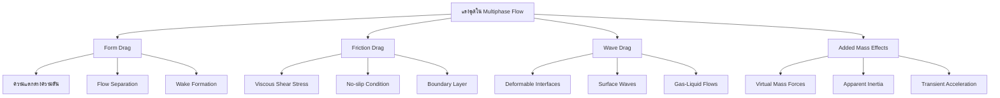
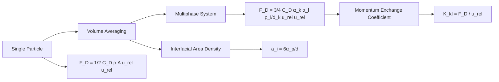
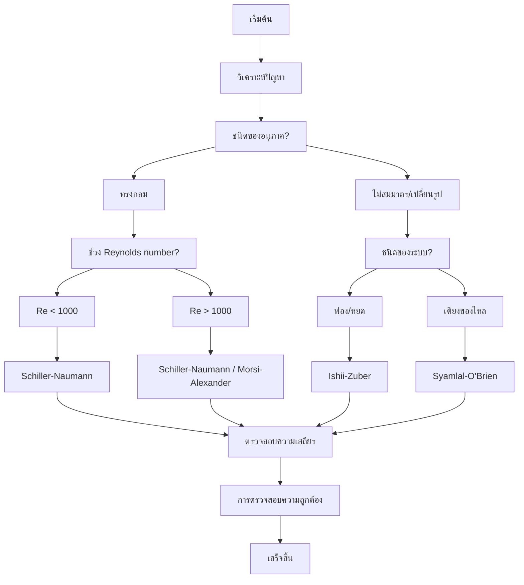

# แนวคิดพื้นฐานของแรงฉุด (Fundamental Drag Concept)

## 1. บทนำ (Introduction)

**แรงฉุด (Drag forces)** เป็นกลไกหลักในการแลกเปลี่ยนโมเมนตัมระหว่างเฟสใน Eulerian-Eulerian multiphase flow แรงนี้เกิดขึ้นจากการเคลื่อนที่สัมพัทธ์ระหว่างเฟสต่อเนื่อง (Continuous phase) และเฟสกระจาย (Dispersed phase)

ในระบบกระแสของไหลแบบหลายเฟส แรงฉุดแสดงถึง **การถ่ายโอนโมเมนตัมระหว่างพื้นผิวสัมผัส (interfacial momentum transfer)** ซึ่งเกิดจาก:

- **ความเค้นเฉือนจากความหนืด (Viscous shear stresses)** ที่พื้นผิวสัมผัสระหว่างเฟส
- **ความแตกต่างของความดัน (Pressure differences)** รอบอนุภาคที่กระจายอยู่
- **การก่อตัวของ Wake** ด้านหลังองค์ประกอบที่กระจายอยู่

> [!INFO] ความสำคัญของแรงฉุด
> แรงฉุดเป็นปัจจัยที่สำคัญที่สุดในการควบคุมการกระจายตัวของเฟส ความเร็วสัมพัทธ์ และประสิทธิภาพของการผสมในระบบหลายเฟส

---

## 2. นิยามของแรงฉุด (Definition of Drag)

**แรงฉุด (Drag)** หมายถึงแรงต้านที่วัตถุประสบเมื่อเคลื่อนที่ผ่านของไหล หรือแรงต้านระหว่างของไหลสองชนิดที่แทรกซึมซึ่งกันและกัน ในกรณีของ multiphase flow แรงฉุดต่อหน่วยปริมาตร $\mathbf{F}_{D,kl}$ บนเฟส $k$ เนื่องมาจากเฟส $l$ คือ:

$$\mathbf{F}_{D,kl} = \mathbf{K}_{kl}(\mathbf{u}_l - \mathbf{u}_k) \tag{1.1}$$

โดยที่:
- $\mathbf{K}_{kl}$ คือ **สัมประสิทธิ์การแลกเปลี่ยนโมเมนตัมระหว่างพื้นผิว** (interfacial momentum exchange coefficient)
- $\mathbf{u}_l - \mathbf{u}_k$ คือ ความเร็วสัมพัทธ์ระหว่างเฟส (relative velocity)

### ความหมายของสัมประสิทธิ์ K

สัมประสิทธิ์ $\mathbf{K}_{kl}$ แสดงถึงประสิทธิภาพของการถ่ายโอนโมเมนตัม ซึ่งขึ้นอยู่กับ:

| ปัจจัย | คำอธิบาย |
|---------|-----------|
| **พื้นที่ผิวระหว่างเฟส (Interfacial area)** | พื้นที่ติดต่อรวมระหว่างเฟส |
| **สัดส่วนปริมาตร (Phase volume fractions)** | ปริมาตรสัดส่วนของแต่ละเฟส |
| **สภาวะการไหลเฉพาะที่ (Local flow conditions)** | คุณสมบัติของการไหลในแต่ละตำแหน่ง |

---

## 3. กลไกทางกายภาพของแรงฉุด (Physical Mechanisms)

แรงฉุดในการไหลหลายเฟสเกิดจากกลไกทางฟิสิกส์ 4 ประการหลัก:

### 3.1 Form Drag (แรงฉุดจากรูปร่าง)

**Form drag** หรือ **Pressure drag** คือความแตกต่างของความดันรอบๆ สิ่งแปลกปลอม (inclusions) ซึ่งเกิดจาก:

- **การแยกตัวของกระแส (Flow separation)**: การไหลไม่สามารถตามรูปทรงของวัตถุได้อย่างสมบูรณ์
- **การก่อตัวของ wake**: เขตหมุนวนด้านหลังอนุภาคหรือฟองอากาศ

ปรากฏการณ์นี้เกิดขึ้นเมื่อมีความไม่สมดุลของความดันระหว่างบริเวณต้นน้ำ (upstream) และบริเวณท้ายน้ำ (downstream)

### 3.2 Friction Drag (แรงฉุดจากความเสียดทาน)

**Friction drag** หรือ **Viscous drag** คือความเค้นเนื่องจากความหนืด (viscous stresses) บนพื้นผิวระหว่างเฟส (interfaces) ซึ่งเกิดจาก:

- **เงื่อนไข no-slip**: ความเร็วของของไหลเป็นศูนย์ที่พื้นผิว
- **ความเค้นเฉือน**: Shear stress ที่เกิดจากการไหล

กลไกนี้มีอิทธิพลมากที่สุดเมื่อ:
- การไหลยังคงเกาะติดกับพื้นผิวระหว่างเฟส
- สภาวะการไหลแบบลามินาร์หรือคลืบคลาน (creeping flow)

### 3.3 Wave Drag (แรงฉุดจากคลื่น)

**Wave drag** เกิดขึ้นสำหรับพื้นผิวระหว่างเฟสที่สามารถเปลี่ยนรูปได้ (deformable interfaces) ซึ่ง:

- **คลื่นพื้นผิว (Surface waves)** แพร่กระจายไปตามขอบเขตของเฟส
- มีความสำคัญในกระแสของไหลแก๊ส-ของเหลว (gas-liquid flows)
- เกิดขึ้นเมื่อความเร็วสัมพัทธ์สูง ทำให้พื้นผิวระหว่างเฟสเกิดการเสียรูป

### 3.4 Added Mass Effects (แรงมวลเสมือน)

**Added mass effects** คือการเร่งความเร็วของของไหลโดยรอบที่ต้องถูกเร่งความเร็วไปพร้อมกับวัตถุ ใน multiphase flow:

- ปรากฏเป็น **แรงมวลเสมือน (virtual mass forces)**
- ส่งผลต่อ **ความเฉื่อยปรากฏ (apparent inertia)** ของเฟสที่กระจายตัว
- มีความสำคัญเป็นพิเศษในช่วงเวลาของการเร่งความเร็วแบบชั่วคราว (transient acceleration periods)



### ปัจจัยที่ส่งผลต่อความสำคัญของกลไก

ความสำคัญสัมพัทธ์ของกลไกเหล่านี้ขึ้นอยู่กับ **พารามิเตอร์ของระบอบการไหล (flow regime parameters)**:

| พารามิเตอร์ | คำอธิบาย | ผลต่อกลไกแรงฉุด |
|---------|---------|-----------------|
| **Reynolds number** | อัตราส่วนระหว่างแรงเฉื่อยและแรงหนืด | กำหนดความสำคัญของ form drag และ friction drag |
| **Weber number** | อัตราส่วนระหว่างแรงเฉื่อยและแรงตึงผิว | ส่งผลต่อ wave drag และการเสียรูปของพื้นผิว |
| **Eötvös number** | อัตราส่วนระหว่างแรงโน้มถ่วงและแรงตึงผิว | ส่งผลต่อรูปร่างของฟองอากาศและระบอบการไหล |

---

## 4. การลากอนุภาคเดี่ยว (Single Particle Drag)

พิจารณาทรงกลมเดี่ยวเส้นผ่านศูนย์กลาง $d$ เคลื่อนที่ในของไหล หมายเลขเรย์โนลด์ของอนุภาค ($Re_p$) เป็นตัวระบุระบอบการไหล (Flow Regime):

$$Re_p = \frac{\rho_f |\mathbf{u}_p - \mathbf{u}_f| d}{\mu_f} \tag{1.2}$$

โดยที่:
- $\rho_f$ = ความหนาแน่นของของไหล (kg/m³)
- $\mathbf{u}_p$ = ความเร็วของอนุภาค (m/s)
- $\mathbf{u}_f$ = ความเร็วของของไหล (m/s)
- $d$ = เส้นผ่านศูนย์กลางอนุภาค (m)
- $\mu_f$ = ความหนืดพลวัตของของไหล (Pa·s)

### 4.1 ระบอบการไหล (Flow Regimes)

#### 4.1.1 Stokes Flow ($Re_p \ll 1$)

ในสภาวะ Stokes Flow แรงหนืดมีอิทธิพลเหนือแรงเฉื่อย การไหลรอบทรงกลมยังคงเป็นแบบลามินาร์และติดกับพื้นผิว:

$$\mathbf{F}_D = 3\pi \mu_f d (\mathbf{u}_f - \mathbf{u}_p) \tag{1.3}$$

**ข้อสมมติฐานหลัก:**
- ความเฉื่อยที่ละเลยได้: $Re_p \to 0$
- สภาวะการไหลคงที่
- ของไหลนิวตันแบบอัดตัวไม่ได้
- เงื่อนไขขอบเขตแบบไม่ลื่น (no-slip) ที่พื้นผิว
- การไหลสม่ำเสมอห่างจากทรงกลม

ในรูปของสัมประสิทธิ์แรงฉุด $C_D$:

$$\mathbf{F}_D = \frac{1}{2} C_D \rho_f A |\mathbf{u}_f - \mathbf{u}_p| (\mathbf{u}_f - \mathbf{u}_p) \tag{1.4}$$

โดยที่:
- $A = \pi d^2/4$ คือพื้นที่ฉาย (projected area)
- $C_D = \frac{24}{Re_p}$ สำหรับ Stokes flow

> [!TIP] สถานการณ์ที่พบ Stokes Flow
> - อนุภาคขนาดเล็กในของไหลหนืด (อนุภาคในน้ำมัน)
> - การใช้งานที่ความเร็วต่ำ
> - ของไหลที่มีความหนืดสูง (น้ำผึ้ง, กลีเซอรีน)

#### 4.1.2 Transitional Flow ($1 < Re_p < 1000$)

เมื่อหมายเลขเรย์โนลด์เพิ่มขึ้น ผลกระทบจากความเฉื่อยจะมีความสำคัญ:

**ลักษณะสำคัญ:**
- **การเริ่มแยกตัวของกระแส**: เริ่มต้นที่ $Re_p \approx 20$
- **การก่อตัวของ Wake**: เกิดเขตหมุนวน (recirculation zone) ด้านหลังทรงกลม
- **แรงลากที่เพิ่มขึ้น**: สัมปราสิทธิ์แรงฉุดเบี่ยงเบนไปจากความสัมพันธ์เชิงเส้นของ Stokes
- **การสลัดวน (Vortex shedding)**: ที่ $Re_p > 300$ wake จะไม่คงที่

#### 4.1.3 Turbulent Flow ($Re_p \gg 1000$)

ในสภาวะหมายเลขเรย์โนลด์สูง แรงเฉื่อยจะมีอิทธิพลเหนือกว่าอย่างสมบูรณ์:

**ผลที่ตามมา:**
- **ชั้นขอบแบบปั่นป่วน**: การถ่ายเทโมเมนตัมที่เพิ่มขึ้นช่วยชะลอการแยกตัวของกระแส
- **Wake ที่เล็กลง**: เมื่อเทียบกับการไหลแบบลามินาร์
- **แรงลากเนื่องจากความดันมีอิทธิพลเหนือกว่า**: Form drag มีค่ามากกว่า friction drag อย่างมาก
- **สัมประสิทธิ์แรงฉุดคงที่**: $C_D \approx 0.44$ สำหรับทรงกลม

### 4.2 สัมประสิทธิ์แรงฉุดทั่วไป

เนื่องจากผลเฉลยเชิงวิเคราะห์มีอยู่เฉพาะสำหรับ $Re_p \ll 1$ จึงใช้ความสัมพันธ์เชิงประจักษ์สำหรับการใช้งานทางวิศวกรรม:

$$C_D = \begin{cases}
\frac{24}{Re_p} & Re_p < 0.1 \quad \text{(Stokes regime)} \\
\frac{24}{Re_p}(1 + 0.15 Re_p^{0.687}) & 0.1 < Re_p < 1000 \quad \text{(Schiller-Naumann)} \\
0.44 & Re_p > 1000 \quad \text{(Newton regime)}
\end{cases} \tag{1.5}$$

#### ความสัมพันธ์ Schiller-Naumann

ความสัมพันธ์สำหรับสภาวะกลาง (Schiller-Naumann, 1933) ให้การเปลี่ยนผ่านที่ราบรื่น:

$$C_D = \frac{24}{Re_p}(1 + 0.15 Re_p^{0.687}) \tag{1.6}$$

**ลักษณะสำคัญ:**
- **ความต่อเนื่อง**: ตรงกับแรงฉุดของ Stokes เมื่อ $Re_p \to 0$
- **ความแม่นยำ**: อยู่ภายใน 5% ของข้อมูลการทดลองสำหรับ $0.1 < Re_p < 800$
- **ความเรียบง่าย**: ง่ายต่อการนำไปใช้และมีประสิทธิภาพในการคำนวณ
- **การยอมรับอย่างกว้างขวาง**: เป็นมาตรฐานในแพ็กเกจ CFD ส่วนใหญ่ รวมถึง OpenFOAM

---

## 5. การขยายผลสู่ระบบหลายเฟส (Multiphase Extension)

ในแบบจำลอง Eulerian-Eulerian แรงฉุดจะถูกเฉลี่ยตามปริมาตรโดยใช้ **ความหนาแน่นพื้นที่รอยต่อ (Interfacial Area Density, $a_i$)**

### 5.1 ความหนาแน่นของพื้นที่ผิวระหว่างเฟส

สำหรับระบบ multiphase เราต้องการ **ความหนาแน่นของพื้นที่ผิวระหว่างเฟส** $a_i$ (พื้นที่ผิวต่อหน่วยปริมาตร):

$$a_i = \frac{\text{Total interfacial area in REV}}{\text{REV volume}} \tag{1.7}$$

สำหรับอนุภาคทรงกลมที่มีเส้นผ่านศูนย์กลาง $d$ และสัดส่วนปริมาตร $\alpha_p$:

$$a_i = \frac{6\alpha_p}{d} \tag{1.8}$$

### 5.2 แรงฉุดต่อหน่วยปริมาตร

**แรงฉุดต่อหน่วยปริมาตรสุดท้าย:**

$$\mathbf{F}_{D,kl} = \frac{3}{4} C_D \frac{\alpha_k \alpha_l \rho_l}{d_k} |\mathbf{u}_l - \mathbf{u}_k| (\mathbf{u}_l - \mathbf{u}_k) \tag{1.9}$$

โดยที่:
- $\alpha_k$, $\alpha_l$ คือ **phase fractions** (สัดส่วนปริมาตรของแต่ละเฟส)
- $\rho_l$ คือ **ความหนาแน่นของ continuous phase** (เฟสต่อเนื่อง)
- $d_k$ คือ **characteristic diameter** ของ dispersed phase $k$ (เส้นผ่านศูนย์กลางลักษณะเฉพาะ)
- $C_D$ คือ **drag coefficient** (สัมประสิทธิ์แรงฉุด)
- $|\mathbf{u}_l - \mathbf{u}_k|$ คือ **relative velocity magnitude** (ขนาดของความเร็วสัมพัทธ์)

### 5.3 สัมประสิทธิ์การแลกเปลี่ยนโมเมนตัม

โดยที่สัมประสิทธิ์การแลกเปลี่ยนโมเมนตัมคือ:

$$\mathbf{K}_{kl} = \frac{3}{4} C_D \frac{\alpha_k \alpha_l \rho_l}{d_k} |\mathbf{u}_l - \mathbf{u}_k| \tag{1.10}$$

เมื่อเปรียบเทียบกับ $\mathbf{F}_{D,kl} = \mathbf{K}_{kl}(\mathbf{u}_l - \mathbf{u}_k)$:

สมการข้างต้นแสดงถึง **momentum exchange coefficient** ซึ่งเป็นพารามิเตอร์สำคัญในการคำนวณการถ่ายเทโมเมนตัมระหว่างเฟส



---

## 6. การนำไปใช้ใน OpenFOAM (OpenFOAM Implementation)

### 6.1 ลำดับชั้นของคลาส Drag Model

OpenFOAM ใช้สถาปัตยกรรม drag model ที่ซับซ้อน ซึ่งเป็นรากฐานสำหรับการคำนวณการแลกเปลี่ยนโมเมนตัมของ Multiphase Flow

**หลักการสำคัญ:**
- คลาสพื้นฐาน `dragModel` กำหนดอินเทอร์เฟซพื้นฐาน
- การออกแบบแบบ Polymorphic ช่วยให้สามารถสลับระหว่าง Drag Correlation ที่แตกต่างกันได้อย่างราบรื่น
- รักษา Workflow การคำนวณที่สอดคล้องกัน

#### โครงสร้างคลาสพื้นฐาน

```cpp
// Base drag model class
class dragModel
{
public:
    // Calculate drag coefficient
    virtual tmp<volScalarField> Cd() const = 0;

    // Calculate momentum exchange coefficient
    virtual tmp<volScalarField> K() const;

    // Calculate drag force
    virtual tmp<volVectorField> F() const;
};
```

**คุณสมบัติที่สำคัญ:**
- ใช้ระบบ Smart Pointer `tmp` ของ OpenFOAM สำหรับการจัดการหน่วยความจำที่มีประสิทธิภาพ
- ฟังก์ชัน Pure virtual `Cd()` รับประกันว่าคลาสที่สืบทอดมาต้องนำการคำนวณ drag coefficient ที่เฉพาะเจาะจงมาใช้
- การนำไปใช้เริ่มต้นของ `K()` และ `F()` ให้สูตรมาตรฐานที่สามารถเขียนทับได้

### 6.2 การคำนวณ Momentum Exchange

**Momentum exchange coefficient `K`** แสดงถึงพารามิเตอร์การเชื่อมโยงพื้นฐานระหว่างเฟสในระบบ Multiphase Flow

#### การนำไปใช้ใน OpenFOAM

```cpp
tmp<volScalarField> dragModel::K() const
{
    const volScalarField& alpha1 = pair_.phase1().alpha();
    const volScalarField& alpha2 = pair_.phase2().alpha();
    const volScalarField& rho2 = pair_.phase2().rho();
    const volScalarField& d = pair_.dispersed().d();
    const volScalarField& Ur = pair_.Ur();

    return (3.0/4.0)*Cd()*alpha1*alpha2*rho2/(d)*Ur;
}
```

#### สมการคณิตศาสตร์

การนำไปใช้นี้เป็นไปตามสูตร drag model มาตรฐาน:

$$K = \frac{3}{4} \cdot C_d \cdot \alpha_1 \cdot \alpha_2 \cdot \frac{\rho_2}{d_1} \cdot |\mathbf{u}_r| \tag{1.11}$$

**นิยามตัวแปร:**
- `$K$` = Momentum exchange coefficient (kg/(m³·s))
- `$C_d$` = Drag coefficient (ไม่มีหน่วย)
- `$\alpha_1$`, `$\alpha_2$` = Volume fractions ของเฟสที่ 1 และ 2
- `$\rho_2$` = Density ของเฟสที่ 2 (dispersed phase) (kg/m³)
- `$d_1$` = Diameter ของอนุภาคในเฟสที่ 1 (m)
- `$|\mathbf{u}_r|$` = Relative velocity magnitude (m/s)

### 6.3 การจัดการ Relative Velocity

**Relative velocity** แสดงถึงแรงขับเคลื่อนทางจลนศาสตร์เบื้องหลังการถ่ายโอนโมเมนตัมระหว่างเฟส

#### การคำนวณในคลาส PhasePair

```cpp
tmp<volScalarField> PhasePair::Ur() const
{
    return mag(phase2().U() - phase1().U());
}

tmp<volScalarField> PhasePair::Re() const
{
    return phase1().rho()*Ur()*dispersed().d()/phase1().mu();
}
```

#### สมการทางคณิตศาสตร์

**Relative Velocity:**
$$|\mathbf{u}_r| = |\mathbf{u}_2 - \mathbf{u}_1| \tag{1.12}$$

**Reynolds Number:**
$$Re = \frac{\rho_1 \cdot |\mathbf{u}_r| \cdot d_1}{\mu_1} \tag{1.13}$$

**นิยามตัวแปร:**
- `$|\mathbf{u}_r|$` = Relative velocity magnitude (m/s)
- `$\mathbf{u}_1$`, `$\mathbf{u}_2$` = Velocity vectors ของเฟสที่ 1 และ 2 (m/s)
- `$Re$` = Reynolds number (ไม่มีหน่วย)
- `$\rho_1$` = Density ของเฟสที่ 1 (continuous phase) (kg/m³)
- `$d_1$` = Characteristic diameter (m)
- `$\mu_1$` = Dynamic viscosity ของเฟสที่ 1 (Pa·s)

> [!TIP] ประโยชน์ของระบบ
> - **ตรวจจับระบอบการไหลโดยอัตโนมัติ** - ช่วยให้ Drag Correlation ที่เหมาะสมถูกนำไปใช้ตามเงื่อนไขการไหลในแต่ละตำแหน่ง
> - **ความสอดคล้องกับสูตร drag model** - การใช้คุณสมบัติของ continuous phase ในการคำนวณ Reynolds number
> - **การแสดงคุณสมบัติทางฟิสิกส์ที่แม่นยำ** - รับประกันการจำลอง interfacial physics ที่ถูกต้อง

### 6.4 ตัวอย่างการนำไปใช้ Schiller-Naumann

```cpp
// Schiller-Naumann drag model
template<class PhasePair>
class SchillerNaumann
:
    public dragModel
{
    virtual tmp<volScalarField> Cd() const
    {
        const volScalarField& Re = pair_.Re();

        return volScalarField::New
        (
            "Cd",
            max
            (
                24.0/Re*(1.0 + 0.15*pow(Re, 0.687)),
                0.44
            )
        );
    }
};
```

**รายละเอียดการ Implement:**
- `tmp<volScalarField>` = กลยุทธ์การจัดการหน่วยความจำสำหรับ temporary fields
- `pair_.Re()` = เข้าถึง Reynolds number field จาก phase pair
- `volScalarField::New` = สร้าง field ใหม่พร้อมการจัดการหน่วยความจำอัตโนมัติ
- `max` function = ให้มั่นใจว่ามีการเปลี่ยนผ่านที่ราบรื่นระหว่างสอง regime
- `pow(Re, 0.687)` = คำนวณ exponent ของ Reynolds number อย่างมีประสิทธิภาพ

---

## 7. แบบจำลองแรงฉุดที่สำคัญ (Important Drag Models)

### 7.1 แบบจำลอง Schiller-Naumann

**แบบจำลองแรงฉุดที่ใช้กันอย่างแพร่หลายที่สุดใน OpenFOAM**:

$$C_D = \begin{cases}
\frac{24}{Re_p}(1 + 0.15 Re_p^{0.687}) & Re_p < 1000 \\
0.44 & Re_p \geq 1000
\end{cases} \tag{1.14}$$

**ข้อดี:**
- ใช้งานง่ายและเสถียรทางเชิงตัวเลข
- เหมาะสำหรับอนุภาคทรงกลม
- ครอบคลุมช่วงจำนวนเรย์โนลด์ที่กว้าง

### 7.2 แบบจำลอง Ishii-Zuber

**สำหรับกระแสแบบมีฟอง (bubbly flows) และแบบบิดเบี้ยว (distorted flows)**:

$$C_D = \begin{cases}
\frac{24}{Re_p}(1 + 0.1 Re_p^{0.75}) & Re_p < 1000 \\
\frac{8}{3}\frac{Eo}{Eo + 4} & \text{Distorted regime}
\end{cases} \tag{1.15}$$

โดยที่ **Eötvös number** $Eo = \frac{g(\rho_c - \rho_d)d^2}{\sigma}$

**ความหมายของตัวแปร:**
- $g$ = gravitational acceleration (m/s²)
- $\rho_c$ = density ของ continuous phase (kg/m³)
- $\rho_d$ = density ของ dispersed phase (kg/m³)
- $d$ = characteristic particle/bubble diameter (m)
- $\sigma$ = surface tension (N/m)

### 7.3 แบบจำลอง Morsi-Alexander

**การประมาณค่าแบบแบ่งช่วง (Piecewise correlation)** ที่มีหลายช่วง:

$$C_D = \sum_{i=1}^{5} a_i Re_p^{b_i} \tag{1.16}$$

โดยที่สัมประสิทธิ์ $a_i$ และ $b_i$ ขึ้นอยู่กับช่วงของ Reynolds number

**ข้อดีและข้อเสีย:**

| ข้อดี | ข้อเสีย |
|--------|---------|
| ความแม่นยำสูงในทุกช่วง Reynolds number | ความไม่ต่อเนื่องที่ขอบเขตของแต่ละช่วง |
| สามารถแสดงลักษณะของ drag ใน flow regimes ที่แตกต่างกันได้อย่างละเอียด | ต้องการ smoothing ที่เหมาะสมในการ implement |
| เหมาะสำหรับ creeping flow ไปจนถึง highly turbulent flows | ซับซ้อนกว่าโมเดลอื่น |

### 7.4 แบบจำลอง Syamlal-O'Brien

**พัฒนาขึ้นสำหรับเตียงของไหล (fluidized beds)**:

$$C_D = \frac{v_r^2}{v_s^2} \tag{1.17}$$

โดยที่:
- $v_r$ คือความเร็วสัมพัทธ์ (relative velocity)
- $v_s$ คือความเร็วตกตะกอนสุดท้าย (terminal settling velocity)

**ประโยชน์เด่น:**
- สูตรโดยธรรมชาติจับผลกระทบของ particle concentration ต่อ drag
- เหมาะอย่างยิ่งสำหรับ dense particulate flows
- เปลี่ยนผ่านระหว่าง dilute และ dense phase regimes ได้อย่างเป็นธรรมชาติ

### 7.5 การเปรียบเทียบแบบจำลองแรงฉุด

| แบบจำลอง | ชนิดของการไหลที่เหมาะสม | ข้อดี | ข้อจำกัด |
|-----------|-------------------|--------|-----------|
| **Schiller-Naumann** | อนุภาคทรงกลมทั่วไป | ใช้ง่าย, เสถียร | ไม่เหมาะกับอนุภาคที่เปลี่ยนรูป |
| **Ishii-Zuber** | การไหลมีฟอง, ฟองบิดเบี้ยว | รองรับพื้นผิวที่เปลี่ยนรูป | ซับซ้อนกว่า |
| **Morsi-Alexander** | ช่วง Reynolds number กว้าง | ความแม่นยำสูง | ซับซ้อน, ต้องการพารามิเตอร์มาก |
| **Syamlal-O'Brien** | เตียงของไหล, อนุภาคหนาแน่น | เหมาะกับสารแขวนลอยหนาแน่น | จำกัดสำหรับการไหลแบบอื่น |

---

## 8. ข้อควรพิจารณาเชิงปฏิบัติ (Practical Considerations)

### 8.1 ข้อจำกัดของแบบจำลอง

1. **ผลกระทบจากรูปร่าง (Shape Effects)**: อนุภาคที่ไม่ใช่ทรงกลมจะประสบกับสัมประสิทธิ์แรงฉุดที่แตกต่างกัน
2. **ผลกระทบจากผนัง (Wall Effects)**: การอยู่ใกล้ผนังจะปรับเปลี่ยนแรงฉุด
3. **ความเข้มข้นของอนุภาค (Particle Concentration)**: ความเข้มข้นของอนุภาคสูงนำไปสู่การตกตะกอนที่ถูกขัดขวาง (hindered settling)
4. **ความผันผวนแบบปั่นป่วน (Turbulent Fluctuations)**: ความเข้มของการปั่นป่วนสามารถส่งผลต่อแรงฉุดที่มีประสิทธิภาพ

### 8.2 ความเสถียรเชิงตัวเลข (Numerical Stability)

> [!WARNING] ปัญหาความเสถียร
> - เทอมแรงฉุดสามารถสร้างสมการที่แข็ง (stiff equations)
> - ต้องการการจัดการแบบอิมพลิซิต (implicit treatment)
> - การใช้ค่าเวลา (time step) ที่เล็กเกินไปอาจทำให้เกิดปัญหาการบิดเบือน (numerical diffusion)

### 8.3 ขีดจำกัดของสัดส่วนเฟส (Phase Fraction Limits)

- **ปัญหา**: สัดส่วนเฟสที่ใกล้ศูนย์สามารถก่อให้เกิดปัญหาเชิงตัวเลขได้
- **วิธีแก้**: การใช้ค่าความหนาแน่นขั้นต่ำ (minimum clipping) และการทำให้เรียบ (smoothing)
- **ค่าแนะนำ**: $\alpha_{min} = 1 \times 10^{-6}$

### 8.4 ความละเอียดของ Mesh (Mesh Resolution)

ต้องการความละเอียดที่เพียงพอเพื่อจับปรากฏการณ์ที่พื้นผิวสัมผัส:

- **กฎทั่วไป**: อย่างน้อย 10-20 cells ต่อเส้นผ่านศูนย์กลางอนุภาค
- **พิจารณา**: การใช้ adaptive mesh refinement (AMR) สำหรับบริเวณที่มี gradient สูง

---

## 9. การตรวจสอบและการประยุกต์ใช้ (Validation and Applications)

### 9.1 กรณีทดสอบมาตรฐาน (Benchmark Cases)

1. **การตกตะกอนของอนุภาคเดี่ยว**: เปรียบเทียบกับผลเฉลยเชิงวิเคราะห์ (analytical solutions)
2. **การทดลองเตียงของไหล**: ความเร็วขั้นต่ำของการไหล (minimum fluidization velocity)
3. **การวัดผลในคอลัมน์ฟอง**: ความสัมพันธ์ของความเร็วในการลอยขึ้น (rise velocity correlations)
4. **การไหลในท่อ**: การทำนายความดันตก (pressure drop predictions)

### 9.2 แนวทางการเลือกแบบจำลอง (Model Selection Guidelines)

#### เลือก Schiller-Naumann เมื่อ:
- อนุภาคเป็นทรงกลม
- Reynolds number ปานกลาง
- การไหลแบบ multiphase ทั่วไป

#### เลือก Ishii-Zuber เมื่อ:
- การไหลแบบมีฟองหรือแบบลูกทุ่ง (bubbly or slug flow)
- พื้นผิวที่เปลี่ยนรูป
- Eötvös number สูง

#### เลือก Syamlal-O'Brien เมื่อ:
- เตียงของไหล (fluidized beds)
- สารแขวนลอยอนุภาคหนาแน่น
- การไหลแบบเม็ด (granular flow) มีนัยสำคัญ

### 9.3 ขั้นตอนการเลือกแบบจำลองแรงฉุด



---

## 10. สรุป (Summary)

**แรงฉุดใน multiphase flow** ประกอบด้วย:

### 10.1 หลักการพื้นฐาน

1. **หลักการพื้นฐานทางฟิสิกส์** อิงตามแรงฉุดของอนุภาคเดี่ยว
2. **การเฉลี่ยตามปริมาตร** เพื่อขยายผลไปยังระบบ multiphase
3. **ความสัมพันธ์หลายรูปแบบ** สำหรับระบอบการไหลที่แตกต่างกัน

### 10.2 กลไกทางกายภาพ

| กลไก | คำอธิบาย | เงื่อนไขที่สำคัญ |
|------|-----------|------------------|
| **Form Drag** | ความแตกต่างความดัน | Flow separation, Wake formation |
| **Friction Drag** | Viscous shear stress | No-slip condition, Boundary layer |
| **Wave Drag** | Surface waves | Deformable interfaces, High velocity |
| **Added Mass** | Virtual mass forces | Transient acceleration |

### 10.3 การนำไปใช้ใน OpenFOAM

- **ระบบ drag model แบบ modular**: สามารถสลับระหว่าง correlation ต่างๆ ได้
- **การคำนวณ momentum exchange coefficient**: ตามสมการมาตรฐาน
- **การจัดการ relative velocity**: คำนวณอัตโนมัติจาก phase velocities

### 10.4 แบบจำลองที่ใช้งานได้

| แบบจำลอง | ช่วงที่เหมาะสม | การใช้งาน |
|-----------|----------------|------------|
| **Schiller-Naumann** | $Re_p < 1000$ | อนุภาคทรงกลมทั่วไป |
| **Ishii-Zuber** | Bubbly flows | ฟอง/หยดที่เปลี่ยนรูป |
| **Morsi-Alexander** | ทุกช่วง $Re_p$ | ความแม่นยำสูง |
| **Syamlal-O'Brien** | Dense flows | Fluidized beds |

### 10.5 ข้อควรพิจารณา

- **ความเสถียรเชิงตัวเลข**: ต้องการ implicit treatment
- **ขีดจำกัดของสัดส่วนเฟส**: ใช้ minimum clipping
- **ความละเอียดของ mesh**: 10-20 cells ต่อเส้นผ่านศูนย์กลาง
- **การตรวจสอบความถูกต้อง**: เปรียบเทียบกับข้อมูลทดลอง

> [!INFO] สิ่งสำคัญที่ต้องจำ
> การทำความเข้าใจแรงฉุดเป็นสิ่งสำคัญสำหรับการทำนายการไหลแบบ multiphase ที่แม่นยำ และเป็นรากฐานสำหรับปรากฏการณ์ระหว่างพื้นผิวที่ซับซ้อนยิ่งขึ้น

การเลือกแบบจำลองแรงฉุดที่เหมาะสมมีความสำคัญอย่างยิ่งต่อการทำนายพฤติกรรมของกระแสของไหลแบบหลายเฟสได้อย่างถูกต้อง

---

## 11. อ้างอิงเพิ่มเติม (Further Reading)

- **[[02_Single_Particle_Drag_-_Fundamental_Derivation]]**: รายละเอียดการอนุมานแรงฉุดของอนุภาคเดี่ยว
- **[[04_Multiphase_Extension_-_Volume_Averaged_Drag]]**: การขยายผลสู่ระบบหลายเฟส
- **[[05_Specific_Drag_Models]]**: แบบจำลองแรงฉุดเฉพาะที่ใช้ใน OpenFOAM
- **[[09_OpenFOAM_Implementation_Details]]**: รายละเอียดการนำไปใช้ใน OpenFOAM
