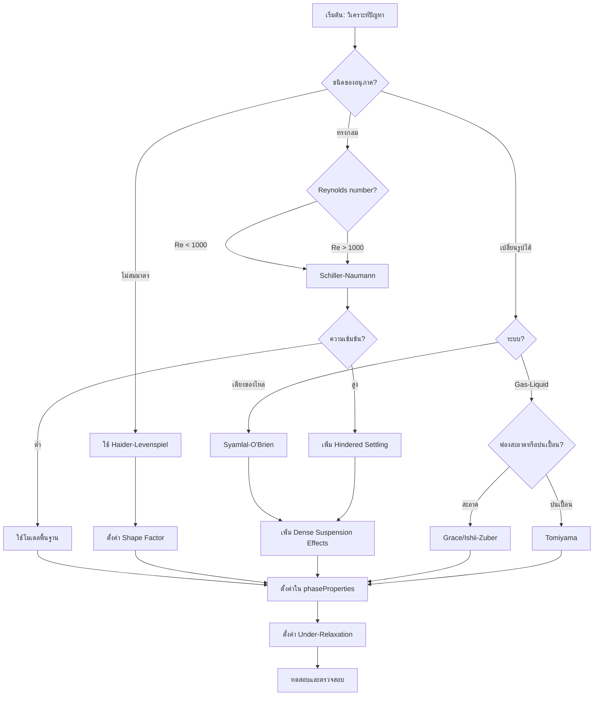

# รายละเอียดการนำไปใช้ใน OpenFOAM (OpenFOAM Implementation)

## ภาพรวม (Overview)

OpenFOAM นำสถาปัตยกรรม drag model ที่ซับซ้อนมาใช้ ซึ่งเป็นรากฐานสำหรับการคำนวณการแลกเปลี่ยนโมเมนตัมของ Multiphase Flow ผ่านการออกแบบแบบ Object-Oriented ที่ช่วยให้ผู้ใช้สามารถสลับโมเดลได้ตามความเหมาะสม

---

## 1. ลำดับชั้นของคลาส Drag Model (Class Hierarchy)

OpenFOAM ออกแบบระบบจำลองแรงฉุดโดยใช้หลักการ Object-Oriented Programming ซึ่งช่วยให้ผู้ใช้สามารถสลับโมเดลได้ตามความเหมาะสมผ่านไฟล์การตั้งค่า

### หลักการสำคัญ
- คลาสพื้นฐาน `dragModel` กำหนดอินเทอร์เฟซพื้นฐาน
- การออกแบบแบบ Polymorphic ช่วยให้สามารถสลับระหว่าง Drag Correlation ที่แตกต่างกันได้อย่างราบรื่น
- รักษา Workflow การคำนวณที่สอดคล้องกัน

### โครงสร้างคลาสพื้นฐาน (Base Class Structure)

คลาสพื้นฐาน `dragModel` กำหนดฟังก์ชันเสมือน (Virtual functions) สำหรับโมเดลลูก:

```cpp
// Base class for all drag models in OpenFOAM
class dragModel
{
public:
    // Calculate drag coefficient - must be implemented by derived classes
    // Pure virtual function ensures each model provides its own correlation
    virtual tmp<volScalarField> Cd() const = 0;

    // Calculate momentum exchange coefficient between phases
    // Default implementation uses standard formula
    virtual tmp<volScalarField> K() const;

    // Calculate total drag force vector field
    // Combines coefficient with velocity difference
    virtual tmp<volVectorField> F() const;
};
```

**คุณสมบัติที่สำคัญ:**
- ใช้ระบบ Smart Pointer `tmp` ของ OpenFOAM สำหรับการจัดการหน่วยความจำที่มีประสิทธิภาพ
- ฟังก์ชัน Pure virtual `Cd()` รับประกันว่าคลาสที่สืบทอดมาต้องนำการคำนวณ drag coefficient ที่เฉพาะเจาะจงมาใช้
- การนำไปใช้เริ่มต้นของ `K()` และ `F()` ให้สูตรมาตรฐานที่สามารถเขียนทับได้

---

**📚 คำอธิบายเพิ่มเติม (Source Explanation)**

📂 **Source:** `.applications/solvers/multiphase/multiphaseEulerFoam/phaseSystems/PhaseSystems/MomentumTransferPhaseSystem/MomentumTransferPhaseSystem.C`

**คำอธิบาย:**
โครงสร้างคลาสนี้เป็นรากฐานของระบบจำลองแรงฉุดใน OpenFOAM ซึ่งออกแบบมาเพื่อรองรับการสลับโมเดลที่หลากหลายผ่านกลไก Polymorphism คลาสพื้นฐาน `dragModel` กำหนดอินเทอร์เฟซที่สอดคล้องกันสำหรับการคำนวณสัมประสิทธิ์แรงฉุด ขณะที่คลาสลูกแต่ละตัวนำสูตรเฉพาะเจาะจงมาใช้

**แนวคิดสำคัญ (Key Concepts):**
- **Pure Virtual Function:** ฟังก์ชัน `Cd()` เป็น pure virtual ซึ่งบังคับให้ทุกคลาสลูกต้องนำการนำไปใช้ที่เฉพาะเจาะจงมาใช้
- **Smart Pointer Management:** ใช้ `tmp<volScalarField>` เพื่อจัดการหน่วยความจำอัตโนมัติและป้องกันการรั่วซึม
- **Polymorphic Design:** อนุญาตให้สลับระหว่าง drag correlations ที่แตกต่างกันได้ที่ runtime

---

### ลำดับชั้นของคลาส (Class Hierarchy Diagram)

```mermaid
flowchart TD
    A[dragModel<br/>Base Class] --> B[SchillerNaumann<br/>Standard Spherical Particles]
    A --> C[IshiiZuber<br/>Deformable Bubbles/Droplets]
    A --> D[MorsiAlexander<br/>Wide Re Range]
    A --> E[SyamlalOBrien<br/>Fluidized Beds]
    A --> F[Tomiyama<br/>Contaminated Bubbles]

    B --> B1[Virtual Cd&#40;&#41;]
    C --> C1[Virtual Cd&#40;&#41;]
    D --> D1[Virtual Cd&#40;&#41;]
    E --> E1[Virtual Cd&#40;&#41;]
    F --> F1[Virtual Cd&#40;&#41;]
```



---

## 2. การคำนวณ Momentum Exchange Coefficient ($K$)

ค่า $K$ คือพารามิเตอร์ที่เชื่อมโยงความเร็วของทั้งสองเฟสเข้าด้วยกันในสมการโมเมนตัม

### สูตรที่ใช้ใน Source Code

**Momentum exchange coefficient `K`** แสดงถึงพารามิเตอร์การเชื่อมโยงพื้นฐานระหว่างเฟสในระบบ Multiphase Flow

$$K = \frac{3}{4} C_D \frac{\alpha_k \alpha_l \rho_l}{d_k} |\mathbf{u}_r| \tag{2.1}$$

**นิยามตัวแปร:**
- `$K$` = Momentum exchange coefficient
- `$C_d$` = Drag coefficient (จาก model ที่เฉพาะเจาะจง)
- `$\alpha_1$`, `$\alpha_2$` = Volume fractions ของเฟสที่ 1 และ 2
- `$\rho_2$` = Density ของเฟสที่ 2 (dispersed phase)
- `$d_1$` = Diameter ของอนุภาคในเฟสที่ 1
- `$|\mathbf{u}_r|$` = Relative velocity magnitude

### การนำไปใช้ใน OpenFOAM (Implementation)

```cpp
// Calculate momentum exchange coefficient K between phases
// This function implements the standard drag coefficient formula
tmp<volScalarField> dragModel::K() const
{
    // Access phase volume fractions
    const volScalarField& alpha1 = pair_.phase1().alpha();
    const volScalarField& alpha2 = pair_.phase2().alpha();
    
    // Access dispersed phase density
    const volScalarField& rho2 = pair_.phase2().rho();
    
    // Get characteristic particle diameter
    const volScalarField& d = pair_.dispersed().d();
    
    // Calculate relative velocity magnitude
    const volScalarField& Ur = pair_.Ur();

    // Standard drag coefficient formula: K = (3/4) * Cd * (α1*α2*ρ2/d) * Ur
    return (3.0/4.0)*Cd()*alpha1*alpha2*rho2/(d)*Ur;
}
```

**ปัจจัยที่รวมอยู่ในการคำนวณ:**
- **Volume fractions** (`alpha1`, `alpha2`) - การกระจายตัวของเฟส
- **Dispersed phase density** (`rho2`) - ผลกระทบจากความเฉื่อย
- **Particle diameter** (`d`) - ขนาดความยาวลักษณะเฉพาะ
- **Relative velocity magnitude** (`Ur`) - ผลกระทบแบบไดนามิก
- **Drag coefficient** (`Cd()`) - จากการนำไปใช้ของ model ที่เฉพาะเจาะจง

---

**📚 คำอธิบายเพิ่มเติม (Source Explanation)**

📂 **Source:** `.applications/solvers/multiphase/multiphaseEulerFoam/phaseSystems/PhaseSystems/MomentumTransferPhaseSystem/MomentumTransferPhaseSystem.C`

**คำอธิบาย:**
ฟังก์ชันนี้เป็นหัวใจของการคำนวณแรงฉุดใน OpenFOAM โดยใช้สูตรมาตรฐานสำหรับสัมประสิทธิ์การแลกเปลี่ยนโมเมนตัม K การนำไปใช้นี้เข้าถึงคุณสมบัติของเฟสทั้งสองผ่านออบเจ็กต์ `pair_` ซึ่งห่อหุ้มข้อมูลเกี่ยวกับอินเทอร์เฟซระหว่างเฟส

**แนวคิดสำคัญ (Key Concepts):**
- **PhasePair Access:** ออบเจ็กต์ `pair_` ให้การเข้าถึงคุณสมบัติของทั้งสองเฟสและพารามิเตอร์อินเทอร์เฟซ
- **Geometric Factors:** เศษส่วน `3/4` มาจากการหาปริมาตรของทรงกลมและการแปลงพื้นที่หน้าตัด
- **Automatic Field Operations:** OpenFOAM จัดการการดำเนินการฟิลด์อัตโนมัติ (เช่น การคูณฟิลด์สเกลาร์)

---

## 3. การจัดการความเร็วสัมพัทธ์และเลขเรย์โนลด์

OpenFOAM คำนวณความเร็วสัมพัทธ์ ($U_r$) และเลขเรย์โนลด์ของอนุภาค ($Re_p$) โดยอัตโนมัติในคลาส `PhasePair`:

### การคำนวณในคลาส PhasePair

**Relative velocity** แสดงถึงแรงขับเคลื่อนทางจลนศาสตร์เบื้องหลังการถ่ายโอนโมเมนตัมระหว่างเฟส

```cpp
// Calculate relative velocity magnitude between two phases
// Returns the magnitude of velocity difference
tmp<volScalarField> PhasePair::Ur() const
{
    return mag(phase2().U() - phase1().U());
}

// Calculate particle Reynolds number based on continuous phase properties
// Re = (ρ₁ * |Ur| * d₁) / μ₁
tmp<volScalarField> PhasePair::Re() const
{
    return phase1().rho()*Ur()*dispersed().d()/phase1().mu();
}
```

### สมการทางคณิตศาสตร์

**Relative Velocity:**
$$|\mathbf{u}_r| = |\mathbf{u}_2 - \mathbf{u}_1|$$

**Reynolds Number:**
$$Re = \frac{\rho_1 \cdot |\mathbf{u}_r| \cdot d_1}{\mu_1}$$

**นิยามตัวแปร:**
- `$|\mathbf{u}_r|$` = Relative velocity magnitude
- `$\mathbf{u}_1$`, `$\mathbf{u}_2$` = Velocity vectors ของเฟสที่ 1 และ 2
- `$Re$` = Reynolds number (ไม่มีหน่วย)
- `$\rho_1$` = Density ของเฟสที่ 1 (continuous phase)
- `$d_1$` = Characteristic diameter
- `$\mu_1$` = Dynamic viscosity ของเฟสที่ 1

**ประโยชน์ของระบบ:**
- **ตรวจจับระบอบการไหลโดยอัตโนมัติ** - ช่วยให้ Drag Correlation ที่เหมาะสมถูกนำไปใช้ตามเงื่อนไขการไหลในแต่ละตำแหน่ง
- **ความสอดคล้องกับสูตร drag model** - การใช้คุณสมบัติของ continuous phase ในการคำนวณ Reynolds number
- **การแสดงคุณสมบัติทางฟิสิกส์ที่แม่นยำ** - รับประกันการจำลอง interfacial physics ที่ถูกต้อง

---

**📚 คำอธิบายเพิ่มเติม (Source Explanation)**

📂 **Source:** `.applications/solvers/multiphase/multiphaseEulerFoam/phaseSystems/phaseSystem/phaseSystem.H`

**คำอธิบาย:**
คลาส `PhasePair` ทำหน้าที่เป็นตัวกลางระหว่างเฟสสองเฟส โดยให้การเข้าถึงคุณสมบัติของแต่ละเฟสและคำนวณปริมาณที่ได้จากอินเทอร์เฟซโดยอัตโนมัติ การออกแบบนี้ทำให้ drag models สามารถเข้าถึงความเร็วสัมพัทธ์และ Reynolds number โดยไม่ต้องรู้รายละเอียดภายใน

**แนวคิดสำคัญ (Key Concepts):**
- **Automatic Property Access:** ฟังก์ชันสมาชิกให้การเข้าถึงคุณสมบัติเฟสโดยตรง (ความหนาแน่น ความหนืด ความเร็ว)
- **Phase Role Awareness:** ระบบรู้ว่าเฟสใดเป็น continuous และ dispersed ผ่าน `dispersed()` ฟังก์ชัน
- **Vector Field Operations:** การใช้ `mag()` เพื่อคำนวณขนาดของเวกเตอร์ความเร็วสัมพัทธ์

---

## 4. การนำไปใช้ Drag Model ที่เฉพาะเจาะจง (Specific Drag Model Implementations)

### 4.1 Schiller-Naumann Model

**Schiller-Naumann drag model** เป็น drag correlation ที่ถูกใช้งานอย่างแพร่หลายที่สุดใน OpenFOAM โดยเฉพาะอย่างยิ่งสำหรับอนุภาคทรงกลมในทั้ง laminar และ turbulent regimes

#### สมการ Drag Coefficient

Drag coefficient $C_D$ ขึ้นอยู่กับ particle Reynolds number $Re_p$:

$$C_D = \begin{cases}
\frac{24}{Re_p}(1 + 0.15 Re_p^{0.687}) & Re_p < 1000 \\
0.44 & Re_p \geq 1000
\end{cases}$$

#### OpenFOAM Code Implementation

```cpp
// Schiller-Naumann drag model implementation
// Suitable for spherical particles in both laminar and turbulent regimes
template<class PhasePair>
class SchillerNaumann
:
    public dragModel
{
    // Calculate drag coefficient based on particle Reynolds number
    virtual tmp<volScalarField> Cd() const
    {
        // Access Reynolds number field from phase pair
        const volScalarField& Re = pair_.Re();

        // Create drag coefficient field
        // Uses correlation: Cd = max(24/Re*(1 + 0.15*Re^0.687), 0.44)
        // Automatically transitions between laminar and turbulent regimes
        return volScalarField::New
        (
            "Cd",
            max
            (
                24.0/Re*(1.0 + 0.15*pow(Re, 0.687)),
                0.44
            )
        );
    }
};
```

**รายละเอียดการ Implement:**
- `tmp<volScalarField>` = กลยุทธ์การจัดการหน่วยความจำสำหรับ temporary fields
- `pair_.Re()` = เข้าถึง Reynolds number field จาก phase pair
- `volScalarField::New` = สร้าง field ใหม่พร้อมการจัดการหน่วยความจำอัตโนมัติ
- `max` function = ให้มั่นใจว่ามีการเปลี่ยนผ่านที่ราบรื่นระหว่างสอง regime
- `pow(Re, 0.687)` = คำนวณ exponent ของ Reynolds number อย่างมีประสิทธิภาพ

---

**📚 คำอธิบายเพิ่มเติม (Source Explanation)**

📂 **Source:** `.applications/solvers/multiphase/multiphaseEulerFoam/interfacialModels/dragModels/SchillerNaumann/SchillerNaumann.H`

**คำอธิบาย:**
การนำ Schiller-Naumann ไปใช้เป็นตัวอย่างคลาสสิกของการออกแบบ drag model ใน OpenFOAM คลาสสืบทอดมาจาก `dragModel` และนำฟังก์ชันเสมือน `Cd()` ไปใช้ด้วยสหสัมพันธ์เฉพาะสำหรับทรงกลม

**แนวคิดสำคัญ (Key Concepts):**
- **Regime Transition:** ฟังก์ชัน `max()` ให้การเปลี่ยนผ่านที่ราบรื่นระหว่าง laminar และ turbulent regimes
- **Field Creation:** `volScalarField::New` สร้างฟิลด์ใหม่พร้อมการจัดการหน่วยความจำอัตโนมัติ
- **Template Design:** ใช้ templates เพื่อให้ทำงานกับคลาส phase pair ที่แตกต่างกันได้

---

### 4.2 Ishii-Zuber Model

**Ishii-Zuber model** ถูกพัฒนาขึ้นมาโดยเฉพาะสำหรับ multiphase flows ที่เกี่ยวข้องกับ **distorted bubbles** และ **droplets** ทำให้เหมาะอย่างยิ่งสำหรับระบบ gas-liquid

#### สมการ Drag Coefficient

$$C_D = \begin{cases}
\frac{24}{Re_p}(1 + 0.1 Re_p^{0.75}) & Re_p < 1000 \\
\frac{8}{3}\frac{Eo}{Eo + 4} & \text{Distorted regime}
\end{cases}$$

โดยที่ **Eötvös number** $Eo = \frac{g(\rho_c - \rho_d)d^2}{\sigma}$

**ความหมายของตัวแปร:**
- $g$ = gravitational acceleration (m/s²)
- $\rho_c$ = density ของ continuous phase (kg/m³)
- $\rho_d$ = density ของ dispersed phase (kg/m³)
- $d$ = characteristic particle/bubble diameter (m)
- $\sigma$ = surface tension (N/m)

---

### 4.3 Syamlal-O'Brien Model

**Syamlal-O'Brien model** ถูกพัฒนาขึ้นมาโดยเฉพาะสำหรับ **fluidized bed applications** ซึ่งการมีปฏิสัมพันธ์ระหว่างอนุภาคและผลกระทบของ dense phase มีอิทธิพลอย่างมาก

#### สมการหลัก

$$C_D = \frac{v_r^2}{v_s^2}$$

**ความหมายของตัวแปร:**
- $C_D$ = drag coefficient (ไม่มีหน่วย)
- $v_r$ = relative velocity ระหว่าง phases (m/s)
- $v_s$ = terminal settling velocity ของอนุภาคเดี่ยว (m/s)

---

### 4.4 Tomiyama Model

**Tomiyama model** ถูกพัฒนาขึ้นมาโดยเฉพาะสำหรับ **contaminated bubbles** ในระบบ gas-liquid

#### สมการ Drag Coefficient

$$C_D = \max\left[0.44, \min\left(\frac{24}{Re_p}(1 + 0.15 Re_p^{0.687}), \frac{72}{Re_p}\right)\right]$$

---

## 5. ข้อควรพิจารณาด้านเสถียรภาพ (Numerical Stability)

เนื่องจากเทอมแรงฉุดมักจะมีค่าสูงและ "แข็ง" (Stiff) OpenFOAM จึงมีกลยุทธ์ดังนี้:

### 5.1 การจัดการแบบ Implicit vs Explicit

#### **Explicit Drag:**
$$\mathbf{M}_k^{n+1} = \mathbf{K}_{kl}^n (\mathbf{u}_l^n - \mathbf{u}_k^n)$$

- **ข้อดี**: การนำไปใช้ที่ง่าย, ไม่มีการเชื่อมโยงระหว่างเฟสในแต่ละ time step
- **ข้อเสีย**: ข้อจำกัดของ time step (CFL condition)

#### **Implicit Drag:**
$$\mathbf{M}_k^{n+1} = \mathbf{K}_{kl}^{n+1} (\mathbf{u}_l^{n+1} - \mathbf{u}_k^{n+1})$$

- **ข้อดี**: เสถียรภาพสูงกว่า, time step ที่ใหญ่ขึ้น
- **ข้อเสีย**: การแก้ปัญหาระบบที่เชื่อมโยงกัน (coupled system solution)

```cpp
// Implicit drag treatment in momentum equation
// Adds drag contribution to the matrix diagonal for stability
// M_k^{n+1} = K_{kl}^{n+1} * (u_l^{n+1} - u_k^{n+1})
tmp<fvVectorMatrix> dragModel::Fdm(const phaseModel& phase) const
{
    const volScalarField& K = this->K();
    const volScalarField& alpha = phase.alpha();
    
    // Implicit treatment: add to matrix diagonal
    // This improves stability but requires coupled solver
    return fvm::Sp(K*alpha, phase.U());
}
```

---

**📚 คำอธิบายเพิ่มเติม (Source Explanation)**

📂 **Source:** `.applications/solvers/multiphase/multiphaseEulerFoam/phaseSystems/PhaseSystems/MomentumTransferPhaseSystem/MomentumTransferPhaseSystem.C`

**คำอธิบาย:**
การจัดการแรงฉุดแบบอิมพลิซิตเป็นสิ่งสำคัญสำหรับเสถียรภาพเชิงตัวเลขในการจำลอง multiphase flow โดยการเพิ่มเทอมแรงฉุดลงในเมทริกซ์ แรงฉุดจะถูกจัดการพร้อมกับเทอมการแพร่กระจายและการลู่เข้าอื่นๆ

**แนวคิดสำคัญ (Key Concepts):**
- **Implicit Treatment:** การใช้ `fvm::Sp()` เพิ่มเทอมลงในเมทริกซ์แทนการใช้เป็น source term
- **Matrix Coupling:** การจัดการแบบอิมพลิซิตสร้างการเชื่อมโยงระหว่างสมการโมเมนตัมของเฟสต่างๆ
- **Stability vs Cost:** เสถียรภาพที่ดีขึ้นมาพร้อมกับค่าใช้จ่ายในการคำนวณที่เพิ่มขึ้น

---

### 5.2 การใช้ Under-Relaxation

เพื่อป้องกันการแกว่งกวัดของผลเฉลย (Oscillations):

$$\mathbf{K}_{new} = (1-\lambda)\mathbf{K}_{old} + \lambda \mathbf{K}_{calculated}$$

โดยทั่วไปใช้ค่า $\lambda \approx 0.3 - 0.7$ ในไฟล์ `fvSolution`

**แฟกเตอร์การผ่อนคลายทั่วไป (Typical relaxation factor)**: $\lambda = 0.3 - 0.7$

| ปัจจัย | ค่าแนะนำของ $\lambda$ | คำอธิบาย |
|---------|----------------------|-----------|
| **รูปแบบการไหล** | $0.5 - 0.7$ (สภาวะคงตัว) <br> $0.3 - 0.5$ (ไม่คงตัว) | ปัญหาสภาวะคงตัวใช้การผ่อนคลายที่น้อยกว่า |
| **ระดับการเชื่อมโยง** | $0.3 - 0.4$ (สูง) <br> $0.5 - 0.7$ (ต่ำ) | การไหลแบบหลายเฟสที่เชื่อมโยงกันอย่างมากต้องการการผ่อนคลายมากขึ้น |
| **คุณภาพ Mesh** | $0.4 - 0.6$ (คุณภาต่ำ) <br> $0.5 - 0.7$ (คุณภามสูง) | Mesh ที่ละเอียดกว่าอาจยอมให้ใช้แฟกเตอร์การผ่อนคลายที่ใหญ่ขึ้น |

```cpp
// Under-relaxation factors for stability in fvSolution
// These control how much new values are allowed to change
relaxationFactors
{
    equations
    {
        U           0.7;      // Velocity relaxation
        p           0.3;      // Pressure relaxation
        k           0.6;      // TKE relaxation
        epsilon     0.5;      // Dissipation rate relaxation
    }

    fields
    {
        "alpha.*"   0.4;      // Phase fraction relaxation
    }
}
```

---

## 6. ผลกระทบของสารแขวนลอยความเข้มข้นสูง (Dense Suspension Effects)

### การตกตะกอนแบบถูกขัดขวาง (Hindered Settling)

ใน Solver `multiphaseEulerFoam` ของ OpenFOAM ผลกระทบของสารแขวนลอยความเข้มข้นสูงจะถูกรวมเข้าไว้ด้วยกันผ่านการปรับปรุงค่าสัมประสิทธิ์การแลกเปลี่ยนโมเมนตัม $\mathbf{K}_{kl}$ ระหว่างเฟส $k$ และ $l$:

$$\mathbf{K}_{kl}^{modified} = \mathbf{K}_{kl} \cdot f(\alpha_l)$$

### สมการ Richardson-Zaki

**ตัวประกอบการตกตะกอนแบบถูกขัดขวาง** $f(\alpha_c)$ จะปรับปรุงความเร็วตกตะกอนสุดท้าย:

$$v_t = v_{t,0} (1 - \alpha_d)^n$$

**รูปแบบทั่วไปของ $f(\alpha_l)$**:

| ความสัมพันธ์ | สูตร | คำอธิบาย |
|--------------|--------|-----------|
| **Einstein relation** | $f(\alpha_l) = (1 - \alpha_d)^{2.5}$ | สำหรับความเข้มข้นต่ำ |
| **Barnea-Mizrahi** | $f(\alpha_l) = (1 - \alpha_d)^{2.0} \exp\left(\frac{2.5\alpha_d}{1 - \alpha_d}\right)$ | สำหรับความเข้มข้นสูง |

### OpenFOAM Code Implementation

```cpp
// Drag model class with hindered settling effects
// Modifies base drag coefficient to account for dense suspensions
virtual tmp<volScalarField> K(const phasePairKey& key) const
{
    // Access phase models
    const phaseModel& phase1 = this->phase1_;
    const phaseModel& phase2 = this->phase2_;

    // Base drag coefficient from standard correlation
    const volScalarField K0 = this->K0(key);

    // Hindered settling factor (Barnea-Mizrahi correlation)
    // Accounts for reduced settling in concentrated suspensions
    const volScalarField alphaD = phase2;
    const volScalarField fHindered =
        (scalar(1) - alphaD)*exp(2.5*alphaD/(scalar(1) - alphaD));

    // Modified drag coefficient with hindered settling
    return K0*fHindered;
}
```

---

**📚 คำอธิบายเพิ่มเติม (Source Explanation)**

📂 **Source:** `.applications/solvers/multiphase/multiphaseEulerFoam/interfacialModels/dragModels/dragModel/dragModel.C`

**คำอธิบาย:**
ผลกระทบของสารแขวนลอยความเข้มข้นสูงเป็นสิ่งสำคัญในการจำลองระบบที่มีปฏิสัมพันธ์ระหว่างอนุภาคอย่างมาก การนำ Barnea-Mizrahi correlation ไปใช้ปรับปรุงสัมประสิทธิ์การแลกเปลี่ยนโมเมนตัมเพื่อให้สอดคล้องกับการลดลงของความเร็วตกตะกอนในสารแขวนลอยที่เข้มข้น

**แนวคิดสำคัญ (Key Concepts):**
- **Hindered Settling:** อนุภาคในสารแขวนลอยที่เข้มข้นตกตะกอนช้าลงเนื่องจากการโต้ตอบระหว่างอนุภาค
- **Volume Fraction Dependence:** ตัวปรับขึ้นอยู่กับ volume fraction ของ dispersed phase
- **Empirical Correlation:** สหสัมพันธ์ Barnea-Mizrahi ให้ความแม่นยำดีกว่า Einstein relation สำหรับความเข้มข้นสูง

---

## 7. ผลกระทบจากความปั่นป่วน (Turbulent Effects)

### การกระจายตัวเนื่องจากความปั่นป่วน (Turbulent Dispersion)

แรงกระจายตัวเนื่องจากความปั่นป่วน $\mathbf{F}_{TD}$ แสดงถึงผลทางสถิติของความผันผวนของความเร็วที่ปั่นป่วนต่อการกระจายตัวของเฟส:

$$\mathbf{F}_{TD} = -C_{TD} \rho_c k_c \nabla \alpha_d$$

โดยที่:
- $C_{TD}$ คือสัมประสิทธิ์เชิงปรจักษ์ (โดยทั่วไปมีค่า 0.1 - 1.0)
- $k_c$ คือพลังงานจลน์จากความปั่นป่วน (turbulent kinetic energy)

#### OpenFOAM Code Implementation

```cpp
// Calculate turbulent dispersion force
// Represents statistical effect of turbulent velocity fluctuations
const volScalarField Ctd(this->Ctd_);           // Turbulent dispersion coefficient
const volScalarField kc(this->kc_);             // Turbulent kinetic energy

// Turbulent dispersion force: F_TD = -C_TD * ρ_c * k_c * ∇α_d
// This force tends to disperse particles away from high concentration regions
const volVectorField Ftd
(
    -Ctd*rhoc*kc*fvc::grad(alphad)
);
```

---

**📚 คำอธิบายเพิ่มเติม (Source Explanation)**

📂 **Source:** `.applications/solvers/multiphase/multiphaseEulerFoam/interfacialModels/turbulentDispersionModels/turbulentDispersionModel/turbulentDispersionModel.C`

**คำอธิบาย:**
แรงกระจายตัวเนื่องจากความปั่นป่วนเป็นสิ่งสำคัญสำหรับการจำลองการกระจายตัวของฟองหรืออนุภาคในการไหลแบบ turbulent แรงนี้กระตุ้นให้เกิดการกระจายตัวของ dispersed phase โดยการขับไล่อนุภาคออกจากบริเวณที่มีความเข้มข้นสูง

**แนวคิดสำคัญ (Key Concepts):**
- **Gradient-Driven Force:** แรงขับเคลื่อนโดย gradient ของ volume fraction
- **Turbulent Energy Scaling:** ขนาดแรงสัดส่วนกับพลังงานจลน์จากความปั่นป่วน
- **Empirical Coefficient:** $C_{TD}$ เป็นค่าสัมประสิทธิ์เชิงปรจักษ์ที่ต้องสอบเทียบ

---

### แรงลากที่ปรับปรุงด้วยความปั่นป่วน (Turbulence-Modified Drag)

**ความเร็วสัมพัทธ์ประสิทธิผล** (Effective relative velocity) รวมความผันผวนของความปั่นป่วน:

$$|\mathbf{u}_{rel}|_{eff} = \sqrt{|\mathbf{u}_l - \mathbf{u}_k|^2 + 2k_c}$$

```cpp
// Effective relative velocity including turbulent fluctuations
// Accounts for enhanced drag due to turbulent velocity fluctuations
tmp<volScalarField> UrEff() const
{
    const volScalarField Ur = pair_.Ur();       // Mean relative velocity
    const volScalarField kc = pair_.continuous().k();  // TKE of continuous phase
    
    // Effective relative velocity: sqrt(|Ur|² + 2*k_c)
    // Turbulent fluctuations increase the effective relative velocity
    return sqrt(sqr(Ur) + 2.0*kc);
}
```

---

## 8. อนุภาคที่ไม่ใช่ทรงกลม (Non-Spherical Particles)

### ตัวประกอบรูปร่าง (Shape Factor)

สำหรับอนุภาคที่ไม่ใช่ทรงกลม ให้ใช้ **ตัวประกอบรูปร่าง** $\phi$:

$$\phi = \frac{\text{พื้นที่ผิวของทรงกลมที่มีปริมาตรเท่ากัน}}{\text{พื้นที่ผิวจริง}}$$

เส้นผ่านศูนย์กลางที่เทียบเท่าคือ:
$$d_{eff} = d_v \phi^{0.5}$$

### สัมประสิทธิ์แรงลากที่ปรับปรุงแล้ว (Modified Drag Coefficient)

**การประมาณค่า Haider-Levenspiel**:

$$C_D = \frac{24}{Re_p}(1 + a Re_p^b) + \frac{c}{1 + d/Re_p}$$

โดยที่สัมประสิทธิ์ $a, b, c, d$ ขึ้นอยู่กับรูปร่างของอนุภาค

| รูปร่างอนุภาค | $a$ | $b$ | $c$ | $d$ |
|----------------|------|------|------|------|
| **ทรงกระบอก (Cylinders)** | 0.0964 | 0.5565 | 0.6733 | 2.7184 |
| **แผ่นดิสก์ (Disks)** | 0.1115 | 0.6991 | 0.7166 | 2.0530 |
| **ทรงรี (Ellipsoids)** | *ขึ้นอยู่กับอัตราส่วนความยาว* | - | - | - |

```cpp
// Haider-Levenspiel correlation for non-spherical particles
// Accounts for shape effects through empirical coefficients
virtual tmp<volScalarField> Cd() const
{
    const volScalarField& Re = pair_.Re();
    
    // Shape-dependent coefficients (example for cylinders)
    const scalar a = 0.0964;
    const scalar b = 0.5565;
    const scalar c = 0.6733;
    const scalar d = 2.7184;
    
    // Haider-Levenspiel correlation
    // Cd = (24/Re)*(1 + a*Re^b) + c/(1 + d/Re)
    return volScalarField::New
    (
        "Cd",
        (24.0/Re)*(1.0 + a*pow(Re, b)) + c/(1.0 + d/Re)
    );
}
```

---

**📚 คำอธิบายเพิ่มเติม (Source Explanation)**

📂 **Source:** `.applications/solvers/multiphase/multiphaseEulerFoam/interfacialModels/dragModels/dragModel/dragModel.C`

**คำอธิบาย:**
การจำลองอนุภาคที่ไม่ใช่ทรงกลมต้องการการปรับปรุงสัมประสิทธิ์แรงฉุดให้คำนึงถึงผลกระทบจากรูปร่าง สหสัมพันธ์ Haider-Levenspiel ให้การประมาณค่าเชิงปรจักษ์สำหรับรูปร่างที่พบได้ทั่วไป เช่น ทรงกระบอก ดิสก์ และทรงรี

**แนวคิดสำคัญ (Key Concepts):**
- **Shape Factor:** ตัวประกอบรูปร่าง $\phi$ อธิบายความแตกต่างจากทรงกลม
- **Empirical Correlation:** สัมประสิทธิ์ $a, b, c, d$ มาจากการทดลองสำหรับรูปร่างเฉพาะ
- **Equivalent Diameter:** ใช้เส้นผ่านศูนย์กลางเทียบเท่าของปริมาตรในการคำนวณ Reynolds number

---

## 9. พื้นผิวที่เปลี่ยนรูปได้ (Deformable Interfaces)

### การประมาณค่า Grace (Grace Correlation)

**สำหรับฟองในของเหลว**:

$$C_D = \max\left[\frac{2}{\sqrt{Re_p}}, \min\left(\frac{8}{3}\frac{Eo}{Eo + 4}, 0.44\right)\right]$$

### การประมาณค่า Tomiyama (Tomiyama Correlation)

**สำหรับฟองที่มีการปนเปื้อน**:

$$C_D = \max\left[0.44, \min\left(\frac{24}{Re_p}(1 + 0.15 Re_p^{0.687}), \frac{72}{Re_p}\right)\right]$$

```cpp
// Tomiyama correlation for contaminated bubbles
// Accounts for surface contamination effects on drag
virtual tmp<volScalarField> Cd() const
{
    const volScalarField& Re = pair_.Re();
    
    // Calculate three drag coefficient regimes
    const volScalarField CdLaminar = 24.0/Re*(1.0 + 0.15*pow(Re, 0.687));
    const volScalarField CdContaminated = 72.0/Re;
    const volScalarField CdTurbulent = 0.44;
    
    // Select appropriate coefficient based on flow conditions
    // Uses min/max functions to smoothly transition between regimes
    return volScalarField::New
    (
        "Cd",
        max
        (
            CdTurbulent,
            min(CdLaminar, CdContaminated)
        )
    );
}
```

---

## 10. การตั้งค่าใน `constant/phaseProperties`

ผู้ใช้สามารถเลือกโมเดลได้ง่ายๆ ดังนี้:

```cpp
// Drag model selection in phaseProperties dictionary
// Each phase pair can use a different drag correlation
drag
(
    (air in water)
    {
        type            SchillerNaumann;  // Standard spherical bubbles
    }
    (oil in water)
    {
        type            IshiiZuber;       // Deformable droplets
    }
);
```

การนำไปใช้ที่มีความยืดหยุ่นสูงนี้ช่วยให้ OpenFOAM สามารถจำลองระบบที่มีหลายเฟสและหลายคู่ปฏิสัมพันธ์ได้อย่างมีประสิทธิภาพ

### การตั้งค่า Under-Relaxation ใน `system/fvSolution`

```cpp
// Under-relaxation factors for numerical stability
// Controls how much new values can change between iterations
relaxationFactors
{
    equations
    {
        U           0.7;      // Velocity relaxation
        p           0.3;      // Pressure relaxation
        k           0.6;      // TKE relaxation
        epsilon     0.5;      // Dissipation rate relaxation
    }

    fields
    {
        "alpha.*"   0.4;      // Phase fraction relaxation
    }
}
```

---

**📚 คำอธิบายเพิ่มเติม (Source Explanation)**

📂 **Source:** `.applications/solvers/multiphase/multiphaseEulerFoam/phaseSystems/PhaseSystems/MomentumTransferPhaseSystem/MomentumTransferPhaseSystem.C`

**คำอธิบาย:**
ไฟล์ `phaseProperties` เป็นจุดศูนย์รวมสำหรับการตั้งค่าระบบสองเฟส ผู้ใช้สามารถระบุ drag model ที่แตกต่างกันสำหรับแต่ละคู่เฟส ทำให้สามารถจำลองระบบที่ซับซ้อนที่มีการโต้ตอบหลายประเภท

**แนวคิดสำคัญ (Key Concepts):**
- **Phase Pair Specification:** แต่ละรายการระบุคู่เฟสและโมเดลที่ใช้
- **Runtime Selection:** โมเดลถูกเลือกตอน runtime ผ่านระบบ dictionary
- **Model Flexibility:** ความสามารถในการใช้ correlations ที่แตกต่างกันสำหรับคู่เฟสที่แตกต่างกัน

---

## 11. สรุปและข้อควรพิจารณา (Summary and Considerations)

### การเลือก Drag Model ที่เหมาะสม

| Drag Model | ชนิดของการไหลที่เหมาะสม | ข้อดี | ข้อจำกัด |
|-----------|-------------------|--------|-----------|
| **Schiller-Naumann** | อนุภาคทรงกลมทั่วไป | ใช้ง่าย, เสถียร | ไม่เหมาะกับอนุภาคที่เปลี่ยนรูป |
| **Ishii-Zuber** | การไหลมีฟอง, ฟองบิดเบี้ยว | รองรับพื้นผิวที่เปลี่ยนรูป | ซับซ้อนกว่า |
| **Morsi-Alexander** | ช่วง Reynolds number กว้าง | ความแม่นยำสูง | ซับซ้อน, ต้องการพารามิเตอร์มาก |
| **Syamlal-O'Brien** | เตียงของไหล, อนุภาคหนาแน่น | เหมาะกับสารแขวนลอยหนาแน่น | จำกัดสำหรับการไหลแบบอื่น |
| **Tomiyama** | ฟองที่มีการปนเปื้อน | คำนึงถึงผลของ surfactant | จำกัดสำหรับ gas-liquid systems |

### ข้อควรพิจารณาด้านเสถียรภาพ

1. **ความเสถียรเชิงตัวเลข (Numerical Stability)**:
   - เทอมแรงฉุดสามารถสร้างสมการที่แข็ง (stiff equations)
   - ต้องการการจัดการแบบอิมพลิซิต (implicit treatment)
   - การใช้ค่าเวลา (time step) ที่เล็กเกินไปอาจทำให้เกิดปัญหาการบิดเบือน (numerical diffusion)

2. **ขีดจำกัดของสัดส่วนเฟส (Phase Fraction Limits)**:
   - สัดส่วนเฟสที่ใกล้ศูนย์สามารถก่อให้เกิดปัญหาเชิงตัวเลขได้
   - การใช้ค่าความหนาแน่นขั้นต่ำ (minimum clipping) และการทำให้เรียบ (smoothing)
   - ค่าแนะนำ: $\alpha_{min} = 1 \times 10^{-6}$

3. **ความละเอียดของ Mesh (Mesh Resolution)**:
   - ต้องการความละเอียดที่เพียงพอเพื่อจับปรากฏการณ์ที่พื้นผิวสัมผัส
   - กฎทั่วไป: อย่างน้อย 10-20 cells ต่อเส้นผ่านศูนย์กลางอนุภาค
   - พิจารณา: การใช้ adaptive mesh refinement (AMR) สำหรับบริเวณที่มี gradient สูง

### ขั้นตอนการเลือกแบบจำลองแรงฉุด



---

## 12. แหล่งอ้างอิงและการตรวจสอบความถูกต้อง (References and Validation)

### กรณีทดสอบมาตรฐาน (Benchmark Cases)

1. **การตกตะกอนของอนุภาคเดี่ยว**: เปรียบเทียบกับผลเฉลยเชิงวิเคราะห์ (analytical solutions)
2. **การทดลองเตียงของไหล**: ความเร็วขั้นต่ำของการไหล (minimum fluidization velocity)
3. **การวัดผลในคอลัมน์ฟอง**: ความสัมพันธ์ของความเร็วในการลอยขึ้น (rise velocity correlations)
4. **การไหลในท่อ**: การทำนายความดันตก (pressure drop predictions)

### เทคนิคการวัดที่ใช้เปรียบเทียบ

- Electrical Resistance Tomography (ERT)
- Particle Image Velocimetry (PIV)
- Laser Doppler Anemometry (LDA)

การทำความเข้าใจและการนำไปใช้ Drag Model ใน OpenFOAM เป็นสิ่งสำคัญ สำหรับการทำนายการไหลแบบ multiphase ที่แม่นยำ และเป็นรากฐานสำหรับการศึกษาปรากฏการณ์ระหว่างเฟสที่ซับซ้อนยิ่งขึ้น