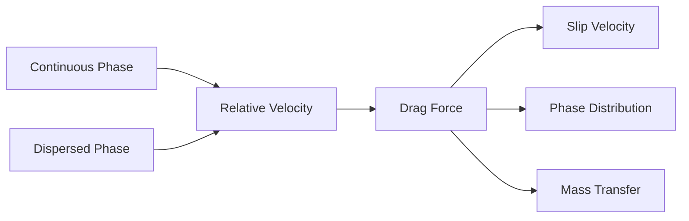
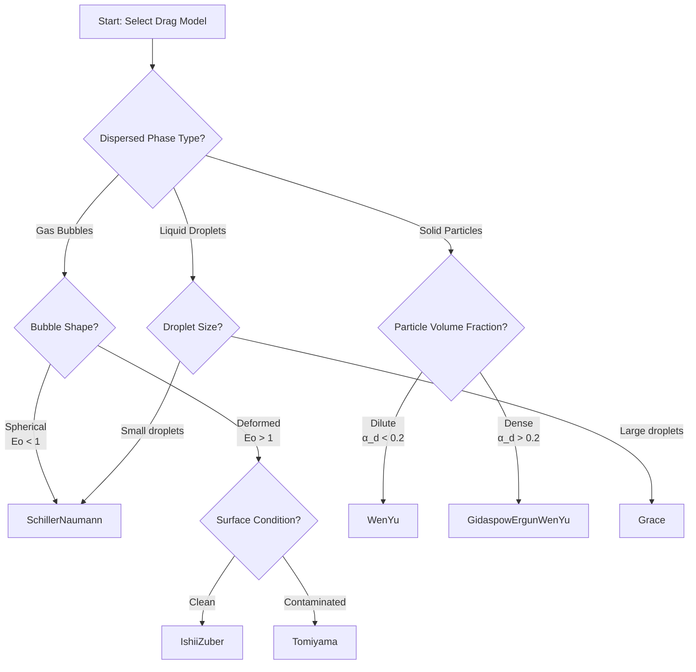

# Drag Force Overview

ภาพรวมแรงต้าน (Drag Force) ใน Multiphase Systems

## Learning Objectives

By the end of this section, you will be able to:
- **Understand** why drag is the most critical interphase force in multiphase flows
- **Select** appropriate drag models for different flow regimes and particle types
- **Configure** basic drag settings in OpenFOAM simulations
- **Recognize** the key parameters that influence drag force modeling

---

## Why Drag Matters Most

> **ทำไม Drag สำคัญที่สุดใน Multiphase?**
> - **เป็นแรงหลัก** ที่กำหนด relative velocity ระหว่างเฟส
> - เลือก drag model ผิด = ผลลัพธ์ผิดหมด
> - มีหลาย models — SchillerNaumann, IshiiZuber, Tomiyama, Gidaspow...

> **💡 Drag = ตัวควบคุม slip velocity**
>
> ถ้า drag สูง → เฟสเคลื่อนที่พร้อมกัน | ถ้า drag ต่ำ → เฟสแยกจากกัน

**Drag Force** = แรงที่สำคัญที่สุดในระบบหลายเฟส ต้านการเคลื่อนที่สัมพัทธ์ระหว่างเฟส



---

## What is Drag Force?

**Drag Force** คือแรงที่เกิดจากความแตกต่างของความเร็วระหว่างเฟส (relative velocity) ซึ่ง:

- **Controls slip velocity** — กำหนดความเร็วสัมพัทธ์ที่ยอมให้เฟสเคลื่อนที่แตกต่างกัน
- **Affects phase distribution** — ช่วยกระจายหรือรวมกลุ่มของ dispersed phase
- **Impacts mass/heat transfer** — slip velocity ส่งผลต่ออัตราการถ่ายเท
- **Dominates momentum exchange** — โดยทั่วไปมีขนาดใหญ่กว่า interphase forces อื่นๆ รวมกัน

> **สำคัญ:** การเลือก drag model ที่เหมาะสมเป็นปัจจัยสำคัญที่สุดต่อความแม่นยำของการจำลอง multiphase flow

---

## Model Selection Guide

### Quick Selection Flowchart



### Selection Table

| System Type | Characteristics | Recommended Model |
|-------------|-----------------|-------------------|
| **Gas-Liquid: Bubbles** | | |
| Spherical bubbles | Eo < 1, clean surface | `SchillerNaumann` |
| Deformed bubbles | Eo > 1, clean surface | `IshiiZuber` |
| Contaminated bubbles | Eo > 1, dirty surface | `Tomiyama` |
| High viscosity ratio | μ_d/μ_c >> 1 | `Grace` |
| **Gas-Solid: Fluidized Beds** | | |
| Dilute regime | α_d < 0.2 | `WenYu` |
| Dense regime | α_d > 0.2 | `GidaspowErgunWenYu` |
| Empirically tuned | System-specific | `SyamlalOBrien` |
| **Liquid-Liquid: Droplets** | | |
| Small droplets | Spherical shape | `SchillerNaumann` |
| Large droplets | Deformed shape | `Grace` |

---

## Key Parameters

### Reynolds Number (Re)

บอกถึง flow regime รอบๆ particle/bubble:

$$Re = \frac{\rho_c |\mathbf{u}_r| d}{\mu_c}$$

- **Re < 1**: Stokes flow (viscous dominant)
- **1 < Re < 1000**: Transition regime
- **Re > 1000**: Newton's regime (inertial dominant)

### Eötvös Number (Eo)

บอกถึง bubble deformation:

$$Eo = \frac{g(\rho_c - \rho_d) d^2}{\sigma}$$

| Eo Range | Bubble Shape | Model Choice |
|----------|--------------|--------------|
| < 1 | Spherical | SchillerNaumann |
| 1 - 10 | Ellipsoidal | IshiiZuber/Tomiyama |
| > 10 | Spherical cap | Tomiyama/Grace |

### Volume Fraction (α)

บอกถึง particle crowding:

| α_d Range | Regime | Model Choice |
|-----------|--------|--------------|
| < 0.2 | Dilute | WenYu |
| > 0.2 | Dense | GidaspowErgunWenYu |

---

## OpenFOAM Configuration Examples

### Basic Setup

```cpp
// constant/phaseProperties
drag
{
    (air in water)
    {
        type        SchillerNaumann;
        residualRe  1e-3;
        residualAlpha 1e-6;
    }
}
```

### Common Models

```cpp
// Deformed bubbles (clean)
drag
{
    (air in water)
    {
        type        IshiiZuber;
        residualRe  1e-3;
    }
}

// Contaminated bubbles
drag
{
    (air in water)
    {
        type        Tomiyama;
        residualRe  1e-3;
    }
}

// Dense fluidized bed
drag
{
    (air in sand)
    {
        type        GidaspowErgunWenYu;
        residualRe  1e-3;
        residualAlpha 1e-6;
    }
}
```

### Residual Parameters

| Parameter | Purpose | Typical Value |
|-----------|---------|---------------|
| `residualRe` | Prevent division by zero when |u_r| ≈ 0 | 1e-3 to 1e-4 |
| `residualAlpha` | Prevent issues when phase fraction ≈ 0 | 1e-6 to 1e-4 |

---

## Key Takeaways

- **Drag is the dominant interphase force** that controls slip velocity and phase distribution in multiphase flows
- **Model selection depends on**: particle type (bubble/solid/droplet), shape (spherical/deformed), flow regime (Re), and volume fraction (α)
- **Key dimensionless numbers**: Re (flow regime), Eo (bubble deformation), and α (crowding effects) guide model choice
- **SchillerNaumann is the default** for spherical particles; use IshiiZuber/Tomiyama for deformed bubbles, GidaspowErgunWenYu for dense gas-solid systems
- **Always set residual values** to prevent numerical instability when velocities or phase fractions approach zero

---

## Quick Reference

| Question | Answer |
|----------|--------|
| Most important interphase force? | **Drag** |
| Default model for spherical particles? | `SchillerNaumann` |
| Model for deformed bubbles (clean)? | `IshiiZuber` |
| Model for contaminated bubbles? | `Tomiyama` |
| Model for dilute gas-solid flow? | `WenYu` |
| Model for dense fluidized beds? | `GidaspowErgunWenYu` |
| What does Eo < 1 indicate? | Spherical bubbles |
| What does α_d > 0.2 indicate? | Dense regime |
| Purpose of residualRe? | Prevent division by zero |

---

## Concept Check

<details>
<summary><b>1. ทำไม drag เป็นแรงที่สำคัญที่สุด?</b></summary>

เพราะ **controls relative velocity** ระหว่างเฟส — กำหนด slip, mass transfer rate, และ phase distribution
</details>

<details>
<summary><b>2. Eo บอกอะไร?</b></summary>

**Buoyancy vs surface tension** → บอกว่า bubble จะ deform หรือไม่ (Eo > 1 = deformed)
</details>

<details>
<summary><b>3. residualRe คืออะไร?</b></summary>

ค่า minimum Re เพื่อ **ป้องกัน division by zero** เมื่อ relative velocity ใกล้ศูนย์
</details>

<details>
<summary><b>4. เมื่อไหร่ควรใช้ GidaspowErgunWenYu?</b></summary>

เมื่อ **α_d > 0.2** (dense regime) ใน gas-solid fluidized beds
</details>

<details>
<summary><b>5. ความแตกต่างระหว่าง IshiiZuber และ Tomiyama?</b></summary>

**IshiiZuber** = clean bubbles, **Tomiyama** = contaminated bubbles
</details>

---

## Related Documents

- **Mathematical Foundation & Equations:** [01_Fundamental_Drag_Concept.md](01_Fundamental_Drag_Concept.md)
- **Detailed Model Comparison:** [02_Specific_Drag_Models.md](02_Specific_Drag_Models.md)
- **Code & Implementation Details:** [03_OpenFOAM_Implementation.md](03_OpenFOAM_Implementation.md)