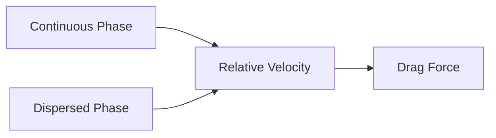
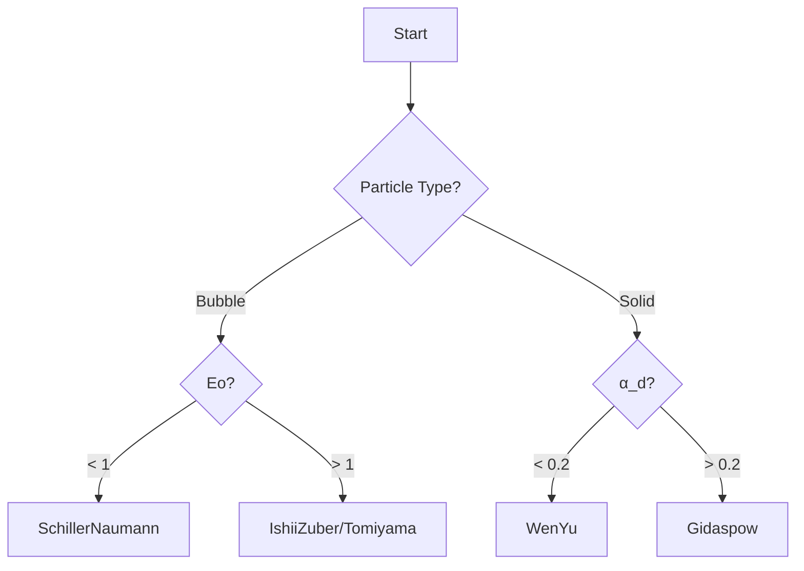

# Drag Force Overview

ภาพรวมแรงต้าน (Drag Force) ใน Multiphase Systems

---

## Overview

> **Drag Force** = แรงที่สำคัญที่สุดในระบบหลายเฟส ต้านการเคลื่อนที่สัมพัทธ์ระหว่างเฟส



---

## 1. Basic Equation

$$\mathbf{F}_D = K (\mathbf{u}_c - \mathbf{u}_d)$$

| Symbol | Meaning | Unit |
|--------|---------|------|
| $\mathbf{F}_D$ | Drag force per volume | N/m³ |
| $K$ | Exchange coefficient | kg/(m³·s) |
| $\mathbf{u}_c$, $\mathbf{u}_d$ | Phase velocities | m/s |

### Exchange Coefficient

$$K = \frac{3}{4} C_D \frac{\alpha_c \alpha_d \rho_c}{d} |\mathbf{u}_r|$$

---

## 2. Drag Coefficient

$$C_D = f(Re, Eo, \alpha, ...)$$

### Flow Regimes

| Regime | Re Range | $C_D$ |
|--------|----------|-------|
| Stokes | < 1 | 24/Re |
| Transition | 1-1000 | Correlation |
| Newton | > 1000 | 0.44 |

---

## 3. Model Selection



### Quick Selection

| System | Model |
|--------|-------|
| Spherical bubbles | `SchillerNaumann` |
| Deformed bubbles | `IshiiZuber` |
| Contaminated | `Tomiyama` |
| Dilute gas-solid | `WenYu` |
| Dense gas-solid | `GidaspowErgunWenYu` |

---

## 4. OpenFOAM Configuration

```cpp
// constant/phaseProperties
drag
{
    (air in water)
    {
        type        SchillerNaumann;
        residualRe  1e-3;
    }
}
```

### Available Models

| Keyword | Use Case |
|---------|----------|
| `SchillerNaumann` | Spherical, general |
| `IshiiZuber` | Gas-liquid, deformed |
| `Tomiyama` | Contaminated |
| `Grace` | High viscosity ratio |
| `WenYu` | Dilute fluidized bed |
| `GidaspowErgunWenYu` | Dense fluidized bed |
| `SyamlalOBrien` | Empirically tuned |

---

## 5. Important Parameters

### Reynolds Number

$$Re = \frac{\rho_c |\mathbf{u}_r| d}{\mu_c}$$

### Eötvös Number

$$Eo = \frac{g(\rho_c - \rho_d) d^2}{\sigma}$$

| Eo | Shape |
|----|-------|
| < 1 | Spherical |
| 1-10 | Ellipsoidal |
| > 10 | Cap |

---

## 6. Numerical Treatment

### Implicit Treatment

```cpp
// Stable: adds to diagonal
fvm::Sp(K, U)
```

### Residual Values

```cpp
drag
{
    (air in water)
    {
        type        SchillerNaumann;
        residualRe  1e-3;      // Prevent 1/0
        residualAlpha 1e-6;
    }
}
```

---

## Quick Reference

| Question | Answer |
|----------|--------|
| Most important force? | **Drag** |
| Default model? | `SchillerNaumann` |
| Deformed bubbles? | `IshiiZuber` or `Tomiyama` |
| Dense gas-solid? | `GidaspowErgunWenYu` |

---

## Concept Check

<details>
<summary><b>1. ทำไม drag เป็นแรงที่สำคัญที่สุด?</b></summary>

เพราะ **controls relative velocity** ระหว่างเฟส — กำหนด slip, mass transfer rate, และ phase distribution
</details>

<details>
<summary><b>2. Eo บอกอะไร?</b></summary>

**Buoyancy vs surface tension** → บอกว่า bubble จะ deform หรือไม่ (Eo > 1 = deformed)
</details>

<details>
<summary><b>3. residualRe คืออะไร?</b></summary>

ค่า minimum Re เพื่อ **ป้องกัน division by zero** เมื่อ relative velocity ใกล้ศูนย์
</details>

---

## Related Documents

- **Fundamental Concepts:** [01_Fundamental_Drag_Concept.md](01_Fundamental_Drag_Concept.md)
- **Specific Models:** [02_Specific_Drag_Models.md](02_Specific_Drag_Models.md)
- **OpenFOAM Implementation:** [03_OpenFOAM_Implementation.md](03_OpenFOAM_Implementation.md)