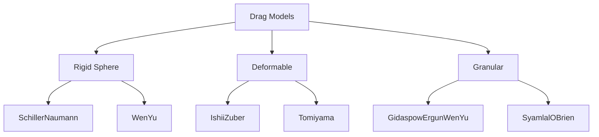
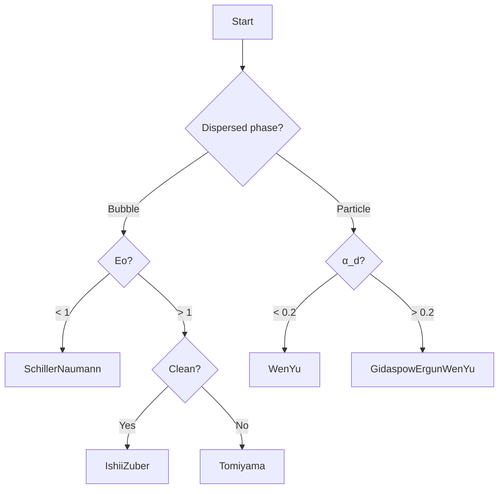

# Specific Drag Models

โมเดล Drag เฉพาะสำหรับระบบหลายเฟส

---

## Overview



---

## 1. Schiller-Naumann

### Equation

$$C_D = \max\left(\frac{24}{Re}(1 + 0.15Re^{0.687}), 0.44\right)$$

### Use Case

- Spherical particles/bubbles
- $Re < 1000$
- Clean systems

```cpp
drag { (air in water) { type SchillerNaumann; } }
```

---

## 2. Ishii-Zuber

### Equation

$$C_D = \begin{cases}
\frac{24}{Re}(1 + 0.1Re^{0.75}) & \text{Stokes regime} \\
\frac{2}{3}\sqrt{Eo} & \text{Distorted regime} \\
\frac{8}{3} & \text{Cap regime}
\end{cases}$$

### Use Case

- Deformable bubbles
- Gas-liquid with $Eo > 1$

```cpp
drag { (air in water) { type IshiiZuber; } }
```

---

## 3. Tomiyama

### Equation

$$C_D = \max\left[\min\left(\frac{24}{Re}(1+0.15Re^{0.687}), \frac{72}{Re}\right), \frac{8Eo}{3(Eo+4)}\right]$$

### Use Case

- Contaminated bubbles (surfactants)
- General purpose for gas-liquid

```cpp
drag { (air in water) { type Tomiyama; } }
```

### Comparison

| System | Model |
|--------|-------|
| Clean bubbles | Ishii-Zuber |
| Contaminated | Tomiyama |

---

## 4. Grace

### Equation

$$C_D = \frac{4}{3}\frac{gd(\rho_l-\rho_g)}{\rho_l u_t^2}$$

where $u_t$ from Grace correlation

### Use Case

- High viscosity ratio
- Large bubbles

```cpp
drag { (air in water) { type Grace; } }
```

---

## 5. Wen-Yu

### Equation

$$C_D = \frac{24}{\alpha_c Re}(1 + 0.15(\alpha_c Re)^{0.687}) \cdot \alpha_c^{-1.65}$$

### Use Case

- Fluidized beds (dilute: $\alpha_d < 0.2$)
- Gas-solid systems

```cpp
drag { (particles in air) { type WenYu; } }
```

---

## 6. Gidaspow (Ergun + Wen-Yu)

### Equation

$$\beta = \begin{cases}
\frac{150\alpha_d^2\mu_c}{\alpha_c d_p^2} + \frac{1.75\alpha_d\rho_c|u_r|}{d_p} & \alpha_c < 0.8 \\
\frac{3}{4}C_D\frac{\alpha_c\alpha_d\rho_c|u_r|}{d_p}\alpha_c^{-2.65} & \alpha_c \geq 0.8
\end{cases}$$

### Use Case

- Dense fluidized beds
- Gas-solid with variable $\alpha$

```cpp
drag { (particles in air) { type GidaspowErgunWenYu; } }
```

---

## 7. Syamlal-O'Brien

### Equation

$$C_D = \frac{0.63 + 4.8/\sqrt{Re/v_r}}^2$$

where $v_r$ is terminal velocity ratio

### Use Case

- Fluidized beds
- Empirically tuned for specific systems

```cpp
drag { (particles in air) { type SyamlalOBrien; } }
```

---

## 8. Model Selection Guide



---

## Quick Reference

| Model | Best For | Key Parameter |
|-------|----------|---------------|
| SchillerNaumann | Spherical, Re < 1000 | Re |
| IshiiZuber | Deformed bubbles | Eo |
| Tomiyama | Contaminated systems | Re, Eo |
| Grace | High μ ratio | Terminal velocity |
| WenYu | Dilute gas-solid | α |
| Gidaspow | Dense gas-solid | α (switching) |

---

## OpenFOAM Configuration

```cpp
// constant/phaseProperties
drag
{
    (air in water)
    {
        type            Tomiyama;
        residualRe      1e-3;
        residualAlpha   1e-6;
    }
}
```

---

## Concept Check

<details>
<summary><b>1. SchillerNaumann กับ Tomiyama ต่างกันอย่างไร?</b></summary>

- **SchillerNaumann**: Rigid spheres, ไม่รวม deformation
- **Tomiyama**: รวม Eo effects และ surface contamination
</details>

<details>
<summary><b>2. ทำไม Gidaspow มี switching function?</b></summary>

เพราะ **Ergun** ใช้สำหรับ packed beds (dense) แต่ **Wen-Yu** ใช้สำหรับ dilute → Gidaspow switches ระหว่าง regimes
</details>

<details>
<summary><b>3. residualRe คืออะไร?</b></summary>

ค่า minimum Re เพื่อป้องกัน division by zero เมื่อ velocity ใกล้ศูนย์
</details>

---

## Related Documents

- **ภาพรวม:** [00_Overview.md](00_Overview.md)
- **Fundamental Concepts:** [01_Fundamental_Drag_Concept.md](01_Fundamental_Drag_Concept.md)
- **OpenFOAM Implementation:** [03_OpenFOAM_Implementation.md](03_OpenFOAM_Implementation.md)