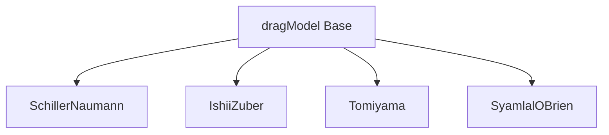

# OpenFOAM Drag Model Implementation

การนำ Drag Models ไปใช้ใน OpenFOAM

---

## Overview



| Class | Function | Return |
|-------|----------|--------|
| `dragModel` | Base class | Interface |
| `Cd()` | Drag coefficient | `volScalarField` |
| `K()` | Exchange coefficient | `volScalarField` |
| `F()` | Drag force | `volVectorField` |

---

## 1. Momentum Exchange Coefficient

$$K = \frac{3}{4} C_D \frac{\alpha_c \alpha_d \rho_c}{d_p} |u_r|$$

### OpenFOAM Code

```cpp
tmp<volScalarField> dragModel::K() const
{
    const volScalarField& alpha1 = pair_.phase1().alpha();
    const volScalarField& alpha2 = pair_.phase2().alpha();
    const volScalarField& rho2 = pair_.phase2().rho();
    const volScalarField& d = pair_.dispersed().d();
    const volScalarField& Ur = pair_.Ur();

    return (3.0/4.0)*Cd()*alpha1*alpha2*rho2/d*Ur;
}
```

---

## 2. Reynolds Number

$$Re_p = \frac{\rho_c |u_r| d_p}{\mu_c}$$

```cpp
tmp<volScalarField> PhasePair::Re() const
{
    return phase1().rho()*Ur()*dispersed().d()/phase1().mu();
}

tmp<volScalarField> PhasePair::Ur() const
{
    return mag(phase2().U() - phase1().U());
}
```

---

## 3. Drag Models

### Schiller-Naumann

$$C_D = \max\left(\frac{24}{Re}(1 + 0.15Re^{0.687}), 0.44\right)$$

```cpp
virtual tmp<volScalarField> Cd() const
{
    const volScalarField& Re = pair_.Re();

    return max(24.0/Re*(1.0 + 0.15*pow(Re, 0.687)), 0.44);
}
```

**Use:** Spherical particles, $Re < 1000$

### Ishii-Zuber

$$C_D = \frac{8}{3}\frac{Eo}{Eo + 4}$$ (distorted regime)

**Use:** Deformed bubbles, $Eo > 1$

### Tomiyama

$$C_D = \max\left[0.44, \min\left(\frac{24}{Re}(1 + 0.15Re^{0.687}), \frac{72}{Re}\right)\right]$$

**Use:** Contaminated bubbles

### Syamlal-O'Brien

**Use:** Fluidized beds, gas-solid systems

---

## 4. OpenFOAM Configuration

### phaseProperties

```cpp
// constant/phaseProperties
drag
{
    (air in water)
    {
        type    SchillerNaumann;
    }
}
```

### Available Models

| Model | Keyword | Application |
|-------|---------|-------------|
| Schiller-Naumann | `SchillerNaumann` | Spherical particles |
| Ishii-Zuber | `IshiiZuber` | Deformed bubbles |
| Tomiyama | `Tomiyama` | Contaminated bubbles |
| Syamlal-O'Brien | `SyamlalOBrien` | Fluidized beds |
| Morsi-Alexander | `MorsiAlexander` | Wide Re range |
| Gidaspow | `GidaspowErgunWenYu` | Dense gas-solid |

---

## 5. Numerical Stability

### Implicit vs Explicit

| Treatment | Pros | Cons |
|-----------|------|------|
| Explicit | Simple | Time step limited |
| Implicit | More stable | Coupled solve |

### Under-Relaxation

```cpp
// system/fvSolution
relaxationFactors
{
    equations
    {
        U       0.7;
        p       0.3;
    }
    fields
    {
        "alpha.*"   0.5;
    }
}
```

### Typical Values

| Factor | Steady | Transient |
|--------|--------|-----------|
| U | 0.7 | 0.8-1.0 |
| p | 0.3 | 0.3-0.5 |
| alpha | 0.5 | 0.7-1.0 |

---

## 6. Dense Suspension Effects

### Hindered Settling

$$K_{mod} = K \cdot f(\alpha_d)$$

**Richardson-Zaki:**
$$v_t = v_{t,0} (1 - \alpha_d)^n$$

**Barnea-Mizrahi:**
$$f(\alpha_c) = (1 - \alpha_d)^2 \exp\left(\frac{2.5\alpha_d}{1 - \alpha_d}\right)$$

---

## 7. Turbulent Effects

### Turbulent Dispersion Force

$$\mathbf{F}_{TD} = -C_{TD} \rho_c k_c \nabla \alpha_d$$

```cpp
// constant/phaseProperties
turbulentDispersion
{
    (air in water)
    {
        type    Burns;
        Ctd     1.0;
    }
}
```

### Effective Relative Velocity

$$|u_r|_{eff} = \sqrt{|u_r|^2 + 2k_c}$$

---

## Quick Reference

| Situation | Model | Keyword |
|-----------|-------|---------|
| Spherical bubbles | Schiller-Naumann | `SchillerNaumann` |
| Deformed bubbles | Ishii-Zuber | `IshiiZuber` |
| Pipe flow bubbles | Tomiyama | `Tomiyama` |
| Fluidized bed | Gidaspow | `GidaspowErgunWenYu` |
| High concentration | Add hindered settling | Check model options |

---

## Concept Check

<details>
<summary><b>1. K coefficient คืออะไร?</b></summary>

**Momentum exchange coefficient** — ค่าที่ couple momentum equations ของทั้งสองเฟสเข้าด้วยกัน หน่วยคือ $[kg/(m^3 \cdot s)]$
</details>

<details>
<summary><b>2. ทำไม implicit treatment ถึงเสถียรกว่า?</b></summary>

เพราะ **drag term ถูกเพิ่มเข้า matrix diagonal** ทำให้ matrix มี **diagonal dominance** มากขึ้น → convergence ดีขึ้น
</details>

<details>
<summary><b>3. Hindered settling สำคัญเมื่อไหร่?</b></summary>

เมื่อ **$\alpha_d > 0.1$** — particles/bubbles เริ่มมี interactions กันจนลด settling velocity
</details>

---

## Related Documents

- **ภาพรวม:** [00_Overview.md](00_Overview.md)
- **Drag Fundamentals:** [01_Fundamental_Drag_Concept.md](01_Fundamental_Drag_Concept.md)
- **Specific Models:** [02_Specific_Drag_Models.md](02_Specific_Drag_Models.md)