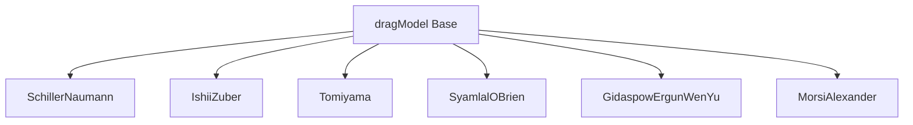

# OpenFOAM Drag Model Implementation

การนำ Drag Models ไปใช้ใน OpenFOAM

---

## Learning Objectives

ในบทนี้คุณจะได้เรียนรู้:
- **โครงสร้างคลาส** และลำดับชั้นของ dragModel ใน OpenFOAM
- **การคอนฟิกูร์** drag models ผ่าน phaseProperties dictionary
- **เทคนิคทางตัวเลข** เพื่อเพิ่มเสถียรภาพการคำนวณ
- **การจัดการปัญหา** ในระบบที่ซับซ้อน (dense suspensions, turbulent dispersion)

---

## Overview



| Class | Function | Return |
|-------|----------|--------|
| `dragModel` | Base class | Interface |
| `Cd()` | Drag coefficient | `volScalarField` |
| `K()` | Exchange coefficient | `volScalarField` |
| `F()` | Drag force | `volVectorField` |

---

## 1. Class Structure

### dragModel Base Class

```cpp
// src/lagrangian/intermediate/submodels/TTerm/DragModel/dragModel.H

template<class CloudType>
class DragModel
{
protected:
    // Reference to owner cloud
    const CloudType& owner_;
    
    // Dictionary coefficients
    const dictionary dict_;

public:
    // Constructor
    DragModel
    (
        CloudType& owner,
        const dictionary& dict
    );
    
    // Destructor
    virtual ~DragModel();
    
    // Drag coefficient field
    virtual tmp<volScalarField> Cd() const = 0;
    
    // Momentum exchange coefficient
    virtual tmp<volScalarField> K() const;
    
    // Drag force
    virtual tmp<volVectorField> F() const;
    
    // TypeName
    TypeName("dragModel");
};
```

### PhasePair Utility Class

```cpp
// phasePair.H - Manages phase pair properties

class PhasePair
{
private:
    const phase1& phase1_;
    const phase2& phase2_;
    
public:
    // Relative velocity magnitude
    tmp<volScalarField> Ur() const
    {
        return mag(phase2().U() - phase1().U());
    }
    
    // Particle Reynolds number
    tmp<volScalarField> Re() const
    {
        return phase1().rho()*Ur()*dispersed().d()/phase1().mu();
    }
    
    // Continuous phase
    const phaseModel& continuous() const;
    
    // Dispersed phase
    const phaseModel& dispersed() const;
};
```

---

## 2. Momentum Exchange Coefficient

### Implementation

```cpp
tmp<volScalarField> dragModel::K() const
{
    const volScalarField& alpha1 = pair_.phase1().alpha();
    const volScalarField& alpha2 = pair_.phase2().alpha();
    const volScalarField& rho2 = pair_.phase2().rho();
    const volScalarField& d = pair_.dispersed().d();
    const volScalarField& Ur = pair_.Ur();

    return (3.0/4.0)*Cd()*alpha1*alpha2*rho2/d*Ur;
}
```

### Field Variables

| Variable | Type | Description |
|----------|------|-------------|
| `alpha1`, `alpha2` | `volScalarField` | Volume fractions |
| `rho2` | `volScalarField` | Continuous phase density |
| `d` | `volScalarField` | Particle/droplet diameter |
| `Ur` | `volScalarField` | Relative velocity magnitude |
| `Cd` | `volScalarField` | Drag coefficient (model-specific) |

---

## 3. Drag Model Implementations

**สูตรคณิตศาสตร์ของแต่ละ model อยู่ใน** [02_Specific_Drag_Models.md](02_Specific_Drag_Models.md)

### Schiller-Naumann

```cpp
// SchillerNaumann.H

class SchillerNaumann
:
    public dragModel
{
public:
    // Constructor
    SchillerNaumann
    (
        const dragModel& dict,
        const PhasePair& pair
    );
    
    // Drag coefficient
    virtual tmp<volScalarField> Cd() const
    {
        const volScalarField& Re = pair_.Re();
        return max(24.0/Re*(1.0 + 0.15*pow(Re, 0.687)), 0.44);
    }
    
    //- Runtime type information
    TypeName("SchillerNaumann");
};
```

### Ishii-Zuber

```cpp
// IshiiZuber.H

virtual tmp<volScalarField> Cd() const
{
    const volScalarField& Eo = pair_.Eo();
    const volScalarField& Re = pair_.Re();
    
    // Distorted particle regime
    tmp<volScalarField> tCd
    (
        new volScalarField
        (
            IOobject
            (
                "Cd",
                pair_.mesh().time().timeName(),
                pair_.mesh()
            ),
            (2.0/3.0)*Eo + 8.0/3.0*Re/(1.0 + Re)
        )
    );
    
    return tCd;
}
```

### Tomiyama

```cpp
// Tomiyama.H - For contaminated bubbles

virtual tmp<volScalarField> Cd() const
{
    const volScalarField& Re = pair_.Re();
    const volScalarField& Eo = pair_.Eo();
    
    // Tomiyama correlation
    return max
    (
        0.44,
        min
        (
            24.0/Re*(1.0 + 0.15*pow(Re, 0.687)),
            72.0/Re
        )
    );
}
```

### Gidaspow (Ergun-Wen-Yu)

```cpp
// GidaspowErgunWenYu.H - Dense fluidized beds

virtual tmp<volScalarField> Cd() const
{
    const volScalarField& alpha2 = pair_.phase2().alpha();
    const volScalarField& Re = pair_.Re();
    
    // Switch at alpha_d = 0.2
    tmp<volScalarField> tCd = pow(Re, -0.43); // Wen-Yu
    
    // Ergun for dense regime
    tCd = pos(0.2 - alpha2)*tCd + neg(0.2 - alpha2)*
          (200.0*alpha2/Re + 1.75);
    
    return tCd;
}
```

---

## 4. OpenFOAM Configuration

### phaseProperties Dictionary

```cpp
// constant/phaseProperties

phases
(
    water
    {
        transportModel  Newtonian;
        nu              1e-06;
        rho             1000;
    }
    
    air
    {
        transportModel  Newtonian;
        nu              1.48e-05;
        rho             1;
        diameter        uniform 0.001;
    }
);

drag
{
    (air in water)
    {
        type    SchillerNaumann;
        
        // Optional: model coefficients
        Cmax    0.8;  // Max packing
    }
}
```

### Available Models

| Model | Keyword | Application | Typical Use |
|-------|---------|-------------|-------------|
| Schiller-Naumann | `SchillerNaumann` | Spherical particles | Bubbles, droplets |
| Ishii-Zuber | `IshiiZuber` | Deformed bubbles | Gas-liquid, Eo > 1 |
| Tomiyama | `Tomiyama` | Contaminated bubbles | Pipe flow |
| Syamlal-O'Brien | `SyamlalOBrien` | Fluidized beds | Gas-solid |
| Gidaspow | `GidaspowErgunWenYu` | Dense suspensions | Packed beds |
| Morsi-Alexander | `MorsiAlexander` | Wide Re range | Variable flow |

### Switching Models at Runtime

```cpp
// Using runTimeSelectable

drag
{
    (air in water)
    {
        type    table;
        
        entries
        (
            (0 SchillerNaumann)
            (5 Tomiyama)
        );
    }
}
```

---

## 5. Numerical Stability

### Implicit vs Explicit Treatment

```cpp
// system/fvSchemes

ddtSchemes
{
    default         Euler;
}

gradSchemes
{
    default         Gauss linear;
}

divSchemes
{
    div(U,alpha)    Gauss linear;  // Explicit
    // div(phi,alpha) Gauss upwind; // Semi-implicit
}
```

### Under-Relaxation Factors

```cpp
// system/fvSolution

solvers
{
    "alpha.*"
    {
        solver          GAMG;
        tolerance       1e-06;
        relTol          0.1;
    }
    
    "U.*"
    {
        solver          PBiCGStab;
        preconditioner  DILU;
        tolerance       1e-05;
        relTol          0.1;
    }
}

relaxationFactors
{
    equations
    {
        U       0.7;
        p       0.3;
    }
    fields
    {
        "alpha.*"   0.5;
    }
}
```

### Recommended Values

| Factor | Steady State | Transient | Explanation |
|--------|--------------|-----------|-------------|
| U | 0.7 | 0.8-1.0 | Less relaxation for transient |
| p | 0.3 | 0.3-0.5 | Pressure needs strong relaxation |
| alpha | 0.5 | 0.7-1.0 | Volume fraction coupling |

### MaxAlpha Modification

```cpp
// system/fvSolution

PIMPLE
{
    maxAlphaCo      0.5;
    nAlphaCorr      1;
    nAlphaSubCycles 2;
    alphaApplyPrevCorr yes;
    
    MULESCorr       yes;
    nLimiterIter    3;
}
```

---

## 6. Dense Suspension Effects

### Hindered Settling Models

**ดูรายละเอียดสมการใน** [01_Fundamental_Drag_Concept.md](01_Fundamental_Drag_Concept.md)

### OpenFOAM Implementation

```cpp
// Modified drag for dense suspensions

tmp<volScalarField> dragModel::K() const
{
    const volScalarField& alpha_d = pair_.dispersed().alpha();
    
    // Base K coefficient
    tmp<volScalarField> tK = K_base();
    
    // Richardson-Zaki correction
    volScalarField n(4.65); // Parameter
    volScalarField f_alpha = pow(1.0 - alpha_d, n);
    
    return tK * f_alpha;
}
```

### Configuration

```cpp
// constant/phaseProperties

drag
{
    (air in water)
    {
        type    SchillerNaumann;
        
        // Hindered settling
        hinderedSettling  yes;
        n                 4.65;  // Richardson-Zaki exponent
    }
}
```

---

## 7. Turbulent Dispersion Force

### Lift and Dispersion Models

```cpp
// constant/phaseProperties

lift
{
    (air in water)
    {
        type    LegendreMagnaudet;
        Cl      0.5;
    }
}

turbulentDispersion
{
    (air in water)
    {
        type    Burns;
        Ctd     1.0;
    }
}

wallLubrication
{
    (air in water)
    {
        type    Antal;
        Cw1     0.006;
        Cw2     0.01;
    }
}
```

### Effective Relative Velocity

```cpp
// turbulentDispersionModels/Bumps/Bumps.C

tmp<volScalarField> Bumps::F() const
{
    const volScalarField& k = phase1().turbulence()->k();
    const volScalarField& Ur = pair_.Ur();
    
    // Effective velocity includes turbulence
    volScalarField UrEff = sqrt(sqr(Ur) + 2.0*k);
    
    return Ctd_*k*pair_.continuous().rho()*fvm::ddt(pair_.dispersed().alpha());
}
```

### Available Dispersion Models

| Model | Keyword | Use Case |
|-------|---------|----------|
| Burns | `Burns` | General purpose |
| Lopez de Bertodano | `LopezDeBertodano` | Bubbly flows |
| Gosman | `Gosman` | Pipe flows |

---

## 8. Debugging and Verification

### Runtime Output

```cpp
// system/controlDict

functions
{
    dragCoeff
    {
        type            sets;
        functionObjectLibs ("libsampling.so");
        
        setFormat       raw;
        
        sets
        (
            centerLine
            {
                type    uniform;
                axis    y;
                start   (0 0 0);
                end     (0 1 0);
                nPoints 100;
            }
        );
        
        fields
        (
            Cd
            K
            alpha.air
        );
    }
}
```

### Checking Model Selection

```bash
# List available drag models
ls $FOAM_SRC/lagrangian/intermediate/submodels/TTerm/DragModel/

# Verify model loaded
grep "type" constant/phaseProperties

# Check solver output for model info
interFoam -listFunctionObjects
```

---

## Key Takeaways

- **dragModel** เป็น base class ที่ทุก model สืบทอดมา โดย override `Cd()` function เพื่อกำหนดสมการของตนเอง
- **phaseProperties** dictionary เป็นจุดควบคุมหลักสำหรับเลือกและคอนฟิก drag model ผ่าน `type` keyword
- **Implicit treatment** พร้อม under-relaxation ช่วยเพิ่มเสถียรภาพ โดยเฉพาะในกรณี high density ratio
- **Dense suspensions** ต้องใช้ hindered settling corrections เพื่อลด K coefficient เมื่อ $\alpha_d$ สูง
- **Turbulent dispersion** สำคัญใน flows ที่มี turbulence สูง ใช้ร่วมกับ lift และ wall lubrication forces

---

## Quick Reference

| Task | Configuration |
|------|---------------|
| Select drag model | `drag { (phase1 in phase2) { type SchillerNaumann; } }` |
| Add under-relaxation | `relaxationFactors { fields { "alpha.*" 0.5; } }` |
| Enable turbulent dispersion | `turbulentDispersion { (phase1 in phase2) { type Burns; Ctd 1.0; } }` |
| Output K field | `functions { K { type sets; fields (K); } }` |
| Check available models | `ls $FOAM_SRC/.../DragModel/` |

---

## Concept Check

<details>
<summary><b>1. ฟังก์ชันหลักที่ต้อง override ใน dragModel subclass คืออะไร?</b></summary>

**`Cd()`** — drag coefficient field ซึ่งแต่ละ model คำนวณตาม correlation เฉพาะของมัน
</details>

<details>
<summary><b>2. ระบุ file และ section ที่ใช้เลือก drag model?</b></summary>

**constant/phaseProperties** → ใน block `drag { (phase1 in phase2) { type ...; } }`
</details>

<details>
<summary><b>3. ทำไมต้องมี under-relaxation สำหรับ alpha field?</b></summary>

เพราะ **alpha strongly coupled กับ U และ p** ผ่าน drag term การปรับค่าทีละน้อยช่วย **prevent oscillations**
</details>

<details>
<summary><b>4. Implicit vs Explicit drag treatment ต่างกันอย่างไร?</b></summary>

**Explicit:** drag term อยู่ RHS → ง่าย แต่ timestep จำกัด  
**Implicit:** drag term อยู่ LHS matrix → เสถียรกว่า แต่ซับซ้อนกว่า
</details>

<details>
<summary><b>5. Hindered settling คืออะไร และ implement อย่างไร?</b></summary>

เป็นการ **ลด K coefficient** เมื่อ particle volume fraction สูง เพื่อให้สอดคล้องกับ **reduced settling velocity** ใน dense suspensions
</details>

---

## Related Documents

- **ภาพรวม:** [00_Overview.md](00_Overview.md)
- **Drag Fundamentals:** [01_Fundamental_Drag_Concept.md](01_Fundamental_Drag_Concept.md)
- **Specific Models:** [02_Specific_Drag_Models.md](02_Specific_Drag_Models.md)