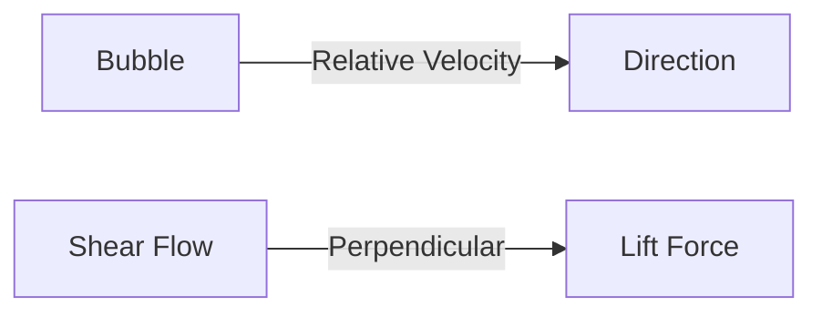

# Lift Force Overview

ภาพรวมแรงยกในระบบหลายเฟส

---

## Overview

> **Lift Force** = แรงตั้งฉากกับทิศทางการเคลื่อนที่สัมพัทธ์ เกิดจาก **velocity gradient** รอบ bubble/particle



---

## 1. Lift Force Equation

$$\mathbf{F}_L = -C_L \rho_c \alpha_d (\mathbf{u}_d - \mathbf{u}_c) \times (\nabla \times \mathbf{u}_c)$$

| Symbol | Meaning | Unit |
|--------|---------|------|
| $C_L$ | Lift coefficient | - |
| $\rho_c$ | Continuous phase density | kg/m³ |
| $\alpha_d$ | Dispersed phase fraction | - |
| $\mathbf{u}_d - \mathbf{u}_c$ | Relative velocity | m/s |
| $\nabla \times \mathbf{u}_c$ | Vorticity | 1/s |

---

## 2. Physical Origin

### Shear-Induced Lift

- Bubble ในบริเวณที่มี **velocity gradient** จะถูกผลักไปด้านที่มี velocity สูงกว่า
- สำคัญใน: pipe flow, bubble columns, stirred tanks

### Direction

| Bubble Size | Eo | Lift Direction |
|-------------|-----|----------------|
| Small | < 4 | Toward wall (positive $C_L$) |
| Large | > 4 | Toward center (negative $C_L$) |

---

## 3. Lift Coefficient Models

### Constant Coefficient

$$C_L = 0.5$$ (spherical bubble in inviscid flow)

### Tomiyama Correlation

$$C_L = \begin{cases}
\min[0.288 \tanh(0.121 Re_b), f(Eo_d)] & Eo_d < 4 \\
f(Eo_d) & 4 \leq Eo_d \leq 10 \\
-0.29 & Eo_d > 10
\end{cases}$$

where $f(Eo_d) = 0.00105 Eo_d^3 - 0.0159 Eo_d^2 - 0.0204 Eo_d + 0.474$

### Legendre-Magnaudet

- สำหรับ spherical bubbles
- รวม effects ของ Re และ Sr (shear rate)

---

## 4. When to Include Lift

| Condition | Include Lift? |
|-----------|---------------|
| Shear flow (pipe, channel) | **Yes** |
| Uniform flow | No |
| Small bubbles (Eo < 1) | Yes |
| Large deformed bubbles | Yes (negative $C_L$) |

### Decision Rule

```
IF velocity gradient is significant:
    IF Eo < 4:
        → Positive lift (toward wall)
    ELSE:
        → Negative lift (toward center)
```

---

## 5. OpenFOAM Configuration

### phaseProperties

```cpp
lift
{
    (air in water)
    {
        type    Tomiyama;
    }
}
```

### Available Models

| Model | Keyword | Use Case |
|-------|---------|----------|
| Constant | `constantCoefficient` | Simple cases |
| Tomiyama | `Tomiyama` | General bubbles |
| Legendre-Magnaudet | `LegendreMagnaudet` | Spherical bubbles |
| Moraga | `Moraga` | Small bubbles |

### Example with Constant

```cpp
lift
{
    (air in water)
    {
        type    constantCoefficient;
        Cl      0.5;
    }
}
```

---

## 6. Numerical Considerations

### Stability

- Lift force เพิ่ม **coupling** ระหว่างเฟส
- อาจต้องลด relaxation factors

```cpp
// system/fvSolution
relaxationFactors
{
    equations { U 0.6; }
}
```

### When Problems Occur

| Issue | Possible Cause | Solution |
|-------|----------------|----------|
| Oscillations | High $C_L$ | Use Tomiyama (adaptive) |
| Wrong distribution | Wrong sign | Check Eo, use appropriate model |

---

## Quick Reference

| Question | Answer |
|----------|--------|
| What causes lift? | Velocity gradient (shear) |
| Small bubble (Eo < 4)? | Positive $C_L$ → toward wall |
| Large bubble (Eo > 10)? | Negative $C_L$ → toward center |
| Default model? | `Tomiyama` |

---

## Concept Check

<details>
<summary><b>1. ทำไม bubble ขนาดเล็กถูกผลักไปที่ผนัง?</b></summary>

เพราะ bubble เล็กเป็น **spherical** มี wake สมมาตร → shear-induced lift ผลักไปทางที่มี velocity สูง (near wall ใน pipe)
</details>

<details>
<summary><b>2. ทำไม bubble ใหญ่มี negative lift?</b></summary>

Bubble ใหญ่ **deform** → wake ไม่สมมาตร → direction of lift reverses
</details>

<details>
<summary><b>3. เมื่อไหร่ไม่ต้อง include lift?</b></summary>

เมื่อ **flow เป็น uniform** (ไม่มี velocity gradient) หรือ **particle มี density ใกล้เคียง fluid** (solid particles)
</details>

---

## Related Documents

- **บทถัดไป:** [01_Lift_Mechanisms.md](01_Lift_Mechanisms.md)
- **OpenFOAM Implementation:** [03_OpenFOAM_Implementation.md](03_OpenFOAM_Implementation.md)
- **Drag Overview:** [../01_DRAG/00_Overview.md](../01_DRAG/00_Overview.md)