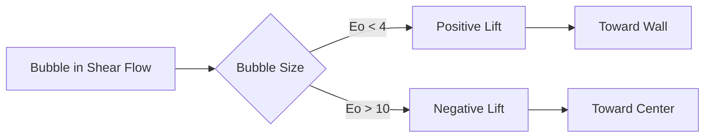

# Lift Force Overview

ภาพรวมแรงยกในระบบหลายเฟส

---

## Learning Objectives

หลังจากศึกษาบทนี้ คุณจะสามารถ:

- **อธิบาย (What)** แรงยก (lift force) และสมการพื้นฐานในระบบหลายเฟส
- **เข้าใจ (Why)** กลไกทางกายภาพที่ทำให้เกิดแรงยกและทิศทางการเคลื่อนที่ของ bubble/particle
- **ประยุกต์ใช้ (How)** แนวทางการเลือกโมเดลแรงยกที่เหมาะสมกับสภาวะการไหล

---

## Prerequisites

- ความรู้พื้นฐานเรื่องแรงต้าน (drag force) จาก [Drag Overview](../01_DRAG/00_Overview.md)
- ความเข้าใจเรื่อง Reynolds number และ Eötvös number
- แนวคิดเรื่อง shear flow และ velocity gradient

---

## Overview

> **Lift Force** = แรงตั้งฉากกับทิศทางการเคลื่อนที่สัมพัทธ์ เกิดจาก **velocity gradient** รอบ bubble/particle

### Physical Context (Why)

แรงยกเป็นปรากฏการณ์สำคัญที่อธิบายการกระจายตัวของ bubble ในการไหลแบบ shear:

- ใน **pipe flow**: bubble ขนาดเล็กจะถูกผลักไปยังผนัง (positive lift)
- ใน **bubble columns**: bubble ขนาดใหญ่จะถูกผลักไปยางกลาง (negative lift)
- ใน **stirred tanks**: แรงยกส่งผลต่อ pattern การผสม

การทำนายทิศทางแรงยกอย่างถูกต้องมีความสำคัญอย่างยิ่งต่อการออกแบบ equipment และ process optimization



---

## 1. What is Lift Force?

### Conceptual Definition

แรงยกเป็นแรงที่ **ตั้งฉาก** กับทิศทางการเคลื่อนที่สัมพัทธ์ระหว่างเฟส เกิดจากความไม่สมมาตรของ flow field รอบ bubble/particle

### Key Characteristics

| Aspect | Description |
|--------|-------------|
| **Direction** | ตั้งฉากกับ relative velocity |
| **Cause** | Velocity gradient (shear) |
| **Magnitude** | ขึ้นกับ $C_L$, $\rho$, $\alpha$, $u_r$, $\omega$ |
| **Sign** | บวกหรือลบ ขึ้นกับ Eötvös number |

---

## 2. Physical Mechanisms

### Shear-Induced Lift

เมื่อ bubble อยู่ในบริเวณที่มี **velocity gradient**:

```
Low Velocity Region  --------  High Velocity Region
       ↑                              ↑
       |        Bubble              |
       ←        Lift Force           ←
```

### Direction Reversal

ทิศทางแรงยกขึ้นกับรูปร่าง bubble:

| Bubble Size | Eötvös Number | Deformation | Lift Direction | $C_L$ Sign |
|-------------|---------------|-------------|----------------|------------|
| Small | < 4 | Spherical | Toward wall | Positive (+) |
| Transition | 4-10 | Moderate | Varies | Changes |
| Large | > 10 | Flattened | Toward center | Negative (−) |

> **ทำไม?** Bubble เล็กมี wake สมมาตร → shear-induced lift ผลักไปทาง velocity สูง  
> Bubble ใหญ่ **deform** → wake ไม่สมมาตร → lift direction reverses

---

## 3. When to Include Lift Force

### Decision Flowchart

```
                    Start
                     |
            Is velocity gradient significant?
                     |
           +---------+---------+
           |                   |
          Yes                 No → Don't include
           |
    What is bubble size?
           |
    +------+------+
    |             |
   Eo < 4       Eo > 10
    |             |
Positive $C_L$  Negative $C_L$
(Toward wall)  (Toward center)
```

### Practical Guidelines

| Application | Include Lift? | Reason |
|-------------|---------------|--------|
| **Pipe/Channel flow** | ✅ Yes | Strong shear near walls |
| **Bubble columns** | ✅ Yes | Affects radial distribution |
| **Stirred tanks** | ✅ Yes | Complex shear fields |
| **Uniform flow** | ❌ No | No velocity gradient |
| **Solid particles** | ⚠️ Maybe | Depends on density ratio |

---

## 4. Model Selection Overview

### Available Model Categories

| Model Type | Best For | Complexity |
|------------|----------|------------|
| **Constant** | Simple validation, inviscid flow | Low |
| **Tomiyama** | General bubbly flows | Medium |
| **Legendre-Magnaudet** | Spherical bubbles, viscous flows | Medium-High |
| **Moraga** | Small particles | Medium |

### Default Recommendation

> **Tomiyama model** เป็น choice ที่ดีสำหรับ bubbly flow ส่วนใหญ่ เนื่องจาก:
> - ครอบคลุมทั้ง positive และ negative lift
> - Adaptive กับ bubble deformation (ผ่าน Eo)
> - Validated กับ experimental data อย่างกว้างขวาง

---

## 5. OpenFOAM Implementation Overview

### Basic Configuration Structure

```cpp
// constant/phaseProperties
lift
{
    (air in water)
    {
        type    Tomiyama;  // Model selection
    }
}
```

### Available Model Keywords

| Model | OpenFOAM Keyword |
|-------|------------------|
| Constant | `constantCoefficient` |
| Tomiyama | `Tomiyama` |
| Legendre-Magnaudet | `LegendreMagnaudet` |
| Moraga | `Moraga` |

> **📖 รายละเอียด:** ดู implementation แบบเต็มใน [03_OpenFOAM_Implementation.md](03_OpenFOAM_Implementation.md)

---

## 6. Numerical Considerations

### Stability Issues

แรงยกเพิ่ม **coupling** ระหว่างเฟส → อาจทำให้เกิด oscillations:

```cpp
// system/fvSolution - relaxation adjustment
relaxationFactors
{
    equations
    {
        U       0.6;  // Reduce from default 0.7
        p_rgh   0.7;
    }
}
```

### Troubleshooting

| Symptom | Possible Cause | Remedy |
|---------|----------------|--------|
| **Oscillations** | High $C_L$ value | Use adaptive model (Tomiyama) |
| **Wrong distribution** | Incorrect sign | Check Eo, verify model selection |
| **Divergence** | Strong coupling | Reduce relaxation factors |

---

## Key Takeaways

✅ **Lift force** ตั้งฉากกับ relative velocity เกิดจาก velocity gradient  
✅ **Direction** ขึ้นกับ Eötvös number: Eo < 4 → toward wall, Eo > 10 → toward center  
✅ **Include** เมื่อมี shear flow อย่างมีนัยสำคัญ  
✅ **Tomiyama** เป็นโมเดล default ที่เหมาะสมสำหรับ bubbly flow ส่วนใหญ่  
✅ **Stability** อาจต้องลด relaxation factors เมื่อ include lift force

---

## Further Reading

### Textbooks & Papers

- **Tomiyama et al. (2002)** "Transverse migration of single bubbles in simple shear flows" - Chemical Engineering Science
- **Legendre & Magnaudet (1998)** "The lift force on a spherical bubble in a viscous linear shear flow" - Journal of Fluid Mechanics
- **Clift et al. (1978)** *Bubbles, Drops, and Particles* - Chapter 4: Lift Forces

### Related Modules

- [Drag Force Fundamentals](../01_DRAG/00_Overview.md) - แรงต้านเป็น prerequisite สำคัญ
- [Multiphase Flow Regimes](../01_FUNDAMENTAL_CONCEPTS/01_Flow_Regimes.md) - บริบทของ multiphase flow

---

## Quick Reference

| Question | Answer |
|----------|--------|
| What causes lift? | Velocity gradient (shear) |
| Small bubble (Eo < 4)? | Positive $C_L$ → toward wall |
| Large bubble (Eo > 10)? | Negative $C_L$ → toward center |
| Default model? | `Tomiyama` |
| When to skip? | Uniform flow (no shear) |

---

## Concept Check

<details>
<summary><b>1. ทำไม bubble ขนาดเล็กถูกผลักไปที่ผนังใน pipe flow?</b></summary>

เพราะ bubble เล็กเป็น **spherical** มี wake สมมาตร → shear-induced lift ผลักไปทางที่มี velocity สูงกว่า (บริเวณใกล้ผนังใน pipe flow)
</details>

<details>
<summary><b>2. ทำไม bubble ใหญ่มี negative lift?</b></summary>

Bubble ใหญ่ **deform** เป็น flattened shape → wake ไม่สมมาตร → direction of lift reverses ไปทาง center ของ pipe
</details>

<details>
<summary><b>3. เมื่อไหร่ไม่ต้อง include lift force?</b></summary>

เมื่อ **flow เป็น uniform** (ไม่มี velocity gradient) หรือเมื่อแรงยกมีค่าน้อยมากเมื่อเทียบกับ drag เช่น solid particles ที่มี density ใกล้เคียง fluid
</details>

---

## Related Documents

- **Mathematical Fundamentals:** [01_Fundamental_Lift_Concepts.md](01_Fundamental_Lift_Concepts.md)
- **Specific Models:** [02_Specific_Lift_Models.md](02_Specific_Lift_Models.md)
- **OpenFOAM Implementation:** [03_OpenFOAM_Implementation.md](03_OpenFOAM_Implementation.md)
- **Drag Overview:** [../01_DRAG/00_Overview.md](../01_DRAG/00_Overview.md)
- **Module Overview:** [../00_Overview.md](../00_Overview.md)