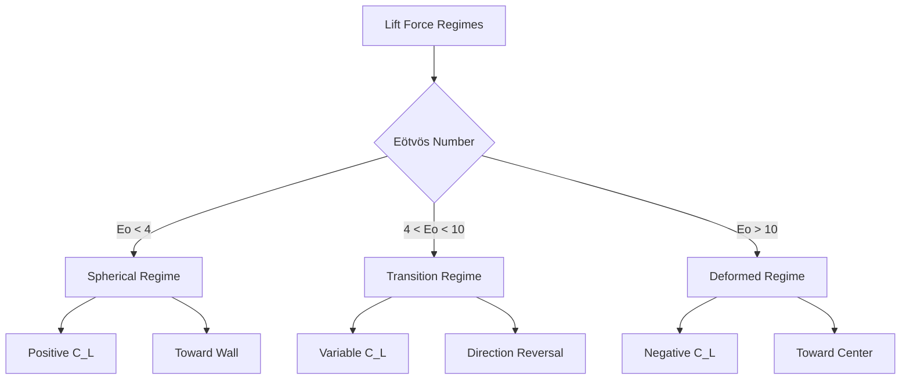

# Mathematical Fundamentals of Lift Force

พื้นฐานคณิตศาสตร์และกลไกทางฟิสิกส์ของแรงยก

---

## Learning Objectives

หลังจากศึกษาบทนี้ คุณจะสามารถ:

- **อนุพันธ์ (Derive)** สมการแรงยกจาก Navier-Stokes equations
- **อธิบาย (Explain)** กลไกทางฟิสิกส์ของ shear-induced lift ผ่าน vorticity framework
- **วิเคราะห์ (Analyze)** ผลของ dimensionless numbers ต่อทิศทางและขนาดแรงยก
- **เปรียบเทียบ (Compare)** กลไก lift ระหว่าง inviscid และ viscous flows

---

## Prerequisites

- **Fluid Mechanics:** Navier-Stokes equations, vorticity dynamics
- **Vector Calculus:** Cross products, curl operations, tensor notation
- **Dimensional Analysis:** Reynolds number, Eötvös number, Weber number
- **Multiphase Flow Basics:** ศึกษา [00_Overview.md](00_Overview.md) ก่อน

---

## 1. What is Lift Force? (Mathematical Definition)

### General Formulation

แรงยกเป็น **force component ที่ตั้งฉาก** กับ relative velocity vector:

$$\mathbf{F}_L = \mathbf{F} - (\mathbf{F} \cdot \hat{\mathbf{u}}_r)\hat{\mathbf{u}}_r$$

โดยที่ $\hat{\mathbf{u}}_r = \frac{\mathbf{u}_r}{|\mathbf{u}_r|}$ คือ unit vector ในทิศทาง relative velocity

### Standard Lift Force Equation

ใน Euler-Euler multiphase models:

$$\boxed{\mathbf{F}_L = -C_L \rho_c \alpha_d (\mathbf{u}_r \times \boldsymbol{\omega})}$$

| Symbol | Definition | Units |
|--------|------------|-------|
| $C_L$ | Lift coefficient | - |
| $\rho_c$ | Continuous phase density | kg/m³ |
| $\alpha_d$ | Dispersed phase volume fraction | - |
| $\mathbf{u}_r = \mathbf{u}_d - \mathbf{u}_c$ | Relative velocity | m/s |
| $\boldsymbol{\omega} = \nabla \times \mathbf{U}$ | Vorticity vector | s⁻¹ |

---

## 2. Physical Origin (Why Does Lift Exist?)

### 2.1 Vorticity Framework

แรงยกเกิดจาก **interaction ระหว่าง bubble กับ vorticity field** ของ surrounding flow:

$$\boldsymbol{\omega} = \nabla \times \mathbf{U} = \begin{vmatrix} \mathbf{i} & \mathbf{j} & \mathbf{k} \\ \frac{\partial}{\partial x} & \frac{\partial}{\partial y} & \frac{\partial}{\partial z} \\ U_x & U_y & U_z \end{vmatrix}$$

### 2.2 Mechanism in Simple Shear Flow

พิจารณา 2D shear flow: $U_x(y) = \dot{\gamma}y$

**Vorticity:**
$$\omega_z = \frac{\partial U_x}{\partial y} - \frac{\partial U_y}{\partial x} = \dot{\gamma}$$

**Lift Force Direction:**
$$\mathbf{F}_L \propto -\mathbf{u}_r \times \boldsymbol{\omega} \propto -(\mathbf{u}_r \times \dot{\gamma}\mathbf{e}_z)$$

สำหรับ bubble เคลื่อนที่ใน x-direction:
$$\mathbf{F}_L \propto -u_r\dot{\gamma}\mathbf{e}_y$$

→ แรงยกจึง **ตั้งฉากกับ flow direction** และขึ้นกับ shear rate

### 2.3 Pressure Asymmetry Mechanism

```
Flow Field Around Bubble in Shear:

    High Velocity (Low Pressure)
           ↑
    ┌─────────────┐
    │             │ →  Lower pressure on high-velocity side
    │    Bubble   │ 
    │      ↓      │ →  Higher pressure on low-velocity side
    └─────────────┘
           ↓
    Low Velocity (High Pressure)
    
    Result: Lift Force → High Velocity Side
```

**Mathematical Interpretation:**

จาก Bernoulli equation (inviscid assumption):
$$p + \frac{1}{2}\rho U^2 = \text{constant}$$

Velocity gradient → pressure gradient → **net force perpendicular to flow**

---

## 3. Derivation from First Principles

### 3.1 Starting Point: Navier-Stokes

สำหรับ incompressible flow:

$$\frac{\partial \mathbf{U}}{\partial t} + (\mathbf{U} \cdot \nabla)\mathbf{U} = -\frac{1}{\rho}\nabla p + \nu\nabla^2\mathbf{U}$$

### 3.2 Vorticity Transport Equation

ใช้ identity: $(\mathbf{U} \cdot \nabla)\mathbf{U} = \nabla(\frac{1}{2}|\mathbf{U}|^2) - \mathbf{U} \times \boldsymbol{\omega}$

จะได้:
$$\frac{D\boldsymbol{\omega}}{Dt} = (\boldsymbol{\omega} \cdot \nabla)\mathbf{U} + \nu\nabla^2\boldsymbol{\omega}$$

### 3.3 Force on Sphere in Shear Flow

จาก **Legendre & Magnaudet (1998)** สำหรับ spherical particle:

$$C_L = f(Re_p, Sr) = \underbrace{\frac{6}{\pi^2}}_{\text{inviscid}} \frac{Sr}{(Sr+1)^2} + \underbrace{O(Re_p^{-1})}_{\text{viscous correction}}$$

โดยที่:
- $Sr = \frac{d|\nabla U|}{|u_r|}$ = Shear Reynolds number
- $Re_p = \frac{\rho_c |u_r| d}{\mu_c}$ = Particle Reynolds number

---

## 4. Dimensionless Analysis

### 4.1 Key Dimensionless Numbers

**1. Eötvös Number (Bubble Deformation):**
$$Eo = \frac{g\Delta\rho d^2}{\sigma} = \frac{\text{Gravitational force}}{\text{Surface tension force}}$$

- **Eo < 4**: Surface tension dominates → **spherical bubbles**
- **Eo > 10**: Gravity dominates → **deformed bubbles**

**2. Shear Reynolds Number:**
$$Sr = \frac{d|\nabla U|}{|u_r|} = \frac{\text{Shear timescale}}{\text{Convective timescale}}$$

**3. Weber Number (Inertial vs Surface Tension):**
$$We = \frac{\rho_c u_r^2 d}{\sigma}$$

### 4.2 Regime Map



---

## 5. Lift Coefficient Behavior

### 5.1 Sign Dependence on Eo

| Regime | Eo Range | $C_L$ | Direction | Physical Mechanism |
|--------|----------|-------|-----------|-------------------|
| **Spherical** | < 4 | +0.1 to +0.5 | Toward wall | Shear-induced pressure asymmetry |
| **Transition** | 4-10 | Varies | Changes | Competition between mechanisms |
| **Deformed** | > 10 | -0.1 to -0.3 | Toward center | Wake asymmetry dominates |

### 5.2 Theoretical Limits

**Inviscid Limit (Auton, 1987):**
$$C_L^{inv} = \frac{1}{2} \quad \text{(for sphere in potential flow)}$$

**Viscous Correction (Saffman, 1965):**
$$C_L^{visc} = \frac{6.46}{Sr^{1/2}Re_p^{1/2}} \quad \text{(for small Re_p)}$$

**General Form:**
$$C_L = C_L^{inv} \cdot f_{inertial}(Sr) + C_L^{visc} \cdot f_{viscous}(Sr, Re_p)$$

---

## 6. Parameter Sensitivity Analysis

### 6.1 Effect of Shear Rate

สำหรับ fixed bubble size และ velocity:

$$|\mathbf{F}_L| \propto |\nabla U|$$

**Critical shear rate** สำหรับการเกิด lift:
$$|\nabla U|_{crit} \approx \frac{u_r}{d}$$

### 6.2 Effect of Bubble Size

จาก lift equation:
$$|\mathbf{F}_L| \propto d^3 \cdot d \cdot |\nabla U| = d^4 |\nabla U|$$

→ **แรงยกมีความ sensitive ต่อขนาด bubble อย่างมาก**

### 6.3 Effect of Volume Fraction

$$|\mathbf{F}_L| \propto \alpha_d(1-\alpha_d)$$

→ Maximum at $\alpha_d = 0.5$ (equal phase distribution)

---

## 7. Comparison with Drag Force

| Aspect | Drag Force | Lift Force |
|--------|------------|------------|
| **Direction** | Parallel to $\mathbf{u}_r$ | Perpendicular to $\mathbf{u}_r$ |
| **Primary cause** | Relative motion | Velocity gradient |
| **Magnitude** | $\propto u_r^2$ | $\propto u_r \cdot |\nabla U|$ |
| **Zero when** | $u_r = 0$ | $\nabla U = 0$ OR $u_r = 0$ |
| **Coefficient** | $C_D(Re_p)$ | $C_L(Eo, Sr, Re_p)$ |
| **Typical ratio** | - | $|\mathbf{F}_L|/|\mathbf{F}_D| \sim Sr$ |

---

## 8. Special Cases

### 8.1 Pipe Flow (Parabolic Profile)

$$U(r) = U_{max}\left(1 - \frac{r^2}{R^2}\right)$$

**Shear rate:**
$$\frac{dU}{dr} = -\frac{2U_{max}r}{R^2}$$

**Vorticity:**
$$\omega_\theta = -\frac{dU}{dr} = \frac{2U_{max}r}{R^2}$$

→ Lift force **varies radially**, zero at centerline

### 8.2 Couette Flow (Linear Profile)

$$U(y) = \dot{\gamma}y$$

**Constant shear:** $\frac{dU}{dy} = \dot{\gamma} = \text{constant}$

→ Lift force **uniform** across domain

### 8.3 Uniform Flow

$$\nabla U = 0 \Rightarrow \boldsymbol{\omega} = 0 \Rightarrow \mathbf{F}_L = 0$$

→ **No lift force** in uniform flow

---

## Key Takeaways

✅ **Mathematical origin:** Lift comes from cross product $\mathbf{u}_r \times \boldsymbol{\omega}$  
✅ **Physical mechanism:** Pressure asymmetry due to velocity gradient around bubble  
✅ **Key parameter:** Eötvös number controls direction ($Eo < 4$ → positive, $Eo > 10$ → negative)  
✅ **Shear dependence:** $|\mathbf{F}_L| \propto |\nabla U|$ → zero in uniform flow  
✅ **Size sensitivity:** $|\mathbf{F}_L| \propto d^4$ → highly sensitive to bubble diameter  
✅ **Regime transition:** Sign reversal at $Eo \approx 4$ due to deformation effects

---

## Further Reading

### Classical Papers

- **Auton (1987)** "The lift force on a spherical body in a rotational flow" - Journal of Fluid Mechanics
- **Saffman (1965)** "The lift on a small sphere in a slow shear flow" - Journal of Fluid Mechanics  
- **Legendre & Magnaudet (1998)** "The lift force on a spherical bubble in a viscous linear shear flow" - JFM

### Advanced Theory

- **Dandy & Dwyer (1990)** "Influence of the vorticity field on the drag and lift coefficients" - Physics of Fluids
- **Bagchi & Balachandar (2002)** "Shear flow over a sphere" - Journal of Fluid Mechanics

---

## Concept Check

<details>
<summary><b>1. ทำไม lift force ตั้งฉากกับ relative velocity?</b></summary>

เพราะเกิดจาก **cross product** $\mathbf{u}_r \times \boldsymbol{\omega}$ ซึ่งโดยนิยามทาง vector algebra ให้ผลลัพธ์ที่ตั้งฉากกับทั้งสอง vectors เชิงกายภาพ: ความแตกต่างของ pressure รอบ bubble อยู่ในทิศทางที่ตั้งฉากกับ flow direction
</details>

<details>
<summary><b>2. ทำไม direction ของ lift เปลี่ยนที่ Eo ≈ 4?</b></summary>

ที่ $Eo < 4$ bubble **spherical** → wake สมมาตร → shear-induced pressure asymmetry dominates → positive lift  
ที่ $Eo > 10$ bubble **deforms** → wake ไม่สมมาตร → wake asymmetry reverses pressure distribution → negative lift  
ที่ $Eo \approx 4$ ทั้งสอง mechanisms compete → direction reversal
</details>

<details>
<summary><b>3. ทำไม lift force เป็นศูนย์ใน uniform flow?</b></summary>

เพราะ **vorticity** $\boldsymbol{\omega} = \nabla \times \mathbf{U} = 0$ เมื่อ velocity gradient เป็นศูนย์ จากสมการ $\mathbf{F}_L \propto \mathbf{u}_r \times \boldsymbol{\omega}$ ดังนั้นเมื่อ $\boldsymbol{\omega} = 0$ จะได้ $\mathbf{F}_L = 0$ เชิงกายภาพ: ไม่มี pressure asymmetry ถ้า flow field สมมาตร
</details>

<details>
<summary><b>4. แบบฝึกหัด: จงคำนวณ vorticity สำหรับ flow U(y) = ay²</b></summary>

$$\omega_z = \frac{\partial U_y}{\partial x} - \frac{\partial U_x}{\partial y}$$

เนื่องจาก $U_x = ay^2$ และ $U_y = 0$:
$$\omega_z = 0 - \frac{\partial}{\partial y}(ay^2) = -2ay$$

→ Vorticity varies linearly with y, เป็นศูนย์ที่ y = 0
</details>

---

## Related Documents

- **Conceptual Overview:** [00_Overview.md](00_Overview.md) - ภาพรวมแนวคิดและการประยุกต์ใช้
- **Specific Models:** [02_Specific_Lift_Models.md](02_Specific_Lift_Models.md) - รายละเอียดโมเดลต่างๆ
- **OpenFOAM Implementation:** [03_OpenFOAM_Implementation.md](03_OpenFOAM_Implementation.md) - การนำไปใช้ใน OpenFOAM
- **Drag Fundamentals:** [../01_DRAG/01_Fundamental_Drag_Concept.md](../01_DRAG/01_Fundamental_Drag_Concept.md) - การเปรียบเทียบ drag vs lift