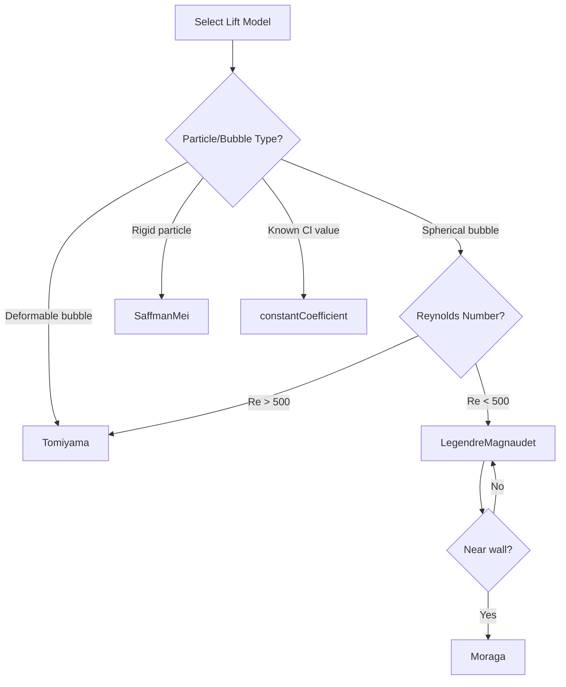

# Specific Lift Models

โมเดล Lift Force เฉพาะ

---

## Learning Objectives

**What** you will learn:
- All lift coefficient models available in OpenFOAM
- Mathematical formulation for each model
- When to use each model based on flow conditions
- Computational cost comparison

**Why** it matters:
- Different models are valid for different bubble/particle types
- Using the wrong model can give qualitatively wrong lift direction
- Computational cost varies significantly between models

**How** to apply:
- Select appropriate model based on Eo, Re, and particle shape
- Implement each model in OpenFOAM with correct syntax
- Interpret model predictions in different flow regimes

---

## Prerequisites

- Understanding of lift force fundamentals (01_Fundamental_Lift_Concepts.md)
- Knowledge of Eötvös number ($Eo$) and Reynolds number ($Re$)
- Familiarity with OpenFOAM phase properties syntax

---

## Overview

| Model | Best For | Complexity | Computational Cost |
|-------|----------|------------|-------------------|
| `Tomiyama` | General bubbles with Eo dependence | Medium | Medium |
| `LegendreMagnaudet` | Spherical bubbles at intermediate Re | High | High |
| `Moraga` | Small bubbles near walls | Medium-High | Medium |
| `Saffman-Mei` | Small rigid particles | Medium | Medium |
| `constantCoefficient` | User-specified, well-characterized systems | Low | Low |

---

## 1. Tomiyama Model

### Physical Context

The **Tomiyama model** is the most widely used lift model for bubbly flows because it captures the critical **sign reversal** of the lift coefficient at $Eo \approx 4$. This sign reversal corresponds to the transition from spherical to deformable bubbles where wake asymmetry changes direction.

### Mathematical Formulation

$$C_L = \begin{cases}
\min[0.288 \tanh(0.121 Re), f(Eo)] & Eo < 4 \\
f(Eo) & 4 \leq Eo \leq 10 \\
-0.29 & Eo > 10
\end{cases}$$

where the polynomial function is:

$$f(Eo) = 0.00105Eo^3 - 0.0159Eo^2 - 0.0204Eo + 0.474$$

**Key Parameters:**
- $Eo = \frac{\Delta \rho g d^2}{\sigma}$ — Eötvös number (bubble deformability)
- $Re = \frac{\rho_c |\mathbf{u}_r| d}{\mu_c}$ — Reynolds number (inertia/viscosity ratio)

### Physical Interpretation

| Regime | $Eo$ | $C_L$ | Bubble Behavior | Lift Direction |
|--------|------|-------|-----------------|----------------|
| Spherical | < 4 | + | Small, rigid-like | **Toward wall** |
| Transition | 4-10 | Variable | Moderate deformation | Depends on Eo |
| Deformable | > 10 | -0.29 | Flattened, wobbling | **Toward center** |

### Implementation Notes

**Advantages:**
- Handles sign change automatically
- Valid for wide range of bubble sizes
- Well-validated for air-water systems

**Limitations:**
- Developed for contaminated liquids (pure water may differ)
- Assumes single bubble in infinite medium
- Less accurate for very high viscosity

**OpenFOAM Implementation:**

```cpp
lift
{
    (air in water)
    {
        type    Tomiyama;
    }
}
```

No additional coefficients required — all values computed from $Eo$ and $Re$.

---

## 2. Legendre-Magnaudet Model

### Physical Context

The **Legendre-Magnaudet model** is specifically designed for **spherical bubbles** at intermediate Reynolds numbers ($1 \lesssim Re \lesssim 500$). It blends between potential flow (inviscid) and viscous regimes based on Reynolds number and shear rate.

### Mathematical Formulation

$$C_L = C_{L,low} + (C_{L,high} - C_{L,low}) \cdot f(Re, Sr)$$

where:
- $Sr = \frac{d}{|\mathbf{u}_r|} \left| \frac{du}{dy} \right|$ — Shear Reynolds number
- $C_{L,low}$ — Low Reynolds number limit
- $C_{L,high}$ — High Reynolds number limit

**Limiting Values:**

| Regime | Condition | $C_L$ | Physical Meaning |
|--------|-----------|-------|------------------|
| Low Re | $Re \ll 1$ | 0.5 | Viscous-dominated, potential flow |
| High Re | $Re \gg 1$ | Varies with Sr | Inertia-dominated, shear-dependent |

### Physical Interpretation

The blending function accounts for:
1. **Viscous effects** at low Re → $C_L \approx 0.5$
2. **Inertial effects** at high Re → depends on vorticity and shear
3. **Transition region** → smooth interpolation

### Implementation Notes

**Advantages:**
- Theoretically rigorous for spherical bubbles
- Includes Re dependence explicitly
- Valid for moderate shear rates

**Limitations:**
- Only valid for spherical particles ($Eo < 4$)
- More complex than Tomiyama
- Requires accurate shear rate calculation
- Higher computational cost due to additional function evaluations

**OpenFOAM Implementation:**

```cpp
lift
{
    (air in water)
    {
        type    LegendreMagnaudet;
    }
}
```

No user-specified coefficients — all values computed from local flow conditions.

---

## 3. Moraga Model

### Physical Context

The **Moraga model** was developed specifically for **near-wall bubble behavior** in turbulent channel flows. It accounts for the modification of lift force due to wall proximity and turbulence effects.

### Physical Basis

The model incorporates:
- **Wall distance effects** — lift direction changes near walls
- **Turbulence modulation** — turbulent fluctuations affect bubble migration
- **Shear-dependent terms** — captures vorticity-induced lift

### Implementation Notes

**Advantages:**
- Designed for wall-bounded flows
- Captures bubble migration in pipes/channels
- Accounts for turbulence effects

**Limitations:**
- Less widely validated than Tomiyama
- Developed for specific flow configurations
- Limited documentation on range of validity
- Moderate computational cost

**OpenFOAM Implementation:**

```cpp
lift
{
    (air in water)
    {
        type    Moraga;
    }
}
```

---

## 4. Saffman-Mei Model

### Physical Context

The **Saffman-Mei model** extends the classic **Saffman lift force** for small rigid particles in shear flow. Mei provided corrections to Saffman's original analytical solution to improve accuracy at finite Reynolds numbers.

### Physical Basis

The model is based on:
- **Saffman's analytical solution** for $Re \ll 1$
- **Mei's numerical corrections** for finite $Re$
- Valid for **small, rigid particles** (not deformable bubbles)

### Implementation Notes

**Advantages:**
- Theoretically well-founded for solid particles
- Good for particle-laden flows
- Includes finite Re corrections

**Limitations:**
- Not valid for deformable bubbles
- Assumes small particle size relative to shear length scale
- Less commonly used in bubbly flow simulations

**OpenFOAM Implementation:**

```cpp
lift
{
    (air in water)
    {
        type    SaffmanMei;
    }
}
```

---

## 5. Constant Coefficient Model

### Physical Context

The **constant coefficient model** allows the user to specify a fixed value of $C_L$. This is appropriate when:
- The lift coefficient is well-characterized from experiments
- Flow conditions are within a narrow, well-understood range
- Computational efficiency is critical

### Mathematical Formulation

$$\mathbf{F}_L = -C_L \rho_c \alpha_d (\mathbf{u}_r \times \boldsymbol{\omega})$$

where $C_L$ is user-specified (typically 0.5 for spherical particles/bubbles).

### Implementation Notes

**Advantages:**
- Lowest computational cost
- Full user control
- Suitable for well-calibrated systems

**Limitations:**
- Cannot capture sign changes
- Must know correct $C_L$ value a priori
- Not adaptive to changing flow conditions
- Can give qualitatively wrong results if $C_L$ is incorrect

**OpenFOAM Implementation:**

```cpp
lift
{
    (air in water)
    {
        type                constantCoefficient;
        Cl                  0.5;
    }
}
```

**Parameter Specification:**
- `Cl` — Lift coefficient (dimensionless)
  - Typical range: -0.3 to +0.5
  - Positive: toward wall (spherical particles)
  - Negative: toward center (deformable bubbles)

---

## 6. Model Selection Guide

### Decision Tree



### Selection Table

| Application | Model | Rationale |
|-------------|-------|-----------|
| General bubbly flow | **Tomiyama** | Handles sign change, wide validity |
| Spherical bubbles, intermediate Re | **LegendreMagnaudet** | Theoretically rigorous |
| Wall-bounded bubbly flow | **Moraga** | Captures wall effects |
| Solid particles in shear | **SaffmanMei** | Designed for rigid particles |
| Well-characterized system | **constantCoefficient** | Fastest computation |
| Unknown system | **Tomiyama** | Safest default choice |

---

## 7. Computational Cost Comparison

| Model | Operations per Cell | Relative Speed | When to Use |
|-------|--------------------|----------------|-------------|
| `constantCoefficient` | 1 multiplication | **Fastest** | Production runs, well-known systems |
| `Tomiyama` | Polynomial + min() | **Medium** | General bubbly flows |
| `Moraga` | Multiple functions | **Medium** | Wall-bounded flows |
| `SaffmanMei` | Re-dependent function | **Medium** | Solid particles |
| `LegendreMagnaudet` | Blending + limit checks | **Slowest** | High-accuracy spherical bubble studies |

**Practical Impact:**
- For simple benchmark cases, speed difference is negligible
- For large industrial simulations (millions of cells), `constantCoefficient` can reduce runtime by 5-15%
- Use adaptive models (Tomiyama, LegendreMagnaudet) during development and validation
- Switch to `constantCoefficient` for production runs if validated

---

## 8. Sign of $C_L$ and Physical Interpretation

### What Determines Sign?

The sign of the lift coefficient determines **lateral migration direction**:

| Sign | Direction | Physical Mechanism |
|------|-----------|-------------------|
| $C_L > 0$ | Toward wall | Symmetric wake, pressure-driven |
| $C_L < 0$ | Toward center | Asymmetric wake, vorticity-driven |

### Tomiyama Sign Regimes

| Bubble Size | $Eo$ | $C_L$ | Direction | Physical Explanation |
|-------------|------|-------|-----------|---------------------|
| Small | < 4 | + | **Toward wall** | Nearly spherical → symmetric wake |
| Medium | 4-10 | Variable | Transition | Wake asymmetry developing |
| Large | > 10 | -0.29 | **Toward center** | Deformed → path instability |

### Practical Implications

**Pipe Flow:**
- Small bubbles accumulate near walls
- Large bubbles migrate to center → core-annular distribution
- Affects void fraction profiles and heat transfer

**Channel Flow:**
- Bubble size distribution evolves downstream
- Coalescence increases $Eo$ → migration toward center
- Impacts interfacial area concentration

---

## Key Takeaways

- **Tomiyama is the default choice** for bubbly flows — handles sign change automatically
- **LegendreMagnaudet** for high-accuracy spherical bubble studies at intermediate Re
- **Moraga** for wall-bounded flows where wall proximity matters
- **SaffmanMei** for rigid particles, not deformable bubbles
- **constantCoefficient** for production runs after validation
- **Sign reversal** at $Eo \approx 4$ is critical — wrong model = wrong direction
- **Computational cost** varies — use adaptive models during development, constant for production

---

## Concept Check

<details>
<summary><b>1. Why does $C_L$ change sign in the Tomiyama model?</b></summary>

Small bubbles ($Eo < 4$) remain **spherical** with symmetric wakes → $C_L > 0$ (toward wall). Large bubbles ($Eo > 10$) **deform** and develop asymmetric wakes with path instability → $C_L < 0$ (toward center). This sign reversal is experimentally observed and critical for predicting void fraction profiles.

</details>

<details>
<summary><b>2. When should I use LegendreMagnaudet instead of Tomiyama?</b></summary>

Use **LegendreMagnaudet** when:
- Bubbles are confirmed to be **spherical** ($Eo < 4$)
- Reynolds number is in the **intermediate range** ($1 \lesssim Re \lesssim 500$)
- You need **theoretical rigor** for validation studies

Use **Tomiyama** for general bubbly flows with unknown or varying bubble shapes.

</details>

<details>
<summary><b>3. What are the trade-offs between adaptive and constant models?</b></summary>

**Adaptive models** (Tomiyama, LegendreMagnaudet):
- ✅ Automatically respond to changing conditions
- ✅ Capture sign changes and regime transitions
- ❌ Higher computational cost
- ❌ May introduce numerical noise from derivatives

**Constant model**:
- ✅ Fastest computation
- ✅ No numerical noise
- ✅ Predictable behavior
- ❌ Must know correct $C_L$ beforehand
- ❌ Cannot adapt to regime changes

**Strategy:** Use adaptive models for development and validation, then switch to constant if a single validated value suffices for your operating range.

</details>

<details>
<summary><b>4. How do I verify my lift model is working correctly?</b></summary>

1. **Check sign:** Small bubbles should migrate toward walls, large toward center
2. **Compare profiles:** Void fraction should match experimental data
3. **Test sensitivity:** Run with different models and compare results
4. **Verify parameters:** Check that $Eo$ and $Re$ are in the valid range
5. **Monitor convergence:** Lift models can cause instability — use appropriate time steps

</details>

---

## Related Documents

- **Conceptual Overview:** [00_Overview.md](00_Overview.md) — Introduction with single example
- **Mathematical Foundation:** [01_Fundamental_Lift_Concepts.md](01_Fundamental_Lift_Concepts.md) — Derivation and theory
- **Implementation Details:** [03_OpenFOAM_Implementation.md](03_OpenFOAM_Implementation.md) — Complete setup guide

---

## Further Reading

1. **Tomiyama, A.** (1998). "Struggle with computational bubble dynamics." *Multiphase Science and Technology*, 10(4), 369-405.
2. **Legendre, D., & Magnaudet, J.** (1998). "The lift force on a spherical bubble in a viscous linear shear flow." *Journal of Fluid Mechanics*, 368, 81-126.
3. **Moraga, F. J.** et al. (2006). "Lift force in dispersed flows: A theoretical study of bubbly flows." *International Journal of Multiphase Flow*, 32(7), 823-841.
4. **Saffman, P. G.** (1965). "The lift on a small sphere in a slow shear flow." *Journal of Fluid Mechanics*, 22(2), 385-400.
5. **Mei, R.** (1992). "An approximate expression for the shear lift force on a spherical particle at finite Reynolds number." *International Journal of Multiphase Flow*, 18(1), 145-147.