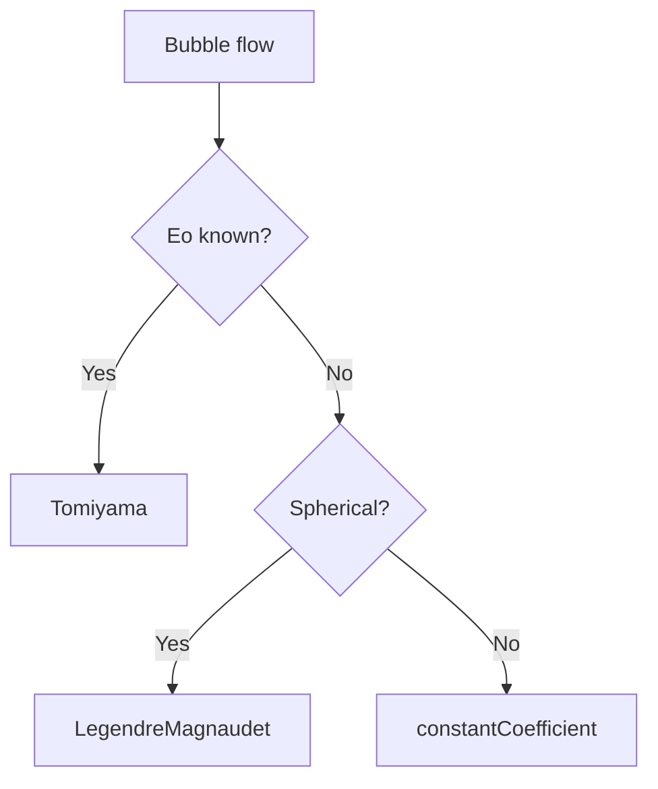

# Specific Lift Models

โมเดล Lift Force เฉพาะ

---

## Overview

| Model | Best For |
|-------|----------|
| `Tomiyama` | General bubbles with Eo dependence |
| `LegendreMagnaudet` | Spherical bubbles |
| `Moraga` | Small bubbles |
| `Saffman-Mei` | Small rigid particles |

---

## 1. Tomiyama Model

### Equation

$$C_L = \begin{cases}
\min[0.288 \tanh(0.121 Re), f(Eo)] & Eo < 4 \\
f(Eo) & 4 \leq Eo \leq 10 \\
-0.29 & Eo > 10
\end{cases}$$

where $f(Eo) = 0.00105Eo^3 - 0.0159Eo^2 - 0.0204Eo + 0.474$

### Key Feature

- **Sign change** at Eo ≈ 4
- Small bubbles → toward wall
- Large bubbles → toward center

### OpenFOAM

```cpp
lift { (air in water) { type Tomiyama; } }
```

---

## 2. Legendre-Magnaudet Model

### Equation

$$C_L = C_{L,low} + (C_{L,high} - C_{L,low}) \cdot f(Re)$$

| Regime | $C_L$ |
|--------|-------|
| Low Re | 0.5 (inviscid) |
| High Re | Varies with Sr |

### OpenFOAM

```cpp
lift { (air in water) { type LegendreMagnaudet; } }
```

---

## 3. Moraga Model

### Use Case

- Near-wall bubble behavior
- Accounts for wall effects

### OpenFOAM

```cpp
lift { (air in water) { type Moraga; } }
```

---

## 4. Constant Coefficient

### Equation

$$\mathbf{F}_L = -C_L \rho_c \alpha_d (\mathbf{u}_r \times \boldsymbol{\omega})$$

### OpenFOAM

```cpp
lift
{
    (air in water)
    {
        type    constantCoefficient;
        Cl      0.5;
    }
}
```

---

## 5. Model Selection



---

## 6. Sign of Cl

| Bubble Size | Eo | $C_L$ Sign | Direction |
|-------------|-----|------------|-----------|
| Small | < 4 | + | Toward wall |
| Large | > 10 | - | Toward center |

---

## Quick Reference

| Model | Key Variable | Default |
|-------|--------------|---------|
| Tomiyama | Eo | Adaptive |
| LegendreMagnaudet | Re, Sr | Adaptive |
| constantCoefficient | — | User-specified |

---

## Concept Check

<details>
<summary><b>1. ทำไม $C_L$ เปลี่ยน sign?</b></summary>

เพราะ bubble ใหญ่ **deform** → wake asymmetry reverses → lift direction reverses
</details>

<details>
<summary><b>2. Tomiyama model ดีกว่า constant อย่างไร?</b></summary>

**Adapts to Eo** — ไม่ต้องกำหนดค่าเอง และ handles sign change automatically
</details>

<details>
<summary><b>3. LegendreMagnaudet ใช้เมื่อไหร่?</b></summary>

เมื่อ bubble เป็น **spherical** และต้องการ dependence บน Re และ shear rate
</details>

---

## Related Documents

- **ภาพรวม:** [00_Overview.md](00_Overview.md)
- **Fundamental Concepts:** [01_Fundamental_Lift_Concepts.md](01_Fundamental_Lift_Concepts.md)
- **OpenFOAM Implementation:** [03_OpenFOAM_Implementation.md](03_OpenFOAM_Implementation.md)